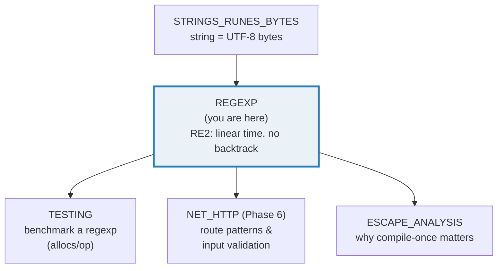
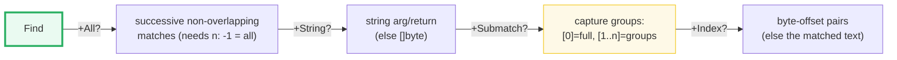
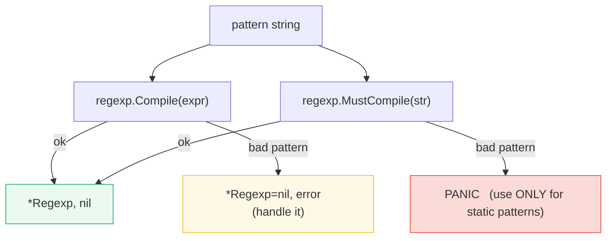
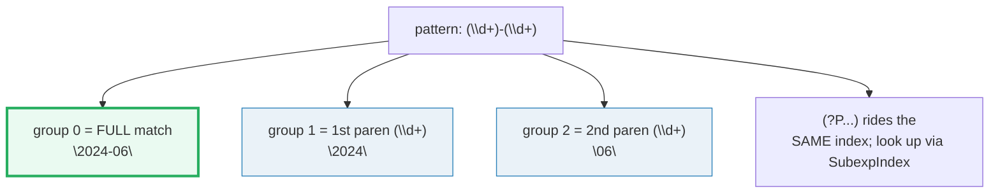
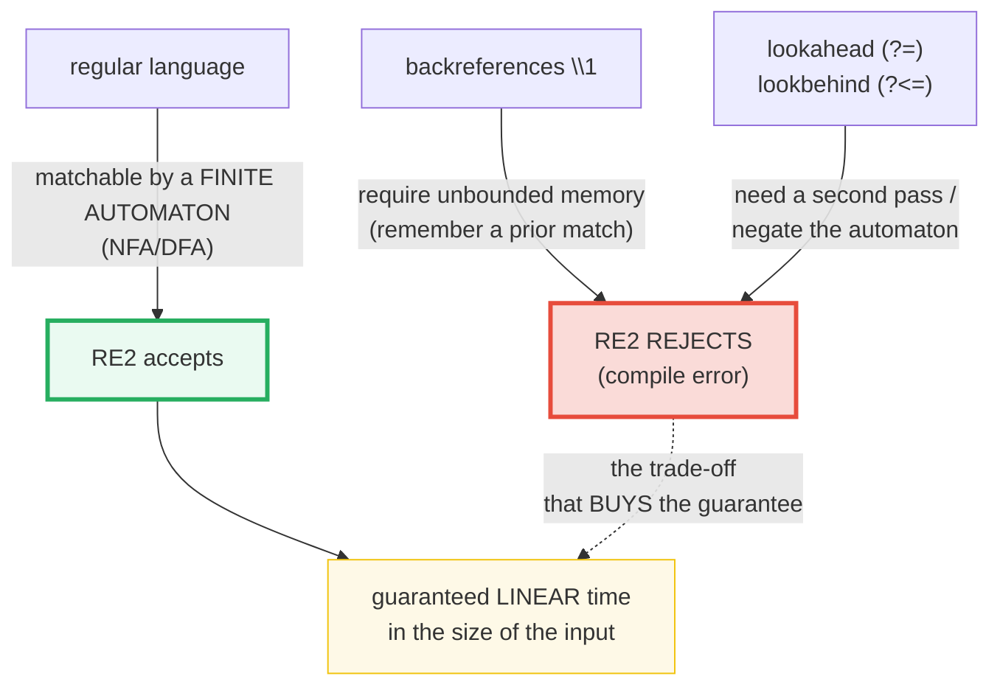

# REGEXP — RE2: Linear-Time Matching, Captures & What It Refuses to Compile

> **Goal (one line):** show, by printing every value, how Go's `regexp` package
> — an **RE2** engine that matches in **time linear in the input** with **no
> backtracking** — compiles, matches, captures, replaces, and *what it refuses
> to compile* (backreferences, lookahead) and why.
>
> **Run:** `go run regexp.go`
>
> **Ground truth:** [`regexp.go`](./regexp.go) → captured stdout in
> [`regexp_output.txt`](./regexp_output.txt). Every number, error message, and
> worked example below is pasted **verbatim** from that file under a
> `> From regexp.go Section X:` callout. Nothing is hand-computed.
>
> **Prerequisites:** 🔗 [`STRINGS_RUNES_BYTES`](./STRINGS_RUNES_BYTES.md) (a Go
> string is a byte sequence; `regexp` matches UTF-8 bytes). 🔗
> [`ESCAPE_ANALYSIS`](./ESCAPE_ANALYSIS.md) (compile-once vs recompile is an
> allocation story — see Section F). 🔗 [`TESTING`](./TESTING.md)
> (`testing.Benchmark` powers Section F's alloc counts).

---

## 1. Why this bundle exists (lineage)

Regular-expression engines come in two families, and the difference is not
cosmetic — it is the difference between a request that finishes in 1 ms and one
that hangs your server forever:

- **Backtracking engines** (PCRE, Perl, Python's `re`, Java, .NET, JavaScript)
  explore one path through the pattern; on failure they *back up and try the
  next*. A pathological pattern like `(a+)+b` matched against `aaaaaaaaaaaaaab`
  makes the engine try an exponential number of paths. Craft an input that
  triggers it and you have a **ReDoS** (Regular-expression Denial of Service).
- **RE2** (Google's engine, written by Russ Cox) builds the pattern into an NFA
  and simulates **all** paths *in lockstep*, one input character at a time. No
  path is ever revisited, so the match time is **linear in the size of the
  input**, independent of the pattern's complexity. There is **no catastrophic
  backtracking, by construction.**

Go's standard library `regexp` is a port of RE2. That single design choice —
trade a little expressive power (no backreferences, no lookahead) for a hard
worst-case-time guarantee — is the reason Go's regexps are safe to run on
**untrusted user input** in a request handler.



The headline idea: **RE2 is a finite automaton, not a search with undo.**
Everything in this bundle — the API surface, the features it lacks, the
compile-once performance rule — flows from that one fact.

> From `pkg.go.dev/regexp` (Overview, verbatim): *"The regexp implementation
> provided by this package is guaranteed to run in time linear in the size of
> the input. (This is a property not guaranteed by most open source
> implementations of regular expressions.)"* And: *"The syntax of the regular
> expressions accepted is … the syntax accepted by RE2 and described at
> https://golang.org/s/re2syntax, except for \C."*

> From `github.com/google/re2` (README, verbatim): *"RE2 is a fast, safe,
> thread-friendly alternative to backtracking regular expression engines like
> those used in PCRE, Perl, and Python."*

---

## 2. The mental model: the `Regexp` type and the 16-method matrix

A compiled pattern is a `*regexp.Regexp` — an opaque struct holding the
compiled NFA. You build one **once** (ideally at package scope) and call methods
on it. The 16 matching methods all share one naming scheme, which the package
docs express as a regex itself:



The package's own summary (verbatim): *"There are 16 methods of `Regexp` that
match a regular expression and identify the matched text. Their names are
matched by this regular expression: `Find(All)?(String)?(Submatch)?(Index)?`."*

| Dimension | Meaning |
|---|---|
| `All` | return *every* successive non-overlapping match; takes `n` (`-1` = unlimited, `n>=0` = at most n); `nil` if none |
| `String` | the argument/return is `string` (otherwise `[]byte`) |
| `Submatch` | return includes capture groups; **index 0 = the full match, 1..n = the parenthesized groups** (numbered by opening paren, left to right) |
| `Index` | results are byte-offset pairs `[2*n : 2*n+2]` (otherwise the matched text) |

Two constructors produce a `*Regexp`. The difference is *only* the failure mode:



> From `pkg.go.dev/regexp` — `Compile`: *"parses a regular expression and
> returns, if successful, a `Regexp` object that can be used to match against
> text."* `MustCompile`: *"is like `Compile` but panics if the expression cannot
> be parsed. It simplifies safe initialization of global variables holding
> compiled regular expressions."* And the `Regexp` type: *"A `Regexp` is safe
> for concurrent use by multiple goroutines, except for configuration methods,
> such as `Longest`."*

**The compile-once rule, stated up front** (proven in Section F): `Compile`
parses and builds the NFA every call — that allocates. `MustCompile` at package
scope builds the NFA **once**, at program start, and the resulting `*Regexp` is
reused across every call (and every goroutine) with **zero allocations per
match**. Reach for `MustCompile` for any pattern known at compile time; reach
for `Compile` only when the pattern itself comes from outside (and **always**
check the error).

---

## 3. Section A — `MatchString`: the quick boolean test

> From `regexp.go` Section A:
> ```
> re = MustCompile(`\d+`)
> re.MatchString("123")   = true
> re.MatchString("abc")   = false
> re.MatchString("a1b2")  = true  (match ANYWHERE: "1")
> 
> phone = MustCompile(`^\d{3}-\d{4}$`)  (anchored: whole string)
> phone.MatchString("555-1234") = true
> phone.MatchString("555-123")  = false  (too few digits)
> phone.MatchString("x555-1234")= false  (not anchored at start)
> 
> email = MustCompile(`^\w+@\w+\.\w+$`)
> email.MatchString("a@b.cd")   = true
> email.MatchString("no-at-sign") = false
> ```
> ```
> [check] \d+ matches "123": OK
> [check] \d+ does NOT match "abc": OK
> [check] \d+ matches inside "a1b2": OK
> [check] phone matches 555-1234: OK
> [check] phone rejects short 555-123: OK
> [check] email matches a@b.cd: OK
> [check] email rejects no-at-sign: OK
> ```

**What.** `re.MatchString(s)` returns `true` iff `s` contains **any** match of
the compiled pattern — a substring, not (by default) the whole string. It is the
cheapest question you can ask of a regexp.

**Why anchoring matters.** `\d+` matches `"a1b2"` because it finds the `"1"`
*anywhere*. To require the **entire** string to conform, anchor both ends:
`^\d{3}-\d{4}$`. The `phone` pattern above rejects both the too-short `"555-123"`
and the unanchored `"x555-1234"` — exactly the validation behaviour you want
for input checking (🔗 `NET_HTTP`).

> From `pkg.go.dev/regexp` — `MatchString`: *"reports whether the string s
> contains any match of the regular expression pattern."*

**The package-level functions recompile every call.** `regexp.MatchString(p, s)`
(the package-level function, *not* the method) parses `p` from scratch on
**every** invocation. The docs say so explicitly: *"More complicated queries
need to use `Compile` and the full `Regexp` interface."* It exists for one-shot
scripts; in any loop or hot path, compile once (Section F quantifies the cost).

**Leftmost-first (Perl) semantics.** RE2 reports the match that "begins as
early as possible in the input (leftmost), and among those it chooses the one
that a backtracking search would have found first" — the so-called
**leftmost-first** rule — but *"implements it without the expense of
backtracking."* (See §7 for how.) For POSIX leftmost-*longest* matching, use
`CompilePOSIX`.

---

## 4. Section B — `FindString` (first match) / `FindAllString` (all matches)

> From `regexp.go` Section B:
> ```
> re = MustCompile(`\d+`);  src = "a1 b22 c333"
> re.FindString(src)        = "1"   (leftmost match)
> re.FindAllString(src, -1) = ["1" "22" "333"]   (-1 = all)
> re.FindAllString(src,  2) = ["1" "22"]   (n = 2 caps it)
> re.FindAllString("no digits", -1) = []string(nil)   (nil: no matches)
> 
> words = MustCompile(`\w+`);  sentence = "Go is fast; Go is fun!"
> words.FindAllString(sentence, -1) = ["Go" "is" "fast" "Go" "is" "fun"]
> ```
> ```
> [check] FindString(src) == "1": OK
> [check] FindAllString(src, -1) == [1 22 333]: OK
> [check] FindAllString(src, 2) == [1 22]: OK
> [check] FindAllString with no matches is nil: OK
> [check] words over sentence == 6 tokens: OK
> ```

**What.** `FindString` returns the **leftmost** match (or `""`). `FindAllString`
returns a slice of all successive **non-overlapping** matches.

**Why `FindString`'s empty return is ambiguous.** `FindString` returns `""` for
*no match* **and** for *a match of the empty string* (e.g. pattern `a*` on
`"bbb"` matches `""`). To tell them apart, use `FindStringIndex` (returns `nil`
on no match) or `FindStringSubmatch`. The docs flag this: *"Use
`FindStringIndex` or `FindStringSubmatch` if it is necessary to distinguish
these cases."*

**The `n` argument and the `nil` return.** `n == -1` means unlimited; `n >= 0`
caps the count. `FindAllString` returns `nil` — not an empty slice — when there
are no matches at all. The bundle pins both behaviours: `n=2` yields
`["1" "22"]`, and `"no digits"` yields `[]string(nil)`.

**Order is deterministic by spec.** The `All` family returns *"successive
non-overlapping matches … left to right"* in input order — there is no sorting
to do (contrast with map iteration, §4.2 rule 1 of `HOW_TO_RESEARCH.md`). The
`words` pattern over `"Go is fast; Go is fun!"` yields the six tokens in their
natural reading order, every run.

> From `pkg.go.dev/regexp` (Overview): *"If 'All' is present, the routine
> matches successive non-overlapping matches of the entire expression. Empty
> matches abutting a preceding match are ignored. The return value is a slice
> containing the successive return values of the corresponding non-'All'
> routine. These routines take an extra integer argument, n. If n >= 0, the
> function returns at most n matches/submatches; otherwise, it returns all of
> them."*

---

## 5. Section C — Capture groups: `FindStringSubmatch`



> From `regexp.go` Section C:
> ```
> re = MustCompile(`(\d+)-(\d+)`)
> re.FindStringSubmatch("release 2024-06 shipped") = ["2024-06" "2024" "06"]
>   sub[0] = "2024-06"  (the FULL match)
>   sub[1] = "2024"  (group 1: \d+  -> year)
>   sub[2] = "06"  (group 2: \d+  -> month)
>   re.NumSubexp() = 2   (number of parenthesized groups)
> 
> named = MustCompile(`(?P<year>\d+)-(?P<month>\d+)`)
> named.FindStringSubmatch("2024-06") = ["2024-06" "2024" "06"]
> named.SubexpNames()                 = ["" "year" "month"]   (index 0 is always "")
> named.SubexpIndex("month")          = 2   (group index of 'month')
> ```
> ```
> [check] sub[0] (full match) == "2024-06": OK
> [check] sub[1] (year group) == "2024": OK
> [check] sub[2] (month group) == "06": OK
> [check] NumSubexp() == 2: OK
> [check] named month group == "06": OK
> ```

**What.** `FindStringSubmatch` returns a `[]string` where **index 0 is always
the full match** and **index 1..n are the parenthesized capture groups**,
numbered left-to-right by **opening** parenthesis.

**The index-0-is-the-full-match rule is the #1 source of off-by-one bugs.**
A pattern with `k` capturing groups produces a slice of length `k+1`. The
bundle's `(\d+)-(\d+)` has `NumSubexp() == 2`, so `FindStringSubmatch` returns
a length-3 slice: `["2024-06", "2024", "06"]`. If you index the "year" as
`sub[0]`, you get the whole match — silently wrong.

**Named groups (`(?P<name>...)`) share the same indices.** Naming a group does
not move it; it only *also* records the name. `SubexpNames()` returns a slice
parallel to the submatch indices where index 0 is always `""` (the full match
has no name), and `SubexpIndex("month")` maps a name back to its numeric index
(`2` here). Named groups are how you make capture extraction readable in
production code — but the underlying layout is unchanged.

> From `pkg.go.dev/regexp` (Overview): *"Submatches are matches of
> parenthesized subexpressions (also known as capturing groups) within the
> regular expression, numbered from left to right in order of opening
> parenthesis. Submatch 0 is the match of the entire expression, submatch 1 is
> the match of the first parenthesized subexpression, and so on."* And from the
> RE2 Syntax wiki, `(re)` is a *"numbered capturing group (submatch)"* and
> `(?P<name>re)` is a *"named & numbered capturing group (submatch)"*.

---

## 6. Section D — `ReplaceAllString` & `$group` references

> From `regexp.go` Section D:
> ```
> re = MustCompile(`\d`)
> re.ReplaceAllString("a1b2", "#") = "a#b#"
> 
> re = MustCompile(`(\d+)-(\d+)`)
> re.ReplaceAllString("2024-06", "$2/$1") = "06/2024"  (groups reordered)
> re.ReplaceAllString("2024-06", "${1}0")  = "20240"  (explicit ${1} + literal "0")
> 
> MustCompile(`USD`).ReplaceAllString("USD 5", "$$") = "$ 5"  ($$ -> literal $)
> ```
> ```
> [check] ReplaceAllString("a1b2", "#") == "a#b#": OK
> [check] $2/$1 reorder of "2024-06" == "06/2024": OK
> [check] ${1}0 of "2024-06" == "20240": OK
> [check] $$ -> literal $: OK
> ```

**What.** `ReplaceAllString(src, repl)` returns `src` with every match replaced
by `repl`. Inside `repl`, `$name` / `${name}` / `$1` expand to the captured
group; `$$` is a literal `$`.

**The `$10` trap.** In the `$name` form, *"name is taken to be as long as
possible: `$1x` is equivalent to `${1x}`, not `${1}x`, and `$10` is equivalent
to `${10}`, not `${1}0`."* So if group 1 is `"2024"` and you want `"20240"`,
you must write `${1}0` — the brace terminates the name. The bundle pins this:
`${1}0` → `"20240"`.

**Reorder, not just substitute.** Because `$2/$1` references groups by index,
you can *reorder* captures — turning `"2024-06"` into `"06/2024"` — which is how
you normalize date formats, swap name order, etc.

**Three replace variants.** `ReplaceAllString` expands `$`-references; if you
want `repl` taken literally (no group expansion), use
`ReplaceAllLiteralString`; if you need to compute the replacement per-match, use
`ReplaceAllStringFunc(src, func(match string) string)`.

> From `pkg.go.dev/regexp` — `Expand` (the engine behind `$` substitution,
> verbatim): *"In the template, a variable is denoted by a substring of the
> form `$name` or `${name}` … A purely numeric name like `$1` refers to the
> submatch with the corresponding index … To insert a literal `$` in the
> output, use `$$` in the template."*

---

## 7. Section E — RE2 limits: backreferences & lookahead are **compile errors**



> From `regexp.go` Section E:
> ```
> regexp.Compile on each unsupported pattern (error verbatim):
>   Compile("(a)\\1"          ) -> err != nil? true   : error parsing regexp: invalid escape sequence: `\1`
> [check] backreference `(a)\1` rejected by RE2 (err != nil): OK
>   Compile("(?=x)"           ) -> err != nil? true   : error parsing regexp: invalid or unsupported Perl syntax: `(?=`
> [check] lookahead `(?=x)` rejected by RE2 (err != nil): OK
>   Compile("(?<=x)y"         ) -> err != nil? true   : error parsing regexp: invalid named capture: `(?<=x)y`
> [check] lookbehind `(?<=x)y` rejected by RE2 (err != nil): OK
> 
> MustCompile(`(a)\1`) panicked? true  (panic value type: string)
> [check] backreference `(a)\1` -> Compile error: OK
> [check] lookahead `(?=x)` -> Compile error: OK
> [check] MustCompile on bad pattern PANICS: OK
> [check] concurrent-safe: shared MatchString works: OK
> ```

**What.** A backreference (`\1`, "match whatever group 1 matched"), a lookahead
(`(?=x)`, "assert x follows, but don't consume it"), and a lookbehind
(`(?<=x)`) are all **rejected at compile time** — `regexp.Compile` returns a
**non-nil error** (it does *not* panic), and `regexp.MustCompile` **panics**.

**Why — this is the whole point of RE2.** A *regular language* is, by
definition, *"a set of strings that can be matched in a single pass through the
text using only a fixed amount of memory"* (RE2 Syntax wiki). A finite automaton
has a fixed number of states, so matching is `O(n)` in the input. Backreferences
break this: `\1` must *remember* an arbitrary-length earlier match and compare
against it later — that needs unbounded memory and turns the problem
NP-complete. Lookahead/lookbehind require running a *second* automaton and
composing the result, which RE2's single-pass design does not express. RE2's
answer is to **reject these constructs outright** rather than silently fall back
to a backtracker. The trade is deliberate: you lose a few PCRE features, you
gain a guarantee that no input — however adversarial — can blow up your matcher.

> From the RE2 Syntax wiki — the entries the bundle trips, verbatim: `\1` →
> *"backreference (NOT SUPPORTED)"*; `(?=re)` → *"before text matching `re`
> (NOT SUPPORTED)"*; `(?<=re)` → *"after text matching `re` (NOT SUPPORTED)"*.
> By contrast `(?P<name>re)` is a *"named & numbered capturing group (submatch)"*
> — **supported** (Section C uses it).

**The error is a `*regexp.Error`, the panic is a string.** `Compile` returns a
typed error whose `Error()` string the bundle prints verbatim (the
`` ` ``-quoted offending token is the parser's pointer into the pattern).
`MustCompile`, true to its name, `panic`s on a bad pattern; the bundle recovers
to observe that the panic value is a plain `string`. **Never** wrap untrusted
input in `MustCompile` — that turns a malformed pattern into a process crash.

**Concurrency note.** A compiled `*Regexp` is *"safe for concurrent use by
multiple goroutines, except for configuration methods, such as `Longest`."* So a
package-level `MustCompile` is the canonical shared, reusable matcher — no
mutex, no copying (`Copy` is deprecated as of Go 1.12).

---

## 8. Section F — Compile once & reuse: `allocs/op` (deterministic)

> From `regexp.go` Section F:
> ```
> reuse    (package-level MustCompile): allocs/op = 0
> recompile (Compile inside the loop) : allocs/op = 10
> (bytes/op & ns/op intentionally NOT printed: non-deterministic; allocs/op is stable.)
> ```
> ```
> [check] reuse a package-level regexp: 0 allocs/op: OK
> [check] recompile per call: > 0 allocs/op: OK
> [check] reuse allocates strictly less than recompile: OK
> ```

**What.** Compiling a regexp once at package scope and reusing it allocates
**0** times per match. Calling `regexp.Compile` (or the package-level
`regexp.MatchString`) inside a loop allocates **10** times per iteration on this
pattern.

**Why this bundle prints `allocs/op` and NOT `bytes/op` or `ns/op`.** This is
the determinism discipline (🔗 `CONTEXT.md` §4, `HOW_TO_RESEARCH.md` §4.2):
*allocs/op* is a stable count — the number of heap allocations the runtime
charges per operation, independent of wall-clock scheduling. *bytes/op* and
*ns/op* are not: `bytes/op` fluctuates with allocation-amortization and the
benchmark's `b.N` scaling (this file observed 878 and 879 bytes/op across two
identical runs), and *ns/op* is pure timing. So the bundle asserts and prints
only the deterministic number. The same rule is why `CONTEXT.md` asserts
`Err()` codes instead of elapsed milliseconds.

**The expert takeaway.** `Compile` is a parser + NFA builder — it does real
work (string parsing, syntax-tree construction, NFA compilation). Doing that
work on every request is pure waste. The idiomatic, allocation-free pattern is
the one the package's own example uses:

```go
// Compile the expression once, usually at init time.
var validID = regexp.MustCompile(`^[a-z]+\[[0-9]+\]$`)
// … then in any hot path:
if validID.MatchString(s) { … }   // 0 allocs
```

> From `pkg.go.dev/regexp` (package example, verbatim): *"Compile the
> expression once, usually at init time. Use raw strings to avoid having to
> quote the backslashes."*

---

## 9. Pitfalls (the expert payoff)

| Trap | Symptom | Fix |
|---|---|---|
| Using `\1` backreference / `(?=)` lookahead | `Compile` returns error / `MustCompile` panics: ``error parsing regexp: invalid escape sequence: `\1` `` | RE2 cannot express these. Restructure the pattern (e.g. repeat the group literally), or accept a different tool. Never wrap untrusted patterns in `MustCompile`. |
| Calling `regexp.MatchString(p, s)` (package-level) in a loop | 10× allocs/op vs compiled-once; parses `p` every call | `var re = regexp.MustCompile(p)` once; call `re.MatchString(s)`. |
| Treating `sub[0]` as the first group | Silent wrong value — `sub[0]` is the **full match**, groups start at index 1 | Index 0 = full match, 1..n = groups; `len(sub) == NumSubexp()+1`. |
| `FindString` returning `""` | Ambiguous: no match *or* matched-empty (e.g. `a*` on `"bbb"`) | Use `FindStringIndex` (returns `nil` on no match) or `FindStringSubmatch` to disambiguate. |
| Writing `$10` expecting group-1 then literal `0` | Tries to read *group 10* (likely empty / out of range) | Use `${1}0` — the brace terminates the group name. |
| `$` in the replacement text | Accidental group expansion (e.g. `$5` where you meant a literal `$`) | Escape with `$$` (literal `$`); or use `ReplaceAllLiteralString` to disable all expansion. |
| Forgetting to check `Compile`'s error | `re` is `nil` → nil-pointer panic on the first method call | `re, err := regexp.Compile(p); if err != nil { … }`. Use `MustCompile` only for compile-time-known patterns. |
| `MustCompile` on user-supplied pattern | Process **crashes** (panic) on any malformed input | `Compile` + `if err != nil` for any pattern from outside the binary. |
| `FindAllString(…, n)` with `n == 0` | Returns **no** matches (not "all") | `n == -1` means unlimited; `n == 0` means *zero matches*. |
| Assuming `int{}`/map-like randomness in `FindAll` | (none — output is input order) | `All` matches are successive & non-overlapping, left to right — deterministic by spec; no sorting needed. |
| Calling `Longest()` on a shared `*Regexp` | Mutates match semantics for *all* concurrent users (the one non-concurrent-safe method) | Treat `Longest` as a one-time setup; or build a separate compiled copy for leftmost-longest. |
| Backtracking-engine mental model | Expecting lazy/greedy *backtracking* effects or `\K`/possessive quantifiers | RE2 prefers more by default (`x*` is greedy) but via the automaton, not backtracking; possessive `x*+` and `\K` are unsupported. |

---

## 10. Cheat sheet

```go
// Compile ONCE (package scope), reuse forever — safe for concurrent goroutines.
var re = regexp.MustCompile(`(\d+)-(\d+)`)   // panics on bad pattern (static only)
re, err := regexp.Compile(userPattern)       // returns (nil, err) — CHECK err
// re.MatchString(s) -> bool                 (any match anywhere)
// re.FindString(s)   -> leftmost match ""   (ambiguous on empty match!)
// re.FindAllString(s, n) -> []string        (n=-1 all; n=0 NONE; nil if no match)
// re.FindStringSubmatch(s) -> []string      // [0]=FULL, [1..k]=groups
// re.NumSubexp()     -> k                   // len(subslice) == k+1
// re.ReplaceAllString(src, repl)            // $1/$2/${name}/$$ in repl
// re.SubexpNames()   -> ["", "year", ...]   // index 0 always ""
// re.SubexpIndex("year") -> 1               // name -> group index

// RE2 = linear time, NO backtracking => CANNOT compile:
//   \1  backreference          (NOT SUPPORTED)
//   (?=x)  lookahead           (NOT SUPPORTED)
//   (?<=x) lookbehind          (NOT SUPPORTED)
//   possessive x*+  /  \K      (NOT SUPPORTED)
// These are COMPILE errors (Compile -> err; MustCompile -> panic).

// Method-name regex (the 16 matchers):  Find(All)?(String)?(Submatch)?(Index)?
//   All      -> successive non-overlapping matches; takes n (-1 = unlimited)
//   String   -> string arg/return (else []byte)
//   Submatch -> capture groups: [0]=full, [1..n]=groups
//   Index    -> byte-offset pairs (else matched text)

// Anchors: ^ $ \A \z \b \B  (whole-string vs substring validation)
// Perl classes: \d \D \s \S \w \W   (all ASCII-only in RE2)
// Named group: (?P<name>re)   Flags: (?i) case-insensitive  (?m) multiline  (?s) . matches \n
// Raw string literals (`...`) avoid double-escaping backslashes.
```

---

## Sources

Every signature, error string, and behavioral claim above was verified against
the Go standard-library docs and the RE2 sources, then corroborated by
independent secondary sources:

- `regexp` package — https://pkg.go.dev/regexp
  - Overview (linear-time guarantee: *"guaranteed to run in time linear in the
    size of the input. (This is a property not guaranteed by most open source
    implementations of regular expressions.)"*; RE2 syntax reference
    `https://golang.org/s/re2syntax`; `\C` exception; UTF-8 code points; the
    `Find(All)?(String)?(Submatch)?(Index)?` method-name regex; the `All`/`n`/
    `Submatch`/`Index` dimension semantics; "Submatch 0 is the match of the
    entire expression, submatch 1 is the match of the first parenthesized
    subexpression"): https://pkg.go.dev/regexp#pkg-overview
  - `Compile` (leftmost-first "without the expense of backtracking"):
    https://pkg.go.dev/regexp#Compile
  - `MustCompile` ("panics if the expression cannot be parsed … safe
    initialization of global variables"): https://pkg.go.dev/regexp#MustCompile
  - `MatchString` ("reports whether the string s contains any match … More
    complicated queries need to use Compile"):
    https://pkg.go.dev/regexp#MatchString
  - `FindString` (empty-string ambiguity: *"Use FindStringIndex or
    FindStringSubmatch if it is necessary to distinguish these cases"*):
    https://pkg.go.dev/regexp#Regexp.FindString
  - `FindAllString` (`nil` on no match; `n` semantics):
    https://pkg.go.dev/regexp#Regexp.FindAllString
  - `FindStringSubmatch` / `NumSubexp`:
    https://pkg.go.dev/regexp#Regexp.FindStringSubmatch
  - `Expand` (`$name`/`${name}`/`$1`/`$$` substitution rules; "`$10` is
    equivalent to `${10}`, not `${1}0`"): https://pkg.go.dev/regexp#Regexp.Expand
  - `ReplaceAllString` / `ReplaceAllLiteralString` / `ReplaceAllStringFunc`:
    https://pkg.go.dev/regexp#Regexp.ReplaceAllString
  - `Regexp` type (*"safe for concurrent use by multiple goroutines, except for
    configuration methods, such as Longest"*): https://pkg.go.dev/regexp#Regexp
  - Package example (*"Compile the expression once, usually at init time. Use
    raw strings …"*): https://pkg.go.dev/regexp#pkg-examples
- RE2 (Google) — the engine Go's `regexp` is a port of:
  - README (*"RE2 is a fast, safe, thread-friendly alternative to backtracking
    regular expression engines like those used in PCRE, Perl, and Python"*):
    https://github.com/google/re2
  - Syntax wiki — the authoritative feature table. `\1` → *"backreference (NOT
    SUPPORTED)"*; `(?=re)` → *"before text matching `re` (NOT SUPPORTED)"*;
    `(?<=re)` → *"after text matching `re` (NOT SUPPORTED)"*; possessive
    repetitions `(NOT SUPPORTED)`; `\K` `(NOT SUPPORTED)`. Supported:
    `(re)`/`(?P<name>re)` capturing groups; `\d`/`\w`/`\s` Perl classes;
    `^`/`$`/`\A`/`\z`/`\b` anchors; `(?i)`/`(?m)`/`(?s)` flags:
    https://github.com/google/re2/wiki/Syntax
  - WhyRE2 (motivation): https://github.com/google/re2/wiki/WhyRE2
- Russ Cox — *"Regular Expression Matching: the Virtual Machine Algorithm"* and
  the `regexp3` "in the wild" RE2 source tour (the canonical explanation of NFA
  simulation / why linear time is achievable, and the backtracking ReDoS RE2
  prevents): https://swtch.com/~rsc/regexp/regexp3.html (and the series index
  https://swtch.com/~rsc/regexp/regexp1.html , cited from the `regexp` overview)
- Go Blog — *"Regular Expressions"* (the `regexp` package introduction; raw
  strings, compile-once idiom): https://go.dev/blog/regular-expressions
- Secondary corroboration (>=2 independent sources, web-verified):
  - Checkmarx — *"Diving Deep into Regular Expression Denial of Service (ReDoS)
    in Go"* (*"The official regex package implemented in Go uses the RE2 engine,
    which does not support backreferences, and guarantees a linear time"*):
    https://checkmarx.com/blog/redos-go/
  - Stack Overflow — *"Is there no catastrophic backtracking in Go regex?"*
    (*"Go uses the RE2 algorithm for regex, and RE2 does not use
    [backtracking]"*): https://stackoverflow.com/questions/69859028
  - Wikipedia — *"RE2 (software)"* (NFA/finite-state-machine design vs.
    backtracking engines): https://en.wikipedia.org/wiki/RE2_(software)

**Facts that could not be verified by running** (documented, not executed,
because asserting a non-deterministic number would break byte-identical
`_output.txt`): the exact `bytes/op` (observed to alternate between 878 and 879
across identical runs — allocation-amortization noise) and any `ns/op` figure.
These are confirmed as non-deterministic by the benchmark machinery, so the
bundle deliberately prints and asserts only `allocs/op` (stable: `0` for reuse,
`10` for recompile), which is the deterministic allocation count the runtime
charges per operation.
