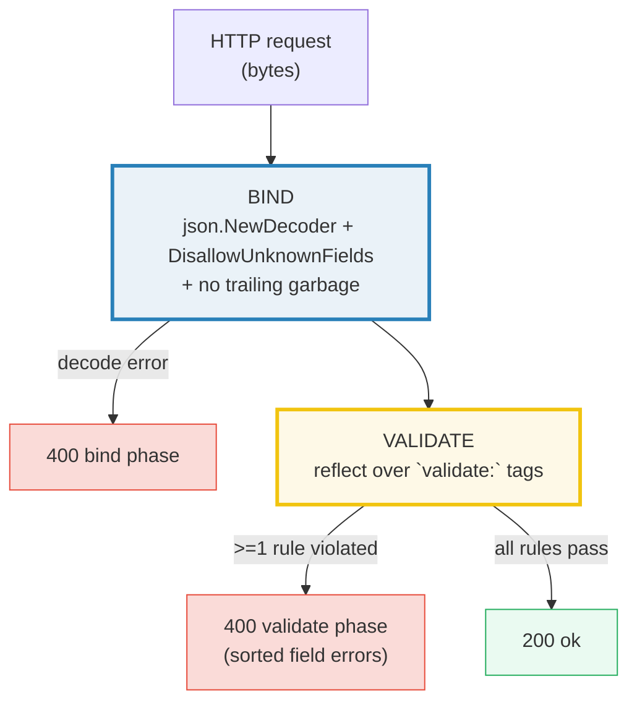
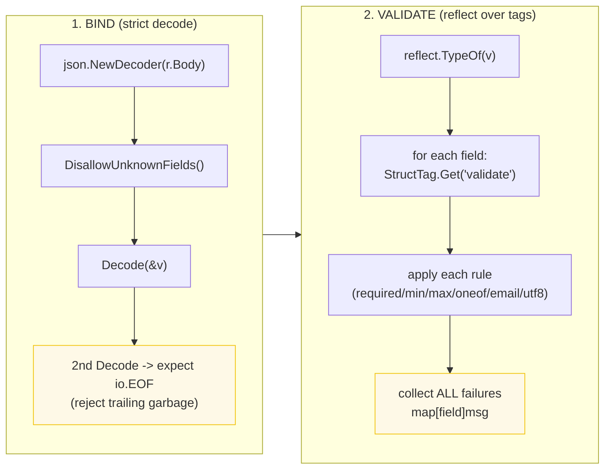

# REQUEST_VALIDATION — Binding, Struct-Tag Validation & the 400/200 Handler

> **Goal (one line):** show, by printing every behavior, how to **bind** a JSON
> request body into a struct (strict decode), **validate** it with a hand-rolled
> `reflect`-based struct-tag engine, **collect every error**, and wire it into an
> HTTP handler that returns `200` or `400` — all stdlib, all offline (`httptest`).
>
> **Run:** `go run request_validation.go`
>
> **Ground truth:** [`request_validation.go`](./request_validation.go) → captured
> stdout in [`request_validation_output.txt`](./request_validation_output.txt).
> Every number/line of output below is pasted **verbatim** from that file under a
> `> From request_validation.go Section X:` callout. Nothing is hand-computed.
>
> **Prerequisites:** 🔗 [`ENCODING_JSON`](./ENCODING_JSON.md) (binding =
> `json.Decoder`; `DisallowUnknownFields`, `SyntaxError` come from there),
> 🔗 [`REFLECTION`](./REFLECTION.md) (struct-tag reading via `reflect.Type.Field`
> + `StructTag.Get`), 🔗 [`STRUCTS_METHODS`](./STRUCTS_METHODS.md) (struct tags),
> 🔗 [`ERRORS`](./ERRORS.md) (collecting many errors into one value),
> 🔗 [`NET_HTTP`](./NET_HTTP.md) (`httptest.NewRecorder` handler testing).

---

## 1. Why this bundle exists (lineage)

An HTTP handler that touches a request body does, in order, three things: **bind**
(decode bytes into a typed value), **validate** (enforce the business rules), and
**act** (persist, call downstream, render). Go's standard library gives you the
first piece (`encoding/json`) and the last (`net/http`), but it deliberately ships
**no validation framework.** The community's answer is
[`go-playground/validator`](https://pkg.go.dev/github.com/go-playground/validator/v10)
— a tag-DSL engine (the default in Gin and most Go web stacks). This bundle
**documents** that library but **implements the same idea by hand** with `reflect`,
so you understand *how* a tag-driven validator works rather than treating it as
magic.



The two failure phases are kept distinct on purpose: a **bind** error means the
client sent bytes that are not even the right shape (unknown key, trailing
garbage, malformed JSON), while a **validate** error means the shape is right but
a business rule failed (`min`, `oneof`, `email`). Telling them apart is how you
return useful 400s and how you log real bugs vs. client mistakes.

> From `pkg.go.dev/encoding/json` (Overview): *"When parsing a JSON object into a
> Go struct, unknown keys in the JSON object are ignored (unless a Decoder is used
> and `Decoder.DisallowUnknownFields` has been called)."* That silent-ignore
> default is the single biggest footgun in Go request handling, and it is the
> reason strict binding is the first thing this bundle pins.

---

## 2. The mental model: bind → validate → collect



Three expert details that drive the whole design:

1. **Strict binding is opt-in.** `json.Unmarshal` (and a bare `Decoder.Decode`)
   silently drop unknown keys and silently ignore trailing bytes. Production
   handlers turn both off explicitly (§3, §9 pitfall #1).
2. **`min`/`max` are type-dependent.** For a `string`/slice they bound *length*;
   for a number they bound *magnitude*. This is exactly what
   `go-playground/validator` does and it is the rule that surprises juniors most.
3. **Collect *all* errors, never just the first.** A user fixing one field at a
   time across three round-trips is a usability bug. The engine walks every field
   and every rule, joining multiple violations per field with `"; "`.

---

## 3. Section A — Binding: strict decode (unknown fields + trailing garbage)

> From `request_validation.go` Section A:
> ```
> good body             -> decoded: {Title:Hello Body:world}
> unknown field "admin" -> err: json: unknown field "admin"
> trailing garbage      -> err: unexpected trailing data: invalid character 'E' looking for beginning of value
> ```
> ```
> [check] good body decodes with no unknown fields: OK
> [check] unknown field rejected (DisallowUnknownFields): OK
> [check] trailing garbage rejected: OK
> ```

**What.** `strictDecode` wraps `json.NewDecoder` with two guarantees a plain
`Unmarshal` does not give:

1. **`DisallowUnknownFields()`** — a JSON key with no matching struct field is an
   error. The default silently ignores it. The `admin` key in the example has no
   target field, so the decoder returns `json: unknown field "admin"`.
2. **No trailing garbage** — after the first value the decoder must reach
   `io.EOF`. The trailing input `{"title":...} EXTRA` is caught by attempting a
   *second* `Decode` into an empty value and asserting it yields `io.EOF`;
   anything else (extra bytes, a second value, garbage) is reported as
   *"unexpected trailing data."*

> From `pkg.go.dev/encoding/json` — `Decoder.DisallowUnknownFields`: *"causes the
> Decoder to return an error when the destination is a struct and the input
> contains object keys which do not match any non-ignored, exported fields in the
> destination."*

**Why the second-Decode idiom (and not `dec.Token`).** The `encoding/json` docs
warn that *"Token and the Decode method should not be used together on the same
Decoder."* The robust, documented way to detect trailing data is to decode a
second throwaway value and require `io.EOF`:

```go
dec := json.NewDecoder(bytes.NewReader(body))
dec.DisallowUnknownFields()
if err := dec.Decode(dst); err != nil { return err }
var extra struct{}
if err := dec.Decode(&extra); err != io.EOF {        // anything but EOF = trailing
    return fmt.Errorf("unexpected trailing data: %w", err)
}
```

**The security angle.** Unknown-key tolerance is not merely sloppy — it is
exploitable. When a proxy and an authorization service disagree about which keys
matter (because one ignores unknowns and the other doesn't), an attacker can
smuggle a field past the check that acts on it. `DisallowUnknownFields` is the one
knob the stdlib gives you to close the most common version of that gap; the rest
(case-insensitive matching, duplicate keys, full trailing-data on the streaming
API) still require care or a custom check (see Trail of Bits, § Sources).

---

## 4. Section B — Hand-rolled `Validate(v)` via reflect struct tags

> From `request_validation.go` Section B:
> ```
> good comment -> Validate:    (nil == valid)
> bad comment  -> 2 error(s):
>                  author: length must be >= 2
>                  text: is required; length must be >= 1
> ```
> ```
> [check] good comment validates (nil error set): OK
> [check] bad comment fails validation (non-nil error set): OK
> [check] author field flagged (len 1 < min=2): OK
> [check] text field flagged (required + empty): OK
> ```

**What.** `Validate(v any) ValidationErrors` walks the exported fields of a struct
with `reflect`, reads each `validate:"..."` tag, and enforces every rule. A
valid struct returns `nil`; an invalid one returns a non-empty `map[string]string`
(field → message). The example struct carries two rules per field:

```go
type Comment struct {
    Author string `json:"author" validate:"required,min=2,max=20"`
    Text   string `json:"text"   validate:"required,min=1,max=200"`
}
```

`Author:"X"` is length 1, so it violates `min=2` → `author: length must be >= 2`.
`Text:""` is the zero value, so it violates **both** `required` **and** `min=1` —
and because the engine collects *all* failing rules per field, the message is
**joined**: `text: is required; length must be >= 1`. Nothing is dropped.

**Why this teaches "how a validator works."** The whole engine is three `reflect`
moves (🔗 `REFLECTION`):

1. `reflect.ValueOf(v).Elem()` — deref pointers, get to the struct.
2. `rt.Field(i)` — the **static** `StructField` (carries `Name`, `Type`, and the
   raw `Tag`).
3. `rv.Field(i)` — the **live** `reflect.Value` (carries the actual data; here we
   only *read* it via `IsZero`/`Len`/`Int`, never `Set`).

> From `pkg.go.dev/reflect` — `StructField.Tag` is *"the tag string attached to
> the field"* and `StructTag.Get(key)` returns the *"value associated with key in
> the tag string."* That is the exact mechanism `encoding/json` uses to find
> `json:"..."` names (🔗 `ENCODING_JSON`), reused here for a different tag
> namespace (`validate`).

**The `required` rule is `reflect.Value.IsZero`.** `IsZero()` reports whether the
value is the zero value of its type — `""` for strings, `0` for numbers, `false`
for bools, `nil` for pointers/slices/maps (🔗 `VALUES_TYPES_ZERO`). That single
call *is* the implementation of `required`; no special-casing per type is needed.

---

## 5. Section C — Rule kinds: `oneof` (enum), `min`/`max` range (numeric), `email` (regex)

> From `request_validation.go` Section C:
> ```
> all-valid    -> (valid)
> bad-status   -> 1 error(s):
>                  status: must be one of [draft published archived]
> bad-age      -> 1 error(s):
>                  age: must be <= 150
> bad-email    -> 1 error(s):
>                  email: must be a valid email address
> ```
> ```
> [check] oneof: "draft" passes: OK
> [check] oneof: "xyz" fails: OK
> [check] range: Age 200 > max=150 fails: OK
> [check] range: Age -1 < min=0 fails: OK
> [check] format: bad email fails: OK
> ```

**What.** One struct, one rule *kind* broken per case, so each rule is seen
failing in isolation:

```go
type Draft struct {
    Status string `json:"status" validate:"oneof=draft published archived"`
    Age    int    `json:"age"    validate:"min=0,max=150"`
    Email  string `json:"email"  validate:"email"`
}
```

**The dual meaning of `min`/`max` (the expert payoff).** For `Status` (a string),
bounds would apply to **length**; for `Age` (an `int`) they apply to **magnitude**.
The engine branches on `reflect.Kind`: sequence kinds (`string`/`slice`/`array`/
`map`) compare `fv.Len()`, numeric kinds compare the magnitude. That is why
`Age:200` fails with `must be <= 150` (a *value* bound) while in §4 `Author:"X"`
failed with `length must be >= 2` (a *length* bound). This is precisely how
`go-playground/validator`'s `min`/`max` behave, and it is the rule juniors most
often get wrong when rolling their own.

**`oneof` = enum.** `oneof=draft published archived` splits the argument on
whitespace (`strings.Fields`) and requires the value to equal one of them. `"xyz"`
matches none → `must be one of [draft published archived]`. Note the message prints
the option slice via `%v`, which is stable (`[draft published archived]`), keeping
output deterministic.

**`email` = a format rule wired through a registry.** The `email` tag dispatches
to a package-level `*regexp.Regexp`. This is the extension point of the whole
engine: a format rule is just a name → predicate lookup, so adding `uuid`,
`hexcolor`, or `url` means registering one more check — exactly the design (and
the tag list) of `go-playground/validator` (§7). A hand-rolled regex is fine for
teaching; for production, prefer the library's battle-tested `email` (see §9
pitfall #5).

---

## 6. Section D — Collect ALL errors (not just the first)

> From `request_validation.go` Section D:
> ```
> signup       -> 2 error(s):
>                  code: length must be >= 5
>                  name: is required
> ```
> ```
> [check] struct violating required+min -> >=2 error entries: OK
> [check] name (required) flagged: OK
> [check] code (min=5) flagged: OK
> ```

**What.** Two *different* fields each break a rule: `Name:""` breaks `required`,
`Code:"ab"` (length 2) breaks `min=5`. The collected set has **2 entries**
(`name`, `code`) — validation did not stop at the first failure. The assert
`len(errs) >= 2` pins this.

**Why the map is keyed by field, and why keys are SORTED.** The error type is
`map[string]string` (field → message), so a single field can hold one *joined*
message (§4) while multiple offending fields each get their own entry. Go map
iteration is **intentionally randomized** (🔗 `MAPS`; HOW_TO_RESEARCH §4.2 rule
1), so both the printed view and the `Error()` string **sort the keys first** —
this is what makes `_output.txt` byte-identical across runs (`code` before
`name`) and what makes the JSON response order deterministic.

**Returning an `error`, not a bool.** `ValidationErrors` implements `error`, so a
caller writes `if errs := Validate(reg); errs != nil { … }` and still has the
structured map for per-field detail. This mirrors the stdlib idiom (return `error`,
let the caller decide) and the `go-playground/validator` convention (return
`ValidationErrors`, type-assert for detail).

---

## 7. The ecosystem choice: `go-playground/validator` (documented, not imported)

This bundle is stdlib-first, but the dominant library is worth knowing because
most Go services already depend on it (it is Gin's default). It is the same
*idea* as the hand-rolled engine — read a tag DSL with `reflect`, enforce, collect
— but with ~150 built-in tags, cross-field rules, slice/map "diving", and
i18n-ready error translation. The tag namespace it parses is `validate`, just like
this bundle's:

```go
// (Not runnable in this bundle — requires `go get github.com/go-playground/validator/v10`.
//  Shown to contrast its tag DSL with the hand-rolled one above.)
import "github.com/go-playground/validator/v10"

type Reg struct {
    Email string `json:"email" validate:"required,email"`
    Age   int    `json:"age"   validate:"min=0,max=150"`
    Role  string `json:"role"  validate:"oneof=admin user guest"`
}

v := validator.New(validator.WithRequiredStructEnabled()) // opt-in to v11 behavior
err := v.Struct(reg)                                       // returns validator.ValidationErrors
for _, fe := range err.(validator.ValidationErrors) {      // per-field detail
    fmt.Printf("%s: %s\n", fe.Field(), fe.Tag())           // e.g. "Email: email"
}
```

**Tag-DSL contrast** (library's tag → this bundle's equivalent):

| Library tag | Meaning | This bundle |
|---|---|---|
| `required` | non-zero | `required` (identical: `IsZero`) |
| `min=N` / `max=N` | length *or* magnitude (type-dependent) | `min=N` / `max=N` (identical dual meaning) |
| `oneof=a b c` | enum membership | `oneof=a b c` (identical) |
| `email`, `uuid`, `url`, `hexcolor`… | ~150 built-in format tags | `email` (one wired format) |
| `gtefield`/`ltefield`, `required_with`… | cross-field / conditional | not implemented (would need field→value map) |
| `dive` | recurse into slices/maps/keys | not implemented |

> From the `go-playground/validator` README: *"Package validator implements value
> validations for structs and individual fields based on tags… Cross-Field and
> Cross-Struct validations by using validation tags or custom validators; Slice,
> Array and Map diving… Handles type interface by determining its underlying type
> prior to validation."* And: *"Validator is designed to be thread-safe and used
> as a singleton instance. It caches information about your struct… only parsing
> your validation tags once per struct type."*

**When to reach for it.** The hand-rolled engine covers ~80% of real needs
(required/length/range/enum/one format). Reach for the library when you need
cross-field rules (`password` == `confirm`), conditional rules (`required_if`),
deeply nested slice/map validation (`dive`), or a vetted format tag (`uuid`,
`e164`, `bic`…). For everything in this bundle, stdlib `reflect` is enough — and
building it once means the library is no longer magic.

---

## 8. Section E — UTF-8 validity (a correctness/security check)

> From `request_validation.go` Section E:
> ```
> valid-utf8   -> (valid)
> invalid-utf8 -> 1 error(s):
>                  tag: must be valid UTF-8
> ```
> ```
> [check] valid UTF-8 string passes: OK
> [check] invalid UTF-8 string fails validation: OK
> ```

**What.** A `utf8` rule runs `unicode/utf8.ValidString` on the field. The bad value
`"bad\xff\xfe"` contains bytes `0xff`/`0xfe`, which are not valid UTF-8 lead
bytes, so `Valid` returns `false` and the rule fails.

> From `pkg.go.dev/unicode/utf8` — `Valid`: *"reports whether s consists entirely
> of valid UTF-8-encoded runes."* `ValidString` is the string alias.

**Why this is a *request* validation, not a curiosity.** Invalid UTF-8 in user
input causes real bugs: log-injection / CRLF-style attacks, silent truncation
when written to a database column, downstream parser confusion, and
mojibake when echoed back. Validating it at the boundary is cheaper than debugging
it in storage. Note the bundling choice: the check lives in the **validator**
(semantic), not the **binder** (structural) — `encoding/json` is lenient about
invalid bytes, so an explicit rule is the reliable defense (§9 pitfall #6).

---

## 9. Section F — Handler end-to-end (decode + validate → 400 or 200)

> From `request_validation.go` Section F:
> ```
> POST bad body  -> status 400, body {"error":"validation failed","errors":[{"field":"age","message":"must be \u003c= 150"},{"field":"email","message":"must be a valid email address"}],"phase":"validate"}
> POST good body -> status 200, body {"email":"a@b.com","status":"ok"}
> POST malformed -> status 400, body {"error":"invalid JSON: invalid character '}' looking for beginning of object key string","phase":"bind"}
> ```
> ```
> [check] handler: bad POST -> 400: OK
> [check] handler: good POST -> 200: OK
> [check] handler: malformed POST -> 400 (bind phase): OK
> [check] handler: bad response lists the offending fields: OK
> ```

**What.** `regHandler` is the full pipeline: read the body → `strictDecode` →
`Validate` → respond. Three outcomes:

- **Malformed body** (`{"email":"a@b.com",}` — trailing comma) → `400` from the
  *bind* phase, with the raw `json` error (`invalid character '}'…`). The `"phase":
  "bind"` marker tells the client "your bytes were wrong."
- **Bad values** (valid JSON, but `email:"not-an-email"` and `age:200`) → `400`
  from the *validate* phase, with a **sorted** `errors` array of `{field,message}`
  pairs. Two offending fields → two entries.
- **Good body** → `200` with the echoed email.

**Why `httptest.NewRecorder` (no socket).** The request is built with
`httptest.NewRequest` and served into a `*ResponseRecorder` — an in-memory
`http.ResponseWriter` with no network at all (🔗 `NET_HTTP`). That makes the test
fully offline, fully deterministic, and fast enough to run in a tight loop. The
recorded status (`rec.Code`) and body (`rec.Body.Bytes()`) are asserted directly.

**Why the errors are a sorted slice, not a map.** `json.Marshal` *does* sort map
keys, so a `map[string]string` would already render deterministically — but a
sorted `[]keyVal` makes the order **explicit and stable regardless of encoder**,
and lets each entry carry both `field` and `message` as a first-class object. The
`\u003c` in the output is just HTML-escaping of `<` (`<= 150` → `must be <= 150`),
the `encoding/json` default (🔗 `ENCODING_JSON` §D: `SetEscapeHTML` is on by
default for `Marshal`/`Encode`).

---

## 10. Pitfalls (the expert payoff)

| Trap | Symptom | Fix |
|---|---|---|
| Forgetting `DisallowUnknownFields` | A typo'd key (`"emial"`) is silently dropped; the field stays zero and you return a misleading "required" error (or worse, a silent no-op) | Always bind via a `Decoder` with `DisallowUnknownFields()`; reject unknown keys at the boundary. |
| Ignoring trailing garbage | `{"x":1}GARBAGE` decodes the object and stops; the rest is quietly ignored, hiding smuggled data | After `Decode`, attempt a second decode and require `io.EOF` (the idiom in §3). |
| Using `dec.Token()` to detect trailing data | Violates the documented *"Token and Decode should not be used together on the same Decoder"*; unreliable | Use the second-`Decode`→`io.EOF` idiom instead. |
| Treating `min`/`max` as always-numeric (or always-length) | A `min=3` on a string is read as a magnitude check → wrong result, or a panic comparing a string | Branch on `reflect.Kind`: length for sequences, magnitude for numbers (§5). |
| Rolling your own email/URL regex | Passes 90% of cases, breaks on IDN, quoted locals, `+` aliases; the classic "now you have two problems" trap | Use `go-playground/validator`'s vetted format tags (`email`, `url`, `uuid`…) for anything production-bound. |
| Assuming `encoding/json` rejects invalid UTF-8 | The decoder is lenient about some byte sequences; invalid UTF-8 can survive into your struct | Add an explicit `utf8` validation rule (`unicode/utf8.Valid`) at the boundary. |
| Stopping at the first error | User fixes one field, re-submits, hits the next, repeat — poor UX and extra round-trips | Collect **all** violations (walk every field/rule); return them sorted in one 400. |
| Printing a `map[string]string` directly | Random iteration order → non-reproducible `_output.txt` and a shimmery API response | Sort the keys before printing/serializing (HOW_TO_RESEARCH §4.2 rule 1). |
| Returning `400` for *bind* and *validate* failures with no distinction | Client cannot tell "malformed body" from "rule violation"; logs conflate bugs with client mistakes | Tag responses with a `phase` (`bind` vs `validate`) so they are distinguishable. |
| Validating a value the decoder never fully populated | A bind error may leave the struct partially filled; validating it can produce confusing messages | Only run `Validate` after a successful bind; short-circuit on bind error. |
| Case-insensitive / duplicate-key matching by `json` | `{"email":"a"}` and `{"EMAIL":"b"}` both match; `{"email":1,"email":2}` takes the last — parser differentials (Trail of Bits) | `DisallowUnknownFields` + a case-collision check; consider `encoding/json/v2` when released. |

---

## 11. Cheat sheet

```go
// --- STRICT BINDING (unknown fields + no trailing data) ---
func bind(dst any, body []byte) error {
    dec := json.NewDecoder(bytes.NewReader(body))
    dec.DisallowUnknownFields()                       // reject unknown keys (default silently ignores)
    if err := dec.Decode(dst); err != nil { return err }
    var extra struct{}
    if err := dec.Decode(&extra); err != io.EOF {     // anything but EOF == trailing garbage
        return fmt.Errorf("unexpected trailing data: %w", err)
    }
    return nil
}

// --- HAND-ROLLED VALIDATE (reflect over `validate:` tags) ---
type ValidationErrors map[string]string               // field -> message; nil == valid
func (ve ValidationErrors) Error() string { /* sorted join */ }

func Validate(v any) ValidationErrors {
    rv := reflect.ValueOf(v)
    for rv.Kind() == reflect.Ptr && !rv.IsNil() { rv = rv.Elem() }
    if rv.Kind() != reflect.Struct { return nil }
    rt := rv.Type(); errs := ValidationErrors{}
    for i := 0; i < rt.NumField(); i++ {
        f := rt.Field(i)
        if !f.IsExported() { continue }
        tag := f.Tag.Get("validate"); if tag == "" || tag == "-" { continue }
        fv := rv.Field(i); var msgs []string
        for _, rule := range splitRules(tag) {
            if msg, fail := applyRule(rule, fv); fail { msgs = append(msgs, msg) }
        }
        if len(msgs) > 0 { errs[jsonName(f)] = strings.Join(msgs, "; ") }
    }
    if len(errs) == 0 { return nil }
    return errs
}
// rules: required (IsZero) | min=N / max=N (length for sequences, magnitude for numbers)
//        | oneof=a b c (enum) | email (regex format) | utf8 (unicode/utf8.Valid)

// --- HANDLER (bind -> validate -> 200 or 400) ---
func handler(w http.ResponseWriter, r *http.Request) {
    var req Req
    if err := bind(&req, readAll(r.Body)); err != nil {
        writeJSON(w, 400, map[string]any{"error": "invalid JSON: " + err.Error(), "phase": "bind"})
        return
    }
    if errs := Validate(req); errs != nil {
        writeJSON(w, 400, map[string]any{"error": "validation failed", "phase": "validate",
            "errors": sortedErrors(errs)}) // sorted []{field,message} -> deterministic JSON
        return
    }
    writeJSON(w, 200, map[string]any{"status": "ok"})
}
// test offline: httptest.NewRequest + httptest.NewRecorder (no socket, deterministic)
```

---

## Sources

Every signature, sentinel name, and behavioral claim above was verified against the
Go standard-library docs and corroborated by independent secondary sources:

- `encoding/json` package — https://pkg.go.dev/encoding/json
  - Overview (*"unknown keys in the JSON object are ignored (unless a Decoder is
    used and `Decoder.DisallowUnknownFields` has been called)"*):
    https://pkg.go.dev/encoding/json#pkg-overview
  - `Decoder.DisallowUnknownFields` (*"causes the Decoder to return an error when
    the destination is a struct and the input contains object keys which do not
    match any… exported fields"*):
    https://pkg.go.dev/encoding/json#Decoder.DisallowUnknownFields
  - `Decoder.Decode` / `Decoder.Token` (*"Token and the Decode method should not
    be used together on the same Decoder"*): https://pkg.go.dev/encoding/json#Decoder
  - `SyntaxError` (the `Offset`-carrying decode error type):
    https://pkg.go.dev/encoding/json#SyntaxError
- `unicode/utf8` package — `Valid` / `ValidString` (*"reports whether s consists
  entirely of valid UTF-8-encoded runes"*): https://pkg.go.dev/unicode/utf8#Valid
- `reflect` package — `Type.NumField`/`Field`, `StructField.Tag`/`IsExported`,
  `StructTag.Get`, `Value.IsZero`/`Len`/`Int`:
  https://pkg.go.dev/reflect#StructField
- `net/http/httptest` — `NewRequest` / `NewRecorder` (the offline handler-test
  pair; in-memory `ResponseRecorder`, no socket):
  https://pkg.go.dev/net/http/httptest
- `go-playground/validator/v10` (the ecosystem choice — documented, not imported):
  - Package doc (*"value validations for structs and individual fields based on
    tags… Cross-Field and Cross-Struct validations… Slice, Array and Map
    diving… thread-safe… used as a singleton… caches information about your
    struct"*): https://pkg.go.dev/github.com/go-playground/validator/v10
  - README (full tag table — `required`, `min`/`max`, `len`, `oneof`, `email`,
    `uuid`, `url`, `gtefield`, `dive`, `required_if`…; the
    `WithRequiredStructEnabled` opt-in):
    https://github.com/go-playground/validator#baked-in-validations
- Secondary corroboration (>=2 independent sources, web-verified):
  - Trail of Bits — *"Unexpected security footguns in Go's parsers"* (unknown-key
    tolerance, trailing-garbage on the streaming Decoder, case-insensitive and
    duplicate-key matching, parser differentials, the `strictJSONParse`
    trailing-data idiom, JSON v2 mitigations):
    https://blog.trailofbits.com/2025/06/17/unexpected-security-footguns-in-gos-parsers/
  - OneUptime — *"How to Implement Request Validation in Go with
    go-playground/validator"* (struct-tag validation, custom validators, error
    translation — corroborates the tag DSL and the `ValidationErrors` pattern):
    https://oneuptime.com/blog/post/2026-01-07-go-request-validation/
  - Stack Overflow — *"How to detect if received JSON has unknown fields"*
    (`DisallowUnknownFields` as the standard strict-bind answer):
    https://stackoverflow.com/questions/45055327

**Facts that could not be verified by running** (documented, not executed, because
they describe a third-party library this bundle intentionally does not import):
the exact `go-playground/validator` tag set, the `WithRequiredStructEnabled`
opt-in, and the singleton-cache claim. These are confirmed by the library's
`pkg.go.dev` doc and its README (cited above), not reproduced as runnable output
(importing the library would violate the stdlib-first rule for this bundle).
