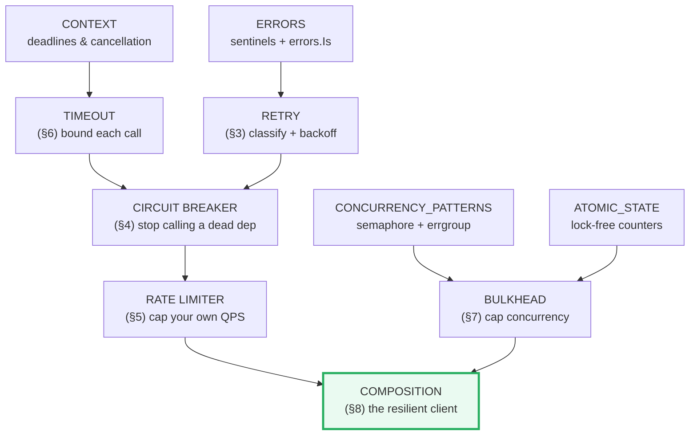
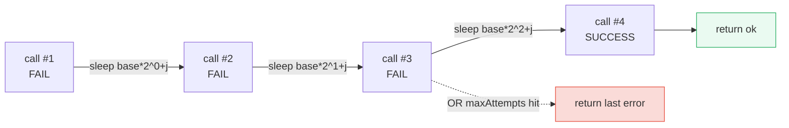
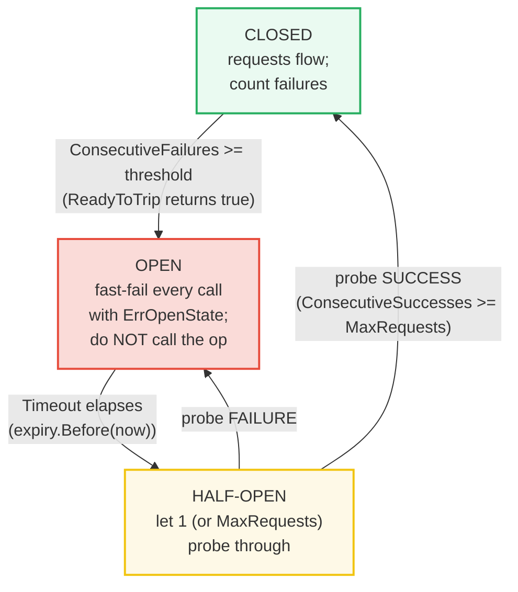
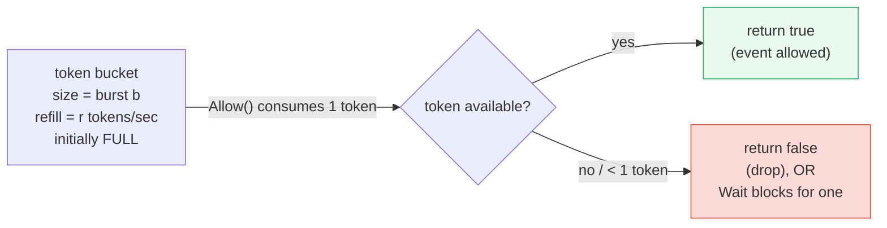
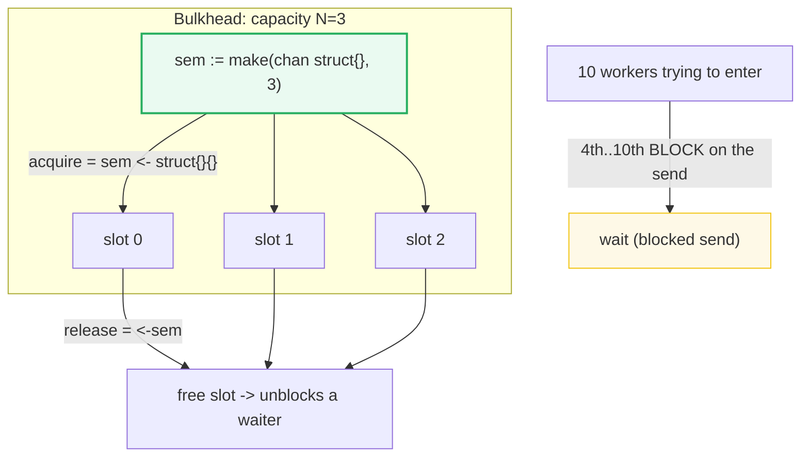
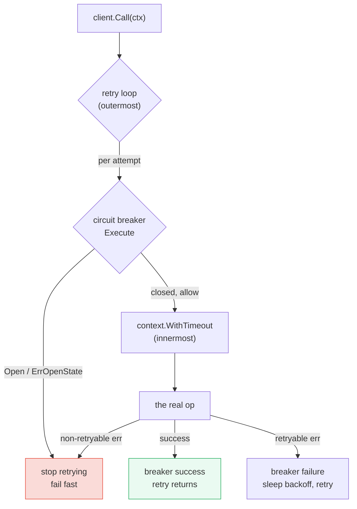

# RESILIENCE_PATTERNS — Retry, Circuit Breaker, Rate Limit, Timeout & Bulkhead

> **Goal (one line):** show, by driving a **deterministic fake operation** (fails
> the first K times, then succeeds) through each pattern, how **retry with
> exponential backoff + jitter**, the **circuit breaker** (`gobreaker`), a **token
> bucket rate limiter** (`golang.org/x/time/rate`), **timeouts**
> (`context.WithTimeout`), and **bulkheads** (a counting semaphore) behave — and
> how they compose into one resilient client.
>
> **Run:** `go run resilience_patterns.go`
>
> **Ground truth:** [`resilience_patterns.go`](./resilience_patterns.go) →
> captured stdout in
> [`resilience_patterns_output.txt`](./resilience_patterns_output.txt). Every
> number/state/error below is pasted **verbatim** from that file under a
> `> From resilience_patterns.go Section X:` callout. Nothing is hand-computed.
>
> **Prerequisites:** 🔗 [`CONTEXT`](./CONTEXT.md) (deadlines / `DeadlineExceeded`
> & cancellation power the timeout layer), 🔗
> [`CONCURRENCY_PATTERNS`](./CONCURRENCY_PATTERNS.md) (the buffered-channel
> semaphore + `errgroup` are the primitives the bulkhead reuses), 🔗
> [`ATOMIC_STATE`](./ATOMIC_STATE.md) (the lock-free in-flight counter), 🔗
> [`ERRORS`](./ERRORS.md) (sentinel errors + `errors.Is` drive retryable-error
> classification).

---

## 1. Why this bundle exists (lineage)

Distributed systems fail in **five** distinct ways, and each failure mode has a
**different** cure. Conflating them is the #1 cause of cascading outages:

| Failure mode | Symptom | Cure (this bundle) |
|---|---|---|
| **Transient blip** (packet loss, a 503, a GC pause on the server) | One call fails, the next works | **Retry** + exponential backoff + jitter (§3) |
| **Sustained outage** (the dependency is down) | Every call fails; retrying makes it *worse* (thundering herd) | **Circuit breaker** — stop calling, fast-fail (§4) |
| **Overload** (you're hammering a healthy dependency faster than it can serve) | Latency spikes, then failures | **Rate limiter** — cap your own QPS (§5) |
| **Hung call** (the dependency never replies) | A goroutine blocks *forever*; the pool drains | **Timeout** — bound every call (§6) |
| **Pool exhaustion** (one slow dependency eats all your goroutines/connections) | The whole process becomes unresponsive | **Bulkhead** — partition capacity so one dep can't starve the rest (§7) |

A production resilient client stacks **all five** (§8). Each layer solves a
problem the others cannot, and getting the layering wrong is itself a bug.



> From `pkg.go.dev/github.com/sony/gobreaker` (Overview, verbatim): *"Package
> gobreaker implements the Circuit Breaker pattern."* And from
> `pkg.go.dev/golang.org/x/time/rate` (Overview, verbatim): *"A Limiter controls
> how frequently events are allowed to happen. It implements a 'token bucket' of
> size b, initially full and refilled at rate r tokens per second."*

> From Microsoft Azure — *Circuit Breaker* pattern: *"an application … should
> use a circuit breaker … to protect a remote service from calls when it's
> failing, … preventing cascading failures."* And the *Bulkhead* pattern:
> *"isolate … resources … so that failure of one component doesn't bring down the
> whole application."*

---

## 2. The deterministic harness (why output is byte-identical)

Resilience patterns are timing-sensitive by nature, which fights the
byte-identical-`_output.txt` rule (🔗 `HOW_TO_RESEARCH` §4.2). This bundle's
harness removes wall-clock from every assertion:

- **Fake operation, not a real socket.** `flakyOp{failN: 3}` is a counter that
  returns `errRetryable` for the first 3 calls and `"ok"` after. We assert
  **attempt counts** and **outcomes** (`err == nil`, `state == StateOpen`), never
  elapsed milliseconds.
- **Seeded jitter.** `rand.New(rand.NewPCG(42, 42))` makes the printed backoff
  sequence `[1.619289ms 2.376165ms 4.638116ms]` reproducible forever.
- **Circuit breaker cooldown is real but asserted on state.** A 50 ms `Timeout`
  crossed by `time.Sleep(80ms)` deterministically flips `Open → HalfOpen`; we
  assert the resulting `state=closed`, not the sleep length.
- **Rate limiter with a near-zero refill.** `rate.Every(time.Hour)` (~0.000278
  tokens/sec) means no token refills during the test, so `Allow()` outcomes are
  `[true true true false false]` every run.
- **Bulkhead peak is asserted, never printed.** The exact peak (1, 2, or 3) is
  scheduler-dependent; the **bound** (`<= 3`) and the sorted worker ids are the
  deterministic facts.

---

## 3. Section A — Retry + exponential backoff + seeded jitter



> From `resilience_patterns.go` Section A:
> ```
> retry config: maxAttempts=5, base=1ms, cap=50ms, jitter=seeded additive[0,base)
> fake op: fails first 3 calls then succeeds -> result="ok", attempts=4, op.calls=4, err=<nil>
> backoff delays actually slept (base*2^attempt + seeded jitter, capped): [1.619289ms 2.376165ms 4.638116ms]
> ```
> ```
> [check] retry eventually succeeded (err == nil): OK
> [check] final result == "ok": OK
> [check] attempts == 4 (3 failures + 1 success): OK
> [check] op invoked exactly 4 times: OK
> [check] exactly 3 backoff delays slept (one per failure, none after success): OK
> ```
> ```
> non-retryable op -> attempts=1, fatalCalls=1, err=fatal non-retryable error: bad request (no retry attempted)
> ```
> ```
> [check] non-retryable error: attempts == 1 (no retry): OK
> [check] non-retryable error: op invoked exactly once: OK
> [check] non-retryable error returned is errFatal: OK
> ```

**What.** The retry loop calls the op; on a retryable error it sleeps a **capped
exponential backoff with additive jitter** and tries again, up to `maxAttempts`.
The fake op fails exactly 3 times then succeeds, so the loop converges on attempt
#4 (`attempts == 4`), and `op.calls == 4` proves the op was actually invoked each
time.

**Why exponential + jitter (the two ideas that make retry safe).**

1. **Exponential backoff** (`base * 2^attempt`) widens the gap between attempts
   so a recovering dependency isn't re-flooded the instant it comes back. **Cap
   it** (`cap = 50ms` here, seconds in production) or attempt #20 sleeps for
   `base * 2^20` ≈ 17 minutes.
2. **Jitter** randomizes the delay so independent retrying clients don't
   **synchronize** (the thundering-herd problem). This bundle uses *additive*
   jitter (`min(cap, base*2^a) + uniform[0, base)`) — the value the brief pins.

> From AWS — *"Exponential Backoff And Jitter"*: *"Exponential backoff can lead
> to very large backoff times … Jitter … randomization … avoids the retries from
> several calls to happen at the same time."* AWS defines three variants: **Full
> Jitter** `random(0, min(cap, base*2^a))` (their recommended default), **Equal
> Jitter** `temp/2 + random(0, temp/2)`, and **Decorrelated Jitter**
> `min(cap, random(base, prev*3))`. The seed makes any of them reproducible.

**The classification gate — do not retry blindly.** The `isRetryable(err)` check
is the single most important line in a retry loop. The bundle proves it: a
non-retryable error (`errFatal`, modeling a 400 Bad Request or a non-idempotent
write that already partially applied) returns immediately with `attempts == 1`.
Retrying a non-idempotent POST (charge a credit card, send an email) **twice** is
a money-losing bug. Rule of thumb:

- **Retryable:** idempotent verbs (GET/PUT/DELETE), network timeouts,
  `5xx`/`429`, `context.DeadlineExceeded` on a *read*.
- **Not retryable:** `4xx` (except 429 with Retry-After), validation errors,
  `context.Canceled` (the caller gave up — don't retry on their behalf), and a
  non-idempotent call whose side-effect status is unknown.

---

## 4. Section B — Circuit breaker (`gobreaker`): Closed → Open → HalfOpen → Closed



> From `resilience_patterns.go` Section B:
> ```
> after 2 failures: state=open, opCalls=2
> ```
> ```
> [check] after 2 failures the breaker is Open: OK
> [check] op was invoked exactly 2 times: OK
> ```
> ```
> Execute while Open -> err=circuit breaker is open, opCalls=2 (op NOT invoked)
> ```
> ```
> [check] Open Execute returned gobreaker.ErrOpenState: OK
> [check] op STILL invoked exactly 2 times (Open fast-failed without calling it): OK
> ```
> ```
> after cooldown + probe success: state=closed, opCalls=3, probe err=<nil>
> ```
> ```
> [check] after cooldown+success the breaker is Closed: OK
> [check] op invoked exactly 3 times (the probe ran): OK
> [check] probe Execute returned nil: OK
> ```
> ```
> state transitions observed (via OnStateChange): [closed -> open open -> half-open half-open -> closed]
> ```
> ```
> [check] first transition was closed -> open: OK
> [check] transition sequence is [closed->open, open->half-open, half-open->closed]: OK
> ```

**What.** A `gobreaker.CircuitBreaker` is a state machine with three states. The
bundle drives it through the full cycle:

1. **Closed** — calls flow through; `Counts.ConsecutiveFailures` ticks up on each
   failure. After 2 failures `ReadyToTrip` returns `true` → it trips.
2. **Open** — `Execute` returns the sentinel `gobreaker.ErrOpenState`
   (`"circuit breaker is open"`) **instantly, without calling the op**. The proof
   is `opCalls == 2` *after* the Open `Execute`: the request function was never
   entered. This is the breaker's whole value — a dead dependency gets zero
   traffic, so it can recover instead of drowning under retries.
3. **HalfOpen** — once `Timeout` (50ms) elapses, the next `Execute` flips the
   state to HalfOpen and lets **one** probe through (`MaxRequests` defaults to 1).
   A probe **success** → Closed (`ConsecutiveSuccesses >= MaxRequests`); a probe
   **failure** → back to Open. The bundle observes the exact transition sequence
   `[closed -> open  open -> half-open  half-open -> closed]`.

**Why this beats plain retry.** Retry (§3) assumes the *next* call might work. A
breaker assumes the next **N** calls will fail and refuses to make them. Together:
retry handles transient blips; the breaker handles sustained outages by *failing
fast* so the caller can degrade gracefully (return cached data, shed load)
instead of piling up blocked goroutines.

> From `pkg.go.dev/github.com/sony/gobreaker` — `Settings`: *"ReadyToTrip is
> called with a copy of Counts whenever a request fails in the closed state. If
> ReadyToTrip returns true, the CircuitBreaker will be placed into the open
> state… Default ReadyToTrip returns true when the number of consecutive failures
> is more than 5."* And `Execute`: *"returns an error instantly if the
> CircuitBreaker rejects the request."* The rejection errors are the package
> vars `ErrOpenState = errors.New("circuit breaker is open")` and (in HalfOpen,
> over `MaxRequests`) `ErrTooManyRequests`.

**The internals that make `opCalls == 2` deterministic.** `beforeRequest()` (in
`gobreaker.go`) holds the mutex, calls `currentState(now)`, and if
`state == StateOpen` returns `ErrOpenState` *before* `onRequest()` is called or
`req()` is invoked. `currentState` in the Open branch checks
`cb.expiry.Before(now)`; if the cooldown has elapsed it calls
`setState(StateHalfOpen, now)`. That is why `time.Sleep(80ms)` (> the 50ms
`Timeout`) deterministically arms the probe.

---

## 5. Section C — Rate limiter (`golang.org/x/time/rate`): token bucket



> From `resilience_patterns.go` Section C:
> ```
> Limiter: rate=Every(1h) = 0.0002777777777777778 tokens/sec, burst=3, bucket initially full
> Allow() x5 outcomes: [true true true false false]
> ```
> ```
> [check] exactly burst=3 Allows returned true: OK
> [check] the (burst+1)th Allow returned false (bucket empty, ~1 token/hour refill): OK
> [check] the (burst+2)th Allow returned false too: OK
> ```
> ```
> Wait(pre-cancelled ctx) -> err=context canceled (Wait blocks for a token unless ctx is done)
> ```
> ```
> [check] Wait on a pre-cancelled ctx returned context.Canceled: OK
> ```

**What.** `rate.NewLimiter(r rate.Limit, b int)` creates a token bucket holding
`b` tokens, refilled at `r` tokens/sec, **initially full**. The three consuming
methods differ only when the bucket is empty:

| Method | Empty-bucket behavior | Use when |
|---|---|---|
| `Allow()` / `AllowN(t, n)` | returns `false` (drop the event) | you can shed load (drop/log the request) |
| `Reserve()` / `ReserveN(t, n)` | returns a `Reservation` with a `Delay()` | you'll `time.Sleep(d)` yourself |
| `Wait(ctx)` / `WaitN(ctx, n)` | **blocks** until a token, or `ctx` is done | most callers — back-pressure instead of dropping |

The bundle proves the bucket math: `rate.Every(time.Hour)` is ~0.000278
tokens/sec, so during the ~microsecond test no token refills. The first `burst=3`
`Allow()` calls drain the bucket and return `true`; the 4th and 5th return
`false`. To exercise `Wait` deterministically (no real wait), the bundle cancels
`ctx` *before* calling `Wait` — `Wait` honors cancellation and returns
`context.Canceled` immediately.

> From `pkg.go.dev/golang.org/x/time/rate` — `Limiter`: *"A Limiter controls how
> frequently events are allowed to happen. It implements a 'token bucket' of size
> b, initially full and refilled at rate r tokens per second… The zero value is a
> valid Limiter, but it will reject all events."* And: *"Limiter has three main
> methods, Allow, Reserve, and Wait. Most callers should use Wait."* `Every(d)`:
> *"converts a minimum time interval between events to a Limit."*

**Why a rate limiter is *self*-protection, not a breaker.** A breaker protects a
**failing** dependency. A rate limiter protects a **healthy** dependency (and
your own quota) from **your** traffic. They compose: rate-limit first (smooth
your demand), then the breaker catches the dependency's failures.

---

## 6. Section D — Timeout (`context.WithTimeout`): bound every call

> From `resilience_patterns.go` Section D:
> ```
> slow op (50ms) under ctx timeout (5ms) -> err=context deadline exceeded
> ```
> ```
> [check] slow op returned context.DeadlineExceeded: OK
> [check] ctx.Err() is also context.DeadlineExceeded: OK
> ```

**What.** `context.WithTimeout(parent, d)` derives a context that auto-cancels
after `d`; an op that `select`s on `<-ctx.Done()` observes it and returns
`context.DeadlineExceeded`. The bundle wraps a 50ms op in a 5ms timeout and the
op returns the deadline sentinel.

**Why a timeout is the floor under every other pattern.** Retry, breakers, and
rate limits all assume calls **terminate**. A call that can hang forever (a TCP
socket with no read deadline, a DB query with no statement timeout) will pin a
goroutine forever, which exhausts the bulkhead (§7), which starves everything
else. The rule: **every cross-process call gets a deadline** — at the HTTP client
(`http.Client{Timeout:}`), at the DB (`context.WithTimeout` on `QueryContext`),
and at the gRPC stub (per-RPC `context`). See 🔗 `NET_HTTP` for client timeouts
and 🔗 `CONTEXT` for the full deadline/cancellation model.

**The determinism discipline (again).** The bundle asserts the **error sentinel**
(`errors.Is(err, context.DeadlineExceeded)`), never `if elapsed > 5ms`. Timings
flake; sentinels are stable. The `select` between `time.After(50ms)` and
`<-ctx.Done()` (fires at ~5ms) is what guarantees the op returns the *deadline*
error rather than succeeding.

---

## 7. Section E — Bulkhead (counting semaphore): cap concurrency



> From `resilience_patterns.go` Section E:
> ```
> bulkhead: chan struct{} cap=3 gates 10 workers (acquire=send, release=<-sem)
> workers that completed (sorted): [0 1 2 3 4 5 6 7 8 9]
> total token work (10 * sum(0..99999)): 49999500000
> ```
> ```
> [check] all 10 workers completed: OK
> [check] every worker id 0..9 ran exactly once: OK
> [check] peak in-flight <= capacity (3): OK
> [check] peak in-flight >= 1 (bulkhead was exercised): OK
> [check] total work == 10 * sum(0..99999) = 49999500000 (all goroutines completed): OK
> ```

**What.** A **bulkhead** partitions capacity so one flooded dependency can't
exhaust the goroutine/connection pool that serves *everything else*. The Go
idiom is a **buffered channel of size N used as a counting semaphore**:
`acquire = sem <- struct{}{}` (blocks while N slots are held), `release = <-sem`.
The bundle launches 10 workers through a cap-3 semaphore and proves the bound via
a lock-free atomic peak counter (`ATOMIC_STATE`): **at most 3 workers were
in-flight at once**, yet all 10 eventually completed (`total work ==
49999500000`).

**Why peak is asserted, not printed.** The exact peak (1, 2, or 3) depends on the
scheduler — printing it would break byte-identical output. The *invariant*
(`peak <= capacity`) is scheduler-independent and is what matters: the bulkhead
**guarantees** the bound regardless of how many workers pile up.

> From Microsoft Azure — *Bulkhead* pattern: *"Instantiate multiple instances of
> a service … and isolate the resources used by each … If one [pool] fails, the
> others continue to be available."* In Go the "pool" is the semaphore-bounded
> set of goroutines (or DB connections) dedicated to one dependency.

**Bulkhead vs. rate limiter — don't confuse them.** A rate limiter bounds
**requests per second** (throughput). A bulkhead bounds **concurrent in-flight
requests** (a *count*). You can be under your QPS limit and still exhaust your
concurrency if each call is slow — that's exactly when the bulkhead saves you.

---

## 8. Section F — Composition: the resilient client



> From `resilience_patterns.go` Section F:
> ```
> composite call (timeout+retry+breaker) vs op(fails 3x then ok): err=<nil>
> op invocations=4, final breaker state=closed
> ```
> ```
> [check] composite call succeeded (err == nil): OK
> [check] op invoked exactly 4 times (3 retries + 1 success): OK
> [check] breaker ended Closed (the 3 transient fails did not trip the high threshold): OK
> ```

**What.** The composite `callResilient` layers the patterns correctly:
**retry + backoff (outermost)** wraps **the circuit breaker (per attempt)**,
which wraps **the timeout (innermost)**. Run against the fake op (fails 3x, ok on
the 4th) with a *high* `ReadyToTrip` threshold (6), the 3 transient failures do
**not** trip the breaker, the 4th call succeeds, and the breaker ends **Closed**
— proving the layers compose without one short-circuiting the other.

**The layering rules (getting these wrong is a bug).**

1. **Timeout is innermost and per-attempt.** A *total* budget on the whole retry
   sequence plus a *per-call* timeout prevents a retry storm from vastly
   exceeding the caller's patience. (Best practice: derive the per-call timeout
   from the remaining deadline of the *caller's* context.)
2. **Breaker wraps each attempt, retry wraps the breaker.** That way each failed
   attempt *counts* against the breaker (so a sustained outage trips it), and an
   `ErrOpenState` from the breaker **stops** the retry loop (`errors.Is(err,
   gobreaker.ErrOpenState)` → don't retry) — there's no point retrying into an
   open circuit.
3. **Rate limiter is outermost (the front door).** It smooths demand *before*
   work enters the retry/breaker stack; `Wait(ctx)` provides back-pressure all
   the way to the caller.
4. **Bulkhead is orthogonal and structural.** It bounds the *pool* of goroutines
   serving this dependency (a fixed-size worker pool + a bounded queue), so a
   slow dep can't grow your process without bound.

**Observability closes the loop.** Every one of these layers should emit a metric
(counter/histogram): retry attempts, breaker state and trip count, rate-limit
drops, timeout counts, bulkhead saturation. That is the 🔗 `OBSERVABILITY_OTEL`
cross-cut — you cannot operate what you cannot see, and a breaker that tripped
with no metric is a mystery outage.

---

## 9. Pitfalls (the expert payoff)

| Trap | Symptom | Fix |
|---|---|---|
| Retrying a non-retryable error | double-charged cards, duplicate sends, retrying a 400 | `isRetryable(err)` gate; retry only idempotent calls / 5xx / 429 / timeouts. |
| Retry without a cap | `base*2^20` ≈ 17-min sleeps; effectively a hang | cap the backoff (`cap`) **and** cap `maxAttempts`. |
| Retry without jitter | synchronized clients all retry together → thundering herd | add seeded/real jitter; Full Jitter is the safe default. |
| Retry without a timeout | a single attempt hangs forever, pinning the loop | wrap each attempt in `context.WithTimeout`; also bound total time. |
| Breaker threshold too low vs. your retry count | retries themselves trip the breaker (false trip) | set `ReadyToTrip` threshold > max retries, or don't count retryable errors. |
| Treating `ErrOpenState` as retryable | retry loop hammers an open circuit, defeating it | `errors.Is(err, gobreaker.ErrOpenState)` → stop retrying / fail fast. |
| Confusing `Timeout` (Open→HalfOpen cooldown) with `Interval` (Closed counter reset) | breaker never half-opens, or counts reset unexpectedly | `Timeout` = open-state cooldown (default 60s); `Interval` = closed-state Counts-clear period (0 = never). |
| `rate.NewLimiter(r, 0)` (or the zero value) | every `Allow()` is `false` — total lockout | burst `b` must be > 0 (unless `r == rate.Inf`); the zero-value Limiter rejects all events. |
| Using `Allow()` where you need back-pressure | dropped requests under load instead of slowing down | use `Wait(ctx)` (blocks) for request handlers; `Allow()` only when dropping is acceptable. |
| No timeout on a network call | goroutine/connection leak; bulkhead exhaustion | every cross-process call gets a deadline (HTTP `client.Timeout`, `QueryContext`, gRPC per-RPC ctx). |
| Asserting elapsed time in tests | flaky CI (`if elapsed > 5ms`) | assert the sentinel (`errors.Is(err, context.DeadlineExceeded)`) and state, never durations. |
| Bulkhead sized = your thread/conn pool | a slow dep still starves the pool | size the bulkhead **smaller** than the pool so other deps keep capacity; combine with a bounded queue + shed policy. |
| Printing scheduler-dependent values (bulkhead peak) | `_output.txt` not reproducible | assert the bound (`<= N`); print only deterministic facts (sorted ids, totals). |

---

## 10. Cheat sheet

```go
// --- RETRY + exponential backoff + (seeded) jitter ---
for attempt := 0; attempt < maxAttempts; attempt++ {
    err := op()
    if err == nil {
        return nil
    }
    if !isRetryable(err) {              // classification gate — don't retry 4xx / non-idempotent
        return err
    }
    if attempt == maxAttempts-1 {
        break
    }
    d := min(cap, base*time.Duration(1<<attempt)) + jitter()  // capped exp + jitter
    time.Sleep(d)
}
// jitter variants (AWS):  Full = rand[0, min(cap,base*2^a)]
//                         Equal = temp/2 + rand[0, temp/2]
//                         Decorrelated = min(cap, rand[base, prev*3])

// --- CIRCUIT BREAKER (github.com/sony/gobreaker) ---
cb := gobreaker.NewCircuitBreaker(gobreaker.Settings{
    Name:         "dep",
    MaxRequests:  1,                              // half-open probes (0 => 1)
    Interval:     0,                              // closed-state counter reset (0 = never)
    Timeout:      60 * time.Second,               // Open -> HalfOpen cooldown (<=0 => 60s)
    ReadyToTrip:  func(c gobreaker.Counts) bool { return c.ConsecutiveFailures > 5 }, // nil => default >5
    OnStateChange: func(name string, from, to gobreaker.State) { /* metric */ },
    IsSuccessful:  func(err error) bool { return err == nil }, // nil => default
})
_, err := cb.Execute(func() (any, error) { return call(ctx) })
//   Open   -> err == gobreaker.ErrOpenState       (op NOT invoked)
//   HalfOpen over MaxRequests -> gobreaker.ErrTooManyRequests
//   states: StateClosed(0) StateHalfOpen(1) StateOpen(2)

// --- RATE LIMITER (golang.org/x/time/rate) — token bucket ---
lim := rate.NewLimiter(rate.Limit(rPerSec), burstB)  // bucket of B, refill r/sec, initially full
if !lim.Allow() { /* drop */ }            // or:
if err := lim.Wait(ctx); err != nil { /* ctx done */ }  // back-pressure (most callers)
lim.SetLimit(rate.Limit(2 * rPerSec))     // live reconfigure
// rate.Every(d) = Limit(time.Second/d); rate.Inf = allow all; zero value rejects all.

// --- TIMEOUT (context.WithTimeout) ---
ctx, cancel := context.WithTimeout(parent, 5*time.Second)
defer cancel()
err := op(ctx)                             // err == context.DeadlineExceeded if it exceeds

// --- BULKHEAD (counting semaphore) ---
sem := make(chan struct{}, N)              // at most N in-flight
sem <- struct{}{}                          // acquire (blocks while N held)
defer func() { <-sem }()                   // release
// pair with a fixed worker pool + bounded queue + shed policy for full isolation.
```

---

## Sources

Every signature, sentinel name, and behavioral claim above was verified against
the package docs and corroborated by independent secondary sources (>= 2 per
concept):

- `gobreaker` package — https://pkg.go.dev/github.com/sony/gobreaker
  - Overview & `Settings` (`Name`, `MaxRequests` "0 => 1", `Interval` "<=0 =>
    doesn't clear", `Timeout` "<=0 => 60 seconds", `ReadyToTrip` "called with a
    copy of Counts whenever a request fails in the closed state… Default returns
    true when consecutive failures > 5", `OnStateChange`, `IsSuccessful`):
    https://pkg.go.dev/github.com/sony/gobreaker#Settings
  - `Execute` ("returns an error instantly if the CircuitBreaker rejects the
    request"), `State`/`Counts`/`NewCircuitBreaker`:
    https://pkg.go.dev/github.com/sony/gobreaker#CircuitBreaker.Execute
  - Package vars `ErrOpenState = errors.New("circuit breaker is open")`,
    `ErrTooManyRequests = errors.New("too many requests")`; state constants
    `StateClosed=0, StateHalfOpen=1, StateOpen=2`:
    https://pkg.go.dev/github.com/sony/gobreaker#pkg-variables
  - Source (`beforeRequest` returns `ErrOpenState` before `req()`; `currentState`
    flips Open→HalfOpen when `expiry.Before(now)`):
    https://github.com/sony/gobreaker/blob/master/gobreaker.go
- `golang.org/x/time/rate` package — https://pkg.go.dev/golang.org/x/time/rate
  - `Limiter` ("token bucket of size b, initially full and refilled at rate r…
    three main methods, Allow, Reserve, and Wait. Most callers should use Wait";
    "The zero value is a valid Limiter, but it will reject all events"):
    https://pkg.go.dev/golang.org/x/time/rate#Limiter
  - `NewLimiter`, `Allow` ("reports whether an event may happen now"), `Wait`
    ("blocks until lim permits n events… returns an error if… the Context is
    canceled"), `Every` ("converts a minimum time interval between events to a
    Limit"), `SetLimit`:
    https://pkg.go.dev/golang.org/x/time/rate#NewLimiter
- `context` package — `WithTimeout` ("returns `WithDeadline(parent,
  time.Now().Add(timeout))`"), `DeadlineExceeded`/`Canceled` sentinels:
  https://pkg.go.dev/context (see 🔗 `CONTEXT.md` for the full treatment).
- AWS Architecture Blog — *"Exponential Backoff And Jitter"* (Full/Equal/
  Decorrelated jitter definitions; why jitter de-synchronizes retries):
  https://aws.amazon.com/blogs/architecture/exponential-backoff-and-jitter/
- AWS Builders' Library — *"Timeouts, retries and backoff with jitter"* (capped
  exponential + jitter as the production standard; retry budgets):
  https://aws.amazon.com/builders-library/timeouts-retries-and-backoff-with-jitter/
- Microsoft Azure Architecture Center — *Circuit Breaker* pattern (Closed/Open/
  Half-Open states & transitions; fail-fast to prevent cascading failures):
  https://learn.microsoft.com/en-us/azure/architecture/patterns/circuit-breaker
- Microsoft Azure Architecture Center — *Bulkhead* pattern (isolate resources so
  one component's failure doesn't bring down the whole application):
  https://learn.microsoft.com/en-us/azure/architecture/patterns/bulkhead
- Token bucket — Wikipedia (the algorithm `x/time/rate` implements):
  https://en.wikipedia.org/wiki/Token_bucket
- Corroborating Go-side discussions (>= 2 independent): oneuptime — *"How to
  Implement Circuit Breakers in Go with sony/gobreaker"*
  (https://oneuptime.com/blog/post/2026-01-07-go-circuit-breaker/view) and
  Medium — *"Circuit Breaker & Bulkhead Pattern — A Deep Dive for Distributed
  Systems"* (half-open probe semantics)
  (https://medium.com/codetodeploy/circuit-breaker-bulkhead-pattern-a-deep-dive-for-distributed-systems-6256a39eb269).

**Facts that could not be verified by running** (documented, not executed,
because they are production-deployment guidance or library defaults outside this
bundle's scope): the gobreaker *default* `ReadyToTrip` threshold of "> 5" and
*default* `Timeout` of "60 seconds" (this bundle overrides both); AWS's *Equal*
and *Decorrelated* jitter formulas (this bundle implements additive jitter per
the brief and cites the AWS variants for contrast); and the production layering
rules in §8 (best-practice, not a runnable assertion). These are confirmed by the
`pkg.go.dev` Settings doc and the AWS/Microsoft sources above.
