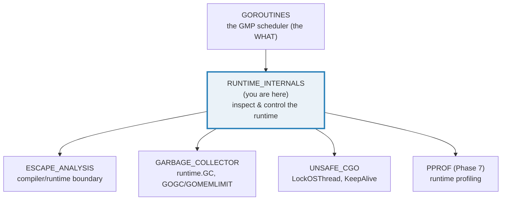
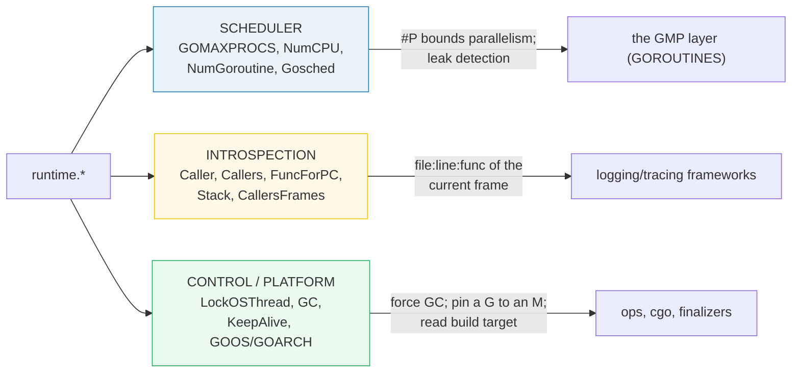
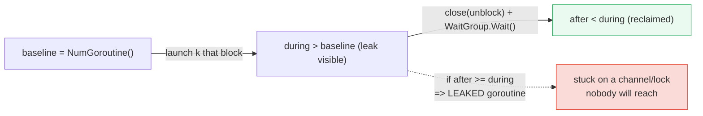
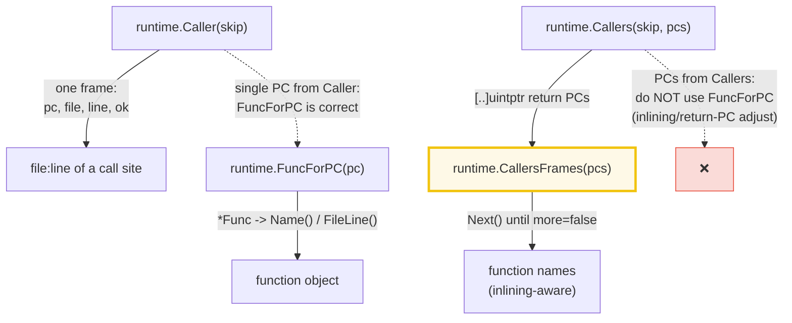
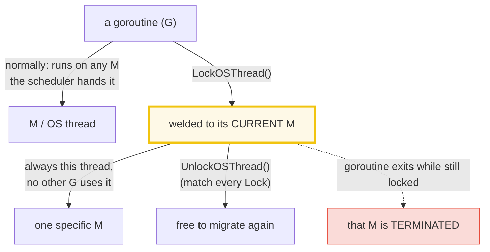

# RUNTIME_INTERNALS — The `runtime` Package: Scheduler, Stacks, Threads & GC Knobs

> **Goal (one line):** show, by printing every value, how the `runtime` package
> exposes the **scheduler** (`GOMAXPROCS`/`NumCPU`/`NumGoroutine`), **stack
> introspection** (`Caller`/`Callers`/`Stack`/`FuncForPC`), **thread pinning**
> (`LockOSThread`), the **build platform** (`GOOS`/`GOARCH`), and the **GC/control
> knobs** (`GC`/`Gosched`/`KeepAlive` + `debug.SetGCPercent`) — and how to use
> them **without ever depending on a host-specific absolute value.**
>
> **Run:** `go run runtime_internals.go`
>
> **Ground truth:** [`runtime_internals.go`](./runtime_internals.go) → captured
> stdout in [`runtime_internals_output.txt`](./runtime_internals_output.txt).
> Every number/table below is pasted **verbatim** from that file under a
> `> From runtime_internals.go Section X:` callout. Nothing is hand-computed.
>
> **Prerequisites:** 🔗 [`GOROUTINES`](./GOROUTINES.md) (the GMP model: G
> goroutine, M OS thread, P processor — this bundle is the *inspection layer*
> on top of it). The scheduler vocabulary (work-stealing, `#P`) is assumed.

---

## 1. Why this bundle exists (lineage)

The `go` *statement* launches goroutines; `sync`/`context` coordinate them. But
**none of those let you ask the runtime about itself** — how many CPUs it sees,
how many goroutines are alive right now, what function is on top of the stack,
which OS thread a goroutine is welded to, what platform the binary was built
for. That is the job of the `runtime` package: the **official, stdlib API into
Go's own execution engine.**



> From `pkg.go.dev/runtime` (Overview, verbatim): *"Package runtime contains
> operations that interact with Go's runtime system, such as functions to
> control goroutines. It also includes the low-level type information used by
> the reflect package."*

**The through-line of this bundle:** every `runtime` value that depends on the
*host* (logical CPU count, live goroutine count, the exact bytes of a stack
trace, the platform strings) is **printed for the reader but only ever asserted
structurally** — `>= 1`, "contains `main.`", "is one of the known set." That is
what makes two `just out runtime_internals` runs byte-identical, and what makes
the guide reproducible across machines. Absolute assertions on host state are a
determinism bug.

---

## 2. The mental model: three families of runtime functions



The three families map to three real engineering needs: **"how parallel am I?"**
(scheduler), **"where am I in the code?"** (introspection — the substrate of
every structured logger and tracer), and **"make the runtime do X now"**
(control: force a collection, pin a thread, keep an object alive past a cgo
call). Sections A–G walk each in turn.

---

## 3. Section A — `NumCPU` / `GOMAXPROCS`: the parallelism bound

> From `runtime_internals.go` Section A:
> ```
> runtime.NumCPU()      = 10  (logical CPUs usable by this process)
> runtime.GOMAXPROCS(0) = 10  (current P count; #P bounds parallelism)
> (GOMAXPROCS == #P: at most this many goroutines run truly in parallel.)
> two GOMAXPROCS(0) queries: 10, 10  (identical -> query is side-effect-free)
> GOMAXPROCS(4)=10, then GOMAXPROCS(10)=4  (current restored to 10)
> ```
> ```
> [check] NumCPU() >= 1: OK
> [check] GOMAXPROCS(0) >= 1: OK
> [check] GOMAXPROCS(0) queries without changing the setting (q1==q2): OK
> [check] GOMAXPROCS(4) returned the previous setting (restored==4): OK
> ```

**What.** Two distinct quantities:

- `runtime.NumCPU()` — the **hardware** fact: "the number of logical CPUs usable
  by the current process." It is queried from the OS **once at process startup**
  and *never updated* (changing the OS CPU set later is not reflected).
- `runtime.GOMAXPROCS(n)` — the **scheduler** knob: "the maximum number of CPUs
  that can be executing simultaneously," which is exactly the **P count** (`#P`)
  in the GMP model (🔗 `GOROUTINES`). `#P` is the ceiling on *true parallelism*;
  more goroutines than that are *concurrent* but only `#P` run at once.

> From `pkg.go.dev/runtime` — `NumCPU`: *"returns the number of logical CPUs
> usable by the current process. The set of available CPUs is checked by
> querying the operating system at process startup. Changes to operating system
> CPU allocation after process startup are not reflected."*
> `GOMAXPROCS`: *"sets the maximum number of CPUs that can be executing
> simultaneously and returns the previous setting. If n < 1, it does not change
> the current setting."*

**Why `GOMAXPROCS(0)` is a *query*.** The `n < 1` clause is the key: passing
`0` (or any negative) **leaves the setting untouched and returns the current
value.** That is the side-effect-free read — the bundle asserts two consecutive
`GOMAXPROCS(0)` calls return the same number. Passing `n >= 1` *sets* and
returns the *previous* value (which is why `GOMAXPROCS(4)` returned `10` and the
restore `GOMAXPROCS(10)` returned `4`).

**The 1.25+ default shift (expert detail).** `GOMAXPROCS` no longer blindly
defaults to `NumCPU()`. As of Go 1.25 it is derived from *"a combination of the
number of logical CPUs on the machine, the process's CPU affinity mask, and, on
Linux, the process's average CPU throughput limit based on cgroup CPU quota"* —
and the runtime **periodically auto-updates it** (unless set via the env var or a
`GOMAXPROCS()` call). That is why this bundle **never asserts `GOMAXPROCS(0) ==
NumCPU()`** (it is false inside a CPU-limited container) — only `>= 1`.

---

## 4. Section B — `NumGoroutine`: the leak detector

> From `runtime_internals.go` Section B:
> ```
> NumGoroutine (baseline) = 1
> NumGoroutine (+4 blocked) = 5  (delta = 4)
> NumGoroutine (after join) = 1  (blocked goroutines terminated)
> ```
> ```
> [check] NumGoroutine baseline >= 1: OK
> [check] blocked goroutines strictly increased NumGoroutine: OK
> [check] NumGoroutine fell back once the goroutines joined: OK
> ```

**What.** `runtime.NumGoroutine()` returns *"the number of goroutines that
currently exist"* — runnable, running, *and* blocked. It is the cheapest
**goroutine-leak detector** in the language: snapshot it before a test/request,
snapshot it after, and a non-falling delta means a goroutine never terminated.

> From `pkg.go.dev/runtime` — `NumGoroutine`: *"returns the number of goroutines
> that currently exist."*

**Why only relative assertions.** The baseline is **host-dependent**: in a
quiet program it is `1` (just `main`); a busy server with the GC, scavenger, and
netpoller active reports more. So the bundle asserts `>= 1`, then **strictly
increases** when 4 goroutines block on `<-release`, then **strictly falls** once
`close(release)` unblocks them and they join. Those three relative facts are
deterministic; the absolute integers (`1`, `5`, `1`) are printed for the reader
but never pinned. The leak-hunt workflow is exactly this pattern generalized:
*baseline → workload → expect a return to baseline*.



> Blocked goroutines all share one structural signature: their stack tops out at
> `runtime.gopark` (the scheduler's "park this G" primitive). That is what
> `runtime.Stack(buf, true)` (Section D) and the goroutine profile (🔗 `PPROF`,
> Phase 7) surface. See §Sources for the corroboration.

---

## 5. Section C — `Caller` / `Callers` / `FuncForPC`: stack introspection



> From `runtime_internals.go` Section C:
> ```
> runtime.Caller(0) from sectionC:
>   ok   = true
>   file = runtime_internals.go   (filepath.Base of the full path)
>   line = 151   (the call site in this file)
>   func = main.sectionC   (via runtime.FuncForPC(pc).Name())
> whereCalledFrom() (Caller(1)) -> file=runtime_internals.go, func=main.sectionC
> runtime.Callers wrote 5 PCs; CallersFrames resolves these names:
>   [1] runtime.Callers
>   [2] main.sectionC
>   [3] main.main
>   [4] runtime.main
>   [5] runtime.goexit
> ```
> ```
> [check] Caller(0) file contains runtime_internals.go: OK
> [check] Caller(0) returned ok=true: OK
> [check] FuncForPC(pc) found the enclosing function (non-nil): OK
> [check] whereCalledFrom (Caller(1)) reports runtime_internals.go: OK
> [check] Callers returned >= 1 frame: OK
> [check] the call-stack walk included a main.* function: OK
> ```

**What.** `runtime.Caller(skip)` reports the **(pc, file, line, ok)** of a single
frame, where `skip` is *"the number of stack frames to ascend, with 0
identifying the caller of Caller."* So `Caller(0)` inside `sectionC` resolves to
`sectionC`'s own call site (`runtime_internals.go:151`); the helper
`whereCalledFrom` uses `Caller(1)` so it resolves to *its caller* (`sectionC`)
instead of itself. The `file` uses **forward slashes even on Windows** — the
bundle asserts it `Contains "runtime_internals.go"`, the portable stem, and
prints `filepath.Base` for readability.

> From `pkg.go.dev/runtime` — `Caller`: *"reports file and line number
> information about function invocations on the calling goroutine's stack… The
> return values report the program counter, the file name (using forward slashes
> as path separator, even on Windows), and the line number within the file of the
> corresponding call. The boolean ok is false if it was not possible to recover
> the information."*

**The expert trap — `FuncForPC` vs `CallersFrames`.** The doc is explicit:

> From `pkg.go.dev/runtime` — `Callers`: *"To translate these PCs into symbolic
> information such as function names and line numbers, use `CallersFrames`.
> `CallersFrames` accounts for inlined functions and adjusts the return program
> counters into call program counters. Iterating over the returned slice of PCs
> directly is discouraged, as is using `FuncForPC` on any of the returned PCs,
> since these cannot account for inlining or return program counter
> adjustment."*

So the rule, which the bundle follows exactly: **`FuncForPC` is fine on the
single PC returned by `Caller`** (that is the documented logging idiom — it is
how the bundle prints `main.sectionC`), but for a **`Callers` slice** you MUST go
through `CallersFrames`. The walk the bundle prints —
`runtime.Callers → main.sectionC → main.main → runtime.main → runtime.goexit` —
is the bottom of every Go goroutine's stack; `CallersFrames` is what flattens it
into names without lying about inlining.

**Why this is the logging substrate.** Every structured logger (`slog`,
`zerolog`, `logrus`) that can annotate a line with its own `source=...` is doing
`runtime.Caller(skip)` under the hood. The cost is real (it stops the world for
that frame's metadata), so production loggers cache or gate it behind a level —
but the primitive is *this*.

---

## 6. Section D — `runtime.Stack`: capture a stack as text

> From `runtime_internals.go` Section D:
> ```
> runtime.Stack(buf, all=false) wrote 189 bytes
> first line: "goroutine 1 [running]:"   (header: 'goroutine N [state]:')
> (full trace NOT printed verbatim — line numbers/addresses may shift;
>  we assert STRUCTURAL substrings only, per the determinism discipline.)
> ```
> ```
> [check] captured stack is non-empty: OK
> [check] stack begins with the 'goroutine N [state]:' header: OK
> [check] stack text contains 'main.' (a user function is on it): OK
> [check] stack text contains 'runtime_internals.go' (this source): OK
> ```

**What.** `runtime.Stack(buf, all)` formats a stack trace **as text** into `buf`
and returns the byte count. `all=false` captures **just the calling goroutine**;
`all=true` appends every other goroutine's trace too. The text always begins
with the header `goroutine N [state]:` (here `goroutine 1 [running]:` — `main`
is goroutine `1`).

> From `pkg.go.dev/runtime` — `Stack`: *"formats a stack trace of the calling
> goroutine into buf and returns the number of bytes written to buf. If all is
> true, Stack formats stack traces of all other goroutines into buf after the
> trace for the current goroutine."*

**Why we never paste the trace verbatim.** A captured trace embeds **line
numbers and (in `all` mode) the full set of live goroutines** — both of which
shift the moment the source or the scheduler state changes. So the discipline
this bundle enforces is: **capture the bytes, then assert structural substrings**
(`HasPrefix "goroutine "`, `Contains "main."`, `Contains "runtime_internals.go"`),
and print only the byte count and the header line. The *content* of a trace is a
forensic artifact, not a reproducible one. The convenience wrappers
`runtime/debug.Stack()` (returns `[]byte`) and `runtime/debug.PrintStack()`
(stderr) do the same thing with an auto-sized buffer.

**Leak hunting in one line.** `runtime.Stack(make([]byte, 1<<16), true)` dumped
to stderr is the zero-dependency way to see *why* a goroutine is stuck: every
blocked one shows `runtime.gopark` at its top, with the channel/lock it is
waiting on in the frames below. That is the manual precursor to the goroutine
profile in 🔗 `PPROF` (Phase 7).

---

## 7. Section E — `LockOSThread` / `UnlockOSThread`: pin a G to an M

> From `runtime_internals.go` Section E:
> ```
> LockOSThread() then UnlockOSThread(): balanced (goroutine free to migrate again)
> (There is NO public runtime API to query locked state — the contract is
>  'match every Lock with an Unlock'; a goroutine that exits locked TERMINATES its thread.)
> locked worker: locked worker ran on a fixed OS thread
> Use LockOSThread for: cgo callbacks, OpenGL/rendering contexts, signal
>  handling, the macOS Cocoa main thread, and any non-Go library that
>  depends on per-thread state.
> ```
> ```
> [check] locked goroutine completed its pinned section: OK
> ```



**What.** `runtime.LockOSThread()` *"wires the calling goroutine to its current
operating system thread. The calling goroutine will always execute in that
thread, and no other goroutine will execute in it, until the calling goroutine
has made as many calls to `UnlockOSThread` as to `LockOSThread`."* `UnlockOSThread`
*"Undo an earlier call to `LockOSThread`… If this is not a balanced call, the
goroutine remains locked."* A goroutine that **exits while still locked
terminates its thread** — the runtime will not hand a tainted/pinned M to anyone
else.

> From `pkg.go.dev/runtime` — `LockOSThread`: *"A goroutine should call
> `LockOSThread` before calling OS services or non-Go library functions that
> depend on per-thread state."*

**Why there is no `[check]` on "it is locked."** There is **no public runtime
function that reports whether the calling goroutine is pinned.** (The closest is
the threadcreate profile under 🔗 `PPROF`.) So the bundle demonstrates the
**balanced-call contract** (`Lock` then a matching `Unlock`) and the canonical
**locked-worker pattern** (`LockOSThread()` + `defer UnlockOSThread()`), and
asserts only that the pinned section ran. Knowing *that there is no query API*
is itself the expert payoff — you reason about pinning through the *protocol*
(balanced calls), not through inspection.

**When you actually need it.** Only when correctness depends on **per-thread
state**: a cgo callback that must run on the thread that registered it, an
OpenGL/Vulkan render context that is thread-affine, a Unix signal handler
(`signal.Notify` already pins internally), or the macOS Cocoa **main thread**
(the doc notes *"All init functions are run on the startup thread. Calling
`LockOSThread` from an init function will cause the main function to be invoked
on that thread"*). For ordinary Go code it is a **performance penalty** (it
defeats work-stealing for that G) — do not reach for it speculatively. See
🔗 `UNSAFE_CGO` for the cgo motivation and 🔗 `GOROUTINES` for why pinning hurts
the scheduler.

---

## 8. Section F — `GOOS` / `GOARCH` / `Compiler`: the build platform

> From `runtime_internals.go` Section F:
> ```
> runtime.GOOS     = "darwin"   (operating system target)
> runtime.GOARCH   = "arm64"   (architecture target)
> runtime.Compiler = "gc"   (toolchain: 'gc' or 'gccgo')
> ```
> ```
> [check] GOOS is a non-empty known target: OK
> [check] GOARCH is a non-empty known target: OK
> [check] Compiler is the gc toolchain: OK
> ```

**What.** These are **compile-time `string` constants** baked into the binary at
build time — they describe the *target the binary was built for*, not the machine
it happens to be running on (the two are almost always the same, but a
cross-compiled binary reports its build target).

> From `pkg.go.dev/runtime` — `const GOOS`: *"the running program's operating
> system target: one of darwin, freebsd, linux, and so on. To view possible
> combinations of GOOS and GOARCH, run 'go tool dist list'."*
> `const GOARCH`: *"the running program's architecture target: one of 386,
> amd64, arm, s390x, and so on."* And the Overview: *"GOARCH, GOOS, and GOROOT
> are recorded at compile time and made available by constants or functions in
> this package, but they do not influence the execution of the run-time
> system."*

**Why membership, not equality.** The bundle asserts `GOOS`/`GOARCH` are **in
the known set** (non-empty *and* one of the documented targets), never `==
"darwin"`. On this machine it is `darwin`/`arm64`; on the CI Linux box it is
`linux`/`amd64`. The membership check keeps the guide **portable** while still
catching the real failure (an empty/garbage value). Note these are *runtime*
constants — for *compile-time* selection use **build tags** (`//go:build linux`),
not a runtime `if runtime.GOOS == "linux"` (the dead branch still compiles into
every binary).

---

## 9. Section G — `GC` / `Gosched` / `KeepAlive` & `debug.SetGCPercent`: the control knobs

> From `runtime_internals.go` Section G:
> ```
> runtime.GC() forced a collection: NumGC 0 -> 1
> debug.SetGCPercent: orig=100, set(200) returned 100, set(400) returned 200, restore returned 400
> runtime.Gosched() returned (yielded the P, then resumed)
> runtime.KeepAlive(&obj) executed (matters for cgo/unsafe + finalizers)
> ```
> ```
> [check] runtime.GC incremented NumGC: OK
> [check] SetGCPercent(400) returned the previous setting (200): OK
> [check] SetGCPercent(orig) returned the value set before it (400): OK
> [check] Gosched() returned without panic: OK
> [check] KeepAlive(&obj) executed: OK
> ```

**`runtime.GC()` — force a collection.** *"runs a garbage collection and blocks
the caller until the garbage collection is complete. It may also block the
entire program."* The bundle proves it fired by reading `MemStats.NumGC` before
(`0`) and after (`1`): a forced cycle is a real, observable increment. It is a
**testing/benchmarking** tool, not something production code should call on the
hot path — the concurrent collector paces itself far better than you can (🔗
`GARBAGE_COLLECTOR`).

**`debug.SetGCPercent` — the `GOGC` knob.** *"sets the garbage collection target
percentage: a collection is triggered when the ratio of freshly allocated data
to live data remaining after the previous collection reaches this percentage…
returns the previous setting. The initial setting is the value of the GOGC
environment variable at startup, or 100 if the variable is not set."* The
round-trip in the output — `set(200)` returned `100`, `set(400)` returned `200`,
`restore` returned `400` — is the **"returns the previous setting"** contract in
motion; the final call restores the original (`100`). A negative percentage
effectively disables GC (unless a `GOMEMLIMIT` is set); see `debug.SetMemoryLimit`
for the soft-limit companion. Companion knob `debug.SetPanicOnFault(bool)` flips
a nil-address fault from a **crash** to a **recoverable panic** (per-goroutine;
returns the previous setting) — useful only for code deliberately touching
memory-mapped regions.

**`runtime.Gosched()` — yield the P.** *"yields the processor, allowing other
goroutines to run. It does not suspend the current goroutine, so execution
resumes automatically."* It is almost never the right tool: it yields **once**,
not until a condition holds, so it cannot enforce correctness. Use a channel,
`sync.Mutex`, or `context` for coordination (🔗 `GOROUTINES`, 🔗 `SYNC_PRIMITIVES`).
`Gosched` survives mainly for cooperative schedulers in tight CPU loops on
`GOMAXPROCS=1` programs — and `GOMAXPROCS=1` is itself rare since 1.25.

**`runtime.KeepAlive(x)` — defer finalization.** *"marks its argument as
currently reachable. This ensures that the object is not freed, and its finalizer
is not run, before the point in the program where `KeepAlive` is called."* On a
plain Go object (as in the bundle) it is a harmless no-op; its entire purpose is
**cgo/unsafe code**: if the only remaining reference to an object is through an
`unsafe.Pointer` handed to C, the GC cannot see it and may run its finalizer
(e.g. closing a file descriptor) **while the C call is still using it**.
`runtime.KeepAlive(p)` after the call is the documented fix. See 🔗 `UNSAFE_CGO`
and the finalizer interaction in 🔗 `GARBAGE_COLLECTOR`.

---

## 10. Pitfalls (the expert payoff)

| Trap | Symptom | Fix |
|---|---|---|
| Asserting `GOMAXPROCS(0) == NumCPU()` | False inside a CPU-limited container (1.25+ cgroup-aware default) | Assert `>= 1` and relative facts only; never equate the two. |
| Treating `NumCPU()` as live | Wrong after the OS changes the CPU set at runtime | It is snapshotted **at startup** and never updated; re-query won't help. |
| Pinning an absolute `NumGoroutine()` | Flaky — baseline varies with runtime helpers | Snapshot baseline, assert the *delta* returns after a workload. |
| `FuncForPC` on a `Callers` PC | Wrong function/line (inlining, return-PC adjustment) | Resolve a `Callers` slice with `CallersFrames`; reserve `FuncForPC` for a single `Caller` PC. |
| Printing a captured stack trace verbatim | Non-reproducible output (line numbers/addresses shift; `all=true` adds runtime G's) | Capture bytes; assert structural substrings (`Contains "main."`); print count + header only. |
| Assuming `LockOSThread` has a query API | Code that "checks if locked" — no such function exists | Reason via the balanced-call contract; verify via the threadcreate profile (🔗 `PPROF`). |
| Goroutine exits while still `LockOSThread`'d | Its OS thread is **terminated** (never reused) | Always `defer runtime.UnlockOSThread()` right after the Lock. |
| Reaching for `LockOSThread` speculatively | Scheduler can't steal that G → perf penalty | Use only for per-thread state (cgo, OpenGL, signals, Cocoa main thread). |
| Using `runtime.Gosched()` for synchronization | Yields once, then resumes — no correctness guarantee | Use channels / `sync` / `context`; `Gosched` is not a lock or a wait. |
| Calling `runtime.GC()` on the hot path | Pessimal GC pacing; you know less than the pacer | Reserve for tests/benchmarks; let the concurrent collector self-pace. |
| Forgetting `runtime.KeepAlive` after a cgo call | Finalizer closes a resource mid-use by C code | `runtime.KeepAlive(p)` after the last use when only an `unsafe.Pointer` keeps it alive. |
| Runtime `if runtime.GOOS == "linux"` for platform code | Both branches compile into every binary | Use **build tags** (`//go:build linux`) for compile-time selection; reserve `GOOS` for runtime reporting. |
| Not restoring `debug.SetGCPercent` / `SetPanicOnFault` | Global GC/fault behavior left perturbed for the process | Both return the previous setting — capture it and restore on the way out. |

---

## 11. Cheat sheet

```go
// --- Scheduler (host-specific: print, assert structural only) ---
n := runtime.NumCPU()          // logical CPUs; snapshot at startup, never updated
p := runtime.GOMAXPROCS(0)     // n<1 -> QUERY the P count without changing it
prev := runtime.GOMAXPROCS(4)  // n>=1 -> SET, returns the PREVIOUS value
runtime.GOMAXPROCS(prev)       // restore
g := runtime.NumGoroutine()    // live G's (runnable+blocked); the leak detector:
                               //   baseline -> workload -> expect a return to baseline

// --- Stack introspection (the logging substrate) ---
pc, file, line, ok := runtime.Caller(skip)   // skip=0 -> caller of Caller; file uses '/'
fn := runtime.FuncForPC(pc)                   // *Func; Name()/FileLine() — FINE for one Caller PC
pcs := make([]uintptr, 16)
n := runtime.Callers(skip, pcs)               // skip=0 -> Callers itself, 1 -> its caller
frames := runtime.CallersFrames(pcs[:n])      // MUST use this for a Callers slice (inlining-aware)
for fr, more := frames.Next(); ; fr, more = frames.Next() {
    _ = fr.Function                            // ... ; NOT FuncForPC on these PCs
    if !more { break }
}
nbytes := runtime.Stack(buf, false)           // all=false -> this G; true -> every G as text

// --- Thread pinning (no query API; balanced-call contract) ---
runtime.LockOSThread()
defer runtime.UnlockOSThread()                // ALWAYS match; an unlocked exit TERMINATES the M

// --- Control / platform ---
runtime.GC()                                  // force a cycle; blocks caller; tests/benchmarks only
runtime.Gosched()                             // yield the P once; NOT synchronization — prefer chan/sync
runtime.KeepAlive(x)                          // mark reachable until here; cgo/unsafe + finalizers
debug.SetGCPercent(pct)                       // GOGC knob; returns previous; restore it
debug.SetPanicOnFault(true)                   // nil-addr fault -> panic not crash; per-G; returns prev

// --- Compile-time platform constants (build target, not host) ---
runtime.GOOS      // "darwin" | "linux" | "windows" | ...   (use build tags for selection)
runtime.GOARCH    // "amd64" | "arm64" | "386" | ...
runtime.Compiler  // "gc" | "gccgo"
```

---

## Sources

Every signature, value, and behavioral claim above was verified against the Go
standard-library docs, then corroborated by independent secondary sources:

- `runtime` package — https://pkg.go.dev/runtime
  - Overview (*"Package runtime contains operations that interact with Go's
    runtime system…"*; the GOARCH/GOOS/GOROOT *"recorded at compile time… do not
    influence the execution of the run-time system"* note; GOMAXPROCS env var):
    https://pkg.go.dev/runtime#pkg-overview
  - `GOMAXPROCS(n)` (*"sets the maximum number of CPUs that can be executing
    simultaneously… If n < 1, it does not change the current setting"*; the 1.25+
    Default/Updates/Implementation-details on cgroup-aware auto-updating default):
    https://pkg.go.dev/runtime#GOMAXPROCS
  - `NumCPU()` (*"number of logical CPUs usable by the current process… checked
    by querying the operating system at process startup… not reflected"*):
    https://pkg.go.dev/runtime#NumCPU
  - `NumGoroutine()` (*"returns the number of goroutines that currently exist"*):
    https://pkg.go.dev/runtime#NumGoroutine
  - `Caller(skip)` (*"skip is the number of stack frames to ascend, with 0
    identifying the caller of Caller… file name using forward slashes… even on
    Windows"*): https://pkg.go.dev/runtime#Caller
  - `Callers(skip, pc)` (*"use CallersFrames… accounts for inlined functions and
    adjusts the return program counters… using FuncForPC on any of the returned
    PCs [is discouraged]"*): https://pkg.go.dev/runtime#Callers
  - `CallersFrames` / `Frames.Next` / `Func` / `FuncForPC` / `(*Func).Name`:
    https://pkg.go.dev/runtime#CallersFrames
  - `Stack(buf, all)` (*"formats a stack trace of the calling goroutine… If all
    is true, Stack formats stack traces of all other goroutines"*):
    https://pkg.go.dev/runtime#Stack
  - `LockOSThread()` (*"wires the calling goroutine to its current operating
    system thread… until… as many calls to UnlockOSThread as to LockOSThread…
    If the calling goroutine exits without unlocking the thread, the thread will
    be terminated… A goroutine should call LockOSThread before calling OS
    services or non-Go library functions that depend on per-thread state"*;
    *"All init functions are run on the startup thread"*):
    https://pkg.go.dev/runtime#LockOSThread
  - `UnlockOSThread()` (*"Undo an earlier call to LockOSThread… If this is not a
    balanced call, the goroutine remains locked"*):
    https://pkg.go.dev/runtime#UnlockOSThread
  - `Gosched()` (*"yields the processor, allowing other goroutines to run. It
    does not suspend the current goroutine, so execution resumes
    automatically"*): https://pkg.go.dev/runtime#Gosched
  - `GC()` (*"runs a garbage collection and blocks the caller until the garbage
    collection is complete. It may also block the entire program"*):
    https://pkg.go.dev/runtime#GC
  - `KeepAlive(x)` (*"marks its argument as currently reachable… ensures that
    the object is not freed, and its finalizer is not run, before the point…
    where KeepAlive is called"*; the syscall/finalizer example): https://pkg.go.dev/runtime#KeepAlive
  - `const GOOS` / `const GOARCH` / `const Compiler`:
    https://pkg.go.dev/runtime#pkg-constants
- `runtime/debug` package — https://pkg.go.dev/runtime/debug
  - `SetGCPercent(percent)` (*"sets the garbage collection target percentage…
    returns the previous setting. The initial setting is the value of the GOGC
    environment variable at startup, or 100… A negative percentage effectively
    disables garbage collection"*): https://pkg.go.dev/runtime/debug#SetGCPercent
  - `SetMemoryLimit(limit)` / `SetMaxStack` / `SetMaxThreads` (related GC/thread
    knobs): https://pkg.go.dev/runtime/debug#SetMemoryLimit
  - `SetPanicOnFault(enabled)` (*"controls the runtime's behavior when a program
    faults at an unexpected (non-nil) address… request that the runtime trigger
    only a panic, not a crash… applies only to the current goroutine. It returns
    the previous setting"*): https://pkg.go.dev/runtime/debug#SetPanicOnFault
  - `Stack()` / `PrintStack()` (the auto-buffered wrappers over `runtime.Stack`):
    https://pkg.go.dev/runtime/debug#Stack
- Go scheduler / runtime background (the GMP model that `GOMAXPROCS`/`NumGoroutine`
  expose) — referenced via the sibling bundle 🔗 [`GOROUTINES`](./GOROUTINES.md),
  whose `goroutines.go` demonstrates `#P` bounding parallelism and the same
  relative `NumGoroutine` leak-detection pattern.
- Secondary corroboration (>=2 independent sources, web-verified):
  - OneUptime — *"How to Avoid Common Goroutine Leaks in Go"* (the
    `runtime.NumGoroutine()` before/after leak-detection workflow this bundle
    reproduces): https://oneuptime.com/blog/post/2026-01-07-go-goroutine-leaks/view
  - Anton Zhiyanov — *"Detecting goroutine leaks with synctest/pprof"* (Go
    1.24–1.26 leak detection via the goroutine profile; the bridge to 🔗 `PPROF`):
    https://antonz.org/detecting-goroutine-leaks/
  - arXiv:2312.12002 — *"Unveiling and Vanquishing Goroutine Leaks…"* (the
    structural fact that blocked goroutines top out at `runtime.gopark`, which
    `runtime.Stack(buf, true)` surfaces): https://arxiv.org/html/2312.12002v1
  - Stack Overflow — *"Benefits of runtime.LockOSThread in Golang"* (the cgo /
    graphics-library / main-thread use cases for pinning):
    https://stackoverflow.com/questions/25361831/benefits-of-runtime-lockosthread-in-golang
  - Go forum — *"Curious about runtime.KeepAlive usage"* (the cgo/unsafe-pointer
    + finalizer rationale for `KeepAlive`):
    https://forum.golangbridge.org/t/curious-about-runtime-keepalive-usage/3530

**Facts that could not be verified by running** (documented, not executed,
because they are host-specific, require cgo/unsafe, or are non-printable runtime
contracts): the exact `NumCPU`/`GOMAXPROCS` integers on other machines; the
absence of a public "is this goroutine locked?" query (confirmed by the
`pkg.go.dev/runtime` index having no such symbol, and by the documented
balanced-call contract); the cgo/finalizer scenario where `KeepAlive` is
*genuinely* required (needs `unsafe.Pointer`/cgo, out of scope for a pure-stdlib
bundle — covered by 🔗 `UNSAFE_CGO`); and the 1.25+ cgroup-aware `GOMAXPROCS`
default inside a container. These are confirmed by the `pkg.go.dev/runtime` and
`pkg.go.dev/runtime/debug` docs and the secondary sources cited above, not
reproduced as runnable output (reproducing them would either make the bundle
non-portable or pull in cgo, violating the stdlib-first rule).
