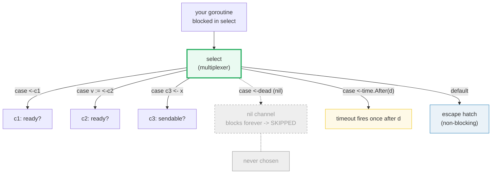

# SELECT — Multiplexing Channels with `select`

> **Goal (one line):** show, by printing every observable outcome, how Go's
> `select` statement multiplexes channel operations — the first READY case
> runs, when SEVERAL are ready one is picked at random, `default` makes it
> non-blocking, `time.After` provides a timeout case, and a nil channel
> disables its case.
>
> **Run:** `go run select.go`
>
> **Ground truth:** [`select.go`](./select.go) → captured stdout in
> [`select_output.txt`](./select_output.txt). Every set and worked example
> below is pasted **verbatim** from that file under a
> `> From select.go Section X:` callout. Nothing is hand-computed.
>
> **Prerequisites:**
> - 🔗 [`GOROUTINES`](./GOROUTINES.md) — `select`'s cases are channel
>   operations, and the producers in fan-in are goroutines.
> - 🔗 [`CHANNELS`](./CHANNELS.md) — you must understand blocking send/receive,
>   buffering, and `close` before `select` makes sense (select *watches*
>   channels).

---

## 1. Why this bundle exists (lineage)

A `go` statement spawns a goroutine; a channel connects two goroutines. But
real programs talk to **many** goroutines at once — a timeout, a cancellation
signal, a results stream, an error path. Polling each channel in turn would
either busy-spin (burning a CPU) or block on the first channel (starving the
rest). `select` is the primitive that fixes this: **one statement that waits
on many channel operations at once and runs whichever becomes ready.**

It is the hinge of idiomatic Go concurrency:

- 🔗 [`CHANNELS`](./CHANNELS.md) — `select` operates *only* on channel
  send/receive. It is literally "a `switch` whose cases are communications."
- 🔗 [`CONCURRENCY_PATTERNS`](./CONCURRENCY_PATTERNS.md) — fan-out/fan-in,
  pipelines, and worker pools are all built on a `select` inside a loop.
- 🔗 [`CONTEXT`](./CONTEXT.md) — cancellation propagation is
  `select { case <-ctx.Done(): ... ; case out <- v: ... }`. The timeout in
  this bundle (section D) is the same idea without the `context` wrapper.



---

## 2. The mental model: what the spec actually guarantees

> From `go.dev/ref/spec` — *Select statements*:
> "A **select** statement chooses which of a set of possible send or receive
> operations will proceed."
>
> Execution proceeds in steps. The decisive one (step 2):
> "If one or more of the communications can proceed, a single one that can
> proceed is chosen via a **uniform pseudo-random selection**. Otherwise, if
> there is a default case, that case is chosen. If there is no default case,
> the 'select' statement **blocks until at least one** of the communications
> can proceed."

Three behaviors fall straight out of that sentence, and they are the whole
game:

| Situation | Behavior | Section |
|---|---|---|
| Exactly one case ready | That case runs — deterministic. | A |
| Two or more cases ready | **One** is picked, uniformly at random. Never assume order. | B |
| No case ready, no `default` | `select` **blocks** until one becomes ready. | D |
| No case ready, has `default` | `default` runs immediately → non-blocking. | C |

Plus two derived idioms this bundle proves:

- **Timeout case:** `case <-time.After(d)` is just a channel that becomes
  ready after `d` — so it wins the race when nothing else fires (section D).
- **Nil-channel disables a case:** a receive/send on a **nil channel blocks
  forever**, so select treats a nil-channel case as *never ready* and skips it
  (section E). This is the key idiom for staged shutdown inside a fan-in loop.

> **Determinism note (read this before the outputs).** The runtime's "uniform
> pseudo-random selection" is an *internal* coin-flip — it is **not** the
> `math/rand` generator and cannot be seeded. So this bundle **never** asserts
> *which* ready case won. Each section either (a) forces exactly one case
> ready (nothing to randomize), or (b) collects many trials into a **sorted
> set** and asserts the set's *membership*. Either way the printed bytes are
> identical across runs. (`just out select` twice → byte-identical; verified.)

---

## 3. Section A — Only one case ready: deterministic pick

`c1` is a buffered channel with a value already in it (ready immediately);
`c2` is an unbuffered channel with no sender (a receive would block forever).
Only `c1` can proceed, so there is no randomness — `select` MUST take `c1`.

> From `select.go` Section A:
> ```
> c1: buffered chan holding "a" (ready)
> c2: unbuffered chan with no sender (blocks forever)
> select picked: "a"
> ```
> ```
> [check] only c1 ready -> select picks "a": OK
> ```

**Why buffered matters for "ready".** A send to a buffered channel with free
space completes **immediately** — the value sits in the buffer, ready to be
received, with no goroutine involved. That is what makes `c1 <- "a"` then
`select { case got = <-c1: }` a fully deterministic, race-free setup: the
value is *already* there before select runs. Contrast with an unbuffered
channel, where a send only completes when a receiver is simultaneously ready.

> **Expert detail — step 1 of the spec.** On *entering* a `select`, the
> channel operands (and send RHS values) of **every** case are evaluated
> exactly once, in source order, *before* any case is chosen — and their side
> effects happen "irrespective of which (if any) communication operation is
> selected." So `select { case <-slowEval(): ... ; case <-c2: ... }` runs
> `slowEval()` unconditionally on entry. Don't put expensive work in a case
> expression expecting lazy evaluation.

---

## 4. Section B — Multiple cases ready: one chosen at random

Both `left` and `right` are buffered(1) and pre-loaded, so **both** receives
are ready on every trial. We run the select 1000 times and record only *which*
case won (collapsed into a set).

> From `select.go` Section B:
> ```
> ran select with BOTH cases ready 1000 times
> set of winners (sorted) = {left, right}
> ```
> ```
> [check] left appeared at least once: OK
> [check] right appeared at least once: OK
> [check] winner set has exactly 2 members {left,right}: OK
> ```

**What this proves.** With two ready cases the runtime flips its
pseudo-random coin each time, so over 1000 trials **both** sides win some of
the time. We assert *membership of the set* (`{left, right}`, length 2), never
the per-trial order or the counts — those are random.

**How random is "uniform"?** The probability that one side *never* wins in
1000 fair ~50/50 trials is about `2 × (1/2)^1000 ≈ 1e-301` — effectively
impossible, so asserting "both appeared" is deterministic in practice. This is
the standard way to test select's randomness without flakiness.

> **The trap this section exists to prevent.** Beginners write
> `select { case <-a: handleA(); case <-b: handleB() }` and *assume* `a` is
> checked first (because it's written first). It is not. If both are ready,
> either can run. If your logic depends on an order, **drain explicitly** or
> restructure — never rely on source order among ready cases. (The pipelines
> blog states the same: `merge(c1, c2)` yields "4 then 9, **or 9 then 4**".)

---

## 5. Section C — `default`: non-blocking select

A `default` clause is the escape hatch: if **no** case is ready, `default`
runs immediately instead of blocking. This is the foundation of non-blocking
send/receive and of polling.

> From `select.go` Section C:
> ```
> empty channel (no sender) + default clause
> default path taken: true
> ```
> ```
> [check] default ran because no case was ready: OK
> [check] no value was received from the empty channel: OK
> ```

The non-blocking receive idiom is exactly this:

```go
select {
case v := <-c:        // got one
default:              // c empty -> don't block, take this path
}
```

> **Gotcha — the busy-loop anti-pattern.** Wrapping a blocking `select` in a
> `for {}` with a `default` that does nothing makes a **CPU-burning spin
> lock**: the `default` fires every iteration because nothing is ready, so the
> loop never sleeps. Prefer either a blocking `select` (no `default`) or add
> a `case <-time.After(...)` / `runtime.Gosched()` to yield. The Go community
> rule of thumb: if your `select` has a `default` inside a tight `for`, you
> almost certainly want a blocking select with a timeout case instead.

---

## 6. Section D — `time.After`: the timeout case

`time.After(d)` returns a channel that fires **once** after duration `d`. As a
select case it is the standard timeout. We race a channel that never fires
against `time.After`; the timeout always wins. We deliberately do **not** print
the duration — wall-clock is not a reproducible, verified value.

> From `select.go` Section D:
> ```
> select { <-neverFires ; <-time.After(d) }
> timeout case won: true
> ```
> ```
> [check] timeout case won: OK
> [check] the never-fire case did NOT win: OK
> ```

> From `pkg.go.dev/time#After`:
> "After waits for the duration to elapse and then sends the current time on
> the returned channel. It is equivalent to `NewTimer(d).C`."

**Why a channel, not a callback?** Go's timeout returns a *channel* precisely
so it slots into `select` uniformly with your other cases. This is the same
mechanism 🔗 [`CONTEXT`](./CONTEXT.md) packages up as
`ctx, cancel := context.WithTimeout(...)`; under the hood that too is a select
on a timer channel plus a cancellation channel.

> **Expert detail — the pre-1.23 `time.After` leak (historical).** Before Go
> 1.23, an unfired `time.After` timer was **not** garbage-collected until it
> fired. In a tight `select { case ...: case <-time.After(d): }` loop where
> the timeout rarely won, timers piled up and leaked memory. The fix back then
> was `t := time.NewTimer(d); ... t.Stop()`. **Since Go 1.23 the GC reclaims
> unreferenced, unstopped timers** — and this module's floor is Go 1.26, so
> `time.After` is safe to use directly. (Still prefer `context.WithTimeout`
> for request-scoped timeouts so cancellation propagates.)

---

## 7. Section E — nil channel disables its case

A send or receive on a **nil channel blocks forever**. Inside a `select`,
"blocks forever" means "never ready" — so a nil-channel case is silently
**skipped**. Setting a channel variable to `nil` dynamically **disables** that
case. We run a select 100 times with one live channel and one nil channel; the
nil case can never win.

> From `select.go` Section E:
> ```
> ran select { live ; nil } 100 times
> set of winners (sorted) = {A}
> ```
> ```
> [check] nil-channel case never won (set has only A): OK
> [check] the live value "A" was received: OK
> ```

**The payoff — staged shutdown.** Because nil disables a case, you can steer
a long-running select by *nil-ing out* channels as their sources close,
without restructuring the select. This is exactly how `fanIn` (section F)
avoids spinning on a closed channel.

> **Contrast with a *closed* channel (do not confuse these).** A receive on a
> **closed** channel is *always ready* — it immediately returns the zero value
> with `ok == false`. So a closed-channel case is the **opposite** of a
> nil-channel case: closed → always chosen (hot loop!), nil → never chosen.
> That asymmetry is why fan-in nils out a channel when it sees `ok == false`
> rather than leaving it closed. See 🔗 [`CHANNELS`](./CHANNELS.md) for the
> close semantics, and the fan-in code below.

---

## 8. Section F — fan-in: merging channels with `select`

Fan-in is a `select` inside a loop that copies values from N input channels
onto one output channel, closing the output when all inputs are done. We merge
producers `{1,2,3}` and `{4,5,6}`, collect everything, **sort**, and assert the
merged set equals the union. (Arrival order is random; the sorted set is not.)

> From `select.go` Section F:
> ```
> merged producers {1,2,3} and {4,5,6} via select-in-a-loop
> collected (sorted) = [1 2 3 4 5 6]
> ```
> ```
> [check] fan-in delivered all 6 values: OK
> [check] sorted merge == union {1..6}: OK
> ```

**The heart of fan-in — disable-on-close via nil.** When an input closes
(`ok == false`), the worker sets that channel variable to `nil`. The next
iteration's select now has that case permanently disabled (section E), so it
keeps waiting on the *remaining* live input instead of hot-looping on a closed
channel. The loop ends when every input has been nilled out:

```go
for a != nil || b != nil {
    select {
    case v, ok := <-a:
        if !ok { a = nil }   // disable this case
        else   { out <- v }
    case v, ok := <-b:
        if !ok { b = nil }
        else   { out <- v }
    }
}
close(out)
```

This is the canonical stdlib fan-in. The Go blog (*Pipelines and cancellation*)
implements `merge` the same way, and notes the merged output arrives in
**nondeterministic** order — which is precisely why we sort before asserting.

> **Concurrency notes (🔗 GOROUTINES).** `fanIn` and `produce` spawn
> goroutines that **only send on channels** — none of them print. All printing
> happens in `main` after the merged channel is drained and the result sorted.
> That is the house determinism rule (HOW_TO_RESEARCH §4.2 rule 2): never print
> from a goroutine; collect, sort, then print from `main`.

---

## 9. The case you cannot run: empty `select {}`

An empty `select {}` has **zero** cases and no `default`, so the "blocks until
at least one communication can proceed" rule means it blocks **forever**. It is
deliberately not in the runnable file (it would hang the program — and if run
as the only goroutine, the runtime detects the deadlock and crashes with
`fatal error: all goroutines are asleep - deadlock!`).

> From `go.dev/ref/spec` (*Select statements*) and corroborated by the Go
> runtime: with zero cases nothing can ever proceed, so `select {}` blocks
> indefinitely. Its common use is to keep `main` alive while goroutines do the
> work (e.g. a server's last line), or to intentionally park a goroutine.

```go
func main() {
    go server()   // runs forever
    select {}     // block main forever (the server goroutine keeps it alive)
}
```

---

## 10. Pitfalls (the expert payoff)

| Trap | Symptom | Fix |
|---|---|---|
| Assuming source order among ready cases | Logic bug: "the first case should win" | It's a **uniform pseudo-random** pick. Never rely on order; if order matters, drain explicitly. |
| `default` inside a tight `for {}` | 100% CPU spin (busy-loop) | Use a blocking `select` (no `default`) or add a `time.After`/`Gosched` case to yield. |
| Leaving a **closed** channel in a select | Hot-loop / spinning: closed chan is *always ready* | On `ok == false`, set the channel var to **nil** to disable the case (section E/F). |
| `time.After` in a tight loop (pre-1.23) | Timer leak / memory growth | Fixed in Go 1.23+ (GC reclaims timers); on older code use `NewTimer` + `Stop`, or `context.WithTimeout`. |
| Forgetting a `default` when you wanted polling | Select blocks forever on empty channels | Add `default:` for non-blocking receive/send; remove it when you *want* to block. |
| `select { case out <- v: }` with no receiver and no default | Blocks forever if downstream stalls | Add `case <-done:` (🔗 CONTEXT) or a timeout so a stalled consumer can't wedge the producer. |
| Sending on a **nil** channel (outside select) | Blocks forever silently | Initialize with `make(chan T)`; nil is only safe *inside a select* to disable a case. |
| Empty `select {}` as the only goroutine | `fatal error: all goroutines are asleep - deadlock!` | Keep another goroutine alive, or use it only to park `main` alongside running workers. |

---

## 11. Cheat sheet

```go
// select watches channel operations and runs the first READY case.
//
//   multiple ready  -> ONE chosen via uniform pseudo-random selection (never assume order)
//   none ready, no default -> blocks until one is ready
//   none ready, +default   -> default runs immediately (NON-blocking)
//   nil-channel case       -> blocks forever -> SKIPPED (disable a case by setting it to nil)
//   select {}              -> blocks forever (zero cases)

// basic shape
select {
case v := <-c1:          // receive (may capture)
case c2 <- x:            // send
case <-time.After(d):    // timeout case
default:                 // non-blocking escape hatch
}

// non-blocking receive
select {
case v := <-c:  // got one
default:        // empty, don't block
}

// timeout
select {
case res := <-slow:            // happy path
case <-time.After(2*time.Second): // give up after 2s
case <-ctx.Done():            // cancelled (LINK CONTEXT)
}

// fan-in (merge N channels into 1) — nil disables a closed input
for a != nil || b != nil {
    select {
    case v, ok := <-a:
        if !ok { a = nil } else { out <- v }
    case v, ok := <-b:
        if !ok { b = nil } else { out <- v }
    }
}
```

---

## Sources

Every behavioral claim above was verified against the Go specification, the
standard-library docs, and the official Go blog, then corroborated by
independent secondary sources:

- The Go Programming Language Specification — https://go.dev/ref/spec
  - *Select statements* (the authoritative "uniform pseudo-random selection",
    `default`, and "blocks until at least one" semantics; step-1 operand
    evaluation): https://go.dev/ref/spec#Select_statements
  - *Receive operator* / *Send statements* (a nil channel blocks forever;
    a closed channel is always ready with the zero value):
    https://go.dev/ref/spec#Receive_operator
- `time` package — `func After(d Duration) <-chan Time` ("waits for the
  duration to elapse and then sends the current time on the returned channel;
  equivalent to NewTimer(d).C"; pre-1.23 GC caveat resolved in 1.23):
  https://pkg.go.dev/time#After
- Go Blog — *Go Concurrency Patterns: Pipelines and cancellation* (fan-out /
  fan-in, the `merge` via `select` + `WaitGroup`, `done`-channel cancellation;
  merged output arrives as "4 then 9, or 9 then 4" — i.e. nondeterministic):
  https://go.dev/blog/pipelines
- Go Blog — *Advanced Go Concurrency Patterns* (deeper uses of `select`,
  referenced by the pipelines article): https://go.dev/blog/advanced-go-concurrency-patterns
- Stack Overflow (quotes the spec verbatim): "The 'select' statement blocks
  until at least one of the communications can proceed. If multiple
  communications can proceed, one is selected randomly." —
  https://stackoverflow.com/questions/47645808/how-does-select-work-when-multiple-channels-are-involved
- Go by Example — *Non-Blocking Channel Operations* (`default` makes select
  non-blocking): https://gobyexample.com/non-blocking-channel-operations
- yourbasic.org — *Select waits on a group of channels* (empty `select {}`
  blocks forever): https://yourbasic.org/golang/select-explained/
- Dolt engineering blog — *A Useful Pattern for Nil Channel Values in Go*
  (nil channel blocks forever; used to disable a select case for staged
  shutdown): https://www.dolthub.com/blog/2024-10-25-go-nil-channels-pattern/

**Facts that could not be verified by running** (documented, not executed):
empty `select {}` blocks forever and, as the sole goroutine, trips the
runtime's deadlock detector (`fatal error: all goroutines are asleep -
deadlock!`). These are confirmed by the spec section cited above and by the
Go runtime's deadlock-detection behavior, not reproduced as runnable output —
a file containing them would hang or crash instead of producing stdout.
