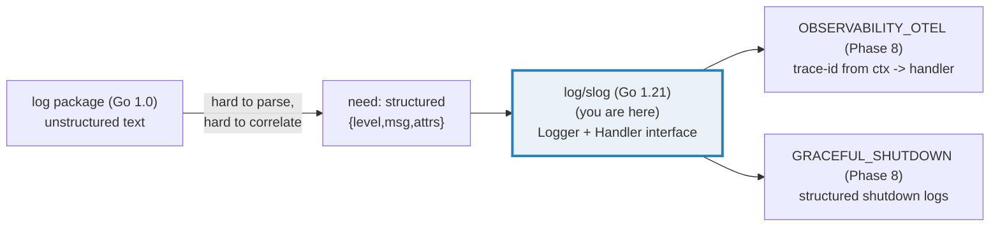
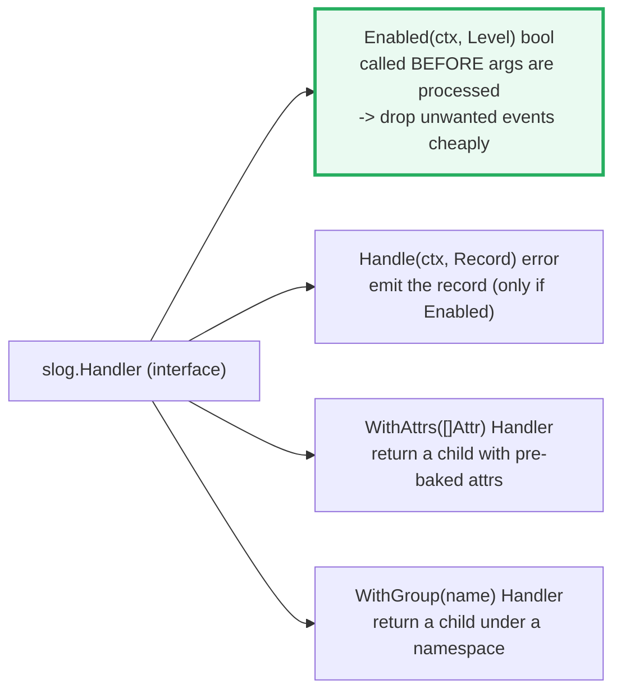
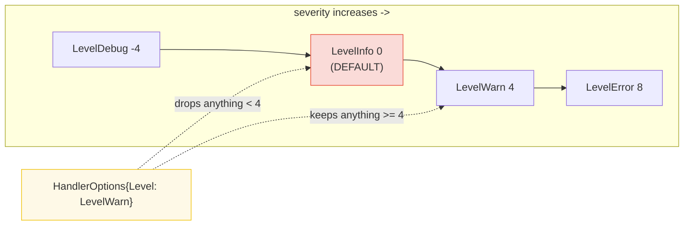
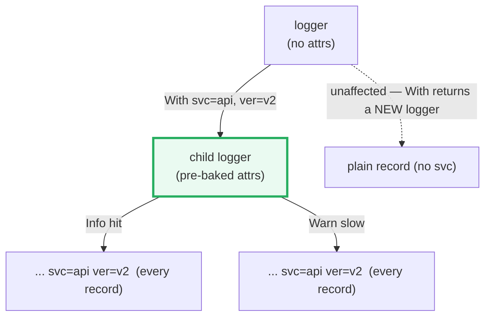
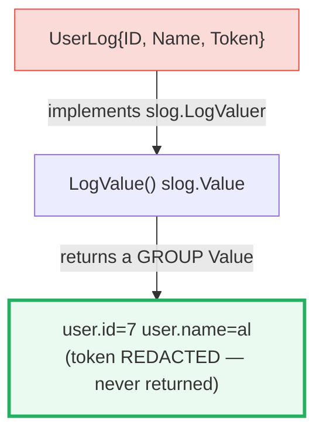
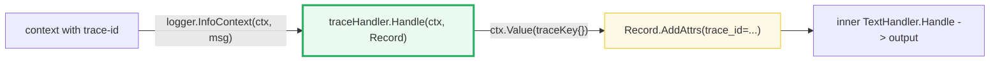

# SLOG — `log/slog` Structured Logging: Levels, Handlers, Context & Groups

> **Goal (one line):** show, by printing every behavior, how `log/slog`
> performs **structured logging** — each record is a
> `{time, level, msg, attrs...}` tuple serialized by a pluggable **Handler**
> (`TextHandler` → `key=value`, `JSONHandler` → JSON) — with **levels**,
> `With`, `Group`, `LogValuer`, and **context integration**.
>
> **Run:** `go run slog.go`
>
> **Ground truth:** [`slog.go`](./slog.go) → captured stdout in
> [`slog_output.txt`](./slog_output.txt). Every line/table below is pasted
> **verbatim** from that file under a `> From slog.go Section X:` callout.
> Nothing is hand-computed.
>
> **Prerequisites:** 🔗 [`CONTEXT`](./CONTEXT.md) (a custom handler reads
> request-scoped values out of `ctx`; `InfoContext` is the ctx-taking variant).
> 🔗 [`INTERFACES_BASICS`](./INTERFACES_BASICS.md) (the `Handler` interface is
> satisfied implicitly) and 🔗 [`ENCODING_JSON`](./ENCODING_JSON.md) (JSONHandler
> emits JSON objects; `encoding/json` decodes them) are assumed.

---

## 1. Why this bundle exists (lineage)

The original `log` package (present since Go 1.0) emits **unstructured** text:
`2023/08/04 16:09:19 hello, world`. A human can read it, but a log pipeline
cannot reliably parse the free-form tail, so filtering, searching, and
correlating across services is brittle. **Structured logging** fixes that by
making every record a bag of typed key-value pairs that machines parse
unambiguously and humans can still read.

`log/slog` (added in **Go 1.21**, August 2023) brought structured logging into
the **standard library**. It was not built to kill third-party loggers
(`logrus`, `zap`, `zerolog`, `logr`); it was built to give them a **common
backend** — the `Handler` interface — so a program that pulls in several of them
through its dependencies can configure one consistent output. Handlers for
`zap`, `logr`, and `hclog` already exist.



> From the Go Blog — *"Structured Logging with slog"* (Jonathan Amsterdam,
> 2023): *"The new `log/slog` package in Go 1.21 brings structured logging to
> the standard library. Structured logs use key-value pairs so they can be
> parsed, filtered, searched, and analyzed quickly and reliably."* And: *"By
> including structured logging in the standard library, we can provide a common
> framework that all the other structured logging packages can share."*

---

## 2. The mental model: the `Record` and the `Handler`

A `slog.Logger` does not format anything itself. Each output method builds a
**`Record`** and hands it to an associated **`Handler`**, which decides whether
to emit it and how to serialize it. The split is *frontend* (`Logger`) calls
*backend* (`Handler`) — that seam is what lets every logging library interoperate.

```mermaid
graph TD
    CALL["logger.Info(\"login\", \"user\", \"al\", \"count\", 3)"] --> REC["Record{time, level, msg, attrs}"]
    REC -->|Enabled?| EN["Handler.Enabled(ctx, level) bool<br/>early bail-out: drop if below min level"]
    EN -->|yes| HD["Handler.Handle(ctx, Record) error<br/>serializes the record"]
    HD --> TH["TextHandler<br/>key=value text"]
    HD --> JH["JSONHandler<br/>one JSON object per line"]
    HD --> CH["custom Handler<br/>(e.g. inject trace-id from ctx)"]
    style REC fill:#fef9e7,stroke:#f1c40f,stroke-width:3px
    style EN fill:#eafaf1,stroke:#27ae60
    style HD fill:#eaf2f8,stroke:#2980b9
```

**A `Record` is a `{time, level, msg, attrs...}` tuple** (verbatim from
`pkg.go.dev/log/slog`): *"A log record consists of a time, a level, a message,
and a set of key-value pairs, where the keys are strings and the values may be of
any type."* The built-in keys for the four built-in fields are constants:
`slog.TimeKey`, `slog.LevelKey`, `slog.MessageKey` (`"msg"`), `slog.SourceKey`.

**The `Handler` interface has four methods:**



> From `pkg.go.dev/log/slog` — `Enabled`: *"It is called early, before any
> arguments are processed, to save effort if the log event should be
> discarded."* This is the performance keystone (§9).

### Determinism: neutralizing the timestamp

Every record carries `time`, so raw output is non-reproducible. This bundle
builds **every** handler with a `HandlerOptions{ReplaceAttr: dropTime}` whose
callback deletes the top-level `"time"` attribute, and writes to a
`bytes.Buffer`:

```go
func dropTime(groups []string, a slog.Attr) slog.Attr {
    if a.Key == slog.TimeKey && len(groups) == 0 {
        return slog.Attr{} // returning a zero Attr DISCARDS the attribute
    }
    return a
}
```

> From `pkg.go.dev/log/slog` — `HandlerOptions.ReplaceAttr`: *"If ReplaceAttr
> returns a zero Attr, the attribute is discarded. The built-in attributes with
> keys "time", "level", "source", and "msg" are passed to this function."*

With the time field gone, two `go run slog.go` invocations are **byte-identical**
(verified: `diff` reports no difference across runs). This is the same discipline
as 🔗 `CONTEXT` asserting `Err()` codes instead of elapsed milliseconds.

---

## 3. Section A — `TextHandler` (key=value) vs `JSONHandler` (JSON)

The **same** record is logged through each handler; the only difference is the
serialization.

> From `slog.go` Section A:
> ```
> TextHandler : level=INFO msg=login user=al count=3
> JSONHandler : {"level":"INFO","msg":"login","user":"al","count":3}
> ```
> ```
> [check] TextHandler output contains user=al: OK
> [check] TextHandler output contains count=3: OK
> [check] JSONHandler output is valid JSON: OK
> [check] JSONHandler decodes to map[user]=="al": OK
> [check] JSONHandler decodes to map[count]==3 (JSON numbers -> float64): OK
> [check] JSONHandler output has no time field (neutralized): OK
> [check] both handlers emit the same msg: OK
> ```

**What.** `TextHandler` emits `key=value` pairs (strings quoted only when
needed, e.g. `msg="serving request"` when it contains a space — see Section F).
`JSONHandler` emits one JSON object per line. Both share the **identical** field
order: `level`, `msg`, then attrs in call order.

> From `pkg.go.dev/log/slog` (Overview): `logger.Info("hello", "count", 3)` with
> a TextHandler produces `time=... level=INFO msg=hello count=3`, and with a
> JSONHandler produces `{"time":...,"level":"INFO","msg":"hello","count":3}`.

**Why the `map[count]==3` check uses `float64`.** `encoding/json` decodes every
JSON number into a `float64` by default (🔗 `ENCODING_JSON`). So
`json.Unmarshal(jsonOut, &m)` yields `m["count"] == float64(3)`, not `int(3)`.
Asserting the concrete type is what makes the check pass.

**Choosing between them.** `JSONHandler` is the production default — log
aggregators (Loki, Elasticsearch, Datadog) parse JSON natively and index fields.
`TextHandler` is friendlier for local/dev console. Both are configurable through
the *same* `HandlerOptions` (`Level`, `AddSource`, `ReplaceAttr`), so swapping
formats is a one-line change with no call-site edits.

---

## 4. Section B — Levels & filtering (`Level=Warn` drops `Info`)



> From `slog.go` Section B:
> ```
> LevelDebug = -4
> LevelInfo  = 0   (the default value of a Level)
> LevelWarn  = 4
> LevelError = 8
> buffer after Info+Warn (Level=Warn):
> level=WARN msg=high-importance-warn k=v
> ```
> ```
> [check] LevelDebug == -4: OK
> [check] LevelInfo == 0: OK
> [check] LevelWarn == 4: OK
> [check] LevelError == 8: OK
> [check] Info record is DROPPED (absent from output): OK
> [check] Warn record is KEPT (present in output): OK
> ```

**What.** A `Level` is just an `int`; "higher means more severe." The four
constants are pinned above. The handler's minimum level comes from
`HandlerOptions.Level` (default `LevelInfo`). Setting it to `LevelWarn` makes
`Enabled` return `false` for the Info record, so **the record is never built or
serialized** — the buffer holds only the Warn line.

> From `pkg.go.dev/log/slog` — `HandlerOptions.Level`: *"reports the minimum
> record level that will be logged. The handler discards records with lower
> levels. If Level is nil, the handler assumes LevelInfo."*

**Why `Info == 0` (the design rationale, verbatim from the package docs).** *"We
wanted the default level to be Info. Since Levels are ints, Info is the default
value for int, zero."* And: *"a larger level means a more severe event, [so] a
logger that accepts events with smaller (or more negative) level means a more
verbose logger."* The gap of 4 between levels is deliberate — it matches
OpenTelemetry's mapping and leaves room for intermediate levels (e.g.
`Level(2)` for Google Cloud's "Notice"). Any `int` is a valid level; you are
not limited to the four names.

**Dynamic levels.** `HandlerOptions.Level` takes a `Leveler`. A `Level` value
fixes the floor for the handler's life; a `*slog.LevelVar` lets you change it at
runtime from any goroutine — the standard way to flip a service to debug without
a redeploy.

---

## 5. Section C — `With`: a child logger carries request-scoped attrs



> From `slog.go` Section C:
> ```
> base.With("svc","api","ver","v2").Info/Warn:
> level=INFO msg=hit svc=api ver=v2
> level=WARN msg=slow svc=api ver=v2
> ```
> ```
> [check] child log includes svc=api: OK
> [check] child log includes ver=v2: OK
> [check] BOTH records carry the With attrs (count of svc=api == 2): OK
> [check] base logger has NO svc attr (With does not mutate the parent): OK
> ```

**What.** `logger.With(args...)` returns a **new** `*Logger` whose handler was
called `WithAttrs`. Every subsequent record from the child carries those attrs.
The parent is untouched (asserted: the base logger's output has no `svc=`).

> From `pkg.go.dev/log/slog` (Overview): *"The result is a new Logger with the
> same handler as the original, but additional attributes that will appear in
> the output of every call."*

**Why this is the canonical request-scoped pattern.** A handler middleware
attaches `request_id`, `user_id`, `method` once via `With`, then passes the child
logger down the call chain (🔗 `NET_HTTP`: the per-request logger). Every line
that request emits is correlated for free — no call site repeats the boilerplate.

**Why it is also a performance win.** The built-in handlers pre-format the
`With` attrs **once** at the `With` call, not on every log line. The `Handler`
interface was designed around this (`WithAttrs` exists precisely so a handler
can bake attrs into a buffer prefix). For a large attr like an `*http.Request`,
this is a measurable speedup.

---

## 6. Section D — `Group`: nest attrs under a namespace

```mermaid
graph LR
    G["slog.Group(\"req\",<br/> method GET, path /x)"] --> TH["TextHandler:<br/>req.method=GET req.path=/x<br/>(dotted keys)"]
    G --> JH["JSONHandler:<br/>\"req\":{ \"method\":\"GET\", \"path\":\"/x\" }<br/>(nested object)"]
    style G fill:#fef9e7,stroke:#f1c40f,stroke-width:3px
```

> From `slog.go` Section D:
> ```
> TextHandler (Group -> dotted keys):
> level=INFO msg=finished req.method=GET req.path=/x status=200
> JSONHandler (Group -> nested object):
> {"level":"INFO","msg":"finished","req":{"method":"GET","path":"/x"},"status":200}
> ```
> ```
> [check] TextHandler: group flattened to req.method=GET: OK
> [check] TextHandler: group flattened to req.path=/x: OK
> [check] JSONHandler: req is a nested object: OK
> [check] JSONHandler: req.method == GET: OK
> ```

**What.** `slog.Group(name, kvs...)` collects several attrs under one key. The
two handlers qualify it differently: **TextHandler** flattens with a dot
(`req.method`); **JSONHandler** nests a real object (`"req": {...}`). The bundle
decodes the JSON and asserts `m["req"].(map[string]any)["method"] == "GET"`.

> From `pkg.go.dev/log/slog` (Overview, Groups): *"TextHandler separates the
> group and attribute names with a dot. JSONHandler treats each group as a
> separate JSON object, with the group name as the key."*

**Why groups matter at scale.** Different subsystems may use the same common key
(`id`, `name`). `Logger.WithGroup("parser")` qualifies every key a subsystem
emits, so `"parser.id"` never collides with a sibling's `"db.id"`. Group + the
`LogValuer` pattern (next) is how you log a struct as a tidy sub-object instead
of flattening it into the top level.

---

## 7. Section E — `LogValuer`: a type renders itself as attrs (and redacts)



> From `slog.go` Section E:
> ```
> LogValue of UserLog{id:7,name:"al",token:"super-secret"}:
> level=INFO msg=authenticated user.id=7 user.name=al
> ```
> ```
> [check] LogValuer rendered id=7: OK
> [check] LogValuer rendered name=al: OK
> [check] LogValuer REDACTED the token (absent from output): OK
> [check] LogValuer emitted NO user.token key at all: OK
> ```

**What.** A type implementing `LogValuer { LogValue() Value }` controls exactly
how it appears in logs. The bundle's `UserLog` returns a `GroupValue` of
`id` and `name` — so one value fans out into two qualified attrs
(`user.id`, `user.name`) — and **omits `Token` entirely**, so the secret never
reaches the handler.

> From `pkg.go.dev/log/slog` — `LogValuer`: *"A LogValuer is any Go value that
> can convert itself into a Value for logging. This mechanism may be used to
> defer expensive operations until they are needed, or to expand a single value
> into a sequence of components."* And the Overview: *"You can use this to
> control how values of the type appear in logs. For example, you can redact
> secret information like passwords, or gather a struct's fields in a Group."*

**Why `LogValuer` is also a performance lever.** `Value.Resolve` (which handlers
call) lazily invokes `LogValue` **only when the record is actually emitted**.
So wrapping an expensive computation behind a `LogValuer` type means it runs only
for enabled levels — `computeExpensiveValue` is skipped when the line is dropped
by the level filter.

---

## 8. Section F — `InfoContext` + a custom handler that reads `ctx` for a trace-id



> From `slog.go` Section F:
> ```
> InfoContext/WarnContext with ctx carrying trace-id:
> level=INFO msg="serving request" path=/home trace_id=trace-abc-123
> level=WARN msg="cache miss" key=u:7 trace_id=trace-abc-123
> ```
> ```
> [check] custom handler injected trace_id=trace-abc-123: OK
> [check] BOTH context logs carry the trace_id: OK
> [check] no trace_id when ctx carries none: OK
> ```

**What.** The bundle wraps a `TextHandler` in a `traceHandler` that overrides
only `Handle`: it pulls a `trace-id` out of the context (via an unexported
`traceKey{}` — see 🔗 `CONTEXT` §E for why the key must be unexported) and
attaches it as a `trace_id` attr before delegating. The `Enabled`, `WithAttrs`,
and `WithGroup` methods are **promoted** by embedding `slog.Handler`.

> From `pkg.go.dev/log/slog` (Overview, Contexts): *"Some handlers may wish to
> include information from the context.Context that is available at the call
> site. One example of such information is the identifier for the current span
> when tracing is enabled."* And `Handle`: *"It is present solely to provide
> Handlers access to the context's values. Canceling the context should not
> affect record processing."*

**Why the `…Context` methods exist at all.** The convenience methods
(`Info`, `Warn`, …) take no context; the `…Context` variants
(`InfoContext`, `Log`, `LogAttrs`) take `ctx` as the **first** argument so a
handler can extract cross-cutting baggage. This is the seam 🔗
`OBSERVABILITY_OTEL` (Phase 8) plugs into: an OTel-aware handler reads the
active span from `ctx` and stamps every record with `trace_id`/`span_id`, which
is how you jump from a slow log line straight to its trace.

**The two design debates (from the Go blog).** The `context` integration went
through real contention: (1) an early API let you *store a logger in* `ctx` —
removed as "smuggling an implicit dependency"; (2) the team "ultimately created
two sets of logging methods, one with a context and one without." The result is
the split you see: pass `ctx` explicitly when a handler needs it.

---

## 9. Pitfalls (the expert payoff)

| Trap | Symptom | Fix |
|---|---|---|
| Forgetting to neutralize the timestamp in tests | `_output.txt` differs on every run; flaky log assertions | Use `HandlerOptions{ReplaceAttr: dropTime}` (delete the top-level `time` key), or write to a `bytes.Buffer` and strip time before asserting. |
| Odd number of `args` (key without value) | `go vet`'s `slog` analyzer (or runtime) error: missing value / not a valid Attr | Every attr is a `(key, value)` pair or an `slog.Attr`; always pass an even number of alternation args. |
| Evaluating expensive args on a dropped level | `slog.Debug("x", "v", compute())` calls `compute()` even when Debug is filtered out | Wrap the value in a `LogValuer` type, or guard with `if logger.Enabled(ctx, slog.LevelDebug)`. |
| `With` losing your custom handler's behavior | `logger.With(...)` on a custom-handler logger returns a child whose handler is the **wrapped** type | A wrapping handler must re-implement `WithAttrs`/`WithGroup` to return its own type; otherwise the child drops the wrapping (e.g. the trace-id injection). |
| Printing the default logger's output and asserting on it | Non-deterministic: includes a real timestamp and a `log`-package prefix | Build an explicit `slog.New(handler)` writing to a buffer; never assert on the process-wide default logger. |
| Mutating a `Record` shared with the caller | Editing a `Record` passed to `Handle` (e.g. `AddAttrs`) can corrupt state the caller still holds | `Record.Clone()` before mutating, or build a fresh `Record` via `NewRecord`. |
| `Group` with an **empty** key | The group is silently **inlined** (attrs merged into the parent, no namespace) | Pass a non-empty group name when you want qualification; use `""` deliberately when you want flattening. |
| `LevelVar` not shared | Changing the level "does nothing" because each handler got its own copy | Pass the *same* `*slog.LevelVar` pointer to every handler; `Level` values are copied, `LevelVar` is the shared, goroutine-safe knob. |
| Source location wrong inside a wrapper | `AddSource` reports your wrapper's file, not the caller's | Capture `pc` via `runtime.Callers` and pass it to `NewRecord` (see the pkg "Wrapping" example); this is why `slog` uses `runtime` reflection. |
| Assuming `JSONHandler` decodes numbers as `int` | Assertion `m["count"] == 3` fails — it is `float64(3)` | `encoding/json` maps JSON numbers to `float64` by default; assert against `float64` or use a typed target struct. |

---

## 10. Cheat sheet

```go
import "log/slog"

// Levels (ints: higher = more severe). Any int is a valid level.
//   LevelDebug=-4  LevelInfo=0 (default)  LevelWarn=4  LevelError=8

// Two built-in handlers (same HandlerOptions):
logger := slog.New(slog.NewTextHandler(os.Stderr, nil))  // key=value text
logger := slog.New(slog.NewJSONHandler(os.Stdout, nil))  // JSON object/line

// Attrs: typed constructors, or alternating key/value pairs.
logger.Info("login", "user", "al", "count", 3)            // alternating
logger.Info("login", slog.String("user", "al"), slog.Int("count", 3)) // Attrs (faster)
logger.LogAttrs(ctx, slog.LevelInfo, "login", slog.String("user","al")) // fastest

// Minimum level / dynamic level:
h := slog.NewJSONHandler(w, &slog.HandlerOptions{Level: slog.LevelWarn}) // drop < Warn
var lv = new(slog.LevelVar); h := slog.NewJSONHandler(w, &slog.HandlerOptions{Level: lv}); lv.Set(slog.LevelDebug)

// Neutralize the timestamp for deterministic output/tests:
dropTime := func(groups []string, a slog.Attr) slog.Attr {
    if a.Key == slog.TimeKey && len(groups) == 0 { return slog.Attr{} } // zero Attr = discard
    return a
}
h := slog.NewTextHandler(&buf, &slog.HandlerOptions{ReplaceAttr: dropTime})

// With: a child logger pre-bakes attrs (formatted ONCE; request-scoped pattern).
reqLogger := logger.With("request_id", rid, "user", uid)

// Group: namespace attrs. TextHandler -> dotted keys; JSONHandler -> nested object.
logger.Info("done", slog.Group("req", slog.String("method","GET")), slog.Int("status",200))

// LogValuer: a type renders itself (and redacts). Implement LogValue() Value.
type User struct{ ID int; Token string }
func (u User) LogValue() slog.Value { return slog.GroupValue(slog.Int("id", u.ID)) /* token omitted */ }

// Context: the ...Context methods pass ctx so a handler can inject trace-id.
// Wrap a handler; override Handle to read ctx.Value(traceKey{}) and Record.AddAttrs.
logger.InfoContext(ctx, "serving")

// Handler interface: Enabled(ctx,Level) bool; Handle(ctx,Record) error;
//   WithAttrs([]Attr) Handler; WithGroup(name) Handler. Enabled is the early bail-out.
```

---

## Sources

Every signature, level value, and behavioral claim above was verified against the
Go standard-library docs, the Go blog, and the design discussion, then
corroborated by independent secondary sources:

- `log/slog` package — https://pkg.go.dev/log/slog
  - Overview ("structured logging... a message, a severity level, and various
    other attributes expressed as key-value pairs"; "A log record consists of a
    time, a level, a message, and a set of key-value pairs"; TextHandler output
    `time=... level=INFO msg=hello count=3`; JSONHandler output JSON object;
    `With` "result is a new Logger with the same handler... additional
    attributes that will appear in the output of every call"; Groups: "TextHandler
    separates the group and attribute names with a dot. JSONHandler treats each
    group as a separate JSON object"; Contexts: "Some handlers may wish to
    include information from the context.Context... identifier for the current
    span when tracing is enabled"; `…Context` variants recommendation):
    https://pkg.go.dev/log/slog#pkg-overview
  - `Level` type & constants (`LevelDebug = -4`, `LevelInfo = 0`, `LevelWarn =
    4`, `LevelError = 8`; "the higher the level, the more important or severe";
    rationale for the numbering — default=Info=0, larger=more severe, gap of 4
    matches OpenTelemetry): https://pkg.go.dev/log/slog#Level
  - `Handler` interface (`Enabled` "called early, before any arguments are
    processed, to save effort"; `Handle` "It is present solely to provide
    Handlers access to the context's values. Canceling the context should not
    affect record processing"; `WithAttrs`, `WithGroup`):
    https://pkg.go.dev/log/slog#Handler
  - `HandlerOptions` (`Level` "reports the minimum record level... If Level is
    nil, the handler assumes LevelInfo"; `AddSource`; `ReplaceAttr` "If
    ReplaceAttr returns a zero Attr, the attribute is discarded. The built-in
    attributes with keys time/level/source/msg are passed to this function"):
    https://pkg.go.dev/log/slog#HandlerOptions
  - `LogValuer` ("any Go value that can convert itself into a Value for
    logging... defer expensive operations... expand a single value into a
    sequence of components"; redaction & Group examples):
    https://pkg.go.dev/log/slog#LogValuer
  - Built-in key constants (`TimeKey`, `LevelKey`, `MessageKey`, `SourceKey`):
    https://pkg.go.dev/log/slog#pkg-constants
  - `DiscardHandler` / `GroupAttrs` (go1.25) examples used to confirm the
    drop-time `ReplaceAttr` idiom: https://pkg.go.dev/log/slog#pkg-examples
- Go Blog — *"Structured Logging with slog"* (Jonathan Amsterdam, 22 Aug 2023):
  Go 1.21 origin; "structured logs use key-value pairs so they can be parsed,
  filtered, searched"; "a common framework that all the other structured logging
  packages can share"; the two built-in handlers; `context.Context`/trace IDs;
  `Logger.With`; `LogValuer`; the design process (removed logger-in-context; two
  method sets; alternating key-value retained with a vet check):
  https://go.dev/blog/slog
- Go Wiki — *"Resources for slog"* (community handlers: zap, logr, hclog; the
  handler-writing guide): https://go.dev/wiki/Resources-for-slog
- The `slog` proposal / design doc (the frontend `Logger` + backend `Handler`
  split; the `Enabled` early-bail-out; `WithAttrs` pre-formatting optimization):
  https://go.googlesource.com/proposal/+/master/design/56345-structured-logging.md
- Secondary corroboration (>=2 independent sources, web-verified):
  - Dash0 — *"Logging in Go with Slog: A Practitioner's Guide"* (levels, handlers,
    `With`/Group, performance tradeoffs, production pitfalls):
    https://www.dash0.com/guides/logging-in-go-with-slog
  - Last9 — *"Logging in Go with Slog: A Detailed Guide"* (customization,
    handlers, log levels, dynamic `LevelVar`):
    https://last9.io/blog/logging-in-go-with-slog-a-detailed-guide/

**Facts that could not be verified by running** (documented, not executed,
because they are static-analysis diagnostics or are about un-run third-party
integration): the `go vet`/`x/tools` `slog` analyzer flagging an odd number of
key-value args; and the existence of OTel/zap/logr handler adapters. These are
confirmed by the Go Blog and the Go Wiki above, not reproduced as runnable output
(a file triggering the vet error would not pass `just check`).
