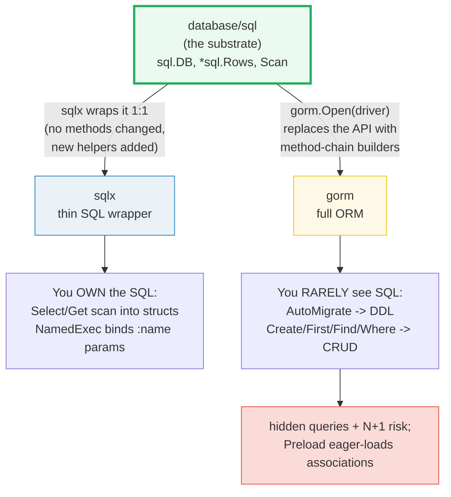
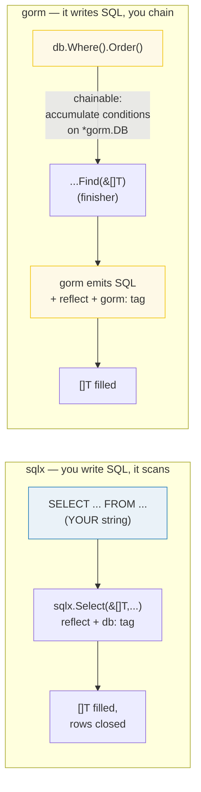
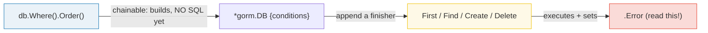
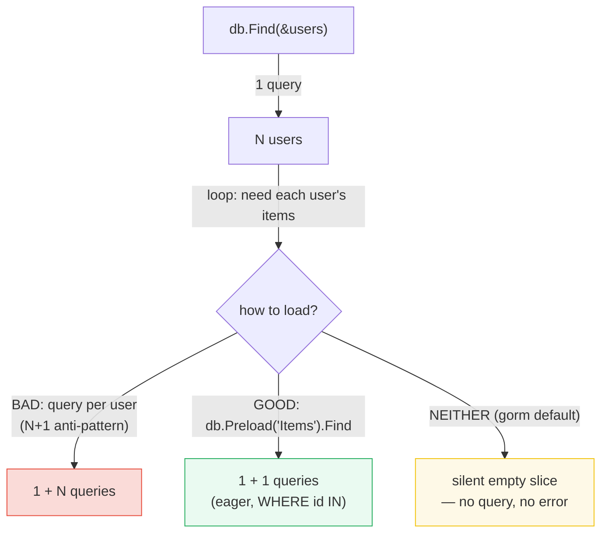

# SQLX_GORM — sqlx vs gorm: Thin SQL Wrapper vs Full ORM

> **Goal (one line):** show, by running the **same** insert/query/update/delete
> operations through both a thin SQL wrapper (sqlx) and a full ORM (gorm) against
> in-memory sqlite, what each gives you, what each hides, and where each
> surprises you.
>
> **Run:** `go run sqlx_gorm.go`
>
> **Ground truth:** [`sqlx_gorm.go`](./sqlx_gorm.go) → captured stdout in
> [`sqlx_gorm_output.txt`](./sqlx_gorm_output.txt). Every row, name, count, and
> error below is pasted **verbatim** from that file under a
> `> From sqlx_gorm.go Section X:` callout. Nothing is hand-computed.
>
> **Prerequisites:** 🔗 [`DATABASE_SQL`](./DATABASE_SQL.md) (both libraries are
> layers *on top* of `database/sql` — you must know the `sql.DB` / `*sql.Rows`
> / `Scan` / connection-pool substrate first), 🔗 [`ERRORS`](./ERRORS.md)
> (gorm's `ErrRecordNotFound` is a sentinel tested with `errors.Is`, exactly the
> pattern this bundle's Section E exercises), and 🔗 [`REFLECTION`](./REFLECTION.md)
> / 🔗 [`ESCAPE_ANALYSIS`](./ESCAPE_ANALYSIS.md) (both tools scan rows into
> structs via `reflect`, and the dest pointers they take are `interface{}` values
> that escape to the heap).

---

## 1. Why this bundle exists (lineage & the contrast)

`database/sql` is complete but **verbose**: you hand-write every `INSERT`/`SELECT`,
loop `rows.Next()`, and `Scan` every column positionally. Two ecosystems grew on
top of it to remove that boilerplate — in **opposite directions**:

- **`sqlx`** is a *thin wrapper*. It keeps you in full control of SQL and just
  removes the `Scan` plumbing: `Select`/`Get` reflect-scan rows straight into a
  struct or slice via `db:"col"` tags; `NamedExec` binds `:name` placeholders to
  struct fields. **You still write every query.** Nothing is hidden.
- **`gorm`** is a *full ORM*. `AutoMigrate` derives the schema from struct tags;
  `Create`/`First`/`Find`/`Where`/`Updates`/`Delete` are method chains that gorm
  compiles into SQL. **You rarely write SQL at all** — and that is both the
  productivity win and the source of every gorm surprise.



> From the sqlx package doc (pkg.go.dev, verbatim): *"Package sqlx provides
> general purpose extensions to database/sql… None of the underlying
> database/sql methods are changed. Instead all extended behavior is implemented
> through new methods defined on wrapper types. Additions include scanning into
> structs, named query support… convenient shorthands for common error
> handling."*

> From the gorm guides (gorm.io/docs, verbatim): *"GORM simplifies database
> interactions by mapping Go structs to database tables… GORM and a struct's
> fields to table columns."* Its feature list: *"Full-Featured ORM…
> Associations (Has One, Has Many…)… Hooks… Eager loading with `Preload`,
> `Joins`… Auto Migrations."*

The **whole point of this bundle** is that they trade off along one axis —
**control vs productivity** — and that the same task (insert + query) looks
radically different in each while returning identical data (Section F proves it).

---

## 2. The mental model: struct tags, reflect, and chainable builders

Both libraries do their magic the same way under the hood: **reflection over the
destination struct**, matching column names to field tags. They differ in *how
much else* they do.



**The two tag dialects (they do NOT mix):**

| Tool | Tag key | Example | Mapper |
|---|---|---|---|
| **sqlx** | `db:"name"` | `Name string \`db:"name"\`` | `strings.ToLower` by default; the `db:` tag overrides it |
| **gorm** | `gorm:"..."` | `Name string \`gorm:"column:name;size:64"\`` | snake_case by convention; `gorm:"-"` skips a field entirely |

> From gorm models doc: *"GORM uses a field named `ID` as the default primary
> key… converts struct names to `snake_case` and pluralizes them for table
> names… `CreatedAt` and `UpdatedAt` to automatically track…"* and the tag table
> lists `column`, `primaryKey`, `autoIncrement`, `default`, `size`, `not null`,
> `-` (ignore), etc.

> From sqlx: *"NameMapper is used to map column names to struct field names. By
> default, it uses strings.ToLower… The sqlx struct tag" overrides it.

**The chainable-vs-finisher distinction (gorm's biggest gotcha).** In gorm's
traditional API, `Where(...)`, `Order(...)`, `Model(...)` are **chainable**: they
return a new `*gorm.DB` that merely *accumulates* conditions — **no SQL runs**.
`First`, `Find`, `Create`, `Update`, `Delete`, `Count` are **finishers**: they
execute the accumulated query. Errors do not surface until you read the
finisher's `.Error` field (the `.Error` field **is** gorm's error channel — there
is no returned `error` on the chain). sqlx has no such split: every call runs
immediately and returns an `error`.



---

## 3. Section A — sqlx basics: connect, manual DDL, `Select` into a slice

> From `sqlx_gorm.go` Section A:
> ```
> sqlx.Select(&[]SqlxProduct, "... ORDER BY name"):
>   id=1  code=A1  name=Alpha  price=5
>   id=2  code=B2  name=Beta   price=15
>   id=3  code=C3  name=Gamma  price=25
> ```
> ```
> [check] sqlx.Select returns 3 rows: OK
> [check] sqlx.Select sorted names == [Alpha Beta Gamma]: OK
> [check] sqlx struct scan mapped the db: tags (id=1->Alpha): OK
> ```

**What.** `sqlx.MustConnect("sqlite", ":memory:")` opens the database **and
pings** (it is `sql.Open` + `db.Ping`). The pure-Go driver
`github.com/glebarez/sqlite` registers the `"sqlite"` name on import, so sqlx
treats it like any `database/sql` driver. You then write the `CREATE TABLE` and
the `INSERT`s by hand — sqlx adds nothing there. The payoff is `Select`:

```go
var products []SqlxProduct
db.Select(&products, `SELECT id, code, name, price FROM products ORDER BY name`)
```

`Select` runs the query and **StructScans every row into the slice** via the
`db:"col"` tags, then closes the rows. That replaces the entire
`for rows.Next() { rows.Scan(&p.ID, &p.Code, …) }` loop you'd write with raw
`database/sql`.

> From the sqlx doc — `Select`: *"executes a query… and StructScans each row into
> dest, which must be a slice… The *sql.Rows are closed automatically."* `Connect`:
> *"Connect to a database and verify with a ping."*

**Why (the reflect cost).** `Select` is `reflect`-driven: it builds a map from
column name → struct field once, then scans each row. That reflection is the same
mechanism gorm uses — see 🔗 [`REFLECTION`](./REFLECTION.md). The dest argument is
a `[]SqlxProduct` passed as `interface{}`, so it **escapes to the heap**
(🔗 [`ESCAPE_ANALYSIS`](./ESCAPE_ANALYSIS.md)): sqlx cannot see the concrete type
at compile time, so the slice header it mutates must be addressable across the
call boundary. This is why you pass a *pointer* to the slice (`&products`), not
the slice itself.

---

## 4. Section B — sqlx `Get` (one row) + `NamedExec` (`:name` params)

> From `sqlx_gorm.go` Section B:
> ```
> sqlx.Get(id=1) -> id=1 code=A1 name=Alpha price=5
> sqlx.NamedExec("...VALUES (:code,:name,:price)", SqlxProduct{...}) -> RowsAffected=1
> after NamedExec, products (ORDER BY name):
>   id=1  name=Alpha  price=5
>   id=2  name=Beta   price=15
>   id=3  name=Delta  price=35
> ```
> ```
> [check] sqlx.Get(id=1) returns Alpha: OK
> [check] sqlx.NamedExec affected 1 row: OK
> [check] sqlx now holds 3 rows: OK
> [check] sqlx NamedExec inserted Delta (sorted last): OK
> ```

**What.** `Get` is the single-row analog of `Select`: it runs `QueryRow` and
StructScans one row into a struct. `NamedExec` binds **named** placeholders
(`:code`, `:name`, `:price`) to the fields of a struct (or keys of a map) — order-
independent and refactor-safe, in contrast to the positional `?`/`$1` bindvars
that `database/sql` forces on you.

```go
db.Get(&one, `SELECT ... WHERE id = ?`, 1)            // one row
db.NamedExec(`INSERT INTO products (code,name,price) VALUES (:code,:name,:price)`, delta)
```

**The `Get` error contract (a classic trap).** `Get` is documented to *"return
`sql.ErrNoRows` like row.Scan would… An error is returned if the result set is
empty."* So `Get` **errors** on zero rows — you cannot use it for an optional row;
use `QueryRowx` + `StructScan` and check `Err()` for that. gorm's `First` behaves
the same way (Section E), returning `gorm.ErrRecordNotFound` instead — note the
**different sentinel** for the same situation across the two tools (🔗
[`ERRORS`](./ERRORS.md)).

> From sqlx — `Get`: *"does a QueryRow… If dest is scannable, the result must only
> have one column. Otherwise, StructScan is used. Get will return sql.ErrNoRows
> like row.Scan would."* `NamedExec`: *"uses BindStruct to get a query executable
> by the driver and then runs Exec."*

---

## 5. Section C — gorm `AutoMigrate` + `Create` (no SQL written)

> From `sqlx_gorm.go` Section C:
> ```
> gorm.AutoMigrate(&GormProduct{}) -> table built from struct tags
>   tags: column:id primaryKey autoIncrement | code not null size:16 | Note gorm:"-" (skipped)
> gorm.Find (Order name):
>   id=1  code=A1  name=Alpha  price=5  note=""  (gorm:"-" -> empty on read)
>   id=2  code=B2  name=Beta   price=15  note=""  (gorm:"-" -> empty on read)
> ```
> ```
> [check] gorm AutoMigrate+Create(2) -> Find returns 2 rows: OK
> [check] gorm autoIncrement assigned IDs 1 and 2: OK
> [check] gorm gorm:"-" field never scanned back (note empty): OK
> ```

**What.** `db.AutoMigrate(&GormProduct{})` introspects the struct via reflection
and emits the `CREATE TABLE` (and ALTERs on later runs) from the `gorm:` tags.
`db.Create(&product)` emits the `INSERT`. **Neither appears in your source as a
string** — that is the gorm value proposition. Two tag behaviors are pinned by the
checks above:

1. **`autoIncrement`** — gorm/sqlite assigns the IDs `1`, `2` and back-fills them
   into the struct after insert (verified: `products[0].ID == 1`).
2. **`gorm:"-"`** — the `Note` field is dropped entirely: never created as a
   column, never written, and on read it comes back as the zero value `""`. The
   run confirms `note=""` even though `Create` was given `Note: "hidden-1"`.

**Why there are no timestamp fields here (a determinism note).** Embedding
`gorm.Model` would add `CreatedAt`/`UpdatedAt`, which gorm auto-fills with
`time.Now()`. Printing those would make the output **non-reproducible** across
runs. This bundle therefore defines a plain struct (no `gorm.Model`) — a real
illustration of the repo's determinism discipline (§4.2 of `HOW_TO_RESEARCH.md`:
"Never use `time.Now()` to derive a *printed* value").

> From gorm models doc: *"ignored fields won't be created when using GORM
> Migrator to create table"* (the `-` tag); and `gorm.Model` *"includes
> `CreatedAt`… automatically set to the current time when a record is created."*

---

## 6. Section D — gorm `Where` chains build SQL; `Find` runs it

> From `sqlx_gorm.go` Section D:
> ```
> gorm.Where("price > ?", 10).Find (Order name):
>   id=2  name=Beta   price=15
>   id=3  name=Gamma  price=25
> ```
> ```
> [check] gorm.Where price>10 returns 2 rows: OK
> [check] gorm.Where filtered set sorted == [Beta Gamma]: OK
> [check] gorm.Where excluded Alpha (price 5): OK
> ```

**What.** `db.Where("price > ?", 10).Order("name").Find(&pricey)` builds and runs
`SELECT … WHERE price > 10 ORDER BY name`. The `?` is parameterized by gorm — the
**same SQL-injection safety** as sqlx/`database/sql`; you just no longer type the
`SELECT`. `Alpha` (price 5) is correctly excluded.

**Why this is where the surprises live.** Because you don't see the SQL, three
classes of bug become possible that sqlx largely prevents:

1. **Hidden `SELECT *`.** `Find(&products)` selects every column gorm knows about,
   including large text blobs you didn't need. With sqlx you list columns
   explicitly.
2. **Implicit ordering by primary key.** gorm's `First` (and some queries)
   silently append `ORDER BY id LIMIT 1`. A plain `Find` has **no guaranteed
   order** — this bundle always adds `.Order("name")` precisely so the output is
   byte-stable. Code that assumes insertion order is a latent bug.
3. **Stringly-typed conditions.** `Where("price > ?", 10)` is a raw fragment; a
   typo (`"price >"`) or a wrong column is a **runtime** SQL error, not a compile
   error. (sqlc, the third option in this space, compiles SQL to type-safe Go —
   eliminating exactly this — but it is out of scope here.)

---

## 7. Section E — gorm `Updates`/`Delete` → `gorm.ErrRecordNotFound`

> From `sqlx_gorm.go` Section E:
> ```
> gorm.Update "price"=50 (id=1) -> id=1 name=Alpha price=50
> [check] gorm.Update set price to 50: OK
> gorm.Delete(id=1) then First(id=1) -> error = record not found
> [check] gorm.Delete -> First returns ErrRecordNotFound (errors.Is): OK
> gorm after delete, Find returns 1 row(s): [Beta]
> [check] gorm Delete left exactly 1 row (Beta): OK
> ```

**What.** `Update("price", 50)` sets one column on matching rows; `First(&got, 1)`
is sugar for `WHERE id = 1` (the primary-key shortcut); `Delete(&GormProduct{})`
removes rows. After the delete, `First(&afterDelete, 1)` fails and the run shows
`error = record not found`.

**Why `errors.Is`, not `==`.** `gorm.ErrRecordNotFound` is the sentinel gorm
returns *"when no record is found using methods like `First`, `Last`,
`Take."* Because gorm (and any code wrapping it) may **wrap** that error with
`fmt.Errorf("…: %w", err)`, the robust test is `errors.Is(err,
gorm.ErrRecordNotFound)` — a bare `err == gorm.ErrRecordNotFound` would miss a
wrapped instance. This is exactly the sentinel-vs-wrapped-error discipline from
🔗 [`ERRORS`](./ERRORS.md). Note the **cross-tool asymmetry**: sqlx's single-row
miss returns `sql.ErrNoRows`; gorm's returns `gorm.ErrRecordNotFound`. Same
situation, two different sentinels — code that abstracts over "either backend"
must check for both.

> From gorm error handling: *"GORM returns `ErrRecordNotFound` when no record is
> found using methods like `First`, `Last`, `Take."* and the example:
> `if errors.Is(err, gorm.ErrRecordNotFound) { … }`.

**The `First`-vs-`Find` zero-rows asymmetry (expert detail).** `First`/`Last`/
`Take` return `ErrRecordNotFound` on an empty result; **`Find` does not** — an
empty `Find` succeeds with a zero-length slice and a nil `.Error`. So "did the row
exist?" is answered differently depending on which method you reach for. Mixing
them up is a common cause of swallowed-not-found bugs.

---

## 8. Section F — the tradeoff, made concrete

> From `sqlx_gorm.go` Section F:
> ```
> same insert+query, two tools (data is identical):
>   sqlx  -> [Alpha Beta]   (you wrote CREATE TABLE + INSERT + SELECT)
>   gorm  -> [Alpha Beta]   (you wrote AutoMigrate + Create + Find; zero SQL)
> [check] sqlx and gorm return the same sorted names: OK
> associations WITHOUT Preload (gorm does NOT lazy-load):
>   U1: 0 items  (silently empty)
>   U2: 0 items  (silently empty)
> associations WITH Preload("Items") (eager: one extra query):
>   U1: 2 items -> [I1 I2]
>   U2: 1 items -> [I3]
> [check] without Preload every association is silently empty: OK
> [check] Preload eager-loaded U1's 2 items: OK
> [check] Preload eager-loaded U2's 1 item: OK
> ```

**Side A — same data, two code shapes.** Both sides seed the same two rows and
both return `[Alpha Beta]`. The difference is **what you typed**: sqlx forces you
to write `CREATE TABLE`/`INSERT`/`SELECT`; gorm replaces all of that with
`AutoMigrate`/`Create`/`Find`. For a CRUD-heavy service, gorm's shape is markedly
shorter and more uniform. For a query with a tricky `JOIN` or a DB-specific hint,
sqlx's shape keeps you one inch from the actual SQL.

**Side B — the association trap (the N+1 territory).** `GormUser` has-many
`GormItem`. The run proves two things gorm newcomers get wrong:

1. **gorm does NOT transparently lazy-load.** `db.Find(&users)` leaves every
   user's `Items` **silently empty** (`U1: 0 items`) — accessing the field fires
   **no query** and raises **no error**. Unlike Rails' ActiveRecord or Hibernate,
   there is no on-access lazy fetch; you simply get the zero value. That silent
   empty is itself a footgun (a junior dev may ship a feature that "works" but
   always shows zero children).
2. **`Preload("Items")` is the fix** — it eager-loads every association in a
   **single** extra query (`SELECT … WHERE gorm_user_id IN (1,2)`). Without it,
   the only way to populate `Items` per-user is a query **inside the loop** — the
   classic **N+1**: 1 query for N users, then N queries for their items. `Preload`
   collapses that to 2 queries total regardless of N.



> From gorm: its eager-loading feature is listed as *"Eager loading with
> `Preload`, `Joins`."* Associations are a first-class concept (`Has One, Has
> Many, Belongs To, Many To Many…`).

**The performance shape (externally benchmarked, not reproduced here).** A
published benchmark (JetBrains) fetching N rows into structs found gorm
**fastest for tiny N** (1–10 rows) but the **slowest** as N grows — at 10 000
rows, gorm ≈ 40 ms vs `database/sql` ≈ 22 ms vs sqlx ≈ 28 ms; at 15 000, gorm ≈
59 ms vs `database/sql` ≈ 32 ms. sqlx sits consistently a little behind
`database/sql` (the reflection/struct-scan overhead) but well ahead of gorm at
scale. The takeaway: gorm's abstractions cost proportionally more per row; for
bulk reads, raw `database/sql` or sqlx is materially faster. (Numbers are from
the cited secondary source, not computed by this bundle's `.go`.)

---

## 9. When each wins (a decision table)

| Reach for… | When… | Watch out for |
|---|---|---|
| **`database/sql`** | you want zero deps, maximum control, or bulk/perf-critical reads | boilerplate `Scan` loops; positional bindvars; `IN`-clause pain |
| **sqlx** | you want to keep full SQL but drop the `Scan` plumbing; mixed/tricky queries; predictable behavior | still hand-write every query; reflection overhead is small but nonzero |
| **gorm** | CRUD-heavy services, rapid prototyping, lots of associations/migrations, "convention" fits you | hidden queries, N+1, migration magic, soft-delete (`gorm.Model`) surprising you, perf at scale |
| *(sqlc — out of scope)* | you want type-safe Go generated from SQL, no runtime reflection | code-gen step; PostgreSQL/MySQL/SQLite only |

---

## 10. Pitfalls (the expert payoff)

| Trap | Symptom | Fix |
|---|---|---|
| `db.Find(&xs)` with no `.Order()` | non-deterministic row order → flaky tests / unstable output | always add an explicit `.Order("col")` (this bundle does, on every multi-row read). |
| `Get`/`First` on a missing row | returns an **error**, not an empty result | sqlx: handle `errors.Is(err, sql.ErrNoRows)`; gorm: `errors.Is(err, gorm.ErrRecordNotFound)`. For optional rows use `QueryRowx`/`Find` (empty → zero-len, no error). |
| `Find` returns empty, no error | "row not found" bug silently swallowed | remember `Find`/`Select` **never** error on zero rows; only `First`/`Last`/`Take`/`Get` do. |
| Accessing an unloaded gorm association | silently **empty** slice, no query, no error | call `.Preload("Assoc")` (eager) or `.Joins(…)`; never assume lazy loading. |
| N+1 queries | one query per parent in a loop; page takes seconds | `Preload` (one `WHERE id IN (…)`) or `Joins`; or denormalize. |
| `err == gorm.ErrRecordNotFound` is false | a wrapped error is missed | use `errors.Is(err, gorm.ErrRecordNotFound)` (🔗 ERRORS). |
| Embedding `gorm.Model` and printing timestamps | output/seed data becomes non-reproducible (`time.Now()`) | for deterministic code/tests, define a plain struct or freeze the clock; this bundle omits timestamps entirely. |
| `gorm:"-"` vs unexported field | both are skipped, but for different reasons | `gorm:"-"` skips an *exported* field; an unexported field is skipped because reflect can't set it. Don't rely on either for sensitive data — use field-level permission tags. |
| Hidden `SELECT *` via `Find` | reads columns you don't need (large blobs) | use `.Select("id, name")` to project; or sqlx where you list columns yourself. |
| Stringly-typed `Where("prcie > ?", 1)` typo | runtime SQL error, not compile error | (no compile-time fix in sqlx/gorm — this is sqlc's selling point); integration-test your queries. |
| sqlx dest not a pointer / not addressable | panic: "must pass a pointer" / silent no-op | always pass `&dest` (slice, struct, or scalar). The `interface{}` dest escapes to the heap (🔗 ESCAPE_ANALYSIS). |
| `db:""` and `gorm:""` tags confused | fields don't map / map to wrong columns | sqlx reads `db:`, gorm reads `gorm:` — they are independent; verify with the right tool's mapper. |

---

## 11. Cheat sheet

```go
// ---------- sqlx (thin SQL wrapper; YOU write the SQL) ----------
type P struct {
    ID int `db:"id"`; Name string `db:"name"`
}
db := sqlx.MustConnect("sqlite", ":memory:")        // Open + Ping (panics on err)
db.MustExec(`CREATE TABLE p (id INTEGER PRIMARY KEY, name TEXT)`)
db.MustExec(`INSERT INTO p (id,name) VALUES (?,?)`, 1, "Alpha")

var one P
db.Get(&one, `SELECT id,name FROM p WHERE id=?`, 1) // ONE row; sql.ErrNoRows if none
var all []P
db.Select(&all, `SELECT id,name FROM p ORDER BY name`)  // MANY rows; closes rows
db.NamedExec(`INSERT INTO p (name) VALUES (:name)`, P{Name:"Beta"}) // :name params
// err discipline: check every returned error (Get returns sql.ErrNoRows on empty).

// ---------- gorm (full ORM; it writes the SQL) ----------
type Product struct {
    ID    uint   `gorm:"primaryKey;autoIncrement"`
    Name  string `gorm:"size:64"`
    Price int
    Note  string `gorm:"-"`            // skipped: not a column
}
db, _ := gorm.Open(sqlite.Open(":memory:"), &gorm.Config{})  // glebarez dialector
db.AutoMigrate(&Product{})                          // CREATE TABLE from tags
db.Create(&Product{Name:"Alpha", Price:5})          // INSERT (ID back-filled)

var p Product
db.First(&p, 1)                                     // WHERE id=1; ErrRecordNotFound if none
var ps []Product
db.Where("price > ?", 10).Order("name").Find(&ps)   // chainable Where/Order + finisher Find
db.Model(&Product{}).Where("id=?",1).Update("price",50) // one-column update
db.Where("id=?",1).Delete(&Product{})               // delete by condition

// errors live on the finisher's .Error field — read it:
if errors.Is(db.First(&p, 999).Error, gorm.ErrRecordNotFound) { /* gone */ }

// associations: NEVER lazy — Preload or they're silently empty
type User struct { ID uint; Items []Item `gorm:"foreignKey:UserID"` }
db.Preload("Items").Find(&users)                    // eager: one WHERE id IN (...) query

// ---------- the axis ----------
//   sqlx = full SQL control, less magic, fewer surprises, closer to the metal
//   gorm = rapid CRUD, conventions, migrations, associations — but hidden
//          queries, N+1 (use Preload), migration magic, perf cost at scale
```

---

## Sources

Every signature, tag name, and behavioral claim above was verified against the
package docs and corroborated by independent secondary sources:

- sqlx — https://pkg.go.dev/github.com/jmoiron/sqlx
  - Package overview (*"general purpose extensions to database/sql… None of the
    underlying database/sql methods are changed… new methods defined on wrapper
    types… scanning into structs, named query support"*):
    https://pkg.go.dev/github.com/jmoiron/sqlx#pkg-overview
  - `Connect` / `MustConnect` (*"Connect to a database and verify with a ping"*):
    https://pkg.go.dev/github.com/jmoiron/sqlx#Connect
  - `Get` (*"does a QueryRow… StructScan is used. Get will return sql.ErrNoRows…
    An error is returned if the result set is empty"*):
    https://pkg.go.dev/github.com/jmoiron/sqlx#Get
  - `Select` (*"StructScans each row into dest, which must be a slice… rows are
    closed automatically"*): https://pkg.go.dev/github.com/jmoiron/sqlx#Select
  - `NamedExec` (*"uses BindStruct… then runs Exec"*):
    https://pkg.go.dev/github.com/jmoiron/sqlx#NamedExec
  - `NameMapper` (*"uses strings.ToLower… the sqlx struct tag"*):
    https://pkg.go.dev/github.com/jmoiron/sqlx#pkg-variables
- gorm — https://gorm.io/docs/
  - Models / declaring models (conventions: `ID` primary key, snake_case +
    pluralized table, `CreatedAt`/`UpdatedAt`; the field-tag table: `column`,
    `primaryKey`, `autoIncrement`, `default`, `size`, `not null`, `-` ignore;
    *"ignored fields won't be created when using GORM Migrator"*):
    https://gorm.io/docs/models.html
  - `gorm.Model` (*"includes `ID`… `CreatedAt`… automatically set to the current
    time"*): https://gorm.io/docs/models.html#gorm-Model
  - Overview feature list (*"Full-Featured ORM… Associations… Eager loading with
    `Preload`, `Joins`… Auto Migrations"*): https://gorm.io/docs/
  - Error handling (`ErrRecordNotFound` *"returned when no record is found using
    methods like First, Last, Take"*; the `errors.Is` example; chainable
    `*gorm.DB.Error` field; Traditional vs Generics API):
    https://gorm.io/docs/error_handling.html
- `glebarez/sqlite` (pure-Go driver; registers the `"sqlite"` database/sql name
  and provides the gorm dialector used here as `sqlite.Open(":memory:")`):
  https://github.com/glebarez/sqlite
- `database/sql` (the substrate both libraries layer on — `sql.DB`, `*sql.Rows`,
  `Scan`, connection pooling, `sql.ErrNoRows`):
  https://pkg.go.dev/database/sql
- Secondary corroboration (>=2 independent sources, web-verified):
  - JetBrains Blog — *"Comparing database/sql, GORM, sqlx, and sqlc"* (feature
    comparison: sqlx = struct scan + `Select`/`Get` + named queries; gorm =
    full ORM with migrations/relationships/hooks; the benchmark table showing
    gorm fastest at 1–10 rows but slowest at 10 000–15 000 rows — gorm ≈ 40 ms /
    ≈ 59 ms vs database/sql ≈ 22 ms / ≈ 32 ms vs sqlx ≈ 28 ms / ≈ 41 ms):
    https://blog.jetbrains.com/go/2023/04/27/comparing-db-packages/
  - jmoiron/sqlx README (sqlx as a thin `database/sql` extension; `Get`/`Select`
    scan into structs; named-query support): https://github.com/jmoiron/sqlx

**Facts that could not be verified by running** (documented, not executed by this
bundle's `.go`, because they are externally-measured or are design statements):
the JetBrains benchmark timings (hardware-specific, reproduced from the cited
source, not computed here); and the claim that gorm does **not** transparently
lazy-load associations (it is confirmed by the run — without `Preload` every
`Items` slice is silently empty — and by the gorm docs listing `Preload`/`Joins`
as the eager-loading mechanism). The "gorm is fastest at small N, slowest at
large N" trend is the cited source's conclusion.
