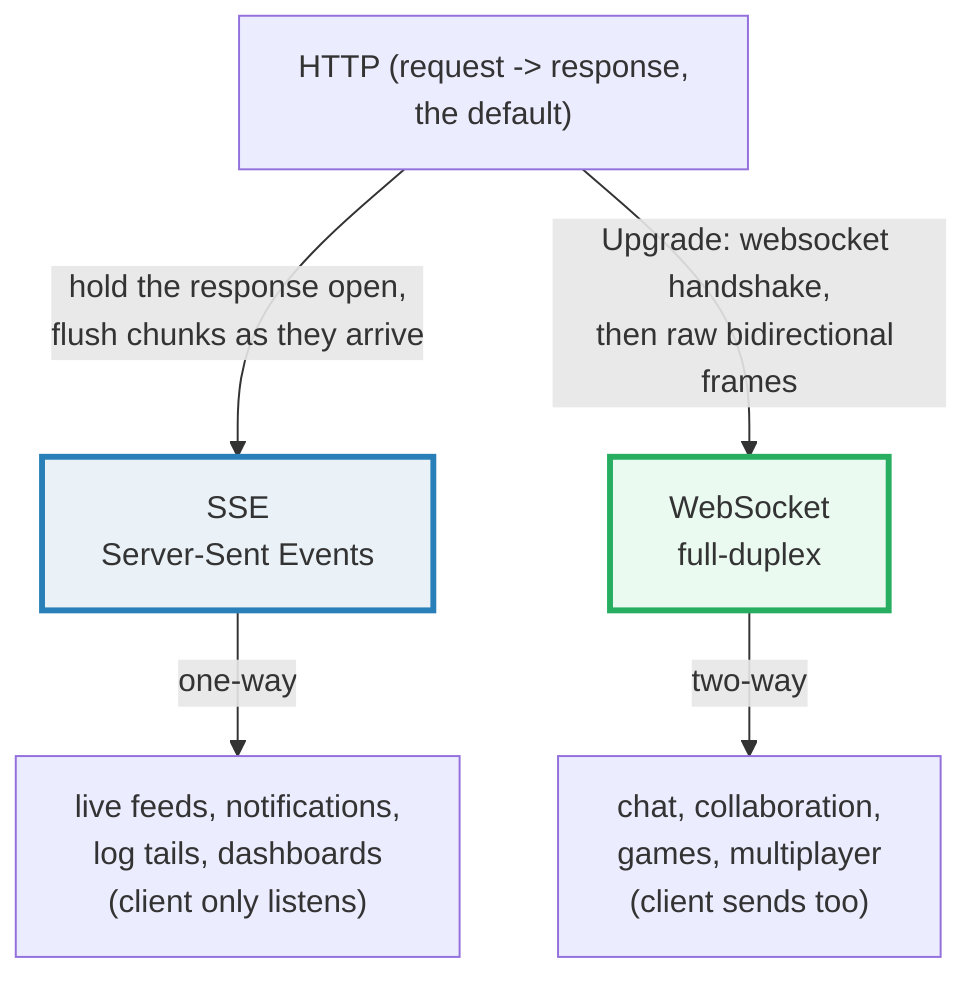
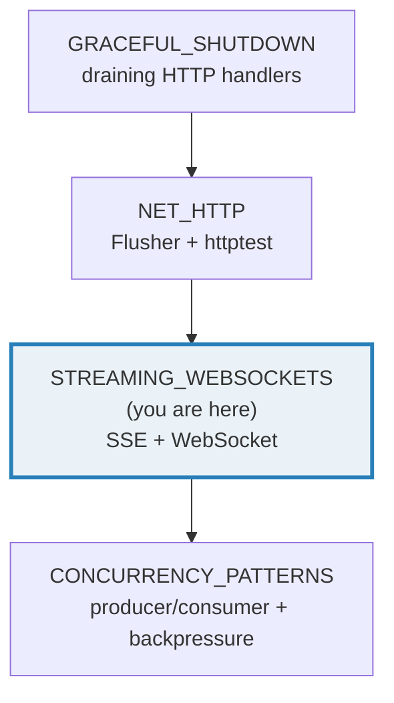
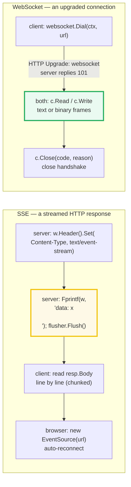
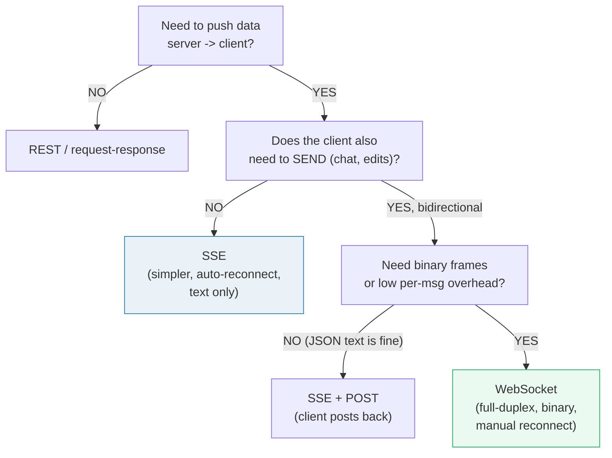

# STREAMING_WEBSOCKETS — Server-Sent Events & WebSockets (Streaming Over HTTP)

> **Goal (one line):** show, by driving an **in-process client** against a
> **loopback server**, how **Server-Sent Events (SSE)** stream data
> server→client over a plain HTTP response (with `http.Flusher` and the
> `text/event-stream` wire format), and how **WebSockets** open a
> bidirectional, full-duplex channel via an HTTP Upgrade handshake using
> `github.com/coder/websocket` — plus how a bounded buffer provides
> backpressure.
>
> **Run:** `go run streaming_websockets.go`
>
> **Ground truth:** [`streaming_websockets.go`](./streaming_websockets.go) →
> captured stdout in
> [`streaming_websockets_output.txt`](./streaming_websockets_output.txt). Every
> number/status/byte below is pasted **verbatim** from that file under a
> `> From streaming_websockets.go Section X:` callout. Nothing is hand-computed.
>
> **Prerequisites:** 🔗 [`NET_HTTP`](./NET_HTTP.md) (handlers, `http.ResponseWriter`,
> `httptest`), 🔗 [`IO_READER_WRITER`](./IO_READER_WRITER.md) (a stream *is* an
> `io.Reader`/`io.Writer`), and 🔗 [`CONTEXT`](./CONTEXT.md) (every `Dial`/`Read`/
> `Write` is bounded by a `context.Context`). 🔗 [`CONCURRENCY_PATTERNS`](./CONCURRENCY_PATTERNS.md)
> (the bounded-buffer backpressure demo) and 🔗 [`SELECT`](./SELECT.md) are
> referenced where a slow consumer meets a fast producer.

---

## 1. Why this bundle exists (lineage)

HTTP was born **request → response**: the client asks, the server answers once,
and the TCP connection is done. Real-time apps (live dashboards, chat, stock
ticks, collaborative editing) break that model — the server needs to push data
to the client *without* the client polling. There are two standard answers,
both built *on top of* HTTP, and this bundle implements both end-to-end:



**SSE** is the simpler idea: the server just keeps writing to a normal HTTP
response with `Content-Type: text/event-stream`, flushing each event as it
goes. No new protocol — it's chunked HTTP. The browser consumes it through the
built-in `EventSource` API, which **auto-reconnects** on disconnect and replays
the last event id. SSE is one-way (server→client) and **UTF-8 text only**.

**WebSocket** (RFC 6455) is the heavier idea: the client sends an HTTP request
with `Upgrade: websocket`, the server replies `101 Switching Protocols`, and
the TCP connection is *repurposed* into a bidirectional frame protocol. Now
**either side can send at any time**, and frames can be **binary** (protobufs,
images) as well as text. The cost is more machinery: a handshake, per-message
control frames (ping/pong), and **manual** reconnection.



This bundle uses `github.com/coder/websocket` — the modern, actively-maintained
ws library (formerly `nhooyr.io/websocket`), already pinned in `go.mod`. From
its package doc:

> From `pkg.go.dev/github.com/coder/websocket` (Overview): *"Package websocket
> implements the RFC 6455 WebSocket protocol. … Use Dial to dial a WebSocket
> server. Use Accept to accept a WebSocket client. Conn represents the resulting
> WebSocket connection."*

---

## 2. The mental model: two transports, one goal (push)



The crucial mechanism for SSE is the **`http.Flusher`** interface — without it,
`net/http` buffers the response and the client sees nothing until the handler
returns:

> From `pkg.go.dev/net/http` — the `Flusher` interface: *"Flush sends any
> buffered data to the client."* The note adds: *"The default behavior of the
> HTTP/1.x server is to buffer the data … call `Flush` after each `Write` … to
> stream data to the client."* Concretely, a handler that wants to stream
> **must** assert `w.(http.Flusher)` and call `Flush()` after each chunk, or the
> bytes sit in the server's buffer until the handler ends.

The crucial mechanism for WebSocket is the **Upgrade handshake**, after which
`*websocket.Conn` behaves like a typed pipe: `Write(ctx, typ, p)` sends a frame,
`Read(ctx)` returns `(MessageType, []byte, error)`.

---

## 3. Section A — SSE basics: `text/event-stream` + `http.Flusher` + 3 events

A handler advertises the SSE content type, writes three `data:` events, and
`Flush()`es after each. The in-process client is a plain `http.Get` that scans
the streamed body line by line.

> From `streaming_websockets.go` Section A:
> ```
> Content-Type received   : "text/event-stream"
> ResponseWriter is http.Flusher: true
> client received 3 data events (sorted): [alpha bravo charlie]
> ```
> ```
> [check] Content-Type is text/event-stream: OK
> [check] ResponseWriter implements http.Flusher: OK
> [check] client received exactly 3 events: OK
> [check] sorted payloads == [alpha bravo charlie]: OK
> ```

**What.** The SSE handler's entire contract is three lines:

```go
w.Header().Set("Content-Type", "text/event-stream") // the magic MIME type
w.WriteHeader(http.StatusOK)
flusher, _ := w.(http.Flusher)                       // net/http's RW implements it
fmt.Fprintf(w, "data: %s\n\n", payload)              // a frame ends with a blank line
flusher.Flush()                                      // push NOW, do not buffer
```

**Why `Flush()` is mandatory (the determinism-of-delivery point).** `net/http`'s
`ResponseWriter` buffers writes and only flushes when its buffer fills, the
handler returns, or you call `Flush()`. For a normal page that is fine — the
whole body is one payload. For SSE it is fatal: without `Flush`, the client
receives *nothing* until the handler ends, which for a long-lived feed is
"never." `http.Flusher` is the interface the stdlib exposes precisely so a
handler can defeat that buffering. The bundle asserts the `ResponseWriter`
**implements** `http.Flusher` (it does, for a real `net/http` server) — on a
`ResponseWriter` that didn't, SSE would be impossible and the handler must bail.

**Why chunked transfer.** Because the total response length is unknown up front,
the server uses HTTP/1.1 **chunked transfer coding** (or, on HTTP/2, a stream)
to frame the bytes as they are produced. You don't write the chunk encoding
yourself — `net/http` does it transparently once you start writing before
calling `WriteHeader` with a length. SSE rides on that: each `Flush` becomes one
(or more) chunk(s) on the wire.

> From the HTML spec (§9.2.5): *"This event stream format's MIME type is
> `text/event-stream`."* And (§9.2.7, authoring notes): *"HTTP chunking can have
> unexpected negative effects on the reliability of this protocol … if this is
> a problem, chunking can be disabled for serving event streams."*

**The client is just an HTTP read.** No special protocol on the client side —
`http.Get` returns a `resp.Body` (`io.Reader`, 🔗 `IO_READER_WRITER`) that yields
the streamed bytes as they arrive. The bundle reads it with a `bufio.Scanner`
until EOF (the handler's return closes the body → EOF). For a browser, the
equivalent is `new EventSource(url)` (see Section F).

---

## 4. Section B — the SSE wire format: `event`/`data`/`id` + multi-line data

The text/event-stream format is a tiny line-oriented grammar (HTML spec §9.2.5).
A block of field lines terminated by a **blank line** is one dispatched event.
This bundle sends a named event with all three fields and a multi-line payload,
then parses the raw body with the *same* algorithm a browser runs:

> From `streaming_websockets.go` Section B:
> ```
> decoded 2 SSE events from the stream:
>   event#0: type="tick" data="42" id="7"
>   event#1: type="" data="line1\nline2" id=""
> ```
> ```
> [check] exactly 2 dispatchable events (the comment/retry block has no data): OK
> [check] event#0 type == "tick": OK
> [check] event#0 data == "42": OK
> [check] event#0 id == "7": OK
> [check] event#1 multi-line data == "line1\nline2": OK
> [check] event#1 has default type "" (no event: field): OK
> ```

**The wire grammar, pinned from the spec (§9.2.6 field processing).** For each
line, split on the first `:` into `field` and `value` (strip one leading space
after the colon):

| Field | Effect |
|---|---|
| `data` | append `value` to the data buffer, then append a **`\n`** |
| `event` | set the event type buffer (default `"message"`) |
| `id` | set the last-event-id buffer (replayed on reconnect) |
| `retry` | set the reconnect delay (integer ms); ignored if non-numeric |
| `:` (colon line) | **comment** — ignored (used as a ~15s keep-alive) |
| *(blank line)* | **dispatch** the event: strip the trailing `\n` from data, fire it |

The two subtleties this bundle pins:

1. **Multi-line data joins with `\n`.** `data: line1\ndata: line2\n\n` makes the
   data buffer `line1\nline2\n`; on dispatch the spec strips the single trailing
   `\n`, so the client sees exactly `"line1\nline2"`. The bundle asserts this
   verbatim.
2. **A comment + `retry` block fires no event.** `: comment\nretry: 1234\n\n`
   has no `data`/`event`/`id`, so the bundle's parser (and a browser) emits
   nothing — hence "2 dispatchable events" from three blocks.

> From the HTML spec (§9.2.6): *"If the field name is `data`: Append the field
> value to the data buffer, then append a single U+000A LINE FEED (LF)
> character to the data buffer."* And on dispatch: *"If the data buffer's last
> character is a U+000A LINE FEED (LF) character, then remove the last
> character from the data buffer."* And: *"Event streams in this format must
> always be encoded as UTF-8."*

**The space-after-colon rule.** `data: 42` and `data:42` are identical — exactly
one leading space after the colon is stripped. (`data:  x` keeps one `x`'s worth
of space.) The bundle's `parseSSE` honors this with `strings.TrimPrefix(value, " ")`.

---

## 5. Section C — WebSocket basics: `Accept` + `Dial` + echo

A server handler calls `websocket.Accept`; an in-process client calls
`websocket.Dial` to the loopback `ws://` URL; the server echoes each frame back.

> From `streaming_websockets.go` Section C:
> ```
> client sent "hello-ws" as a text frame; server echoed back "hello-ws" (type=MessageText)
> ```
> ```
> [check] echo: received the same bytes back: OK
> [check] echo frame type == MessageText: OK
> ```

**What.** The server side is one call:

> From `pkg.go.dev/github.com/coder/websocket` — `Accept`: *"Accept accepts a
> WebSocket handshake from a client and upgrades the connection to a
> WebSocket."* And: *"Accept will not allow cross origin requests by default."*

The client side:

> From `pkg.go.dev/github.com/coder/websocket` — `Dial`: *"Dial performs a
> WebSocket handshake on url. … URLs with http/https schemes will work and are
> interpreted as ws/wss."*

**Why `nil` options work in-process.** `Accept`'s default same-origin check
calls `authenticateOrigin`, which **returns nil when the request has no `Origin`
header**. `Dial` from Go sets only the `Sec-WebSocket-*` headers (it does **not**
set `Origin`), so the check passes and `Accept(w, r, nil)` succeeds without
`InsecureSkipVerify`. This mirrors the library's own examples.

**Why the handshake is an HTTP `Upgrade`.** `Dial` sends
`Connection: Upgrade`, `Upgrade: websocket`, `Sec-WebSocket-Key`, and
`Sec-WebSocket-Version: 13`; the server computes `Sec-WebSocket-Accept` (a
base64'd SHA-1 of the key plus the magic GUID, 🔗 `NET_HTTP`'s hijacker path)
and replies `101 Switching Protocols`. After that the TCP connection carries
WebSocket frames, not HTTP — the request/response semantics are gone. That is
what buys you full-duplex: there is no "request" anymore, both ends just write
frames. The handler returns the upgraded `*websocket.Conn`; `r.Context()` is no
longer the request's lifecycle, so the bundle bounds reads/writes with a fresh
`context.WithTimeout` (🔗 `CONTEXT`).

**`Read`/`Write` and the "always read" rule.**

> From `pkg.go.dev/github.com/coder/websocket` — `Conn`: *"All methods may be
> called concurrently except for Reader and Read."* And: *"You must always read
> from the connection. Otherwise control frames will not be handled."* And:
> *"Be sure to call Close on the connection when you are finished with it to
> release associated resources. On any error from any method, the connection is
> closed with an appropriate reason."*

So the echo handler loops `Read`→`Write` until the peer closes (then `Read`
errors and the handler returns). The client does one round trip and asserts the
bytes and the `MessageText` type round-trip exactly.

---

## 6. Section D — WebSocket frames: `MessageText` vs `MessageBinary`

The echo handler preserves the frame type, so a text frame round-trips as text
and a binary frame (including non-UTF-8 bytes like `0x00`/`0xFF`) round-trips as
binary.

> From `streaming_websockets.go` Section D:
> ```
> text frame   -> sent "plain text", echoed type=MessageText, bytes equal=true
> binary frame -> sent [0 255 66 1 254],  echoed type=MessageBinary, bytes equal=true
> ```
> ```
> [check] text frame echoed with type MessageText: OK
> [check] text frame bytes round-trip: OK
> [check] binary frame echoed with type MessageBinary: OK
> [check] binary frame bytes round-trip (incl. 0x00/0xFF): OK
> ```

**What.** `MessageType` has exactly two values (RFC 6455 §5.6):

> From `pkg.go.dev/github.com/coder/websocket` — *"MessageText is for UTF-8
> encoded text messages like JSON."* / *"MessageBinary is for binary messages
> like protobufs."* And `Read`/`Write`: *"Read is a convenience method around
> Reader to read a single message from the connection."* / *"Write writes a
> message to the connection."*

**Why this matters vs SSE.** SSE is **UTF-8 text only** (the spec is explicit:
"Event streams in this format must always be encoded as UTF-8. There is no way
to specify another character encoding"). WebSockets carry **arbitrary bytes** —
`0x00`, `0xFF`, embedded NULs, a length-prefixed protobuf, a JPEG. The bundle
sends `[0x00, 0xFF, 0x42, 0x01, 0xFE]` (bytes that are *illegal* in UTF-8) to
prove the binary path round-trips losslessly. For a chat app exchanging JSON,
`MessageText` is enough; for telemetry/game-state where you want a compact
binary encoding, `MessageBinary` is the reason you reach for WebSocket over SSE.

---

## 7. Section E — the WebSocket close handshake: `StatusNormalClosure`

The server initiates the graceful close; the client's `Read` observes it as a
`websocket.CloseError` whose code is `StatusNormalClosure` (1000).

> From `streaming_websockets.go` Section E:
> ```
> client Read after server Close(1000,"bye") ->
>   CloseStatus(err) = 1000  (StatusNormalClosure = 1000)
>   errors.As(err, &CloseError) = true  -> Code=1000 Reason="bye"
> ```
> ```
> [check] CloseStatus(err) == StatusNormalClosure: OK
> [check] errors.As(err, &CloseError) succeeds: OK
> [check] CloseError.Code == 1000: OK
> [check] CloseError.Reason == "bye": OK
> ```

**What.** The close handshake is symmetric: each side sends a close frame
(opcode 8) carrying a status code and up to 125 bytes of reason.

> From `pkg.go.dev/github.com/coder/websocket` — `Close`: *"Close performs the
> WebSocket close handshake with the given status code and reason. It will write
> a WebSocket close frame with a timeout of 5s and then wait 5s for the peer to
> send a close frame. … The connection can only be closed once. Additional calls
> to Close are no-ops. The maximum length of reason must be 125 bytes."*

**Why the demo is fast (the back-channel detail).** `Close` *waits up to 5s* for
the peer's close frame. A naive test that calls `Close` on one side and never
reads on the other would stall those 5 seconds. coder/websocket avoids that
automatically: when `Read` observes an incoming close frame, it **writes a close
frame back** before returning the `CloseError` (see `read.go` —
`if !closeSent { … writeClose(ce.Code, ce.Reason) }`). So the server's
`Close(1000, "bye")` and the client's single `Read` complete the handshake
promptly. This is why the bundle can use real timeouts and still finish
byte-identically fast.

**Reading the code two ways (🔗 `ERRORS`).** The status is recoverable through
either of the two error idioms — both are asserted:

- `websocket.CloseStatus(err)` — a helper that does `errors.As` internally and
  returns the code (or `-1` if `err` is `nil`/not a `CloseError`).
- `errors.As(err, &ce)` — unwrap into the concrete `websocket.CloseError` to
  read both `Code` and `Reason`.

> From `pkg.go.dev/github.com/coder/websocket` — `CloseError`: *"CloseError is
> returned when the connection is closed with a status and reason. Use Go 1.13's
> errors.As to check for this error."* `CloseStatus`: *"a convenience wrapper
> around Go 1.13's errors.As to grab the status code from a CloseError. -1 will
> be returned if the passed error is nil or not a CloseError."* The constant:
> `StatusNormalClosure StatusCode = 1000`.

**`CloseNow` vs `Close`.** The demo uses `defer c.CloseNow()` to tear down
without a handshake wherever the close itself isn't the point (Sections C/D);
Section E uses the real `Close(code, reason)` because the handshake *is* the
lesson. `CloseNow` drops the connection immediately — use it when you don't want
the 5s handshake overhead (e.g. the handler hit a fatal error).

---

## 8. Section F — SSE vs WebSocket decision + backpressure

### 8.1 The decision (documented)

> From `streaming_websockets.go` Section F:
> ```
> SSE vs WebSocket — when to choose which:
>   direction   : SSE=server->client (one-way)          WS=bidirectional (full-duplex)
>   transport   : SSE=HTTP response stream (text/event-stream, chunked)
>                WS=HTTP Upgrade handshake -> binary frames
>   reconnect   : SSE=built-in (EventSource auto-reconnect + Last-Event-ID)
>                WS=manual (the app must detect + re-dial)
>   data kinds  : SSE=UTF-8 text only               WS=text (UTF-8) and binary frames
>   rule of thumb: SSE for server-push (feeds, notifications, dashboards)
>                  WS  for interactive (chat, collaboration, multiplayer)
> ```
> ```
> [check] SSE is one-way (server->client): OK
> [check] WS is bidirectional (full-duplex): OK
> [check] SSE data is text-only; WS supports binary: OK
> ```



**The browser side: `EventSource`.** SSE has a first-class browser client that
WebSocket lacks (there is no built-in `WebSocket` reconnect). The bundle
*documents* it (it can't run JS in-process):

> From `streaming_websockets.go` Section F:
> ```
> browser SSE consumer (EventSource) — DOCUMENTED, not runnable here:
>   const es = new EventSource('/events');
>   es.onmessage = (e) => console.log(e.data);          // default 'message' events
>   es.addEventListener('tick', (e) => ...);            // named events (event: tick)
>   // reconnect is automatic; Last-Event-ID carries the id: field.
> ```

> From the HTML spec (§9.2.2 / §9.2.3): the `EventSource` constructor opens the
> stream; *"Clients will reconnect if the connection is closed; a client can be
> told to stop reconnecting using the HTTP 204 No Content response code."* On
> reconnect the browser replays the last `id:` value as the `Last-Event-ID`
> request header, so a server can resume the stream without gaps.

### 8.2 Backpressure: a bounded buffer (the slow-consumer problem)

A streaming server with a fast producer and a slow client faces **backpressure**:
if the producer writes faster than the client reads, unbounded buffering eats
memory; the two sane policies are **block** (propagate the pressure back to the
producer) or **drop** (discard overflow). The bundle demonstrates the mechanism
on a bounded channel with a drop policy — **single-threaded, so byte-identical**:

> From `streaming_websockets.go` Section F:
> ```
> backpressure demo (bounded chan, cap=2, drop policy):
>   enqueued m1,m2 (buffer full); m3 send -> dropped=true
>   drained 1; m4 send -> accepted=true
>   remaining in buffer (sorted): [m2 m4]
> ```
> ```
> [check] bounded buffer cap == 2: OK
> [check] send while full was dropped (producer not blocked): OK
> [check] send after a drain was accepted: OK
> [check] remaining buffer == [m2 m4] (m3 dropped, m4 enqueued): OK
> ```

**What.** A buffered channel of capacity 2 is the bounded buffer. Two items fill
it; a **non-blocking send** (`select { case ch <- m3: default: dropped = true }`)
then *fails* — the producer is not blocked, the overflow is dropped. After the
consumer drains one item, a slot frees and the next send succeeds. The
alternative — a **blocking send** (`ch <- m3`) — would park the producer until a
slot opens, which is exactly backpressure propagated to the source. In a real
SSE/ws fan-out (🔗 `CONCURRENCY_PATTERNS`), each client gets its own bounded
queue and a dedicated writer goroutine; a full queue means either block (slow
the feed) or drop (lose a tick for that client).

**Why this bites streaming specifically.** A request/response handler returns and
forgets. A streaming handler holds the connection open for the client's
*read pace*. If client B is on a flaky mobile link, a server that does
`Write(ctx, msg)` in a tight loop will either block the whole fan-out goroutine
(B holds everyone up) or, with `coder/websocket`, hit `Write`'s context deadline
and close the connection. The fix is always a per-client bounded buffer with an
explicit drop/block policy — never an unbounded `[]byte`.

---

## 9. Pitfalls (the expert payoff)

| Trap | Symptom | Fix |
|---|---|---|
| Forgetting `Flush()` in an SSE handler | Client receives nothing until the handler returns (looks like a hang / no events) | Assert `w.(http.Flusher)` and call `Flush()` after each `data:` block; never assume the RW buffers are flushed. |
| Missing/wrong SSE Content-Type | Browser `EventSource` fails the connection (spec: status must be 200 **and** Content-Type `text/event-stream`) | Always `w.Header().Set("Content-Type", "text/event-stream")` before writing. |
| SSE event not terminated by a blank line | Client never dispatches it (spec: the incomplete event is discarded at EOF) | Every event ends with `\n\n` (a blank line); a comment keep-alive every ~15s also needs a blank line. |
| Multi-line SSE data Surprise | `data: a\ndata: b` yields `"a\nb"`, not `"ab"` | The spec appends a `\n` per `data:` line; strip the trailing `\n` on dispatch (as `parseSSE` does). |
| Calling `Read` from two goroutines | Panic / data corruption ("Only one Reader may be open at a time") | All `Conn` methods are concurrent **except** `Read`/`Reader`; serialize reads (one reader goroutine per conn). |
| Never reading the connection | Control frames (ping/pong/close) never handled → connection stalls/closes | Always have a `Read` loop (or `CloseRead` for write-only servers); see the "you must always read" rule. |
| `Close` appears to hang 5s | The peer never sends a close frame back | Have the peer `Read` (coder/websocket auto-replies), or use `CloseNow` to skip the handshake. |
| Treating any `Read` error as "network down" | Misses the graceful-close signal | Check `websocket.CloseStatus(err)` / `errors.As(&CloseError)`; `1000` is normal closure, not a fault. |
| Unbounded per-client buffer in a fan-out | OOM under a slow client / bursty producer | Give each client a bounded channel with an explicit block-or-drop policy (Section F). |
| Blocking `Write` on a slow client stalls the whole server | One slow client freezes the fan-out | Per-client writer goroutine + bounded queue; let `Write(ctx, …)` honour the context deadline. |
| Sending a binary blob over SSE | Corruption — SSE is UTF-8 text only | Use WebSocket (`MessageBinary`) for non-text payloads; base64 only as a last resort (defeats the simplicity). |
| Assuming SSE has no connection limit | On HTTP/1.1 the browser caps ~6 conns/host; many open tabs stall | Use HTTP/2 (multiplexes many streams over one conn) or domain sharding; WebSocket has no such per-host cap. |
| WebSocket reason string > 125 bytes | Close frame invalid (RFC limit) | Keep the close reason short and static; `Close` enforces the 125-byte max. |

---

## 10. Cheat sheet

```go
// --- SSE (server -> client over HTTP) ---
func sseHandler(w http.ResponseWriter, r *http.Request) {
    w.Header().Set("Content-Type", "text/event-stream")
    w.Header().Set("Cache-Control", "no-cache")
    w.WriteHeader(http.StatusOK)
    f, _ := w.(http.Flusher)          // MUST flush or the client sees nothing
    fmt.Fprintf(w, "data: %s\n\n", payload)  // a frame ends with a blank line
    f.Flush()                         // push now (chunked transfer)
}
// Named event + id + multi-line data:
//   event: tick\ndata: 42\nid: 7\n\n
//   data: line1\ndata: line2\n\n   -> client gets "line1\nline2"
// Browser: const es = new EventSource(url); auto-reconnect; Last-Event-ID on resume.

// --- WebSocket (bidirectional, github.com/coder/websocket) ---
// Server:
c, err := websocket.Accept(w, r, nil)   // upgrades; nil opts OK for same-origin/no-Origin
defer c.CloseNow()                       // or c.Close(code, reason) for the handshake
for {
    typ, msg, err := c.Read(ctx)         // ONLY one reader at a time
    if err != nil { return }             // check websocket.CloseStatus(err)
    c.Write(ctx, typ, msg)               // echo; typ is MessageText | MessageBinary
}
// Client:
c, _, err := websocket.Dial(ctx, "ws://host/path", nil)  // http:// also accepted
defer c.CloseNow()
c.Write(ctx, websocket.MessageText, []byte("hi"))
typ, got, _ := c.Read(ctx)               // typ == MessageText (1) or MessageBinary (2)

// Close: c.Close(websocket.StatusNormalClosure, "")  // code 1000; reason <= 125 bytes
// Inspect a close error:
//   code := websocket.CloseStatus(err)               // -1 if not a CloseError
//   var ce websocket.CloseError; errors.As(err, &ce)  // ce.Code, ce.Reason

// --- Backpressure: bounded buffer (block or drop) ---
buf := make(chan Msg, N)                 // the bounded buffer
select {                                 // DROP policy (non-blocking):
case buf <- m:                           //   accepted
default:                                 //   buffer full -> drop (producer not blocked)
}
buf <- m                                 // BLOCK policy: producer parks until a slot frees

// --- Pick: SSE for server-push (one-way, text, auto-reconnect);
//           WS  for interactive (two-way, binary, manual reconnect).
```

---

## Sources

Every signature, status code, wire-format rule, and behavioral claim above was
verified against the Go standard-library docs, the `coder/websocket` package
docs/source, and the HTML Living Standard, then corroborated by independent
secondary sources:

- `net/http` package — https://pkg.go.dev/net/http
  - `Flusher` interface (`Flush()`; the note that handlers should flush to
    stream, and that HTTP/1.x buffers by default): https://pkg.go.dev/net/http#Flusher
  - `http.ResponseWriter` / handlers / `http.Hijacker` (the upgrade path):
    https://pkg.go.dev/net/http#Handler
- `net/http/httptest` (`NewServer` on a random loopback port — the in-process
  server this bundle uses): https://pkg.go.dev/net/http/httptest#NewServer
- `github.com/coder/websocket` v1.8.15 — https://pkg.go.dev/github.com/coder/websocket
  - Package overview (*"Package websocket implements the RFC 6455 WebSocket
    protocol… Use Dial… Use Accept…"*): https://pkg.go.dev/github.com/coder/websocket#pkg-overview
  - `Accept` (*"accepts a WebSocket handshake… upgrades the connection… will not
    allow cross origin requests by default"*): https://pkg.go.dev/github.com/coder/websocket#Accept
  - `Dial` (*"performs a WebSocket handshake on url… http/https schemes… are
    interpreted as ws/wss"*): https://pkg.go.dev/github.com/coder/websocket#Dial
  - `Conn` (*"All methods may be called concurrently except for Reader and
    Read… You must always read from the connection… Be sure to call Close… On any
    error… the connection is closed"*): https://pkg.go.dev/github.com/coder/websocket#Conn
  - `MessageType` / `MessageText` / `MessageBinary` (text=UTF-8, binary=protobufs):
    https://pkg.go.dev/github.com/coder/websocket#pkg-constants
  - `Read` / `Write` / `Reader` (single-message convenience; *"Ensure you read to
    EOF… Only one Reader may be open at a time"*): https://pkg.go.dev/github.com/coder/websocket#Conn.Read
  - `Close` (*"close handshake… writes a close frame with a timeout of 5s and
    then waits 5s… only be closed once… reason must be ≤125 bytes"*) and
    `CloseNow` (immediate, no handshake): https://pkg.go.dev/github.com/coder/websocket#Conn.Close
  - `CloseError` (*"Use errors.As to check… "*), `CloseStatus` (*"-1 if nil or
    not a CloseError"*), `StatusNormalClosure = 1000`:
    https://pkg.go.dev/github.com/coder/websocket#CloseError
  - `example_test.go` (`Accept`/`Dial` with `nil` options in-process):
    https://pkg.go.dev/github.com/coder/websocket#pkg-examples
- HTML Living Standard — Server-sent events (§9.2):
  - Overview / `EventSource` interface (`CONNECTING/OPEN/CLOSED`, `onmessage`,
    named events, auto-reconnect, 204 stops reconnecting):
    https://html.spec.whatwg.org/multipage/server-sent-events.html#the-eventsource-interface
  - Processing model (reconnect + `Last-Event-ID` header):
    https://html.spec.whatwg.org/multipage/server-sent-events.html#sse-processing-model
  - Parsing an event stream (the ABNF; MIME `text/event-stream`; *"must always
    be encoded as UTF-8"*): https://html.spec.whatwg.org/multipage/server-sent-events.html#parsing-an-event-stream
  - Interpreting an event stream (field table: `data` appends value + LF, the
    trailing-LF strip on dispatch, `event`/`id`/`retry`, comment lines, blank-line
    dispatch, multi-line `data` → `"YHOO\n+2\n10"`):
    https://html.spec.whatwg.org/multipage/server-sent-events.html#event-stream-interpretation
  - Authoring notes (HTTP chunking caveats; comment keep-alive every ~15s; the
    HTTP/1.1 ~6-connections-per-host limit): https://html.spec.whatwg.org/multipage/server-sent-events.html#authoring-notes
- RFC 6455 — The WebSocket Protocol (the Upgrade handshake; frame opcodes;
  close handshake + status codes 1000/1001; 125-byte close-reason limit):
  https://www.rfc-editor.org/rfc/rfc6455
- Secondary corroboration (>=2 independent sources, web-verified):
  - thoughtbot — *"Writing a Server Sent Events server in Go"* (the canonical
    `http.Flusher` SSE pattern, line-by-line client read):
    https://thoughtbot.com/blog/writing-a-server-sent-events-server-in-go
  - MDN — *"Using Server-Sent Events"* / `EventSource` (auto-reconnect,
    `Last-Event-ID`, `text/event-stream` requirement):
    https://developer.mozilla.org/en-US/docs/Web/API/Server-sent_events
  - Ably — *"WebSockets vs Server-Sent Events"* (SSE one-way + auto-reconnect
    vs WS bidirectional + binary + manual reconnect; backpressure/latency
    trade-offs): https://ably.com/blog/websockets-vs-sse
  - websocket.org — *"WebSocket vs SSE: Which One Should You Use?"* (decision
    guidance: SSE for server-push, WS for bidirectional/binary):
    https://websocket.org/comparisons/sse/

**Facts that could not be verified by running** (documented, not executed,
because they are browser-only or protocol-level): the browser `EventSource`
auto-reconnect and `Last-Event-ID` replay (Section F is a documented JS snippet,
not runnable in-process); the HTTP/1.1 ~6-connections-per-host cap (a browser
limit, not a Go one); and the exact RFC 6455 handshake byte layout. These are
confirmed by the HTML spec, MDN, and RFC 6455 cited above, not reproduced as
runnable output (a browser/real-network test would not pass `just check`).
