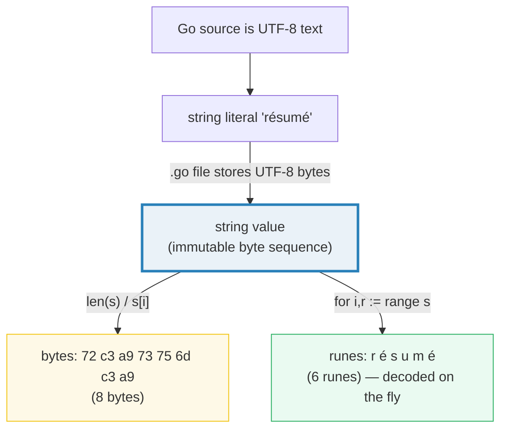
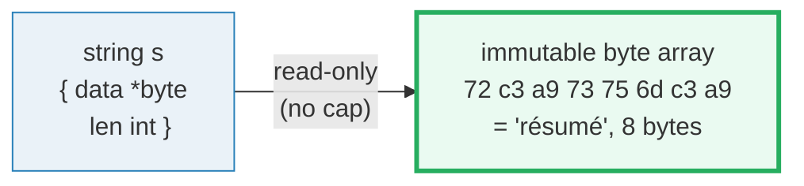
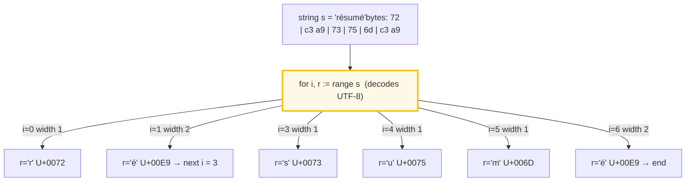
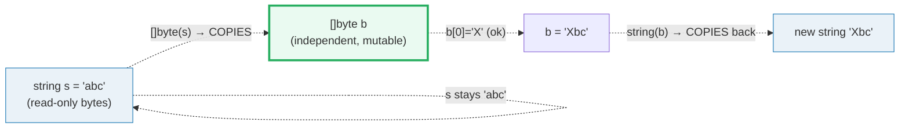
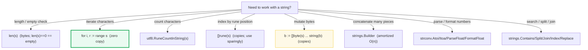

# STRINGS_RUNES_BYTES — Strings, Bytes, Runes & the UTF-8 Model

> **Goal (one line):** prove, by printing every value, that a Go string is an
> **immutable sequence of bytes**, that `for range` decodes those bytes into
> **runes**, and that the byte-vs-rune confusion is the #1 Go string bug.

**Run:** `go run strings_runes_bytes.go`
**Prerequisites:** [VALUES_TYPES_ZERO](./VALUES_TYPES_ZERO.md) (zero values, the type system — `rune`/`byte` are aliases defined there in depth).

This is a **Phase 1 — Language Foundations** bundle. The runnable
`strings_runes_bytes.go` is the ground truth; every number and table below is
pasted **verbatim** from `strings_runes_bytes_output.txt`. Nothing is hand-computed.

---

## 0. Why this bundle exists (the #1 Go string bug)

The single most common Go string mistake is treating a string as a sequence of
*characters*. It is not. A Go string is a **read-only slice of bytes**. `len(s)`
is the **byte** length, `s[i]` is a **byte**, and — for anything beyond ASCII —
"the 3rd character of `s`" is **not** `s[2]`. The fix is to understand three
distinct ideas and keep them rigorously apart:

| Term | What it is | Go type |
|---|---|---|
| **byte** | 8 bits of raw storage; the unit a string is *made of* | `uint8` (`byte`) |
| **code point / rune** | a Unicode scalar value (a "logical character") | `int32` (`rune`) |
| **UTF-8** | a *variable-width* encoding: one rune → **1–4 bytes** | — |

The `for i, r := range s` loop is the **only** place in the language that hides
this distinction: it decodes one UTF-8 rune per iteration and hands you
`(byte_offset, rune)`. Everywhere else you see bytes. Master that one loop and
the aliases below, and the bug class disappears.



---

## 1. The string header: `{ptr, len}` over an immutable byte array

A string value is a tiny **two-word header**: a pointer to the backing byte
data and a length. Unlike a slice header there is **no capacity field**,
because the backing bytes are **immutable** — you can never append to or resize
a string. (Compare 🔗 [ARRAYS_SLICES](./ARRAYS_SLICES.md), whose header is
`{ptr, len, cap}` and whose backing array *can* grow.)



Because the header is two words, **passing a string copies the header, not the
bytes** — a 1 MB string is as cheap to pass as a 1-byte one (🔗 `POINTERS.md`,
🔗 `ESCAPE_ANALYSIS.md`). The bytes themselves are shared until you mutate-via-
conversion, at which point a copy is forced (Section 3).

---

## 2. Section A — a string is a sequence of BYTES (not runes)

**What.** `len(s)` counts **bytes**, not characters. `s[i]` indexes a single
**byte**. For `"résumé"` the accented `é` (U+00E9) encodes to **2 UTF-8 bytes**
(`c3 a9`) and it appears twice, so the byte count is `1+2+1+1+1+2 = 8` while the
rune count is 6. For `"👋"` (U+1F44B) a single emoji is **4 bytes**.

> From strings_runes_bytes.go Section A:
> ```
> s        = "résumé"
> len(s)                 = 8   (the BYTE count)
> utf8.RuneCountInString = 6   (the RUNE count)
> raw bytes (hex)        = 72 c3 a9 73 75 6d c3 a9
> 
> s        = "👋"
> len(s)                 = 4   (the BYTE count)
> utf8.RuneCountInString = 1   (the RUNE count)
> raw bytes (hex)        = f0 9f 91 8b
> 
> resume[0] = 0x72 (decimal 114), type uint8 — a byte, not a rune
> [check] len("résumé") == 8 bytes: OK
> [check] utf8.RuneCountInString("résumé") == 6: OK
> [check] len("👋") == 4 bytes: OK
> [check] utf8.RuneCountInString("👋") == 1: OK
> [check] resume[0] is the byte 'r' (0x72): OK
> ```

**Why.** The Go specification defines a string as "a (possibly empty) sequence
of bytes" and is explicit that **no guarantee is made that the bytes are valid
UTF-8**. Only *string literals in source code* are UTF-8 (the `.go` file is
UTF-8 by definition); a `string` value built from `string([]byte{0xff})` is just
arbitrary bytes. That is why `len` is byte-based: it must work for *any* bytes.

> **Gotcha.** `len(s) == 0` is the **only** length test that means "empty string"
> portably. `len(s) < n` is a *byte* comparison — slicing `s[n:]` to "skip n
> characters" silently splits a multi-byte rune and produces invalid UTF-8.
> Use `utf8.RuneCountInString` for a rune count, and never index a string by
> "character position".

---

## 3. Section B — `for i, r := range s` yields (byte offset, rune)

**What.** This is the **only** construct that decodes UTF-8 for you. Each
iteration yields the rune's starting **byte offset** `i` (not a rune index) and
the decoded `rune`. The offsets therefore *jump* by the width of each rune.

> From strings_runes_bytes.go Section B:
> ```
> ranging "Hi":
>   byte offset 0 -> rune 'H' (U+0048, 1 UTF-8 bytes)
>   byte offset 1 -> rune 'i' (U+0069, 1 UTF-8 bytes)
>   => 2 runes; byte offsets = [0 1]
> [check] range rune count == utf8.RuneCountInString: OK
> ranging "résumé":
>   byte offset 0 -> rune 'r' (U+0072, 1 UTF-8 bytes)
>   byte offset 1 -> rune 'é' (U+00E9, 2 UTF-8 bytes)
>   byte offset 3 -> rune 's' (U+0073, 1 UTF-8 bytes)
>   byte offset 4 -> rune 'u' (U+0075, 1 UTF-8 bytes)
>   byte offset 5 -> rune 'm' (U+006D, 1 UTF-8 bytes)
>   byte offset 6 -> rune 'é' (U+00E9, 2 UTF-8 bytes)
>   => 6 runes; byte offsets = [0 1 3 4 5 6]
> [check] range rune count == utf8.RuneCountInString: OK
> [check] "résumé" range offsets == [0 1 3 4 5 6] (é is 2 bytes wide): OK
> ```



**Why.** Per Rob Pike's canonical post, *"besides the fact that Go source is
UTF-8, there's really only one way that Go treats UTF-8 specially, and that is
when using a `for range` loop on a string."* `range` and
`utf8.DecodeRuneInString` are **defined to produce the exact same iteration
sequence**. On invalid UTF-8 the loop yields `U+FFFD` (`utf8.RuneError`) with a
width of 1, so it always advances and never panics.

> **Gotcha — `i` is a byte offset, not a rune index.** If you collect positions
> to "delete the 2nd rune", `offsets[1]` is `1` for `"résumé"` but the 2nd *rune*
> occupies bytes `[1,3)`. To slice a string by *runes*, convert to `[]rune`
> (`rs := []rune(s); rs[1]`) or decode with `utf8.DecodeRuneInString` and step by
> the returned width (as Section E does).

---

## 4. Section C — `[]byte(s)` COPIES; strings are immutable

**What.** You cannot mutate a string: `s[0] = 'x'` is a **compile error**. The
conversions `[]byte(s)` and `string(b)` each **allocate and copy** the data, so
mutating the byte slice never touches the original string.

> From strings_runes_bytes.go Section C:
> ```
> s = "abc"
> []byte(s) = 61 62 63
> [check] []byte(s) is a distinct allocation (backing pointers differ): OK
> after b[0]='X': []byte(s) = "Xbc",  original s = "abc"
> [check] mutating the []byte copy leaves the string unchanged: OK
> string(mutated []byte) = "Xbc" (a new string)
> [check] string([]byte) rebuilds the value from the copy: OK
> 
>   s[0] = 'x'   // COMPILE ERROR: cannot assign to s[0]
>                // (strings are immutable). To alter text you
>                // convert to []byte, change, and convert back.
> ```



**Why.** Immutability is what makes string sharing safe and concurrent-friendly:
two string headers can point at the same backing bytes with no synchronization,
because nobody can write through them. The spec therefore mandates that
`[]byte(s)` and `string(b)` **copy**. The bundle proves the copy directly with
`unsafe.StringData` / `unsafe.SliceData`: the string's data pointer and the byte
slice's backing pointer are **distinct addresses** (a checked invariant, not a
printed address — printed addresses would be non-deterministic run-to-run).

> **Gotcha — the copy is not free.** `for _, c := range []byte(s)` allocates and
> copies the whole string just to iterate; prefer `for i, r := range s` (zero
> copy). Hot-loop `string ↔ []byte` round-trips are a classic escape-analysis
> hotspot (🔗 `ESCAPE_ANALYSIS.md`). The compiler elides the copy **only** in
> narrow proven cases (e.g. `m[string(b)]` map lookups); never rely on it silently.

---

## 5. Section D — `rune` is `int32`, `byte` is `uint8` (type aliases)

**What.** `rune` and `byte` are not new types — they are **aliases**. A `rune`
value *is* an `int32` and a `byte` value *is* a `uint8`; they are mutually
assignable with no conversion, and `%T` reports the underlying type.

> From strings_runes_bytes.go Section D:
> ```
> var r  rune  = '⌘' -> value U+2318, type int32
> var i32 int32 = r  -> value U+2318, type int32   (identical type!)
> var b  byte  = 'A' -> value 65 ,   type uint8
> var u8 uint8 = b   -> value 65 ,   type uint8   (identical type!)
> [check] rune is assignable to int32 (alias): OK
> [check] byte is assignable to uint8 (alias): OK
> [check] '⌘' rune value == 0x2318: OK
> ```

**Why.** `byte` (`uint8`) is the natural unit of storage; `rune` (`int32`) is
the natural unit of a Unicode code point (max U+10FFFF fits in 21 bits, well
within 32). Go aliases them for *documentation*: writing `rune` screams "this
int is a code point", writing `byte` screams "raw octet". The widest valid rune
fits in ≤4 UTF-8 bytes (`utf8.UTFMax == 4`).

> **Gotcha.** A `rune` is a *code point*, not necessarily a "user-perceived
> character". `é` can be one rune (U+00E9) or two (`e` U+0065 + combining accent
> U+0301); an emoji like 👨‍👩‍👧 is several runes joined with zero-width joiners.
> Go does **no normalization** — `"é"` lengths differ depending on form. Reach
> for `golang.org/x/text/unicode/norm` (a later phase) when grapheme correctness
> matters.

---

## 6. Section E — stdlib greatest hits: `unicode/utf8`, `strconv`, `strings`, `strings.Builder`

### 6.1 `unicode/utf8` — decode / encode / validate

> From strings_runes_bytes.go Section E (utf8):
> ```
> utf8.DecodeRuneInString("Go⌘"[2:]) = rune '⌘' (U+2318), size = 3 bytes
> utf8.RuneLen('⌘')               = 3 bytes (its UTF-8 width)
> utf8.ValidString("Go⌘")          = true
> [check] DecodeRuneInString("⌘") == U+2318, size 3: OK
> [check] RuneLen('⌘') == 3: OK
> ```

Signatures (verified on pkg.go.dev/unicode/utf8):
- `func RuneCountInString(s string) (n int)` — rune count, O(len(s)).
- `func DecodeRuneInString(s string) (r rune, size int)` — first rune + its byte width.
- `func EncodeRune(p []byte, r rune) int` — writes UTF-8, returns bytes written.
- `func RuneLen(r rune) int` — UTF-8 byte width of a rune (1–4, or -1 if invalid).
- `func ValidString(s string) bool` — is every byte sequence valid UTF-8?
- `const RuneError = '\uFFFD'`, `MaxRune = '\U0010FFFF'`, `UTFMax = 4`.

### 6.2 `strconv` — string ↔ number, and `Quote` (escapes)

> From strings_runes_bytes.go Section E (strconv):
> ```
> strconv.Atoi("42")          = 42, err = <nil>
> strconv.Itoa(42)            = "42"
> strconv.ParseFloat("3.14",64)= 3.14, err = <nil>
> strconv.FormatFloat(3.14,'f',2,64) = "3.14"
> strconv.Quote("a\tb")       = "a\tb"   (escapes the tab)
> [check] Atoi("42")==42 && Itoa(42)=="42": OK
> [check] ParseFloat("3.14") round-trips to 3.14: OK
> ```

Signatures: `Atoi(string) (int, error)` / `Itoa(int) string`;
`ParseFloat(string, bitSize int) (float64, error)` /
`FormatFloat(f float64, fmt byte, prec, bitSize int) string`;
`Quote(string) string` (returns a Go-syntax double-quoted, escaped literal —
handy for debugging strings with invisible bytes). **`Atoi`/`ParseFloat` return
errors — never ignore them** (🔗 `ERRORS.md`).

### 6.3 `strings` — search / split / join / replace

> From strings_runes_bytes.go Section E (strings):
> ```
> strings.Contains("foobar","oba")  = true
> strings.HasPrefix("foobar","foo") = true
> strings.Split("a,b,c",",")       = ["a" "b" "c"]
> strings.Join([a b c],"-")         = "a-b-c"
> strings.Replace("aaa","a","X",2)  = "XXa"
> strings.Index("foobar","bar")     = 3
> [check] Replace("aaa","a","X",2)=="XXa": OK
> [check] Index("foobar","bar")==3: OK
> ```

All of these are **byte-oriented** (they match substrings byte-for-byte), which
is correct and fast for ASCII and for exact UTF-8 substring matches. For
case-insensitive or Unicode-aware matching use `strings.EqualFold` and
`golang.org/x/text` (later phase). `Index` returns a **byte** offset (-1 if
absent); `Replace(s, old, new, n)` with `n < 0` means "all".

### 6.4 `strings.Builder` — efficient concatenation

> From strings_runes_bytes.go Section E (Builder):
> ```
> concat with '+='   (100 pieces): 99 allocs/run
> concat with Builder(100 pieces): 5 allocs/run
> Builder result: "xxxx...xxxx" (Len=100, Cap=128)
> [check] Builder result holds all 100 pieces: OK
> [check] Builder allocates far less than '+=' loop: OK
> ```

**What.** Building a string by `s += piece` in a loop is **O(n²)**: each `+=`
allocates a fresh backing array and copies everything so far. The bundle measures
this deterministically with `testing.AllocsPerRun` — 100 pieces cost **99
allocations** via `+=` vs **5** via `strings.Builder`. `Builder` wraps an
internal `[]byte` that doubles in capacity, giving **amortized O(n)** appends,
then hands out the final string with one copy via `String()` (which transfers
ownership of the buffer, avoiding a second copy).

**Why.** API: `WriteString`, `WriteRune`, `WriteByte`, `Write([]byte)`, `Len()`,
`Cap()`, `String()`, `Reset()`. The two rules: **(1)** do not copy a `Builder`
by value (its internal pointer would alias — pass `*strings.Builder`, 🔗
`POINTERS.md`); **(2)** once you call `String()` you must not call further
`Write*` methods (panic on misuse in some builds — call `Reset()` to reuse).

---

## 7. The byte-vs-rune decision tree



---

## 🔗 Cross-references

- 🔗 [VALUES_TYPES_ZERO](./VALUES_TYPES_ZERO.md) — `rune`/`byte` are *aliases*
  (`int32`/`uint8`); understand the type system and zero values first.
- 🔗 [ARRAYS_SLICES](./ARRAYS_SLICES.md) — a `[]byte` is a slice
  (`{ptr,len,cap}`); a string is the immutable `{ptr,len}` cousin with no cap.
- 🔗 [FUNCTIONS_CLOSURES](./FUNCTIONS_CLOSURES.md) — `strings.Builder`'s
  chainable `Write*` methods and the method-value / closure patterns they enable.
- 🔗 [POINTERS](./POINTERS.md) — why you pass `*strings.Builder` (never by
  value) and why passing a string copies only the 2-word header.
- 🔗 [ESCAPE_ANALYSIS](./ESCAPE_ANALYSIS.md) — `[]byte(s)`/`string(b)` copies
  escape to the heap; `range s` does not. A classic `-gcflags=-m` target.
- 🔗 [ERRORS](./ERRORS.md) — `strconv.Atoi`/`ParseFloat` return `error`; never
  discard them.

---

## Pitfalls (the expert payoff)

| # | Trap | Symptom | Fix |
|---|---|---|---|
| 1 | `len(s)` used as a **character** count | off-by-N on any non-ASCII text | `utf8.RuneCountInString(s)` for runes; `len(s)` only for bytes |
| 2 | `s[i]` to get the "i-th character" | gets a **byte**; for `é` returns `0xC3`, a lone half-rune | range the string, or `[]rune(s)[i]` |
| 3 | `s[n:]` to "skip n characters" | splits a multi-byte rune → invalid UTF-8 / mojibake | decode-and-step with `utf8.DecodeRuneInString`, or `[]rune` |
| 4 | `for _, c := range []byte(s)` to iterate | **allocates + copies** the whole string | `for i, r := range s` (zero copy, yields runes) |
| 5 | `s[0] = 'x'` | **compile error**: cannot assign to `s[0]` | convert `b := []byte(s)`, mutate, `string(b)` |
| 6 | `s += piece` in a loop | **O(n²)** time + allocations (99 allocs/100 pieces) | `strings.Builder` (5 allocs/100 pieces) |
| 7 | assuming `len("é") == 1` | actually **2 bytes** (U+00E9 → `c3 a9`) | remember: ASCII = 1 byte, most Latin = 1–2, CJK = 3, emoji = 4 |
| 8 | copying `strings.Builder` by value | shared internal pointer → corruption / aliasing | pass `*strings.Builder`; or use the value once |
| 9 | calling `Write*` after `String()` on a Builder | misuse / panic in some builds | `Reset()` before reusing, or build then read once |
| 10 | assuming Go normalizes Unicode | `"é"` can be 1 or 2 runes depending on form | `golang.org/x/text/unicode/norm` for grapheme-correct work |
| 11 | treating `range` index as a rune index | `i` is a **byte offset**; it jumps past wide runes | collect offsets, or index a `[]rune` |
| 12 | ignoring `Atoi`/`ParseFloat`'s `error` | bad input silently → `0`/`NaN` | always check `err != nil` (🔗 `ERRORS.md`) |

---

## Cheat sheet

```go
// A string is an IMMUTABLE []byte. len == bytes; s[i] == a byte.
len(s)                              // byte count
utf8.RuneCountInString(s)           // rune count
s[i]                                // the i-th BYTE (uint8)

// The ONE UTF-8-aware iteration (zero copy): (byte offset, rune)
for i, r := range s { /* r is a rune (int32); i is a byte offset */ }

// Decode the first rune yourself (== what `range` does)
r, size := utf8.DecodeRuneInString(s)

// Mutate: conversions always COPY
b := []byte(s)                      // copy: string -> []byte
b[0] = 'X'
s2 := string(b)                     // copy: []byte -> string
// s[0] = 'X'                       // COMPILE ERROR (immutable)

// Aliases (not new types)
//   type rune = int32    (a Unicode code point)
//   type byte = uint8    (a raw octet)

// Numbers
n, err  := strconv.Atoi("42")        // string -> int   (check err!)
s       := strconv.Itoa(42)           // int -> string
f, err  := strconv.ParseFloat("3.14", 64)
s       := strconv.FormatFloat(3.14, 'f', 2, 64)
s       := strconv.Quote("\ttab")     // "\"\\ttab\"" — escaped, debug-safe

// strings pkg (byte-oriented; Index returns a BYTE offset)
strings.Contains / HasPrefix / HasSuffix / Index / Count
strings.Split / SplitN / Join / Replace(s, old, new, n)   // n<0 == all

// Efficient concat (amortized O(n); pass *Builder, never copy by value)
var b strings.Builder
b.WriteString("a"); b.WriteRune('é')
s := b.String()
```

---

## Sources

Every signature/claim below was web-verified in ≥2 places (Go blog + spec/pkg.go.dev).

- **Rob Pike, "Strings, bytes, runes and characters in Go"** (23 Oct 2013) — the canonical source: "a string is in effect a read-only slice of bytes"; `range` is the only UTF-8-aware construct; `rune` is an alias for `int32`.  
  https://go.dev/blog/strings
- **Go language specification — "String types"**: a string is "a (possibly empty) sequence of bytes"; UTF-8 is not guaranteed for string *values*.  
  https://go.dev/ref/spec#String_types
- **`unicode/utf8` package** — `RuneCountInString`, `DecodeRuneInString` `(r rune, size int)`, `EncodeRune`, `RuneLen`, `ValidString`; `RuneError`, `MaxRune`, `UTFMax = 4`.  
  https://pkg.go.dev/unicode/utf8
- **`strconv` package** — `Atoi`/`Itoa`, `ParseFloat`/`FormatFloat`, `Quote`.  
  https://pkg.go.dev/strconv
- **`strings` package** — `Contains`, `HasPrefix`, `Split`, `Join`, `Replace`, `Index`; `strings.Builder`.  
  https://pkg.go.dev/strings
- **`builtin` package** — `byte` (`uint8`) and `rune` (`int32`) alias declarations.  
  https://pkg.go.dev/builtin
- **Secondary verification:** "Strings and Runes", *Go by Example* — `for range` yields `(index, rune)`; `RuneCountInString` counts runes.  
  https://gobyexample.com/strings-and-runes
- **Secondary verification:** Henrique Vicente, "UTF-8 strings with Go: len(s) isn't enough" — why `len` counts bytes and how to handle multi-byte runes.  
  https://henvic.dev/posts/go-utf8/
