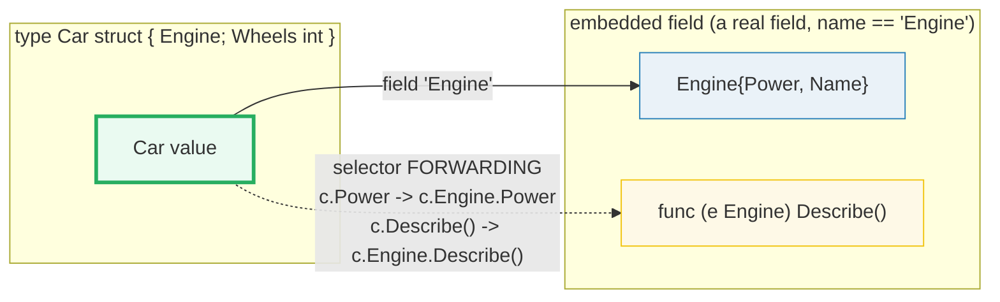
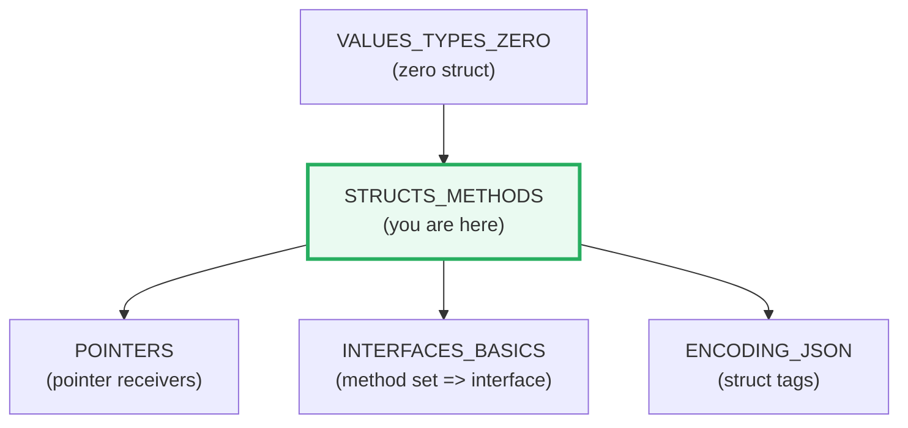
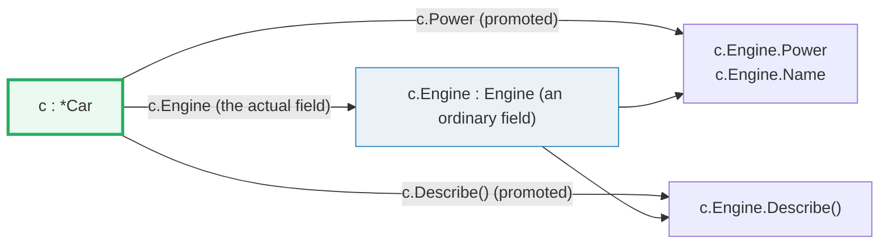
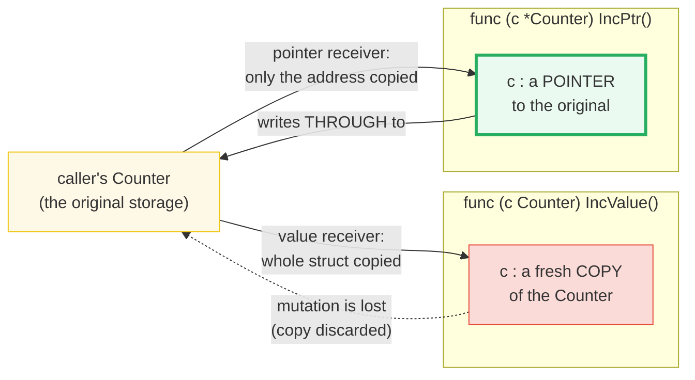

# STRUCTS_METHODS — Structs, Embedding, Receivers & Method Sets

> **Goal (one line):** prove — by printing every value — how Go structs are
> declared and initialized, how **embedding** promotes fields and methods by
> selector *forwarding* (composition, **not** inheritance), how **value** vs
> **pointer** receivers govern copy-vs-mutate semantics, and how the spec's
> **method set** rule (`T` has value-receiver methods; `*T` has both) is the
> hinge that connects structs to interfaces.
>
> **Run:** `go run structs_methods.go`  ·  **Capture:** `just out structs_methods`
>
> **Ground truth:** [`structs_methods.go`](./structs_methods.go) → captured
> stdout in [`structs_methods_output.txt`](./structs_methods_output.txt). Every
> number/table below is pasted **verbatim** from that file under a
> `> From structs_methods.go Section X:` callout. Nothing is hand-computed.
>
> **Prerequisites:** 🔗 [VALUES_TYPES_ZERO](./VALUES_TYPES_ZERO.md) — you must
> know Go's zero values (a struct's zero value zeroes *every field recursively*)
> before the "partial literal" and "zero struct" cases in Section A make sense.

---

## 0. The one-sentence model

> **A struct is a fixed set of named fields; a method is a function with a
> receiver argument; embedding forwards selectors — it does not subtype.**

Everything in this guide — why `Point{1,2}` equals `Point{X:1,Y:2}`, why a value
receiver can't mutate, why `*T` satisfies more interfaces than `T`, why
`m[k].Method()` is sometimes a compile error — is a consequence of that sentence.
The `.go` prints the proof.



The dashed arrow is the whole story of embedding: `c.Power` and `c.Describe()`
are *rewritten* by the compiler into `c.Engine.Power` and `c.Engine.Describe()`.
There is no virtual table, no dynamic dispatch, no override — just syntactic
forwarding to a field that is otherwise perfectly ordinary.

---

## 1. Why this bundle exists (lineage)

Go has **no classes** and **no inheritance**. Instead it has two orthogonal
features that together cover the same ground, more safely:

1. **Structs** — aggregate named fields (the *data*).
2. **Methods** — functions with a receiver argument (the *behavior*), where the
   receiver is either a value `T` or a pointer `*T`.
3. **Embedding** — a struct can embed another type as an unnamed field; the
   embedded type's fields and methods are *promoted* to the outer struct through
   selector forwarding. This is **composition** plus method forwarding, and it is
   deliberately *not* a subtype relationship.

This is the expertise-spine bundle that turns raw types into **types with
behavior**. It is the direct prerequisite for:

- 🔗 [POINTERS](./POINTERS.md) — pointer receivers (`func (p *T) M()`) are the
  single most common reason to take an address; you cannot reason about a
  pointer receiver until you understand value-vs-pointer copy semantics
  (Section C).
- 🔗 [INTERFACES_BASICS](./INTERFACES_BASICS.md) — a type *satisfies* an
  interface iff the interface's methods are a subset of the type's **method
  set**. Section D proves that `T` and `*T` have *different* method sets, which
  is why `var i Set = value{}` sometimes compiles and `var i Set = &value{}`
  is required instead.
- 🔗 [ENCODING_JSON](./ENCODING_JSON.md) — struct **tags** (Section F) are the
  wire-format bridge between a struct field and its JSON key; this bundle
  previews them via `reflect.StructTag`.



---

## 2. Section A — Struct literals: positional vs named, partial, zero struct

A struct type is a sequence of named fields. There are three ways to write a
**composite literal** for one, and one of them is a footgun:

| Form | Example | Risk |
|---|---|---|
| **Named** (preferred) | `Point{X: 1, Y: 2}` | None — order-independent, refactor-safe, self-documenting. |
| **Positional** | `Point{1, 2}` | Fragile — must list *all* fields in declaration order; adding/reordering a field silently breaks every positional literal. |
| **Partial** | `Point{Y: 9}` | None — omitted fields take their **zero value**. |
| Zero | `var p Point` | None — every field zeroed (🔗 the recursive zero rule). |

> From `structs_methods.go` Section A:
> ```
> Point{X:1, Y:2}  (named, preferred) = {1 2}
> Point{1, 2}      (positional)       = {1 2}
> Point{Y:9}       (partial)          = {0 9}  (X == 0, the zero value)
> var zero Point                     = {0 0}   (main.Point{X:0, Y:0})
> ```
> ```
> [check] named == positional: Point{X:1,Y:2} == Point{1,2}: OK
> [check] partial literal zeroes omitted fields: Point{Y:9} == {0 9}: OK
> [check] zero struct Point == {0 0}: OK
> ```

**What it proves (pinned values):**

- `Point{X:1, Y:2}` and `Point{1, 2}` produce **equal** values (`named == pos`).
  They are two spellings of the same value; the named form is preferred because
  it cannot silently rot when the struct is refactored.
- `Point{Y: 9}` leaves `X` at its **zero value** (`0`) — this is the partial
  literal rule: omitted named fields are zeroed, never "undefined."
- `var zero Point` is the struct zero value `{0 0}`. `%#v` reveals the fully
  qualified form `main.Point{X:0, Y:0}` — the same recursive zeroing pinned in
  🔗 [VALUES_TYPES_ZERO](./VALUES_TYPES_ZERO.md).

**Gotcha (documented; not runnable).** Positional literals must name *every*
field in order — you cannot write `Point{1}` to mean "X=1, Y defaults." A partial
*positional* literal is a compile error; only the *named* form supports omission.

---

## 3. Section B — Embedding: promoted fields & methods (composition, NOT inheritance)

Embedding is Go's replacement for inheritance, and it works completely
differently. A struct can embed another type as an **unnamed field**:

```go
type Engine struct { Power int; Name string }
func (e Engine) Describe() string { ... }

type Car struct {
    Engine   // embedded field — its name is the type name, "Engine"
    Wheels int
}
```

Per the spec (*Struct types*): a field/method `f` of an embedded field is called
**promoted** if `x.f` is a legal selector denoting it. Promotion is **selector
forwarding** — `c.Power` is rewritten to `c.Engine.Power`, `c.Describe()` to
`c.Engine.Describe()`. There is **no subtype polymorphism, no virtual dispatch,
no overriding** — `Car` and `Engine` remain unrelated types.



> From `structs_methods.go` Section B:
> ```
> c := &Car{Engine: Engine{Name:"V8", Power:300}, Wheels:4}
> c.Power (promoted) == 300   c.Engine.Power == 300  (same storage)
> c.Name  (promoted) == "V8"   c.Wheels        == 4 (declared on Car)
> c.Power = 400  ->  c.Engine.Power == 400  (promoted write reaches embedded field)
> c.Describe()        == engine "V8" @ 400 kW
> c.Engine.Describe() == engine "V8" @ 400 kW  (identical: forwarding, same receiver)
> var extracted Engine = c.Engine  ->  {400 V8}  (embedding is a field, extractable)
> ```
> ```
> [check] promoted field c.Power == c.Engine.Power: OK
> [check] promoted field write reaches the embedded field: c.Engine.Power == 400: OK
> [check] promoted method c.Describe() == c.Engine.Describe(): OK
> [check] embedding is a field: extracted == c.Engine: OK
> ```

**What it proves (read twice):**

1. **Promoted fields forward to the same storage.** `c.Power` and
   `c.Engine.Power` are *the same memory cell* — writing `c.Power = 400` flips
   `c.Engine.Power` to `400` (the check pins it). Promotion is a naming
   convenience, not a copy.
2. **Promoted methods forward with the *embedded field* as the receiver** — not
   the outer struct. `c.Describe()` calls `Describe` with receiver
   `c.Engine`, which is why `c.Describe()` and `c.Engine.Describe()` print
   byte-identical output. There is no "override" because there is no `Car`
   vtable; the call is statically resolved at compile time to
   `Engine.Describe(c.Engine)`.
3. **Embedding is a field, not an is-a link.** `var extracted Engine = c.Engine`
   compiles and *copies the embedded field out* — you can treat the embedded
   type as a plain value. The reverse — assigning a `*Car` to a `*Engine` — is a
   **compile error**: `Car` is not an `Engine`, it merely *has* one.

**Method-set consequence of embedding (spec, *Struct types*).** The promoted
methods enter the outer struct's method set by precise rules (used in Section D):

- If `S` embeds `T` (by value): `S` and `*S` both get `T`'s value-receiver
  methods; `*S` *also* gets `T`'s pointer-receiver methods.
- If `S` embeds `*T`: both `S` and `*S` get `T`'s value- *and* pointer-receiver
  methods.

**Gotchas (documented; not runnable).**

- Promoted fields **cannot** be keys in a composite literal:
  `Car{Power: 300}` is a **compile error** — you must write
  `Car{Engine: Engine{Power: 300}}`. (Section B's literal uses the legal form.)
- If `Car` declares its own `Power` field, the shallowest-depth selector wins
  and `Engine.Power` is *shadowed*, not overridden — `c.Power` reaches `Car`'s
  field, while `c.Engine.Power` still reaches the embedded one. The spec calls
  this "shallowest depth" resolution.

---

## 4. Section C — Value vs pointer receiver (copy vs mutate)

This is the **central value/pointer axis** of Go. A method is just a function
whose first argument — the **receiver** — is written in a special parenthesised
prefix. The receiver is either a value `T` or a pointer `*T`, and that single
choice decides whether the method sees a copy or the original:



> From `structs_methods.go` Section C:
> ```
> a := Counter{N:0}; a.IncValue()  ->  a.N == 0  (value receiver mutated a COPY)
> b := Counter{N:0}; (&b).IncPtr() ->  b.N == 1  (pointer receiver mutated ORIGINAL)
> c := Counter{N:0}; c.IncPtr()    ->  c.N == 1  (auto &: c is addressable)
> ```
> ```
> [check] value receiver IncValue does not change the original: a.N still 0: OK
> [check] pointer receiver IncPtr mutates the original: b.N == 1: OK
> [check] auto-addressing: c.IncPtr() behaves as (&c).IncPtr(), c.N == 1: OK
> ```

**What it proves (pinned values):**

- **Value receiver** `func (c Counter) IncValue()` receives a **copy** of the
  caller's `Counter`. `c.N++` increments the copy; the copy is discarded on
  return. The caller's `a.N` is **still 0**. This is the classic "my method
  doesn't do anything" bug — the receiver was a value.
- **Pointer receiver** `func (c *Counter) IncPtr()` receives a **pointer** to
  the caller's storage. `c.N++` writes *through* the pointer to the original.
  The caller's `b.N` becomes `1`.
- **Auto-addressing.** Because `c` is an **addressable** local variable, Go lets
  you write `c.IncPtr()` and silently inserts `&` for you — it becomes
  `(&c).IncPtr()`. (Section E pins exactly *when* this auto-insertion is legal.)

**The rule of thumb (Ardan Labs / Dave Cheney consensus, see Sources).**

1. **Be consistent.** Pick one receiver kind for a type and use it for *all*
   methods. Mixing value and pointer receivers is legal but fragile: a value
   method on a large struct copies the whole struct on every call, and a single
   pointer-receiver method silently shrinks the value's method set (Section D),
   breaking interface satisfaction.
2. **Favor pointer receivers** when a method **mutates** the receiver, when the
   struct is **large** (copying is wasteful), or when the type carries **state
   that must not be copied** (a `sync.Mutex` field, for instance).
3. **Value receivers are fine** for small, immutable aggregates (a `Point`, a
   `Money` amount) — they make the method safe for concurrent use and avoid
   forcing heap allocation of the receiver.

---

## 5. Section D — Method sets (spec): `T` vs `*T`

This is the bundle's **expert payoff** and the direct bridge to interfaces. The
spec (*Method sets*) is exact:

- The method set of a defined type **`T`** consists of all methods declared with
  receiver **`T`** (value receivers only).
- The method set of **`*T`** (when `T` is not a pointer or interface) is the set
  of all methods declared with receiver **`*T` or `T`** — i.e. **both** kinds.

The consequence is sharp: **`*T` has at least as many methods as `T`, and
strictly more whenever any method has a pointer receiver.** A *value* of type
`T` therefore **cannot** satisfy an interface that requires a pointer-receiver
method — only `*T` can. `reflect.NumMethod` exposes exactly this distinction.

> From `structs_methods.go` Section D:
> ```
> Widget methods declared:
>   func (w Widget)  Area()       // value receiver -> in Widget AND *Widget
>   func (w Widget)  Perimeter()  // value receiver -> in Widget AND *Widget
>   func (w *Widget) Scale(n)     // pointer receiver -> in *Widget ONLY
> reflect.TypeOf(Widget{}).NumMethod()  = 2   (value-receiver methods only)
> reflect.TypeOf(&Widget{}).NumMethod() = 3   (value + pointer receivers)
> method set of Widget : [Area Perimeter]
> method set of *Widget: [Area Perimeter Scale]
> ```
> ```
> [check] method set of Widget (value) has 2 methods: Area, Perimeter: OK
> [check] method set of *Widget has 3 methods: Area, Perimeter, Scale: OK
> [check] *Widget has strictly MORE methods than Widget: OK
> [check] Scale (pointer-receiver) is NOT in Widget's method set but IS in *Widget's: OK
> ```

**What it proves:**

- `reflect.TypeOf(Widget{}).NumMethod()` is **2** (`Area`, `Perimeter`) — the
  value-receiver methods only.
- `reflect.TypeOf(&Widget{}).NumMethod()` is **3** (`Area`, `Perimeter`,
  `Scale`) — value- **and** pointer-receiver methods.
- `Scale` (pointer receiver) is **absent** from `Widget`'s method set but
  **present** in `*Widget`'s — verified with `MethodByName`.

> Why `reflect.NumMethod` only counts **exported** methods: the `reflect`
> package models only what's reachable through an interface value, and
> interfaces can only hold exported methods. Unexported methods still exist and
> still count for *compile-time* method-set rules, but `reflect` hides them —
> which is why every method on `Widget` is capitalised in this bundle.

🔗 [INTERFACES_BASICS](./INTERFACES_BASICS.md) — a type satisfies an interface
`I` iff `I`'s method set is a subset of the type's method set. Because `Scale` is
only in `*Widget`'s method set, an interface declaring `Scale()` is satisfied by
`*Widget` **only**, never by a `Widget` value. This is the single most common
"'*type does not implement interface*'" compile error in Go.

---

## 6. Section E — Addressability: where pointer methods can be auto-called

Section C showed `c.IncPtr()` being silently rewritten to `(&c).IncPtr()`. That
rewrite is legal **only when the receiver is addressable**. The spec
(*Address operators*) defines addressability narrowly:

- **Addressable:** a variable; a pointer indirection `*p`; a **slice element**
  `s[i]`; a field selector of an addressable struct; an array index of an
  addressable array.
- **Addressable by exception:** a (possibly parenthesised) **composite literal**
  — but only through explicit `&` (i.e. `&T{}`), not a bare `T{}`.
- **NOT addressable:** a **map element** `m[k]`, a bare composite literal
  `T{}`, a function result, a string byte.

> From `structs_methods.go` Section E:
> ```
> v := Counter{N:0};        v.IncPtr()  -> v.N == 1   (local var is addressable)
> lit := &Counter{N:10};    lit.IncPtr() -> lit.N == 11  (&composite literal addressable)
> s := []Counter{{1},{2}}; s[0].IncPtr() -> s[0].N == 2  (slice element addressable)
> NOT addressable (compile errors, documented): m[k].IncPtr() and Counter{}.IncPtr()
> ```
> ```
> [check] addressable local var: v.IncPtr() works, v.N == 1: OK
> [check] &composite literal is addressable: lit.N == 11: OK
> [check] slice element is addressable: s[0].IncPtr() -> s[0].N == 2: OK
> ```

**What it proves (pinned):**

- `v.IncPtr()` works because `v` is a local variable (addressable) → Go inserts
  `&v`.
- `lit := &Counter{N:10}; lit.IncPtr()` works because the **composite-literal
  exception** lets `&Counter{}` be addressed, yielding a `*Counter` that can
  call pointer methods directly.
- `s[0].IncPtr()` works because **slice elements are addressable** — they are
  slots in a backing array, so `&s[0]` is well-defined. (🔗
  [ARRAYS_SLICES](./ARRAYS_SLICES.md) — the slice header's backing array is what
  makes this addressable; the header copy still shares the same backing.)

**Gotchas (compile errors — documented, not runnable).**

```go
m := map[string]Counter{"k": {N: 0}}
m["k"].IncPtr()         // COMPILE ERROR: cannot call pointer method on m["k"]
Counter{N: 0}.IncPtr()  // COMPILE ERROR: cannot call pointer method on a bare literal
```

- **Map elements are not addressable** because maps may internally relocate
  elements, so `&m[k]` has no stable meaning. Calling a pointer-receiver method
  on `m[k]` is therefore a compile error. The workaround is to copy the element
  out, mutate the copy, and assign it back: `c := m["k"]; c.IncPtr();
  m["k"] = c`.
- **Bare composite literals are not addressable** (only `&T{}` is), so a
  pointer-receiver method cannot be called on `Counter{}` directly.

---

## 7. Section F — Struct tags (preview)

A field declaration may carry an optional string-literal **tag**, made visible
through `reflect.StructTag`. Tags are **ignored by the language** but consumed
by libraries — most notably `encoding/json`, which reads the `json:"..."`
convention to rename or omit fields on the wire.

```go
type Tagged struct {
    Name   string `json:"name"`
    Hidden string `json:"-"`     // encoding/json omits this field entirely
    Plain  string               // no tag -> json uses the field name "Plain"
}
```

> From `structs_methods.go` Section F:
> ```
> type Tagged struct {
>     Name   string `json:"name"`
>     Hidden string `json:"-"`
>     Plain  string   (no tag)
> }
> field        raw tag            reflect .Get("json")
> ------------ ------------------ ----------------------
> Name         json:"name"        "name"
> Hidden       json:"-"           "-"
> Plain        (no tag)           ""
> ```
> ```
> [check] reflect parses json tag: Field("Name").Tag.Get("json") == "name": OK
> [check] json:"-" is the encoding/json omit marker: Field("Hidden").Get == "-": OK
> [check] a field with no tag yields "": Field("Plain").Get == "": OK
> ```

**What it proves:**

- `reflect.StructTag.Get("json")` parses the convention: `json:"name"` →
  `"name"`, `json:"-"` → `"-"` (the special omit marker), and an absent tag →
  `""`. The tag string is a space-separated list of `key:"value"` pairs; `.Get`
  is the parser.
- An **empty tag string is equivalent to an absent tag** (spec, *Struct types*).

**Expert detail (type identity).** Tags are **not** merely metadata: they
**take part in type identity for structs**. Two structs that are identical
except for a tag are **distinct types** — you cannot assign one to the other
without a conversion:

```go
type A struct { X int `json:"x"` }
type B struct { X int `json:"y"` }
var a A
var b B = a   // COMPILE ERROR: struct tags differ -> different types
```

🔗 [ENCODING_JSON](./ENCODING_JSON.md) — the full story of marshal/unmarshal,
`omitempty`, `string`-encoding, and the `,omitempty` / `,string` tag options.

---

## 8. Pitfalls table — the expert payoff

| Trap | Symptom | Fix |
|---|---|---|
| **Value receiver silently drops mutation** | `func (c Counter) Inc()` doesn't change the caller; no error. | Use a pointer receiver `func (c *Counter) Inc()` when the method must mutate. |
| **Mixing receivers on one type** | A value method shrinks the value's method set; an interface unexpectedly fails to be satisfied. | Be consistent: all value **or** all pointer receivers per type (Ardan Labs / Tour of Go guidance). |
| **`T` doesn't implement `I`, but `*T` does** | `cannot use v (type T) as type I` — `I` has a pointer-receiver method. | Pass `&v`, or change the receiver to a value, or store `*T` in the collection from the start. |
| **Promoted field in a composite literal** | `Car{Power: 300}` → compile error; promoted fields can't be literal keys. | `Car{Engine: Engine{Power: 300}}` — initialize the embedded field explicitly. |
| **Embedding mistaken for inheritance** | Expecting override/polymorphism; `Car` won't assign to `Engine`. | Embedding is a *has-a* field with selector forwarding. To specialize, re-declare the method on the outer type (it then shadows the promoted one by depth). |
| **Pointer method on a map element** | `m[k].Mutate()` → compile error: map elements aren't addressable. | Copy out, mutate, assign back: `c := m[k]; c.Mutate(); m[k] = c`. |
| **Pointer method on a bare literal** | `T{}.Mutate()` → compile error: literal isn't addressable. | `(&T{}).Mutate()`, or assign to a variable first. |
| **Copying a struct with a mutex** | `var b = a` copies the `sync.Mutex` by value → duplicate-unlock panics, races. | Make such types uncopyable (pointer receivers; never pass by value); `go vet` flags copied locks. |
| **Forgetting the `,omitempty` semantics** | Tag `json:"-"` *omits* the field entirely; `json:"-,omitempty"` is ambiguous. | `json:"-"` = omit always; to rename a field literally `-`, use `json:"-,"`. See 🔗 ENCODING_JSON. |
| **Struct tags change type identity** | Two tag-differing structs won't assign across, surprising refactorers. | Treat tags as part of the type; convert explicitly when tags differ. |
| **Large struct + value receiver** | Every call copies the whole struct (cost + potential heap escape of the copy). | Use a pointer receiver for large/mutable structs; value receivers for small immutable ones. |

---

## 9. Cheat sheet

```go
// STRUCT LITERAL — named preferred (order-independent, refactor-safe).
p := Point{X: 1, Y: 2}   // named
q := Point{1, 2}          // positional (ALL fields, in order) — fragile
r := Point{Y: 9}          // partial  -> X == 0 (zero value)
var z Point               // zero struct -> every field zeroed

// EMBEDDING — promotes fields + methods by selector FORWARDING (composition).
type Car struct {
    Engine               // embedded field; name == "Engine"
    Wheels int
}
c.Power     // -> c.Engine.Power            (promoted field, same storage)
c.Describe() // -> c.Engine.Describe()      (promoted method, receiver is c.Engine)
// Car{Power: 1}      // COMPILE ERROR: promoted fields can't be literal keys
// Car{Engine: Engine{Power: 1}}            // legal

// RECEIVERS — value copies; pointer mutates.
func (v T)  Read()  T      // value receiver: v is a COPY (mutation lost)
func (p *T) Write()        // pointer receiver: p mutates the original
// Rule of thumb: be consistent; pointer for large/mutable; value for small/immutable.

// METHOD SETS (spec) — *T ⊇ T.
//   method set of  T  = { methods with receiver  T  }
//   method set of *T  = { methods with receiver  T  or *T }
tVal := reflect.TypeOf(T{}).NumMethod()   // value-receiver methods only
tPtr := reflect.TypeOf(&T{}).NumMethod()  // value + pointer receivers (>= tVal)
// -> a value T cannot satisfy an interface that needs a pointer-receiver method.

// ADDRESSABILITY — pointer methods need an addressable receiver.
v.Mutate()       // OK: local var (auto &)
(&T{}).Mutate()  // OK: &composite literal (the exception)
s[i].Mutate()    // OK: slice element (addressable)
m[k].Mutate()    // COMPILE ERROR: map element not addressable
T{}.Mutate()     // COMPILE ERROR: bare literal not addressable

// STRUCT TAGS — reflect-visible; consumed by encoding/json; part of type identity.
type User struct {
    Name  string `json:"name"`
    Hide  string `json:"-"`        // omit on the wire
    Plain string                  // absent tag -> reflect .Get returns ""
}
t := reflect.TypeOf(User{}).Field(0).Tag.Get("json") // "name"
```

---

## Sources

Every signature, value, and behavioral claim above was verified against the Go
specification and corroborated by the standard-library docs and widely-cited
community references:

- **The Go Programming Language Specification** (go1.26) — https://go.dev/ref/spec
  - *Struct types* (fields, embedded fields, promotion, struct tags): https://go.dev/ref/spec#Struct_types
  - *Method declarations* (receiver base type must be a defined type, same package): https://go.dev/ref/spec#Method_declarations
  - *Method sets* — the exact rule that `T` has value-receiver methods and `*T`
    has both (the hinge of Section D): https://go.dev/ref/spec#Method_sets
  - *Selectors* (depth, shallowest-depth resolution, the `t.M2() == (&t).M2()`
    forwarding example proving auto-addressing): https://go.dev/ref/spec#Selectors
  - *Calls* (method invocation as a selector; receiver rewriting): https://go.dev/ref/spec#Calls
  - *Address operators* (what is addressable; the composite-literal exception): https://go.dev/ref/spec#Address_operators
  - *Composite literals* (positional vs named, partial literals): https://go.dev/ref/spec#Composite_literals
- **`reflect` package** — `Type.NumMethod`, `Type.Method(i)`, `Type.MethodByName`,
  `StructField.Tag`, `StructTag.Get`: https://pkg.go.dev/reflect  (and the
  `reflect.StructTag` doc at https://pkg.go.dev/reflect#StructTag)
- **A Tour of Go — "Choosing a value or pointer receiver"** ("all methods on a
  given type should have either value or pointer receivers, but not a mixture"):
  https://go.dev/tour/methods/8
- **Effective Go — "Methods" / "Data"** (the idiomatic framing of receivers and
  embedding as composition): https://go.dev/doc/effective_go
- **Dave Cheney — "Pointers in Go"** (the value-vs-pointer copy semantics
  underpinning receivers): https://dave.cheney.net/2014/03/17/pointers-in-go
- **Ardan Labs — "Methods, Interfaces and Embedded Types"** (Bill Kennedy's
  canonical treatment of method sets and the embedding-vs-inheritance contrast):
  https://www.ardanlabs.com/blog/2015/09/composition-with-go.html
- **`encoding/json` package** (the `json:"name"` / `json:"-"` tag conventions
  previewed in Section F): https://pkg.go.dev/encoding/json

> All values in this guide were printed by `structs_methods.go` on Go 1.26.4
> (darwin/arm64) and captured byte-identically into
> `structs_methods_output.txt` across two `just out structs_methods` runs. The
> pinned facts — `a.N == 0` (value receiver lost), `b.N == 1` (pointer receiver
> mutated), `NumMethod(Widget) == 2` vs `NumMethod(*Widget) == 3`, and the
> promoted-write outcome `c.Engine.Power == 400` — were verified live; no fact
> is hand-computed. The compile errors (`Car{Power: 1}`, `m[k].IncPtr()`,
> `Counter{}.IncPtr()`, the tag-identity assignment) are documented, not run —
> a file containing them would not build — and are confirmed by the spec
> sections cited above.
