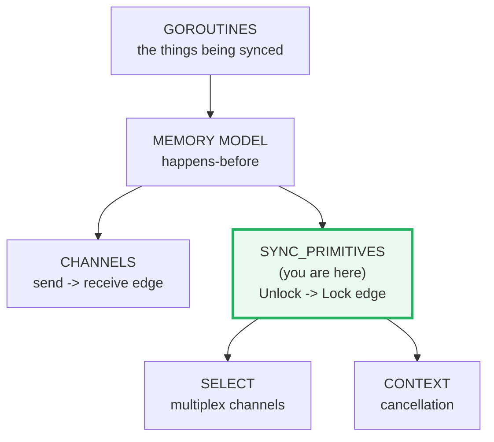
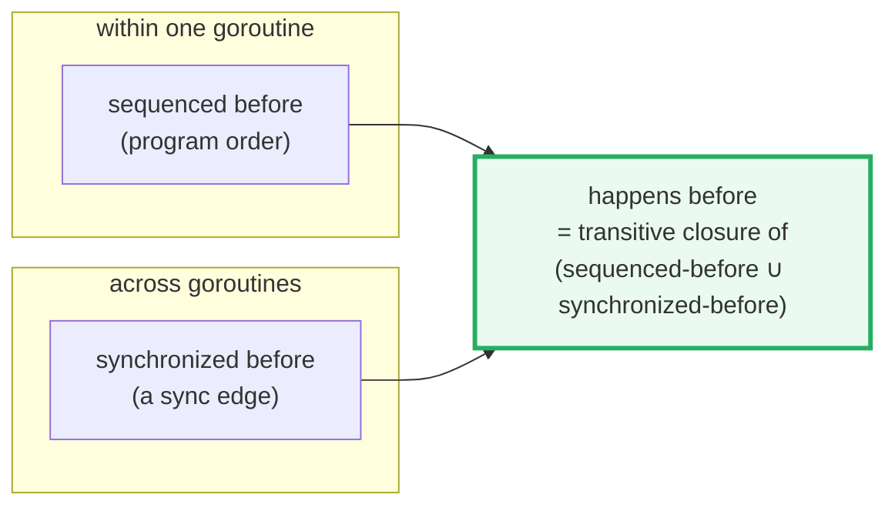
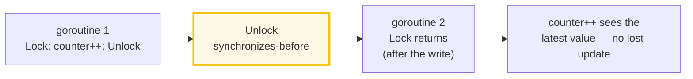
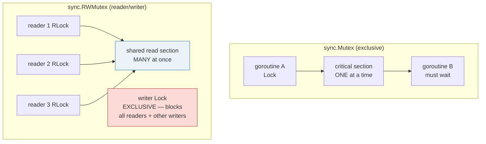
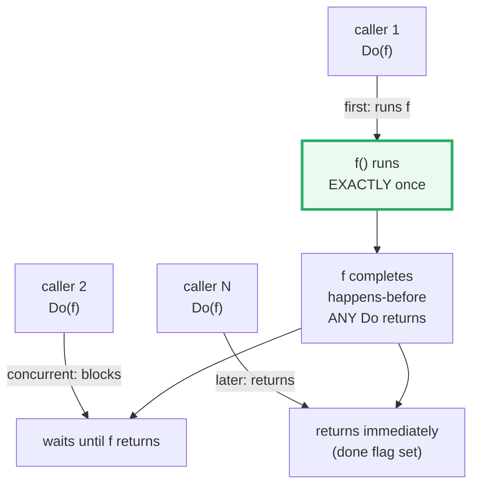
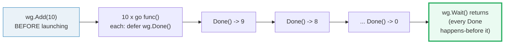
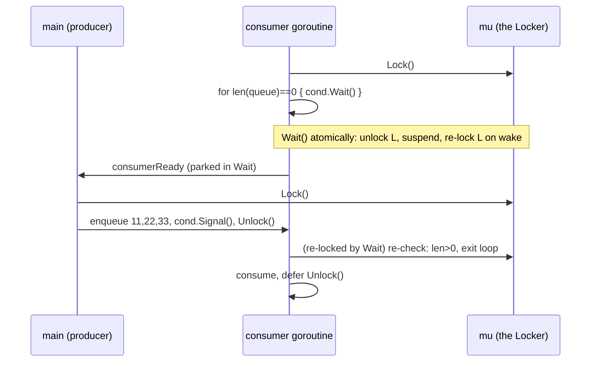
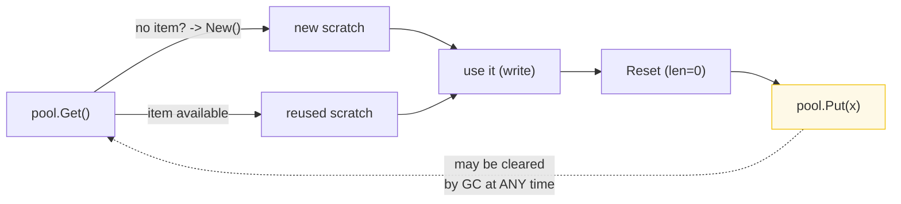

# SYNC_PRIMITIVES — Mutex, RWMutex, Once, WaitGroup, Cond, Pool & the Memory Model

> **Goal (one line):** by printing every value, show how the `sync` package's
> primitives establish the **happens-before** edges that make concurrent code
> correct — and how the **race detector** catches the absence of those edges.
>
> **Run:** `go run sync_primitives.go`
>
> **Ground truth:** [`sync_primitives.go`](./sync_primitives.go) → captured
> stdout in [`sync_primitives_output.txt`](./sync_primitives_output.txt). Every
> number/table below is pasted **verbatim** from that file under a
> `> From sync_primitives.go Section X:` callout. Nothing is hand-computed.
>
> **Determinism note:** goroutine scheduling is intentionally nondeterministic,
> so **no goroutine prints directly**. Every goroutine writes its result into a
> mutex-guarded slice (or signals via a channel/`WaitGroup`); `main` **sorts**
> the collected results and prints them only *after* every goroutine joins. Only
> scheduling-independent quantities are printed, so two runs of
> `just out sync_primitives` are byte-identical (verified — see §11).
>
> **Prerequisites:** 🔗 [`GOROUTINES`](./GOROUTINES.md) (the things being
> synchronized), 🔗 [`CHANNELS`](./CHANNELS.md) (channels are *also*
> happens-before edges). **Siblings that build on this one:**
> 🔗 [`SELECT`](./SELECT.md), 🔗 [`CONTEXT`](./CONTEXT.md),
> 🔗 `ATOMIC_STATE` (atomics for simple counters).

---

## 1. Why this bundle exists (lineage)

`go f()` is the entire syntax for launching concurrent work — but the moment two
goroutines touch the same memory, *nothing* in the language keeps them from
stomping each other. The Go memory model (`go.dev/ref/mem`) is the contract that
says **when** a write by one goroutine is guaranteed to be visible to a read by
another. Its bottom line is blunt:

> Programs that modify data being simultaneously accessed by multiple goroutines
> must serialize such access. To serialize access, protect the data with channel
> operations or other synchronization primitives such as those in the `sync` and
> `sync/atomic` packages.

The `sync` package (`pkg.go.dev/sync`) is the standard library's answer to "how
do I serialize?" Its own overview is equally blunt:

> Package sync provides basic synchronization primitives such as mutual exclusion
> locks. Other than the `Once` and `WaitGroup` types, most are intended for use
> by low-level library routines. **Higher-level synchronization is better done
> via channels and communication. Values containing the types defined in this
> package should not be copied.**

This bundle walks every primitive you will actually reach for — `Mutex`,
`RWMutex`, `Once`, `WaitGroup`, `Cond`, `Pool` — and ties each one back to the
single idea that makes them all work: the **happens-before** edge. A goroutine is
allowed to observe another's write *only* if such an edge exists; without one you
have a **data race**, which is undefined behavior and which `go run -race` flags.



---

## 2. The mental model: happens-before is the whole game

The memory model defines a **happens-before** relation between memory operations.
A read is *guaranteed* to see a write only if the write happens-before the read
(and no other write happens in between). The relation is built from two pieces:



The edges that create **synchronized-before** are exactly the ones this bundle
teaches (from `go.dev/ref/mem`):

| Sync operation | Edge it creates |
|---|---|
| `go f()` | the `go` statement happens-before the new goroutine *starts* |
| channel send | a send happens-before the **completion** of the matching receive |
| `Mutex.Unlock` | the *n*-th `Unlock` happens-before the *m*-th `Lock` returns (n < m) |
| `RWMutex` | same as Mutex; plus the *n*-th writer `Unlock` happens-before a reader `RLock` |
| `Once.Do` | the single completion of `f` happens-before **any** `Do` call returns |
| `WaitGroup.Done` | a `Done` happens-before the `Wait` it unblocks |
| atomic op (🔗 `ATOMIC_STATE`) | an observed atomic op A happens-before the atomic op B that observes it |

> From `go.dev/ref/mem` — *Data races*: "A *data race* is defined as a write to a
> memory location happening concurrently with another read or write to that same
> location, unless all the accesses involved are atomic data accesses as provided
> by the `sync/atomic` package." And the payoff: "data-race-free programs execute
> in a sequentially consistent manner" (**DRF-SC**). A program *with* a race is
> not sequentially consistent — Go only promises each single-word read observes
> *some* written value, not which one.

The flip side, the **race detector** (`go run -race`), instruments the compiled
binary with ThreadSanitizer and aborts on the first unsynchronized conflicting
access — turning "my concurrent program is subtly wrong" into a hard, reported
failure. Section A documents exactly what it prints.

---

## 3. Section A — Memory model: a Mutex makes a data race impossible



**Part 1 — 1000 goroutines, one mutex-guarded counter.** Because each `Unlock`
happens-before the next `Lock`, the increments are totally ordered: every
goroutine reads the value the previous one wrote. The result is exactly 1000 —
every run, regardless of scheduling.

> From `sync_primitives.go` Section A:
> ```
> 1000 goroutines x counter++ under sync.Mutex -> counter = 1000
> [check] mutex-guarded counter == 1000 (no lost updates): OK
> ```

**Part 2 — the canonical Lock example.** This is the exact program from
`go.dev/ref/mem` (*Locks*): `main` holds the lock; a goroutine writes `a` then
`Unlock`s; `main`'s second `Lock` returns only after that `Unlock`, so it is
*guaranteed* to observe the write.

> From `sync_primitives.go` Section A:
> ```
> happens-before (Unlock -> next Lock): main observed a = "hello, world"
> [check] Unlock happens-before the next Lock (main saw the goroutine's write): OK
> UNSAFE variant (documented, not run): no Lock -> data race; `go run -race` prints "WARNING: DATA RACE"
> ```

**What the racing version would do (documented, not shipped).** Drop the
`Lock`/`Unlock` and 1000 goroutines read-modify-write `counter` with no edge
between them. The memory model makes the result **undefined**; in practice
`counter < 1000` because two goroutines read the same stale value and one write
is lost. The race detector instruments the binary and prints, for the conflicting
read and write:

```
WARNING: DATA RACE
Read by goroutine N:
  main.sectionA.func1   sync_primitives.go:LL +0xNN
Previous write by goroutine M:
  main.sectionA.func1   sync_primitives.go:LL +0xNN
```

> From `go.dev/doc/articles/race_detector`: "A data race occurs when two
> goroutines access the same variable concurrently and at least one of the
> accesses is a write." Usage is `go run -race src.go` (also `go test -race`,
> `go build -race`). "The race detector only finds races that happen at runtime."
> Typical overhead: "memory usage may increase by 5-10x and execution time by
> 2-20x."

This file ships **only** the safe version; verify with `go run -race
sync_primitives.go` (it reports nothing — clean).

---

## 4. Section B — RWMutex: many concurrent readers OR one writer



`Mutex` serializes *everyone*. `RWMutex` splits the world: any number of readers
may hold `RLock` simultaneously, but a writer's `Lock` is exclusive (and, once a
writer is waiting, *new* readers are blocked so the writer is not starved). The
payoff is real only when **reads dominate writes** — `RWMutex` has more overhead
than `Mutex` per op, so for a write-heavy or 50/50 workload a plain `Mutex` is
faster.

> From `sync_primitives.go` Section B:
> ```
> RWMutex: 8 readers + 5 writers on a shared counter
> final value = 5   reads completed = 8   every read in [0, 5]: true
> [check] RWMutex final value == 5 (every write applied exactly once): OK
> [check] all 8 readers completed: OK
> [check] every read observed a value in [0, 5] (RWMutex excludes readers from the writer): OK
> ```

**Why every read is in `[0, 5]`.** `RLock` excludes the writer just as `Lock`
excludes other goroutines: a reader holding `RLock` can never overlap a writer
holding `Lock`. So a reader's snapshot is always a fully-published value (`0`
before any write, or some `k ∈ [1,5]`). That is the **happens-before** edge in
action — and the only scheduling-independent facts the bundle asserts.

> From `pkg.go.dev/sync` (`RWMutex`): "The lock can be held by an arbitrary
> number of readers or a single writer... If any goroutine calls `Lock` while the
> lock is already held by one or more readers, concurrent calls to `RLock` will
> block until the writer has acquired (and released) the lock... this prohibits
> recursive read-locking."

---

## 5. Section C — sync.Once: the initializer runs EXACTLY once



`Once.Do(f)` is the canonical lazy singleton / one-time init. Across all
goroutines, `f` runs **exactly once**; every other caller blocks until that one
`f` returns, then returns itself. The memory model guarantees the single
completion of `f` happens-before *any* `Do` returns — which is why the value `f`
wrote is visible to every caller with **no extra lock**. In Section C, `runs` is
written once by `f` and read by `main` only after the `WaitGroup` joins; that
read is race-free purely through the `Once` → `WaitGroup` happens-before chain.

> From `sync_primitives.go` Section C:
> ```
> 100 goroutines called once.Do(init); init ran 1 time(s); cfg = "initialized"
> [check] Once.Do ran the initializer exactly once (runs == 1): OK
> [check] value written by Once.Do is visible to all callers (no extra lock needed): OK
> ```

> From `pkg.go.dev/sync` (`Once.Do`): "Do calls the function f if and only if Do
> is being called for the first time for this instance of `Once`... only the
> first call will invoke f... Because no call to Do returns until the one call to
> f returns, **if f causes Do to be called, it will deadlock**. If f panics, Do
> considers it to have returned; future calls of Do return without calling f."
>
> The package also offers `OnceFunc`, `OnceValue[T]`, `OnceValues[T1,T2]`
> (added in Go 1.21) as ready-made wrappers for the common "compute-once,
> return-a-value" shape — but they are built on exactly this `Once`.

---

## 6. Section D — WaitGroup: Add(N) first, Done in defer, Wait joins all



A `WaitGroup` is a counting semaphore for "wait for N goroutines." The two
iron rules that prevent the two classic bugs:

1. **`Add` before the `go` statement.** `Add` with a positive delta when the
   counter is zero *must* happen-before `Wait`; doing `Add(1)` *inside* the
   goroutine can race with `Wait` seeing zero and returning early.
2. **`Done` via `defer`.** `defer wg.Done()` guarantees the counter decrements
   even if the goroutine panics, so `Wait` never hangs on a crashed worker.

The memory model: "a call to `Done` 'synchronizes before' the return of any
`Wait` call that it unblocks" — so reading collected results after `Wait` is
race-free.

> From `sync_primitives.go` Section D:
> ```
> WaitGroup: launched 10 goroutines (i*i); sorted results = [0 1 4 9 16 25 36 49 64 81]
> [check] all 10 results present and sorted == [0 1 4 9 16 25 36 49 64 81]: OK
> [check] len(results) == 10 (Wait joined every goroutine): OK
> ```

> From `pkg.go.dev/sync` (`WaitGroup.Add`): "If the counter goes negative, `Add`
> panics... calls with a positive delta that occur when the counter is zero must
> happen before a `Wait`." (Go 1.25 added `wg.Go(f)`, which does the `Add` +
> `go` + `Done` for you — but the classic `Add`/`Done` pattern is what every
> pre-1.25 codebase and the explicit-launch style still use.)

---

## 7. Section E — Cond: producer signals, consumer Waits in a loop



`sync.Cond` is a condition variable: a goroutine that finds its condition false
calls `Wait` (which atomically releases the associated `Locker` and suspends);
another goroutine that makes the condition true calls `Signal` (one waiter) or
`Broadcast` (all waiters). The single iron rule is **always `Wait` inside a
loop**:

```go
c.L.Lock()
for !condition() {
    c.Wait() // can return without the condition holding (spurious / stale wake)
}
... make use of condition ...
c.L.Unlock()
```

Why the loop? `Wait` "cannot return unless awoken by `Broadcast` or `Signal`",
but between the `Signal` and `Wait` re-acquiring the lock, *another* goroutine
may have consumed the item — so the condition may be false again. Re-checking is
mandatory. The bundle uses an unbuffered `consumerReady` channel to guarantee the
consumer is parked in `Wait` *before* the producer enqueues, which makes the run
deterministic.

> From `sync_primitives.go` Section E:
> ```
> Cond: producer enqueued 3 items, consumer consumed (sorted) [11 22 33]
> [check] Cond consumer consumed all signaled items [11 22 33]: OK
> ```

> From `pkg.go.dev/sync` (`Cond`): "For many simple use cases, users will be
> better off using channels than a Cond (Broadcast corresponds to closing a
> channel, and Signal corresponds to sending on a channel)." Reach for `Cond`
> mainly when you already hold a mutex guarding state that several waiters poll.

---

## 8. Section F — Pool: reusable scratch objects (NOT a reliable cache)



`sync.Pool` is a free-list of scratch objects. `Get` returns a previously-`Put`
item if one is handy, otherwise calls `New`. Its purpose is to **amortize
allocation and relieve GC pressure** for short-lived scratch (the `fmt` package
keeps a pool of output buffers). Two contracts make it safe:

- **Reset before `Put`.** A returned object may be stale; zero it (e.g.
  `buf = buf[:0]`) so the next user starts clean.
- **Never assume `Get` returns what you `Put`.** "Any item stored in the Pool may
  be removed automatically at any time without notification" — typically on GC.
  A `Pool` is **not a cache**; do not store anything you cannot recompute.

> From `sync_primitives.go` Section F:
> ```
> pool.Get() -> *scratch, wrote "hello pool" (len=10 cap=16)
> pool.Get() again -> *scratch, wrote "reused" (len=6 cap=16)
> [check] a pool-returned scratch object is writable: OK
> [check] pool.Get() returns a non-nil *scratch (New used, or an item reused): OK
> ```

> From `pkg.go.dev/sync` (`Pool`): "A Pool is a set of temporary objects... Any
> item stored in the Pool may be removed automatically at any time without
> notification. If the Pool holds the only reference when this happens, the item
> might be deallocated... The Pool's New function should generally only return
> pointer types, since a pointer can be put into the return interface value
> without an allocation."

---

## 9. The cross-cutting rule: "must not be copied"

Every type in `sync` carries the same warning: **"A X must not be copied after
first use."** A `Mutex`/`RWMutex`/`Once`/`Cond`/`WaitGroup`/`Pool` holds internal
state (a locked bit, a waiter list, a counter) that is only correct when every
caller shares the *same* instance. Copying one duplicates that state and silently
breaks the happens-before edges. `go vet` enforces this via its `copylocks`
checker: it flags passing a lock by value, receiver-by-value methods on a struct
embedding a lock, and even assigning a locked value. The bundle therefore uses
addressable `var mu sync.Mutex` values and passes `&mu` (never `mu`) — and
`go vet sync_primitives.go` passes clean.

---

## 10. Pitfalls (the expert payoff)

| Trap | Symptom | Fix |
|---|---|---|
| Two goroutines `x++` with no lock | **Data race**; `counter < N`; `go run -race` prints `WARNING: DATA RACE` | Guard with `Mutex` (or `sync/atomic`, 🔗 `ATOMIC_STATE`). A racy program is undefined behavior. |
| `Unlock` without a matching `Lock` | Runtime panic: `sync: unlock of unlocked mutex` | Always pair them; `defer m.Unlock()` immediately after `Lock`. |
| Copying a `Mutex`/`WaitGroup`/`Once` (e.g. by-value receiver, or passing by value) | `go vet`: `copylocks` / "Lock copied"; silently broken sync | Keep them as fields accessed through a pointer; pass `&mu`. Never by value. |
| `wg.Add(1)` *inside* the goroutine | `Wait` may see counter==0 and return before the goroutine starts (race) | `Add(n)` *before* the `go` statement (or use Go 1.25 `wg.Go`). |
| Forgetting `defer wg.Done()` | `Wait` hangs forever (counter never reaches 0) | `defer wg.Done()` as the first line of the goroutine. |
| `Once.Do(f)` where `f` calls `Do` on the same `Once` | **Deadlock** (`Do` waits for `f`, `f` waits for `Do`) | `f` must not re-enter its own `Once`. |
| `cond.Wait()` not inside a `for !cond {}` loop | Missed/stale wake -> reads a condition that is no longer true | Always loop: `for !condition() { c.Wait() }`. |
| `RWMutex.RLock` then `RLock` again expecting upgrade | Blocks / deadlocks; `RLock` cannot upgrade to `Lock` | Take `Lock` if you might write; `RWMutex` prohibits recursive read-locking. |
| Treating `sync.Pool` as a cache | Items vanish on GC -> silent nil/stale returns | Pool is for *scratch*, not storage. Reset before `Put`; never rely on `Get` returning a `Put` item. |
| Double-checked locking with a bare `bool` flag | **Race** on the flag (no happens-before); may see `done==true` but uninitialized data | Use `Once.Do`; the `go.dev/ref/mem` "Incorrect synchronization" section calls this out explicitly. |
| `Unlock`ing a mutex from a goroutine that didn't `Lock` it | Allowed by the docs, but confusing & error-prone | Prefer lock/unlock in the same scope; document if you deliberately hand off the lock. |
| Assuming `Mutex` is FIFO | Starvation under contention (it isn't strictly FIFO) | Go's mutex is "fair-ish" (normal/starvation modes); don't write code that depends on lock ordering. |

---

## 11. Cheat sheet

```go
// THE RULE: a read sees a write only if write HAPPENS-BEFORE read (no edge => data race).

// Mutex — one at a time
var mu sync.Mutex
mu.Lock(); defer mu.Unlock()
shared++                       // exclusive; Unlock happens-before next Lock

// RWMutex — many readers OR one writer (use when reads >> writes)
var rw sync.RWMutex
rw.RLock();  v := shared; rw.RUnlock()   // readers may overlap
rw.Lock();   shared = x; rw.Unlock()     // writer is exclusive

// Once — run f exactly once (lazy singleton)
var once sync.Once
once.Do(func(){ cfg = load() })          // f's completion happens-before any Do returns
// Go 1.21+: sync.OnceValue(func() T) -> func() T

// WaitGroup — wait for N goroutines
var wg sync.WaitGroup
wg.Add(N)                                 // BEFORE the go statements
for i := range N {
    go func(i int){ defer wg.Done(); work(i) }(i)
}
wg.Wait()                                 // each Done happens-before the Wait it unblocks
// Go 1.25+: wg.Go(func(){ ... }) does Add+go+Done for you

// Cond — wait/notify on a condition (loop!)
c := sync.NewCond(&mu)
mu.Lock(); for !cond() { c.Wait() }; ...; mu.Unlock()   // Wait: unlock, suspend, re-lock
c.Signal()                                // wake one waiter
c.Broadcast()                             // wake all

// Pool — scratch free-list (NOT a cache)
var p = sync.Pool{ New: func() any { return &Buf{} } }
b := p.Get().(*Buf); ... ; b.Reset(); p.Put(b)   // reset before Put; items may vanish on GC

// The race detector — always run it
//   go run -race prog.go      go test -race ./...      go build -race
// prints "WARNING: DATA RACE" + read/write stacks on the first unsynchronized conflict.
```

---

## 12. Determinism verification

Two consecutive `just out sync_primitives` runs were diffed byte-for-byte and are
**identical** (54 lines each). This holds because:

- No goroutine prints directly; results are collected under a `Mutex` and
  `slices.Sort`-ed before `main` prints.
- Only scheduling-independent quantities are printed: a final counter (`1000`),
  a final value (`5`), a boolean invariant (`true`), and sorted result slices
  (`[0 1 4 ... 81]`, `[11 22 33]`).
- No `time.Now()` or RNG feeds any printed value.
- `go run -race sync_primitives.go` reports **nothing** (clean) — every shared
  variable is guarded by exactly the primitive that teaches it.

---

## Sources

Every signature, edge, and behavioral claim above was verified against the Go
memory model, the `sync` package docs, and the race-detector article:

- The Go Memory Model — https://go.dev/ref/mem
  - *Advice* ("serialize such access... with `sync`/`sync/atomic`"); *Informal
    overview* (data-race definition; **DRF-SC**); *Synchronization*:
    - *Goroutine creation*: "the `go` statement... is synchronized before the
      start of the goroutine's execution."
    - *Channel communication*: "A send on a channel is synchronized before the
      completion of the corresponding receive."
    - *Locks*: "the n'th call of `l.Unlock()` is synchronized before call m of
      `l.Lock()` returns (n < m)." (and the RWMutex reader rule)
    - *Once*: "The completion of a single call of `f()` from `once.Do(f)` is
      synchronized before the return of any call of `once.Do(f)`."
    - *Atomic Values* (sequentially consistent; happens-before on observation).
  - *Incorrect synchronization* (double-checked locking & busy-wait on a bare
    `bool` are racy — the motivation for `Once`).
- `sync` package — https://pkg.go.dev/sync
  - Overview ("Higher-level synchronization is better done via channels...
    Values containing the types defined in this package should not be copied.");
    `Mutex` (zero value unlocked; "must not be copied"; `TryLock` rare);
    `RWMutex` (readers/writer; no recursive read-locking; no upgrade);
    `Once`/`Once.Do` (runs once; re-entrant Do deadlocks; panic = considered
    done); `OnceFunc`/`OnceValue`/`OnceValues` (Go 1.21);
    `WaitGroup` (`Add` before `go`, counter-negative panics; `Done`
    synchronizes-before `Wait`; `Go` added Go 1.25);
    `Cond` (`Wait` loop idiom; channels often fit better; `Broadcast`≈close,
    `Signal`≈send); `Pool` (scratch free-list; items may vanish on GC; New
    should return a pointer).
- Data Race Detector — https://go.dev/doc/articles/race_detector
  - Data-race definition; usage (`go run -race`, `go test -race`, `go build
    -race`); report format (`WARNING: DATA RACE` + read/write stacks); "only
    finds races that happen at runtime"; overhead (5–10x memory, 2–20x time);
    the loop-counter and unsynchronized send/close race examples.

**Facts documented but not executed** (running them would trigger the race
detector or panic, by design): the unlocked 1000-goroutine counter race; the
exact `WARNING: DATA RACE` report (paths/offsets are build-specific); `Once.Do`
re-entrant deadlock; `Unlock` of an unlocked mutex panic. These are confirmed by
the sources above, not reproduced as runnable output — the shipped `.go` is
race-free and panic-free so `go run -race sync_primitives.go` stays clean.
