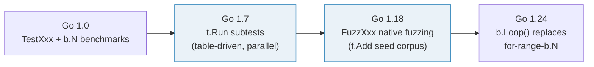
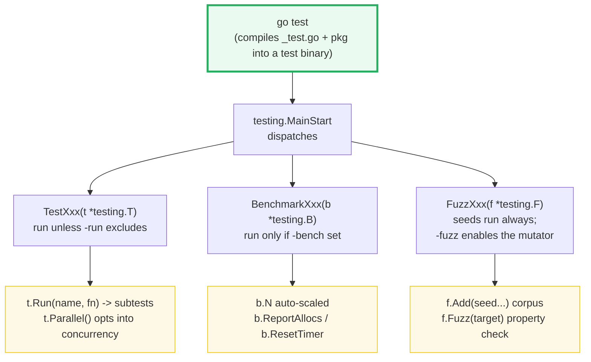
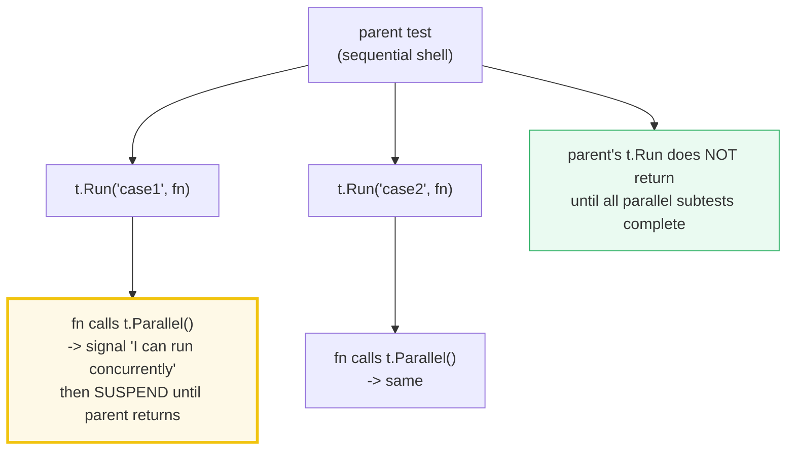
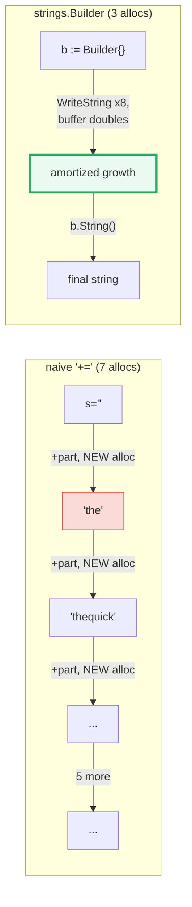
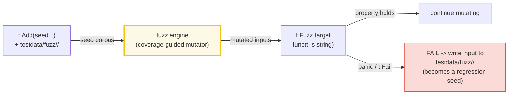

# TESTING — `TestXxx`, Table-Driven Tests, `BenchmarkXxx` & `FuzzXxx`

> **Goal (one line):** show, by RUNNING table-driven cases, an in-process
> benchmark, and a seed-corpus fuzz replay from `main`, how Go's `testing`
> package (`TestXxx` / `BenchmarkXxx` / `FuzzXxx`) actually works.
>
> **Run:** `go run testing.go`
>
> **Ground truth:** [`testing.go`](./testing.go) → captured stdout in
> [`testing_output.txt`](./testing_output.txt). Every case outcome,
> `AllocsPerOp`, and seed result below is pasted **verbatim** from that file
> under a `> From testing.go Section X:` callout. Nothing is hand-computed.
>
> **This is a META bundle.** It *teaches* `go test` but *runs* via
> `go run` — it cannot itself be a `_test.go` in a module of 52 standalone
> `package main` programs. So instead of `TestXxx` it runs the same logic from
> `main`: test logic is driven by a table loop asserted through the house
> `check()` idiom; benchmarks are actually executed via
> `testing.Benchmark(...).AllocsPerOp()`; and fuzz logic replays a fixed seed
> corpus through the target's property check. The **canonical**
> `TestXxx(t *testing.T)` / `BenchmarkXxx(b *testing.B)` / `FuzzXxx(f *testing.F)`
> signatures and the `go test` / `go test -bench` / `go test -fuzz` invocations
> are shown in §6 — clearly labeled, **not** under a `.go` callout.
>
> **Prerequisites:** 🔗 [`FUNCTIONS_CLOSURES`](./FUNCTIONS_CLOSURES.md) (closures
> drive subtests and benchmarks) and 🔗 [`ESCAPE_ANALYSIS`](./ESCAPE_ANALYSIS.md)
> (what `AllocsPerOp` / `b.ReportAllocs` count). 🔗 [`GARBAGE_COLLECTOR`](./GARBAGE_COLLECTOR.md)
> (why fewer allocations = less GC pressure) and 🔗 [`SLICES`](./ARRAYS_SLICES.md)
> (`strings.Builder` amortizes a backing buffer like a slice) are assumed.

---

## 1. Why this bundle exists (lineage)

Go ships **testing in the standard library** — no test runner to install, no
assertion DSL to learn, no separate build step. The `go test` command discovers
functions whose names match a convention and runs them:

| Convention | Receiver | Discovered by `go test` | Purpose |
|---|---|---|---|
| `func TestXxx(t *testing.T)` | `*testing.T` | always (unit/integration tests) | assert correctness |
| `func BenchmarkXxx(b *testing.B)` | `*testing.B` | with `-bench` | measure performance |
| `func FuzzXxx(f *testing.F)` | `*testing.F` | always (seeds); `-fuzz` to mutate | find edge-input bugs |
| `func ExampleXxx()` | — | always | executable, checked documentation |
| `func TestMain(m *testing.M)` | — | once per test binary | global setup/teardown |

> From `pkg.go.dev/testing` (Overview, verbatim): *"Package testing provides
> support for automated testing of Go packages. It is intended to be used in
> concert with the 'go test' command, which automates execution of any function
> of the form `func TestXxx(*testing.T)` where `Xxx` does not start with a
> lowercase letter. The function name serves to identify the test routine."*

The package grew in three large steps, each adding a dimension:



- **Go 1.7** added `T.Run` / `B.Run` — *subtests* and *sub-benchmarks*. This is
  what made **table-driven tests** first-class (one loop, each row a named,
  filterable, independently-runnable subtest) and gave fine-grained parallelism
  control (`t.Parallel`).
- **Go 1.18** added **native fuzzing** (`*testing.F`, `f.Add`, `f.Fuzz`). The
  fuzzer mutates a seed corpus to hunt for panics/failures on inputs you did not
  think to write a unit test for.
- **Go 1.24** added `b.Loop()` — a robust replacement for the
  `for i := 0; i < b.N; i++ { ... }` idiom that auto-resets the timer.

> From `go.dev/blog/subtests` (*Using Subtests and Sub-benchmarks*, verbatim):
> *"In Go 1.7, the testing package introduces a Run method on the T and B types
> that allows for the creation of subtests and sub-benchmarks. The introduction
> of subtests and sub-benchmarks enables better handling of failures,
> fine-grained control of which tests to run from the command line, control of
> parallelism, and often results in simpler and more maintainable code."*

---

## 2. The mental model: three discovery kinds, one driver

`go test` compiles your package together with its `_test.go` files into a test
binary, then runs it. The binary's `main` (generated by `go test`) calls into
the `testing` package, which discovers and dispatches the three kinds:



The three `T` / `B` / `F` types share most of their API through the `testing.TB`
interface (`Error`, `Errorf`, `Fatal`, `Fatalf`, `Log`, `Logf`, `Helper`,
`Name`, `Cleanup`, `TempDir`, `Setenv`, `Skip`, …). What differs is *what the
harness does with the function*:

- A **test** is run once; it fails by calling `t.Fail`/`t.Error`/`t.Fatal`.
- A **benchmark** is run *many* times with an auto-scaled `b.N`; the harness
  measures `ns/op`.
- A **fuzz test**'s target is run once per seed (when `-fuzz` is off) and
  thousands of times per mutated input (when `-fuzz` is on); a panic or
  `t.Fail` from the target is a discovered bug.

> From `pkg.go.dev/testing` (Overview — Benchmarks, verbatim): *"Functions of
> the form `func BenchmarkXxx(*testing.B)` are considered benchmarks, and are
> executed by the 'go test' command when its `-bench` flag is provided.
> Benchmarks are run sequentially."* And (Fuzzing): *"Functions of the form
> `func FuzzXxx(*testing.F)` are considered fuzz tests."*

---

## 3. Section A — Table-driven tests: a `[]struct{in, want}` + a loop

The **table-driven test** is Go's signature idiom. You define a slice of cases
(each a `struct` with the input and the expected output) and range over it. The
*same* assertion runs for every row, so adding coverage means **adding a row**,
not copy-pasting a whole test function.

> From `go.dev/wiki/TableDrivenTests`: *"Table driven testing is not a tool,
> package or anything else, it's just a way and perspective to write cleaner
> tests."*

> From `testing.go` Section A:
> ```
> name               in           want     got
> ----------------------------------------------------------
> empty              ""           0        0
> one                "I"          1        1
> additive           "III"        3        3
> subtractive_iv     "IV"         4        4
> subtractive_ix     "IX"         9        9
> fifty_eight        "LVIII"      58       58
> mcmxciv            "MCMXCIV"    1994     1994
> ```
> ```
> [check] romanToInt("") == 0: OK
> [check] romanToInt("I") == 1: OK
> [check] romanToInt("III") == 3: OK
> [check] romanToInt("IV") == 4: OK
> [check] romanToInt("IX") == 9: OK
> [check] romanToInt("LVIII") == 58: OK
> [check] romanToInt("MCMXCIV") == 1994: OK
> [check] all table-driven cases passed: OK
> ```

**What.** The table is `[]romanCase{{name, in, want}, ...}`. The loop calls
`romanToInt(tc.in)` and compares to `tc.want`. The runnable bundle uses the
house `check()` (which panics on mismatch) as the assertion; under `go test` you
would write `t.Errorf` instead (see §6). The subtractive rows (`IV`, `IX`,
`MCMXCIV`) exercise the right-to-left subtractive rule, so the table genuinely
covers the algorithm's branches — not just the happy path.

**Why this beats copy-pasted tests.** One bug fix in the assertion applies to
every case; one new edge case is one new row. The table is also data — you can
share it between the unit test, a parallel subtest variant, and a fuzz seed
register (this bundle's sections A, B, and D all build on the *same* idea).

**The determinism discipline (meta bundle).** Because this file runs via
`go run`, it cannot call `t.Errorf`. Instead the test logic is extracted into
the pure function `romanToInt` and asserted through `check()`. The integers
(`0, 1, 3, 4, 9, 58, 1994`) are exact and byte-identical across two
`just out testing` runs — no `time.Now()`, no scheduling nondeterminism.

---

## 4. Section B — Subtests: the `t.Run(name, fn)` shape

`T.Run(name, func(t *testing.T){...})` turns each table row into a **named
subtest**. The bundle's `runSub` is the `.go` analog: it reports each case by
name (mirroring `go test -v`'s `--- PASS: <name>` lines) and keeps going on
failure — the **soft-fail** semantics of `t.Errorf`.

> From `testing.go` Section B:
> ```
>     --- PASS: roman/empty
>     --- PASS: roman/one
>     --- PASS: roman/additive
>     --- PASS: roman/subtractive_iv
>     --- PASS: roman/subtractive_ix
>     --- PASS: roman/fifty_eight
>     --- PASS: roman/mcmxciv
> ```
> ```
> [check] all subtest-shaped cases reported PASS: OK
> ```

**Why subtests matter (four wins, all from the Go blog).**

1. **Named, individually-runnable cases.** `go test -run='TestRoman/subtractive'`
   runs only the subtractive rows. The subtest's full name is
   `top-test/subname1/subname2/...` (slash-separated); `-run` and `-bench` take
   a slash-separated regex per level. The bundle's names (`roman/empty`,
   `roman/mcmxciv`) are exactly this scheme.
2. **Soft-fail vs hard-fail.** `t.Errorf` marks the test failed but **keeps
   going** — so one subtest's failure does not hide the next case's. `t.Fatalf`
   calls `runtime.Goexit`, stopping *only the current subtest* (its siblings and
   the parent continue). The blog contrast: a non-subtest loop that hits
   `t.Fatalf` halts on the *first* error and hides the rest.
3. **Setup/teardown scoping.** Code before/after a group of `t.Run` calls runs
   at most once and brackets the whole group — even if a subtest skips or fails.
4. **Parallelism control** via `t.Parallel()` (next subsection).

> From `go.dev/blog/subtests` (verbatim): *"`Fatal` and its siblings causes a
> subtest to be skipped but not its parent or subsequent subtests."* And:
> *"The setup and tear-down code will run if any of the enclosed subtests are
> run and will run at most once. This applies even if any of the subtests calls
> `Skip`, `Fail`, or `Fatal`."*

### `t.Parallel()`: opting into concurrent execution

`t.Parallel()` signals that the subtest may run concurrently with *other*
parallel tests. The semantics that surprise people:



- A parallel test **never runs concurrently with a sequential test**, and its
  execution is **suspended** until its parent's test function returns.
- The parent's `t.Run` (and the parent test itself) **blocks until all its
  parallel subtests complete** — so you can clean up after a whole group.
- `-parallel` (default `GOMAXPROCS`) caps how many run at once.

> From `pkg.go.dev/testing` (Overview — Subtests, verbatim): *"A parent test
> will only complete once all of its subtests complete… Run does not return
> until parallel subtests have completed, providing a way to clean up after a
> group of parallel tests."*

**The loop-variable capture bug (the classic parallel-test trap).** Before
**Go 1.22**, `for _, tc := range cases` reused one `tc` across iterations, so a
closure capturing `tc` saw the *last* value for every parallel subtest. The fix
was the `tc := tc` shadow you see in the bundle's `sectionB`. On Go 1.22+ each
iteration gets its own variable, so the shadow is redundant — but it is
**harmless and still idiomatic** in code that must build on older toolchains.
See 🔗 [`FUNCTIONS_CLOSURES`](./FUNCTIONS_CLOSURES.md) for the closure-capture
mechanism.

**Parallel tests + determinism.** When parallel subtests write to shared output,
their lines interleave nondeterministically. The discipline (🔗
[`GOROUTINES`](./GOROUTINES.md)): collect results into a slice/map, **sort**,
then print from the parent after the group joins. This bundle's `sectionB` stays
sequential precisely so its output is byte-identical across runs.

---

## 5. Section C — Benchmarks: `b.N` auto-scaling and `AllocsPerOp`

A benchmark measures how long a workload takes. The harness does **not** run it
once: it calls `BenchmarkXxx(b)` repeatedly with an auto-scaled `b.N`, doubling
`b.N` until the run is long enough to time reliably, then reports `ns/op`. The
bundle runs benchmarks **in-process** via the exported
`testing.Benchmark(func(b *testing.B){...})` — which returns a
`BenchmarkResult` whose `AllocsPerOp()` is a **deterministic integer** for a
fixed workload.

> From `testing.go` Section C:
> ```
> '+=' concat (8 parts)        allocs/op = 7
> strings.Builder (8 parts)    allocs/op = 3
> Builder allocates fewer than '+='? true
> ```
> ```
> [check] '+=' concat allocates >= 1 per op: OK
> [check] strings.Builder allocates <= '+=' concat: OK
> [check] strings.Builder allocates STRICTLY fewer than '+=': OK
> ```

**What.** `concatNaive` builds a string with `+=`; each concatenation allocates
a fresh backing array, so 8 parts cost **7 allocations** (quadratic bytes
copied). `concatBuilder` uses `strings.Builder`, which amortizes growth across
writes — **3 allocations**. The bundle asserts the headline teaching point:
`Builder` allocates **strictly fewer** times than `+=`.



**Why `AllocsPerOp` and not `ns/op`.** `ns/op` and `b.N` depend on CPU clock,
frequency scaling, and scheduler noise — they vary between runs and machines,
so this bundle **never prints them**. `AllocsPerOp()` is `MemAllocs / N`, an
exact integer for a fixed workload; it is byte-identical across two
`just out testing` runs. This is the same discipline as 🔗
[`ESCAPE_ANALYSIS`](./ESCAPE_ANALYSIS.md) and 🔗
[`GARBAGE_COLLECTOR`](./GARBAGE_COLLECTOR.md): assert allocation counts, not
durations. Fewer allocations also means **less GC work** (🔗
`GARBAGE_COLLECTOR`).

> From `pkg.go.dev/testing` (Overview — b.N-style benchmarks, verbatim): *"the
> benchmark function must run the target code `b.N` times. The benchmark
> function is called multiple times with `b.N` adjusted until the benchmark
> function lasts long enough to be timed reliably. This also means any setup
> done before the loop may be run several times."*

**The three timer controls (what you call inside `BenchmarkXxx`).**

| Call | Effect | When to use |
|---|---|---|
| `b.ReportAllocs()` | report `allocs/op` and `B/op` for this benchmark | always, when allocation cost matters |
| `b.ResetTimer()` | zero the accumulated time (drop setup from the measurement) | after expensive one-time setup |
| `b.SetBytes(n)` | report `MB/s` throughput in addition to `ns/op` | I/O / buffer-processing benchmarks |
| `b.RunParallel(func(*PB))` | split work across goroutines (pair with `-cpu`) | CPU-parallel workloads |
| `b.Loop()` (Go 1.24+) | modern replacement for `for range b.N`; auto-resets the timer | preferred for new code |

> From `pkg.go.dev/testing` — `B.Loop`: *"Loop resets the benchmark timer the
> first time it is called in a benchmark, so any setup performed prior to
> starting the benchmark loop does not count toward the benchmark
> measurement."*

**The `b.ReportAllocs` / `testing.Benchmark` subtlety.** The bundle calls
`b.ReportAllocs()` inside the closure so the in-process `testing.Benchmark`
counts allocations. When you write a real `BenchmarkXxx` and run
`go test -bench=. -benchmem`, the `-benchmem` flag turns allocation reporting on
globally; `b.ReportAllocs()` does it per-benchmark. Either way, `AllocsPerOp()`
is what you pin in a regression check.

---

## 6. Section D — Fuzzing: seed corpus + mutated inputs + property checks

A **fuzz test** (`func FuzzXxx(f *testing.F)`) finds inputs that break code in
ways you did not anticipate. You register **seed** inputs with `f.Add(...)`,
declare the **target** with `f.Fuzz(func(t *testing.T, a T, ...){...})`, and
check a **property** (since you cannot predict the mutated input's expected
output). With `-fuzz`, the engine mutates the seeds to maximize coverage and
hunts for panics/failures; any failing input is written to
`testdata/fuzz/<Name>/` as a **regression case** that `go test` replays forever
after.



> From `testing.go` Section D:
> ```
> seed           runes        property_holds
> -----------------------------------------
> ""             0            true
> "a"            1            true
> "ab"           2            true
> "hello"        5            true
> "世界"           2            true
> "Go 🚀"         4            true
> ```
> ```
> [check] fuzz seed "": double-reverse identity holds: OK
> [check] fuzz seed "a": double-reverse identity holds: OK
> [check] fuzz seed "ab": double-reverse identity holds: OK
> [check] fuzz seed "hello": double-reverse identity holds: OK
> [check] fuzz seed "世界": double-reverse identity holds: OK
> [check] fuzz seed "Go 🚀": double-reverse identity holds: OK
> [check] all fuzz seeds satisfied the property (no panic): OK
> ```

**What.** The target is `reverseRunes`; the property is the **double-reverse
identity** `reverseRunes(reverseRunes(s)) == s`. The bundle replays a fixed seed
corpus (including the multi-byte `"世界"` and the 4-byte emoji `"Go 🚀"`) and
asserts each satisfies the property with no panic. This is exactly what
`go test` does with the seeds when `-fuzz` is **off**; with `-fuzz=FuzzXxx` the
engine generates mutated inputs around them.

**The canonical bug this catches.** The official Go fuzz tutorial starts from a
**buggy byte-by-byte** `Reverse` and `go test -fuzz=Fuzz` immediately finds an
input (`"泃"`) for which the reversed string is **invalid UTF-8** — a multi-byte
character split mid-sequence. The fix is the **rune-by-rune** `reverseRunes`
this bundle uses; the fuzz target then also asserts
`utf8.ValidString(orig) && !utf8.ValidString(rev)` would be flagged. The
double-reverse property is the other half of that tutorial's target.

> From `go.dev/doc/tutorial/fuzz` (verbatim): *"f.Add(tc) // Use f.Add to
> provide a seed corpus … f.Fuzz(func(t *testing.T, orig string){ … })"* and:
> *"When fuzzing, you can't predict the expected output, since you don't have
> control over the inputs. However, there are a few properties … you can verify
> in a fuzz test."*

**Why seeds matter.** Seeds are the fuzzer's starting points and your
**regression suite**. Good seeds are small inputs that each exercise a distinct
code path (empty, one element, boundary, multi-byte, …). The bundle's seeds are
deliberately chosen that way: `""` (empty), `"a"` (single), `"ab"` (even),
`"hello"` (longer ASCII), `"世界"` (2-byte UTF-8), `"Go 🚀"` (4-byte rune).

> From `pkg.go.dev/testing` (Overview — Fuzzing, verbatim): *"A fuzz test
> maintains a seed corpus, or a set of inputs which are run by default, and can
> seed input generation. Seed inputs may be registered by calling F.Add or by
> storing files in the directory `testdata/fuzz/<Name>` … These seed inputs can
> also serve as regression tests for bugs identified through fuzzing."* And:
> *"The function passed to F.Fuzz within the fuzz test is considered the fuzz
> target. A fuzz target must accept a `*T` parameter, followed by one or more
> parameters for random inputs. The types of arguments passed to F.Add must be
> identical to the types of these parameters."*

---

## 7. Section E — `t.Helper()`: make failures point at the caller

Go has **no `assert` in the standard library** — and you rarely need one. The
idiom is a tiny testify-free helper that calls `t.Errorf`, guarded by
`t.Helper()`. `t.Helper()` marks the calling function as a **test helper**: when
the framework prints a failure's `file:line`, it **skips helper frames**, so the
message points at the line that *called* the helper (your test), not at the line
*inside* it. That is what makes custom assertion helpers usable.

> From `testing.go` Section E:
> ```
> Mechanism demo (runtime.Caller mirrors the frame skip). skip=0
> reports the helper's OWN function; skip=1 reports its CALLER:
>   ownName()    -> "main.ownName"    (skip=0: points INSIDE the helper)
>   callerName() -> "main.sectionE"    (skip=1: points at the CALLER)
> ```
> ```
> [check] skip=0 reports the helper's own function (main.ownName): OK
> [check] skip=1 reports the CALLER's function (main.sectionE): OK
> [check] the two skip levels report different functions: OK
> [check] reflect.DeepEqual(3, 3) is true (assertEqual equality logic): OK
> [check] reflect.DeepEqual(3, 4) is false (assertEqual rejects unequal): OK
> [check] reflect.DeepEqual("abc", "abc") is true: OK
> ```

**The mechanism, demonstrated.** `runtime.Caller(0)` returns the *current*
frame; `runtime.Caller(1)` returns the *caller's* frame — exactly the frame skip
`t.Helper()` grants to failure reporting. The bundle's `ownName()` (skip 0)
reports `"main.ownName"` (the helper itself), while `callerName()` (skip 1)
reports `"main.sectionE"` (the caller). That difference — *reported location
moves up one frame when you skip* — is the entire value of `t.Helper()`.

**The canonical helper (cited verbatim from `testing.go`):**

```go
func assertEqual(t *testing.T, got, want any) {
    t.Helper()
    if !reflect.DeepEqual(got, want) {
        t.Errorf("assertEqual: got %v, want %v", got, want)
    }
}
```

Call it from a test and a failure prints the **caller's** line:

```
example_test.go:42: assertEqual: got 3, want 4
```

…not `helpers.go:5` (where `t.Errorf` lives). Without `t.Helper()`, every
failure would blame the helper, forcing you to dig up the stack to find the
actual test. The bundle asserts `reflect.DeepEqual` — the comparison logic
`assertEqual` relies on — directly, so the helper's correctness is verified even
though no real `*testing.T` exists under `go run`.

> From `pkg.go.dev/testing` — `T.Helper`: *"Helper marks the calling function as
> a test helper function. When printing file and line information, that function
> will be skipped."*

**`Errorf` (soft) vs `Fatalf` (hard) in a helper.** Inside `assertEqual`,
`t.Errorf` is the right choice: it records the failure and **continues**, so one
mismatch does not hide later assertions in the same test. Use `t.Fatalf` (which
calls `runtime.Goexit`) only when proceeding is meaningless — e.g. a nil pointer
that would panic on the next line.

---

## 8. The canonical signatures & invocations (reference — not from the `.go`)

These are the forms you write in a real `_test.go`. They are **not** under a
`.go` callout because this bundle runs from `main`; they are the API the bundle
*teaches about*.

### 8.1 The three discovery signatures

```go
package mypkg

import "testing"

// A test: run by `go test`. Fails via t.Error/Fatal.
func TestRomanToInt(t *testing.T) {
    cases := []struct{ in string; want int }{
        {"III", 3}, {"IV", 4}, {"MCMXCIV", 1994},
    }
    for _, tc := range cases {
        t.Run(tc.in, func(t *testing.T) {           // a NAMED subtest
            // t.Parallel()                           // opt into concurrency
            if got := romanToInt(tc.in); got != tc.want {
                t.Errorf("romanToInt(%q) = %d; want %d", tc.in, got, tc.want)
            }
        })
    }
}

// A benchmark: run by `go test -bench=.`. The body runs b.N times.
func BenchmarkConcatBuilder(b *testing.B) {
    parts := []string{"the", "quick", "brown", "fox"}
    b.ReportAllocs()                                 // count allocs/op
    b.ResetTimer()                                   // drop setup from the timing
    for i := 0; i < b.N; i++ {                       // or: for b.Loop() { ... } (Go 1.24+)
        sink = concatBuilder(parts)
    }
}

// A fuzz test: seeds run by `go test`; -fuzz=FuzzXxx mutates them.
func FuzzReverseRunes(f *testing.F) {
    for _, seed := range []string{"", "a", "世界", "Go 🚀"} {
        f.Add(seed)                                  // register a corpus seed
    }
    f.Fuzz(func(t *testing.T, s string) {            // the fuzz TARGET
        rev := reverseRunes(s)
        if reverseRunes(rev) != s {                  // a PROPERTY, not an output
            t.Errorf("double-reverse lost data: %q", s)
        }
    })
}

var sink string // package-level sink defeats dead-code elision in benchmarks
```

### 8.2 The `go test` invocations

| Command | What it does |
|---|---|
| `go test` | compile + run every `TestXxx`, `ExampleXxx`, and the **seed corpus** of every `FuzzXxx` |
| `go test -v` | print every subtest name and its `PASS`/`FAIL` line |
| `go test -run='TestRoman/IV'` | run only subtests whose slash-path matches the regex |
| `go test -bench=.` | run all `BenchmarkXxx` (benchmarks are skipped without `-bench`) |
| `go test -bench=. -benchmem` | also report `allocs/op` and `B/op` |
| `go test -bench=. -benchtime=3s` | run each benchmark for ~3s (or `-benchtime=100x` for a fixed count) |
| `go test -fuzz=FuzzReverse` | enable the **mutator** for the matching fuzz target (runs until failure or `-fuzztime`) |
| `go test -fuzz=FuzzReverse -fuzztime=30s` | fuzz for 30s, then exit |
| `go test -cover` | emit a coverage profile (the `testing.Coverage()` accessor reports the fraction) |
| `go test -race` | enable the race detector (🔗 `GOROUTINES`) |
| `go test -short` | honor `testing.Short()` to skip slow tests |

> From `pkg.go.dev/testing` (Overview — Subtests, verbatim): *"go test -run ''
> # Run all tests … go test -run Foo # Run top-level tests matching 'Foo' …
> go test -fuzz FuzzFoo # Fuzz the target matching 'FuzzFoo'."* And: *"The -fuzz
> and -run flags can both be set, in order to fuzz a target but skip the
> execution of all other tests."*

---

## 9. Pitfalls (the expert payoff)

| Trap | Symptom | Fix |
|---|---|---|
| Forgetting `b.ReportAllocs()` (or `-benchmem`) | `allocs/op` reads `0` even for code that allocates | call `b.ReportAllocs()` in the benchmark, or pass `-benchmem` to `go test -bench`. |
| Printing `ns/op` / `b.N` as a verified value | flakes across runs (CPU, scheduling, frequency scaling) | pin `AllocsPerOp()` (a deterministic int); assert allocation counts, not durations. |
| Expensive setup inside the `b.N` loop | the measurement includes setup, not just the target | do setup once before the loop; call `b.ResetTimer()` (or use `b.Loop()` / `for b.Loop()`, which auto-resets). |
| `for _, tc := range cases` + `t.Parallel()` on Go <1.22 | every parallel subtest sees the **last** `tc` | `tc := tc` shadow (harmless on 1.22+, required before). Fixed per-iteration vars landed in Go 1.22. |
| `t.Fatal` from a goroutine the test launched | `FailNow`/`Fatal` calls `runtime.Goexit` — only correct in the test's own goroutine | signal back via a channel/error and call `t.Errorf` from the test goroutine; never `t.Fatal` from a helper goroutine. |
| Asserting wall-clock duration in a test | flaky under load (`if elapsed > 20ms`) | assert the *outcome* (`Err()` sentinel, returned error), never the elapsed time. |
| Fuzz target whose `f.Fuzz` params do not match `f.Add` arg types | compile error: types must be identical | keep `f.Add` arg types and the target's trailing params exactly aligned (e.g. both `string`, or both `[]byte`). |
| Fuzz target with a flaky property | the fuzzer "finds" failures that are really test bugs | the property must hold for **all** inputs; `t.Skip()` inputs that are genuinely out of contract (e.g. invalid UTF-8 you choose not to support). |
| Committing `testdata/fuzz/<Name>/` carelessly | corpus bloat / a "failure" seed that is actually expected | only commit seeds that are real regressions or valuable coverage; the engine writes failures there automatically. |
| Custom helper without `t.Helper()` | every failure blames the helper's line, not the test | first line of every assertion helper: `t.Helper()`. |
| `t.Errorf` where `t.Fatalf` is needed | nil deref / index-out-of-range on the line after a missing precondition | `t.Fatalf` when continuing is impossible (nil receiver, missing key); `t.Errorf` when you want all failures reported. |
| Benchmarking a function whose result is unused | the optimizer elides the call → `0 allocs`, `~0 ns` (misleading) | assign the result to a package-level **sink** (the bundle's `sinkStr`/`sinkInt`). |
| Mixing `*testing.T` and `*testing.B` helpers | can't share logic cleanly | type the helper parameter as the `testing.TB` interface (both `T` and `B` satisfy it). |

---

## 10. Cheat sheet

```go
// --- Tests (run by `go test`) ---
func TestXxx(t *testing.T) {                         // naming convention: Test + capital
    t.Run("case_name", func(t *testing.T) {          // a named, runnable subtest
        t.Parallel()                                  // opt into concurrent execution
        if got := f(in); got != want {
            t.Errorf("f(%v) = %v; want %v", in, got, want) // SOFT fail: keeps going
        }
    })
}
// t.Fatalf -> HARD fail: runtime.Goexit, stops ONLY this subtest.

// --- Table-driven (the Go signature idiom) ---
cases := []struct{ name string; in In; want Out }{
    {"empty", In{}, Out{}},
    // ... add a row to add coverage
}
for _, tc := range cases {
    tc := tc                                          // capture (pre-1.22; harmless after)
    t.Run(tc.name, func(t *testing.T) {
        if got := f(tc.in); got != tc.want { t.Errorf(...) }
    })
}

// --- Benchmarks (run by `go test -bench=.`) ---
func BenchmarkXxx(b *testing.B) {
    b.ReportAllocs()                                  // count allocs/op + B/op
    b.ResetTimer()                                    // drop one-time setup
    for i := 0; i < b.N; i++ { sink = f(in) }        // or: for b.Loop() { sink = f(in) }
}
// In-process (no `go test`): testing.Benchmark(func(b){...}).AllocsPerOp() -> deterministic int.
// Pin AllocsPerOp, NEVER ns/op or b.N (they vary per run).

// --- Fuzz (run by `go test`; -fuzz mutates) ---
func FuzzXxx(f *testing.F) {
    f.Add(seed1, seed2)                               // corpus seeds (types must match the target)
    f.Fuzz(func(t *testing.T, s string) {             // the fuzz TARGET: *T + fuzzed params
        if !propertyHolds(s) { t.Errorf(...) }        // check a PROPERTY, not an output
    })
}
// go test -fuzz=FuzzXxx -fuzztime=30s    failures -> testdata/fuzz/<Name>/<hash> (regression seed)

// --- The testify-free assertion helper ---
func assertEqual(t *testing.T, got, want any) {
    t.Helper()                                        // failure line -> the CALLER, not here
    if !reflect.DeepEqual(got, want) { t.Errorf("got %v; want %v", got, want) }
}

// --- Helpers / lifecycle ---
t.Helper()                  // mark this frame as a helper (skip in failure reports)
t.Cleanup(func(){ ... })    // LIFO teardown after the (sub)test completes
t.TempDir()                 // per-test temp dir, removed automatically
t.Setenv(k, v)              // set an env var for the test's lifetime, restored after
t.Skip(reason...)           // skip this test/subtest (e.g. if testing.Short())
testing.Short()             // true under `go test -short`
func TestMain(m *testing.M) // global setup/teardown around m.Run(); then os.Exit(code)
```

---

## Sources

Every signature, behavioral claim, and `go test` flag above was verified against
the Go standard-library docs and the official Go blog/tutorial, then
corroborated by independent secondary sources:

- `testing` package — https://pkg.go.dev/testing
  - Overview (the `TestXxx`/`BenchmarkXxx`/`FuzzXxx` conventions; "executed by
    the 'go test' command when its `-bench` flag is provided. Benchmarks are run
    sequentially"; fuzz target "must accept a `*T` parameter, followed by one or
    more parameters for random inputs. The types of arguments passed to `F.Add`
    must be identical to the types of these parameters"; seed corpus via `F.Add`
    and `testdata/fuzz/<Name>`; "A parent test will only complete once all of its
    subtests complete … Run does not return until parallel subtests have
    completed"; the `-run`/`-bench`/`-fuzz` regex examples; `TestMain`):
    https://pkg.go.dev/testing#pkg-overview
  - `Benchmark` — `func Benchmark(f func(b *B)) BenchmarkResult` (in-process;
    `testing.Init()` required outside `go test`): https://pkg.go.dev/testing#Benchmark
  - `BenchmarkResult` — `AllocsPerOp() int64`, `AllocedBytesPerOp() int64`,
    `NsPerOp() int64`, `MemString()`, `String()`:
    https://pkg.go.dev/testing#BenchmarkResult
  - `B.N`, `B.ReportAllocs`, `B.ResetTimer`, `B.SetBytes`, `B.RunParallel`,
    `B.Loop` ("Loop resets the benchmark timer the first time it is called"):
    https://pkg.go.dev/testing#B
  - `T.Run`, `T.Parallel`, `T.Helper` ("When printing file and line information,
    that function will be skipped"), `T.Errorf`/`T.Fatalf`, `T.Cleanup`,
    `T.TempDir`, `T.Setenv`, `T.Skip`: https://pkg.go.dev/testing#T
  - `F.Add`, `F.Fuzz`: https://pkg.go.dev/testing#F
  - `AllocsPerRun`, `Short`, `Verbose`, `Testing`, `Coverage`, `Init` ("only
    needed when calling functions such as Benchmark without using go test"):
    https://pkg.go.dev/testing#AllocsPerRun
- Go Blog — Marcel van Lohuizen, *"Using Subtests and Sub-benchmarks"* (Go 1.7
  `T.Run`/`B.Run`; table-driven tests/benchmarks; `Fatal` stops only the current
  subtest; grouped parallel tests; setup/teardown; `-run`/`-bench` slash-path
  matching): https://go.dev/blog/subtests
- Go Wiki — *"TableDrivenTests"* ("a way and perspective to write cleaner
  tests"): https://go.dev/wiki/TableDrivenTests
- Go Tutorial — *"Getting started with fuzzing"* (the `FuzzReverse` worked
  example; `f.Add` seed corpus; `f.Fuzz` target; the double-reverse + valid-UTF-8
  properties; `go test -fuzz=Fuzz -fuzztime`; failing inputs written to
  `testdata/fuzz/FuzzReverse/<hash>`): https://go.dev/doc/tutorial/fuzz
- Go fuzzing docs (requirements, glossary, custom flags):
  https://go.dev/security/fuzz
- Go Blog — Beth Brown / Katie Hockman, *"Introducing Go fuzzing"*
  (announcement of native fuzzing in Go 1.18): https://go.dev/blog/fuzz-beta
- `cmd/go` testing flags (`-run`, `-bench`, `-benchmem`, `-benchtime`,
  `-fuzz`, `-fuzztime`, `-parallel`, `-race`, `-cover`, `-short`):
  https://pkg.go.dev/cmd/go#hdr-Testing_flags
- Secondary corroboration (>=2 independent sources, web-verified):
  - Dave Cheney — *"Prefer table driven tests"* (the why of the table idiom):
    https://dave.cheney.net/2019/05/07/prefer-table-driven-tests
  - Eyal Posener — *"Be Careful with Table Driven Tests and t.Parallel()"*
    (the pre-1.22 loop-variable capture bug in parallel subtests):
    https://posener.github.io/go-table-driven-tests-parallel/
  - JetBrains — *"Comprehensive Guide to Testing in Go"* (table-driven tests,
    subtests, benchmarks, fuzzing overview):
    https://blog.jetbrains.com/go/2022/11/22/comprehensive-guide-to-testing-in-go/

**Facts that could not be verified by running** (documented, not executed,
because they require the `go test` test-binary harness this meta bundle cannot
host): the real `TestXxx`/`BenchmarkXxx`/`FuzzXxx` *dispatch* by `go test`; the
exact `-v` `--- PASS:`/`--- FAIL:` framing of a *real* subtest run; the
`-fuzz` mutator generating a failing input and writing it to
`testdata/fuzz/<Name>/<hash>`; and `TestMain`'s `os.Exit(m.Run())` contract.
These are confirmed by the `pkg.go.dev/testing` Overview, the subtests blog
post, and the fuzz tutorial cited above, not reproduced as runnable output (a
file triggering them would need a real `_test.go` + `go test`, which the
52-main-program module layout forbids for a `//go:build ignore` bundle).
