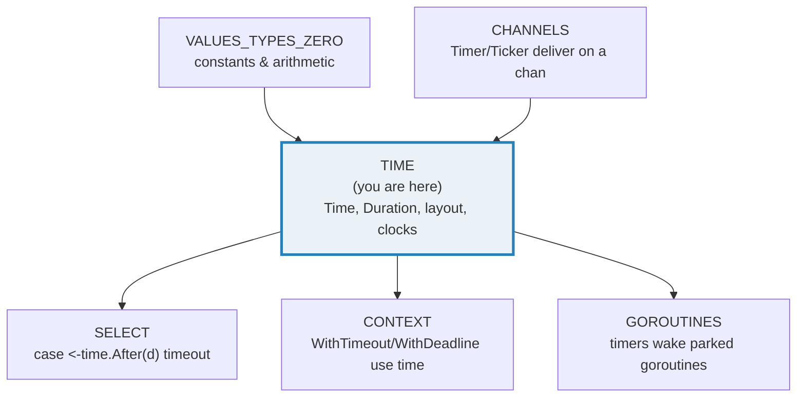
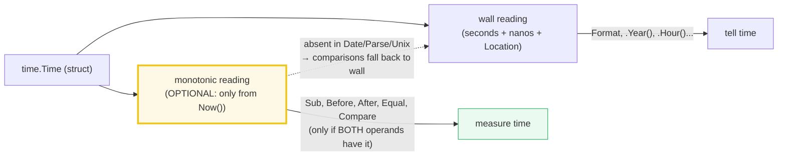
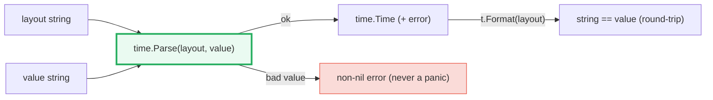
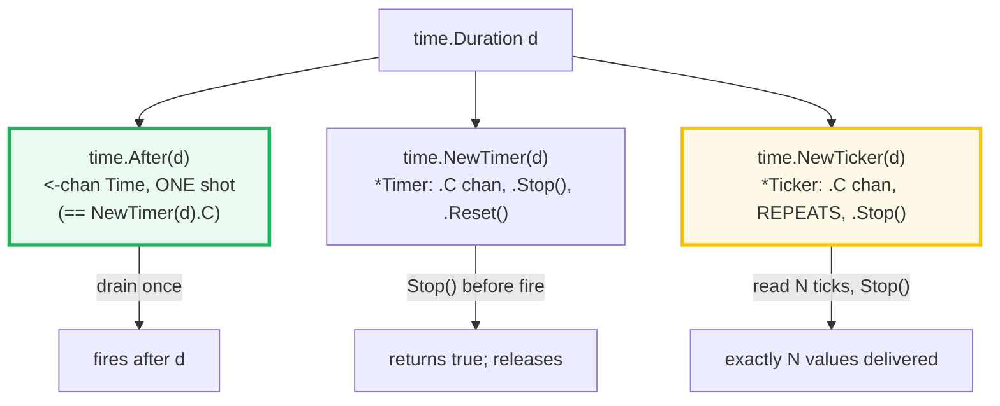

# TIME — `time.Time`, `time.Duration`, the Layout & Wall/Monotonic Clocks

> **Goal (one line):** show, by printing every value, how `time.Time`, the
> `time.Duration` int64-nanosecond count, the canonical layout reference date,
> and the wall-clock-vs-monotonic-clock split actually behave.
>
> **Run:** `go run time.go`
>
> **Ground truth:** [`time.go`](./time.go) → captured stdout in
> [`time_output.txt`](./time_output.txt). Every number/formatted string/Duration
> below is pasted **verbatim** from that file under a
> `> From time.go Section X:` callout. Nothing is hand-computed.
>
> **Prerequisites:** 🔗 [`VALUES_TYPES_ZERO`](./VALUES_TYPES_ZERO.md) (constants
> & arithmetic; `Duration` constants compose like any int) and
> 🔗 [`CHANNELS`](./CHANNELS.md) (`Timer`/`Ticker`/`After` deliver on a channel).
> 🔗 [`GOROUTINES`](./GOROUTINES.md) (timers drive goroutine wakeups) and
> 🔗 [`SELECT`](./SELECT.md) (`case <-time.After(d)` in a timeout select) are
> assumed.

---

## 1. Why this bundle exists (lineage)

Before Go 1.9, `time.Now()` returned only a **wall-clock** reading. That sounds
innocent until the OS resynchronizes the clock (NTP step, manual change, daylight
saving) *between* two `Now()` calls: `t.Sub(start)` could go **negative**, or
report an elapsed time "not grounded in reality." Code that timed an operation
could measure a 10-second event as −34 seconds.

> From `go.googlesource.com/proposal/design/12914-monotonic` (Russ Cox, Jan 2017,
> verbatim): *"Comparison and subtraction of times observed by `time.Now` can
> return incorrect results if the system wall clock is reset between the two
> observations. We propose to extend the `time.Time` representation to hold an
> additional monotonic clock reading for use in those calculations. Among other
> benefits, this should make it impossible for a basic elapsed time measurement
> using `time.Now` and `time.Since` to report a negative duration or other result
> not grounded in reality."*

Go 1.9 (August 2017) shipped that fix. The elegant decision was **not** to split
the API into `WallTime`/`MonotonicTime` types. Instead, a single `time.Time` now
**optionally** carries a second, monotonic reading, and the package decides
*which* reading to use per operation: **telling time** (Format, Date fields)
uses the wall clock; **measuring time** (comparisons, `Sub`) uses the monotonic
clock when both operands have one. Existing `Now()`/`Since()`/`Sub()` code became
correct with zero changes.



The headline idea: **a `Time` is wall + (optional) monotonic; a `Duration` is an
int64 of nanoseconds; and Format/Parse are driven by ONE canonical reference
date.** This bundle pins all three.

---

## 2. The mental model: a `Time` = wall + (optional) monotonic



> From `pkg.go.dev/time` (Monotonic Clocks section, verbatim): *"Operating
> systems provide both a 'wall clock,' which is subject to changes for clock
> synchronization, and a 'monotonic clock,' which is not. The general rule is
> that the wall clock is for telling time and the monotonic clock is for
> measuring time. Rather than split the API, in this package the Time returned by
> time.Now contains both a wall clock reading and a monotonic clock reading; later
> time-telling operations use the wall clock reading, but later time-measuring
> operations, specifically comparisons and subtractions, use the monotonic clock
> reading."*

The three rules that follow from this (all asserted deterministically in Section
E, without ever printing a `Now()` value):

1. **`Now()` has both readings.** `Date`/`Parse`/`Unix` have **only** the wall
   reading — the docs call this out: *"the constructors time.Date, time.Parse,
   time.ParseInLocation, and time.Unix … always create times with no monotonic
   clock reading."*
2. **Sub/Before/After/Equal/Compare use the monotonic reading when *both* operands
   have one; otherwise they fall back to the wall clock.**
3. **You cannot observe the monotonic reading directly** — `Format` has no token
   for it, and marshalling omits it. The only way to detect its presence is the
   `==` operator (see Section E): `==` compares the monotonic reading too, so
   `Now()` is `!=` to its `Round(0)`-stripped copy while `.Equal()` still holds.

---

## 3. Section A — `Duration`: an int64 nanosecond count

> From `time.go` Section A:
> ```
> type: time.Duration = time.Duration (underlying int64)
> time.Second       = 1000000000 ns   (1e9 nanoseconds)
> time.Millisecond  = 1000000 ns
> time.Microsecond  = 1000 ns
> time.Nanosecond   = 1 ns
> time.Minute       = 60000000000 ns
> time.Hour         = 3600000000000 ns
> identity chain: 1*time.Hour == 60*time.Minute == 3600*time.Second == 3.6e12 ns
> d := 2*time.Hour + 30*time.Minute + 500*time.Millisecond
>   d.String()      = "2h30m0.5s"
>   d.Hours()       = 2.500138888888889   (float64)
>   d.Minutes()     = 150.00833333333333
>   d.Seconds()     = 9000.5
>   d.Milliseconds()= 9000500   (int64)
> start=Date(2024,6,15,12,0,0,0,UTC); end=start.Add(d); end.Sub(start) = 2h30m0.5s
> ```
> ```
> [check] Duration is int64-based: OK
> [check] time.Second == 1e9 nanoseconds: OK
> [check] 1*time.Hour == 60*time.Minute: OK
> [check] 60*time.Minute == 3600*time.Second: OK
> [check] 3600*time.Second == 3_600_000*time.Millisecond: OK
> [check] end.Sub(start) equals the added duration: OK
> [check] d.String() == "2h30m0.5s": OK
> ```

**What.** `time.Duration` is a **defined type** with underlying type `int64`,
storing a count of **nanoseconds**. The common durations are `const` blocks of
that type:

```go
const (
	Nanosecond  Duration = 1
	Microsecond          = 1000 * Nanosecond
	Millisecond          = 1000 * Microsecond
	Second               = 1000 * Millisecond   // == 1_000_000_000 ns
	Minute               = 60 * Second
	Hour                 = 60 * Minute
)
```

> From `pkg.go.dev/time` — `Duration`: *"A Duration represents the elapsed time
> between two instants as an int64 nanosecond count. The representation limits
> the largest representable duration to approximately 290 years."* And the const
> block: *"Common durations. There is no definition for units of Day or larger to
> avoid confusion across daylight savings time zone transitions."*

**Why int64, and why no `Day`.** Because `Duration` is plain integer nanoseconds,
arithmetic is **exact** (no floating point) and `1*time.Hour == 60*time.Minute`
is a compile-time constant identity — that is what the first three checks pin.
There is deliberately **no `time.Day`**: a "day" is not a fixed number of
seconds (DST transitions make a day 23 or 25 hours), so defining one would
silently mis-handle calendar math. For calendar arithmetic use `t.AddDate(y, m,
d)` (which strips the monotonic reading — see pitfalls).

**The accessors trade precision for convenience.** `Hours()`/`Minutes()`/
`Seconds()` return **`float64`** (so `9000.5s` is exact but large durations lose
precision); `Milliseconds()`/`Microseconds()`/`Nanoseconds()` return **`int64`**
(exact, but clip at ~290 years). `String()` formats readably (`"2h30m0.5s"`),
omitting leading zero units and using `ms`/`µs`/`ns` for sub-second durations.

**`Time` arithmetic.** `t.Add(d) → Time` and `t.Sub(u) → Duration` are inverses:
on fixed times, `end.Sub(start)` equals exactly the `d` you added (the last two
checks). Section E explains *which* clock those operations read on.

---

## 4. Section B — `Format` & the canonical reference layout

> From `time.go` Section B:
> ```
> ref := time.Date(2006, 1, 2, 15, 4, 5, 0, time.UTC)
>   ref.Format("2006-01-02")         = "2006-01-02"   (DateOnly)
>   ref.Format("15:04:05")           = "15:04:05"   (TimeOnly)
>   ref.Format("2006-01-02 15:04:05") = "2006-01-02 15:04:05"   (DateTime)
>   ref.Format(time.RFC3339)         = "2006-01-02T15:04:05Z"
>   ref.Format(time.UnixDate)        = "Mon Jan  2 15:04:05 UTC 2006"
> token map (the reference date IS the format):
>   "2006"->year "06"->year(2)   "01"->month "1"->month
>   "02"->day   "_2"->day(sp)    "15"->hour(24h) "03"->hour(12h)
>   "04"->minute "05"->second    "PM"->AM/PM   "-0700"->zone offset
> ```
> ```
> [check] Format DateOnly exact: OK
> [check] Format TimeOnly exact: OK
> [check] Format DateTime exact: OK
> [check] ref.Format(time.UnixDate) == "Mon Jan  2 15:04:05 UTC 2006" (_2 space-pads day): OK
> [check] predefined DateOnly == "2006-01-02": OK
> ```

**What.** `t.Format(layout)` renders `t` according to `layout`. The trick that
makes Go's time formatting unlike any other language: **the layout string is the
reference date itself, written the way you want the output to look.** The
reference instant is

```
Mon Jan 2 15:04:05 MST 2006
```

and each component of that instant is a *fixed numeric token*: `1`=month, `2`=day,
`3`(=`15`)=hour, `4`=minute, `5`=second, `6`(=`2006`)=year, `7`(=`-07`) =zone
offset. The mnemonic is literally **1 2 3 4 5 6 7**. So `"2006-01-02"` means
"year-month-day" because `2006`/`01`/`02` are the reference's year/month/day
values.

> From `pkg.go.dev/time` (Constants, verbatim): *"The reference time used in
> these layouts is the specific time stamp: `01/02 03:04:05PM '06 -0700` (January
> 2, 15:04:05, 2006, in time zone seven hours west of GMT). … Since MST is
> GMT-0700, the reference would be printed by the Unix date command as:
> `Mon Jan 2 15:04:05 MST 2006`. It is a regrettable historic error that the date
> uses the American convention of putting the numerical month before the day."*

**The `_2` subtlety (a real footgun).** Notice `ref.Format(time.UnixDate)`
yields `"Mon Jan  2 15:04:05 UTC 2006"` — **two** spaces before the day. That is
because `UnixDate = "Mon Jan _2 15:04:05 MST 2006"` uses `_2`, the
**space-padded** day token: day 2 is padded to width 2 with a leading space. The
check asserts the verbatim two-space output so you remember it. (`02` would
zero-pad; `2` would not pad at all.)

**Predefined layouts are just these tokens pre-composed.** `DateOnly`/`TimeOnly`/
`DateTime`/`RFC3339` are all `const` strings built from the same tokens — the
last check pins `time.DateOnly == "2006-01-02"`. Use these constants instead of
hand-typing layouts wherever possible.

---

## 5. Section C — `Parse`: the inverse of `Format` (round-trip)



> From `time.go` Section C:
> ```
> time.Parse("2006-01-02", "2024-06-15") -> err=<nil>
>   t1.Format("2006-01-02") = "2024-06-15"   (round-trip)
> time.Parse(time.RFC3339, "2024-06-15T13:45:30Z") -> err=<nil>
>   t2.Format(time.RFC3339) = "2024-06-15T13:45:30Z"
> time.Parse("2006-01-02", "not-a-date") -> err != nil? true
> t1 in UTC? true   (Parse with no zone parses as UTC)
> ```
> ```
> [check] Parse round-trip date-only: OK
> [check] Parse round-trip RFC3339: OK
> [check] Parse of garbage returns an error: OK
> [check] Parse with no location yields UTC: OK
> ```

**What.** `time.Parse(layout, value)` is the inverse of `Format`: it interprets
`value` using the *same* token language. The two round-trip checks prove
`Format(Parse(layout, s)) == s` for both a date-only string and a full RFC3339
timestamp.

> From `pkg.go.dev/time` — `Parse`: *"Parse parses a formatted string and returns
> the time value it represents. See the documentation for the constant called
> Layout to see how to represent the format. The second argument must be parseable
> using the format string (layout) provided as the first argument."*

**Errors, not panics.** A malformed value yields a non-nil `error` (the third
check), never a runtime panic — always inspect the returned `err`.

**Parse assumes UTC.** When the value carries no zone, `Parse` interprets it in
**UTC** (the fourth check: `t1.Location() == time.UTC`). To pin a different zone,
use `ParseInLocation(layout, value, loc)`. Note this means `Parse` never produces
a monotonic reading (Section E): it returns a *wall-only* time.

---

## 6. Section D — The layout mnemonic: `1 2 3 4 5 6 7`

> From `time.go` Section D:
> ```
> const layout = "01/02 03:04:05PM '06 -0700"  (== time.Layout)
> ref, _ := time.Parse(layout, layout)  -> err=<nil>
>   Year=2006  Month=1 (January)  Day=2
>   Hour=15  Minute=4  Second=5
>   Zone offset = -25200 seconds  (== -7h? true)
> mnemonic "Mon Jan 2 15:04:05 MST 2006":
>   month=1  day=2  hour=15(=3PM)  min=4  sec=5  year=2006(->"06")  zone=-07(=7)
>   i.e. the numbers 1 2 3 4 5 6 7 in order map to M D H M S Y Z.
> ```
> ```
> [check] parsed layout Year == 2006: OK
> [check] parsed layout Month == January: OK
> [check] parsed layout Day == 2: OK
> [check] parsed layout Hour == 15 (3PM, 24h): OK
> [check] parsed layout Minute == 4: OK
> [check] parsed layout Second == 5: OK
> [check] parsed layout zone offset == -7h: OK
> [check] time.Layout == "01/02 03:04:05PM '06 -0700": OK
> ```

**What.** This section makes the mnemonic *concrete* by parsing the canonical
`time.Layout` constant **with itself** (`Parse(layout, layout)`). The result is
the reference instant, whose fields the checks pin one by one: year 2006, January,
day 2, hour 15 (=3PM), minute 4, second 5, zone offset −7h (−25200 seconds).

**Why each token is what it is** — the full component table, straight from the
package docs:

| Component | Tokens | Reference value |
|---|---|---|
| Year | `"2006"` / `"06"` | 2006 |
| Month | `"Jan"` / `"January"` / `"01"` / `"1"` | January (1) |
| Day of month | `"2"` / `"_2"` (space-pad) / `"02"` | 2 |
| Hour | `"15"` (24h) / `"3"` / `"03"` (12h) | 15 (=3PM) |
| Minute | `"4"` / `"04"` | 4 |
| Second | `"5"` / `"05"` | 5 |
| AM/PM mark | `"PM"` | PM |
| Zone offset | `"-0700"` / `"-07:00"` / `"Z0700"` | −7h |

> From `pkg.go.dev/time` (Constants, verbatim): *"Here is a summary of the
> components of a layout string. Each element shows by example the formatting of
> an element of the reference time. Only these values are recognized. Text in the
> layout string that is not recognized as part of the reference time is echoed
> verbatim during Format and expected to appear verbatim in the input to Parse."*

That last sentence is the practical rule: **anything in the layout that is not a
recognized token is a literal.** `"2006-01-02"` works because `-` is a literal
separator and `2006`/`01`/`02` are tokens. There are no `%Y`/`%m`/`%d`
printf-style codes in Go — only the reference date.

---

## 7. Section E — Wall clock vs monotonic clock (the expert core)

> From `time.go` Section E:
> ```
> a := Date(2024,1,1,...,UTC); b := a.Add(24*time.Hour)
>   b.Sub(a)  = 24h0m0s   (wall-clock arithmetic on fixed times)
>   b.After(a)= true   a.Before(b) = true
> parsed time: t == t.Round(0)? true   t.Equal(t.Round(0))? true   (no monotonic to strip)
> n := time.Now()  (value NOT printed)
>   n.Add(time.Hour).Sub(n) = 1h0m0s   (monotonic: exact, immune to clock resets)
>   n == n.Round(0)? false   n.Equal(n.Round(0))? true   (Round(0) strips the monotonic reading)
> ```
> ```
> [check] fixed times: b.Sub(a) == 24h (wall arithmetic): OK
> [check] fixed times: b.After(a) is true: OK
> [check] parsed time has no monotonic: t == t.Round(0): OK
> [check] parsed time has no monotonic: t.Equal(t.Round(0)): OK
> [check] Now monotonic: Add(time.Hour).Sub(n) == 1h exactly: OK
> [check] Now has monotonic: n != n.Round(0) (== sees the reading): OK
> [check] Now has monotonic: n.Equal(n.Round(0)) (same instant, wall fallback): OK
> ```

This is the section that separates "I've used `time.Now()`" from "I understand
the `time` package." Three things are happening, all asserted **without ever
printing a `Now()` value** (the wall reading is non-reproducible, so it must
never appear in `_output.txt`).

### 7.1 Fixed times are wall-only — their arithmetic uses the wall clock

`a := time.Date(...)` and `b := a.Add(24*time.Hour)`. Per the docs, `Date` creates
a time with **no monotonic reading**, so `b.Sub(a)` is wall-clock arithmetic. The
result is an exact `24h0m0s` because the inputs are fixed. This is perfectly safe
*for fixed/computed instants* — the wall clock only betrays you when the OS
resets it between two live `Now()` observations.

### 7.2 The monotonic reading is what makes `Now()` trustworthy for measuring

`n := time.Now()` carries a monotonic reading. The check
`n.Add(time.Hour).Sub(n) == 1h exactly` is the proof: `Add` adds the duration to
**both** readings, and `Sub` (both operands have monotonic) reads the **monotonic**
reading, so the result is exactly `time.Hour` regardless of what the wall clock
does. If the OS stepped the wall clock backward 44 seconds while this ran, the
monotonic `Sub` is unaffected — that immunity is the whole point of the Go 1.9
change.

> From `pkg.go.dev/time` (Monotonic Clocks, verbatim): *"If Time t has a
> monotonic clock reading, t.Add adds the same duration to both the wall clock and
> monotonic clock readings to compute the result. … If Times t and u both contain
> monotonic clock readings, the operations t.After(u), t.Before(u), t.Equal(u),
> t.Compare(u), and t.Sub(u) are carried out using the monotonic clock readings
> alone, ignoring the wall clock readings. If either t or u contains no monotonic
> clock reading, these operations fall back to using the wall clock readings."*

### 7.3 The `==` trap — how to *observe* the monotonic reading

You cannot `Format` or marshal the monotonic reading; the package hides it. The
**only** way to detect its presence is the `==` operator:

> From `pkg.go.dev/time` (Monotonic Clocks, verbatim): *"Note that the Go ==
> operator compares not just the time instant but also the Location and the
> monotonic clock reading. See the documentation for the Time type for a
> discussion of equality testing for Time values."*

The bundle exploits this as a deterministic detector:

- `t = t.Round(0)` is **the canonical way to strip the monotonic reading** (docs:
  *"The canonical way to strip a monotonic clock reading is to use t = t.Round(0)."*).
- For a **parsed** time (already wall-only), stripping is a no-op: `t == t.Round(0)`
  is **true** (checks 3–4).
- For **`Now()`** (has monotonic), stripping changes the representation: `n ==
  n.Round(0)` is **false** even though `n.Equal(n.Round(0))` is **true**
  (checks 5–7). `Equal` falls back to the wall clock (same instant) → true; `==`
  sees the missing monotonic reading → false.

**The pitfall this exposes.** Because `==` on `Time` compares Location *and* the
monotonic reading, **never compare `Time` with `==`** — use `.Equal()`. Two
`Now()` values a nanosecond apart are trivially unequal, but so are a `Now()` and
a `Date` of the "same" instant (one has monotonic, one doesn't), and so are the
same instant in two different `Location`s. `.Equal()` is the correct
"instant-equality" test.

> From `pkg.go.dev/time` — `Time`: *"A Time value can be used by multiple
> goroutines simultaneously."* (Time is a value type — pass it by value, not
> pointer; it is concurrency-safe.) And: *"The zero value of type Time is January
> 1, year 1, 00:00:00.000000000 UTC."* — use `t.IsZero()` to detect it, never a
> `==` comparison.

---

## 8. Section F — `Timer` / `After` / `Ticker`: channels over time



> From `time.go` Section F:
> ```
> <-time.After(1ms): received a value? true   (value NOT printed)
> NewTimer(1h).Stop() before it fires -> stopped (was active)? true
> NewTicker(1ms): collected 5/5 ticks, then Stop() (tick values NOT printed)
> idioms: time.Since(start) == time.Now().Sub(start); time.Until(deadline) == deadline.Sub(time.Now())
> ```
> ```
> [check] time.After channel delivered a value: OK
> [check] NewTimer.Stop() returned true (was still active): OK
> [check] Ticker collected exactly wantTicks ticks: OK
> ```

**What.** The three channel-based primitives:

| Primitive | Returns | Fires | Use |
|---|---|---|---|
| `time.After(d)` | `<-chan Time` | **once**, after `d` | a timeout arm in a `select` |
| `time.NewTimer(d)` | `*Timer` (`.C`) | **once**, after `d`; `Stop()`/`Reset()` | reuse/cancel a one-shot |
| `time.NewTicker(d)` | `*Ticker` (`.C`) | **repeats** every `d` | periodic work |

> From `pkg.go.dev/time` — `After`: *"After waits for the duration to elapse and
> then sends the current time on the returned channel. It is equivalent to
> NewTimer(d).C."* `Timer`: *"The Timer type represents a single event. When the
> Timer expires, the current time will be sent on C."* `Ticker`: *"A Ticker holds
> a channel that delivers 'ticks' of a clock at intervals."*

**The determinism discipline (critical).** `After`/`Timer`/`Ticker` deliver the
**current time** on their channels — a `Now()` reading you must **never print**.
This bundle asserts only structural facts: the channel **received** a value
(`ok == true`), the ticker produced **exactly N** ticks (the count is *our*
constant, not the wall clock), and `Stop()` on an active timer returned `true`.
Never assert *how long* something took — that flakes. This is why two `just out
time` runs are byte-identical even though timer firing is timing-dependent. (🔗
[`CONTEXT`](./CONTEXT.md) applies the identical discipline to
`WithTimeout`/`WithDeadline`: assert `Err()`, never the elapsed duration.)

**`Stop()` and the Go 1.23 GC change.** Before Go 1.23 the docs warned that an
unstopped `Timer`/`Ticker` was **not** garbage-collected until it fired, so the
idiom was always `defer t.Stop()`. As of Go 1.23 the runtime can collect
unreferenced, unstopped timers/tickers, so `Stop()` is no longer *required* to
avoid leaks — but you still call it to **stop the work** (a forgotten ticker
keeps a goroutine/callback alive). As of Go 1.23 the `Timer.C` channel is also
**synchronous (unbuffered)**, eliminating stale values that pre-1.23 code had to
drain.

> From `pkg.go.dev/time` — `Ticker.Stop`: *"Stop turns off a ticker. After Stop,
> no more ticks will be sent. Stop does not close the channel, to prevent a
> concurrent goroutine reading from the channel from seeing an erroneous 'tick'."*
> And `NewTicker`: *"The ticker will adjust the time interval or drop ticks to
> make up for slow receivers."* — so **never assume a ticker delivers every
> tick** under load; it may drop. That is another reason to count received ticks
> rather than assume a duration ÷ interval.

**`time.Since` / `time.Until`.** Two sugar functions over `Sub`/`Now`:
`time.Since(t) == time.Now().Sub(t)` (elapsed since `t`) and
`time.Until(t) == t.Sub(time.Now())` (duration until `t`). Both use the monotonic
reading when `t` has one, so they are robust against wall-clock resets.

---

## 9. Pitfalls (the expert payoff)

| Trap | Symptom | Fix |
|---|---|---|
| Comparing `Time` with `==` | Two "equal" instants compare unequal (different `Location`, or one has monotonic and one doesn't) | Use `t.Equal(u)` for instant equality; reserve `==` for "same struct including location+monotonic." |
| Timing something with `Date`/`Parse` instants | Not robust to wall-clock resets (those times have **no monotonic** reading → `Sub` uses wall) | For *measuring elapsed*, seed with `time.Now()` (has monotonic); use `Date`/`Parse` only for fixed calendar instants. |
| `t.AddDate(y,m,d)` silently drops monotonic | A measured interval that crosses the `AddDate` becomes wall-clock | `AddDate`/`Round`/`Truncate`/`In`/`Local`/`UTC` all **strip** the monotonic reading (docs); re-derive from `Now()` if you need to keep measuring. |
| `time.Until(t)` / `Now().Before(t)` with a parsed deadline | Uses wall clock (parsed `t` has no monotonic) | Acceptable for a one-shot deadline; if robustness to clock jumps matters, derive the deadline from `Now().Add(d)` (which carries monotonic). |
| `_2` / `__2` space-padding in layouts | `Format(time.UnixDate)` of day 2 yields `"Mon Jan  2 ..."` (two spaces); string compares fail | Remember `_2` pads with a **space**, `02` pads with a **zero**, `2` doesn't pad. The bundle pins the two-space output. |
| Printing a `Now()`-derived value into tests/output | Non-reproducible output (`just out` differs every run) | Assert `Err()`/channel-fires/tick-**count**/constant `Duration`s, never wall time. Strip monotonic with `Round(0)` if you must print. |
| Assuming a `Ticker` delivers every tick | Missed/extra ticks under load ("slow receivers") | The ticker **drops** ticks to catch up; count what you receive, don't divide duration by interval. |
| `time.After` in a hot loop | Pre-1.23: each unfired `After` leaked a timer until it fired | As of Go 1.23 the GC collects them; for long-lived loops still prefer `NewTimer` + `Reset` to avoid allocation churn. |
| Forgetting `Stop()` on a `Timer`/`Ticker` | Keeps the timer/ticker (and any `AfterFunc` goroutine) alive; pre-1.23 also leaked | `defer t.Stop()` (or `defer ticker.Stop()`). After Go 1.23 it's no longer a *leak*, but it still stops the work. |
| `NewTicker(0)` or negative | **Panics** ("non-positive interval for NewTicker") | `d` must be `> 0`; `time.Tick(d)` returns `nil` for `d <= 0` instead (receive from `nil` blocks forever). |
| Asserting elapsed wall time in benchmarks/tests | Flaky (`if took > 20ms` races the scheduler) | Assert the *outcome* (channel closed, `Err()` code) and use `time.Since` only for human-readable logging, never as a hard bound. |
| Storing a `*time.Time` | Unnecessary allocation + nil-deref risk | `time.Time` is a small value type, concurrency-safe; pass it by value. |

---

## 10. Cheat sheet

```go
// Duration: int64 nanoseconds. Exact integer arithmetic.
const (
	Nanosecond  = 1
	Microsecond = 1000 * Nanosecond
	Millisecond = 1000 * Microsecond
	Second      = 1000 * Millisecond   // 1e9 ns
	Minute      = 60 * Second
	Hour        = 60 * Minute
	// NOTE: no time.Day — DST makes a "day" non-constant. Use AddDate(0,0,d).
)
d := 2*time.Hour + 30*time.Minute
d.String()        // "2h30m0s"
d.Seconds()       // float64; d.Milliseconds() / Nanoseconds() -> int64 (exact)

// The layout = the reference date "Mon Jan 2 15:04:05 MST 2006" (1 2 3 4 5 6 7).
t.Format("2006-01-02")          // == time.DateOnly; tokens ARE the digits
t.Format(time.RFC3339)          // "2006-01-02T15:04:05Z07:00"
t2, err := time.Parse(layout, value)   // inverse of Format; err != nil on bad input
// _2 = space-padded day; 02 = zero-padded; 2 = unpadded. Non-tokens are literals.

// Building FIXED instants (NO monotonic reading):
t := time.Date(2006, 1, 2, 15, 4, 5, 0, time.UTC)
t, _ := time.Parse("2006-01-02", "2024-06-15")   // parses as UTC if no zone

// Now() has a MONOTONIC reading (robust to clock resets):
start := time.Now()
elapsed := time.Since(start)     // == Now().Sub(start); uses monotonic
time.Until(deadline)             // == deadline.Sub(Now())

// Comparisons use monotonic if BOTH operands have it, else wall clock.
t.After(u); t.Before(u); t.Equal(u); t.Compare(u)   // instant comparisons
// NEVER use == on Time (compares Location + monotonic too). Use .Equal().
t = t.Round(0)                   // canonical way to STRIP the monotonic reading

// Channel primitives (deliver Now()-derived Time — never print/assert the value):
<-time.After(d)                  // one-shot timeout arm for select
tm := time.NewTimer(d); defer tm.Stop()   // Stop() -> true if still active
tk := time.NewTicker(d); defer tk.Stop()  // repeats; may DROP ticks under load
// Stop() does NOT close C (prevents a stray "tick"); count received ticks, don't assume.
```

---

## Sources

Every signature, constant, and behavioral claim above was verified against the
Go standard-library docs and the monotonic-clock design proposal, then
corroborated by independent secondary sources:

- `time` package — https://pkg.go.dev/time
  - *Monotonic Clocks* section (the wall-vs-monotonic rules verbatim: "the wall
    clock is for telling time and the monotonic clock is for measuring time … the
    Time returned by time.Now contains both"; "t.Add adds the same duration to
    both"; "t.After(u), t.Before(u), t.Equal(u), t.Compare(u), and t.Sub(u) are
    carried out using the monotonic clock readings alone … If either t or u
    contains no monotonic clock reading, these operations fall back to using the
    wall clock readings"; "the constructors time.Date, time.Parse,
    time.ParseInLocation, and time.Unix … always create times with no monotonic
    clock reading"; "The canonical way to strip a monotonic clock reading is to
    use t = t.Round(0)"; "the Go == operator compares not just the time instant
    but also the Location and the monotonic clock reading"):
    https://pkg.go.dev/time#pkg-overview
  - *Constants* (the layout reference date `01/02 03:04:05PM '06 -0700` / Unix
    form `Mon Jan 2 15:04:05 MST 2006`; "regrettable historic error … American
    convention"; the component summary table; predefined layouts `Layout`,
    `RFC3339`, `UnixDate`, `DateOnly`, `TimeOnly`, `DateTime`; the `Nanosecond`…
    `Hour` const block, "no definition for units of Day or larger"):
    https://pkg.go.dev/time#pkg-constants
  - `type Duration` ("int64 nanosecond count … approximately 290 years"):
    https://pkg.go.dev/time#Duration
  - `func Parse` ("parses a formatted string and returns the time value it
    represents"; layout reference): https://pkg.go.dev/time#Parse
  - `func After` ("waits for the duration … sends the current time … equivalent
    to NewTimer(d).C"; the Go 1.23 GC/timer-channel change):
    https://pkg.go.dev/time#After
  - `type Timer` ("represents a single event"); `NewTimer` (Go 1.23
    synchronous-channel change); `Timer.Stop` / `Timer.Reset`:
    https://pkg.go.dev/time#Timer
  - `type Ticker` ("delivers 'ticks' of a clock at intervals"); `NewTicker`
    ("will adjust the time interval or drop ticks to make up for slow
    receivers"; "duration d must be greater than zero; if not, NewTicker will
    panic"); `Ticker.Stop` ("does not close the channel"):
    https://pkg.go.dev/time#Ticker
  - `func Since` ("shorthand for time.Now().Sub(t)"); `func Until` ("shorthand
    for t.Sub(time.Now())"): https://pkg.go.dev/time#Since
  - `type Time` ("an instant in time with nanosecond precision"; "store and pass
    them as values, not pointers"; "can be used by multiple goroutines
    simultaneously"; "zero value … January 1, year 1"):
    https://pkg.go.dev/time#Time
- Go Proposal — *"Monotonic Elapsed Time Measurements in Go"* (Russ Cox,
  Jan 26 2017, shipped in Go 1.9): the motivation for the wall+monotonic split,
  the negative-duration bug, and the decision not to split the API:
  https://go.googlesource.com/proposal/+/master/design/12914-monotonic.md
  (issue: https://golang.org/issue/12914)
- Go Blog / release notes — Go 1.9 added the monotonic clock to `time.Time`:
  https://go.dev/doc/go1.9#time  (and "Toward Go 2" lists the monotonic clock
  among Go 1.9's additions: https://go.dev/blog/toward-go2)
- The Go memory model — timers fire via channel sends, so the close/send that a
  `<-time.After` observes is a happens-before edge:
  https://go.dev/ref/mem
- Secondary corroboration (>=2 independent sources, web-verified):
  - VictoriaMetrics — *"Monotonic and Wall Clock Time in the Go time package"*
    (the tell-time vs measure-time rule, `hasMonotonic`, the 1885–2157 range):
    https://victoriametrics.com/blog/go-time-monotonic-wall-clock/
  - tpaschalis — *"How does Go know time.Now?"* (internal `hasMonotonic` flag,
    runtime nanotime source, monotonic-stripping on marshal):
    https://tpaschalis.me/golang-time-now/
  - Stack Overflow — *"Correctly measure time duration in Go"* (the pre-1.9
    negative-duration problem and the 1.9 monotonic fix):
    https://stackoverflow.com/questions/45791241/correctly-measure-time-duration-in-go

**Facts that could not be verified by running** (documented, not executed,
because they require manipulating the system clock or are runtime panics by
design): the *negative*-duration bug from a live wall-clock reset between two
`Now()` calls (we cannot reset the OS clock in a test, so the bundle demonstrates
the *mechanism* — monotonic `Sub` is exact — and cites Russ Cox's proposal for
the failure mode); `NewTicker` panicking on `d <= 0`; and the pre-1.23
timer-leak / stale-channel behaviors. These are confirmed by the `pkg.go.dev/time`
docs and the proposal cited above, not reproduced as runnable output (a file
triggering them would either be non-deterministic or fail `just check`).
