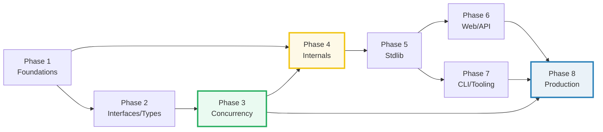

# TODO.md — The Go Expertise Curriculum (build checklist)

> **Goal:** a reader who walks every bundle start-to-finish becomes a **Go
> expert** — fluent in the type system and value/pointer semantics, the goroutine
> scheduler (GMP) and the memory model, escape analysis and the garbage
> collector, the standard library, and the production patterns built on top.
>
> **How bundles get built:** see [`HOW_TO_RESEARCH.md`](./HOW_TO_RESEARCH.md)
> (per-bundle workflow) and [`SUBAGENTS_GUIDE.md`](./SUBAGENTS_GUIDE.md)
> (delegation at scale). The orchestrator **never edits a bundle by hand** — each
> bundle is produced by a subagent (one worker per bundle, **max 4 per batch**),
> then passed through `just sweep`.
>
> Each bundle = `{name}.go` (ground truth) + `{name}_output.txt` (captured
> stdout) + `{NAME}.md` (guide). No `.html`. Every `.go` starts with
> `//go:build ignore`.

---

## Progress

| Phase | Theme | Bundles | Status |
|---|---|---|---|
| 1 | Language Foundations | 8 | ✅ done (8/8, 172 checks) |
| 2 | Interfaces & Type System | 6 | ✅ done (6/6, 121 checks) |
| 3 | Concurrency (the heart) | 7 | ✅ done (7/7, 124 checks, all `-race` clean) |
| 4 | Memory, Runtime & Internals | 5 | ✅ done (5/5, 106 checks) |
| 5 | Standard Library Essentials | 7 | ✅ done (7/7, 198 checks) |
| 6 | Web & API Serving | 6 | ✅ done (6/6, 154 checks) |
| 7 | CLI, Tooling & Build | 6 | ✅ done (6/6, 142 checks) |
| 8 | Production Patterns & Ecosystem | 7 | ✅ done (7/7, 181 checks) |
| | **Total** | **52** | **✅ ALL DONE — 1198 checks, 0 failures, all 10 concurrency bundles `-race` clean** |

**Reading order is the phase order.** Each phase assumes the prior — Phase 3
concurrency leans on Phase 2's interfaces (the `error` and `context.Context`
interfaces); Phase 4 internals lean on Phase 1's value/pointer semantics; Phase
6+ ecosystem leans on the whole core. Do not skip ahead.

---

## Phase 1 — Language Foundations (8)

> **Goal:** rock-solid command of the language primitives. Every downstream
> concept (pointers, interfaces, concurrency) rests on these.

- [x] **1. `values_types_zero`** — Go's type system, zero values, `var` vs `:=`,
  constants (typed vs untyped), `iota`, the four numeric kinds. *(Designated
  **style anchor** for all later workers — ship first.)*
- [x] **2. `strings_runes_bytes`** — `string` = immutable `[]byte`, runes vs
  bytes, UTF-8, `range` over string yields runes, `[]byte(s)` conversion cost,
  `strings`/`strconv`/`unicode/utf8`.
- [x] **3. `arrays_slices`** — arrays (fixed, value type) vs slices (header:
  ptr+len+cap), `make`, `append` growth & aliasing, `copy`, the subslice-cap
  trap, the `slices` package (1.21+).
- [x] **4. `maps`** — hash internals (buckets, evacuation), `make`, nil-map is
  read-only, concurrent-write panic, `delete`, **randomized iteration** (sort
  keys!), the `maps` package.
- [x] **5. `structs_methods`** — structs, embedding (composition over
  inheritance), value vs pointer receivers, method sets, promoted
  fields/methods.
- [x] **6. `functions_closures`** — first-class funcs, closures (capture by
  reference), variadic, multiple returns, the loop-variable-capture trap
  (pre-1.22 vs the 1.22+ per-iteration fix), `defer` of closures.
- [x] **7. `control_flow_defer`** — `if`/`switch` (no-break fallthrough, type
  switch), `for` (the single loop), labeled break/continue, `defer` LIFO +
  argument-eval-time + the defer-in-loop trap.
- [x] **8. `pointers`** — `&`/`*`, value vs pointer semantics, nil pointers,
  `new`, pointer aliasing, the pointer-to-interface anti-pattern, escape preview
  (🔗 ESCAPE_ANALYSIS).

---

## Phase 2 — Interfaces & Type System (6)

> **Goal:** mastery of Go's implicit interfaces — the method-set rule, the
> itable, the nil-interface trap, generics, and the error model. *This is the
> layer that separates Go users from Go experts.*

- [x] **9. `interfaces_basics`** — implicit satisfaction, `any`, the method-set
  rule (value receiver → both, pointer receiver → pointer only), the itable,
  "accept interfaces, return structs".
- [x] **10. `type_assertions`** — `.(T)`, comma-ok, the type switch, named vs
  underlying types, conversion vs assignment rules.
- [x] **11. `nil_interface_trap`** — **THE classic Go bug**: an interface value
  is a `(type, value)` pair; a nil `*T` stored in an interface is NOT a nil
  interface. Diagnose with `%#v`/`reflect`.
- [x] **12. `generics`** — type parameters, constraints (`any`/`comparable`/
  `cmp.Ordered`), type inference, the `slices`/`maps` packages, generic type
  aliases (1.24+), when NOT to use generics.
- [x] **13. `errors`** — the `error` interface, sentinel errors, `errors.Is`/
  `As`/`Unwrap`/`Join`, `%w` wrapping, `panic`/`recover`, error types vs
  sentinels.
- [x] **14. `embedding_composition`** — struct embedding vs interface embedding,
  mocking via embedding, diamond conflicts, the "free decorator" pattern.

---

## Phase 3 — Concurrency: the heart (7)

> **Goal:** see the machine beneath `go` — the GMP scheduler, channels as the
> memory-model primitive, and the context/cancellation discipline. *This is where
> "Go expert" actually lives.*

- [x] **15. `goroutines`** — the `go` statement, the **GMP scheduler** (G
  goroutine, M OS thread, P processor), `GOMAXPROCS`, work-stealing, goroutine
  leaks.
- [x] **16. `channels`** — unbuffered vs buffered, send/receive blocking, `close`,
  `range` over channel, "sender closes" rule, directional channel types.
- [x] **17. `select`** — multiplexing channels, `default` (non-blocking),
  `time.After`, nil-channel disables a case, fan-in, random pick.
- [x] **18. `concurrency_patterns`** — worker pool, pipeline, generator,
  fan-out/fan-in, `errgroup`, semaphore-as-buffered-channel.
- [x] **19. `sync_primitives`** — happens-before, `sync.Mutex`/`RWMutex`/`Once`/
  `WaitGroup`/`Cond`, the **Go memory model**, the race detector
  (`go run -race`).
- [x] **20. `atomic_state`** — `sync/atomic`, CAS, `atomic.Pointer`, `sync.Map`,
  `golang.org/x/sync/singleflight`, when atomic beats mutex.
- [x] **21. `context`** — `context.Context`, cancellation propagation,
  deadlines/timeouts, the values controversy, request-scoped data, the
  `ctx`-as-first-arg convention.

---

## Phase 4 — Memory, Runtime & Internals (5)

> **Goal:** see the compiler and runtime beneath the language — escape analysis,
> the concurrent GC, reflection, and the scheduler knobs.

- [x] **22. `escape_analysis`** — stack vs heap allocation, the compiler's escape
  analysis (`-gcflags=-m`), `&x` escaping, interface-boxing escape, allocation
  reduction.
- [x] **23. `garbage_collector`** — the concurrent tri-color mark-sweep GC,
  `GOGC`/`GOMEMLIMIT`, GC pacing, stop-the-world phases, heap pprof.
- [x] **24. `reflection`** — `reflect` Type/Value, struct tags, `unsafe.Pointer`,
  the cost, when reflection is needed (encoding/ORM).
- [x] **25. `runtime_internals`** — the `runtime` package, goroutine state,
  `runtime.Stack`/`Caller`, `LockOSThread`, `GOMAXPROCS` tuning.
- [x] **26. `unsafe_cgo`** — `unsafe`, `cgo` basics, `CGO_ENABLED`, the cgo
  performance tax, FFI tradeoffs.

---

## Phase 5 — Standard Library Essentials (7)

> **Goal:** ship correct, fast, well-tested Go using **only the stdlib** — the
> `io` model, `encoding/json`, `time`, `net/http`, and the `testing` framework.

- [x] **27. `io_reader_writer`** — `io.Reader`/`Writer`, `io.Copy`, `bufio`, the
  Reader/Writer composition pattern, `bytes.Buffer`/`strings.Reader`, `io/fs`.
- [x] **28. `encoding_json`** — marshal/unmarshal, struct tags, `omitempty`,
  custom `MarshalJSON`, streaming encode/decode, `json.RawMessage`.
- [x] **29. `time`** — monotonic vs wall clock, `Duration`, `Timer`/`Ticker`/
  `After`, the layout reference date (`Mon Jan 2 15:04:05 MST 2006`), the
  monotonic-clock pitfall.
- [x] **30. `regexp`** — RE2 (no backtracking), `Compile` vs `MustCompile`, why
  no backreferences, performance.
- [x] **31. `os_filepath_embed`** — `os`/`path/filepath`, file I/O, `embed`,
  walking dirs, the `fs.FS`/`io/fs` abstractions.
- [x] **32. `testing`** — table-driven tests, `Benchmark*`, `b.ReportAllocs`,
  `FuzzXxx`, `t.Parallel()`, `testdata`, subtests.
- [x] **33. `net_http`** — `http.Handler`/`ServeMux` (1.22+ routing: methods &
  path wildcards), `http.Client`, timeouts, handlers, `httptest`.

---

## Phase 6 — Web & API Serving (6)

> **Goal:** build production-grade HTTP APIs and services. Stdlib-first, with the
> popular ecosystem libs shown as **contrast** (the third-party deps land here).

- [x] **34. `middleware_routing`** — stdlib 1.22 `ServeMux` patterns + middleware
  chaining; **contrast** with `chi` (router groups, sub-routers).
- [x] **35. `request_validation`** — request binding, struct-tag validation
  (hand-rolled + optional `go-playground/validator`), JSON edge cases, streaming
  bodies.
- [x] **36. `database_sql`** — `database/sql`, connection pooling, prepared
  statements, `sql.Null*`, `Scan`, transactions, the N+1 problem, `maxOpenConns`.
- [x] **37. `sqlx_gorm`** — `sqlx` (light) vs `gorm` (heavy ORM) contrast, when
  each wins, model definitions, migrations.
- [x] **38. `auth_sessions_jwt`** — password hashing (`golang.org/x/crypto/bcrypt`
  /`argon2`), sessions/cookies, JWT issue/verify, middleware auth.
- [x] **39. `grpc_protobuf`** — proto definitions, `grpc-go`, unary vs streaming
  RPC, interceptors, the protobuf wire format.

---

## Phase 7 — CLI, Tooling & Build (6)

> **Goal:** ship Go programs as polished CLIs and maintainable modules — the
> toolchain, build/ldflags, `cobra`, `slog`, `pprof`, and linting.

- [x] **40. `modules_workspace`** — `go mod`, the **MVS** (minimal version
  selection) algorithm, `go.sum`, the module proxy, vendoring, `go work`
  workspaces.
- [x] **41. `build_ldflags_generate`** — build tags/constraints, `ldflags -X`
  (version injection), `GOOS`/`GOARCH` cross-compilation, `go generate`, `embed`.
- [x] **42. `cli_cobra`** — `cobra`/`pflag` subcommands & shell completion;
  **contrast** with the stdlib `flag` package.
- [x] **43. `slog`** — `log/slog` structured logging, levels/handlers, context
  integration, sampling.
- [x] **44. `pprof`** — CPU/heap/goroutine/mutex/block profiles, `go tool pprof`,
  flame graphs, `runtime/trace`, benchmark-driven profiling.
- [x] **45. `lint_staticcheck`** — `gofmt`/`goimports`/`go vet`/`staticcheck`/
  `golangci-lint`/`revive`, the "gofmt'd = canon" law, CI integration.

---

## Phase 8 — Production Patterns & Ecosystem (7)

> **Goal:** wire the whole stack into production-ready services — graceful
> shutdown, resilience, observability, deployment, and a concurrency capstone.

- [x] **46. `graceful_shutdown`** — signal handling, `http.Server.Shutdown`,
  context-based cancellation, draining in-flight work, `errgroup` for concurrent
  shutdown.
- [x] **47. `resilience_patterns`** — retries/backoff, circuit breaker
  (`gobreaker`), rate limiting (`golang.org/x/time/rate` token bucket), timeouts,
  bulkheads.
- [x] **48. `config_12factor`** — env vars (`os.Getenv`/`envconfig`), config files
  (YAML/`viper`), 12-factor, secret handling.
- [x] **49. `observability_otel`** — OpenTelemetry traces/metrics/logs,
  exporters, context propagation, the metrics-traces-logs trinity.
- [x] **50. `docker_k8s_deploy`** — multi-stage Dockerfiles, scratch/distroless,
  image size, k8s liveness/readiness probes, graceful termination.
- [x] **51. `streaming_websockets_sse`** — streaming responses, SSE,
  `nhooyr.io/websocket`, backpressure, chunked transfer.
- [x] **52. `concurrency_capstone`** — a realistic system tying goroutines +
  channels + context + errgroup + graceful shutdown + rate limiting into one
  (e.g. a bounded concurrent fetcher with cancellation & metrics). The Phase-3-
  to-8 synthesis.

---

## Cross-cutting 🔗 map (the expertise chain)

These links are the connective tissue that turns 52 separate topics into one
mental model. Workers must add the relevant 🔗 cross-references:

Key cross-links workers should wire up:
- `pointers` (P1) ⟷ `escape_analysis` (P4) ⟷ `garbage_collector` (P4) — **the
  value/pointer → escape → GC chain is the heart of "Go expert".**
- `interfaces_basics` (P2) ⟷ `nil_interface_trap` (P2) ⟷ `errors` (P2) — the
  `(type,value)` interface model explains the nil trap AND the `error` interface.
- `goroutines` (P3) ⟷ `channels` (P3) ⟷ `context` (P3) ⟷ `graceful_shutdown`
  (P8) — one concurrency story end-to-end.
- `control_flow_defer` (P1) ⟷ `graceful_shutdown` (P8) — `defer` for cleanup
  scales up to server shutdown.
- `net_http` (P5) ⟷ `middleware_routing` (P6) ⟷ `auth_sessions_jwt` (P6) — the
  HTTP stack from stdlib to auth.
- `testing` (P5) ⟷ `pprof` (P7) ⟷ `lint_staticcheck` (P7) — the
  test/profile/lint engineering trinity.

---

## How to run a phase (orchestrator recipe)

For each phase:

1. **Confirm deps:** add the phase's deps to `go.mod` (Phase 1–5: none); `go mod
   tidy`; `just module` clean.
2. **Write briefs:** fill the `SUBAGENTS_GUIDE.md` §2 template for each bundle in
   the phase (5 min each).
3. **Launch the swarm in batches of ≤4:** one `Task` worker per bundle, up to 4
   `Task` calls per message (disjoint file ownership = safe parallelism). For
   Phase 1, **ship `values_types_zero` first** as the style anchor, then launch
   the rest against it.
4. **Verify after each batch:** `just sweep` + `just module`; spot-check 2–3
   `.md` callouts against `_output.txt`.
5. **Re-spawn** any failures (≤4 again); tick the boxes above; update the Progress
   table.
