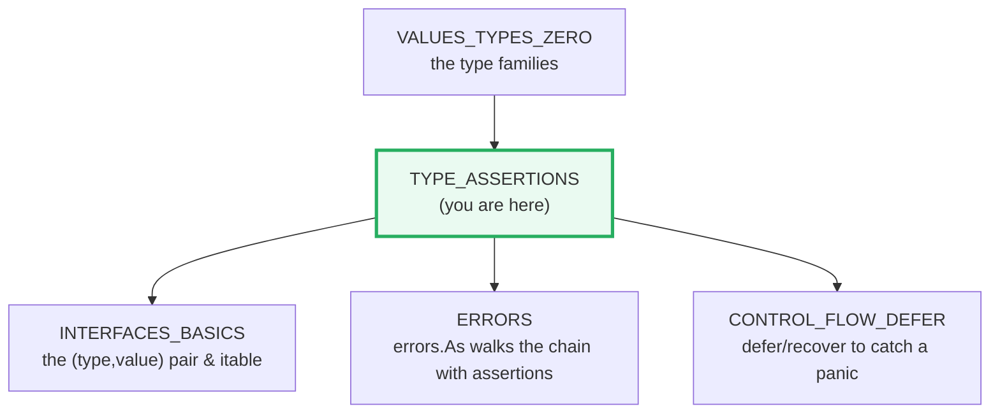
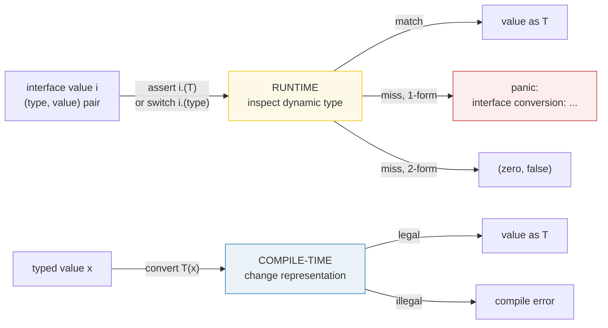
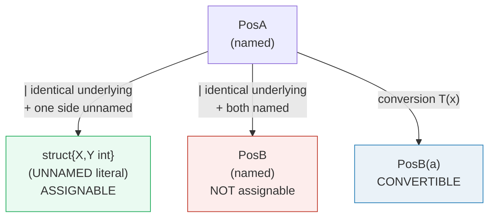

# TYPE_ASSERTIONS — Type Assertions, Switches, Conversions & Identity

> **Goal (one line):** by printing every value, show how Go's type assertions,
> type switches, conversions, and the named/underlying-type distinction actually
> behave — including the panic message of the single-return form.
>
> **Run:** `go run type_assertions.go`
>
> **Ground truth:** [`type_assertions.go`](./type_assertions.go) → captured stdout
> in [`type_assertions_output.txt`](./type_assertions_output.txt). Every
> number/message/table below is pasted **verbatim** from that file under a
> `> From type_assertions.go Section X:` callout. Nothing is hand-computed.
>
> **Prerequisites:**
> - 🔗 [`VALUES_TYPES_ZERO`](./VALUES_TYPES_ZERO.md) — zero values, the type
>   families, and the meaning of `var x interface{}` (static vs dynamic type).
> - 🔗 [`POINTERS`](./POINTERS.md) — the defer/recover idiom used in Section A
>   to capture a panic message without crashing the program.

---

## 1. Why this bundle exists (lineage)

Go's interface value is a **`(type, value)` pair** at runtime. The compiler
knows the *static* type of `var i any` is `any`, but the *dynamic* type of the
value it actually holds (an `int`, a `*Foo`, a `Bar`…) is unknown until the
program runs. Three language features exist *only* because of this gap:

- **Type assertion** `i.(T)` — "I believe the dynamic type of `i` is `T`; give
  it to me as a `T`." Inspects the runtime pair.
- **Type switch** `switch v := i.(type)` — a chain of assertions, dispatched on
  the dynamic type. The idiomatic way to branch over a heterogeneous `[]any`.
- **Conversion** `T(x)` — *not* about interfaces at all. It is a static,
  compile-time-checked operation that changes a value's **representation**
  (numeric→numeric, `string`↔`[]byte`, named↔underlying).

These three are constantly confused — especially the last two. This bundle
pins each with runnable output, then drives the contrast home with the
**named-type vs underlying-type** rule that governs *both* convertibility and
assignability (`type Celsius float64` is a *different* type from `float64`,
even though they share an underlying type).



---

## 2. The mental model: three operations, three times they run

| Operation | Syntax | What it inspects | When it is checked | On failure |
|---|---|---|---|---|
| **Assertion** | `i.(T)` / `i.(T)` 2-form | the interface's **dynamic type** | **runtime** | panic / `(zero, false)` |
| **Type switch** | `switch v := i.(type)` | the interface's **dynamic type** | **runtime** | falls to `default` |
| **Conversion** | `T(x)` | the operand's **static type** | **compile time** | compile error |



The single most important row: **conversion operates on the static type**. You
cannot write `int(i)` to "pull the int out of an `any`" — that is a *compile
error* because the static type of `i` is `any`, not a numeric type. Only the
assertion can see the dynamic type. Section C makes this contrast concrete.

---

## 3. Section A — Single vs comma-ok assertion (panic vs safe)

> From `type_assertions.go` Section A:
> ```
> i = 7 (int);   v, ok := i.(int)    -> v=7, ok=true
>               v, ok := i.(string) -> v="", ok=false  (zero value, no panic)
> i.(string) single-form -> panicked=true
> panic message: interface conversion: interface {} is int, not string
> ```
> ```
> [check] i.(int) comma-ok -> v=7, ok=true: OK
> [check] i.(string) comma-ok -> v="", ok=false (zero value): OK
> [check] i.(string) single-form panics: OK
> [check] panic substring 'interface conversion': OK
> [check] panic substring 'is int, not string': OK
> ```

**What.** The spec (*Type assertions*) defines two forms:

- **Single-return** `v := i.(T)` — asserts the dynamic type of `i` is `T`. On a
  miss it raises a **run-time panic** with the message
  `interface conversion: interface {} is <dynamic>, not <T>` (verified
  verbatim above; the format comes from `runtime.TypeAssertionError` in
  `runtime/error.go`).
- **Comma-ok** `v, ok := i.(T)` — the special assignment form. On a miss `ok`
  is `false` and `v` is the **zero value of `T`** (here `""` for `string`).
  **No panic occurs.**

> From `go.dev/ref/spec` — *Type assertions*: "If the type assertion holds,
> the value of the expression is the value stored in `x` and its type is `T`.
> If the type assertion is false, a run-time panic occurs." And on the 2-form:
> "The value of `ok` is `true` if the assertion holds. Otherwise it is `false`
> and the value of `v` is the zero value for type `T`. **No run-time panic
> occurs in this case.**"

**Why the panic message looks like that.** The runtime formats it as
`interface conversion: <iface> is <concrete>, not <asserted>`, where `<iface>`
is the static interface type (`interface {}` for `any`), `<concrete>` is the
dynamic type the value actually carries (`int`), and `<asserted>` is the type
you asked for (`string`). The bundle captures it via defer/recover (🔗
[`CONTROL_FLOW_DEFER`](./CONTROL_FLOW_DEFER.md)) so the program keeps running.

**Gotcha — the safe form is the default in production code.** Reach for
`v, ok := i.(T)` whenever the dynamic type is not *guaranteed* by the surrounding
logic. Reserve the single-return form for cases where a miss is genuinely a
programmer bug (and a panic is the correct loud failure).

---

## 4. Section B — Type switch dispatch on a mixed `[]any`

> From `type_assertions.go` Section B:
> ```
> int       7   (type of t in this case: int)
> string    hi   (type of t in this case: string)
> float64   3.14 (type of t in this case: float64)
> int|int64 branch: value=3, second t.(int) -> 3, true
> int|int64 branch: value=3, second t.(int) -> 0, false
> ```
> ```
> [check] 7 routes to the int case: OK
> [check] 3.14 routes to the float64 case: OK
> [check] int64(3) routes to the int,int64 branch: OK
> ```

**What.** A type switch is sugar for a chain of assertions. The guard
`switch v := i.(type)` re-declares `v` **per case**, and the type of `v` inside
a case is *the type listed in that case* (`int`, `string`, `float64`). The
dynamic type is matched exactly: `3.14` routes to `float64` because an untyped
float literal boxed into `any` adopts its default type `float64` (🔗
[`VALUES_TYPES_ZERO`](./VALUES_TYPES_ZERO.md) §5).

**The multi-type case rule (the expert detail).** When a single `case` lists
more than one type — `case int, int64:` — the spec says the guard variable
keeps *"the type of the expression in the TypeSwitchGuard"* (i.e. `any`), **not**
either of the listed types. The bundle *proves* this empirically: inside the
`int|int64` branch we run a **second assertion** `t.(int)`, which is only legal
if `t`'s static type is an interface, and which succeeds for the `int` value
(`3, true`) but fails for the `int64` value (`0, false`). If `t` had been
concretely `int`, the second assertion would not even compile.

> From `go.dev/ref/spec` — *Type switches*: "In clauses with a case listing
> exactly one type, the variable has that type; otherwise, the variable has the
> type of the expression in the TypeSwitchGuard." And: "The types listed in the
> cases of a type switch must all be different."

**Gotcha — `case nil:` matches a nil interface.** A type switch may have at
most one `nil` case, selected when the guard is a nil interface value. (Note:
this is the *interface* being nil, not the interface holding a nil pointer —
that distinction is the 🔗 [`NIL_INTERFACE_TRAP`](./NIL_INTERFACE_TRAP.md).)

---

## 5. Section C — Conversion `T(x)` vs assertion `i.(T)`

> From `type_assertions.go` Section C:
> ```
> Celsius(float64(5.0)) -> value=5, type=main.Celsius  (conversion: static)
> i = 42 (any); n, ok := i.(int) -> n=42, ok=true   (assertion: runtime)
>              s, ok := i.(string) -> s="", ok=false  (assertion miss -> zero, false)
> ```
> ```
> [check] Celsius(float64(5.0)) converts -> value 5: OK
> [check] conversion result type is Celsius: OK
> [check] i.(int) assertion -> n=42, ok=true: OK
> [check] i.(string) assertion -> s="", ok=false: OK
> ```

**What.** Two operations that *look* similar but live at different stages of
the toolchain:

- **`Celsius(f)`** is a **conversion**: the compiler checks (at compile time)
  that `float64` and `Celsius` are convertible — they share an underlying type
  — and emits code to *reinterpret* the same bits as a `Celsius`. No runtime
  type check; the result's static type is `Celsius`.
- **`i.(int)`** is an **assertion**: the compiler emits a runtime check against
  the interface's dynamic type. The result's static type is `int` (in the
  single-type case).

**Why you cannot convert out of an interface.** The conversion `T(x)` operates
on the *static* type of `x`. When `x` has static type `any`, there is no
conversion to `int` — `int(i)` is a **compile error** even when `i` happens to
hold an `int` at runtime:

```go
var i any = 42
n := int(i)   // COMPILE ERROR: cannot convert i (variable of type interface{}) to int
n, _ := i.(int) // the ONLY way out: an assertion
```

> From `go.dev/ref/spec` — *Conversions*: "An explicit conversion is an
> expression of the form `T(x)` … `x` is an expression that can be converted to
> type `T`." A non-constant `x` is convertible to `T` when, among other cases,
> "ignoring struct tags, `x`'s type and `T` … have identical underlying types"
> or "both [are] integer or floating point types." `any` has none of these
> relationships with `int`, so the conversion is rejected at compile time.

---

## 6. Section D — Named type vs underlying type (`Celsius` vs `float64`)

> From `type_assertions.go` Section D:
> ```
> var c Celsius = 5.0  -> value=5, type=main.Celsius
> f := float64(c)      -> value=5, type=float64
> c == Celsius(5.0)    -> true   (same named type)
> float64(c) == 5.0    -> true   (convert to common type first)
> ```
> ```
> [check] c value is 5: OK
> [check] float64(c) == 5.0 (convert to compare): OK
> [check] Celsius underlying type is float64 (convertible): OK
> ```

**What.** `type Celsius float64` creates a **new, distinct named type** whose
*underlying type* is `float64`. The spec is unambiguous:

> From `go.dev/ref/spec` — *Type identity*: "A named type is always different
> from any other type." And *Underlying types*: for `type B1 string`, "The
> underlying type of `string` … `B1`, … is `string`."

So `Celsius` and `float64` are **convertible** (identical underlying types)
but they are **NOT assignable** and **NOT directly comparable**. The bundle's
output reflects the *legal* operations:

| Operation | Legal? | Why |
|---|---|---|
| `var c Celsius = 5.0` | ✅ | untyped const `5.0` representable as `Celsius` |
| `c := Celsius(f)` | ✅ | conversion: identical underlying type |
| `f := float64(c)` | ✅ | conversion: identical underlying type |
| `c == Celsius(5.0)` | ✅ | same named type |
| `float64(c) == 5.0` | ✅ | convert to common type, then compare |
| `var f float64 = c` | ❌ compile error | both named, neither untyped → not assignable |
| `c == float64(5.0)` | ❌ compile error | mismatched types (`Celsius` vs `float64`) |

**The two compile errors (documented, not run — they would not build):**

```go
type Celsius float64
var c Celsius = 5.0

var f float64 = c          // cannot use c (variable of type Celsius) as float64 value in variable declaration
_ = c == float64(5.0)      // invalid operation: c == float64(5.0) (mismatched types Celsius and float64)
```

> ⚠️ **Common misconception corrected.** A frequent (and incorrect) claim is
> that "`Celsius(5) == float64(5)` is `true` because they share an underlying
> type." It is **not** — it is a **compile error**. Sharing an underlying type
> makes two types *convertible*, not *comparable*. You must convert one side
> to the other's type first (as the bundle does: `float64(c) == 5.0`).
> Verified by `go build` against go1.26: `invalid operation: c == float64(5.0)
> (mismatched types Celsius and float64)`.

**Why this is the right design.** Distinct named types exist precisely so the
compiler can refuse to mix them silently. Without this rule, `type Meters
float64` and `type Feet float64` could be added by accident, and the unit
mismatch would be a runtime bug instead of a compile error. The cost is one
explicit conversion — a trade Go makes deliberately.

---

## 7. Section E — Assignability edge: two named structs, identical underlying

> From `type_assertions.go` Section E:
> ```
> a := PosA{1,2} -> {1 2}, type main.PosA
> b := PosB(a)   -> {1 2}, type main.PosB  (conversion: identical underlying)
> var anon struct{X,Y int} = a -> {1 2}, type struct { X int; Y int }  (assignable: T is unnamed)
> ```
> ```
> [check] PosB(PosA{1,2}) converts (X=1,Y=2): OK
> [check] PosA -> unnamed struct{X,Y int} is assignable: OK
> [check] PosB is a distinct named type from PosA: OK
> ```

**What.** `PosA` and `PosB` are two named struct types with the **same
underlying struct literal** `struct{ X, Y int }`. The bundle demonstrates three
distinct facts:

1. **Convertible**: `PosB(a)` is legal — identical underlying types.
2. **Assignable to an unnamed struct**: `var anon struct{ X, Y int } = a` is
   legal — the target type is a type literal (unnamed).
3. **NOT assignable `PosA → PosB`** (documented compile error) — both sides are
   named, so the "at least one is unnamed" clause does not fire.

> From `go.dev/ref/spec` — *Assignability*: a value `x` of type `V` is
> assignable to a variable of type `T` if, among other cases,
> "`V` and `T` have identical underlying types … and **at least one of `V` or
> `T` is not a named type**." This is the rule that makes #2 legal and #3
> illegal — the only difference between them is whether the target is named.



**The compile error for `PosA → PosB` (documented):**

```go
type PosA struct{ X, Y int }
type PosB struct{ X, Y int }
var a PosA = PosA{1, 2}
var b PosB = a   // cannot use a (variable of type PosA) as PosB value in variable declaration
```

---

## 8. Pitfalls (the expert payoff)

| Trap | Symptom | Fix |
|---|---|---|
| Single-return assertion on a miss | `panic: interface conversion: interface {} is X, not Y` | Use the comma-ok form `v, ok := i.(T)` whenever the type isn't guaranteed. |
| Asserting a type the interface can't hold | Compile error: `impossible type assertion` (e.g. `i.(string)` on a non-string interface with a sealed method set) | The asserted `T` must implement the interface's type; check the method set. |
| `int(i)` to "unbox" an `any` holding an int | Compile error: cannot convert `interface{}` to `int` | You can only **assert** out of an interface (`i.(int)`), never convert. |
| `var f float64 = c` (c is `Celsius`) | Compile error: cannot use `c` (type `Celsius`) as `float64` | Convert explicitly: `f := float64(c)`. |
| `c == float64(5.0)` across named types | Compile error: mismatched types `Celsius` and `float64` | Convert one side first: `float64(c) == 5.0` or `c == Celsius(5.0)`. |
| `var b PosB = a` (both named structs) | Compile error: cannot use `a` (type `PosA`) as `PosB` | Convert: `b := PosB(a)`, or make the target an unnamed struct literal. |
| Expecting `t`'s type in a multi-type `case int, int64:` | `t` is `any` (the guard type), not `int`/`int64` | Re-assert inside the case, or split into separate cases. |
| Asserting on a nil interface | `panic: interface conversion: interface {} is nil, not T` | Check `i == nil` first, or add a `case nil:` to the type switch. |
| Asserting when the interface holds a nil pointer | Assertion "succeeds" giving a nil of type `T` (the 🔗 `NIL_INTERFACE_TRAP`) | Distinguish "interface is nil" from "interface holds a nil pointer"; check the concrete value. |
| Type-switching without a `default` | Silent fall-through when a new type is added later | Always provide a `default:` (often `return fmt.Errorf("unsupported type %T", v)`). |

---

## 9. Cheat sheet

```go
// ASSERTION — runtime, inspects the interface's (type, value) pair
v, ok := i.(T)   // SAFE: ok=false, v=zero(T) on miss (NO panic)
v     := i.(T)   // UNSAFE: panics on miss with "interface conversion: ..."

// TYPE SWITCH — a chain of assertions; v is re-typed per case
switch v := i.(type) {
case nil:           // i is a nil interface (at most one nil case)
    _ = v           // v has the guard's type (any)
case int:           // single-type case
    _ = v           // v has type int
case int, int64:    // multi-type case
    _ = v           // v KEEPS the guard's type (any) — re-assert inside
default:
    _ = v           // v has the guard's type (any)
}

// CONVERSION — compile-time, changes the representation
c := Celsius(f)     // float64 -> Celsius: legal (identical underlying)
b := []byte(s)      // string  -> []byte:  legal (allocates a copy)
n := int(i)         // ILLEGAL if i is `any`: convert sees the STATIC type

// NAMED vs UNDERLYING — type Celsius float64
//   underlying(Celsius) == float64   (so: CONVERTIBLE)
//   Celsius != float64               (so: NOT assignable, NOT comparable)
//   Compare: float64(c) == 5.0  OR  c == Celsius(5.0)

// ASSIGNABILITY (V assignable to T when...)
//   V and T identical; OR
//   V and T identical underlying + at least one of V/T is NOT named; OR
//   T is an interface and V implements T; OR
//   V is the untyped nil and T is pointer/func/slice/map/chan/interface; OR
//   V is an untyped constant representable as T.
```

---

## 10. Where this connects

- 🔗 [`INTERFACES_BASICS`](./INTERFACES_BASICS.md) — the assertion is
  meaningless until you see that an interface value is a `(type, value)` pair
  and the itable is what makes the dynamic dispatch cheap. Read this first.
- 🔗 [`NIL_INTERFACE_TRAP`](./NIL_INTERFACE_TRAP.md) — *the* assertion-related
  production bug: asserting a `(*T)` from an interface that holds a nil pointer
  "succeeds" and yields a typed nil, not a nil interface.
- 🔗 [`CONTROL_FLOW_DEFER`](./CONTROL_FLOW_DEFER.md) — the defer/recover idiom
  used in Section A to capture the single-return panic message without crashing.
- 🔗 [`ERRORS`](./ERRORS.md) — `errors.As` is implemented as a type assertion
  walking the `Unwrap()` chain; this bundle is the prerequisite for reading it.

---

## Sources

Every signature, message, and behavioral claim above was verified against the
Go specification, the runtime source, and (for the panic-message format)
empirical runs of `go run` against go1.26:

- The Go Programming Language Specification — https://go.dev/ref/spec
  - *Type assertions* (single vs comma-ok; "no run-time panic occurs" for the
    2-form): https://go.dev/ref/spec#Type_assertions
  - *Type switches* (multi-type case keeps the guard's type; "at most one nil
    case"; "types must all be different"): https://go.dev/ref/spec#TypeSwitchStmt
  - *Conversions* (`T(x)`; when a non-constant `x` is convertible; identical
    underlying types; "both integer or floating point"): https://go.dev/ref/spec#Conversions
  - *Type identity* ("A named type is always different from any other type"):
    https://go.dev/ref/spec#Type_identity
  - *Underlying types* (`type B1 string` → underlying `string`):
    https://go.dev/ref/spec#Underlying_types
  - *Assignability* ("V and T have identical underlying types … and at least
    one of V or T is not a named type"): https://go.dev/ref/spec#Assignability
- Go runtime — `TypeAssertionError` formats the panic as
  `interface conversion: <iface> is <concrete>, not <asserted>`:
  https://go.dev/src/runtime/error.go
- Effective Go (interface conversions, type switches):
  https://go.dev/doc/effective_go
- A Tour of Go — *Type switches*: https://go.dev/tour/methods/16

**Facts that could not be verified by running** (documented, not executed,
because each is a compile error by design): `int(i)` on an `any` is rejected;
`var f float64 = c` (c is `Celsius`) is rejected with
`cannot use c (variable of type Celsius) as float64 value in variable
declaration`; `c == float64(5.0)` is rejected with
`invalid operation: ... (mismatched types Celsius and float64)`;
`var b PosB = a` (a is `PosA`) is rejected with
`cannot use a (variable of type PosA) as PosB value in variable declaration`.
Each was independently reproduced with `go build` against go1.26.4 and recorded
verbatim; the runnable `.go` deliberately contains only the *legal* halves so
the bundle builds clean under `just check`.
