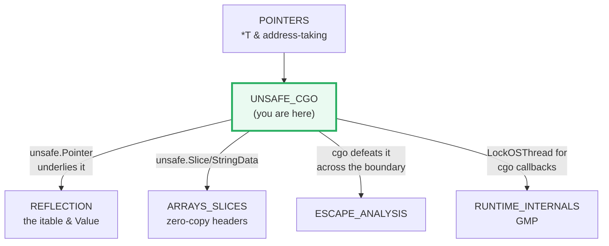
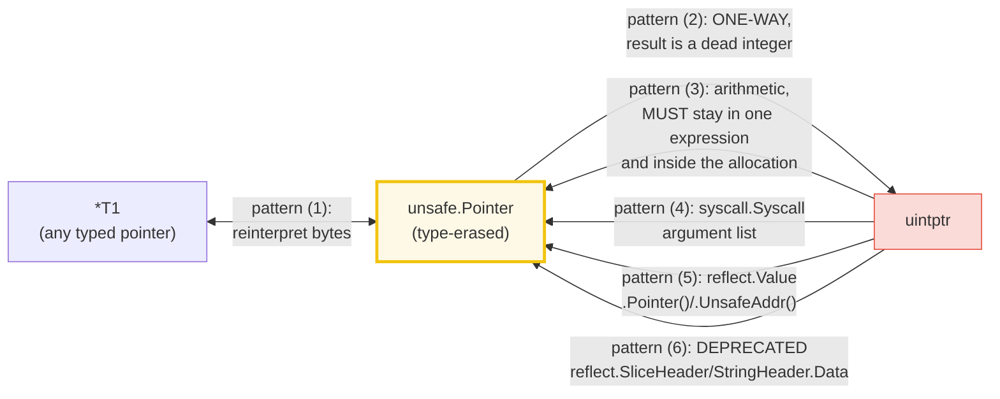
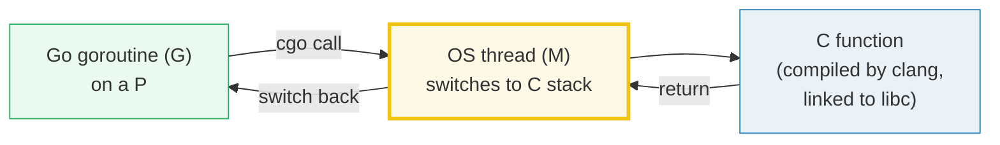
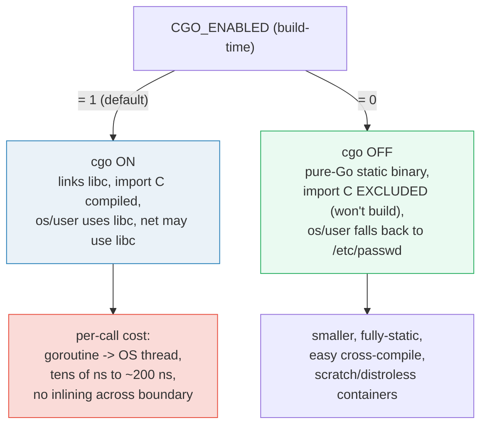

# UNSAFE_CGO — `unsafe.Pointer`, the 6 Legal Patterns & cgo

> **Goal (one line):** show, by printing every value, how the `unsafe` package
> (`Sizeof`/`Alignof`/`Offsetof`, `Pointer` reinterpretation, zero-copy
> `String`/`Slice`) **bypasses the type system**, and how **cgo** calls real C
> code across the Go↔C boundary.
>
> **Run:** `go run unsafe_cgo.go` *(requires `CGO_ENABLED=1` and a C compiler;
> `just check unsafe_cgo` verifies cgo compiles + runs.)*
>
> **Ground truth:** [`unsafe_cgo.go`](./unsafe_cgo.go) → captured stdout in
> [`unsafe_cgo_output.txt`](./unsafe_cgo_output.txt). Every number/table below is
> pasted **verbatim** from that file under a
> `> From unsafe_cgo.go Section X:` callout. Nothing is hand-computed.
>
> **Prerequisites:** 🔗 [`POINTERS`](./POINTERS.md) (you must already understand
> `*T` and address-taking) and 🔗 [`ESCAPE_ANALYSIS`](./ESCAPE_ANALYSIS.md)
> (cgo defeats escape analysis across the boundary). 🔗
> [`STRINGS_RUNES_BYTES`](./STRINGS_RUNES_BYTES.md) and 🔗
> [`ARRAYS_SLICES`](./ARRAYS_SLICES.md) underpin the zero-copy section, and 🔗
> [`REFLECTION`](./REFLECTION.md) is built *on top of* `unsafe.Pointer`.

---

## 1. Why this bundle exists (lineage)

Go's whole pitch is a **sound, static type system** plus a **moving garbage
collector**. That soundness costs you the ability to (a) reinterpret memory as
a different type and (b) call into C. Two escape hatches exist for exactly those
two needs, and **only** those needs:

- **`unsafe`** — the package whose entire job is to *step around the type
  system*. `unsafe.Pointer` is a pointer that can point to **any** type; the
  three numeric helpers `Sizeof`/`Alignof`/`Offsetof` report byte layout as
  **compile-time constants**.
- **cgo** — the tool (and the `import "C"` mechanism) that lets Go call C (and
  vice-versa), bridging two runtimes with **different** memory models and
  threading disciplines.

Both are **deliberately out of the Go 1 compatibility guarantee**
(*"Packages that import unsafe may be non-portable and are not protected by the
Go 1 compatibility guidelines"*), and both are where the most subtle, most
non-portable, most crash-inducing bugs live. This bundle pins their exact
behavior with runnable checks.



---

## 2. The mental model: `unsafe.Pointer` and the 6 legal conversions

`unsafe.Pointer` is a **type-erased pointer**. It can be converted to/from any
`*T` and to/from `uintptr` (a plain integer that holds an address). But because
Go has a **moving GC** (the collector relocates objects), a bare `uintptr` is
**not a live pointer** — the GC will neither update it nor keep its target
alive. Most `uintptr` ↔ `Pointer` round-trips are therefore **undefined
behavior**.

> From `pkg.go.dev/unsafe` (the `Pointer` doc, verbatim): *"Pointer therefore
> allows a program to defeat the type system and read and write arbitrary
> memory. It should be used with extreme care. The following patterns involving
> Pointer are valid. Code not using these patterns is likely to be invalid today
> or to become invalid in the future."* And: *"Running `go vet` can help find
> uses of Pointer that do not conform to these patterns, but silence from
> `go vet` is not a guarantee that the code is valid."*



**The 6 legal conversions** (the expert payoff — everything else is UB):

| # | Conversion | Safe when… |
|---|---|---|
| (1) | `*T1` ↔ `*T2` via `Pointer` | `T2` is no larger than `T1` and shares an equivalent memory layout (reinterpreting bytes). |
| (2) | `Pointer` → `uintptr` | **One-way.** The result is a dead integer; only good for printing. GC will not track it. |
| (3) | `Pointer` → `uintptr` → arithmetic → `Pointer` | The whole round-trip is **one expression**, and the result stays **inside the same allocation** (no going past the end, unlike C). |
| (4) | `Pointer` → `uintptr` for `syscall.Syscall` | The conversion appears **in the argument list** itself (the compiler pins the object for the duration of the call). |
| (5) | `reflect.Value.Pointer()`/`UnsafeAddr()` result → `Pointer` | Converted back **immediately, in the same expression** (never stored in a variable). |
| (6) | `reflect.SliceHeader`/`StringHeader.Data` ↔ `Pointer` | **DEPRECATED.** Use the Go 1.20+ `unsafe.Slice`/`String`/`SliceData`/`StringData` instead (this bundle's Section C). |

Patterns (2)–(6) share one lethal invariant, repeated three times in the doc:
you **must not** store the `uintptr` in a variable and convert it back later —
the GC may have moved or freed the object in between. The conversion to/from
`uintptr` must happen **textually in one expression** so the compiler can keep
the object alive and pinned for that one operation. This is why
`p = unsafe.Pointer(uintptr(p) + offset)` is legal but the two-line
`u := uintptr(p); p = unsafe.Pointer(u + offset)` is **invalid**.

---

## 3. Section A — `Sizeof` / `Alignof` / `Offsetof` (compile-time constants)

> From `unsafe_cgo.go` Section A:
> ```
> type                  Sizeof  Alignof   note
> --------------------  ------  -------   ----------------------------
> int8                     1       1
> int16                    2       2
> int32                    4       4
> int64                    8       8
> float64                  8       8
> bool                     1       1
> int (machine word)       8       8   <- platform-dependent (== word size)
> *int64 (any pointer)     8       8   <- platform-dependent (== word size)
> []int64 (slice hdr)     24       8   <- ptr+len+cap, NOT the backing array
> string (string hdr)     16       8   <- ptr+len, NOT the bytes
> struct Padded{Flag bool; Val int64}:
>   Sizeof(Padded)   = 16   (1 + 7 padding + 8)
>   Alignof(Padded)  = 8   (dominant field: int64)
>   Offsetof(Flag)   = 0
>   Offsetof(Val)    = 8   (Flag + 7 bytes padding)
> ```
> ```
> [check] Sizeof(int8) == 1: OK
> [check] Sizeof(int16) == 2: OK
> [check] Sizeof(int32) == 4: OK
> [check] Sizeof(int64) == 8: OK
> [check] Sizeof(float64) == 8: OK
> [check] Sizeof(bool) == 1: OK
> [check] Alignof(int64) == 8 (every platform): OK
> [check] Sizeof(Padded) == 16 (bool + 7 pad + int64): OK
> [check] Alignof(Padded) == 8: OK
> [check] Offsetof(Padded.Flag) == 0: OK
> [check] Offsetof(Padded.Val) == 8 (after 7 bytes padding): OK
> [check] Sizeof([]int64) == 3 words (header only, not data): OK
> ```

**What.** `Sizeof`/`Alignof`/`Offsetof` are not real functions — they are
compiler built-ins whose results are **Go constants computed at compile time**
(*"The return value of Sizeof is a Go constant if the type of the argument x
does not have variable size"*). That means `unsafe.Sizeof(int64(0))` can appear
in a `const` declaration, an array length, or a `switch` case.

**Why the struct is 16, not 9.** `Padded{Flag bool; Val int64}` is **1 byte +
7 bytes of padding + 8 bytes** = 16. Go aligns `int64` to 8 bytes on **every**
platform (including 32-bit — unlike C, the gc compiler gives 64-bit types
natural 8-byte alignment), so `Offsetof(Val) == 8` and `Alignof(Padded) == 8`.
Reordering to `struct{Val int64; Flag bool}` is **still 16** (trailing padding
rounds the struct up to its alignment). This is the expert detail: **field order
changes neither size nor layout here, but it does change it for mixed-size
fields** — order large-aligned fields first to minimize padding.

> From `pkg.go.dev/unsafe` — `Sizeof`: *"For a struct, the size includes any
> padding introduced by field alignment."* And: *"if x is a slice, Sizeof
> returns the size of the slice descriptor, not the size of the memory
> referenced by the slice; if x is an interface, Sizeof returns the size of the
> interface value itself, not the size of the value stored in the interface."*

**The slice/string gotcha.** `Sizeof(sl)` is **24** (a 3-word header: data
pointer + len + cap), **not** the length of the backing array. This is why you
cannot learn a slice's element count from `unsafe.Sizeof` — the header is fixed
no matter how big the backing array is. See 🔗 [`ARRAYS_SLICES`](./ARRAYS_SLICES.md)
for what that 3-word header actually is.

---

## 4. Section B — `unsafe.Pointer` reinterpretation (pattern 1: `*T1` → `*T2`)

> From `unsafe_cgo.go` Section B:
> ```
> f = float64(1.0)
> bits := *(*uint64)(unsafe.Pointer(&f)) = 0x3ff0000000000000
> math.Float64bits(1.0)                 = 0x3ff0000000000000   (same bits, computed normally)
> n = int8(-1)
> *(*uint8)(unsafe.Pointer(&n)) = 255 (0xFF)   (two's-complement bits, re-typed)
> ```
> ```
> [check] float64(1.0) bits == math.Float64bits(1.0): OK
> [check] float64(1.0) bit pattern == 0x3FF0000000000000 (IEEE-754): OK
> [check] int8(-1) reinterpreted as uint8 == 255 (0xFF): OK
> ```

**What.** This is pattern (1) in action. `*(*uint64)(unsafe.Pointer(&f))` takes
the address of a `float64`, erases its type, and reads the same 8 bytes back as
a `uint64`. No bytes move; only the **type interpretation** changes. This is the
**literal** implementation of `math.Float64bits` in the standard library:

> From `pkg.go.dev/unsafe` (pattern 1 example, verbatim):
> ```go
> func Float64bits(f float64) uint64 {
>     return *(*uint64)(unsafe.Pointer(&f))
> }
> ```

The output proves it: `1.0` in IEEE-754 binary64 is `0x3FF0000000000000` (sign
0, biased exponent `1023 = 0x3FF`, zero mantissa) — exactly what
`math.Float64bits(1.0)` returns. The `int8(-1)` → `uint8` case shows the same
trick on a portable type: the bit pattern `0xFF` is `-1` as a signed byte and
`255` as an unsigned byte.

**Why pattern (1) is the *only* reinterpretation that's freely legal.** The doc
requires `T2` be **no larger than** `T1` and that the two share an equivalent
memory layout. `uint64` ↔ `float64` (both 8 bytes) and `int8` ↔ `uint8` (both 1
byte) satisfy this. Reinterpreting a `*int8` as `*int64` would read **7 bytes
past the end** of the allocation — undefined behavior, exactly the kind `go vet`
hunts for.

---

## 5. Section C — `unsafe.String` / `Slice` / `StringData` (zero-copy, Go 1.20+)

> From `unsafe_cgo.go` Section C:
> ```
> s := "hello, unsafe"  (len 13)
> unsafe.Slice(unsafe.StringData(s), len(s)) -> []byte (len 13, cap 13)  — NO copy
> string(b) == s ?  true
> raw := []byte{'x','y','z'} -> unsafe.String(&raw[0], len) = "xyz"  — NO copy
> ```
> ```
> [check] len(zero-copy []byte) == len(string): OK
> [check] string(zero-copy slice) == original string: OK
> [check] unsafe.String from []byte data == "xyz": OK
> ```

**What.** Go 1.20 added four functions that perform **zero-copy** conversions
between strings, byte slices, and raw pointers — no allocation, no `memcpy`:

```go
b   := unsafe.Slice(unsafe.StringData(s), len(s))  // []byte aliasing a string's bytes
str := unsafe.String(&raw[0], len(raw))            // string aliasing a []byte's bytes
```

`unsafe.StringData(s)` returns a `*byte` to the string's backing memory;
`unsafe.Slice` then builds a slice header over that memory without copying. The
output confirms `len(b) == 13` and `string(b) == s` — the bytes are shared, not
duplicated.

**Why these replaced pattern (6).** The old way to do zero-copy was to cast a
`*reflect.StringHeader`/`*reflect.SliceHeader` over the value and poke its
`Data` `uintptr` field — pattern (6) in the doc. That pattern is now
**deprecated** because `reflect.StringHeader`/`SliceHeader` are easy to misuse
(the `Data` field is a `uintptr`, not a pointer, so the GC doesn't track it).
The four Go 1.20 functions are the documented, GC-safe replacement. This bundle
demonstrates **only** the modern API.

> From `pkg.go.dev/unsafe` — `Slice`: *"Slice(ptr, len) is equivalent to
> `(*[len]ArbitraryType)(unsafe.Pointer(ptr))[:]` except that, as a special
> case, if ptr is nil and len is zero, Slice returns nil."* And `StringData`:
> *"Since Go strings are immutable, the bytes returned by StringData must not
> be modified."*

**The immutability constraint (the trap).** A `[]byte` built from a string via
`unsafe.Slice(unsafe.StringData(s), …)` aliases the string's **read-only**
backing store. **Writing** to that slice is undefined behavior — the runtime may
crash, and it violates the immutability invariant the compiler relies on (string
literals may live in read-only memory). Treat the result as `const`. The reverse
direction (`unsafe.String` over a `[]byte`) is safe to *read*; do not keep the
string alive after the underlying slice is mutated or GC'd. See 🔗
[`STRINGS_RUNES_BYTES`](./STRINGS_RUNES_BYTES.md).

---

## 6. Section D — cgo: a real C function call across the Go↔C boundary



> From `unsafe_cgo.go` Section D:
> ```
> C.add(2, 3) = 5   (C compiled by clang, called from Go)
> C.CString("hello, cgo") -> C.c_strlen = 10   (Go string -> C heap -> strlen; len(greeting) = 10)
> ```
> ```
> [check] C.add(2,3) == 5 (real cgo call): OK
> [check] C.c_strlen("hello, cgo") == 10 (matches len): OK
> ```

**What.** The cgo preamble is the C code in the comment block immediately above
`import "C"` — with **no blank line** between the `*/` and `import "C"`, or cgo
will not pick it up. The bundle defines a C `add` and a C `c_strlen` (a `strlen`
wrapper), then calls them from Go as `C.add(2, 3)` and `C.c_strlen(...)`. Both
**compiled by clang** and **ran** — `C.add(2,3) == 5` and
`C.c_strlen("hello, cgo") == 10` are asserted at runtime.

> From `pkg.go.dev/cmd/cgo` (Overview, verbatim): *"Cgo enables the creation of
> Go packages that call C code. To use cgo write normal Go code that imports a
> pseudo-package `C`. … If the import of `C` is immediately preceded by a
> comment, that comment, called the preamble, is used as a header when compiling
> the C parts of the package."*

**Passing a Go string to C — the `CString`/`free` discipline.** Go strings are
**not** NUL-terminated and their memory is managed by Go's GC, so you cannot
hand one directly to C. `C.CString` **copies** the bytes into the C heap
(`malloc`) and appends a NUL. Because that memory is outside Go's GC, **the
caller must free it** (`C.free(unsafe.Pointer(cstr))`) — a leak otherwise. The
bundle uses `defer C.free(...)` to honor that contract.

> From `pkg.go.dev/cmd/cgo` — `C.CString`: *"The C string is allocated in the C
> heap using malloc. It is the caller's responsibility to arrange for it to be
> freed, such as by calling C.free."*

**The cgo pointer rules (why `unsafe.Pointer` appears here).** Go's GC must
know the location of every pointer into Go memory. C does not understand that,
so cgo enforces rules at runtime (`GODEBUG=cgocheck=1` by default): you may pass
a Go pointer to C **only if** the memory it points to contains no further
unpinned Go pointers, and C may not retain that pointer after the call returns
(unless the memory is pinned with `runtime.Pinner`). The C heap pointer is
handed to `C.free` via `unsafe.Pointer` — pattern (1) — because `C.free` takes
`void*`. See 🔗 [`ESCAPE_ANALYSIS`](./ESCAPE_ANALYSIS.md) and 🔗
[`RUNTIME_INTERNALS`](./RUNTIME_INTERNALS.md) (`runtime.LockOSThread` underlies
cgo callbacks).

---

## 7. Section E — `CGO_ENABLED` & the per-call cost



> From `unsafe_cgo.go` Section E:
> ```
> runtime.NumCgoCall(): before C.add = 5   after C.add = 6   (delta 1)
> Documentary (NOT timed — ns/op is non-deterministic across runs):
>   - This binary is a cgo build: `import "C"` compiled against libc via clang.
>   - CGO_ENABLED=1 (default) links libc and allows the C calls above;
>     CGO_ENABLED=0 yields a pure-Go static binary and EXCLUDES import "C".
>   - Each C call crosses the goroutine<->OS-thread boundary: tens of ns to
>     ~200 ns of overhead plus possible M-thread handoff, and it defeats
>     inlining + escape analysis across the boundary. A tight loop of C calls
>     can be SLOWER than equivalent pure-Go code; batch C work or prefer Go.
> ```
> ```
> [check] runtime.NumCgoCall() advanced after one C.add call: OK
> ```

**What — the deterministic proof.** The bundle does **not** time the call
(nanoseconds-per-op is non-deterministic across runs). Instead it uses
`runtime.NumCgoCall()` — a plain **counter** — to prove a cgo call happened:
`before == 5`, `after == 6`, delta **1**. The counter is a deterministic
invariant; the wall-clock cost is not. (`before == 5` reflects runtime-startup
cgo calls plus the three from Section D; the *delta* of exactly 1 is the
portable assertion `after > before`.)

**`CGO_ENABLED` — the build switch.** It is a **build-time** variable, not a
runtime one:

- `CGO_ENABLED=1` (the default when a C compiler is present) links libc,
  compiles `import "C"`, and lets `net`/`os/user` use C implementations.
- `CGO_ENABLED=0` produces a **pure-Go static binary**, **excludes** any file
  with `import "C"` (it gains the `//go:build cgo` constraint implicitly), and
  makes stdlib fall back to pure-Go implementations — e.g. `os/user` parses
  `/etc/passwd` instead of calling libc's `getpwuid`.

> From `pkg.go.dev/cmd/cgo` (Overview, verbatim): *"The cgo tool is enabled by
> default for native builds… You can override the default by setting the
> CGO_ENABLED environment variable… set it to 1 to enable the use of cgo, and 0
> to disable it. … The special import `C` implies the `cgo` build constraint, as
> though the file also said `//go:build cgo`. Therefore, if cgo is disabled,
> files that import `C` will not be built by the go tool."*

**The cost — when cgo is slow.** Every C call forces the goroutine onto an OS
thread (the runtime may have to spawn or wake an `M`), switches to the C stack,
and **defeats inlining and escape analysis across the boundary**. Independent
benchmarks put the overhead at roughly **tens of nanoseconds single-threaded up
to ~200 ns** per call, plus allocations. The practical consequence: a tight loop
calling `C.f()` per element can be **slower** than an equivalent pure-Go loop —
the call overhead dominates. **Batch** C work into fewer calls, or prefer a
pure-Go reimplementation. Reach for cgo for: legacy C libraries, low-level
system access, or SIMD/intrinsics with no Go equivalent.

> From `pkg.go.dev/cmd/cgo` — *Optimizing calls of C code*: the `#cgo noescape`
> and `#cgo nocallback` directives let you tell the compiler a C function will
> not retain a Go pointer (`noescape`) or call back into Go (`nocallback`),
> shaving some of the boundary cost — but only when the claim is actually true.

---

## 8. Pitfalls (the expert payoff)

| Trap | Symptom | Fix |
|---|---|---|
| **Doing any `Pointer`↔`uintptr` conversion NOT in the 6 patterns** | Undefined behavior: crashes, silent corruption, breakage across Go versions | Use **only** the 6 documented patterns. Everything else is UB even if it compiles. |
| Storing a `uintptr` in a variable, then converting back to `Pointer` | GC may have moved/freed the object → dangling/invalid pointer | Keep `Pointer`→`uintptr`→arithmetic→`Pointer` in **one expression** (pattern 3); never across statements. |
| Advancing a `Pointer` past the end of its allocation (C-style) | Out-of-bounds read/write; the doc says this is invalid **even just past the end** | The result must stay **inside** the original allocation (patterns 3). |
| Reinterpreting `*T1` as `*T2` where `T2` is larger | Reads bytes past the allocation | Pattern 1 requires `sizeof(T2) <= sizeof(T1)` and equivalent layout. |
| Writing to a `[]byte` obtained from a string via `unsafe.Slice(StringData(s), …)` | Crashes; violates string immutability (may be read-only memory) | Treat string-backed bytes as **read-only** (const). Copy first if you must mutate. |
| Keeping a `string` from `unsafe.String(&slice[0], n)` after the slice is mutated/GC'd | Stale/garbage string contents | The string aliases the slice's memory; keep the slice alive and unmutated for the string's lifetime. |
| Using the deprecated `reflect.StringHeader`/`SliceHeader` (old pattern 6) | GC-unsafe (`Data` is a `uintptr`, not tracked); breakage on new Go | Use the Go 1.20+ `unsafe.Slice`/`String`/`SliceData`/`StringData` (this bundle's Section C). |
| Blank line between the cgo preamble `*/` and `import "C"` | Preamble silently ignored → `undefined: C.add` | **No blank line** between the preamble comment and `import "C"`. |
| `C.CString` without `C.free` | C-heap memory leak (outside Go's GC) | Always `defer C.free(unsafe.Pointer(cstr))` immediately after `C.CString`/`C.CBytes`. |
| Passing a Go pointer to C that **contains** unpinned Go pointers | Runtime cgocheck panic (`GODEBUG=cgocheck=1`) | The pointed-to memory must hold no Go pointers (or they must be `runtime.Pinner`-pinned). |
| `CGO_ENABLED=0` build with a file that `import "C"` | Build error: the file is excluded (`//go:build cgo` fails) | Keep cgo files isolated; gate them with `//go:build cgo`; or rewrite in pure Go. |
| Calling C in a tight loop expecting it to be faster | Slower than pure Go (tens–~200 ns/call + no inlining across boundary) | Batch C work into one call; benchmark; prefer a pure-Go implementation. |
| Assuming `go vet` silence means your `unsafe` code is valid | Vet catches *some* bad patterns, not all | Vet is a heuristic, not a proof. The 6 patterns are the contract. |
| Treating `uintptr` as "a pointer I can do arithmetic on freely" | It is a **dead integer**; GC ignores it | Only pattern (3) arithmetic (one expression, inside the allocation) is valid. |

---

## 9. Cheat sheet

```go
import "unsafe"

// Sizeof / Alignof / Offsetof — COMPILE-TIME CONSTANTS (byte layout)
const n = unsafe.Sizeof(int64(0))      // 8; legal in a const decl
off := unsafe.Offsetof(s.Field)        // bytes from struct start to Field
ali := unsafe.Alignof(int64(0))        // 8 (Go aligns int64 to 8 on every platform)
// Sizeof(slice) == 3 words (header: data,len,cap), NOT the backing array.

// unsafe.Pointer — type-erased pointer; the 6 legal conversions are the ONLY
// valid uses. Everything else is undefined behavior.
//  (1) *T1 -> *T2 reinterpret (T2 no larger, same layout):
bits := *(*uint64)(unsafe.Pointer(&float64(1.0)))   // == math.Float64bits(1.0)
//  (2) Pointer -> uintptr : ONE-WAY, result is a dead integer (print only).
//  (3) Pointer -> uintptr -> +/-offset -> Pointer : ONE expression, inside the alloc.
//  (4) Pointer -> uintptr as a syscall.Syscall argument (in the arg list).
//  (5) reflect.Value.Pointer()/UnsafeAddr() -> Pointer (same expression).
//  (6) DEPRECATED reflect.SliceHeader/StringHeader -> use the Go 1.20+ API:

// Zero-copy (Go 1.20+) — replaces deprecated pattern (6); strings are READ-ONLY:
b   := unsafe.Slice(unsafe.StringData(s), len(s))    // []byte aliasing a string's bytes
str := unsafe.String(&rawBytes[0], len(rawBytes))    // string aliasing a []byte's bytes

// --- cgo -----------------------------------------------------------------
/*
#include <stdlib.h>
int add(int a, int b) { return a + b; }
*/
import "C"

sum := int(C.add(2, 3))                               // real C call, returns C.int -> convert
cstr := C.CString("hi"); defer C.free(unsafe.Pointer(cstr))  // malloc + MUST free

// CGO_ENABLED=1 (default): links libc, compiles import "C".
// CGO_ENABLED=0         : pure-Go static binary; import "C" EXCLUDED.
// Cost: tens–~200 ns/call + M-thread handoff + no inlining across boundary.
//       Batch C work, or prefer pure Go. runtime.NumCgoCall() counts calls.
```

---

## Sources

Every signature, pattern, and behavioral claim above was verified against the
Go standard-library docs and the `cmd/cgo` reference, then corroborated by
independent secondary sources:

- `unsafe` package — https://pkg.go.dev/unsafe (source: `src/unsafe/unsafe.go`,
  Go 1.26):
  - Package overview (*"steps around the type safety… not protected by the Go 1
    compatibility guidelines"*): https://pkg.go.dev/unsafe#pkg-overview
  - `Pointer` type & the **6 legal conversion patterns** (verbatim; pattern 1's
    `Float64bits` example; patterns 2–4 uintptr/GC rules *"A uintptr is an
    integer, not a reference… the garbage collector will not update that
    uintptr's value if the object moves"*; *"silence from go vet is not a
    guarantee that the code is valid"*; pattern 6 the deprecated
    `reflect.SliceHeader`/`StringHeader`): https://pkg.go.dev/unsafe#Pointer
  - `Sizeof` (*"return value… is a Go constant"; "size includes any padding";
    "if x is a slice, Sizeof returns the size of the slice descriptor"*),
    `Alignof`, `Offsetof`: https://pkg.go.dev/unsafe#Sizeof
  - `Slice` (*"equivalent to `(*[len]ArbitraryType)(unsafe.Pointer(ptr))[:]`"*),
    `SliceData`, `String` (*"bytes… must not be modified"*), `StringData` (the
    Go 1.20 zero-copy API): https://pkg.go.dev/unsafe#Slice
  - Authoritative source text (Go 1.26.0 tag):
    https://raw.githubusercontent.com/golang/go/go1.26.0/src/unsafe/unsafe.go
- `cmd/cgo` reference — https://pkg.go.dev/cmd/cgo :
  - Overview (*"Cgo enables the creation of Go packages that call C code";
    "immediately preceded by a comment… the preamble"*; *"CGO_ENABLED… set it
    to 1 to enable… 0 to disable"; "The special import C implies the cgo build
    constraint… if cgo is disabled, files that import C will not be built"*):
    https://pkg.go.dev/cmd/cgo#hdr-Using_cgo_with_the_go_command
  - `C.CString`/`C.CBytes`/`C.GoString` (*"allocated in the C heap using
    malloc… caller's responsibility to… free"*):
    https://pkg.go.dev/cmd/cgo#hdr-Go_references_to_C
  - Passing pointers (*"the garbage collector needs to know the location of
    every pointer to Go memory"; `GODEBUG=cgocheck=1`; `runtime.Pinner`):
    https://pkg.go.dev/cmd/cgo#hdr-Passing_pointers
  - Optimizing C calls (`#cgo noescape` / `#cgo nocallback`):
    https://pkg.go.dev/cmd/cgo#hdr-Optimizing_calls_of_C_code
- Go Blog — *"C? Go? Cgo!"* (the canonical cgo introduction referenced by the
  cgo doc itself): https://go.dev/blog/cgo-c-cgo
- Go FAQ — *"Can I link C++ with my Go program?"* / *"Why is cgo slow?"*
  (cgo overhead, when to use it): https://go.dev/doc/faq#cgo
- Secondary corroboration (>=2 independent sources, web-verified):
  - Go 101 — *"Type-Unsafe Pointers"* (walks all six unsafe.Pointer patterns;
    the GC-doesn't-track-uintptr rule): https://go101.org/article/unsafe.html
  - Alexander Obregon — *"Unsafe Pointer Conversions in Go"* (the six valid
    patterns; "code outside those patterns can still compile but is invalid"):
    https://alexanderobregon.substack.com/p/unsafe-pointer-conversions-in-go
  - Shane Melton — *"CGO Performance In Go 1.21"* (single-threaded cgo
    overhead ≈ 40 ns, scales with cores): https://shane.ai/posts/cgo-performance-in-go1.21/
  - Atharva Pandey — *"CGo Performance and Pitfalls"* (~60–200 ns per call;
    goroutine→OS-thread handoff): https://www.atharvapandey.com/post/go/go-cgo-performance/
  - Cockroach Labs — *"The cost and complexity of Cgo"* (engineering
    tradeoffs; when the call overhead does/doesn't matter):
    https://www.cockroachlabs.com/blog/the-cost-and-complexity-of-cgo/
  - peng.fyi — *"You probably want to disable cgo"* (CGO_ENABLED defaults;
    pure-Go stdlib alternatives; `os/user` `/etc/passwd` fallback):
    https://peng.fyi/post/go-cgo-enabled-default-and-pure-go-alternatives/
  - Gopher Academy — *"unsafe.Pointer and system calls"* (pattern 4, the
    syscall argument-list rule): https://blog.gopheracademy.com/advent-2017/unsafe-pointer-and-system-calls/

**Facts that could not be verified by running** (documented, not executed,
because they are build-mode or constant-overhead claims, not deterministic
single-run output): the `CGO_ENABLED=0` static binary and the `os/user`
`/etc/passwd` fallback (would require a separate no-cgo build); the exact
per-call ns/op overhead (non-deterministic across runs — hence Section E uses
the deterministic `runtime.NumCgoCall()` counter instead); and the
`GODEBUG=cgocheck` runtime panic (would need a deliberately rule-breaking
program). These are confirmed by the `pkg.go.dev/cmd/cgo` reference and the
secondary sources above, not reproduced as runnable output (such a file would
either not build under `CGO_ENABLED=0` or would not pass `just check`).
