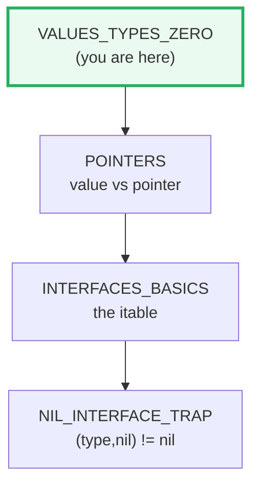
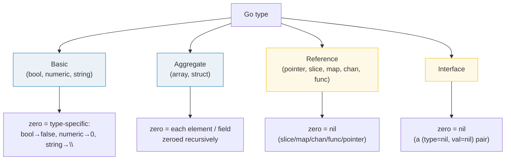

# VALUES_TYPES_ZERO — The Type System, Zero Values & Constants

> **Goal (one line):** by printing every value, show how Go's type system,
> zero initialization, variable declarations, and constants actually behave.
>
> **Run:** `go run values_types_zero.go`
>
> **Ground truth:** [`values_types_zero.go`](./values_types_zero.go) → captured
> stdout in [`values_types_zero_output.txt`](./values_types_zero_output.txt).
> Every number/table below is pasted **verbatim** from that file under a
> `> From values_types_zero.go Section X:` callout. Nothing is hand-computed.
>
> **Prerequisites:** none — this is Phase 1 bundle #1, the **style anchor**.
> **Sibling bundles come later**; they copy this structure.

---

## 1. Why this bundle exists (lineage)

Go was designed so that **no value is ever "uninitialized."** The moment
storage is allocated — by a `var`, a `new`, a composite literal, or a `make` —
every byte is written to a deterministic **zero value** before your code can
read it. That single design decision kills an entire class of bugs (use of
uninitialized memory) that plague C, and it makes Go's `err := f(); if err !=
nil` idiom possible: a freshly declared `error` *is* `nil` until something
assigns a real error to it.

This bundle is the **foundation of the expertise spine**. Everything downstream
depends on the mental model built here:

- 🔗 [`POINTERS`](./POINTERS.md) — a nil pointer is just the zero value of a
  pointer type; you cannot reason about `*p` safely until you understand that
  zero value.
- 🔗 [`STRINGS_RUNES_BYTES`](./STRINGS_RUNES_BYTES.md) — `byte` and `rune` are
  *aliases* (`byte = uint8`, `rune = int32`); this bundle pins that, so the
  strings bundle can build on it.
- 🔗 [`ARRAYS_SLICES`](./ARRAYS_SLICES.md) — the zero value of a slice is `nil`
  (not an empty allocated array); that distinction governs `len`/`append`/JSON
  marshalling behavior.



---

## 2. The mental model: type categories and their zero values

Go's types fall into four families. Each family has **one** rule for its zero
value, applied recursively:



> From `go.dev/ref/spec` — *The zero value*: storage is zeroed "when no explicit
> initialization is provided... `false` for booleans, `0` for numeric types, `""`
> for strings, and `nil` for pointers, functions, interfaces, slices, channels,
> and maps. This initialization is done recursively, so for instance each element
> of an array of structs will have its fields zeroed."

The recursive clause is the expert detail: a `struct{ P *int; S []int }` zero
value is `{ nil, nil }`; a `[3]struct{ N int }` zero value is
`[{0} {0} {0}]`. There is no "partially initialized" state.

---

## 3. Section A — The zero value of every type

One variable of each kind is declared **with no initializer**, then printed both
in human form (`%v`) and in Go-syntax form (`%#v`).

> From `values_types_zero.go` Section A:
> ```
> type        : zero value (human)        zero value (Go-syntax)
> ------------ ---------------------------------------------------------
> bool        : false   false
> int         : 0   0
> float64     : 0   0
> string      : ""   ``
> *int        : <nil>   (*int)(nil)
> func()      : <nil>   (func())(nil)
> any         : <nil>   <nil>
> []int       : []   []int(nil)
> map[..]..   : map[]   map[string]int(nil)
> chan int    : <nil>   (chan int)(nil)
> struct      : {0 false}   main.Point{N:0, B:false}
> [3]int      : [0 0 0]   [3]int{0, 0, 0}
> ```
> ```
> [check] bool zero is false: OK
> [check] int zero is 0: OK
> [check] float64 zero is 0: OK
> [check] string zero is "": OK
> [check] pointer zero is nil: OK
> [check] func zero is nil: OK
> [check] interface zero is nil: OK
> [check] slice zero is nil: OK
> [check] map zero is nil: OK
> [check] chan zero is nil: OK
> [check] struct zero is {0 false}: OK
> [check] array zero is [0 0 0]: OK
> ```

**What to notice**

- **`string` is never `nil`.** `var s string` is `""` (length 0). This trips
  converts-from-other-languages who write `if s == nil`. Use `if s == ""` (or
  `len(s) == 0`).
- **A nil slice/map/chan is still *usable* for reads.** `len(nilSlice) == 0`,
  `range nilSlice` does nothing, `nilMap[k]` returns the zero value. You only
  get a panic when you *write* to a nil map or *send* on a nil chan (in a
  non-select context). See 🔗 [`ARRAYS_SLICES`](./ARRAYS_SLICES.md).
- **`any` (alias for `interface{}`) prints `<nil>` for `%#v` too.** This is the
  *nil interface* — but beware the 🔗 [`NIL_INTERFACE_TRAP`](./NIL_INTERFACE_TRAP.md):
  an interface holding a nil *pointer* is **not** a nil interface. That trap is a
  (type, value) pair subtlety, covered in its own bundle.

---

## 4. Section B — `var` (zero-init) vs `:=` (short declaration)

> From `values_types_zero.go` Section B:
> ```
> var x int        -> x = 0  (zero value, not undefined)
> y := 42          -> y = 42, type = int
> y, z := 100, 200 -> y = 100, z = 200  (:= redeclares y, declares z)
> Note: := is legal only inside a function; package scope uses var.
> ```
> ```
> [check] var x int is the zero value 0: OK
> [check] y was reassigned to 100 by :=: OK
> [check] z is a brand-new variable == 200: OK
> ```

**What.** `:=` is syntactic sugar for `var <names> = <exprs>` with the types
inferred from the right-hand side. The spec is explicit
(*Short variable declarations*): a short declaration "is shorthand for a regular
variable declaration with initializer expressions but no types."

**Why (the two rules that bite).**

1. **`:=` is legal only inside a function body.** At package scope you must use
   `var`/`const`/`type`. (That is why every package-level declaration in this
   bundle's `.go` uses `var`/`const`, while the function bodies use `:=`.)
2. **`:=` may redeclare existing names *iff* at least one name on the left is
   new**, and all redeclared names were originally declared in the same block.
   In `y, z := 100, 200` above, `y` is reused (re-assigned) and `z` is created,
   so the statement is legal. `y := 100` *alone* (no new name) would be a
   compile error — use `y = 100` for a plain reassignment.

**Gotcha.** Redeclaration does **not** create a new variable; it assigns to the
old one. That matters for closures and address-taking: `&y` before and after the
redeclaration is the same location.

---

## 5. Section C — Constants: typed vs untyped (arbitrary precision)

```mermaid
graph LR
    L["literal / iota / expr<br/>(UNTYPED)"] -->|arbitrary precision,<br/>no overflow| U["untyped constant"]
    U -->|"used where a type<br/>is required"| DT["default type<br/>(bool/rune/int/float64/...)"]
    U -->|explicit conversion T(c)| T["typed value T"]
    U -->|assigned to typed const<br/>or typed var| T
    style U fill:#fef9e7,stroke:#f1c40f,stroke-width:3px
```

> From `values_types_zero.go` Section C:
> ```
> const Big = 1 << 100            (untyped, arbitrary precision)
> int64(Big >> 99) = 2            (exact untyped arithmetic, then convert)
> var fromUntyped = SmallUntyped  -> 1024, type int (default type of untyped int)
> var fromTyped   = SmallTyped    -> 1024, type int (explicit type)
> const true has default type bool
> ```
> ```
> [check] Big>>99 == 2 (untyped constants do not overflow): OK
> [check] untyped int const gets default type int: OK
> [check] typed const SmallTyped is int: OK
> ```

**What.** The spec (*Constants*): "Numeric constants represent exact values of
arbitrary precision and do not overflow." So `const Big = 1 << 100` is a
**legal untyped integer constant** even though it is far larger than any `int`.
A constant is *typed* only when you write a type in its declaration
(`const SmallTyped int = 1 << 10`) or it flows into a typed context.

**Why — the default type.** An untyped constant has a *default type* it adopts
the moment it is used where a typed value is required (a `var` decl with no
explicit type, an assignment, an operand in a typed expression). The default
types are exactly: `bool`, `rune`, `int`, `float64`, `complex128`, `string`.
That is why `var fromUntyped = SmallUntyped` yields an `int`, and why `true`
reports type `bool`.

**Gotcha — untyped ≠ free.** The moment an untyped constant is *converted or
assigned* to a concrete type, it must be representable in that type, or you get a
**compile error** (constants are checked at compile time):

```go
const Big = 1 << 100
var n int = Big       // COMPILE ERROR: constant 126765...0 overflows int
const TooBig int = Big // COMPILE ERROR: same — a typed const must fit its type
```

These two lines are deliberately **not** in the runnable file (they would not
compile). The bundle instead demonstrates the *legal* half: do exact arithmetic
on `Big` *while it is still untyped* (`Big >> 99`), then convert the small
result to `int64`.

---

## 6. Section D — `iota`: a counter that increments per ConstSpec

> From `values_types_zero.go` Section D:
> ```
> KB = 1 << (10*1) = 1024
> MB = 1 << (10*2) = 1048576
> GB = 1 << (10*3) = 1073741824
> Day enum: Sun=0 Mon=1 Tue=2 Wed=3 Thu=4 Fri=5 Sat=6
> ```
> ```
> [check] KB == 1024: OK
> [check] MB == 1048576: OK
> [check] GB == 1073741824: OK
> [check] Sunday (iota==0) == 0: OK
> [check] Saturday (iota==6) == 6: OK
> ```

**What.** `iota` is a predeclared *untyped integer* identifier. Per the Go Wiki
and spec: "The value of iota is reset to 0 whenever the reserved word `const`
appears... and incremented by one after each **ConstSpec** (e.g. each Line)."

The crucial word is **ConstSpec** — *one line of constants*, not one identifier.
`x, y = iota, iota+10` is a *single* ConstSpec, so both `x` and `y` see the same
`iota` value.

**Why the KB/MB/GB pattern works.** In the bundle's const block, the first line
`_ = iota` consumes `iota == 0` (discarded). The second line
`KB = 1 << (10 * iota)` is at `iota == 1`, so `KB = 1 << 10 = 1024`. The next two
lines (`MB`, `GB`) are *shorthand*: they repeat the previous line's expression
verbatim but at `iota == 2` and `iota == 3`, giving `1 << 20` (1048576) and
`1 << 30` (1073741824). The `_ = iota` offset is the idiomatic way to make the
named constants start at a sensible value.

**Why the Day enum is typed.** `type Day int` then
`const ( Sunday Day = iota; ... )` gives every day the concrete type `Day` (not
untyped `int`). The first name carries both the type and the `= iota`; every
following name repeats both. This is how you get a type-safe enumeration — `Day`
and `int` are distinct types, so you cannot accidentally pass a raw `3` where a
`Day` is required without a conversion.

---

## 7. Section E — Numeric kinds, aliases & IEEE-754 limits

> From `values_types_zero.go` Section E:
> ```
> strconv.IntSize = 64   (width of int/uint on this machine)
> var by byte = 200  -> type uint8, value 200
> var r rune = '世'  -> type int32, codepoint 19990
> const (0.1+0.2) == 0.3 ? true   (constant expression, arbitrary precision)
> var   (0.1+0.2) = 0.30000000000000004   (literal 0.3 = 0.3)   equal? false
> ```
> ```
> [check] strconv.IntSize == 64 on this machine: OK
> [check] byte aliases uint8 (same type name): OK
> [check] rune aliases int32 (same type name): OK
> [check] rune '世' == 19990 (U+4E16): OK
> [check] constant 0.1+0.2 == 0.3 (arbitrary precision): OK
> [check] runtime float64 0.1+0.2 != 0.3 (IEEE-754): OK
> ```

**The four numeric kinds, pinned:**

| Kind | Type(s) | Notes |
|---|---|---|
| Signed/unsigned ints | `int8`…`int64`, `uint8`…`uint64`, `int`, `uint`, `uintptr` | All are **distinct defined types**; `int`/`uint` are the *machine word* (64-bit on amd64/arm64, hence `strconv.IntSize == 64`). |
| Floats | `float32`, `float64` | IEEE-754 binary32 / binary64. `float64` is the default. |
| Complex | `complex64`, `complex128` | Built from float32/float64 pairs. |
| Aliases | `byte = uint8`, `rune = int32` | True aliases (same type); `%T` reports the underlying name (`uint8`, `int32`). |

> From `pkg.go.dev/builtin`: `int` is "a signed integer type that is at least 32
> bits in size... a distinct type, however, and not an alias for, say, int32."
> And: `byte = uint8`, `rune = int32`. And from `pkg.go.dev/strconv`:
> `IntSize` is "the size in bits of an int or uint value."

**The expert detail: `int` is *intentionally* platform-dependent.** Code that
assumes `int` is 32-bit breaks on 64-bit machines and vice versa. The only
guarantee is "≥ 32 bits." Use `int32`/`int64` explicitly when the bit width
matters (file formats, wire protocols, `strconv.ParseInt` sizes). `uintptr`
exists solely to hold a pointer's bit pattern — never use it for arithmetic.

**The float gotcha that is *also* a constant gotcha.** This bundle demonstrates
a subtlety most tutorials miss. The famous "0.1 + 0.2 != 0.3" is a **runtime
float64** phenomenon. But written with *untyped constant operands*,
`0.1 + 0.2` is a **constant expression** evaluated at arbitrary precision, and
it **does** equal the constant `0.3` — the rounding error only appears once the
operands are forced into 64-bit floats:

```go
const constSum = 0.1 + 0.2 // CONSTANT expr: arbitrary precision -> == 0.3
var one, two float64 = 0.1, 0.2
rtSum := one + two          // RUNTIME f64 add -> 0.30000000000000004
```

This is why the bundle has **two** checks: one asserting the constant *equals*
0.3, one asserting the runtime sum *does not*. Never compare floats with `==`
for values computed at runtime; use an epsilon or `math/big.Rat`/`decimal`.

---

## 8. Section F — Booleans are not numbers (no truthiness)

> From `values_types_zero.go` Section F:
> ```
> 1 < 2 -> true   3 == 3 -> true   5 > 9 -> false   (all type bool)
> var b bool = true -> type bool, value true
> ```
> ```
> [check] 1 < 2 yields type bool: OK
> [check] 3 == 3 is true: OK
> [check] 5 > 9 is false: OK
> [check] true literal has default type bool: OK
> ```

**What.** Go's `bool` is its own type. It is **not** a numeric subtype, and
there is **no** implicit conversion in either direction. The only way to obtain
a `bool` value is from a comparison/relational/logical operator
(`==`, `!=`, `<`, `>`, `&&`, `||`, `!`), from a `bool` literal, or from a
function returning `bool`.

**Why — the compile errors you cannot put in a runnable file.** Both of these
are rejected by the compiler (so they are documented here, not in the `.go`):

```go
if 1 { /* ... */ }   // COMPILE ERROR: non-bool used as if condition
var b bool = true
_ = b + 1            // COMPILE ERROR: invalid operation: bool + int
var n int = 1
if n { /* ... */ }   // COMPILE ERROR: non-bool used as if condition
```

Contrast with **C** (where `if (1)` works and every non-zero int is "true") and
**Python** (where `if 1`, `if []`, `if "x"` all work via truthiness). Go's
choice is deliberate: it eliminates an entire class of
`if (n = foo())`-style bugs and forces every condition to be an explicit
boolean expression.

> From the Go spec (*If statements*) and corroborated widely: the condition of
> an `if`/`for`/`switch` "must be of boolean type." `true` and `false` are the
> two predeclared *untyped boolean constants*, whose default type is `bool`.

---

## 9. Pitfalls (the expert payoff)

| Trap | Symptom | Fix |
|---|---|---|
| Comparing a `string` to `nil` | Compile error: `cannot compare s != nil` | Strings are never nil; test `s == ""` or `len(s) == 0`. |
| Writing to a nil map | Runtime panic: `assignment to entry in nil map` | `m = make(map[K]V)` before the first write. (Reads on a nil map are fine.) |
| Sending on a nil channel | Blocks forever (or panics on `close`) | Initialize with `make(chan T)`; never assume a zero-value chan is usable. |
| `if x { }` where `x` is `int`/`error` | Compile error: non-bool condition | Write the explicit test: `if x != 0`, `if err != nil`. |
| `var n int = 1 << 100` (untyped const into int) | Compile error: constant overflows int | Keep it untyped, or shift down first (`int64(Big >> 99)`), or use `big.Int`. |
| Assuming `int` is 32-bit | Silent overflow / wrong sizes on 64-bit | Use `int32`/`int64` when bit width matters; read `strconv.IntSize`. |
| `0.1 + 0.2 == 0.3` at runtime | Silently `false` | Compare with an epsilon; use `big.Rat`/`decimal` for money. |
| Treating `:=` redeclaration as a new variable | Closures/`&x` see the *old* storage | Redeclaration only re-assigns; the address does not change. |
| `x, y := iota, iota+10` expecting different iotas | `x` and `y` get the **same** iota | `iota` increments per *ConstSpec* (line), not per identifier. |
| Interface holding nil pointer compared to nil | `if i == nil` is `false` (the 🔗 NIL_INTERFACE_TRAP) | Check the concrete type/value, not the interface, before using. |

---

## 10. Cheat sheet

```go
// Zero values (applied recursively)
//   bool -> false      numeric -> 0        string -> ""
//   pointer/func/slice/map/chan -> nil     interface -> nil (type,val)=(nil,nil)
//   struct -> { each field zero }          array -> [ each elem zero ]

// Declarations
var n int          // zero-initialized
x := 42            // := ONLY inside a func; needs >=1 new LHS name to redeclare
const Pi = 3.14159 // untyped (default type float64); arbitrary precision, no overflow
const K int = 1024 // typed int const (must fit)

// iota: resets 0 per const block, +1 per ConstSpec (line)
const ( _ = iota; KB = 1 << (10*iota); MB; GB ) // 1024, 1<<20, 1<<30

// Kinds
//   int/uint  = machine word (strconv.IntSize bits, >=32)
//   byte=uint8 alias   rune=int32 alias   float64 = IEEE-754 binary64
//   bool is NOT numeric: if/for/switch conditions must be bool; no truthiness
```

---

## Sources

Every signature, value, and behavioral claim above was verified against the
Go specification and standard-library docs:

- The Go Programming Language Specification — https://go.dev/ref/spec
  - *Variables*: https://go.dev/ref/spec#Variables
  - *Constants* (untyped, arbitrary precision, default type): https://go.dev/ref/spec#Constants
  - *The zero value*: https://go.dev/ref/spec#The_zero_value
  - *Numeric types* (`byte`/`rune` aliases, `int` distinct & platform-sized): https://go.dev/ref/spec#Numeric_types
  - *Short variable declarations* (`:=` redeclare rule, "only inside functions"): https://go.dev/ref/spec#Short_variable_declarations
  - *Constant declarations* / *Iota*: https://go.dev/ref/spec#Iota
  - *If statements* (condition "must be of boolean type"): https://go.dev/ref/spec#If_statements
- Go Wiki: Iota — https://go.dev/wiki/Iota  (iota resets per const block, +1 per ConstSpec; KB/MB/GB worked example)
- `builtin` package (predeclared identifiers) — https://pkg.go.dev/builtin
  - `byte = uint8`, `rune = int32`, `int` ("distinct type, not an alias"), `iota` ("Untyped int"), `nil` (zero of pointer/chan/func/interface/map/slice), `bool`
- `strconv` package — https://pkg.go.dev/strconv  (`const IntSize` = "size in bits of an int or uint value")
- Effective Go (constants & iota) — https://go.dev/doc/effective_go

**Facts that could not be verified by running** (documented, not executed, since
they are compile errors by design): `var n int = 1 << 100` overflows; `const TooBig int = 1 << 100` overflows; `if 1 { }` and `b + 1` are rejected by the
compiler. These are confirmed by the spec sections cited above, not reproduced as
runnable output (a file containing them would not build).
