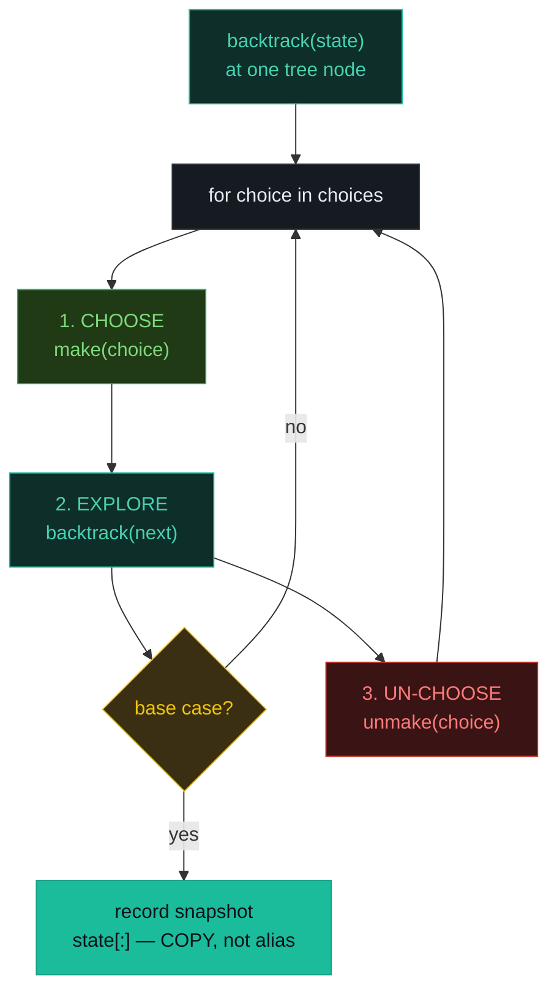
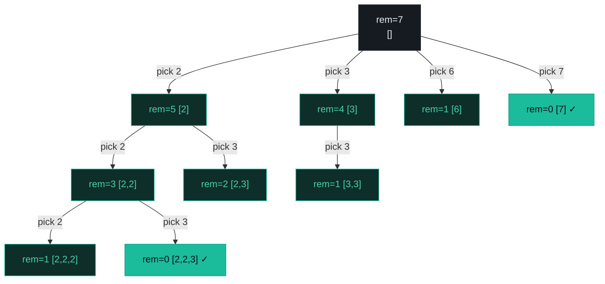
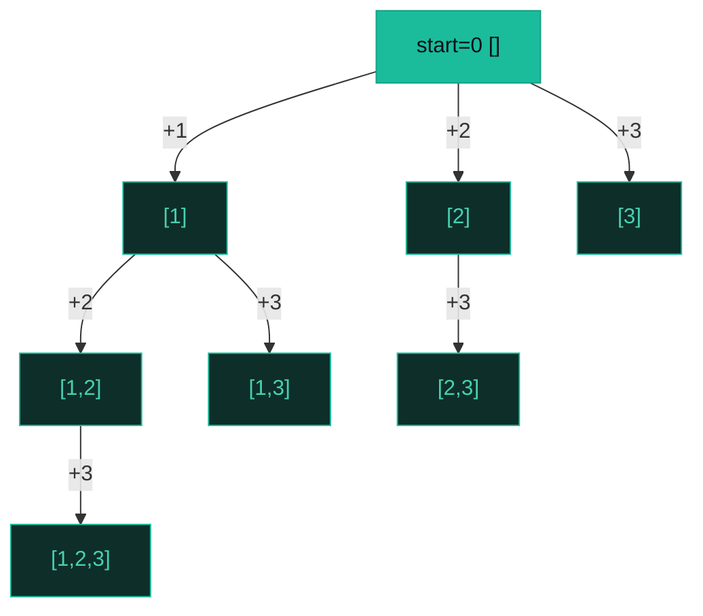
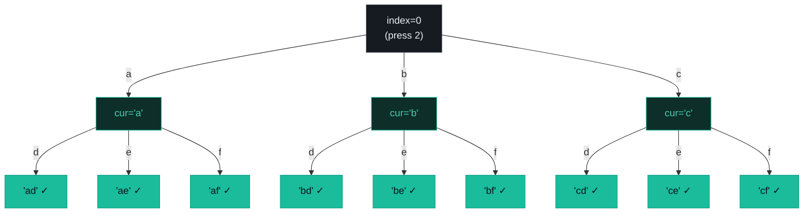

# Backtracking + Subsets — Permutations, Combination Sum, Subsets, Letter Combos — A Visual, Worked-Example Guide

> **Companion code:** [`backtracking.py`](./backtracking.py). **Every number is printed by
> `python3 backtracking.py`** — nothing is hand-computed.
>
> **Live animation:** [`backtracking.html`](./backtracking.html) — open in a browser, step the decision tree yourself.

---

## 0. TL;DR — the one idea

> **The analogy (read this first):** You are walking through a maze. At every junction you pick a direction, walk down it, and if it dead-ends you **retrace exactly one step** and try the next direction. Backtracking is that, on an implicit **decision tree**: at every node you *choose* a move, *explore* the subtree it opens, and if that subtree fails or completes you *un-choose* the move so the next sibling starts from a clean slate.
>
> The whole pattern is a three-line loop body — repeated at every node:
> ```
> for choice in choices_at_this_level:
>     make(choice)            # CHOOSE    — mutate shared state
>     backtrack(next_state)   # EXPLORE   — recurse one level deeper
>     unmake(choice)          # UN-CHOOSE — restore shared state (CRITICAL)
> ```
> Every problem below differs in only **what** the choice is, **when** you record a solution, and **how** you prune.



**Subsets is not a separate pattern** — it is backtracking where you record at *every* node (each prefix is a subset) and there is no pruning. The four problems differ in three knobs:

```mermaid
graph LR
    subgraph KNOBS["the three knobs every problem sets"]
        A["WHAT is a choice?<br/>swap / append / place letter"] --> P046["P046 Permutations"]
        A --> P039["P039 Comb. Sum"]
        A --> P078["P078 Subsets"]
        A --> P017["P017 Letters"]
        B["WHEN to record?<br/>leaf / every node / sum==0"] --> P046
        B --> P039
        B --> P078
        B --> P017
        C["HOW to prune?<br/>sorted-break / none / constraint"] --> P046
        C --> P039
        C --> P078
        C --> P017
    end
    style A fill:#0e2e29,stroke:#1abc9c,color:#48d1b0
    style B fill:#0e2e29,stroke:#1abc9c,color:#48d1b0
    style C fill:#0e2e29,stroke:#1abc9c,color:#48d1b0
    style P046 fill:#1abc9c,stroke:#16a085,color:#0d1117
    style P039 fill:#1abc9c,stroke:#16a085,color:#0d1117
    style P078 fill:#1abc9c,stroke:#16a085,color:#0d1117
    style P017 fill:#1abc9c,stroke:#16a085,color:#0d1117
    style KNOBS fill:#0d1117,stroke:#30363d
```



---

### Pattern Recognition Signals

| Signal in the problem statement | → Use this pattern |
|---|---|
| "return **all** permutations / orderings" of distinct items | ✓ swap-based backtracking (P046) |
| "return **all** combinations summing to target" + reuse allowed | ✓ sort + `break` prune, recurse with `i` (P039) |
| "return **all** subsets / the power set" | ✓ record at every node, `start = i+1` (P078) |
| "all strings from **pressing keys** / a phone number" | ✓ one level per digit, loop letters (P017) |
| "find a **valid** arrangement" (N-Queens, Sudoku) under a constraint | ✓ backtracking with heavy pruning |
| "find **all** paths / **enumerate** configurations" | ✓ backtracking over choices |
| input is **small** (N ≤ 20) and you want *every* answer, not the best | ✓ backtracking (exponential is OK at this size) |
| "**maximize** / **minimize** / count ways with overlapping subproblems" | ✗ use **dynamic programming** instead |
| "shortest path / min steps" on a grid or graph | ✗ use **BFS** |
| "next greater/smaller element" or largest rectangle | ✗ use **monotonic stack** |

---

### The Template Skeleton

```python
# The universal backtracking loop — memorize the body. Four variants follow.

def backtrack(state):
    if base_case(state):
        results.append(state[:])        # ALWAYS copy — never alias the mutable path
        return
    for choice in choices_at_this_level:
        choose(choice)                  # mutate shared state
        backtrack(next_state(state))    # recurse one level deeper
        unchoose(choice)                # restore (CRITICAL — pairs with choose)


# ---- 1. PERMUTATIONS via swap (P046) — choose = swap, no start index ----
def permute(nums):
    result = []
    def backtrack(first=0):
        if first == len(nums):
            result.append(nums[:])              # snapshot
            return
        for i in range(first, len(nums)):
            nums[first], nums[i] = nums[i], nums[first]   # choose (swap)
            backtrack(first + 1)                           # explore
            nums[first], nums[i] = nums[i], nums[first]   # un-choose
    backtrack()
    return result
# O(n * n!) time, O(n) space


# ---- 2. COMBINATION SUM w/ reuse (P039) — choose = append, recurse with i ----
def combination_sum(candidates, target):
    result, cands = [], sorted(candidates)       # sort enables the break-prune
    def backtrack(start, remaining, path):
        if remaining == 0:
            result.append(path[:]); return
        for i in range(start, len(cands)):
            if cands[i] > remaining: break       # sorted -> prune the rest
            path.append(cands[i])                # choose
            backtrack(i, remaining - cands[i], path)   # i (not i+1): reuse OK
            path.pop()                           # un-choose
    backtrack(0, target, [])
    return result
# O(2^t) worst, t = target / min(candidates)


# ---- 3. SUBSETS / power set (P078) — record at EVERY node, start = i+1 ----
def subsets(nums):
    result = []
    def backtrack(start, path):
        result.append(path[:])                   # record EVERY node (not just leaves)
        for i in range(start, len(nums)):
            path.append(nums[i])                 # choose
            backtrack(i + 1, path)               # i+1: walk forward, no reuse
            path.pop()                           # un-choose
    backtrack(0, [])
    return result
# O(n * 2^n) time, O(n) space


# ---- 4. LETTER COMBINATIONS (P017) — one level per digit ----
MAP = {"2":"abc","3":"def","4":"ghi","5":"jkl","6":"mno","7":"pqrs","8":"tuv","9":"wxyz"}
def letter_combinations(digits):
    if not digits: return []
    result = []
    def backtrack(index, current):
        if index == len(digits):
            result.append("".join(current)); return
        for ch in MAP[digits[index]]:
            current.append(ch)                   # choose
            backtrack(index + 1, current)        # explore next digit
            current.pop()                        # un-choose
    backtrack(0, [])
    return result
# O(4^n * n) worst (digits 7,9 have 4 letters)
```

---

## 1. P046 Permutations

> **Problem:** Given an array of distinct integers, return all possible permutations.
> **Key insight:** Swap each unused element into position `first`, recurse to fill the next slot, then swap back. No `used` set needed — every index `< first` is already locked.

### Worked example — `[1, 2, 3]` → 6 permutations

> From `backtracking.py` Section A. `nums = [1, 2, 3]`, expect `3! = 6` permutations. The swap-based decision tree (indented by recursion depth):

```
[+] swap(0,0)  [1,2,3] -> [1,2,3]
    [+] swap(1,1)  [1,2,3] -> [1,2,3]
        [+] swap(2,2)  [1,2,3] -> [1,2,3]
            [=] first=3==n  ->  record [1,2,3]
        [-] undo swap(2,2)  -> [1,2,3]
    [-] undo swap(1,1)  -> [1,2,3]
    [+] swap(1,2)  [1,2,3] -> [1,3,2]
        [+] swap(2,2)  [1,3,2] -> [1,3,2]
            [=] first=3==n  ->  record [1,3,2]
        [-] undo swap(2,2)  -> [1,3,2]
    [-] undo swap(1,2)  -> [1,2,3]
[-] undo swap(0,0)  -> [1,2,3]
[+] swap(0,1)  [1,2,3] -> [2,1,3]   ... (and so on: [2,1,3],[2,3,1],[3,2,1],[3,1,2])
```

> Tree stats: **15 chooses, 6 recorded, 15 undos.** Each of the 6 leaves is one permutation; every `choose` is paired with exactly one `un-choose`.

`permute([1, 2, 3]) -> [[1,2,3], [1,3,2], [2,1,3], [2,3,1], [3,2,1], [3,1,2]]`

```mermaid
graph TD
    R["first=0<br/>[1,2,3]"] -->|swap(0,0)| A1["first=1 [1,2,3]"]
    R -->|swap(0,1)| A2["first=1 [2,1,3]"]
    R -->|swap(0,2)| A3["first=1 [3,2,1]"]
    A1 -->|swap(1,1)| B1["[1,2,3] ✓"]
    A1 -->|swap(1,2)| B2["[1,3,2] ✓"]
    A2 -->|swap(1,1)| B3["[2,1,3] ✓"]
    A2 -->|swap(1,2)| B4["[2,3,1] ✓"]
    A3 -->|swap(1,1)| B5["[3,2,1] ✓"]
    A3 -->|swap(1,2)| B6["[3,1,2] ✓"]
    style R fill:#161b22,stroke:#30363d,color:#e6edf3
    style A1 fill:#0e2e29,stroke:#1abc9c,color:#48d1b0
    style A2 fill:#0e2e29,stroke:#1abc9c,color:#48d1b0
    style A3 fill:#0e2e29,stroke:#1abc9c,color:#48d1b0
    style B1 fill:#1abc9c,stroke:#16a085,color:#0d1117
    style B2 fill:#1abc9c,stroke:#16a085,color:#0d1117
    style B3 fill:#1abc9c,stroke:#16a085,color:#0d1117
    style B4 fill:#1abc9c,stroke:#16a085,color:#0d1117
    style B5 fill:#1abc9c,stroke:#16a085,color:#0d1117
    style B6 fill:#1abc9c,stroke:#16a085,color:#0d1117
```

**Edge cases** (from `backtracking.py` Section A): `[0,1] → [[0,1],[1,0]]` (2!); `[1] → [[1]]` (1!); `[1,1] → [[1,1],[1,1]]` — the swap approach treats equal *values* as distinct *positions* (use the sorted + `used` guard for P047 Permutations II).

---

## 2. P039 Combination Sum

> **Problem:** Given candidates (no duplicates) and a target, return all unique combinations summing to target. Each candidate may be used **unlimited times**.
> **Key insight:** Two tricks turn brute force into backtracking: (1) **sort** so the loop can `break` the instant a candidate exceeds the remaining budget (every later candidate is `>=` and also too big); (2) recurse with `i` (not `i+1`) so the same candidate can be picked again on the next level.

### Worked example — `candidates=[2,3,6,7], target=7` → `[[2,2,3],[7]]`

> From `backtracking.py` Section B. The `[x]` rows are branches **pruned** by the sorted-break — dead subtrees that never recurse.

```
[+] pick 2  rem 7->5  path=[2]
    [+] pick 2  rem 5->3  path=[2,2]
        [+] pick 2  rem 3->1  path=[2,2,2]
            [x] cands[0]=2 > rem=1  ->  break (rest pruned)
        [+] pick 3  rem 3->0  path=[2,2,3]
            [=] rem==0  ->  record [2,2,3]
            [x] cands[1]=3 > rem=0  ->  break (rest pruned)
        [x] cands[2]=6 > rem=3  ->  break (rest pruned)
    [+] pick 3  rem 5->2  path=[2,3]
        [x] cands[1]=3 > rem=2  ->  break (rest pruned)
    [x] cands[2]=6 > rem=5  ->  break (rest pruned)
[+] pick 3  rem 7->4  path=[3]      ... (pruned subtree, no solution)
[+] pick 6  rem 7->1  path=[6]
    [x] cands[2]=6 > rem=1  ->  break (rest pruned)
[+] pick 7  rem 7->0  path=[7]
    [=] rem==0  ->  record [7]
```

> Tree stats: **9 chooses, 2 recorded, 9 prunes, 9 undos.** The 9 `[x]` prunes are dead branches killed by the sorted-break *before* any recursive call — that is the whole point of sorting.

`combination_sum([2, 3, 6, 7], 7) -> [[2, 2, 3], [7]]`



**Edge cases** (from `backtracking.py` Section B): `combination_sum([2,3,5],8) → [[2,2,2,2],[2,3,3],[3,5]]`; `combination_sum([2],1) → []` (no candidate `<= 1`); `combination_sum([],1) → []`.

---

## 3. P078 Subsets

> **Problem:** Given an array of distinct integers, return all possible subsets (the power set).
> **Key insight:** Subsets IS backtracking with two relaxations: record at **every** node (each prefix is a valid subset), and no pruning (we want everything). The `start = i+1` index walks strictly forward so each subset is emitted exactly once.

### Worked example — `[1, 2, 3]` → 8 subsets

> From `backtracking.py` Section C. The `[*]` rows are the subsets — recorded at **entry** to every node, not just at leaves.

```
[*] record []  (every node)
[+] +1  -> [1]
    [*] record [1]
    [+] +2  -> [1,2]
        [*] record [1,2]
        [+] +3  -> [1,2,3]
            [*] record [1,2,3]
        [-] pop 3  -> [1,2]
    [-] pop 2  -> [1]
    [+] +3  -> [1,3]
        [*] record [1,3]
    [-] pop 3  -> [1]
[-] pop 1  -> []
[+] +2  -> [2]
    [*] record [2]
    [+] +3  -> [2,3]
        [*] record [2,3]
    [-] pop 3  -> [2]
[-] pop 2  -> []
[+] +3  -> [3]
    [*] record [3]
[-] pop 3  -> []
```

> Tree stats: **8 records, 7 chooses, 7 undos.** The 8 `[*]` records = `2^3` subsets (including the empty set, recorded at the root before any choice).

`subsets([1, 2, 3]) -> [[], [1], [1,2], [1,2,3], [1,3], [2], [2,3], [3]]`



Every node (8 of them) is a subset; the edges are the *include* choices. The implicit *exclude* branches are what the `start` index skips — that is why there are no duplicate subsets.

**Edge cases** (from `backtracking.py` Section C): `subsets([0]) → [[],[0]]` (`2^1`); `subsets([]) → [[]]` (`2^0 = 1`, just the empty set).

---

## 4. P017 Letter Combinations of a Phone Number

> **Problem:** Given a string of digits 2–9, return all letter combinations the number could represent (old phone keypad: 2→abc, 3→def, …, 7→pqrs, 9→wxyz).
> **Key insight:** One recursion level per digit. At each level, loop over every letter on that key, append it, recurse to the next digit, pop it. Base case: `index == len(digits)`.

### Worked example — `digits = "23"` → 9 strings

> From `backtracking.py` Section D. Key map: `2->abc, 3->def, 4->ghi, 5->jkl, 6->mno, 7->pqrs, 8->tuv, 9->wxyz`.

```
[+] digit '2' -> 'a'   cur='a'
    [+] digit '3' -> 'd'   cur='ad'
        [=] index==2  ->  record 'ad'
    [+] digit '3' -> 'e'   cur='ae'
        [=] index==2  ->  record 'ae'
    [+] digit '3' -> 'f'   cur='af'
        [=] index==2  ->  record 'af'
[+] digit '2' -> 'b'   cur='b'   ... ('bd','be','bf')
[+] digit '2' -> 'c'   cur='c'   ... ('cd','ce','cf')
```

> Tree stats: **12 chooses, 9 recorded, 12 undos.** The 9 leaves = `3 × 3` (digits 2 and 3 each have 3 letters). With digits 7 or 9 the branching factor is 4.

`letter_combinations("23") -> ["ad","ae","af","bd","be","bf","cd","ce","cf"]`



**Edge cases** (from `backtracking.py` Section D): `letter_combinations("") → []` (empty input → empty list, *not* `[""]`); `letter_combinations("2") → ["a","b","c"]` (single digit); `letter_combinations("7") → ["p","q","r","s"]` (digit 7 has 4 letters).

---

### Complexity

> From `backtracking.py` Section E.

| Operation | Time | Space |
|---|---|---|
| Permutations, swap-based (P046) | O(n · n!) | O(n) |
| Combination Sum, reuse (P039) | O(2ᵗ) worst | O(t / min) |
| Subsets / power set (P078) | O(n · 2ⁿ) | O(n) |
| Letter combinations (P017) | O(4ⁿ · n) | O(n) |
| Combinations C(n, k) (P077) | O(C(n,k) · k) | O(k) |
| N-Queens (P051) | O(n!) | O(n) |

*n = input size; t = target / min(candidates).* All are exponential — the goal of backtracking is to **prune**, not to avoid exponential.

### Killer Gotchas

1. **Aliasing:** `results.append(path)` stores a *reference*. A later `path.pop()` mutates every entry in `results`. Always append a **copy**: `path[:]` for lists, `"".join(current)` for strings.
2. **Missing un-choose:** Forget `path.pop()` and choices leak into sibling branches, corrupting the whole search. Every `choose` needs a matching `unchoose`, paired like `malloc`/`free`.
3. **Wrong start index:** combinations/subsets recurse with `i+1` (move forward, no reuse); Combination Sum recurses with `i` (same element may be picked again). Swapping them yields duplicates or missed solutions.
4. **Pruning unsorted input:** `break when cands[i] > remaining` only works *after* sorting. On unsorted input a smaller valid number may appear later and you would skip it. **Sort first.**
5. **Duplicates (P090 Subsets II):** sort, then add `if i > start and nums[i] == nums[i-1]: continue`. The `i > start` guard dedupes siblings at one tree level but allows the same value deeper down a single branch.
6. **Subsets vs Combinations:** subsets records at **every** node; combinations records **only** when `len(path) == k`. Same skeleton, different base case.

### Problem Table

> From `backtracking.py` Section E.

| Problem | Essence | Key Trick |
|---|---|---|
| P046 Permutations | All orderings of distinct items | swap each `i >= first` into place; undo swap |
| P039 Combination Sum | Combos summing to target, reuse | sort + `break` prune; recurse with `i` (reuse) |
| P078 Subsets | Power set, unique elements | record at every node; `start = i+1` walks forward |
| P017 Letter Combinations | Strings from phone keypad | one level per digit; loop letters on the key |
| P077 Combinations | Choose k from [1..n] | like subsets but record only at `len(path) == k` |
| P090 Subsets II | Power set with duplicates | sort + `i > start` dedup skips duplicate siblings |
| P040 Combination Sum II | Sum to target, each once | sort + `i > start` dedup; no reuse (`i+1`) |
| P047 Permutations II | Perms with duplicate values | sort + `i > 0 and not used[i-1]` guard |
| P051 N-Queens | Place n non-attacking queens | row by row; prune cols + both diagonals |
| P037 Sudoku Solver | Fill 9×9 validly | try 1–9 per empty cell; prune row/col/box |
| P079 Word Search | Find word in grid | DFS 4 dirs; mark visited, unmark on undo |
| P131 Palindrome Partitioning | Split into palindromes | backtrack cut points; check palindrome prefix |
