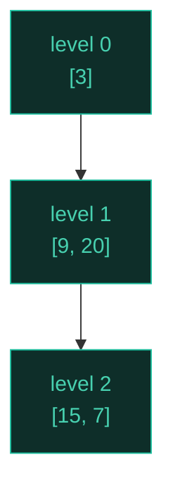
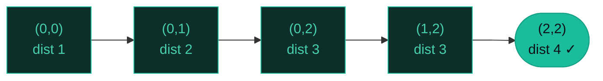
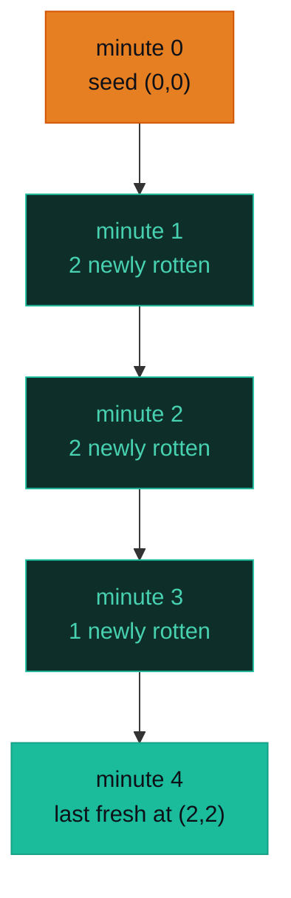

# BFS — Rotting Oranges, Shortest Path, Level Order — A Visual, Worked-Example Guide

> **Companion code:** [`bfs.py`](./bfs.py). **Every number is printed by
> `python3 bfs.py`** — nothing is hand-computed.
>
> **Live animation:** [`bfs.html`](./bfs.html) — open in a browser, step the wavefront yourself.

---

## 0. TL;DR — the one idea

> **The analogy (read this first):** Drop a stone in still water. Ripples spread outward in concentric rings — every point 1 inch away gets wet at the same moment, then every point 2 inches away, then 3 inches...
>
> BFS works exactly like that. A queue holds the current **ring** of cells. On each step you drain the *whole* ring (a wave), and as you drain it you enqueue every freshly-touched neighbour — those become the *next* ring. Because every cell in ring `k` is reached in exactly `k` steps, the **first** time BFS arrives at a target it has used the **shortest** path.

```mermaid
graph LR
    subgraph WAVE["Wave expansion: drain one ring, enqueue the next"]
        S0(("source")) --> W1["ring 1<br/>1 step"]
        W1 --> W2["ring 2<br/>2 steps"]
        W2 --> W3["ring 3<br/>3 steps"]
        W3 --> T(["target<br/>first arrival<br/>= SHORTEST"])
    end
    style S0 fill:#e67e22,stroke:#d35400,color:#0d1117
    style W1 fill:#0e2e29,stroke:#1abc9c,color:#48d1b0
    style W2 fill:#0e2e29,stroke:#1abc9c,color:#48d1b0
    style W3 fill:#0e2e29,stroke:#1abc9c,color:#48d1b0
    style T fill:#1abc9c,stroke:#16a085,color:#0d1117
    style WAVE fill:#0d1117,stroke:#30363d
```



The whole pattern is one loop. Change **what you seed the queue with** (one source vs many) and **how you count steps** to get all three problems:

```python
from collections import deque

queue = deque(sources)                # seed: ONE source (P1091) or MANY (P994)
visited = set(sources)                # MARK ON ENQUEUE - never on dequeue
steps = 0
while queue:
    for _ in range(len(queue)):       # <-- snapshot ring size BEFORE draining
        node = queue.popleft()
        for nxt in neighbors(node):
            if nxt not in visited:
                visited.add(nxt)      # mark BEFORE enqueue
                queue.append(nxt)
    steps += 1
```

---

### Pattern Recognition Signals

| Signal in the problem statement | → Use this pattern |
|---|---|
| "shortest path" / "minimum steps" on an **unweighted** graph or grid | ✓ single-source BFS (P1091) |
| "minimum minutes/days to spread" / radiation / infection on a grid | ✓ multi-source BFS (P994) |
| "level by level" / "row by row" traversal of a tree | ✓ tree level-order BFS (P102) |
| "nearest/closest" distance from every cell to some target | ✓ multi-source BFS (P542 01 Matrix) |
| "valid ordering of courses" / "can all be scheduled" (DAG) | ✓ Kahn's topological BFS (P207) |
| Weighted graph with variable edge costs | ✗ use **Dijkstra**, not plain BFS |
| Count *all* paths / enumerate configurations | ✗ use **DFS / backtracking** |

---

### The Template Skeleton

```python
# The interview starting point — memorize this. Three variants share it.
from collections import deque


def bfs_template(sources, neighbors_fn, is_target=None):
    """sources: iterable of distance-0 starting cells/nodes."""
    queue = deque(sources)
    visited = set(sources)                  # CRITICAL: mark on enqueue
    steps = 0
    while queue:
        for _ in range(len(queue)):         # ring boundary snapshot
            node = queue.popleft()
            if is_target and is_target(node):
                return steps                # shortest distance
            for nxt in neighbors_fn(node):
                if nxt not in visited:
                    visited.add(nxt)        # mark BEFORE enqueue
                    queue.append(nxt)
        steps += 1
    return -1                               # target unreachable


# TREE VARIANT (P102) — snapshot len(queue) per level, no distance counter
def level_order(root):
    if not root:
        return []
    result, queue = [], deque([root])
    while queue:
        level_size = len(queue)             # <-- level boundary
        level = []
        for _ in range(level_size):
            node = queue.popleft()
            level.append(node.val)
            if node.left:  queue.append(node.left)
            if node.right: queue.append(node.right)
        result.append(level)
    return result


# GRID MULTI-SOURCE VARIANT (P994) — "if queue: minutes += 1" guards off-by-1
def oranges_rotting(grid):
    rows, cols = len(grid), len(grid[0])
    queue = deque()
    fresh = 0
    for r in range(rows):
        for c in range(cols):
            if grid[r][c] == 2: queue.append((r, c))   # all sources at dist 0
            elif grid[r][c] == 1: fresh += 1
    if fresh == 0: return 0
    minutes = 0
    DIRS = [(0, 1), (0, -1), (1, 0), (-1, 0)]
    while queue:
        for _ in range(len(queue)):
            r, c = queue.popleft()
            for dr, dc in DIRS:
                nr, nc = r + dr, c + dc
                if 0 <= nr < rows and 0 <= nc < cols and grid[nr][nc] == 1:
                    grid[nr][nc] = 2       # rot in place = mark visited
                    fresh -= 1
                    queue.append((nr, nc))
        if queue:                          # <-- guard against empty trailing wave
            minutes += 1
    return minutes if fresh == 0 else -1
```

---

## 1. P102 Binary Tree Level Order Traversal

> **Problem:** Return the values of a binary tree level by level, each level in its own list.
> **Key insight:** The queue naturally separates levels if you **snapshot `len(queue)`** before the inner loop and drain exactly that many nodes. Children enqueued during the drain belong to the *next* level — they don't pollute the current one.

### Worked example — tree `3 / 9 20 / _ _ 15 7`

> From `bfs.py` Section A. Tree (LeetCode): `3,9,20,null,null,15,7`.

```
        3
       / \
      9   20
         /  \
        15    7
```

| level | ring_size | values | queue after |
|---|---|---|---|
| 0 | 1 | `[3]` | `[9, 20]` |
| 1 | 2 | `[9, 20]` | `[15, 7]` |
| 2 | 2 | `[15, 7]` | `[]` |

`level_order -> [[3], [9, 20], [15, 7]]`



**Edge cases** (from `bfs.py` Section A): empty tree → `[]`; single node `[1]` → `[[1]]`; left-skewed `[1, 2, None, 3]` → `[[1], [2], [3]]`.

---

## 2. P1091 Shortest Path Binary Matrix

> **Problem:** Length of the shortest clear-path from `(0,0)` to `(n-1,n-1)` in an `n×n` binary matrix. Passable cells are `0`; moves allowed in **8 directions**.
> **Key insight:** Single-source BFS from `(0,0)`. Mark visited **by mutating the grid** (`0 → 1`) — no extra visited set. The *first* time we reach `(n-1,n-1)` is the answer. Special case `n==1` returns `1` immediately.

### Worked example — `[[0,1],[1,0]]` → `2`

> From `bfs.py` Section B. Path: `(0,0) → (1,1)` (one diagonal move).

| wave | dist | frontier | visited cells |
|---|---|---|---|
| 0 | 2 | `(0,0)` | `(0,0), (1,1)` |

The single wave from `(0,0)` reaches `(1,1)` diagonally in one step, so distance = 2 (counting the starting cell).

### Worked example — `[[0,0,0],[1,1,0],[1,1,0]]` → `4`

> From `bfs.py` Section B. A larger 3×3 grid.

```
   0 0 0
   1 1 0
   1 1 0
```

| wave | frontier | #visited |
|---|---|---|
| 0 | `(0,0)` | 2 |
| 1 | `(0,1)` | 4 |
| 2 | `(0,2), (1,2)` | 5 |

`final shortest_path -> 4`



**Failure modes:** blocked start `[[1,0],[0,0]] → -1`; `1×1` clear `[[0]] → 1`.

---

## 3. P994 Rotting Oranges

> **Problem:** Every minute, a rotten orange (`2`) rots its 4-directional fresh (`1`) neighbours. Return minutes until no fresh orange remains; `-1` if some are unreachable.
> **Key insight:** **Multi-source BFS.** Seed the queue with *every* rotten cell at minute 0 — they all expand simultaneously. Count fresh oranges upfront and decrement on each rot; if `fresh > 0` at the end, return `-1`. The `if queue: minutes += 1` guard is critical (off-by-one otherwise).

### Worked example — `[[2,1,1],[1,1,0],[0,1,1]]` → `4`

> From `bfs.py` Section C. Six fresh oranges, one rotten seed at `(0,0)`.

| minute | rotten frontier (queue) | fresh remaining | grid state |
|---|---|---|---|
| 0 | `(0,0)` | 6 | `2 1 1` / `1 1 0` / `0 1 1` |
| 1 | `(0,1), (1,0)` | 4 | `2 2 1` / `2 1 0` / `0 1 1` |
| 2 | `(0,2), (1,1)` | 2 | `2 2 2` / `2 2 0` / `0 1 1` |
| 3 | `(2,1)` | 1 | `2 2 2` / `2 2 0` / `0 2 1` |
| 4 | `(2,2)` | 0 | `2 2 2` / `2 2 0` / `0 2 2` |

`oranges_rotting -> 4`



**Why multi-source matters** (from `bfs.py` Section C): `[[2,1,1],[1,1,1],[0,1,2]]` has *two* rotten seeds at `(0,0)` and `(2,2)`. They expand outward simultaneously and converge in **2 minutes**, not 4. A single-source BFS run twice would be wrong and slower.

**Edge cases:** `[[0,2]] → 0` (no fresh); `[[2,1,1],[0,1,1],[1,0,1]] → -1` (the corner `(2,2)` is unreachable).

---

## 4. Extensions (briefly)

- **P542 01 Matrix** — for *every* cell, distance to the nearest `0`. Multi-source BFS: seed queue with **every** `0`-cell at distance 0, mark `1`-cells with `dist = -1` as unvisited sentinel, propagate outward.
- **P513 Bottom Left Tree Value** — level-order BFS; capture `queue[0].val` at the *start* of each level. The last captured value is the bottom-left.
- **P207 Course Schedule** — Kahn's algorithm: BFS topological sort. Enqueue every 0-in-degree node; decrement in-degrees as you remove edges; `len(order) == n` ⟺ no cycle.
- **P515 Largest Value Each Row** — level-order with a running `max` per level.

---

### Complexity

> From `bfs.py` Section D.

| Operation | Time | Space |
|---|---|---|
| Tree level-order (P102) | O(n) | O(w) |
| Shortest path grid (P1091) | O(n²) | O(n²) |
| Rotting oranges (P994) | O(R·C) | O(R·C) |
| General BFS on graph | O(V + E) | O(V + E) |

*`w` = max tree width; `R·C` = grid cells; `V+E` = vertices + edges.*

### Killer Gotchas

1. **Mark visited ON ENQUEUE, never on dequeue.** Marking on dequeue lets many neighbours enqueue the same cell, blowing up to exponential time (TLE).
2. **Snapshot ring size before the inner loop** — `for _ in range(len(queue)):`. If you forget, you drain nodes from the *next* level in the same wave and lose the shortest-path guarantee.
3. **In grids, mutate in place** to mark visited (`1 → 2`) instead of allocating a visited set — saves O(R·C) memory.
4. **Rotting Oranges off-by-one**: only `if queue: minutes += 1` *after* each wave, or you count an extra minute for an empty trailing wave.
5. **Multi-source BFS**: seed *all* sources at distance 0 before the main loop. They expand simultaneously; each cell is claimed by whichever source reached it first.
6. **P1091 has a 1×1 special case**: `n==1` and `grid[0][0]==0` → return `1` immediately (don't enqueue and never find the target).

### Problem Table

> From `bfs.py` Section D.

| Problem | Essence | Key Trick |
|---|---|---|
| P102 Level Order Traversal | Tree BFS → list-of-lists | `level_size = len(queue)` snapshots each row boundary |
| P1091 Shortest Path Binary Matrix | Single-source BFS, 8 dirs | Mark `grid[r][c] = 1` on enqueue; early return at target; `n==1 → 1` |
| P994 Rotting Oranges | Multi-source BFS | Seed all `2`s at t=0; count fresh upfront; `if queue: minutes += 1`; `-1` if `fresh > 0` |
| P542 01 Matrix | Multi-source from every 0-cell | Seed queue with all 0s; mark 1-cells `dist = -1` sentinel |
| P513 Bottom Left Tree Value | Left-to-right BFS | Capture `queue[0].val` at level start; last captured = bottom-left |
| P207 Course Schedule | Topological sort | Kahn's BFS; `len(order) == n` ⟺ acyclic |
