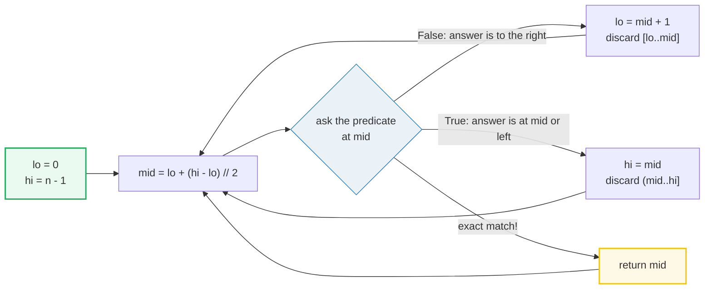
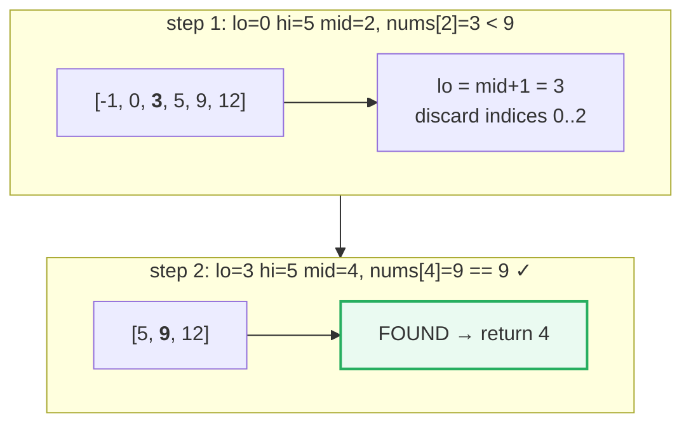
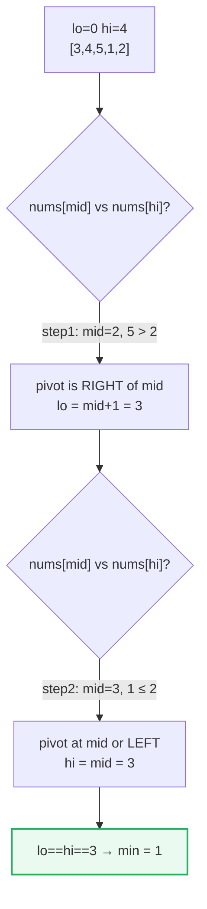
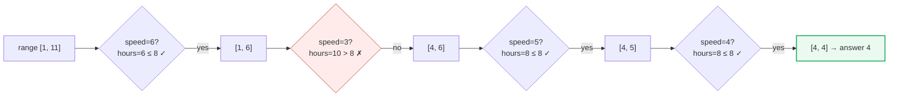
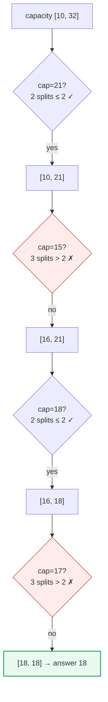

# Binary Search — P704, P153, P875, P410 — A Visual, Worked-Example Guide

> **Companion code:** [`binary_search.py`](./binary_search.py). **Every number is printed by
> `python3 binary_search.py`** — nothing is hand-computed.
>
> **Live animation:** [`binary_search.html`](./binary_search.html) — open in a browser.

---

## 0. TL;DR — the one idea

> **The analogy (read this first):** You don't need a sorted *array* — you need a sorted
> *predicate*. Binary search works whenever a yes/no question is `False` for a prefix of the
> search space and `True` for the suffix. Guess the middle, ask the question, and throw away
> the half that cannot hold the answer. Three fingers — `lo`, `mid`, `hi` — converge until
> they pinch the single answer. **Monotonic predicate + halving = O(log n).**



The four problems in this bundle are the same idea wearing four hats:

| Variant | What you search | Loop | Problem | The predicate |
|---|---|---|---|---|
| Exact match | a sorted array's indices | `lo <= hi` | P704 Binary Search | `nums[mid] == target` |
| Boundary | a rotated array's indices | `lo < hi` | P153 Rotated Min | `nums[mid] > nums[hi]` |
| Answer-space | the speed `[1, maxPile]` | `lo < hi` | P875 Koko | `sum(⌈pile/k⌉) ≤ h` |
| Answer-space | the capacity `[max, sum]` | `lo < hi` | P410 Split Array | `count_splits(cap) ≤ m` |

> **The merge note:** `modified_binary_search` (rotated arrays + answer-space) is folded in
> here. The rotated-array **search** (P33) shares P153's "which half is sorted" insight; the
> answer-space problems (P875, P410) are the most powerful generalization.

---

### Pattern Recognition Signals

| Signal in the problem statement | → Use binary search |
|---|---|
| Input is **sorted** (or rotated-but-sorted) | ✓ exact-match or boundary variant |
| "**O(log n)** time" or "**O(n log m)**" required | ✓ the halving guarantee |
| Find the **first / last / leftmost** position satisfying a condition | ✓ Template B (`lo < hi`) |
| "**minimize the maximum**" or "**maximize the minimum**" | ✓ answer-space variant |
| You can write a **monotonic feasibility test** `can_do(X)` | ✓ answer-space variant |
| Rotated sorted array, find min / search a target | ✓ compare `nums[mid]` with `nums[hi]` |

---

### The Template Skeleton

```python
# Template A — exact match (target may be absent)
def search(nums, target):
    lo, hi = 0, len(nums) - 1
    while lo <= hi:
        mid = lo + (hi - lo) // 2
        if nums[mid] == target:
            return mid
        elif nums[mid] < target:
            lo = mid + 1            # discard left half INCLUDING mid
        else:
            hi = mid - 1            # discard right half INCLUDING mid
    return -1

# Template B — leftmost feasible (boundary / rotated / answer-space)
def find_min_feasible(lo, hi, feasible):
    while lo < hi:                  # NOTE: < not <=
        mid = lo + (hi - lo) // 2
        if feasible(mid):
            hi = mid                # mid MIGHT be the answer — keep it
        else:
            lo = mid + 1            # mid is infeasible — discard it
    return lo                       # lo == hi == the answer

# Rotated-array minimum (Template B specialised)
def find_min_rotated(nums):
    lo, hi = 0, len(nums) - 1
    while lo < hi:
        mid = lo + (hi - lo) // 2
        if nums[mid] > nums[hi]:
            lo = mid + 1            # pivot is to the right of mid
        else:
            hi = mid                # pivot is at mid or to the left
    return nums[lo]

# Answer-space (Template B specialised) — e.g. P875 Koko
def min_eating_speed(piles, h):
    lo, hi = 1, max(piles)          # search the SPEED, not the array
    while lo < hi:
        mid = lo + (hi - lo) // 2
        if sum(-(-p // mid) for p in piles) <= h:   # ceil(p/mid)
            hi = mid
        else:
            lo = mid + 1
    return lo
```

---

## 1. P704 Binary Search — Standard Exact Match

> **Problem:** Given a sorted ascending array, return the index of `target`, or `-1`.
> **Key insight:** Sorted order makes the comparison monotonic — `nums[mid] < target`
> means the entire left half (including `mid`) is too small and can be discarded.

> From `binary_search.py` Section "P704 Binary Search":

```
array = [-1, 0, 3, 5, 9, 12]   target = 9
step  lo  hi  mid  nums[mid]  action
------------------------------------------------------------------
   1   0   5    2          3  nums[mid] < target → lo = mid + 1 = 3
   2   3   5    4          9  nums[mid] == target → FOUND at index 4

>> search([-1, 0, 3, 5, 9, 12], 9) = 4   [check] OK
>> search([-1, 0, 3, 5, 9, 12], 2) = -1   [check] OK
```

| step | lo | hi | mid | nums[mid] | action |
|---|---|---|---|---|---|
| 1 | 0 | 5 | 2 | 3 | `< target` → `lo = mid + 1 = 3` |
| 2 | 3 | 5 | 4 | 9 | `== target` → **FOUND at index 4** |

Each step halves the surviving range `[lo..hi]`: from 6 elements to 3 to 1. That is the
O(log n) guarantee — a million-element array resolves in ~20 comparisons.



---

## 2. P153 Find Minimum in Rotated Sorted Array — Predicate Search

> **Problem:** A sorted-ascending array was rotated at an unknown pivot. Find the minimum.
> **Key insight:** Compare `nums[mid]` with `nums[hi]` (NOT `nums[lo]`). If `nums[mid] >
> nums[hi]`, the pivot lies strictly right of `mid`; otherwise it lies at or left of `mid`.

> From `binary_search.py` Section "P153 Find Minimum in Rotated Sorted Array":

```
array = [3, 4, 5, 1, 2]
step  lo  hi  mid  nums[mid]  nums[hi]  action
------------------------------------------------------------------------
   1   0   4    2          5         2  nums[mid] > nums[hi] → lo = mid + 1 = 3
   2   3   4    3          1         2  nums[mid] ≤ nums[hi] → hi = mid = 3
   3   3   3    —          —         —  lo == hi → min = nums[3] = 1

>> find_min_rotated([3, 4, 5, 1, 2]) = 1   [check] OK
>> find_min_rotated([11, 13, 15, 17]) = 11   [check] OK
```

| step | lo | hi | mid | nums[mid] | nums[hi] | action |
|---|---|---|---|---|---|---|
| 1 | 0 | 4 | 2 | 5 | 2 | `5 > 2` → pivot right of mid → `lo = mid + 1 = 3` |
| 2 | 3 | 4 | 3 | 1 | 2 | `1 ≤ 2` → pivot at mid or left → `hi = mid = 3` |
| 3 | 3 | 3 | — | — | — | `lo == hi` → **min = nums[3] = 1** |

**Why compare with `hi` not `lo`?** Because we want the *minimum*, and the right end
encodes whether we are standing in the rotated (larger) or un-rotated (smaller) segment.
Comparing with `lo` gives ambiguous answers when the array is **not** rotated (e.g.
`[11,13,15,17]` where `lo` and `mid` land on the same element).



---

## 3. P875 Koko Eating Bananas — Binary Search on Answer (Speed)

> **Problem:** Koko eats `⌈pile / speed⌉` hours per pile. Find the **minimum integer speed**
> to finish all piles within `h` hours.
> **Key insight:** There is no array to search — we search the **answer space** `[1, max(pile)]`.
> Feasibility `hours(speed) ≤ h` is monotonic: a higher speed never costs more hours. So we
> hunt the leftmost (smallest) feasible speed with Template B.

> From `binary_search.py` Section "P875 Koko Eating Bananas":

```
piles = [3, 6, 7, 11]   h = 8
answer range: speed ∈ [1, 11]   (max pile = 11)
step  lo  hi  mid  hours(mid)  ≤ h?  action
------------------------------------------------------------------
   1   1  11    6           6   yes  feasible → hi = mid = 6
   2   1   6    3          10    no  too slow → lo = mid + 1 = 4
   3   4   6    5           8   yes  feasible → hi = mid = 5
   4   4   5    4           8   yes  feasible → hi = mid = 4
   5   4   4    —           —     —  lo == hi → min speed = 4

>> min_eating_speed([3, 6, 7, 11], 8) = 4   [check] OK
>> min_eating_speed([30, 11, 23, 4, 20], 5) = 30   [check] OK
```

| step | lo | hi | mid | hours(mid) | ≤ h? | action |
|---|---|---|---|---|---|---|
| 1 | 1 | 11 | 6 | 6 | yes | feasible → `hi = mid = 6` |
| 2 | 1 | 6 | 3 | 10 | no | too slow → `lo = mid + 1 = 4` |
| 3 | 4 | 6 | 5 | 8 | yes | feasible → `hi = mid = 5` |
| 4 | 4 | 5 | 4 | 8 | yes | feasible → `hi = mid = 4` |
| 5 | 4 | 4 | — | — | — | converged → **min speed = 4** |

**How `hours(mid)` is computed:** `⌈3/6⌉ + ⌈6/6⌉ + ⌈7/6⌉ + ⌈11/6⌉ = 1+1+2+2 = 6`.
At speed 3 it is `1+2+3+4 = 10 > 8` (infeasible), so 3 is discarded. The answer-space
shrinks from `[1,11]` to `[4,4]` in 4 probes — O(log(maxPile) · n).



---

## 4. P410 Split Array Largest Sum — Binary Search on Answer (Capacity)

> **Problem:** Split `nums` into `m` contiguous subarrays minimizing the largest subarray sum.
> **Key insight:** Same answer-space trick. Search the capacity `[max(nums), sum(nums)]`.
> The feasibility test `count_splits(cap) ≤ m` greedily packs elements into subarrays while
> the running sum stays under `cap`; a larger capacity never needs more subarrays (monotonic).

> From `binary_search.py` Section "P410 Split Array Largest Sum":

```
nums = [7, 2, 5, 10, 8]   m = 2
answer range: capacity ∈ [10, 32]   (max = 10, sum = 32)
step  lo  hi  mid  splits(mid)  ≤ m?  action
------------------------------------------------------------------
   1  10  32   21            2   yes  feasible → hi = mid = 21
   2  10  21   15            3    no  too many → lo = mid + 1 = 16
   3  16  21   18            2   yes  feasible → hi = mid = 18
   4  16  18   17            3    no  too many → lo = mid + 1 = 18
   5  18  18    —            —     —  lo == hi → min largest sum = 18

>> split_array([7, 2, 5, 10, 8], 2) = 18   [check] OK
>> split_array([1, 2, 3, 4, 5], 2) = 9   [check] OK
```

| step | lo | hi | mid | splits(mid) | ≤ m? | action |
|---|---|---|---|---|---|---|
| 1 | 10 | 32 | 21 | 2 | yes | feasible → `hi = mid = 21` |
| 2 | 10 | 21 | 15 | 3 | no | too many → `lo = mid + 1 = 16` |
| 3 | 16 | 21 | 18 | 2 | yes | feasible → `hi = mid = 18` |
| 4 | 16 | 18 | 17 | 3 | no | too many → `lo = mid + 1 = 18` |
| 5 | 18 | 18 | — | — | — | converged → **min largest sum = 18** |

**How `count_splits(cap)` works** (greedy, cap=18): pack `7+2+5=14` (adding 10 → 24 > 18,
break → subarray `[7,2,5]`), then `10+8=18 ≤ 18` (→ subarray `[10,8]`). Two subarrays ≤ m=2,
feasible. At cap=17 the same packing yields `[7,2,5],[10],[8]` = 3 subarrays > m, infeasible.

The optimal split `[7,2,5]` and `[10,8]` has largest sum 18 — exactly what the search finds.



---

## Complexity

| Operation | Time | Space |
|---|---|---|
| Standard search (P704) | O(log n) | O(1) |
| Rotated-array minimum (P153) | O(log n) | O(1) |
| Koko eating speed (P875) | O(n · log(maxPile)) | O(1) |
| Split array largest sum (P410) | O(n · log(sum − max)) | O(1) |
| Rotated-array **search** (P33) | O(log n) | O(1) |

**Why the answer-space variants are `O(n · log R)`:** each of the `log(R)` probes calls the
feasibility predicate once, and that predicate is a single O(n) scan over the input. The
answer range `R` is `maxPile` (P875) or `sum − max` (P410), so the probes are logarithmic in
the value range, **not** in `n` — a subtle but crucial distinction.

---

## Killer Gotchas

- **Wrong loop / update pairing:** `while lo <= hi` **must** pair with `hi = mid - 1` (you
  can discard `mid`). `while lo < hi` **must** pair with `hi = mid` (mid might be the
  answer). Mixing them — `lo <= hi` with `hi = mid` — creates an infinite loop when
  `lo == hi == mid`. This is the #1 binary-search bug.
- **Integer overflow (non-Python):** use `mid = lo + (hi - lo) // 2`, never `(lo + hi) // 2`.
  The latter overflows in C++/Java for large indices. Python ints are unbounded so it is
  safe here, but write the safe form anyway — interviewers look for it.
- **Rotated min: compare with `hi`, not `lo`:** comparing `nums[mid]` with `nums[lo]` gives
  wrong answers when the array is **not rotated** (lo and mid coincide). The right end
  always encodes the correct segment.
- **Answer-space bounds:** for "minimize capacity" the range is `[max(nums), sum(nums)]`,
  **not** `[0, sum]`. A capacity below `max(nums)` is instantly infeasible (no single element
  fits), and `sum(nums)` is always feasible (one subarray holds everything).
- **Discarding the answer in Template B:** if `feasible(mid)` is true you must do `hi = mid`
  (keep mid, it may be optimal). Doing `hi = mid - 1` can throw away the exact answer — and
  because it produces a *plausible* wrong value, the bug is invisible.
- **Rotated search (P33) needs `<=` on the sorted-half check:** use `nums[lo] <= nums[mid]`.
  The `=` handles the 2-element subarray where `lo` and `mid` point at the same index.
- **Monotonicity is mandatory:** the feasibility predicate for answer-space problems must be
  monotonic (once true, stays true for larger values). If it fluctuates, binary search
  silently returns garbage.

---

## Problem Table

| Problem | Difficulty | Essence | Key Trick |
|---|---|---|---|
| P704 Binary Search | Easy | exact match in sorted array | Template A; `lo <= hi`, `lo=mid+1`/`hi=mid-1` |
| P153 Find Min Rotated | Medium | boundary of rotation | Template B; compare `nums[mid]` with `nums[hi]` |
| P33 Search Rotated | Medium | search target in rotated array | one half always sorted; `nums[lo] <= nums[mid]` decides which |
| P34 First & Last Position | Medium | leftmost + rightmost of target | Template B twice (`>= target`, then `> target − 1`) |
| P278 First Bad Version | Easy | leftmost True predicate | Template B; `is_bad(mid) → hi = mid` |
| P162 Find Peak Element | Medium | binary search on unsorted array | predicate `nums[mid] > nums[mid+1]` |
| P875 Koko Eating Bananas | Medium | minimize the speed | answer-space `[1, maxPile]`; `hours(k) = Σ⌈pile/k⌉ ≤ h` |
| P410 Split Array Largest Sum | Hard | minimize the largest subarray sum | answer-space `[max, sum]`; greedy `count_splits(cap) ≤ m` |
| P1011 Ship Within D Days | Medium | minimize ship capacity | answer-space `[max, sum]`; `count_days(cap) ≤ D` |
| P4 Median of Two Sorted Arrays | Hard | partition the combined array | binary search on the smaller array's partition |
