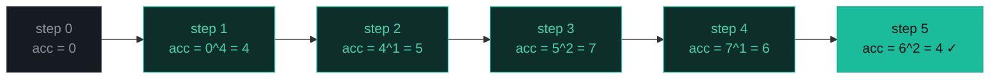
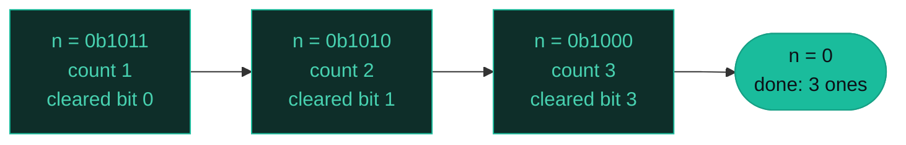
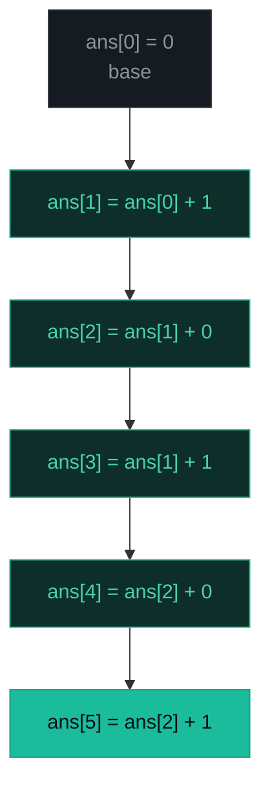

# Bit Manipulation — Single Number, 1 Bits, Counting Bits — A Visual, Worked-Example Guide

> **Companion code:** [`bit_manipulation.py`](./bit_manipulation.py). **Every number is printed by
> `python3 bit_manipulation.py`** — nothing is hand-computed.
>
> **Live animation:** [`bit_manipulation.html`](./bit_manipulation.html) — open in a browser, step the bits yourself.

---

## 0. TL;DR — the one idea

> **The analogy (read this first):** Every integer is a row of light switches — each bit is either ON (`1`) or OFF (`0`). Normal math operates on the whole number at once; bit manipulation flips the individual switches directly.
>
> Three switch tricks cover almost every interview question:
> 1. **XOR is a "cancel switch"** — flipping a switch twice returns it to where it started. So `a ^ a = 0` and `a ^ 0 = a`. XOR everything in a list and every value that appears an even number of times cancels; only the odd-one-out survives.
> 2. **`n & (n-1)` turns OFF the rightmost ON switch.** Loop `while n: n &= n-1; count += 1` and you count the ON switches, running *exactly once per set bit*.
> 3. **`i >> 1` shifts the whole row one step right** (drops the last switch). The ON-count of `i` equals the ON-count of `i >> 1` *plus* the dropped switch (`i & 1`). That recurrence fills popcount for `0..n` in O(n).

```mermaid
graph LR
    subgraph TRICKS["three switch tricks"]
        A["XOR fold<br/>a^a=0<br/>pairs cancel"] -->|find odd-one-out| P136["P136<br/>Single Number"]
        B["n & (n-1)<br/>clear lowest 1<br/>loop = popcount"] -->|count ON switches| P191["P191<br/>1 Bits"]
        C["i >> 1<br/>reuse smaller<br/>subproblem"] -->|DP on bits| P338["P338<br/>Counting Bits"]
    end
    style A fill:#0e2e29,stroke:#1abc9c,color:#48d1b0
    style B fill:#0e2e29,stroke:#1abc9c,color:#48d1b0
    style C fill:#0e2e29,stroke:#1abc9c,color:#48d1b0
    style P136 fill:#1abc9c,stroke:#16a085,color:#0d1117
    style P191 fill:#1abc9c,stroke:#16a085,color:#0d1117
    style P338 fill:#1abc9c,stroke:#16a085,color:#0d1117
    style TRICKS fill:#0d1117,stroke:#30363d
```



The whole pattern is bit primitives. Pick **what you do to the switches** (cancel, clear, shift) to get all three problems:

```python
# 1. XOR fold: every pair cancels, the unique element survives
res = 0
for x in nums:
    res ^= x

# 2. Brian Kernighan: clear the lowest set bit, loop once per 1-bit
count = 0
while n:
    n &= n - 1
    count += 1

# 3. DP on bits: reuse the popcount of i >> 1, add the dropped LSB
ans = [0] * (n + 1)
for i in range(1, n + 1):
    ans[i] = ans[i >> 1] + (i & 1)
```

---

### Pattern Recognition Signals

| Signal in the problem statement | → Use this pattern |
|---|---|
| "every element appears **twice** except one" / "find the unique number" | ✓ XOR self-inverse fold (P136) |
| "do **not** use extra space" + pairs/parity | ✓ XOR cancellation, O(1) space |
| "count the number of **1 bits**" / "Hamming weight" | ✓ Brian Kernighan `n &= n-1` (P191) |
| "for **every** number from 0 to n, count its 1-bits" | ✓ DP on bits `ans[i] = ans[i>>1] + (i&1)` (P338) |
| "is n a **power of two**?" | ✓ `n > 0 and (n & (n-1)) == 0` |
| "swap without a temp variable" / "find the **missing** number 0..n" | ✓ XOR (missing: `res = n; for i,x: res ^= i ^ x`) |
| "all subsets of a set" / "every combination" | ✓ bitmask enumeration `for mask in range(1<<n)` |
| Need the **value** of the k-th bit / set/clear/toggle a bit | ✓ `&`, `|`, `^`, `<<`, `>>` primitives |
| Count paths / enumerate full configurations | ✗ use **DFS / backtracking** |
| Arithmetic on the whole number (sum, product, mod) | ✗ use **math / number theory** |

---

### The Template Skeleton

```python
# The interview starting point — memorize this. Three variants, same primitives.

# ---- 1. XOR fold (P136) — pairs cancel, lone survivor remains ----
def single_number(nums):
    result = 0
    for num in nums:
        result ^= num
    return result
# O(n) time, O(1) space


# ---- 2. Brian Kernighan (P191) — loop runs once per SET bit ----
def hamming_weight(n):
    count = 0
    while n:
        n &= n - 1          # clear the lowest set bit
        count += 1
    return count
# O(popcount(n)) time, O(1) space


# ---- 3. DP on bits (P338) — reuse ans[i >> 1], add the dropped LSB ----
def count_bits(n):
    ans = [0] * (n + 1)
    for i in range(1, n + 1):
        ans[i] = ans[i >> 1] + (i & 1)
    return ans
# O(n) time, O(n) space


# ---- bonus primitives (memorize the get/set/clear/toggle quartet) ----
def get_bit(n, i):  return (n >> i) & 1
def set_bit(n, i):  return n | (1 << i)
def clr_bit(n, i):  return n & ~(1 << i)
def tog_bit(n, i):  return n ^ (1 << i)
def is_pow2(n):     return n > 0 and (n & (n - 1)) == 0   # n>0 guard is critical
```

---

## 1. P136 Single Number

> **Problem:** Given a non-empty array where every element appears *twice* except one, find that single one. O(n) time, O(1) extra space.
> **Key insight:** XOR is self-inverse (`a ^ a = 0`) and identity (`a ^ 0 = a`), commutative and associative. Folding the array cancels each pair to `0`; the lone survivor remains in the accumulator.

### Worked example — `[4, 1, 2, 1, 2]` → `4`

> From `bit_manipulation.py` Section A. `nums = [4, 1, 2, 1, 2]` (4 is unique; 1 and 2 each appear twice).

| step | num | num (bin) | acc after (bin) | note |
|---|---|---|---|---|
| 0 | – | – | `0b000` | start: acc = 0 |
| 1 | 4 | `0b100` | `0b100` | acc ^= 4 |
| 2 | 1 | `0b001` | `0b101` | acc ^= 1 |
| 3 | 2 | `0b010` | `0b111` | acc ^= 2 |
| 4 | 1 | `0b001` | `0b110` | acc ^= 1 |
| 5 | 2 | `0b010` | `0b100` | acc ^= 2 |

`single_number([4, 1, 2, 1, 2]) -> 4`

Pairs `(1^1)` and `(2^2)` cancel to `0`; `4 ^ 0 ^ 0 = 4` survives.



**Edge cases** (from `bit_manipulation.py` Section A): `[2,2,1] → 1`; `[1] → 1` (lone element, acc stays `1`); `[-1,-1,-2] → -2` (XOR works on negatives — Python ints are arbitrary precision, two's-complement at the bit level).

---

## 2. P191 Number of 1 Bits

> **Problem:** Count the `1`-bits in the binary representation of an unsigned integer (its **Hamming weight** / popcount).
> **Key insight:** `n & (n-1)` clears the **lowest set bit** — subtracting 1 borrows through trailing zeros and flips the rightmost `1` to `0`. The loop runs *exactly once per set bit*, so it is O(popcount), not O(32).

### Worked example — `n = 11` (`0b1011`) → `3`

> From `bit_manipulation.py` Section B. `n = 11`, binary `0b00001011` (8-bit view), 3 set bits.

| iter | n before (bin) | n − 1 (bin) | n & (n−1) (bin) | cleared bit | count |
|---|---|---|---|---|---|
| 0 | `0b1011` | – | – | – | 0 |
| 1 | `0b1011` | `0b1010` | `0b1010` | pos 0 | 1 |
| 2 | `0b1010` | `0b1001` | `0b1000` | pos 1 | 2 |
| 3 | `0b1000` | `0b0111` | `0b0000` | pos 3 | 3 |

`hamming_weight(11) -> 3`

The loop ran **3 times** for a number with 3 set bits — not 4 bit-position tests.



### Bigger number — `n = 23` (`0b10111`) → `4`

> From `bit_manipulation.py` Section B. 4 set bits, 4 iterations.

| iter | n before | n − 1 | n & (n−1) | cleared | count |
|---|---|---|---|---|---|
| 1 | `0b10111` | `0b10110` | `0b10110` | pos 0 | 1 |
| 2 | `0b10110` | `0b10101` | `0b10100` | pos 1 | 2 |
| 3 | `0b10100` | `0b10011` | `0b10000` | pos 2 | 3 |
| 4 | `0b10000` | `0b01111` | `0b00000` | pos 4 | 4 |

**LeetCode canonical inputs** (from `bit_manipulation.py` Section B): `0b1011=11 → 3`; `0b10000000=128 → 1` (power of two, single set bit); `0 → 0` (loop never enters); `0b11111111=255 → 8` (all bits set).

---

## 3. P338 Counting Bits

> **Problem:** For `i` in `0..n`, return an array `ans` where `ans[i]` is the popcount of `i`. O(n) time.
> **Key insight:** `i >> 1` drops the LSB, and `ans[i >> 1]` was already computed (smaller index). The dropped bit is `(i & 1)`. So `popcount(i) = popcount(i >> 1) + (i & 1)` — O(1) per cell.

### Worked example — `n = 5` → `[0, 1, 1, 2, 1, 2]`

> From `bit_manipulation.py` Section C. Fill the DP table from the base case `ans[0] = 0`.

| i | i (bin) | i >> 1 | (i & 1) | ans[i>>1] | ans[i] = prev + lsb |
|---|---|---|---|---|---|
| 0 | `0b000` | – | – | – | 0 (base case) |
| 1 | `0b001` | 0 | 1 | 0 | 0 + 1 = 1 |
| 2 | `0b010` | 1 | 0 | 1 | 1 + 0 = 1 |
| 3 | `0b011` | 1 | 1 | 1 | 1 + 1 = 2 |
| 4 | `0b100` | 2 | 0 | 1 | 1 + 0 = 1 |
| 5 | `0b101` | 2 | 1 | 1 | 1 + 1 = 2 |

`count_bits(5) -> [0, 1, 1, 2, 1, 2]`



**Correctness cross-check** (from `bit_manipulation.py` Section C): the DP output for `0..7` is `[0,1,1,2,1,2,2,3]`, identical to `[bin(i).count("1") for i in range(8)]`. The assertion `count_bits(1000) == [bin(i).count("1") for i in range(1001)]` passes — the recurrence matches the hardware/string popcount across `0..1000`.

**LeetCode canonical inputs** (from `bit_manipulation.py` Section C): `n=0 → [0]`; `n=1 → [0,1]`; `n=2 → [0,1,1]`; `n=7 → [0,1,1,2,1,2,2,3]`.

---

## 4. Extensions (briefly)

- **P268 Missing Number** — `0..n` with one missing. XOR every index with every value: `res = n; for i, x: res ^= i ^ x`. Pairs `(i ^ nums[i])` cancel; the missing index survives. Avoids the `n(n+1)/2` overflow trap in C++/Java.
- **P476 Number Complement** — flip only the *significant* bits. `mask = (1 << num.bit_length()) - 1; return num ^ mask`. (Python's `~` is `-(n+1)` — wrong here; always build a mask.)
- **P461 Hamming Distance** — XOR the two numbers, then popcount the result.
- **P190 Reverse Bits** — `res = 0; for _ in range(32): res = (res<<1) | (n&1); n >>= 1`.
- **"Every element appears *k* times except one"** — count bits at each position modulo `k`. O(32n) time, O(1) space, no HashMap.
- **P078 Subsets** — bitmask enumeration: `for mask in range(1<<n)`; bit `i` set ⟺ include `nums[i]`.

---

### Complexity

> From `bit_manipulation.py` Section D.

| Operation | Time | Space |
|---|---|---|
| Single Number, XOR fold (P136) | O(n) | O(1) |
| Hamming weight, Kernighan (P191) | O(popcount(n)) | O(1) |
| Counting Bits, DP on bits (P338) | O(n) | O(n) |
| Bit get/set/clear/toggle at i | O(1) | O(1) |
| Subset enumeration, n bits | O(n · 2ⁿ) | O(n · 2ⁿ) |

*`n` = array length; popcount(n) = number of set bits in n.*

### Killer Gotchas

1. **Power-of-two zero trap:** `0 & (0-1) == 0`, so the formula says `0` is a power of 2. Always guard: `n > 0 and (n & (n-1)) == 0`.
2. **`n & (n-1)` is NOT `n - 1`.** It clears the lowest set bit but keeps every other bit. For `n = 0b1010` (10): `n-1 = 0b1001`, but `n & (n-1) = 0b1000` (8). Subtracting 1 alone gives 9 — wrong for popcount.
3. **Python's `~` is not "flip bits".** Because ints have infinite length, `~n = -(n+1)`. To flip the significant bits, build a mask and XOR: `mask = (1 << n.bit_length()) - 1; return n ^ mask` (P476).
4. **XOR swap aliasing:** `a ^= a` sets `a` to 0. Never XOR-swap when the two indices might be the same (`swap(arr[i], arr[i])`).
5. **Shift ≥ word size is undefined in C/C++.** In Java, `1 << 32` wraps to `1 << 0`. In Python it just works (bignum). Use `1L << n` in C++.
6. **"Every element appears k times except one"**: count bits at each position modulo `k` instead of a HashMap — O(32n) time, O(1) space.

### Problem Table

> From `bit_manipulation.py` Section D.

| Problem | Essence | Key Trick |
|---|---|---|
| P136 Single Number | XOR all — pairs cancel | `res=0; for x: res^=x` — O(n)/O(1) |
| P191 Number of 1 Bits | Count set bits | Brian Kernighan: `n &= n-1` loops exactly popcount(n) times |
| P338 Counting Bits | Bit counts for 0..n | DP: `ans[i] = ans[i>>1] + (i&1)` — right-shift shares subproblem |
| P268 Missing Number | 0..n, one missing | `res=n; for i,x: res ^= i ^ x` (or sum formula; XOR avoids overflow) |
| P476 Number Complement | Flip significant bits only | `mask=(1<<bit_length)-1; return num^mask` — avoids Python `~` trap |
| P461 Hamming Distance | Differing bit positions | XOR the pair, then popcount the result |
| P190 Reverse Bits | Reverse 32-bit order | `res = (res<<1) | (n&1); n >>= 1`, 32 iterations |
