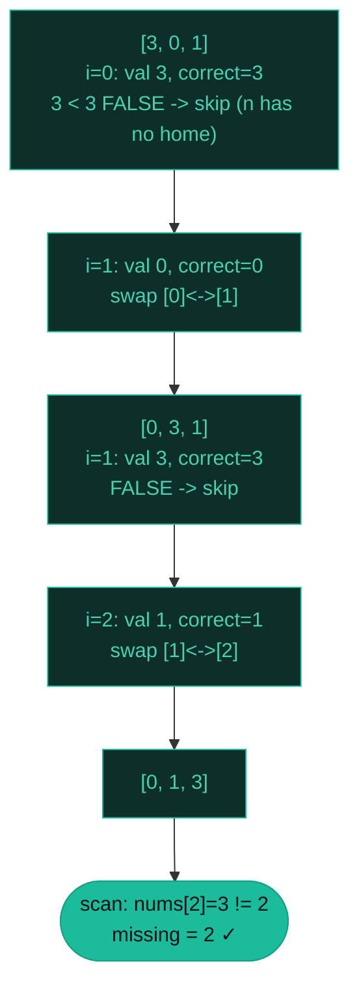
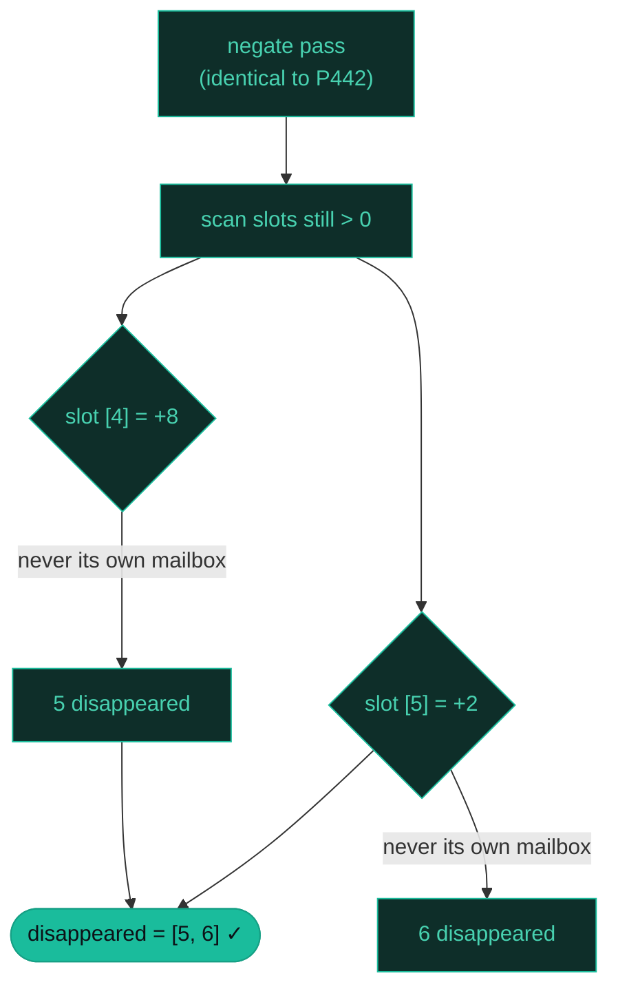

# Cyclic Sort — Missing Number, Duplicates, Disappeared — A Visual, Worked-Example Guide

> **Companion code:** [`cyclic_sort.py`](./cyclic_sort.py). **Every number is printed by
> `python3 cyclic_sort.py`** — nothing is hand-computed.
>
> **Live animation:** [`cyclic_sort.html`](./cyclic_sort.html) — open in a browser, watch the balls swap home.

---

## 0. TL;DR — the one idea

> **The analogy (read this first):** You have an array of `n` numbers, and every number comes from a small known range (`1..n` or `0..n`). That means every value has a **natural home index** — think numbered balls rolling around in numbered boxes. If ball #3 is sitting in box #5, just swap it with whatever is in box #3, and repeat until the box you're holding already holds the right ball.
>
> **The array is its own hash table:** the *value* is the *key*, and the *index* is the *bucket*. Two strategies, same idea:
> 1. **Swap-to-place (move the balls).** Walk `i` left to right. If `nums[i]` is not at its home, swap it home and **re-check `i`** (the newcomer may also be misplaced). Advance only once `nums[i]` is home. One pass sorts the array; a quick scan reveals missing values.
> 2. **Negation-mark (deface the boxes).** Flip the sign of `nums[v-1]` to record "ball `v` was seen." A sign bit is a 1-bit bitmap at zero memory cost. Two scratches of the same box ⟹ a duplicate; a box never scratched ⟹ its ball "disappeared."
>
> Both run in **O(n) time, O(1) extra space**.

```mermaid
graph LR
    subgraph IDEAS["two strategies, one mental model"]
        A["SWAP-TO-PLACE<br/>move each ball to<br/>its home index"] -->|sorted array| P268["P268 Missing<br/>then scan"]
        B["NEGATION-MARK<br/>scratch mailbox v-1<br/>(flip its sign)"] -->|already negative<br/>mid-pass| P442["P442 Duplicates"]
        B -->|still positive<br/>post-pass| P448["P448 Disappeared"]
    end
    style A fill:#0e2e29,stroke:#1abc9c,color:#48d1b0
    style B fill:#0e2e29,stroke:#1abc9c,color:#48d1b0
    style P268 fill:#1abc9c,stroke:#16a085,color:#0d1117
    style P442 fill:#1abc9c,stroke:#16a085,color:#0d1117
    style P448 fill:#1abc9c,stroke:#16a085,color:#0d1117
    style IDEAS fill:#0d1117,stroke:#30363d
```



The home-index mapping is the whole game — get it right and the rest is mechanical:

| Range | Home index of value `v` | Out-of-bounds risk |
|---|---|---|
| `[1, n]` | `v - 1` | none (`v-1 ≤ n-1`) |
| `[0, n]` | `v` | **`v = n` has no home → guard `correct < n`** |

```python
# 1. SWAP-TO-PLACE (range [1, n]) — physically sort the array
i = 0
while i < len(nums):
    correct = nums[i] - 1
    if nums[i] != nums[correct]:
        nums[i], nums[correct] = nums[correct], nums[i]   # stay at i
    else:
        i += 1

# 2. NEGATION-MARK (range [1, n]) — leave balls, scratch mailboxes
for num in nums:
    idx = abs(num) - 1                # abs(): num may already be negated
    if nums[idx] < 0:
        ... duplicate detected        # P442
    else:
        nums[idx] = -nums[idx]        # scratch the box
```

---

### Pattern Recognition Signals

| Signal in the problem statement | → Use this pattern |
|---|---|
| "array of size `n` with numbers in `[1, n]`" or `[0, n]` | ✓ cyclic sort / negation mark |
| "find the **missing** / **duplicate** / **disappeared** number(s)" | ✓ the value→index bijection is the hint |
| constraints demand **O(n) time and O(1) extra space** | ✓ must use the array as its own hash table |
| "you must **not** allocate extra memory" + range `[1, n]` | ✓ negation mark (sign = free bitmap) |
| `n+1` integers in `[1, n]`, exactly one repeats, **no array modification** | ✗ use **Floyd's cycle detection** (P287) — treat values as linked-list pointers |
| "find the *first missing positive*" (values may be ≤ 0 or > n) | ✓ cyclic sort, then ignore out-of-range cells during the scan (P41) |
| general array of arbitrary values (no bounded range) | ✗ use a **hashmap** or a comparison sort |

---

### The Template Skeleton

```python
# The interview starting point — memorize this. Two strategies, same model.

# ---- 1. CYCLIC SORT: swap-to-place on [1, n] ----
def cyclic_sort(nums):
    i = 0
    while i < len(nums):
        correct = nums[i] - 1                 # value v belongs at index v-1
        if nums[i] != nums[correct]:
            nums[i], nums[correct] = nums[correct], nums[i]   # stay at i!
        else:
            i += 1                            # advance ONLY when home
    return nums
# O(n) time, O(1) space


# ---- 2. P268 MISSING NUMBER: swap-to-place on [0, n] + scan ----
def missing_number(nums):
    n = len(nums)
    i = 0
    while i < n:
        correct = nums[i]                     # value v belongs at index v
        if correct < n and nums[i] != nums[correct]:   # guard: n has no home
            nums[i], nums[correct] = nums[correct], nums[i]
        else:
            i += 1
    for j in range(n):
        if nums[j] != j:
            return j                          # first mismatch -> missing
    return n                                  # all match -> n is missing
# O(n) time, O(1) space


# ---- 3. P442 FIND ALL DUPLICATES: negation mark, detect mid-pass ----
def find_duplicates(nums):
    duplicates = []
    for num in nums:
        idx = abs(num) - 1                    # abs(): num may be a negated mark
        if nums[idx] < 0:
            duplicates.append(abs(num))       # mailbox already scratched -> dup
        else:
            nums[idx] = -nums[idx]            # scratch it
    return duplicates
# O(n) time, O(1) extra space


# ---- 4. P448 FIND DISAPPEARED: same pass, read out post-pass ----
def find_disappeared(nums):
    for num in nums:
        idx = abs(num) - 1
        if nums[idx] > 0:
            nums[idx] = -nums[idx]            # scratch
    return [i + 1 for i in range(len(nums)) if nums[i] > 0]   # unscratched boxes
# O(n) time, O(1) extra space
```

---

## 1. Cyclic Sort — the swap-to-place mechanic (range `[1, n]`)

> **The drill:** every value `v` belongs at index `v - 1`. Walk `i` left to right; if `nums[i]` is not home, swap it home and **re-check `i`** (the newcomer may be misplaced too). Advance only once `nums[i]` is home. Despite the nested-looking `while`, total work is O(n): each swap puts one more ball home, so there are at most `n - 1` swaps across the whole pass.

### Worked example — `[3, 1, 5, 4, 2]` → `[1, 2, 3, 4, 5]`

> From `cyclic_sort.py` Section A. `nums = [3, 1, 5, 4, 2]`, a permutation of `1..5`.

| i | val | correct | action | before → after |
|---|---|---|---|---|
| 0 | 3 | 2 | swap with `[2]=5` | `[3, 1, 5, 4, 2]` → `[5, 1, 3, 4, 2]` |
| 0 | 5 | 4 | swap with `[4]=2` | `[5, 1, 3, 4, 2]` → `[2, 1, 3, 4, 5]` |
| 0 | 2 | 1 | swap with `[1]=1` | `[2, 1, 3, 4, 5]` → `[1, 2, 3, 4, 5]` |
| 0 | 1 | 0 | advance (already home) | `[1, 2, 3, 4, 5]` → `[1, 2, 3, 4, 5]` |
| 1 | 2 | 1 | advance (already home) | `[1, 2, 3, 4, 5]` → `[1, 2, 3, 4, 5]` |
| 2 | 3 | 2 | advance (already home) | `[1, 2, 3, 4, 5]` → `[1, 2, 3, 4, 5]` |
| 3 | 4 | 3 | advance (already home) | `[1, 2, 3, 4, 5]` → `[1, 2, 3, 4, 5]` |
| 4 | 5 | 4 | advance (already home) | `[1, 2, 3, 4, 5]` → `[1, 2, 3, 4, 5]` |

`cyclic_sort([3, 1, 5, 4, 2]) -> [1, 2, 3, 4, 5]`

Note how index `i = 0` absorbs **three** consecutive swaps before advancing — that's the "re-check `i`" rule in action. Each swap placed exactly one value (`3`, then `5`, then `2`) into its permanent home.

```mermaid
graph LR
    S0["[3,1,5,4,2]<br/>i=0: 3 belongs at 2"] --> S1["[5,1,3,4,2]<br/>3 is home ✓"]
    S1 --> S2["[5,1,3,4,2]<br/>i=0: 5 belongs at 4"]
    S2 --> S3["[2,1,3,4,5]<br/>5 is home ✓"]
    S3 --> S4["[2,1,3,4,5]<br/>i=0: 2 belongs at 1"]
    S4 --> S5["[1,2,3,4,5]<br/>2 is home ✓"]
    S5 --> S6(["i=0: 1 is home<br/>advance through rest"])
    style S0 fill:#0e2e29,stroke:#1abc9c,color:#48d1b0
    style S1 fill:#0e2e29,stroke:#1abc9c,color:#48d1b0
    style S2 fill:#0e2e29,stroke:#1abc9c,color:#48d1b0
    style S3 fill:#0e2e29,stroke:#1abc9c,color:#48d1b0
    style S4 fill:#0e2e29,stroke:#1abc9c,color:#48d1b0
    style S5 fill:#0e2e29,stroke:#1abc9c,color:#48d1b0
    style S6 fill:#1abc9c,stroke:#16a085,color:#0d1117
```



**Edge cases** (from `cyclic_sort.py` Section A): `[1] → [1]` (single element, already home); `[1, 2, 3] → [1, 2, 3]` (already sorted, zero swaps); `[5, 4, 3, 2, 1] → [1, 2, 3, 4, 5]` (fully reversed); `[2, 1, 4, 3, 6, 5] → [1, 2, 3, 4, 5, 6]` (adjacent swaps).

---

## 2. P268 Missing Number (swap-to-place on `[0, n]`, then scan)

> **Problem:** `n` distinct numbers drawn from `[0, n]` — one is missing. Return it. O(n) time, O(1) extra space.
> **Key insight:** value `v` belongs at index `v`. The value `n` has **no home** (index `n` is out of bounds), so every swap is guarded by `correct < n`. After the sort, the first index `j` with `nums[j] != j` is the missing value; if every slot matches, the answer is `n` itself.

### Worked example — `[3, 0, 1]` → `2`

> From `cyclic_sort.py` Section B. `nums = [3, 0, 1]`, `n = 3`.

| i | val | correct | guard | before → after |
|---|---|---|---|---|
| 1 | 0 | 0 | `0 < 3 = True` | `[3, 0, 1]` → `[0, 3, 1]` |
| 2 | 1 | 1 | `1 < 3 = True` | `[0, 3, 1]` → `[0, 1, 3]` |

`missing_number([3, 0, 1]) -> 2`

After the pass the array is `[0, 1, 3]`. The scan finds `nums[2] == 3 != 2`, so **2 is missing**. Notice `i = 0` is skipped entirely: `nums[0] = 3`, and `correct = 3` fails the guard `3 < 3`, so the value `n` simply floats in place until the scan.



**LeetCode canonical inputs** (from `cyclic_sort.py` Section B): `[3, 0, 1] → 2`; `[0, 1] → 2` (nothing mismatches after the sort, so the answer is `n = 2`); `[9, 6, 4, 2, 3, 5, 7, 0, 1] → 8`.

> **The `n`-has-no-home trap:** in `[0, 1]`, value `2` (`= n`) is in the array. `correct = 2 >= n`, so the swap is skipped and we advance. Without the `correct < n` guard you'd index `nums[n]` and crash. The value `n` simply floats until the final scan.

---

## 3. P442 Find All Duplicates (negation mark, detect mid-pass)

> **Problem:** array of length `n`, values in `[1, n]`, each appearing once or twice. Return those that appear twice. O(n) time, O(1) extra space.
> **Key insight:** for each value `v`, the slot at `v - 1` is its **mailbox**. Scratch it (negate it) the first time `v` is seen. If the mailbox is **already negative** the next time → `v` is a duplicate. Always index with `abs(num) - 1`, because `num` itself may have been negated by an earlier mark.

### Worked example — `[4, 3, 2, 7, 8, 2, 3, 1]` → `[2, 3]`

> From `cyclic_sort.py` Section C. `n = 8`.

| k | read | idx | mark? | slot before | note |
|---|---|---|---|---|---|
| 0 | 4 | 3 | negate | `7` | scratch slot `[3]`: `7 → -7` |
| 1 | 3 | 2 | negate | `2` | scratch slot `[2]`: `2 → -2` |
| 2 | 2 | 1 | negate | `3` | scratch slot `[1]`: `3 → -3` |
| 3 | 7 | 6 | negate | `3` | scratch slot `[6]`: `3 → -3` |
| 4 | 8 | 7 | negate | `1` | scratch slot `[7]`: `1 → -1` |
| 5 | 2 | 1 | **skip** | `-3` | slot `[1]` already `< 0` → **2 is a DUPLICATE** |
| 6 | 3 | 2 | **skip** | `-2` | slot `[2]` already `< 0` → **3 is a DUPLICATE** |
| 7 | 1 | 0 | negate | `4` | scratch slot `[0]`: `4 → -4` |

`find_duplicates([4, 3, 2, 7, 8, 2, 3, 1]) -> [2, 3]`

At `k = 5`, reading value `2` resolves to mailbox `[1]`, which we already scratched at `k = 2` — the duplicate is caught **the instant** we revisit a scratched mailbox. The `abs()` on `read` is essential: by `k = 5`, slots `[0..4]` and `[6, 7]` carry corrupted (negative) magnitudes.

```mermaid
graph LR
    K0["k0: read 4 -> scratch [3]"] --> K1["k1: read 3 -> scratch [2]"]
    K1 --> K2["k2: read 2 -> scratch [1]"]
    K2 --> K3["k3: read 7 -> scratch [6]"]
    K3 --> K4["k4: read 8 -> scratch [7]"]
    K4 --> K5["k5: read 2 -> [1] already &lt;0<br/>DUP 2 ✓"]
    K5 --> K6["k6: read 3 -> [2] already &lt;0<br/>DUP 3 ✓"]
    K6 --> K7(["k7: read 1 -> scratch [0]<br/>duplicates = [2,3]"])
    style K0 fill:#0e2e29,stroke:#1abc9c,color:#48d1b0
    style K1 fill:#0e2e29,stroke:#1abc9c,color:#48d1b0
    style K2 fill:#0e2e29,stroke:#1abc9c,color:#48d1b0
    style K3 fill:#0e2e29,stroke:#1abc9c,color:#48d1b0
    style K4 fill:#0e2e29,stroke:#1abc9c,color:#48d1b0
    style K5 fill:#3a1414,stroke:#c0392b,color:#ff7a7a
    style K6 fill:#3a1414,stroke:#c0392b,color:#ff7a7a
    style K7 fill:#1abc9c,stroke:#16a085,color:#0d1117
```



**Edge cases** (from `cyclic_sort.py` Section C): `[1, 1, 2] → [1]`; `[1] → []` (no value appears twice); `[2, 2, 3, 3, 1] → [2, 3]`.

---

## 4. P448 Find All Numbers Disappeared (negation mark, read post-pass)

> **Problem:** array of length `n`, values in `[1, n]`. Return every value in `[1, n]` that does **not** appear. O(n) time, O(1) extra space.
> **Key insight:** the **identical** negate pass as P442 — but do *not* record duplicates mid-pass. After the full pass, any slot still **positive** was never scratched, so its ball (`idx + 1`) never appeared. *Same input, opposite question → same scratches, different readout.*

### Worked example — `[4, 3, 2, 7, 8, 2, 3, 1]` → `[5, 6]`

> From `cyclic_sort.py` Section D. Same input as Section C — compare the scratches.

| k | read | idx | mark? | slot before | after marking |
|---|---|---|---|---|---|
| 0 | 4 | 3 | negate | `7` | `[4, 3, 2, -7, 8, 2, 3, 1]` |
| 1 | 3 | 2 | negate | `2` | `[4, 3, -2, -7, 8, 2, 3, 1]` |
| 2 | 2 | 1 | negate | `3` | `[4, -3, -2, -7, 8, 2, 3, 1]` |
| 3 | 7 | 6 | negate | `3` | `[4, -3, -2, -7, 8, 2, -3, 1]` |
| 4 | 8 | 7 | negate | `1` | `[4, -3, -2, -7, 8, 2, -3, -1]` |
| 5 | 2 | 1 | already `<0` | `-3` | `[4, -3, -2, -7, 8, 2, -3, -1]` |
| 6 | 3 | 2 | already `<0` | `-2` | `[4, -3, -2, -7, 8, 2, -3, -1]` |
| 7 | 1 | 0 | negate | `4` | `[-4, -3, -2, -7, 8, 2, -3, -1]` |

Final scan: collect `i + 1` for every slot still `> 0`. Slots `[4]` (`8`, untouched — value `5` never scratched it as its own mailbox) and `[5]` (`2`, untouched) remain positive → **`[5, 6]`**.

`find_disappeared([4, 3, 2, 7, 8, 2, 3, 1]) -> [5, 6]`



### P442 vs P448 — two questions, one pass

> From `cyclic_sort.py` Section D. Same input `[4, 3, 2, 7, 8, 2, 3, 1]`:

| Readout | When | Result |
|---|---|---|
| duplicates | mid-pass (mailbox already `< 0`) | `[2, 3]` |
| disappeared | post-pass (mailbox still `> 0`) | `[5, 6]` |

The cross-check in `cyclic_sort.py` proves the structure: the **present** values `{1, 2, 3, 4, 7, 8}` and the **disappeared** `{5, 6}` partition `[1, 8]`, and the **duplicates** `{2, 3}` are exactly the present values that appear twice (`len(once) + 2·len(dups) = 4 + 2·2 = 8 = n`).

**Edge cases** (from `cyclic_sort.py` Section D): `[1, 1] → [2]`; `[1, 2, 3] → []` (all present); `[4, 3, 2, 7, 8, 2, 3, 1] → [5, 6]`.

---

## 5. Extensions (briefly)

- **P287 Find the Duplicate Number** — `n + 1` integers in `[1, n]`, exactly one repeats, and you may **not modify** the array. Negation mark is *forbidden*; instead treat each value as a linked-list pointer (`next = nums[i]`) and run **Floyd's cycle detection** (slow/fast) to find the cycle entrance = the duplicate. O(n) time, O(1) space.
- **P41 First Missing Positive** — values may be `≤ 0` or `> n`. Cyclic-sort ignoring out-of-range values, then scan for the first `nums[j] != j + 1`. Same mechanic as P268, with a filter.
- **XOR/sum alternatives for P268** — `res = n; for i, x in nums: res ^= i ^ x` finds the missing value in one pass without sorting, dodging the `n(n+1)/2` overflow trap in C++/Java. But only the cyclic-sort approach generalizes to *many* missing/duplicate values.
- **"Find all values appearing ≥ 2×"** with values possibly `> n` — out of scope; fall back to a hashmap.

---

### Complexity

> From `cyclic_sort.py` Section E.

| Operation | Time | Space |
|---|---|---|
| Cyclic sort `1..n` (swap-to-place) | O(n) | O(1) |
| P268 Missing Number (`[0,n]` sort + scan) | O(n) | O(1) |
| P442 Find Duplicates (negation mark) | O(n) | O(1) extra |
| P448 Find Disappeared (negation mark) | O(n) | O(1) extra |
| Single "is value `v` present?" lookup | O(n) | O(1) |

> **Why the nested `while` is still O(n):** every swap places one more value into its final home, so there are at most `n - 1` useful swaps and `i` advances `n` times → total work `≤ 2n - 1` = O(n). Each cell is swapped *to* at most once and *from* at most once.

*n = array length.*

### Core Identity (memorize)

> From `cyclic_sort.py` Section E.

| Expression | Meaning |
|---|---|
| range `[1, n]` : `v → v - 1` | home index of value `v` (no out-of-bounds) |
| range `[0, n]` : `v → v` | home index of value `v` (`v = n` has **no** home) |
| `nums[idx] *= -1` | scratch mailbox `idx` (idempotent-safe via `abs`) |
| `abs(num) - 1` | recover the mailbox **after** signs are corrupted |
| `correct < n` | the out-of-bounds guard for the value `n` in `[0, n]` |

### Killer Gotchas

1. **The out-of-bounds swap:** in range `[0, n]` the value `n` would index `nums[n]` and crash. **Always** guard with `correct < n`. In range `[1, n]` this never happens because `v - 1 ≤ n - 1`.
2. **Advance `i` only in the `else` branch:** if you `swap; i += 1` you skip checking the new value that just landed at `i`. Keep re-checking `i` until it is home, *then* advance.
3. **Forgetting `abs()` in negation mark:** once signs flip, raw values are corrupted. Index and append with `abs(num) - 1` and `abs(num)`. A negative `num` used as `num - 1` silently hits the **wrong** mailbox.
4. **Duplicate vs disappeared readout:** duplicates ⟺ mailbox *already* negative **mid-pass**; disappeared ⟺ mailbox *still* positive **after** the pass. Same scratches, opposite detection moment.
5. **The "already-home" duplicate:** `nums[i] == nums[correct]` with `correct != i` means two slots hold the same value. Swapping would loop forever — so the `if nums[i] != nums[correct]` check doubles as an **infinite-loop guard** (critical for P442's single-duplicate variant).
6. **XOR/sum alternatives for P268:** `res = n; for i, x: res ^= i ^ x` also finds the missing value in one pass without sorting, avoiding the `n(n+1)/2` overflow trap in C++/Java — but only the cyclic-sort approach generalizes to *many* missing/duplicate values.

### Problem Table

> From `cyclic_sort.py` Section E.

| Problem | Diff | Range | Algorithm | Key Trick |
|---|---|---|---|---|
| P268 Missing Number | Easy | `[0,n]` | Cyclic sort + scan | guard `correct < n`; 1st `nums[j] != j` → `j` |
| P442 Find All Duplicates | Med | `[1,n]` | Negation mark | slot already `< 0` mid-pass → `abs(num)` |
| P448 Find Disappeared | Easy | `[1,n]` | Negation mark | slot still `> 0` post-pass → `idx + 1` |
| P287 Find Duplicate Number | Med | `[1,n]` | Floyd cycle | slow/fast on value-as-pointer (no array mod) |
| P41 First Missing Positive | Hard | `[1,n]` | Cyclic sort + scan | ignore `≤ 0` & `> n`; same scan as P268 |
