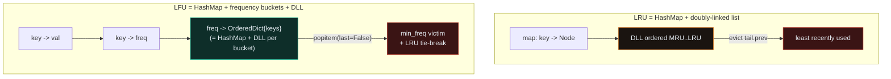
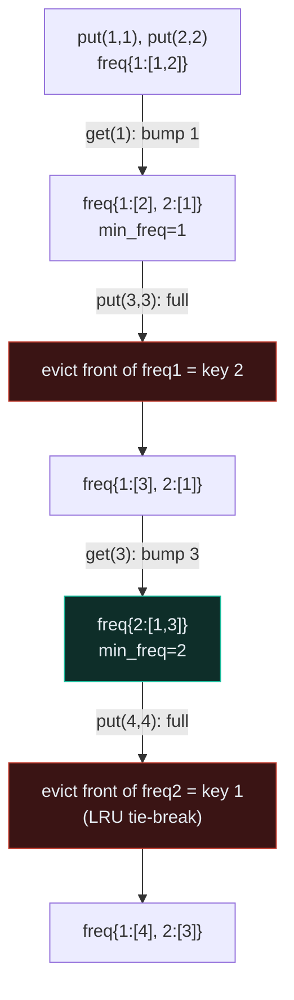

# Design — LFU Cache, LRU Cache — A Visual, Worked-Example Guide

> **Companion code:** [`design.py`](./design.py). **Every number is printed by
> `python3 design.py`** — nothing is hand-computed.
>
> **Live animation:** [`design.html`](./design.html) — open in a browser, drive `get`/`put` yourself and watch frequency buckets fill, keys migrate between buckets, and the LRU tie-break evict the right victim.

---

## 0. TL;DR — the one idea

> **The analogy (read this first):** You run a busy restaurant. Looking up a customer's order by walking a long list is too slow, so you keep **several fast-access lists** — one per question you need to answer instantly — and you update them all together so they never disagree. You spend **memory** to buy **time**. That is the whole *design* pattern: combine structures so every operation is **O(1)** average **and** a policy (recency / frequency) stays enforceable in O(1).

```mermaid
graph LR
    OP["op: get(k) / put(k,v)"] -->|O(1) locate| HM["HashMap<br/>key -> node / val"]
    HM -->|O(1) splice out| POS["policy structure<br/>DLL / freq bucket"]
    POS -->|O(1) re-insert at MRU| POS
    POS -.->|if full, O(1)| VICT["evict policy victim<br/>LRU tail / min_freq bucket"]
    style HM fill:#0e2e29,stroke:#1abc9c,color:#e6edf3
    style POS fill:#1a1410,stroke:#e67e22,color:#e6edf3
    style VICT fill:#3a1414,stroke:#c0392b,color:#e6edf3
```

The policy structure is what changes between the two caches:



The key recognition trick: an **OrderedDict is itself a HashMap + DLL**. `move_to_end` and `popitem(last=False)` are both O(1). For LRU you may use one directly; for LFU you keep **one per frequency bucket** so that, among all keys tied at the minimum frequency, the *least-recently-used* one is just the front of that bucket.

---

### Pattern Recognition Signals

| Signal in the problem statement | → Use this pattern |
|---|---|
| "Design a class", "implement a data structure" | ✓ design |
| "implement a cache", "eviction policy", "invalidate" | ✓ design |
| **"O(1) average time"** for get/put/insert/delete | ✓ **design** |
| **"Least Recently Used", "LRU"**, "last used", "recency" | ✓ **HashMap + DLL (P146)** |
| **"Least Frequently Used", "LFU"**, "use counter", "frequency" | ✓ **freq buckets (P460)** |
| "All O(1)" with both inc *and* dec of a counter | ✓ freq buckets with dec (P432) |
| "insert/remove/getRandom in O(1)" | ✓ list + val→idx map (P380) |

---

### The Template Skeleton

```python
# The interview starting point — memorize both shapes.

# --- LRU: HashMap + doubly-linked list --------------------------------
class _Node:
    __slots__ = ("key","val","prev","nxt")
    def __init__(self, key=0, val=0):
        self.key, self.val = key, val
        self.prev = self.nxt = None

class LRUCache:
    def __init__(self, capacity):
        self.cap = capacity
        self.map = {}                      # key -> Node  (O(1) locate)
        self.head = _Node()                # sentinel: head side = MRU
        self.tail = _Node()                # sentinel: tail side = LRU
        self.head.nxt = self.tail
        self.tail.prev = self.head

    def _remove(self, n):                  # O(1) splice out
        n.prev.nxt = n.nxt; n.nxt.prev = n.prev
    def _add_front(self, n):               # O(1) mark MRU
        n.prev = self.head; n.nxt = self.head.nxt
        self.head.nxt.prev = n; self.head.nxt = n

    def get(self, key):
        if key not in self.map: return -1
        n = self.map[key]
        self._remove(n); self._add_front(n)
        return n.val

    def put(self, key, value):
        if self.cap <= 0: return
        if key in self.map:                # UPDATE != INSERT
            n = self.map[key]; n.val = value
            self._remove(n); self._add_front(n); return
        n = _Node(key, value)
        self.map[key] = n; self._add_front(n)
        if len(self.map) > self.cap:       # evict LRU = tail.prev
            lru = self.tail.prev
            self._remove(lru); del self.map[lru.key]

# --- LFU: HashMap + frequency buckets (OrderedDict = HashMap + DLL) ----
from collections import OrderedDict
class LFUCache:
    def __init__(self, capacity):
        self.cap = capacity
        self.key_to_val  = {}              # key -> value
        self.key_to_freq = {}              # key -> frequency
        self.freq_to_keys = {}             # frequency -> OrderedDict{key}
        self.min_freq = 0

    def _bump(self, key):                  # freq += 1, refresh recency, O(1)
        f = self.key_to_freq[key]
        bucket = self.freq_to_keys[f]
        bucket.pop(key)                    # leave old bucket
        if not bucket:                     # DELETE EMPTY BUCKET
            del self.freq_to_keys[f]
            if self.min_freq == f:         # only bump min if it was here
                self.min_freq = f + 1
        nf = f + 1
        self.key_to_freq[key] = nf
        self.freq_to_keys.setdefault(nf, OrderedDict())[key] = None  # MRU

    def get(self, key):
        if key not in self.key_to_val: return -1
        self._bump(key)
        return self.key_to_val[key]

    def put(self, key, value):
        if self.cap <= 0: return
        if key in self.key_to_val:         # UPDATE != INSERT
            self.key_to_val[key] = value; self._bump(key); return
        if len(self.key_to_val) >= self.cap:        # evict LFU (+ LRU tie)
            bucket = self.freq_to_keys[self.min_freq]
            evict, _ = bucket.popitem(last=False)   # front = least recent
            if not bucket: del self.freq_to_keys[self.min_freq]
            del self.key_to_val[evict]; del self.key_to_freq[evict]
        self.key_to_val[key] = value
        self.key_to_freq[key] = 1
        self.freq_to_keys.setdefault(1, OrderedDict())[key] = None
        self.min_freq = 1                  # new key -> always the new min
```

---

## 1. P460 LFU Cache (Hard)

> **Problem:** Design a cache where `get` and `put` are both **O(1) average**, and when it overflows you evict the **least-frequently-used** key — breaking ties by **least-recently-used**.
> **Key insight:** Three dicts + a `min_freq` counter. `freq_to_keys[f]` is an **OrderedDict** (itself a HashMap + DLL) whose order encodes *recency within frequency f*. The victim is simply `popitem(last=False)` of the `min_freq` bucket — O(1), fully deterministic.

### Worked example — LeetCode P460 Example 1, capacity 2

> From `design.py` Section B. The buckets column lists keys **LRU → MRU** within each frequency (front is evicted first on a tie).

| op | return | evict | min_freq | freq buckets | key→val |
|---|---|---|---|---|---|
| (init) | null | – | 0 | (empty) | (empty) |
| `put(1,1)` | null | – | 1 | 1:[1] | 1:1 |
| `put(2,2)` | null | – | 1 | 1:[1, 2] | 1:1, 2:2 |
| `get(1)` | 1 | – | 1 | 1:[2], 2:[1] | 1:1, 2:2 |
| `put(3,3)` | null | **2** | 1 | 1:[3], 2:[1] | 1:1, 3:3 |
| `get(2)` | -1 | – | 1 | 1:[3], 2:[1] | 1:1, 3:3 |
| `get(3)` | 3 | – | 2 | 2:[1, 3] | 1:1, 3:3 |
| `put(4,4)` | null | **1** | 1 | 1:[4], 2:[3] | 3:3, 4:4 |
| `get(1)` | -1 | – | 1 | 1:[4], 2:[3] | 3:3, 4:4 |
| `get(3)` | 3 | – | 1 | 1:[4], 3:[3] | 3:3, 4:4 |
| `get(4)` | 4 | – | 2 | 2:[4], 3:[3] | 3:3, 4:4 |

**Read the two evictions:**
- `put(3,3)` evicts **key 2** — at that moment `min_freq=1` and bucket `1:[1,2]`, so the front (least-recent) is 2.
- `put(4,4)` evicts **key 1** — now `min_freq=2` and bucket `2:[1,3]` (both tied on frequency), so the **LRU tie-break** picks the front, 1. This tie-break is *why* you need an OrderedDict/DLL per bucket.

```
returns     = [null, null, 1, null, -1, 3, null, -1, 3, 4]
LeetCode    = [null, null, 1, null, -1, 3, null, -1, 3, 4]
match: True
```



---

## 2. P146 LRU Cache (Medium)

> **Problem:** Design a cache where `get` and `put` are both **O(1) average**, evicting the **least-recently-used** key on overflow.
> **Key insight:** A **HashMap** (`key → node`) gives O(1) locate; a **doubly-linked list** ordered **MRU … LRU** (with head/tail sentinels) gives O(1) splice-to-front (mark MRU) and O(1) drop-from-back (evict `tail.prev`). Every `get`/`put` that touches a key splices it to the front.

### Worked example — capacity 2

> From `design.py` Section C. The DLL order column is **MRU → LRU** (front = most recent; the tail end is evicted).

| op | return | evict | DLL order (MRU..LRU) | key→val |
|---|---|---|---|---|
| (init) | null | – | [] | (empty) |
| `put(1,1)` | null | – | [1] | 1:1 |
| `put(2,2)` | null | – | [2, 1] | 1:1, 2:2 |
| `get(1)` | 1 | – | [1, 2] | 1:1, 2:2 |
| `put(3,3)` | null | **2** | [3, 1] | 1:1, 3:3 |
| `get(2)` | -1 | – | [3, 1] | 1:1, 3:3 |
| `put(4,4)` | null | **1** | [4, 3] | 3:3, 4:4 |
| `get(1)` | -1 | – | [4, 3] | 3:3, 4:4 |
| `get(3)` | 3 | – | [3, 4] | 3:3, 4:4 |
| `get(4)` | 4 | – | [4, 3] | 3:3, 4:4 |

**Read the two evictions:**
- `put(3,3)` evicts **key 2** — after `get(1)` moved key 1 to MRU, key 2 is the LRU at the tail.
- `put(4,4)` evicts **key 1** — after key 2 was gone, key 1 became the LRU.

```
returns     = [null, null, 1, null, -1, null, -1, 3, 4]
expected    = [null, null, 1, null, -1, null, -1, 3, 4]
match: True
```

```mermaid
graph LR
    H["HEAD<br/>MRU side"] -.->|-> N1["k=1"] -| N2["k=2"] -.-> T["TAIL<br/>LRU side"]
    GET["get(1)"] -->|"splice 1 to front"| H
    T -->|"on overflow: evict tail.prev"| DROP["drop LRU"]
    style H fill:#0e2e29,stroke:#1abc9c,color:#e6edf3
    style T fill:#3a1414,stroke:#c0392b,color:#e6edf3
    style GET fill:#1a1410,stroke:#e67e22,color:#e6edf3
```

---

### Complexity

> From `design.py` Section D. All operations are O(1) average (HashMap ops are O(1) amortized); space is O(capacity).

| Operation | LRU | LFU | Space |
|---|---|---|---|
| `get` (hit) | O(1) | O(1) | O(cap) |
| `get` (miss) | O(1) | O(1) | O(cap) |
| `put` (new key, no evict) | O(1) | O(1) | O(cap) |
| `put` (new key, evict) | O(1) | O(1) | O(cap) |
| `put` (update existing) | O(1) | O(1) | O(cap) |

### Killer Gotchas

1. **Delete empty frequency buckets in LFU.** When `bucket[f]` empties after a bump, `del freq_to_keys[f]`. If you leave it, `min_freq` can point at an empty bucket and eviction looks up a victim that isn't there → `KeyError` / wrong eviction.
2. **Update `min_freq` correctly on a bump:** only when the emptied bucket *was* at `min_freq` do you set `min_freq = f + 1`. If the emptied bucket was above `min_freq`, leave `min_freq` alone.
3. **A new key always resets `min_freq = 1**`** — its frequency starts at 1, so it is the new global minimum. Forgetting this is the classic "works for a while, then evicts the wrong key" bug.
4. **Update ≠ insert.** `put()` on an *existing* key changes the value and bumps frequency / refreshes recency, but must **not** grow the size and must **not** evict. Guard `if key in map` **before** the capacity check.
5. **Zero / negative capacity:** handle `cap <= 0` at the top of `put` (no-op / return −1). LeetCode tests `cap = 0`.
6. **DLL sentinels:** always use a dummy head and tail so `_remove` and `_add_front` never special-case an empty list. Update `prev` and `nxt` in the right order, or you'll orphan a node.
7. **Recency within a frequency (the LFU tie-break):** without an OrderedDict/DLL per bucket, two keys at the same min-frequency evict in an **undefined** order and your cache is non-deterministic.
8. **Python `OrderedDict` is the DLL:** `move_to_end`, `popitem(last=False)` are O(1). For LRU you may use it directly; for LFU you need one per frequency bucket.

### Problem Table

> From `design.py` Section D.

| Problem | Diff | Key Trick |
|---|---|---|
| P460 LFU Cache | Hard | 3 dicts + `min_freq`; `OrderedDict` per bucket for O(1) LRU tie-break; delete empty buckets |
| P146 LRU Cache | Medium | HashMap + DLL (or `OrderedDict`); evict `tail.prev`; splice-to-front on every touch |
| P380 InsertDeleteGetRandom | Medium | list + val→idx map; remove = swap-with-last + pop |
| P355 Design Twitter | Medium | per-followee heaps of `(−timestamp, tweet)` merged for the news feed |
| P432 All O(1) Data Structure | Hard | freq buckets like LFU, but with both `inc` and `dec` of a counter |
| P716 Max Stack | Hard | two stacks, or DLL + sorted structure for `popMax` |
| P1146 Snapshot Array | Medium | version-stamped writes; per-snapshot read via binary search |
