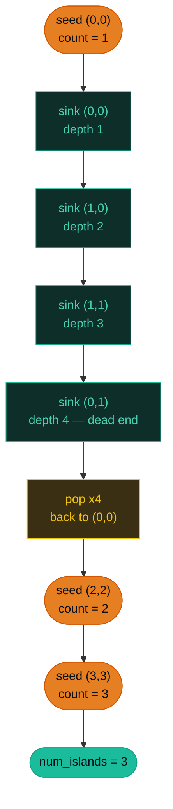
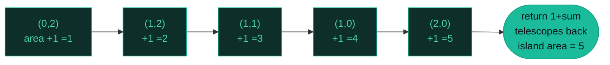
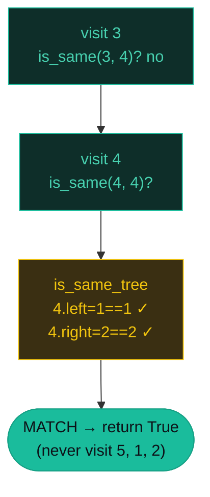

# DFS — Number of Islands, Max Area, Subtree — A Visual, Worked-Example Guide

> **Companion code:** [`dfs.py`](./dfs.py). **Every number is printed by
> `python3 dfs.py`** — nothing is hand-computed.
>
> **Live animation:** [`dfs.html`](./dfs.html) — open in a browser, step the recursion (and the call stack) yourself.

---

## 0. TL;DR — the one idea

> **The analogy (read this first):** You are inside a maze with a piece of chalk. Keep walking down one corridor until you hit a dead end. At a dead end, take **one step back** and try the next untried branch. The moment you enter any square you mark it on the floor — so you never walk in a circle forever.
>
> That is Depth-First Search. It plunges as **deep** as possible along one path before it ever considers an alternative. The chalk mark is the "visited" bit; the "one step back" is just a recursive `return`.

```mermaid
graph TD
    subgraph DEEP["DFS: plunge as deep as possible, then backtrack one frame"]
        S(["seed (0,0)<br/>count++"]) --> A["(0,0) sink<br/>depth 1"]
        A --> B["(1,0) sink<br/>depth 2"]
        B --> C["(1,1) sink<br/>depth 3"]
        C --> D["(0,1) sink<br/>depth 4"]
        D --> BTK["dead end<br/>pop frames, backtrack"]
        BTK --> NXT["try next untried neighbour"]
    end
    style S fill:#e67e22,stroke:#d35400,color:#0d1117
    style A fill:#0e2e29,stroke:#1abc9c,color:#48d1b0
    style B fill:#0e2e29,stroke:#1abc9c,color:#48d1b0
    style C fill:#0e2e29,stroke:#1abc9c,color:#48d1b0
    style D fill:#0e2e29,stroke:#1abc9c,color:#48d1b0
    style BTK fill:#3a2f12,stroke:#f1c40f,color:#f1c40f
    style NXT fill:#1abc9c,stroke:#16a085,color:#0d1117
    style DEEP fill:#0d1117,stroke:#30363d
```



The whole pattern is one recursive function. Change **what you do when you find a seed** and **whether the flood returns a value** to get all three problems:

```python
DIRS = [(1, 0), (-1, 0), (0, 1), (0, -1)]

def dfs(r, c):
    if r < 0 or r >= rows or c < 0 or c >= cols or grid[r][c] != target:
        return 0
    grid[r][c] = sunk          # MARK BEFORE recursing - never after
    area = 1
    for dr, dc in DIRS:
        area += dfs(r + dr, c + dc)
    return area                # P200 omits the return (void flood)
```

---

### Pattern Recognition Signals

| Signal in the problem statement | → Use this pattern |
|---|---|
| "number of islands" / "connected components" in a grid | ✓ grid flood-fill DFS (P200) |
| "largest/smallest connected component" / "max area of island" | ✓ flood-fill that returns area (P695) |
| "flood fill" / "paint bucket" / "flip a region" | ✓ in-place sink DFS |
| "is X a subtree of Y" / "does pattern tree appear inside Y" | ✓ two coupled tree DFS (P572) |
| "surrounded regions" / "capture" / "border-connected" | ✓ DFS from the border inward (P130) |
| "find ALL paths" / enumerate every configuration | ✓ DFS + backtracking (separate pattern) |
| **shortest** path / **minimum** steps on unweighted graph | ✗ use **BFS**, not DFS |
| Two players alternate, "can first player force a win" | ✗ use **minimax / game theory** |

---

### The Template Skeleton

```python
# The interview starting point — memorize this. Three variants share it.

# ---- GRID VARIANT (P200 count / P695 area) ----
DIRS = [(1, 0), (-1, 0), (0, 1), (0, -1)]

def dfs(r, c):
    if r < 0 or r >= rows or c < 0 or c >= cols or grid[r][c] != "1":
        return 0
    grid[r][c] = "0"               # MARK visited in place (sink the cell)
    area = 1
    for dr, dc in DIRS:
        area += dfs(r + dr, c + dc)
    return area                    # P200: `return` with no value


def num_islands(grid):             # P200 — count the seeds
    rows, cols = len(grid), len(grid[0])
    count = 0
    for r in range(rows):
        for c in range(cols):
            if grid[r][c] == "1":
                count += 1         # each fresh '1' starts exactly one island
                dfs(r, c)
    return count


def max_area_of_island(grid):      # P695 — keep the running max of dfs()
    rows, cols = len(grid), len(grid[0])
    best = 0
    for r in range(rows):
        for c in range(cols):
            if grid[r][c] == 1:
                best = max(best, dfs(r, c))
    return best


# ---- TREE VARIANT (P572) — two coupled recursions ----
def is_same_tree(a, b):
    if a is None and b is None: return True
    if a is None or b is None:  return False
    return (a.val == b.val
            and is_same_tree(a.left,  b.left)
            and is_same_tree(a.right, b.right))

def is_subtree(root, subRoot):
    if subRoot is None: return True
    if root is None:     return False
    return (is_same_tree(root, subRoot)
            or is_subtree(root.left,  subRoot)
            or is_subtree(root.right, subRoot))
```

---

## 1. P200 Number of Islands

> **Problem:** Given an `m×n` grid of `'1'` (land) and `'0'` (water), count the islands. An island is a group of `'1'`s connected **4-directionally** (no diagonals).
> **Key insight:** Sink each island in place (`'1' → '0'`) as DFS drowns it, so no separate `visited` set is needed. The outer scan counts how many times it has to **launch a fresh flood** — that count *is* the number of islands.

### Worked example — 3 islands

> From `dfs.py` Section A. Grid (LeetCode Example 1):

```
   1 1 0 0 0
   1 1 0 0 0
   0 0 1 0 0
   0 0 0 1 1
```

| island# | seed cell | cells sunk (order) | max depth |
|---|---|---|---|
| 1 | `(0,0)` | `(0,0), (1,0), (1,1), (0,1)` | 4 |
| 2 | `(2,2)` | `(2,2)` | 1 |
| 3 | `(3,3)` | `(3,3), (3,4)` | 2 |

`num_islands -> 3` · max recursion depth reached -> `4`

Watch the call stack grow along one path, then **pop** frame-by-frame at the dead end:

| step | action | cell | depth | stack (call path) |
|---|---|---|---|---|
| 0 | seed | `(0,0)` | 0 | `(empty)` |
| 1 | sink | `(0,0)` | 1 | `(0,0)` |
| 2 | sink | `(1,0)` | 2 | `(0,0)->(1,0)` |
| 3 | sink | `(1,1)` | 3 | `(0,0)->(1,0)->(1,1)` |
| 4 | sink | `(0,1)` | 4 | `(0,0)->(1,0)->(1,1)->(0,1)` |
| 5 | pop | `(0,1)` | 4 | `(0,0)->(1,0)->(1,1)` |
| 6 | pop | `(1,1)` | 3 | `(0,0)->(1,0)` |
| 7 | pop | `(1,0)` | 2 | `(0,0)` |
| 8 | pop | `(0,0)` | 1 | `(empty)` |
| 9 | seed | `(2,2)` | 0 | `(empty)` |



**Edge cases** (from `dfs.py` Section A): empty grid `[] → 0`; all water → `0`; all land 2×2 → `1`; single cell `[['1']] → 1`.

---

## 2. P695 Max Area of Island

> **Problem:** Given an `m×n` int grid of `1` (land) and `0` (water), return the **area** of the largest island. 0 if no land.
> **Key insight:** The *only* difference from P200 is that the flood **returns its area**: `1 + sum(dfs of the 4 neighbours)`. The outer loop keeps the running `max`. Sink cells (`1 → 0`) before recursing.

### Worked example — max area `5`

> From `dfs.py` Section B. Two islands: a 5-cell blob and a 4-cell block.

```
   0 0 1 0 0
   1 1 1 0 0
   1 0 0 1 1
   0 0 0 1 1
```

| island# | seed cell | area | running best |
|---|---|---|---|
| 1 | `(0,2)` | 5 | 5 |
| 2 | `(2,3)` | 4 | 5 |

`max_area_of_island -> 5` · max recursion depth reached -> `5`

Call-stack trace for the first island — the area accumulator ticks up with every sink, and the return values telescope back up (`1 + neighbours`):

| step | action | cell | depth | area_now | stack |
|---|---|---|---|---|---|
| 1 | sink | `(0,2)` | 1 | 1 | `(0,2)` |
| 2 | sink | `(1,2)` | 2 | 2 | `(0,2)->(1,2)` |
| 3 | sink | `(1,1)` | 3 | 3 | `(0,2)->(1,2)->(1,1)` |
| 4 | sink | `(1,0)` | 4 | 4 | `(0,2)->(1,2)->(1,1)->(1,0)` |
| 5 | sink | `(2,0)` | 5 | 5 | `(0,2)->(1,2)->(1,1)->(1,0)->(2,0)` |
| 6 | pop | `(2,0)` | 5 | 5 | `…->(1,0)` |
| 7 | pop | `(1,0)` | 4 | 5 | `…->(1,1)` |
| 8 | pop | `(1,1)` | 3 | 5 | `(0,2)->(1,2)` |
| 9 | pop | `(1,2)` | 2 | 5 | `(0,2)` |
| 10 | pop | `(0,2)` | 1 | 5 | `()` |



**Edge cases:** no land `[[0,0],[0,0]] → 0`; single cell `[[1]] → 1`; full 2×2 `[[1,1],[1,1]] → 4`. LeetCode Example 1 (the 8×13 grid) → `6`.

---

## 3. P572 Subtree of Another Tree

> **Problem:** Given two binary trees `root` and `subRoot`, return `True` iff `subRoot` appears as an **exact** subtree of `root` (same structure, same values).
> **Key insight:** **Two coupled recursions.** The outer `is_subtree` walks every node of `root`; at each node the inner `is_same_tree` checks structural equality against `subRoot`. Short-circuit with `or` so the first match wins.

### Worked example — `True`

> From `dfs.py` Section C.

```
    root           subRoot
      3              4
     / \            / \
    4   5          1   2
   / \
  1   2
```

`ascii dump: root = 3,4,5,1,2` · `subRoot = 4,1,2`

| step | node | depth | matched? | stack (path of vals) |
|---|---|---|---|---|
| 0 | 3 | 1 | no | `3` |
| 1 | 4 | 2 | **YES** | `3->4` |

`is_subtree(root, subRoot) -> True` — the outer DFS only walks **two** nodes before `is_same_tree(node=4, subRoot)` matches and short-circuits.



### Worked example — `False`

Root has an extra node `0` under `2`:

```
      3               subRoot
     / \                4
    4   5              / \
   / \                1   2
  1   2
     /
    0
```

`is_subtree(root2, subRoot) -> False` — `is_same_tree` fails at the node `4` (root's `2` has a left child `0` but subRoot's `2` does not), and at no other node does a match appear.

**Edge cases:** empty `subRoot → True` (empty tree is a subtree of everything); empty `root` + nonempty `sub → False`; identical trees → `True`; `sub` larger than `root → False`.

---

## 4. Extensions (briefly)

- **P463 Island Perimeter** — per land cell add `+4`, subtract `1` for each land neighbour. Or `land*4 − 2*shared_edges`.
- **P130 Surrounded Regions** — DFS from every border `'O'`, marking reachable cells as safe; flip all *other* `'O'`s to `'X'`.
- **P1306 Jump Game III** — DFS on an index graph; `visited.add(i)` before branching to avoid cycles.
- **P617 Merge Two Binary Trees** — parallel DFS building a new tree node-by-node.
- **P133 Clone Graph** — DFS + a hashmap mapping old nodes to their clones.

---

### Complexity

> From `dfs.py` Section D.

| Operation | Time | Space |
|---|---|---|
| Number of Islands (P200) | O(R·C) | O(R·C) |
| Max Area of Island (P695) | O(R·C) | O(R·C) |
| Subtree of Another Tree (P572) | O(m·n) | O(m+n) |
| General DFS on graph | O(V + E) | O(V + E) |

*`R·C` = grid cells; `m` = nodes in `root`, `n` = nodes in `subRoot`.*

### Killer Gotchas

1. **MARK BEFORE YOU MOVE.** Set `grid[r][c] = sunk` (or add to a visited set) **before** the recursive calls, never after. Marking after lets two neighbours each call `dfs` on the other → infinite recursion → stack overflow / TLE.
2. **Sink in place** (`'1'→'0'`) to avoid allocating a visited set — O(1) extra space per cell and reads cleanly.
3. **Check bounds before indexing.** The guard `if r < 0 or r >= rows or c < 0 or c >= cols:` must come *before* `grid[r][c]` or you get `IndexError`.
4. **Python's recursion limit is ~1000.** A long snake island in a 1000×1000 grid can overflow the stack — use `sys.setrecursionlimit` or an explicit stack.
5. **P695 returns the area; P200 does not.** The only difference between the two grid skeletons is whether `_flood` returns an int.
6. **P572 needs BOTH recursions.** A common bug is to check `is_same` at the root only and miss a match deeper. Short-circuit with `or`.
7. **P572 edge case:** `subRoot is None` is **always** true — handle it first.

### Problem Table

> From `dfs.py` Section D.

| Problem | Essence | Key Trick |
|---|---|---|
| P200 Number of Islands | Count connected `'1'` components | Sink `'1'→'0'` in place; count seeds |
| P695 Max Area of Island | Largest connected `1` component | `_area` returns `1 + sum(neighbours)`; keep running `max` |
| P572 Subtree of Another Tree | Does `subRoot` appear as an exact subtree? | Outer `is_subtree` + inner `is_same_tree`; short-circuit `or` |
| P463 Island Perimeter | Per land cell, count water/OOB neighbours | `+4` per land, `−1` per land neighbour |
| P1306 Jump Game III | Can index with value 0 be reached via ±jumps? | DFS on index graph; `visited.add(i)` before branching |
| P133 Clone Graph | Deep-copy a connected graph | DFS + hashmap old→new node |
| P617 Merge Two Binary Trees | Overlay two trees | Parallel DFS building a new tree |
| P130 Surrounded Regions | Flip `'O'`s not connected to the border | DFS from border `'O'`s; flip the rest |
