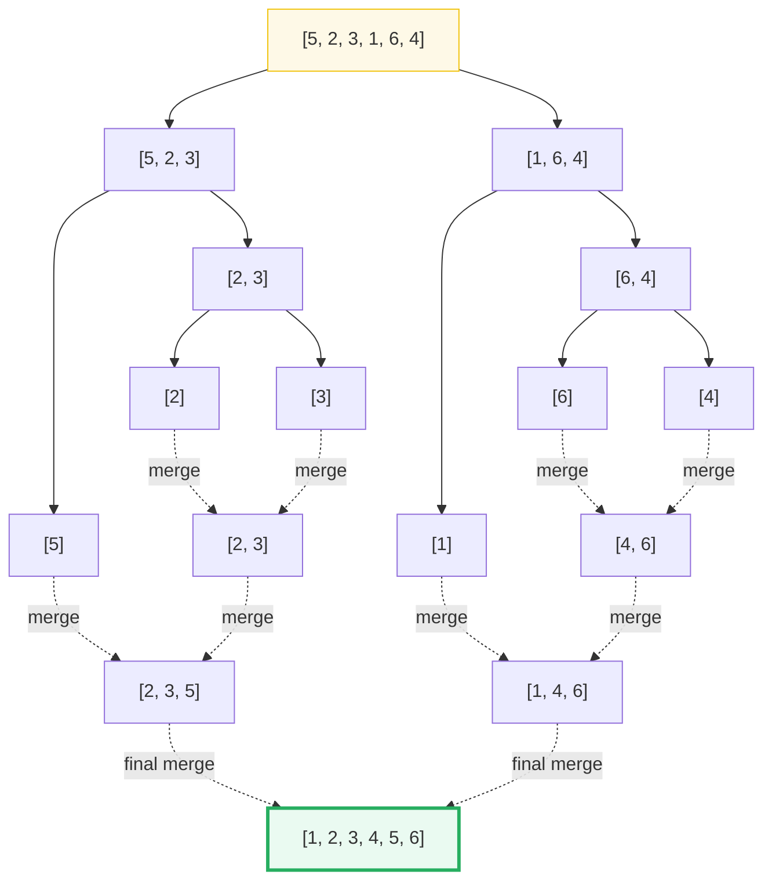
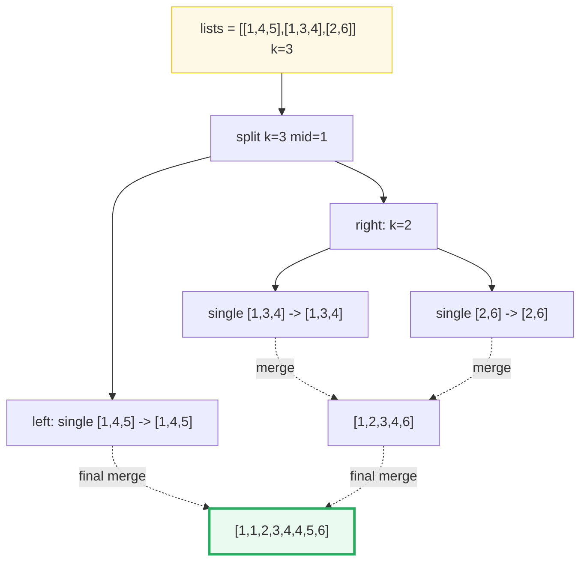

# Divide & Conquer — P023, P169, P912 — A Visual, Worked-Example Guide

> **Companion code:** [`divide_and_conquer.py`](./divide_and_conquer.py). **Every number is printed by
> `python3 divide_and_conquer.py`** — nothing is hand-computed.
>
> **Live animation:** [`divide_and_conquer.html`](./divide_and_conquer.html) — open in a browser.

---

## 0. TL;DR — the one idea

> **The analogy (read this first):** You have 100 unsorted cards. Sorting them all at once is hard, so
> you **split** the deck into two piles of 50, hand each pile to a friend, and they keep splitting until
> everyone holds a single card (already sorted!). Then you **merge** the sorted piles back together. The
> clever bit is the *merge*: splitting is trivial, but the work of comparing two sorted halves with two
> pointers is exactly O(n) — and doing that across `log₂ n` levels of the recursion tree gives the magic
> **O(n log n)** instead of O(n²). **Divide (halve) → Conquer (recurse) → Combine (merge).**

```mermaid
flowchart TD
    A["input array of size n"] --> B{"len ≤ 1?"}
    B -->|"yes: base case"| BASE["return as-is<br/>(already sorted)"]
    B -->|"no: DIVIDE"| S["mid = n // 2<br/>left = arr[:mid]  right = arr[mid:]"]
    S --> L["CONQUER: merge_sort(left)"]
    S --> R["CONQUER: merge_sort(right)"]
    L --> M["COMBINE: two-pointer merge(left, right)"]
    R --> M
    M --> OUT["sorted array of size n"]
    style S fill:#eafaf1,stroke:#27ae60,stroke-width:2px
    style M fill:#fef9e7,stroke:#f1c40f,stroke-width:2px
    style BASE fill:#0a0e14,stroke:#30363d
```



The three problems in this bundle are the same halving idea wearing three hats:

| Variant | What you halve | The combine step | Problem |
|---|---|---|---|
| Merge sort | the **array** into two halves | two-pointer merge → sorted array | P912 Sort an Array |
| Majority | nothing — **linear scan**, but same "pair-off and cancel" spirit | cancel unlike votes, survivor is majority | P169 Majority Element |
| Merge k lists | the **list-of-lists** into two groups of lists | two-pointer merge of the two flat results | P023 Merge k Sorted Lists |

> **The merge note:** P169 Boyer-Moore is **not** a recursive divide-and-conquer algorithm — it is a
> single O(n) pass. It is grouped here because it solves a classic "split the problem in half" *concept*
> (the majority element survives because it outnumbers all others combined). Interviewers accept it as
> the expected answer for P169.

---

### Pattern Recognition Signals

| Signal in the problem statement | → Use divide & conquer |
|---|---|
| "**sort an array**" with O(n log n) required, stable, or on linked lists | ✓ merge sort (P912, P148) |
| "**merge k sorted …**" (lists / arrays / streams) | ✓ D&C pair-merge or min-heap (P023) |
| "**count inversions**" or "**reverse pairs**" | ✓ merge sort + count on the cross-half |
| "find element appearing **more than n/2** times" | ✓ Boyer-Moore voting (P169) |
| Recurrence looks like `T(n) = 2T(n/2) + O(n)` → Master Theorem Case 2 | ✓ O(n log n) |
| "construct a **quad tree**" / 2-D grid split into 4 quadrants | ✓ quad D&C (P427) |
| "**median of two sorted arrays**" in O(log(m+n)) | ✓ binary-search D&C (P4) |

---

### The Template Skeleton

```python
# --- The three-step D&C skeleton (memorize this shape) ---
def divide_and_conquer(arr):
    # 1. BASE CASE
    if len(arr) <= 1:
        return arr[:]                       # 1 element (or 0) is already solved

    # 2. DIVIDE  — halve the problem
    mid = len(arr) // 2
    left  = arr[:mid]
    right = arr[mid:]

    # 3. CONQUER — recurse on each half
    left_res  = divide_and_conquer(left)
    right_res = divide_and_conquer(right)

    # 4. COMBINE — the real work. Here: two-pointer merge.
    return merge_two(left_res, right_res)


# The two-pointer merge — shared by merge sort AND merge-k-lists.
def merge_two(a, b):
    out, i, j = [], 0, 0
    while i < len(a) and j < len(b):
        if a[i] <= b[j]:                    # <= keeps the sort STABLE
            out.append(a[i]); i += 1
        else:
            out.append(b[j]); j += 1
    out.extend(a[i:])                       # drain whichever half remains
    out.extend(b[j:])
    return out


# Boyer-Moore majority voting — O(n) time, O(1) space. NOT recursive.
def majority_element(nums):
    candidate, count = nums[0], 1
    for n in nums[1:]:
        if count == 0:                      # vote cancelled out → pick a new boss
            candidate, count = n, 1
        elif n == candidate:                # same team → +1
            count += 1
        else:                               # different team → -1 (cancels)
            count -= 1
    return candidate                        # majority guaranteed to survive
```

---

## 1. P912 Sort an Array — Merge Sort (the canonical D&C)

> **Problem:** Sort an array of integers. (LeetCode disallows the built-in sort — you must implement it.)
> **Key insight:** Split at `mid`, recurse on each half (now two sorted halves), then two-pointer *merge*
> the halves. The recursion bottoms out at length-1 subarrays which are trivially sorted.

> From `divide_and_conquer.py` Section "P912 Sort an Array":

```
input = [5, 2, 3, 1, 6, 4]

split  [5, 2, 3, 1, 6, 4]  mid=3  -> [5, 2, 3] | [1, 6, 4]
  split  [5, 2, 3]  mid=1  -> [5] | [2, 3]
    base   [5] -> already sorted
    split  [2, 3]  mid=1  -> [2] | [3]
      base   [2] -> already sorted
      base   [3] -> already sorted
    merge  [2] + [3] -> [2, 3]
  merge  [5] + [2, 3] -> [2, 3, 5]
  split  [1, 6, 4]  mid=1  -> [1] | [6, 4]
    base   [1] -> already sorted
    split  [6, 4]  mid=1  -> [6] | [4]
      base   [6] -> already sorted
      base   [4] -> already sorted
    merge  [6] + [4] -> [4, 6]
  merge  [1] + [4, 6] -> [1, 4, 6]
merge  [2, 3, 5] + [1, 4, 6] -> [1, 2, 3, 4, 5, 6]

>> merge_sort([5, 2, 3, 1, 6, 4]) = [1, 2, 3, 4, 5, 6]   [check] OK
>> merge_sort([38, 27, 43, 3, 9, 82, 10]) = [3, 9, 10, 27, 38, 43, 82]   [check] OK
```

**Reading the tree.** The indentation *is* the recursion depth. Each `split` halves the array; each
`merge` zippers two sorted children back together. For `n = 6` there are `⌈log₂ 6⌉ = 3` levels, and every
element participates in exactly one merge per level → **O(n log n)** total comparisons. The final merge
`[2,3,5] + [1,4,6] → [1,2,3,4,5,6]` compares the two heads and takes the smaller, 6 comparisons worst case.



---

## 2. P169 Majority Element — Boyer-Moore Voting

> **Problem:** Given an array of size `n`, find the element that appears **more than `n/2` times**
> (its existence is guaranteed).
> **Key insight:** Pair off **unlike** elements and cancel them. The majority element, by definition,
> outnumbers every other element combined, so it *cannot* be fully cancelled — the survivor is the
> majority. A single counter does the job: `+1` when the current element matches the candidate, `-1` when
> it differs, and a fresh candidate when the counter hits `0`.

> From `divide_and_conquer.py` Section "P169 Majority Element":

```
input = [2, 2, 1, 1, 1, 2, 2]   (n = 7, majority appears > 3 times)

   i   num  action                      candidate  count
  ----------------------------------------------------------
   0     2  start                               2      1
   1     2  same -> count++                     2      2
   2     1  diff -> count--                     2      1
   3     1  diff -> count--                     2      0
   4     1  count == 0 -> new candidate          1      1
   5     2  diff -> count--                     1      0
   6     2  count == 0 -> new candidate          2      1

>> majority_element([2, 2, 1, 1, 1, 2, 2]) = 2   [check] OK
>> majority_element([3, 2, 3]) = 3   [check] OK
```

| i | num | action | candidate | count |
|---|---|---|---|---|
| 0 | 2 | start | 2 | 1 |
| 1 | 2 | same → `count++` | 2 | 2 |
| 2 | 1 | diff → `count--` | 2 | 1 |
| 3 | 1 | diff → `count--` | 2 | 0 |
| 4 | 1 | `count==0` → new candidate | 1 | 1 |
| 5 | 2 | diff → `count--` | 1 | 0 |
| 6 | 2 | `count==0` → new candidate | 2 | 1 |

**Why it works on `[2,2,1,1,1,2,2]`:** the `2`s appear 4 times, every other value 3 times. Cancelling 4
"team-2" votes against 3 "anti" votes always leaves at least one `2` standing. The counter drops to `0`
twice (indices 3 and 5), and each time it re-seeds to the current element — but the *final* survivor is
the true majority. The majority appears `> n/2` times, so this guarantee holds regardless of order.


---

## 3. P023 Merge k Sorted Lists — D&C on the List-of-Lists

> **Problem:** Merge `k` sorted linked lists into one sorted list. (Here implemented with Python lists for
> clarity; the algorithm is identical for linked-list nodes.)
> **Key insight:** Do **NOT** merge list-by-list against an accumulator (that's O(n·k)). Instead, apply
> D&C to the *array of lists*: split `k` lists into two halves, recursively merge each half into one flat
> sorted list, then two-pointer merge the two results. The recursion depth is `log₂ k`, each level does
> O(n) total work → **O(n log k)**.

> From `divide_and_conquer.py` Section "P023 Merge k Sorted Lists":

```
input = [[1, 4, 5], [1, 3, 4], [2, 6]]   (k = 3 lists)

split  k=3 mid=1 -> left=[[1, 4, 5]] | right=[[1, 3, 4], [2, 6]]
  single [1, 4, 5] -> [1, 4, 5]
  split  k=2 mid=1 -> left=[[1, 3, 4]] | right=[[2, 6]]
    single [1, 3, 4] -> [1, 3, 4]
    single [2, 6] -> [2, 6]
  merge  [1, 3, 4] + [2, 6] -> [1, 2, 3, 4, 6]
merge  [1, 4, 5] + [1, 2, 3, 4, 6] -> [1, 1, 2, 3, 4, 4, 5, 6]

>> merge_k_sorted_lists([[1, 4, 5], [1, 3, 4], [2, 6]]) = [1, 1, 2, 3, 4, 4, 5, 6]   [check] OK
>> merge_k_sorted_lists([[1, 2, 3], [4, 5, 6, 7]]) = [1, 2, 3, 4, 5, 6, 7]   [check] OK
```

**Why this beats sequential merging.** Merging list 1 + list 2, then + list 3, …, + list k forces early
lists to be re-scanned every step: total cost `O(n·k)`. Pairing them up tournament-bracket style means each
element is merged only `log₂ k` times: `O(n log k)`. The base case `len(lists) == 1` returns the single
list unchanged; the empty case returns `[]`.



---

## Complexity

| Operation | Time | Space |
|---|---|---|
| Merge sort (P912) | O(n log n) | O(n) auxiliary |
| Boyer-Moore majority (P169) | O(n) | O(1) |
| Merge k sorted lists — D&C (P023) | O(n log k) | O(n) for result + O(log k) stack |
| Merge k sorted lists — min-heap | O(n log k) | O(k) heap |
| Count inversions (merge-sort variant) | O(n log n) | O(n) |
| Median of two sorted arrays (P4) | O(log(min(m,n))) | O(1) |

**Master Theorem check for merge sort:** `T(n) = 2T(n/2) + O(n)` → `a=2, b=2`, so `log_b(a) = 1`, and
`f(n) = O(n) = O(n^1)` matches Case 2 → `T(n) = Θ(n log n)`. The `n` is the per-level merge cost; the
`log n` is the depth of the split tree.

---

## Killer Gotchas

- **Forget the base case → infinite recursion.** `len(arr) <= 1` MUST return before recursing. Omitting it
  sends an empty list into `mid = 0` and re-splits forever (`RecursionError`).
- **Slicing doubles memory:** `arr[:mid]` allocates a fresh list at *every* level → O(n log n) total extra
  space. If memory matters, pass `(arr, lo, hi)` indices and use one O(n) scratch buffer (true in-place
  merge sort is hard; the index version is the pragmatic choice).
- **Non-stable merge:** use `a[i] <= b[j]` (with the `=`), not strict `<`. The `=` is what makes merge
  sort *stable* — equal elements keep their original relative order. Drop it and duplicates can reorder.
- **P169 needs the majority guarantee.** Boyer-Moore only works when a majority `> n/2` is *promised*. If
  there may be no majority, run a second O(n) pass to count the candidate and confirm it exceeds `n/2`
  (e.g. P229 Majority Element II).
- **P23: don't merge sequentially.** Folding list-by-list into an accumulator is O(n·k). Always pair-merge
  (D&C) or use a min-heap of size k — both give O(n log k).
- **Counting cross-pairs (inversions / reverse pairs):** COUNT using the original values *before* you SORT
  the merged subarray. Swapping the count phase and the sort phase corrupts the pair relationships.
- **Quad-tree uniform scan is O(size²):** splitting a 2-D grid into quadrants and scanning the whole
  quadrant to test uniformity is O(n²) per level in the worst case → O(n² log n), not O(n log n). Don't
  assume every D&C grid problem is linearithmic.

---

## Problem Table

| Problem | Difficulty | Essence | Key Trick |
|---|---|---|---|
| P912 Sort an Array | Medium | classic merge sort | split at `mid`, recurse, two-pointer merge; base `len ≤ 1` returns a copy |
| P023 Merge k Sorted Lists | Hard | D&C on the list-of-lists array | split `k` lists in half, recurse each half, two-pointer merge; O(n log k) |
| P169 Majority Element | Easy | Boyer-Moore voting (not recursive D&C) | `count==0` → new candidate; same → `+1`; diff → `-1`; needs majority `> n/2` |
| P148 Sort List | Medium | merge sort on a linked list | slow/fast pointer for midpoint; O(1)-space pointer merge |
| P315 Count of Smaller Numbers After Self | Hard | merge sort + per-element cross counts | track original indices; accumulate counts during merge |
| P493 Reverse Pairs | Hard | merge sort counting `A[i] > 2*A[j]` | separate two-pointer count pass BEFORE merging |
| P427 Construct Quad Tree | Medium | 2-D D&C subdivision | `all_same` → leaf; else split into 4 quadrants |
| P4 Median of Two Sorted Arrays | Hard | binary-search D&C | binary search the partition of the smaller array; O(log(min(m,n))) |
