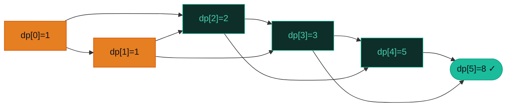
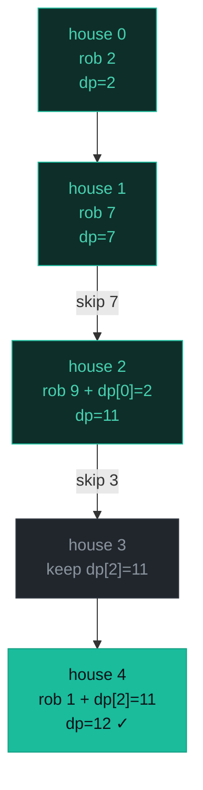
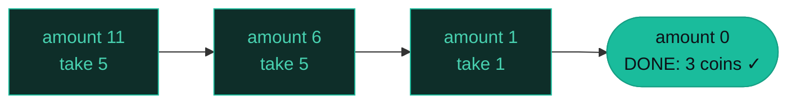
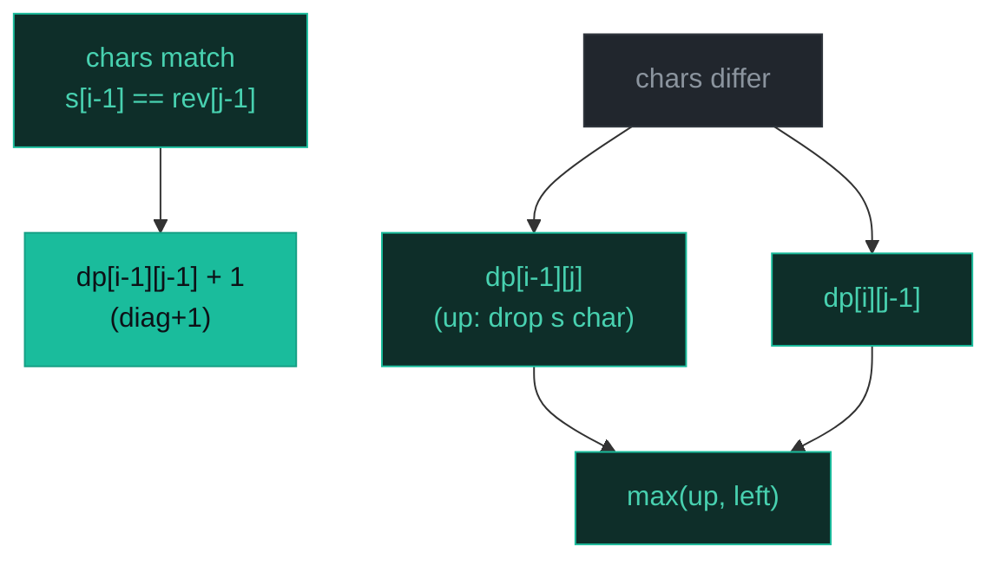

# Dynamic Programming — Climbing Stairs, House Robber, Coin Change, LPS — A Visual, Worked-Example Guide

> **Companion code:** [`dynamic_programming.py`](./dynamic_programming.py). **Every number is printed by
> `python3 dynamic_programming.py`** — nothing is hand-computed.
>
> **Live animation:** [`dynamic_programming.html`](./dynamic_programming.html) — open in a browser, watch the DP table fill cell-by-cell.

---

## 0. TL;DR — the one idea

> **The analogy (read this first):** Dynamic Programming is "smart brute force" — like filling a spreadsheet once. Every cell `dp[i]` (or `dp[i][j]`) holds the answer to a *smaller version* of the problem. You fill cells in an order that guarantees each cell's dependencies are already filled when you reach it. The answer to the whole problem lives in one specific cell — usually the last one.
>
> Naive recursion recomputes the same sub-answer many times (exponential blowup). DP computes each sub-answer **exactly once** and looks it up thereafter. The trick is finding the *state* — what one cell means — and the *recurrence* — how a cell combines its already-filled neighbours.

Two conditions must hold for DP to apply:
1. **Overlapping subproblems** — the same sub-answer is needed many times.
2. **Optimal substructure** — the optimal answer to the whole problem is built from optimal answers to its sub-problems.

```mermaid
graph LR
    subgraph SPREAD["Fill the table: each cell needs smaller cells already filled"]
        B0["dp[0]<br/>base case"] --> B1["dp[1]<br/>base case"]
        B1 --> R1["dp[2]<br/>recurrence"]
        R1 --> R2["dp[3]<br/>recurrence"]
        R2 --> R3["dp[4]<br/>recurrence"]
        R3 --> ANS(["dp[n]<br/>= ANSWER"])
    end
    style B0 fill:#e67e22,stroke:#d35400,color:#0d1117
    style B1 fill:#e67e22,stroke:#d35400,color:#0d1117
    style R1 fill:#0e2e29,stroke:#1abc9c,color:#48d1b0
    style R2 fill:#0e2e29,stroke:#1abc9c,color:#48d1b0
    style R3 fill:#0e2e29,stroke:#1abc9c,color:#48d1b0
    style ANS fill:#1abc9c,stroke:#16a085,color:#0d1117
    style SPREAD fill:#0d1117,stroke:#30363d
```



### The 5-step recipe (every DP problem, every time)

1. **Define the state** — what does `dp[i]` (or `dp[i][j]`) represent? Write one English sentence. This is the hardest step.
2. **Identify base cases** — the trivial smallest instance (almost always `dp[0]`).
3. **Write the recurrence** — how `dp[i]` depends on smaller states.
4. **Choose fill order** — bottom-up (tabulation) or top-down (memoization). Ensure each subproblem is solved before it is needed.
5. **Extract the answer** — usually `dp[n]`, sometimes `max(dp)`.

---

### Pattern Recognition Signals

| Signal in the problem statement | → Use this pattern |
|---|---|
| "count the number of distinct ways" / "in how many ways" | ✓ 1D DP (P070 Climbing Stairs) |
| "maximum/minimum" over a sequence where adjacent choices conflict | ✓ rob-or-skip 1D DP (P198 House Robber) |
| "fewest/minimum items to reach a total" with unlimited reuse | ✓ unbounded knapsack (P322 Coin Change) |
| "longest/shortest subsequence" on a string, chars need not be contiguous | ✓ string/interval DP (P516 LPS) |
| "can you partition into equal subsets" / "target sum with +/-" | ✓ 0/1 knapsack in disguise (P416, P494) |
| A greedy choice is **always** optimal (no overlap) | ✗ use **greedy**, not DP |
| Characters must be **contiguous** (substring) | ✗ try **expand-around-center** or sliding window first |

---

### The Template Skeleton

```python
# ---- The interview starting point — memorize these two shapes. ----

# (A) 1D BOTTOM-UP DP — Climbing Stairs, House Robber, Coin Change share this.
def solve_1d(items):
    n = len(items)
    dp = [INIT] * (n + 1)        # INIT = 0 (max/count) or INF (min)
    dp[0] = BASE                 # almost always the anchor
    for i in range(1, n + 1):
        # recurrence: combine dp[i-1], dp[i-2], ... into dp[i]
        dp[i] = COMBINE(dp[i-1], dp[i-2], ...)
    return dp[n]

# Space-optimised: if dp[i] only needs dp[i-1] and dp[i-2], drop the array:
def solve_1d_rolling(items):
    prev2, prev1 = BASE0, BASE1
    for i in range(2, n + 1):
        prev2, prev1 = prev1, COMBINE(prev1, prev2, ...)
    return prev1


# (B) 2D / STRING DP — LCS, LPS, Edit Distance all share this table.
def lcs_table(s1, s2):
    m, n = len(s1), len(s2)
    dp = [[0] * (n + 1) for _ in range(m + 1)]
    for i in range(1, m + 1):
        for j in range(1, n + 1):
            if s1[i - 1] == s2[j - 1]:       # NOTE: s1[i-1], not s1[i]!
                dp[i][j] = dp[i - 1][j - 1] + 1
            else:
                dp[i][j] = max(dp[i - 1][j], dp[i][j - 1])
    return dp[m][n]
```

---

## 1. P070 Climbing Stairs

> **Problem:** It takes `n` steps to reach the top. Each time you can climb 1 or 2 steps. How many distinct ways can you climb to the top?
> **Key insight:** To reach stair `i`, you either came from `i-1` (1 step) or `i-2` (2 steps). So `dp[i] = dp[i-1] + dp[i-2]` — this is Fibonacci shifted by one. Only the last two cells matter, so two rolling variables give O(1) space.

### Worked example — `n = 5` → `8`

> From `dynamic_programming.py` Section A. State: `dp[i]` = number of distinct ways to reach stair `i`.

| i | prev2 | prev1 | new = prev1 + prev2 |
|---|---|---|---|
| 0 | seed | seed | 1 |
| 1 | seed | seed | 1 |
| 2 | 1 | 1 | 2 = 1 + 1 |
| 3 | 1 | 2 | 3 = 2 + 1 |
| 4 | 2 | 3 | 5 = 3 + 2 |
| 5 | 3 | 5 | 8 = 5 + 3 |

`climb_stairs(5) -> 8`



**Sequence (n=1..10):** `1, 2, 3, 5, 8, 13, 21, 34, 55, 89` — Fibonacci shifted by one.

**Edge cases** (from Section A): `n=0 → 1` (one way: do nothing); `n=1 → 1`; `n=2 → 2` (1+1, or 2).

---

## 2. P198 House Robber

> **Problem:** Given an array `nums` of non-negative money per house, return the max you can rob without touching two adjacent houses.
> **Key insight:** At each house you **skip** (keep `dp[i-1]`) or **rob** (add `nums[i]` to `dp[i-2]` — `i-2` because adjacency forbids `i-1`). `dp[i] = max(dp[i-1], dp[i-2] + nums[i])`. Two rolling variables again → O(1) space.

### Worked example — `nums = [2, 7, 9, 3, 1]` → `12`

> From `dynamic_programming.py` Section B. State: `dp[i]` = max money robbing houses `[0..i]`.

| i | nums[i] | skip=dp[i-1] | rob=dp[i-2]+nums[i] | best | pick |
|---|---|---|---|---|---|
| 0 | 2 | seed | seed | 2 | seed |
| 1 | 7 | 2 | 7 | 7 | rob |
| 2 | 9 | 7 | 11 | 11 | rob |
| 3 | 3 | 11 | 10 | 11 | skip |
| 4 | 1 | 11 | 12 | 12 | rob |

`rob([2, 7, 9, 3, 1]) -> 12` — path: rob `2` (i=0) → skip `7` → rob `9` → skip `3` → rob `1`. Sum = 2 + 9 + 1 = 12.



**Edge cases:** `[] → 0`; `[5] → 5`; `[2,1] → 2` (rob the 2); `[1,2,3] → 4` (rob 1 and 3).

---

## 3. P322 Coin Change

> **Problem:** Given `coins` of distinct denominations and an `amount`, return the fewest coins needed to make that amount (each coin reusable). Return `-1` if impossible.
> **Key insight:** **Unbounded knapsack.** `dp[i] = min over coins c≤i of (dp[i-c] + 1)` — "take one coin `c`, then fill the rest optimally." Because coins are reusable, you look at the *same* row (forward iteration lets `dp[i-c]` already include coin `c`). Init every cell to `amount+1` (a sentinel bigger than any real answer); if `dp[amount]` is still the sentinel at the end, return `-1`.

### Worked example — `coins = [1, 2, 5], amount = 11` → `3`

> From `dynamic_programming.py` Section C. State: `dp[i]` = minimum coins to make amount `i`.

| i | candidates (coin → dp[i-coin]+1) | best | best_coin |
|---|---|---|---|
| 0 | (none) | 0 | - |
| 1 | 1→1 | 1 | 1 |
| 2 | 1→2, 2→1 | 1 | 2 |
| 3 | 1→2, 2→2 | 2 | 1 |
| 4 | 1→3, 2→2 | 2 | 2 |
| 5 | 1→3, 2→3, 5→1 | 1 | 5 |
| 6 | 1→2, 2→3, 5→2 | 2 | 1 |
| 7 | 1→3, 2→2, 5→2 | 2 | 2 |
| 8 | 1→3, 2→3, 5→3 | 3 | 1 |
| 9 | 1→4, 2→3, 5→3 | 3 | 2 |
| 10 | 1→4, 2→4, 5→2 | 2 | 5 |
| 11 | 1→3, 2→4, 5→3 | 3 | 1 |

`coin_change([1, 2, 5], 11) -> 3`

**Reconstruction (greedy walk-back):** `amount=11, best_coin=5` → take 5, remaining 6 → `best_coin=5` → take 5, remaining 1 → `best_coin=1` → take 1, remaining 0. Result: `[5, 5, 1]`.



**Edge cases:** `coins=[2], amount=3 → -1` (odd amount, even coin); `coins=[1], amount=0 → 0`; `coins=[1,5,10], amount=27 → 5` (10+10+5+1+1).

---

## 4. P516 Longest Palindromic Subsequence

> **Problem:** Given a string `s`, find the length of the longest palindromic **subsequence** (chars need not be contiguous).
> **Key insight:** The reduction — **`LPS(s) = LCS(s, reverse(s))`**. A palindromic subsequence reads the same forward and backward, so it is exactly a subsequence common to `s` and its reverse. Fill a 2D `LCS(s, rev)` table row by row; the bottom-right cell is the answer. This is the same table shape as Edit Distance and Distinct Subsequences — only the arithmetic changes.

### Worked example — `s = 'bbbab', reverse = 'babbb'` → `4`

> From `dynamic_programming.py` Section D. State: `dp[i][j]` = LCS length of `s[:i]` and `reverse(s)[:j]`. **Note:** `dp[i][j]` covers `s[:i]`, so the character at dp-position `i` is `s[i-1]` in string-land.

|   | b | a | b | b | b |
|---|---|---|---|---|---|
| **b** | 1 | 1 | 1 | 1 | 1 |
| **b** | 1 | 1 | 2 | 2 | 2 |
| **b** | 1 | 1 | 2 | 3 | 3 |
| **a** | 1 | 2 | 2 | 3 | 3 |
| **b** | 1 | 2 | 3 | 3 | **4** |

`longest_palindrome_subseq('bbbab') -> 4` (drop the `a` → `'bbbb'`).

**Transition tally** (first 12 of 25 cell fills, row-major order):

| (i,j) | s[i] | rev[j] | value | transition |
|---|---|---|---|---|
| (1,1) | b | b | 1 | diag+1 |
| (1,2) | b | a | 1 | left |
| (1,3) | b | b | 1 | diag+1 |
| (1,4) | b | b | 1 | diag+1 |
| (1,5) | b | b | 1 | diag+1 |
| (2,1) | b | b | 1 | diag+1 |
| (2,2) | b | a | 1 | up |
| (2,3) | b | b | 2 | diag+1 |
| (2,4) | b | b | 2 | diag+1 |
| (2,5) | b | b | 2 | diag+1 |
| (3,1) | b | b | 1 | diag+1 |
| (3,2) | b | a | 1 | up |

**Transition legend:** `diag+1` = chars matched → `dp[i-1][j-1] + 1`; `up` = chars differed → took `dp[i-1][j]`; `left` = chars differed → took `dp[i][j-1]`.



**Edge cases:** `'a' → 1`; `'abc' → 1` (any single char); `'aaa' → 3` (whole string); `'cbbd' → 2` (`'bb'`).

---

### Complexity

> From `dynamic_programming.py` Section E. `A` = amount, `C` = number of coins, `n` = string length.

| Problem | Time | Space |
|---|---|---|
| P070 Climbing Stairs | O(n) | O(1) rolling |
| P198 House Robber | O(n) | O(1) rolling |
| P322 Coin Change | O(A·C) | O(A) |
| P516 Longest Palindromic Subseq | O(n²) | O(n) rolling |

### Killer Gotchas

1. **State definition is the hardest part.** Before writing any code, write one English sentence: "`dp[i] = ...`". If you cannot, your state is wrong. Everything else is mechanical.
2. **Sentinel for min-DP.** Coin Change initializes every cell with `amount+1` (or `float('inf')`), **not 0**. A `0` default makes every `min()` pick `0` and silently returns garbage. Always check at the end: if `dp[amount]` is still the sentinel, return `-1`.
3. **Wrong base case for min vs count.** Coin Change (min coins): `dp[0]=0`, rest=`INF`. Coin Change II (count ways): `dp[0]=1`, rest=`0`. Swapping these corrupts every cell.
4. **Interval DP fill order.** For palindrome / burst-balloon problems you **cannot** iterate `i` from 0 to n. You **must** fill by **length** first, so `dp[i+1][j-1]` exists before `dp[i][j]`.
5. **Index-off-by-one in 2D string DP.** `dp[i][j]` covers `s[:i]`, so the character at dp-position `i` is `s[i-1]` in string-land. Writing `s[i]` instead of `s[i-1]` is a silent wrong-answer bug.
6. **Rolling array for space.** If `dp[i]` only needs `dp[i-1]` and `dp[i-2]`, replace the array with two scalars (P070, P198). For 2D tables that only need the previous row, use `prev`/`curr` arrays to drop O(n·m) to O(min(n,m)).
7. **Unbounded vs 0/1 knapsack iteration direction.** Unbounded (Coin Change): iterate capacity **forward** so a coin can be reused. 0/1 (subset sum): iterate capacity **backwards** so each item is used at most once. Getting this wrong turns one problem into the other.

### Problem Table

> From `dynamic_programming.py` Section E.

| Problem | Essence | Key Trick |
|---|---|---|
| P070 Climbing Stairs | 1D linear | `dp[i]=dp[i-1]+dp[i-2]`; 2 rolling vars |
| P198 House Robber | 1D linear | `dp[i]=max(dp[i-1], dp[i-2]+nums[i])` |
| P322 Coin Change | Unbounded knapsack | sentinel `amount+1`; `-1` if still INF |
| P516 Longest Palindromic Subseq | Interval/string | `LPS(s) = LCS(s, reverse(s))` |
| P746 Min Cost Climbing Stairs | 1D linear | `dp[i] = cost[i] + min(dp[i-1], dp[i-2])` |
| P213 House Robber II | 1D linear, circular | run `rob()` on `nums[1:]` and `nums[:-1]`, take max |
| P337 House Robber III | tree DP | `dp[node] = (rob, not_rob)` pair |
| P416 Partition Equal Subset Sum | 0/1 knapsack | `target = sum/2`; reverse iteration |
| P494 Target Sum | 0/1 knapsack (count) | count subsets summing to `(sum+target)/2` |
| P300 Longest Increasing Subseq | sequence DP | `dp[i]=max(dp[j]+1)` for `j<i, nums[j]<nums[i]` |
| P062 Unique Paths | 2D grid | `dp[i][j]=dp[i-1][j]+dp[i][j-1]` |
| P1143 Longest Common Subsequence | string DP | same table shape as P516 |
| P072 Edit Distance | string DP | `dp[i][j]=1+min(diag,up,left)` if mismatch |
