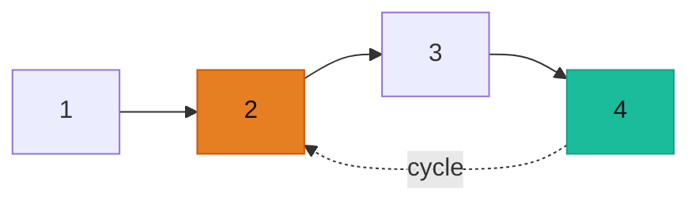

# Fast & Slow Pointers — Cycle Detection, Middle, Happy Number — A Visual, Worked-Example Guide

> **Companion code:** [`fast_slow_pointers.py`](./fast_slow_pointers.py). **Every number is printed by
> `python3 fast_slow_pointers.py`** — nothing is hand-computed.
>
> **Live animation:** [`fast_slow_pointers.html`](./fast_slow_pointers.html) — open in a browser, step the tortoise/hare yourself.

---

## 0. TL;DR — the one idea

> **The analogy (read this first):** Two cars drive down a road. One car drives **twice as fast** as the other.
> - If the road is **straight** (no cycle), the fast car reaches the end exactly when the slow car is at the **middle**.
> - If the road **loops back** on itself (a cycle), the fast car **laps the slow car** and they meet somewhere on the loop.
>
> One skeleton — `slow` advances 1 node, `fast` advances 2 nodes — gives you cycle detection, middle-finding, and (with an offset init) cycle detection on any abstract sequence.

```mermaid
graph LR
    subgraph STRAIGHT["Straight road → fast hits the end, slow is the middle"]
        S0["slow"] --> S1["slow"] --> S2["slow<br/>(MIDDLE)"]
        F0["fast"] -.2x speed.-> F1["fast"] -.2x speed.-> F2["fast<br/>= None"]
    end
    subgraph CIRCULAR["Circular road → fast laps slow, they MEET"]
        C0(("slow")) --> C1(("slow"))
        CF0(("fast")) -.2x speed.-> CF1(("fast")) -.2x speed.-> CF2(("fast<br/>= slow ✓"))
    end
    style S2 fill:#1abc9c,stroke:#16a085,color:#0d1117
    style CF2 fill:#e67e22,stroke:#d35400,color:#0d1117
    style CIRCULAR fill:#1a1410,stroke:#e67e22
    style STRAIGHT fill:#0d1117,stroke:#1abc9c
```



The whole pattern is one loop. Change **what you check inside** to get all three problems:

```python
slow = head
fast = head
while fast and fast.next:        # CRITICAL guard before fast.next.next
    slow = slow.next              # 1 step
    fast = fast.next.next         # 2 steps
    # ---- pick ONE check, depending on the problem ----
    if slow is fast:              # cycle detection (P141)
        return True
# fall-through: slow is now on the middle (P876)
return slow
```

---

### Pattern Recognition Signals

| Signal in the problem statement | → Use this pattern |
|---|---|
| Linked list, "does it have a cycle?", **O(1) space required** | ✓ Floyd's (P141) |
| "Find the middle node" / "split the list in half" | ✓ fast/slow, return slow when fast can't move (P876) |
| A sequence defined by a transformation `n -> f(n)` that you must run until it **repeats or hits 1**, O(1) space | ✓ Floyd's with offset init (P202 Happy Number) |
| Array where `arr[i] ∈ [1, n]` and "there is exactly one duplicate" | ✓ Treat `arr[i]` as `next` pointer; cycle = duplicate (P287) |
| "Find where the cycle **begins**" | ✓ Detect, then reset slow to head, move both 1× until they meet (P142) |
| Need to **reverse the second half** of a list (reorder, palindrome) | ✓ Combine fast/slow middle-find with in-place reversal (P143, P234) |

---

### The Template Skeleton

```python
# The interview starting point — memorize this. Three variants share it.
def fast_slow_template(head):
    slow = head
    fast = head
    while fast and fast.next:           # CRITICAL: guard fast.next.next
        slow = slow.next                # tortoise: 1 step
        fast = fast.next.next           # hare:     2 steps
        if slow is fast:                # use `is` (same NODE), not `==`
            # CYCLE VARIANT (P141): return True
            # CYCLE-START VARIANT (P142): break here, then reset slow=head
            return True
    # MIDDLE VARIANT (P876): loop exited because fast can't advance.
    # slow is now on the middle (second middle for even-length lists).
    return slow


# SEQUENCE VARIANT (P202 Happy Number): same loop, abstract `.next`.
def is_happy(n: int) -> bool:
    def nxt(x):
        s = 0
        while x:
            d = x % 10; s += d * d; x //= 10
        return s
    slow = n
    fast = nxt(n)                       # OFFSET INIT: avoids slow==fast at step 0
    while fast != 1 and slow != fast:
        slow = nxt(slow)
        fast = nxt(nxt(fast))
    return fast == 1
```

---

## 1. P141 Linked List Cycle (Floyd's tortoise & hare)

> **Problem:** Given `head`, determine if the linked list has a cycle (some node's `.next` points back to an earlier node).
> **Key insight:** Two pointers moving at different speeds **must** collide on a cycle (the gap closes by 1 per step). On an acyclic list, `fast` reaches `None` first.

### Worked example — list `1 -> 2 -> 3 -> 4` with a back-edge from `4` to node `2`

> From `fast_slow_pointers.py` Section A. `S` = slow, `F` = fast.

| step | slow at | fast at | note |
|---|---|---|---|
| 0 | 1 | 1 | both start at head |
| 1 | 2 | 3 | fast jumps 2 |
| 2 | 3 | 2 | fast laps into the cycle |
| 3 | **4** | **4** | **MEET — cycle confirmed** |

```
step 0:  1[S,F] -> 2 -> 3 -> 4 -> (back to idx 1)
step 1:  1 -> 2[S] -> 3[F] -> 4 -> (back to idx 1)
step 2:  1 -> 2[F] -> 3[S] -> 4 -> (back to idx 1)
step 3:  1 -> 2 -> 3 -> 4[S,F] -> (back to idx 1)   <-- MEET
```

**Why it terminates:** on a cycle of length `c`, fast gains 1 node on slow per step, so they meet within `≤ c` steps after slow enters the loop.



**No-cycle control:** `1 -> 2 -> 3 -> 4 -> None`. Step 2: slow=3, fast=None → return `False`.

---

## 2. P876 Middle of the Linked List

> **Problem:** Return the middle node. For an even-length list, return the **second** of the two middle nodes.
> **Key insight:** Reuse the *exact* skeleton — but drop the `slow is fast` check. When `fast` can no longer advance (because `fast` or `fast.next` is `None`), `slow` is on the middle.

### Worked example — odd length `1 -> 2 -> 3 -> 4 -> 5` (middle = 3)

> From `fast_slow_pointers.py` Section B.

| step | slow at | fast at | note |
|---|---|---|---|
| 0 | 1 | 1 | start |
| 1 | 2 | 3 | |
| 2 | **3** | 5 | fast can't advance (fast.next is None) → **slow is the middle** |

### Worked example — even length `1 -> 2 -> 3 -> 4` (slow lands on SECOND middle = 3)

| step | slow at | fast at | note |
|---|---|---|---|
| 0 | 1 | 1 | start |
| 1 | 2 | 3 | |
| 2 | **3** | None | fast is None → slow on **second** middle |

**To get the FIRST middle for even-length lists**, start `fast` one node behind via a dummy:

```python
slow, fast = head, ListNode(-1, head)
while fast and fast.next:
    slow = slow.next
    fast = fast.next.next
return slow   # first middle for even, only middle for odd
```

---

## 3. P202 Happy Number (cycle detection on an abstract sequence)

> **Problem:** A number is **happy** if repeatedly replacing it with the sum of the squares of its digits reaches 1. Detect this in O(1) space.
> **Key insight:** There is no linked list — but the transformation `n -> f(n)` *is* a `.next` pointer. By pigeonhole, the sequence eventually repeats (finitely many possible values). Apply Floyd's. **Crucial gotcha:** offset the init so `slow != fast` on iteration 0.

### Worked example — n = 19 (HAPPY)

> From `fast_slow_pointers.py` Section C. The forward sequence is `19 -> 82 -> 68 -> 100 -> 1`.

| step | slow | fast | note |
|---|---|---|---|
| 0 | 19 | 82 | offset init (fast one step ahead) |
| 1 | 82 | 100 | |
| 2 | 68 | **1** | **fast hit 1 → HAPPY** |

`is_happy(19) -> True`

### Worked example — n = 2 (NOT HAPPY)

> The unhappy cycle is `4 -> 16 -> 37 -> 58 -> 89 -> 145 -> 42 -> 20 -> 4` (length 8, no 1 in it).

| step | slow | fast | note |
|---|---|---|---|
| 0 | 2 | 4 | offset init |
| 1 | 4 | 37 | |
| 2 | 16 | 89 | |
| 3 | 37 | 42 | |
| 4 | 58 | 4 | |
| 5 | 89 | 37 | |
| 6 | 145 | 89 | |
| 7 | **42** | **42** | **slow == fast (cycle, no 1) → NOT HAPPY** |

`is_happy(2) -> False`

---

## 4. Extensions (briefly)

- **P142 Linked List Cycle II** — find the cycle **start**. After detecting the meet, reset `slow = head` and move both at speed 1; the node where they meet again is the cycle entry. *(Proof sketch: distance from head to entry equals distance from meet to entry, modulo cycle length.)*
- **P287 Find the Duplicate Number** — array of `n+1` ints in `[1, n]`. Treat `arr[i]` as `next`; the duplicate creates a cycle. Floyd's finds it in O(1) space.
- **P143 Reorder List / P234 Palindrome** — chain: fast/slow middle-find → reverse second half in place → merge/compare.

---

### Complexity

> From `fast_slow_pointers.py` Section D.

| Operation | Time | Space |
|---|---|---|
| Cycle detection (P141) | O(n) | O(1) |
| Find middle (P876) | O(n) | O(1) |
| Happy number (P202) | O(log n) | O(1) |
| Find cycle START (P142) | O(n) | O(1) |

### Killer Gotchas

1. **Always guard fast's two-step**: `while fast and fast.next:`. Calling `fast.next.next` when `fast.next is None` crashes with `AttributeError`.
2. **Use `is`, not `==`, for the meet check.** Two *different* nodes can hold the same value — you want them to be the same *node*.
3. **For sequences (Happy Number), offset the start**: `slow = n`, `fast = get_next(n)`. If both start at `n`, `slow == fast` fires immediately on iteration 0.
4. **Even-length lists**: the basic skeleton lands `slow` on the **second** middle node. Use a dummy start to land on the first.
5. **To find the cycle start (P142)**: after `slow is fast`, reset `slow = head`, then move both at speed 1 until they meet again.

### Problem Table

> From `fast_slow_pointers.py` Section D.

| Problem | Essence | Key Trick |
|---|---|---|
| P141 Linked List Cycle | Floyd's: meet → cycle; fast hits `None` → false | Both start at `head`, move then compare |
| P876 Middle of Linked List | Fast 2× / slow 1×; slow lands on 2nd middle for even-length | `while fast and fast.next:` guards the 2-step |
| P202 Happy Number | Chase sequence to 1 or cycle; return `fast == 1` | `fast = get_next(n)` (offset init) |
| P142 Linked List Cycle II | Detect, then reset slow to find entry | Move both at 1× after the meet |
| P287 Find Duplicate Number | Treat `arr[i]` as `next` pointer; cycle = duplicate | Floyd's on the "implicit linked list" |
