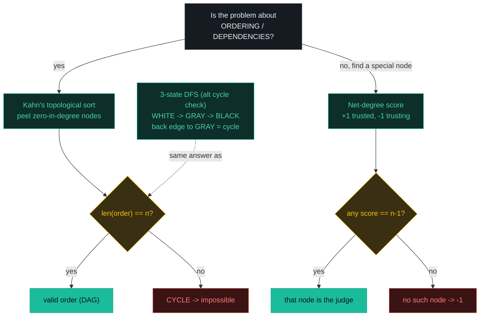
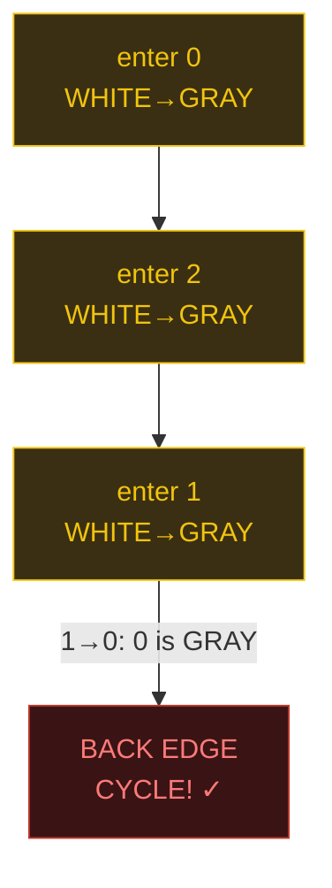
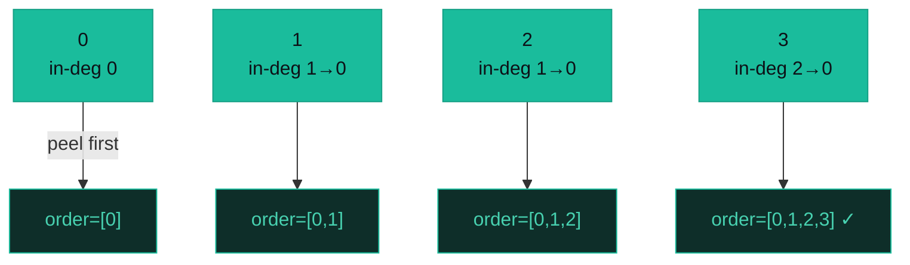
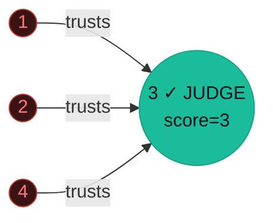

# Graph — Course Schedule, Topological Sort, Town Judge — A Visual, Worked-Example Guide

> **Companion code:** [`graph.py`](./graph.py). **Every number is printed by
> `python3 graph.py`** — nothing is hand-computed.
>
> **Live animation:** [`graph.html`](./graph.html) — open in a browser, watch the directed graph color itself as Kahn's peels ready nodes and the 3-state DFS paints WHITE → GRAY → BLACK.

---

## 0. TL;DR — the one idea

> **The analogy (read this first):** A graph connects things. Two flavors of interview problem live here, and they are solved by **two completely different tricks** — knowing which flavor you have *is* the whole battle.
>
> 1. **Ordering problems** ("can I finish all my courses?", "give a build order"): think of a to-do list where some tasks MUST come before others. If Task A needs Task B and Task B needs Task A, you are stuck in a **circle = a cycle**, and no valid order exists. Peeling off "ready" tasks (zero prerequisites) one layer at a time is **topological sort (Kahn's algorithm)**.
> 2. **"Special node" problems** ("find the town judge", "find the center"): think of an **election**. The judge is trusted by everyone and trusts nobody. You do NOT walk the graph — you just **count**. One pass over the edges: `+1` for being trusted, `−1` for trusting; the judge's net score is `n − 1`.



**The single most common bug is edge direction.** A prerequisite `[a, b]` means "take **b** before **a**", i.e. the edge runs **b → a** — the *opposite* of what reading left-to-right suggests. Flip it and your zero-in-degree seeds are silently wrong.

```mermaid
graph LR
    subgraph G1["DAG: 0 -> 1,3 ; 1,2 -> 3  (a clean course plan)"]
        D0(("0")) --> D1(("1"))
        D0 --> D2(("2"))
        D1 --> D3(("3"))
        D2 --> D3
    end
    subgraph G2["CYCLE: 0 -> 2 -> 1 -> 0  (impossible plan)"]
        C0(("0")) --> C2(("2"))
        C2 --> C1(("1"))
        C1 --> C0
    end
    style D0 fill:#1abc9c,stroke:#16a085,color:#0d1117
    style D1 fill:#0e2e29,stroke:#1abc9c,color:#48d1b0
    style D2 fill:#0e2e29,stroke:#1abc9c,color:#48d1b0
    style D3 fill:#0e2e29,stroke:#1abc9c,color:#48d1b0
    style C0 fill:#3a1414,stroke:#c0392b,color:#ff7a7a
    style C1 fill:#3a1414,stroke:#c0392b,color:#ff7a7a
    style C2 fill:#3a1414,stroke:#c0392b,color:#ff7a7a
    style G1 fill:#0d1117,stroke:#30363d
    style G2 fill:#0d1117,stroke:#30363d
```



---

### Pattern Recognition Signals

| Signal in the problem statement | → Use this pattern |
|---|---|
| "prerequisites" / "dependencies" / "build order" / "valid ordering" | ✓ Kahn's topological sort (P207, P210) |
| "can you finish all X?" / "is it possible to schedule?" | ✓ topological sort → cycle check (`len(order) == n`) |
| "return **an** ordering" (any valid one) | ✓ Kahn's; return `order`, or `[]` on cycle (P210) |
| "trusted by everyone, trusts nobody" / "find the center/sink" | ✓ net-degree score, no traversal (P997) |
| "course/word A must come before B" | ✓ directed edge B → A, then Kahn's |
| detect a cycle in a **directed** graph | ✓ 3-state DFS (WHITE/GRAY/BLACK) OR Kahn's |
| weighted shortest path / min cost route | ✗ use **Dijkstra** (non-negative) or **Bellman-Ford** (negative) |
| shortest path / min steps on an **unweighted** grid or graph | ✗ use **BFS** |
| connectivity / "number of islands" / "are these connected" | ✗ use **DFS/BFS** or **Union-Find** |
| cycle in an **undirected** graph | ✗ use **Union-Find** (or DFS with a parent) |

---

### The Template Skeleton

```python
# The three independent templates — memorize all three. Pure stdlib.

from collections import deque

# ---- 1. KAHN'S TOPOLOGICAL SORT — order or cycle check (P207/P210) ----
def topological_sort(n, edges):              # edges are (u, v) meaning u -> v
    graph = {i: [] for i in range(n)}
    in_degree = [0] * n
    for u, v in edges:
        graph[u].append(v)
        in_degree[v] += 1
    queue = deque(i for i in range(n) if in_degree[i] == 0)  # ready nodes
    order = []
    while queue:
        node = queue.popleft()
        order.append(node)
        for nei in graph[node]:
            in_degree[nei] -= 1
            if in_degree[nei] == 0:          # just became ready
                queue.append(nei)
    return order                              # len(order) < n  ==>  cycle
# O(V + E) time, O(V) space

# ---- 2. 3-STATE DFS CYCLE DETECTION — WHITE / GRAY / BLACK (P207) ----
WHITE, GRAY, BLACK = 0, 1, 2
def has_cycle(n, edges):
    graph = {i: [] for i in range(n)}
    for u, v in edges:
        graph[u].append(v)
    color = [WHITE] * n
    def dfs(node):
        color[node] = GRAY                    # enter: now on the current path
        for nei in graph[node]:
            if color[nei] == GRAY:            # back edge -> cycle!
                return True
            if color[nei] == WHITE and dfs(nei):
                return True
        color[node] = BLACK                   # leave: fully explored
        return False
    return any(dfs(i) for i in range(n) if color[i] == WHITE)
# O(V + E) time, O(V) space

# ---- 3. NET-DEGREE SCORE — Town Judge, no traversal (P997) ----
def find_judge(n, trust):                     # nodes are 1-indexed (1..n)
    score = [0] * (n + 1)
    for a, b in trust:                        # a trusts b  ==>  edge a -> b
        score[a] -= 1                         # a trusts someone (out)
        score[b] += 1                         # b is trusted   (in)
    for i in range(1, n + 1):
        if score[i] == n - 1:                 # in=n-1, out=0
            return i
    return -1
# O(n + E) time, O(n) space
```

---

## 1. P207 Course Schedule

> **Problem:** Given `numCourses` (labelled `0..n-1`) and `prerequisites` where `[a, b]` means you must take **b before a**, return `True` if you can finish **all** courses (i.e. the prerequisite graph is a DAG — no cycle).
> **Key insight:** "Can I finish everything?" = "does the graph have a cycle?" Two equivalent detectors: Kahn's (does `len(order) == n`?) and 3-state DFS (is there a back edge to a GRAY node?).

### Worked example — a clean DAG, then a cycle

> From `graph.py` Section A. `Example 1` is the classic DAG (course 0 is the base; 1 and 2 both need 0; 3 needs both 1 and 2). `Example 2` is a 3-ring `0 → 2 → 1 → 0`.

**Example 1 (DAG)** — `numCourses=4, prerequisites=[[1,0],[2,0],[3,1],[3,2]]` → directed edges `0→1, 0→2, 1→3, 2→3`. Kahn's trace (peel zero-in-degree nodes layer by layer):

```
[.] in-degree = [0, 1, 1, 2]
[>] seed queue with in-degree-0 nodes: [0]
[o] dequeue 0, append -> order=[0]
[+]   0->1: in-degree -> 0, enqueue 1
[+]   0->2: in-degree -> 0, enqueue 2
[o] dequeue 1, append -> order=[0, 1]
[ ]   1->3: in-degree -> 1
[o] dequeue 2, append -> order=[0, 1, 2]
[+]   2->3: in-degree -> 0, enqueue 3
[o] dequeue 3, append -> order=[0, 1, 2, 3]
[=] order has 4/4 nodes -> valid DAG

order=[0, 1, 2, 3], len=4 == n=4  ->  canFinish = True
canFinish(4, [[1, 0], [2, 0], [3, 1], [3, 2]]) = True
```

**Example 2 (CYCLE)** — `numCourses=3, prerequisites=[[0,1],[1,2],[2,0]]` → edges `1→0, 2→1, 0→2` (a ring). Every node has in-degree 1, so the queue **never seeds**:

```
[.] in-degree = [1, 1, 1]
[>] seed queue with in-degree-0 nodes: []
[=] order has 0/3 nodes -> CYCLE (no valid order)

order=[], len=0 < n=3  ->  canFinish = False
canFinish(3, [[0, 1], [1, 2], [2, 0]]) = False
```

**Same cycle via 3-state DFS** — a back edge hits a GRAY node (on the current recursion path):

```
[.] all nodes WHITE [0, 0, 0]
[*] new DFS root 0 (still WHITE)
[>] enter 0: WHITE -> GRAY (on path)
[>]   enter 2: WHITE -> GRAY (on path)
[>]     enter 1: WHITE -> GRAY (on path)
[!]     1->0: 0 is GRAY => BACK EDGE => CYCLE! return True
[=] => has_cycle = True

has_cycle_dfs(3, [(1, 0), (2, 1), (0, 2)]) = True
```



> The three colors do one job: distinguish a node **on the current path** (GRAY, reachable from the recursion root) from one **already finished** (BLACK). Only an edge back to a GRAY node is a cycle — an edge to a BLACK node (a cross/forward edge) is perfectly fine. A 2-state `visited` set can't tell them apart and yields false positives.

**Edge cases** (from `graph.py` Section A): `canFinish(2,[[1,0]]) = True` (0 before 1, no cycle); `canFinish(1,[]) = True` (one course, no prereqs); `canFinish(2,[[1,0],[0,1]]) = False` (0 before 1 AND 1 before 0 = 2-cycle).

---

## 2. P210 Course Schedule II

> **Problem:** Same setup as P207, but **return any valid course order**. If a cycle makes it impossible, return `[]`.
> **Key insight:** Literally the same Kahn's algorithm — we just hand back the `order` list instead of a boolean. `[]` when `len(order) < n`.

### Worked example — `numCourses=4, prerequisites=[[1,0],[2,0],[3,1],[3,2]]` → `[0,1,2,3]`

> From `graph.py` Section B. The order is built as nodes become ready (in-degree hits 0). `0` must be first (everyone's prerequisite); `3` must be last (needs both 1 and 2).

```
[.] in-degree = [0, 1, 1, 2]
[>] seed queue with in-degree-0 nodes: [0]
[o] dequeue 0, append -> order=[0]
[+]   0->1: in-degree -> 0, enqueue 1
[+]   0->2: in-degree -> 0, enqueue 2
[o] dequeue 1, append -> order=[0, 1]
[ ]   1->3: in-degree -> 1
[o] dequeue 2, append -> order=[0, 1, 2]
[+]   2->3: in-degree -> 0, enqueue 3
[o] dequeue 3, append -> order=[0, 1, 2, 3]
[=] order has 4/4 nodes -> valid DAG

findOrder(4, [[1, 0], [2, 0], [3, 1], [3, 2]]) = [0, 1, 2, 3]
```



> **Multiple valid orders:** here `[0,2,1,3]` is also valid (1 and 2 are both ready after 0 — dequeue order is arbitrary). Kahn's may return **any** topo order; never assert a specific permutation, only that every edge is respected.

**Edge cases** (from `graph.py` Section B): `findOrder(2,[[1,0]]) = [0,1]` (0 before 1); `findOrder(1,[]) = [0]` (single course); `findOrder(2,[[1,0],[0,1]]) = []` (2-cycle → impossible).

---

## 3. P997 Find the Town Judge

> **Problem:** `n` people labelled `1..n`; `trust[i] = [a, b]` means **a trusts b** (edge `a → b`). The judge (1) trusts nobody, (2) is trusted by everyone else. Return the judge's label, or `-1`.
> **Key insight:** **No traversal at all.** The judge has in-degree `n−1` and out-degree `0`, so net score = `in − out = n − 1`. One pass over edges: `score[a] −= 1` (a trusts someone), `score[b] += 1` (b is trusted). Reaching `n − 1` already encodes *both* conditions — a node that trusts anyone would have subtracted, so it can't hit `n − 1`.

### Worked example — `n=4, trust=[[1,3],[2,3],[4,3]]` → judge `3`

> From `graph.py` Section C. Everyone trusts 3, 3 trusts nobody, so `score[3] = 3 = n − 1`.

```
[.] score = [0, 0, 0, 0, 0]  (+1 trusted, -1 trusting)
[+] 1 trusts 3:  score[1]-- -> -1,  score[3]++ -> 1
[+] 2 trusts 3:  score[2]-- -> -1,  score[3]++ -> 2
[+] 4 trusts 3:  score[4]-- -> -1,  score[3]++ -> 3
[ ] score[1]=-1 != 3
[ ] score[2]=-1 != 3
[ ] score[3]=3 == n-1=3 => JUDGE
[ ] score[4]=-1 != 3
[=] => judge = 3

findJudge(4, [[1, 3], [2, 3], [4, 3]]) = 3  (score[3] = 3 = n-1)
```

**Example 2 (no judge)** — `n=3, trust=[[1,2],[2,3]]`: 1 trusts 2, 2 trusts 3, nobody is trusted by all:

```
[+] 1 trusts 2:  score[1]-- -> -1,  score[2]++ -> 1
[+] 2 trusts 3:  score[2]-- -> 0,  score[3]++ -> 1
[ ] score[3]=1 != 2   ... no node reaches n-1=2
[=] => judge = -1

findJudge(3, [[1, 2], [2, 3]]) = -1  (no node reaches score n-1=2)
```



> The three trusters each end at score `−1` (outgoing edge, no incoming). Only node 3 accumulates `+3 = n − 1`. Note the judge's score is `n − 1`, **not** `n` — the judge does not trust itself.

**Edge cases** (from `graph.py` Section C): `findJudge(2,[[1,2]]) = 2` (1 trusts 2, 2 trusts nobody); `findJudge(1,[]) = 1` (lone person: trusted by 0 = n−1 others, vacuously the judge); `findJudge(2,[[1,2],[2,1]]) = -1` (mutual trust: both scores cancel to 0).

---

### Complexity

> From `graph.py` Section D.

| Operation | Time | Space |
|---|---|---|
| Kahn's topological sort | O(V + E) | O(V) |
| 3-state DFS cycle detection | O(V + E) | O(V) |
| Net-degree score (Town Judge) | O(V + E) | O(V) |
| Build adjacency list from edges | O(E) | O(V + E) |

All three are **linear** — no exponential anywhere. The whole pattern is `O(V + E)`; only the constant and the output differ.

### Killer Gotchas

1. **Edge direction:** prerequisite `[a, b]` means "take **b** before **a**", i.e. edge **b → a** (NOT `a → b`). Reverse it and your zero-in-degree seeds are silently wrong. Town Judge `[a, b]` means "a trusts b", i.e. edge **a → b**.
2. **Cycle-detection check:** after Kahn's, **always** check `len(order) == n`. Cycle members never reach in-degree 0, so they are never dequeued and silently vanish. `len(order) < n` *is* the cycle signal.
3. **GRAY vs BLACK in 3-state DFS:** a back edge hits a **GRAY** node (on the current path). A cross/forward edge to a **BLACK** node is fine — it is **not** a cycle. A 2-state `visited` set can't tell them apart and gives false positives.
4. **1-indexed nodes:** Town Judge uses `1..n`. Allocate size `n+1` and loop `range(1, n+1)`. Off-by-one on array size or bounds is the #1 bug here.
5. **Judge score is n−1, not n:** the judge is trusted by everyone **else** (n−1 people) and trusts nobody (out 0), so net = n−1. It can never reach `n`.
6. **Multiple valid orders:** Kahn's may return **any** valid topo order (which zero-in-degree node you dequeue first is arbitrary). Accept any order respecting every edge; don't assert a specific permutation.

### Problem Table

> From `graph.py` Section D.

| Problem | Essence | Key Trick |
|---|---|---|
| P207 Course Schedule | Can all courses be taken? (cycle check) | Kahn's: `len(order)==n` → True |
| P210 Course Schedule II | Return a valid order, `[]` if cycle | same Kahn's; collect `order`, return `[]` on cycle |
| P997 Find the Town Judge | Find node trusted by all, trusts nobody | net score array `[0]*(n+1)`; judge score == `n−1` |
| P269 Alien Dictionary | Derive letter order from sorted words | build graph from adjacent letter pairs; topo sort |
| P310 Min Height Trees | Roots yielding shallowest tree | peel leaves inward (Kahn's on undirected graph) |
| P444 Sequence Reconstruction | Is orgSeq the unique super-sequence? | topo sort on position constraints |
| P802 Find Eventual Safe States | Nodes not in / leading to a cycle | 3-state DFS or reverse-graph Kahn's |
| P2392 Build a Matrix With Conditions | Place rows + cols from `k` rules | topo sort rows **and** cols independently |
