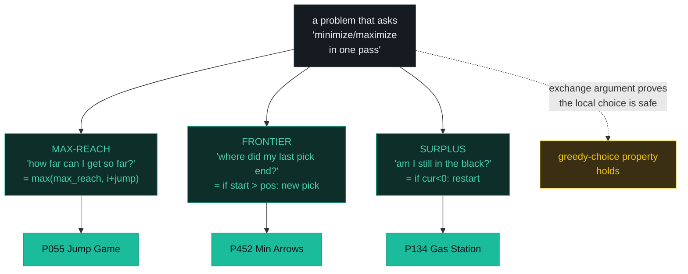
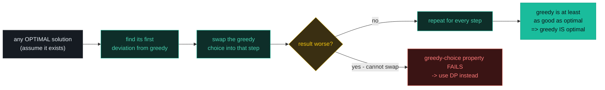
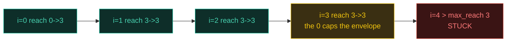
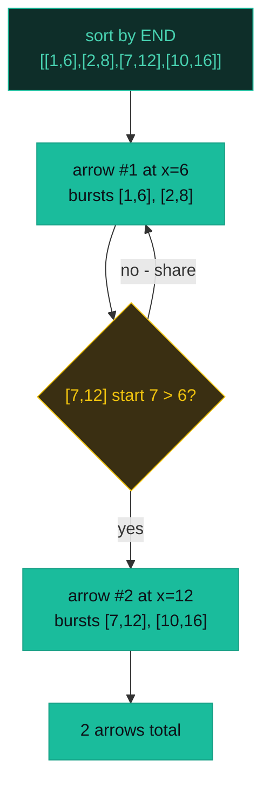
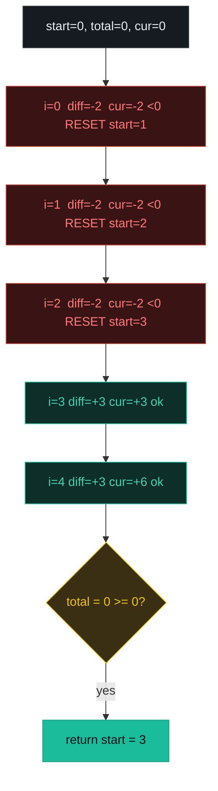

# Greedy — Jump Game, Min Arrows, Gas Station — A Visual, Worked-Example Guide

> **Companion code:** [`greedy.py`](./greedy.py). **Every number is printed by
> `python3 greedy.py`** — nothing is hand-computed.
>
> **Live animation:** [`greedy.html`](./greedy.html) — open in a browser, step the greedy choice yourself.

---

## 0. TL;DR — the one idea

> **The analogy (read this first):** You are hiking toward a summit and at every fork you pick the path that gains the most altitude *right now*, never retracing a step. Greedy does exactly that on a problem: at each step it commits to the **locally optimal** choice and never looks back. This only works when the problem has the **greedy-choice property** — a locally best move can never block a globally best solution. When that holds, one linear (or `n log n`) sweep beats the exponential/quadratic DP.

> The whole pattern is **one running scalar, updated in place**. The three flavors differ only in *which* scalar:



> The correctness proof is always the same shape — the **exchange argument**: assume an optimum makes a *different* choice at some step; show you can swap the greedy choice in without making the result worse. If you can always swap, greedy *is* optimal.



---

### Pattern Recognition Signals

| Signal in the problem statement | → Use this pattern |
|---|---|
| "**can you reach the end**?" / "is the last index reachable" | ✓ max-reach greedy (P055) |
| "**minimum number of** jumps / arrows / intervals / meetings" | ✓ activity selection, sort by **end** (P452) |
| "find a **valid starting point** on a **circular** route / circuit" | ✓ surplus tracking (P134) |
| "**maximize the number of** non-overlapping intervals / tasks" | ✓ sort by end, pick earliest-finishing |
| "**minimum** intervals to **remove** to make non-overlapping" | ✓ sort by end, count overlaps (P435) |
| "**assign** cookies/candy to satisfy a local constraint" | ✓ sort + two-pointer / two-pass greedy |
| "every step the best local move **provably** never hurts" | ✓ greedy (after an exchange argument) |
| "all possible orderings / the power set / count of ways" | ✗ use **backtracking** |
| "overlapping subproblems, optimal substructure, **weighted** value" | ✗ use **dynamic programming** (greedy fails on weighted variants) |
| "shortest path on a graph with **negative** edges" | ✗ use **Bellman-Ford** (Dijkstra is greedy and breaks on negatives) |

---

### The Template Skeleton

```python
# The three greedy templates — memorize the one-line update in each.

# ---- 1. MAX-REACH  (P055 Jump Game) ----
def can_jump(nums):
    max_reach = 0
    for i, jump in enumerate(nums):
        if i > max_reach:                  # scan outran the envelope -> stuck
            return False
        max_reach = max(max_reach, i + jump)
    return True
# O(n) time, O(1) space


# ---- 2. ACTIVITY SELECTION  (P452 Min Arrows) ----
def min_arrows(points):
    if not points:
        return 0
    points.sort(key=lambda p: p[1])        # SORT BY END (non-negotiable)
    arrows, arrow_pos = 1, points[0][1]
    for start, end in points[1:]:
        if start > arrow_pos:              # strictly after -> needs own arrow
            arrows += 1
            arrow_pos = end
    return arrows
# O(n log n) time, O(1) space


# ---- 3. SURPLUS  (P134 Gas Station) ----
def can_complete_circuit(gas, cost):
    total = current = start = 0
    for i in range(len(gas)):
        diff = gas[i] - cost[i]
        total += diff                      # global feasibility
        current += diff                    # local running surplus
        if current < 0:                    # this candidate failed -> restart
            start = i + 1
            current = 0
    return start if total >= 0 else -1     # GLOBAL CHECK is mandatory
# O(n) time, O(1) space
```

---

## 1. P055 Jump Game

> **Problem:** From index `0`, can you reach the last index? `nums[i]` is the maximum jump length from position `i`.
> **Key insight:** You never need to track *which* jumps to take — only the **envelope** of reachable positions. Maintain `max_reach = max(max_reach, i + nums[i])`. The instant the scan index `i` outruns `max_reach`, no path exists.

### Worked example — `[2, 3, 1, 1, 4]` → `True`

> From `greedy.py` Section A. The scan keeps the farthest reachable index; `i` never exceeds it.

```
  i | nums[i] | prev_reach -> new_reach | status
  --+---------+-----------------------+----------------------
  0 |     2   |      0  ->    2      |    extend
  1 |     3   |      2  ->    4      |    reached last index!
  2 |     1   |      4  ->    4      |    reached last index!
  3 |     1   |      4  ->    4      |    reached last index!
  4 |     4   |      4  ->    8      |    reached last index!
  => reachable
```

> At `i=1`, `max_reach` jumps to `4` (= last index), so feasibility is decided there — the rest only *confirms* it.

`jump_game([2, 3, 1, 1, 4]) -> True`

### Worked example — `[3, 2, 1, 0, 4]` → `False`

> From `greedy.py` Section A. The `0` at index 3 caps the envelope at 3; index 4 is unreachable.

```
  i | nums[i] | prev_reach -> new_reach | status
  --+---------+-----------------------+----------------------
  0 |     3   |      0  ->    3      |    extend
  1 |     2   |      3  ->    3      |    extend
  2 |     1   |      3  ->    3      |    extend
  3 |     0   |      3  ->    3      |    extend
  4 |     4   |      3  ->    3      | !! stuck
  => unreachable
```



**Edge cases** (from `greedy.py` Section A): `jump_game([0]) → True` (single element = already at the end); `jump_game([1, 0]) → True` (one hop lands exactly on the last index); `jump_game([0, 1]) → False` (stuck at 0); `jump_game([2, 0, 0]) → True` (jump over the zeros).

---

## 2. P452 Minimum Number of Arrows to Burst Balloons

> **Problem:** Each balloon is `[x_start, x_end]`. An arrow shot at `x` bursts every balloon with `x_start ≤ x ≤ x_end`. Return the minimum arrows.
> **Key insight:** Sort by the **end** coordinate, then shoot at the end of the first balloon. Any balloon starting `≤` that point shares the arrow; one starting *strictly after* needs its own arrow. This is the activity-selection theorem: the interval that **finishes earliest** leaves the most room.

### Worked example — `[[10,16],[2,8],[1,6],[7,12]]` → `2`

> From `greedy.py` Section B. After sorting by end: `[[1,6],[2,8],[7,12],[10,16]]`.

```
  balloon     | arrow_pos | arrows | action
  ------------+-----------+--------+-----------------------------
  [  1,  6]    |     6    |   1    | [1st] shoot arrow #1 at x=6
  [  2,  8]    |     6    |   1    |       start 2 <= 6 -> shares current arrow
  [  7, 12]    |    12    |   2    | [new] start 7 > old_pos -> new arrow #2 at x=12
  [ 10, 16]    |    12    |   2    |       start 10 <= 12 -> shares current arrow
```

> Arrow `#1` at `x=6` bursts `[1,6]` and `[2,8]`. `[7,12]` starts after 6, so it forces arrow `#2` at `x=12`, which also bursts `[10,16]`.

`min_arrows([[10,16],[2,8],[1,6],[7,12]]) -> 2`



### Why sort by END, not START?

> If you sorted `[1,10]` before `[2,3]`, your first arrow would land at `x=10` — but `[2,3]` then needs its own arrow even though it fits entirely *inside* `[1,10]`. Sorting by end guarantees the earliest-finishing interval is picked first, maximizing the room left for everything after.

### Worked examples — no overlap & touching

> From `greedy.py` Section B. `[[1,2],[3,4],[5,6],[7,8]] → 4` (no overlap, one arrow each). `[[1,2],[2,3],[3,4],[4,5]] → 2` — touching balloons share an arrow at the shared point (this is why the test is the *strict* `start > arrow_pos`).

**Edge cases** (from `greedy.py` Section B): `min_arrows([]) → 0`; `min_arrows([[1,5]]) → 1`.

---

## 3. P134 Gas Station

> **Problem:** On a circular route, station `i` provides `gas[i]` and reaching the next station costs `cost[i]`. Return a starting index that completes the circuit, or `-1`.
> **Key insight:** Two counters in one pass. `total_surplus` decides **feasibility** (if `< 0`, no start exists). `current_surplus` decides **where to start**: the instant it dips below zero, the current candidate *and everything before it* is hopeless, so restart at `i+1`.

### Worked example — `gas=[1,2,3,4,5], cost=[3,4,5,1,2]` → `3`

> From `greedy.py` Section C. Net per station `= [-2,-2,-2,+3,+3]`. Three resets move the candidate to index 3; from there the surplus never goes negative.

```
  i | gas cost | diff | total  current | start | note
  --+----------+------+----------------+-------+----------
  0 |  1   3  |  -2 |   -2      +0   |   1   | RESET
  1 |  2   4  |  -2 |   -4      +0   |   2   | RESET
  2 |  3   5  |  -2 |   -6      +0   |   3   | RESET
  3 |  4   1  |  +3 |   -3      +3   |   3   | ok
  4 |  5   2  |  +3 |   +0      +6   |   3   | ok
  => return 3 (total >= 0 -> feasible)
```

> `total_surplus` ends at `0 ≥ 0` → feasible. Starting at index 3: `+3` to reach 4, `+3` to wrap to 0, then the three `-2`s are absorbed by the carried surplus of 6.

`gas_station(gas=[1,2,3,4,5], cost=[3,4,5,1,2]) -> 3`



### Worked example — `gas=[2,3,4], cost=[3,4,3]` → `-1`

> From `greedy.py` Section C. Net `= [-1,-1,+1]`, `total_surplus = -1 < 0` → impossible no matter where you start.

```
  i | gas cost | diff | total  current | start | note
  --+----------+------+----------------+-------+----------
  0 |  2   3  |  -1 |   -1      +0   |   1   | RESET
  1 |  3   4  |  -1 |   -2      +0   |   2   | RESET
  2 |  4   3  |  +1 |   -1      +1   |   2   | ok
  => return -1 (total < 0 -> impossible)
```

`gas_station(gas=[2,3,4], cost=[3,4,3]) -> -1`

**Edge cases** (from `greedy.py` Section C): `gas_station([5],[4]) → 0` (one station, net +1); `gas_station([2],[2]) → 0` (net 0, exactly enough); `gas_station([1,2],[2,1]) → 1` (start at 1).

---

### Complexity

> From `greedy.py` Section D.

| Operation | Time | Space |
|---|---|---|
| Jump Game, max-reach (P055) | O(n) | O(1) |
| Min Arrows / activity selection (P452) | O(n log n) | O(1)* |
| Gas Station, surplus (P134) | O(n) | O(1) |
| Jump Game II, min jumps (P045) | O(n) | O(1) |
| Task Scheduler, freq math (P621) | O(n) | O(1) |
| Assign Cookies, two-pointer (P455) | O(n log n) | O(1) |

*\* O(n) for the greedy scan; the O(n log n) comes from the sort. Greedy trades the exponential state of DP/DFS for a single scalar — that is its entire appeal.*

### Killer Gotchas

1. **Sort by END, not start.** For interval greedy (arrows, meeting rooms, non-overlap) the sort key MUST be the end coordinate. Sorting by start fails on nested intervals: `[1,10]` before `[2,3]` hides the short interval that leaves the most room. Sort by end so the earliest-finishing interval is always picked first.
2. **The global check is mandatory (Gas Station).** Resetting `start` when `current_surplus` dips is a *local* fix. You MUST still confirm `total_surplus >= 0` at the end — otherwise you return a bogus start for an impossible circuit.
3. **Strict vs non-strict inequality.** P452 uses `start > arrow_pos` (touching balloons share an arrow at the shared point). P435 Non-overlapping Intervals uses `start >= end` (touching is allowed to coexist). Same skeleton, different off-by-one — know which.
4. **Greedy is not always correct.** Coin change `[1,3,4]`, target `6`: greedy picks `4+1+1` (3 coins) but `3+3` (2 coins) is optimal. Weighted interval scheduling also defeats greedy. The exchange argument is how you **prove** greedy is safe before trusting it.
5. **Jump Game needs only the envelope.** You never store which jumps to take — just `max_reach`. A DP/memoized solution is correct but wastes O(n) space and O(n²) time on a problem greedy solves in O(n)/O(1).
6. **The `-1` in Task Scheduler.** The formula `(max_freq-1)·(n+1)+count_max` has a `-1` because the *last* execution of the most frequent task needs no trailing cooldown. Drop it and you over-count by `n+1`.

### Problem Table

> From `greedy.py` Section D.

| Problem | Essence | Key Trick |
|---|---|---|
| P055 Jump Game | Can you reach the last index? | track `max_reach`; return `False` if `i > max_reach` |
| P045 Jump Game II | Minimum jumps to the end | BFS-greedy: jump when `i` hits `current_end`, extend `farthest` |
| P452 Min Arrows | Fewest arrows to burst all balloons | sort by **END**; new arrow when `start > arrow_pos` |
| P435 Non-overlapping Intervals | Min intervals to remove | sort by END; count overlaps via `start >= end` |
| P134 Gas Station | Valid start for a circular tour | reset `start` when `current < 0`; check `total >= 0` |
| P455 Assign Cookies | Satisfy children with cookies | sort both; two-pointer match greed vs size |
| P621 Task Scheduler | Min CPU cycles with cooldown n | `(max_freq-1)·(n+1)+count_max`; cap at `len(tasks)` |
| P135 Candy | Distribute candy by ratings | two passes: L→R then R→L taking `max` |
| P502 IPO | Maximize capital with ≤ k projects | sort by capital; max-heap of affordable profits |
| P053 Max Subarray | Largest subarray sum | Kadane: `local = max(x, local + x)` |
