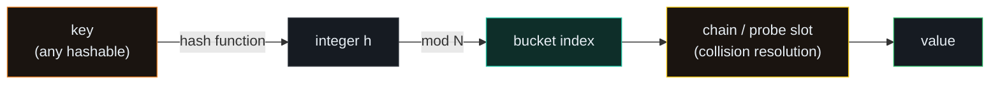
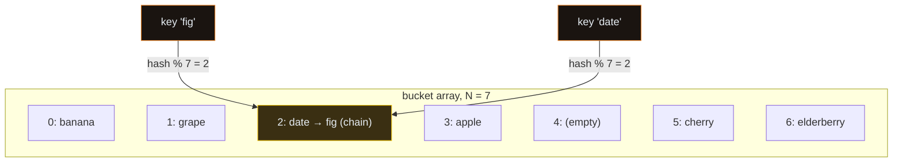
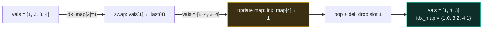
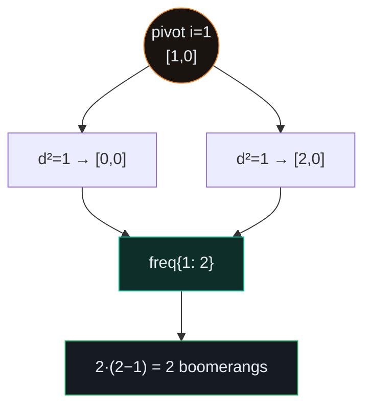
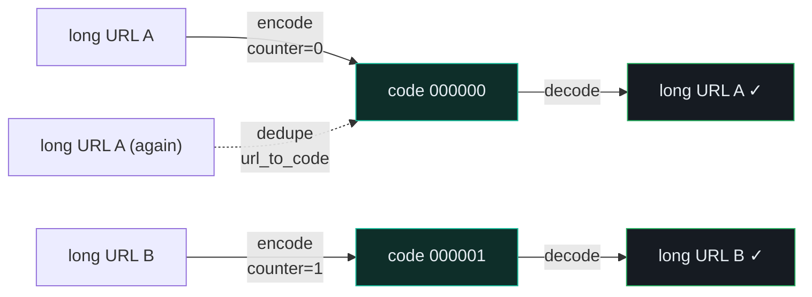

# HashMap / HashSet — Insert-Delete-GetRandom, Boomerangs, TinyURL — A Visual, Worked-Example Guide

> **Companion code:** [`hashmap.py`](./hashmap.py). **Every number is printed by
> `python3 hashmap.py`** — nothing is hand-computed.
>
> **Live animation:** [`hashmap.html`](./hashmap.html) — open in a browser, hash keys into buckets yourself and watch collisions form chains.

---

## 0. TL;DR — the one idea

> **The analogy (read this first):** A giant library with no catalog forces you to walk every shelf to find a book — **O(n)**. A hashmap is a *perfect catalog*: hand it a name and it instantly tells you the shelf — **O(1)** average. The whole pattern is one three-step mechanism, reused four ways.



Three interview idioms all reuse this mechanism — change *what you store in the slot*:

```python
freq = {}
for x in items:                       # 1. FREQUENCY COUNTING (P447)
    freq[x] = freq.get(x, 0) + 1      #    value = count

class RandomizedSet:                  # 2. O(1) DESIGN (P380)
    def __init__(self):
        self.vals = []                #    value = array index
        self.idx_map = {}             #    key   = the element

code_to_url, url_to_code = {}, {}     # 3. BIJECTIVE MAPPING (P535)
                                      #    value = short code / long URL
```

---

### Pattern Recognition Signals

| Signal in the problem statement | → Use this pattern |
|---|---|
| "count frequency", "number of occurrences", "distinct" | ✓ frequency map (`dict` / `Counter`) |
| "find if exists", "contains", "have I seen this?" | ✓ `set` membership / lookup table |
| "group by", "categorize", "anagrams" | ✓ map keyed by the canonical form |
| **"insert / remove / getRandom in O(1)"** | ✓ **list + val→idx map, swap-and-pop (P380)** |
| "encode X, later decode it back", "map one value to another" | ✓ two dicts, bijective (P535) |
| "two sum", "find a pair", "value → index" | ✓ map built as you scan (P1) |
| geometric equality: "equal distance", "tiled rectangle" | ✓ map keyed by **squared** distance / corners |

---

### The Template Skeleton

```python
# The interview starting point — four idioms share this. Memorize the shapes.

# --- 1. FREQUENCY COUNTING --------------------------------------------
freq = {}
for x in items:
    freq[x] = freq.get(x, 0) + 1          # O(1) per update

# --- 2. O(1) INSERT / REMOVE / GETRANDOM ------------------------------
class RandomizedSet:
    def __init__(self):
        self.vals = []                    # O(1) random.choice
        self.idx_map = {}                 # val -> index in vals

    def insert(self, val):
        if val in self.idx_map: return False
        self.idx_map[val] = len(self.vals)
        self.vals.append(val)
        return True

    def remove(self, val):
        if val not in self.idx_map: return False
        idx, last = self.idx_map[val], self.vals[-1]
        self.vals[idx] = last
        self.idx_map[last] = idx          # UPDATE MAP FIRST (see gotcha)
        self.vals.pop()
        del self.idx_map[val]             # THEN delete
        return True

# --- 3. SET MEMBERSHIP / LOOKUP TABLE ---------------------------------
seen = set()
if x not in seen:                         # O(1) existence check
    seen.add(x)

# --- 4. BIJECTIVE MAPPING (encode/decode) -----------------------------
code_to_url, url_to_code = {}, {}
counter = 0
def encode(url):
    if url in url_to_code: return url_to_code[url]   # dedupe
    code = to_base62(counter); counter += 1
    code_to_url[code] = url;  url_to_code[url] = code
    return code
```

---

## 1. Hashing fundamentals — key → bucket → chain

> **The core mechanism:** a *hash function* crushes an arbitrary key into an integer; *modulo* maps it into one of N buckets; a *collision* (two keys, same bucket) is resolved by a **chain** (a small list hanging off the bucket). This file uses a tiny deterministic `djb2` hash so the bucket distribution is reproducible and identical to [`hashmap.html`](./hashmap.html).

### Worked example — 7 string keys into 7 buckets

> From `hashmap.py` Section A. The collision is `date` and `fig` both hashing to **bucket 2**.

| key | `str_hash(key)` | bucket = `hash % 7` |
|---|---|---|
| apple | 253337143 | 3 |
| banana | 4086421542 | 0 |
| cherry | 4133553618 | 5 |
| date | 2090176867 | **2** |
| elderberry | 2883370293 | 6 |
| fig | 193491643 | **2** ← collides with `date` |
| grape | 260508340 | 1 |

```
bucket array (separate chaining):
  0: [('banana', 6)]
  1: [('grape', 5)]
  2: [('date', 4), ('fig', 3)]     <-- CHAIN of length 2 (collision)
  3: [('apple', 5)]
  4: []
  5: [('cherry', 6)]
  6: [('elderberry', 10)]
  keys=7, buckets=7, load factor=1.000, collisions=1
```

A lookup is **O(1) on average**: hash the key → jump to its bucket → walk a *short* chain. Collisions only hurt when one chain grows long; Python's `dict` rehashes into a bigger table when the load factor crosses ~2/3 to keep every operation O(1).



`contains('cherry') -> True`, `contains('mango') -> False`.

---

## 2. P380 Insert Delete GetRandom O(1)

> **Problem:** Design a `RandomizedSet` where `insert`, `remove`, and `getRandom` are all **average O(1)**.
> **Key insight:** A Python list gives O(1) `random.choice` but O(n) middle removal. A dict gives O(1) membership but no random index. **Combine them**: `vals[]` holds the values, `idx_map{}` maps each value to its index. Removal = **swap the target with the last element, then pop + del** — both O(1).

### Worked example — op sequence and the state after each step

> From `hashmap.py` Section B.

| op | return | `vals` after | `idx_map` after |
|---|---|---|---|
| `insert(1)` | True | `[1]` | `{1: 0}` |
| `insert(2)` | True | `[1, 2]` | `{1: 0, 2: 1}` |
| `insert(3)` | True | `[1, 2, 3]` | `{1: 0, 2: 1, 3: 2}` |
| `insert(4)` | True | `[1, 2, 3, 4]` | `{1: 0, 2: 1, 3: 2, 4: 3}` |
| `remove(2)` | True | `[1, 4, 3]` | `{1: 0, 3: 2, 4: 1}` |

`getRandom` is O(1) via `random.choice(self.vals)` — 4 seeded draws → `[3, 1, 1, 3]`.

### The four micro-steps of `remove(2)` (the swap-and-pop trick)

> From `hashmap.py` Section B. This is the part interviewers probe hardest.

```
start: vals=[1, 2, 3, 4]  idx_map={1: 0, 2: 1, 3: 2, 4: 3}

[lookup            ]  idx_map[2] = 1
[swap vals         ]  vals[1] = last = 4        -> [1, 4, 3, 4]
[update map FIRST  ]  idx_map[4] = 1  (before del!)
[pop + del         ]  vals.pop(); del idx_map[2] -> [1, 4, 3]  {1:0, 3:2, 4:1}
```



**Why "update map FIRST"?** If the value being removed *is itself* the last element, deleting `idx_map[val]` first would leave the subsequent `idx_map[last] = idx` writing to a slot you've already erased. Update-then-delete is correct in both the normal and self-swap cases.

---

## 3. P447 Number of Boomerangs

> **Problem:** Count ordered triples `(i, j, k)` with `dist(i, j) == dist(i, k)`.
> **Key insight:** For each pivot `i`, build a frequency map `{distance²: count}`. Each distance bucket holding `c` points yields `c·(c−1)` ordered `(j, k)` arms (c choices for j, c−1 for k). Sum over pivots and distances. **Use squared distance** — no `sqrt`, exact integer hash key.

### Worked example — pivot `i=1` at `[1,0]`, points `[[0,0],[1,0],[2,0]]`

> From `hashmap.py` Section C. The other two pivots contribute 0.

| j | q | d² | freq after |
|---|---|---|---|
| 0 | [0, 0] | 1 | `{1: 1}` |
| 2 | [2, 0] | 1 | `{1: 2}` |

| distance² | count c | contribution `c·(c−1)` | subtotal |
|---|---|---|---|
| 1 | 2 | 2·1 = **2** | 2 |

`number_of_boomerangs([[0,0],[1,0],[2,0]]) -> 2`

More examples (from `hashmap.py` Section C): `[[1,1],[2,2],[3,3]] -> 2`, `[[0,0],[1,0],[2,0],[0,1]] -> 4`.



---

## 4. P535 Encode and Decode TinyURL

> **Problem:** Design a class that encodes a long URL to a short one and decodes it back exactly.
> **Key insight:** A **bijective mapping** — two dicts, `code_to_url` (for decode) and `url_to_code` (to dedupe encode), bridged by a monotonic counter. `base62` turns the counter into a compact 6-char code. Because the mapping is one-to-one, decode is exact.

### `base62` — counter → short code

> From `hashmap.py` Section D. Alphabet `0-9 a-z A-Z` (62 chars). Width-padded to 6.

| counter | code |
|---|---|
| 0 | `000000` |
| 1 | `000001` |
| 35 | `00000z` |
| 61 | `00000Z` |
| 62 | `000010` |
| 3844 | `000100` |

### Encode three URLs (third duplicates the first) — dedupe keeps the same code

> From `hashmap.py` Section D.

| long URL | short URL |
|---|---|
| https://leetcode.com/problems/design-tinyurl | http://tinyurl.com/000000 |
| https://news.ycombinator.com/ | http://tinyurl.com/000001 |
| https://leetcode.com/problems/design-tinyurl *(dup)* | http://tinyurl.com/000000 *(same code)* |

Decode round-trips exactly: both 6-char codes decode back to their originals. `counter = 2` (two *distinct* URLs), `distinct codes stored = 2`.



---

### Complexity

> From `hashmap.py` Section E.

| Operation | Time | Space |
|---|---|---|
| Hash put / get / contains | O(1) avg | O(n) |
| Frequency count over n items | O(n) | O(k) |
| RandomizedSet insert / remove | O(1) avg | O(n) |
| RandomizedSet getRandom | O(1) | O(1) |
| TinyURL encode / decode | O(1) | O(U) |

*(k = distinct keys, U = distinct URLs. Worst case for any hash op is O(n) — every key in one bucket — but Python's randomized string hashing makes this astronomically unlikely.)*

### Killer Gotchas

1. **Swap-and-pop order:** in `RandomizedSet.remove`, set `idx_map[last_val] = idx` **before** `del idx_map[val]`. If `val` *is* the last element, deleting first leaves a stale dangling index.
2. **Zero counts ≠ missing key:** with a `Counter`/`dict`, `state[c] == 0` is *not* the same as `c` absent. `del state[c]` when it hits 0 so equality comparisons (`window == target`) work in sliding-window problems.
3. **Use squared distance for geometry** (P447, P391): avoids `sqrt`'s float error and keeps the key an exact, hashable integer.
4. **Tuples hash, lists don't.** Storing `[xi, yi]` as a dict key raises `TypeError`; convert to `(xi, yi)` first.
5. **Worst case is O(n):** if every key collides into one bucket (adversarial input), the chain is length n. Python's dict randomizes string hashing to defend against this.
6. **For TinyURL, a hash-of-URL (`md5[:6]`) CAN collide;** the counter + base62 scheme is bijective and collision-free by design.

### Problem Table

> From `hashmap.py` Section E.

| Problem | Essence | Key Trick |
|---|---|---|
| P380 InsertDeleteGetRandom O(1) | All ops O(1) on a set | list + val→idx map; remove = swap-and-pop |
| P447 Number of Boomerangs | Ordered equidistant triples per pivot | `freq{d²:count}`; contribution `c·(c−1)` |
| P535 Encode/Decode TinyURL | Bijective URL shortener | two dicts + base62 counter |
| P1 Two Sum | Find a pair summing to target | map value → index as you scan |
| P49 Group Anagrams | Bucket strings by canonical form | map `sorted(s)` → list of strings |
| P128 Longest Consecutive Sequence | Length of longest run | set membership; expand only from run starts |
| P575 Distribute Candies | Max unique types ≤ n/2 | `min(len(set(candyType)), n//2)` |
