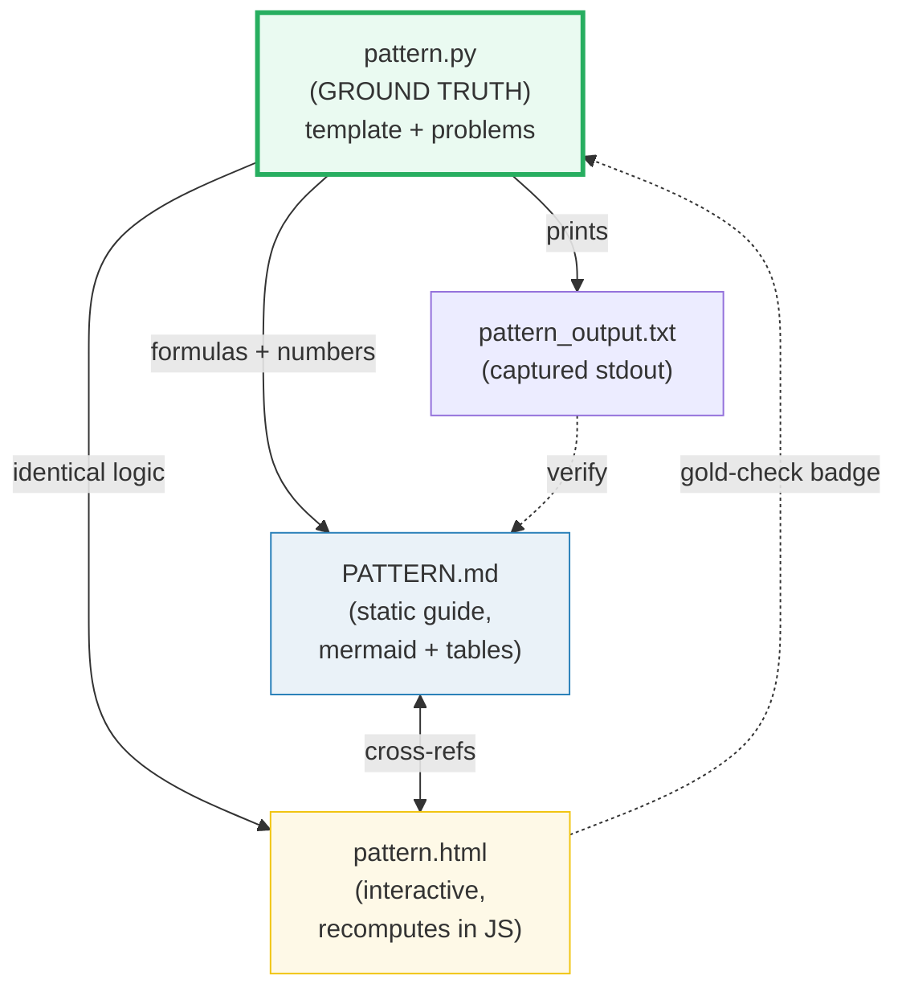
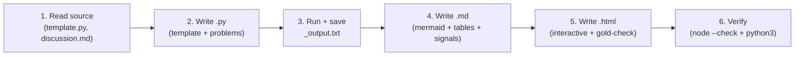

# HOW_TO_RESEARCH — Coding Interview Patterns "Concept-as-a-Bundle" Workflow

> Adapted from `llm/HOW_TO_RESEARCH.md`. Same discipline, different domain.

## 0. The one rule

> **Every concept is a bundle of files that cite each other, all deriving from ONE
> ground-truth `.py`. Nothing is ever hand-computed.**

A **concept bundle** = `{name}.py` + `{name}_output.txt` + `{NAME}.md` + `{name}.html`.



## 1. Focus

This folder covers **coding interview patterns**: the recognizable problem-solving
templates that map "what the problem asks" to "which algorithmic strategy to apply."
Each bundle teaches ONE pattern with its template skeleton and 2-4 representative
LeetCode problems, visualized interactively.

**27 bundles covering all 29 interview patterns** (2 strategic merges:
`binary_search` + `modified_binary_search`, `backtracking` + `subsets`).

**Python only** — no C/C++/JS/Rust polyglot.

## 2. Source material

The interview-prep repo at `/Users/quan/workspace/interview-prep/`:

```
tier1_foundation/     7 patterns: two_pointers, sliding_window, fast_slow_pointers, ...
tier2_intermediate/  12 patterns: binary_search, dp, prefix_sum, stack, two_heaps, ...
tier3_advanced/       5 patterns: backtracking, cyclic_sort, modified_binary_search, ...
tier4_expert/         5 patterns: graph, greedy, monotonic_stack, union_find, ...
DSA_CHEATSHEET.md    144 problems across 29 patterns with gotchas and skeletons
```

Each pattern folder contains:
- **`template.py`** — the interview skeleton code (USE AS STARTING POINT for your `.py`)
- **`discussion.md`** — deep conceptual guide with one-liners, complexity, mistakes
- **`checklist.md`** — 6-phase interview verbalization checklist
- **`problems/`** — per-problem Python solutions
- **`solutions/`** — alternate solutions
- **`README.md`** — pattern overview

Also: LeetCode problem descriptions (web search if needed), CLRS for verification.

## 3. The four roles of each file

| File | Role | Hard rules |
|---|---|---|
| **`name.py`** | Ground truth. Template skeleton + 2-4 problems, each printing results with banners. | Pure Python, no external deps. `if __name__ == "__main__"` with `===` banners. Deterministic inputs. |
| **`name_output.txt`** | Captured stdout. | `python3 name.py > name_output.txt 2>/dev/null` |
| **`NAME}.md`** | Static, rigorous guide. Mermaid diagrams + tables + worked examples. | Every number under a `> From name.py Section X:` callout. Pattern recognition signals. Template skeleton. Gotchas. |
| **`name.html`** | Playable companion. Recomputes in JS with identical logic, gold-checked against `.py`. | Single file, zero deps, opens from `file://`. Dark palette. Teal accent `#1abc9c`. |

## 4. The `.md` structure (MUST follow this template)

```markdown
# Pattern Name — Problems — A Visual, Worked-Example Guide

> **Companion code:** [`name.py`](./name.py). **Every number is printed by
> `python3 name.py`** — nothing is hand-computed.
>
> **Live animation:** [`name.html`](./name.html) — open in a browser.

---

## 0. TL;DR — the one idea

> **The analogy (read this first):** [plain-English mental model of the pattern]

[mermaid diagram showing the core concept]

---

### Pattern Recognition Signals

| Signal in the problem statement | → Use this pattern |
|---|---|
| [signal 1] | ✓ |
| [signal 2] | ✓ |

### The Template Skeleton

```python
# The interview starting point — memorize this
def pattern_template(...):
    ...
```

---

## 1. Problem Name (LeetCode PXXX)

> **Problem:** [one-line summary]
> **Key insight:** [why this pattern applies]

[worked example with code + output table]

[mermaid diagram for this problem's execution]

---

## 2-N. [More problems...]

---

### Complexity

| Operation | Time | Space |
|---|---|---|
| ... | ... | ... |

### Killer Gotchas

- [gotcha 1]
- [gotcha 2]

### Problem Table

| Problem | Essence | Key Trick |
|---|---|---|
| PXXX ... | ... | ... |
```

## 5. The `.html` style (follow existing `dsa/*.html` and `algo/*.html`)

- **Dark palette:** `--bg:#0d1117; --panel:#161b22; --ink:#e6edf3`
- **Accent:** teal `#1abc9c` (this section's identity color)
- **Step-through controls:** play / step / reset buttons
- **`[check: OK]` gold badge** — recompute a known value in JS, compare to `.py`
- **Links to `.md` and `.py`** in the header
- **`← all tutorials`** link to `./index.html` (the interview dashboard, NOT `../index.html`)
- **`.md` and `.py` links** must use full GitHub URLs: `https://github.com/quanhua92/tutorials/blob/main/interview/<STEMUP>.md` and `.../interview/<stem>.py` (NOT relative links)
- **Zero external dependencies** — vanilla JS, inline CSS/SVG
- **Interactive:** user can step through the algorithm, change inputs, see state

## 6. The workflow (step by step)



### Step 1 — Read the source
- Read `/Users/quan/workspace/interview-prep/tier*/{pattern}/template.py` — the skeleton
- Read `discussion.md` — the deep guide
- Read `DSA_CHEATSHEET.md` section for this pattern — gotchas and problem table
- Web search LeetCode problem descriptions if needed

### Step 2 — Write the `.py`
- Start from the template skeleton
- Implement 2-4 selected problems
- Each problem: function + `section_*()` printout with `===` banners
- Deterministic inputs (hardcoded, no random unless seeded)
- End with `[check] ... OK` assertions

### Step 3 — Run & capture
```bash
cd interview
python3 name.py > name_output.txt 2>/dev/null
```

### Step 4 — Write the `.md`
- Follow the template in §4 above
- Paste tables **verbatim** from `_output.txt`
- Mermaid diagrams for: pattern concept, problem execution flow, decision tree
- Pattern recognition signals table
- Template skeleton code block
- Gotchas from `DSA_CHEATSHEET.md`

### Step 5 — Write the `.html`
- Dark palette, teal accent
- Interactive step-through of the KEY insight (pointer movement, table filling, etc.)
- Gold-check badge: recompute in JS, compare to `.py` output
- `node --check` must pass on extracted `<script>`

### Step 6 — Verify
```bash
python3 name.py > /dev/null 2>&1 && echo "PY OK"
python3 -c "import re;open('/tmp/_j.js','w').write(re.search(r'<script>(.*)</script>',open('name.html').read(),re.S).group(1))"
node --check /tmp/_j.js && echo "JS OK"
```

## 7. Bundle catalog (the 27 bundles)

### Tier 1 — Foundation (7 bundles)

| # | Stem | Pattern(s) | Selected Problems | Visualization |
|---|---|---|---|---|
| 01 | `two_pointers` | two_pointers | P167 Two Sum II, P011 Container With Most Water, P015 3Sum | Two L/R pointers on array, showing eliminated regions |
| 02 | `sliding_window` | sliding_window | P003 Longest Substring, P424 Longest Repeating Char, P438 Find Anagrams | Window brackets expand/contract, constraint counter |
| 03 | `fast_slow_pointers` | fast_slow_pointers | P141 Linked List Cycle, P876 Middle, P202 Happy Number | Linked list with slow/fast tortoise-hare animation |
| 04 | `merge_intervals` | merge_intervals | P056 Merge, P057 Insert, P253 Meeting Rooms II | Timeline intervals merging step-by-step |
| 05 | `bfs` | bfs | P994 Rotting Oranges, P1091 Shortest Path, P102 Level Order | Grid wavefront expanding (multi-source BFS) |
| 06 | `hashmap` | hashmap | P380 GetRandom O(1), P447 Boomerangs, P535 TinyURL | Keys hashing into buckets |
| 07 | `string` | string | P482 License Key, P520 Detect Capital, P434 Segments | Character cursor with validation states |

### Tier 2 — Intermediate (12 bundles)

| # | Stem | Pattern(s) | Selected Problems | Visualization |
|---|---|---|---|---|
| 08 | `binary_search` | binary_search + modified_binary_search | P704 Binary Search, P153 Rotated Min, P875 Koko, P410 Split Array | lo/mid/hi markers converging + BS-on-answer mode |
| 09 | `bit_manipulation` | bit_manipulation | P136 Single Number, P191 1 Bits, P338 Counting Bits | Binary digits with Brian Kernighan's |
| 10 | `design` | design | P460 LFU Cache, P146 LRU Cache | Cache with frequency buckets + eviction |
| 11 | `dfs` | dfs | P200 Num Islands, P695 Max Area, P572 Subtree | Grid flood-fill with call stack |
| 12 | `divide_and_conquer` | divide_and_conquer | P023 Merge K Lists, P169 Majority, P912 Sort Array | Array split/merge tree |
| 13 | `dynamic_programming` | dynamic_programming | P070 Stairs, P198 House Robber, P322 Coin Change, P516 LPS | DP table filling cell-by-cell with recurrence arrows |
| 14 | `math` | math | P458 Poor Pigs, P478 Random Circle, P479 Largest Palindrome | Geometric/number-theory reasoning |
| 15 | `prefix_sum` | prefix_sum | P560 Subarray Sum K, P0238 Product Except Self, P525 Contiguous Array | Cumulative array building + range queries |
| 16 | `randomized` | randomized | P470 Rand7→Rand10, P519 Random Flip | Reservoir sampling step counter |
| 17 | `stack` | stack | P020 Valid Parens, P155 Min Stack, P394 Decode String | Stack push/pop bracket matching |
| 18 | `top_k_elements` | top_k_elements | P215 Kth Largest, P347 Top K Frequent, P973 K Closest | Heap tree with size-k insert/evict |
| 19 | `two_heaps` | two_heaps | P295 Median Finder, P480 Sliding Median, P355 Twitter | Two balanced heaps with median pointer |

### Tier 3 — Advanced (3 bundles)

| # | Stem | Pattern(s) | Selected Problems | Visualization |
|---|---|---|---|---|
| 20 | `backtracking` | backtracking + subsets | P046 Permutations, P039 Combination Sum, P078 Subsets, P017 Letter Combos | Decision tree with include/exclude branches |
| 21 | `cyclic_sort` | cyclic_sort | P268 Missing, P442 Duplicates, P448 Disappeared | Array swaps to correct positions |
| 22 | `trie` | trie | P208 Implement Trie, P211 Add/Search, P212 Word Search II | Character-by-character prefix tree building |

### Tier 4 — Expert (5 bundles)

| # | Stem | Pattern(s) | Selected Problems | Visualization |
|---|---|---|---|---|
| 23 | `graph` | graph | P207 Course Schedule, P210 Course Schedule II, P997 Town Judge | Directed graph topo-sort + cycle coloring |
| 24 | `greedy` | greedy | P055 Jump Game, P452 Min Arrows, P134 Gas Station | Step-by-step greedy choice proof |
| 25 | `matrix_traversal` | matrix_traversal | P054 Spiral, P048 Rotate, P498 Diagonal | Matrix cursor spiral/diagonal/rotation |
| 26 | `monotonic_stack` | monotonic_stack | P739 Daily Temps, P084 Largest Rectangle, P503 Next Greater II | Stack push/pop with next-greater-element |
| 27 | `union_find` | union_find | P323 Components, P684 Redundant, P990 Eq Equations | Sets merging with path compression |

## 8. Verification discipline (do not skip)

1. **`.py` runs clean:** `python3 name.py` exits 0, all `[check] OK`
2. **`_output.txt` matches:** `python3 name.py 2>/dev/null | diff - name_output.txt`
3. **JS syntax:** extract `<script>`, run `node --check`
4. **Gold-check:** `.html` has `[check: OK]` badge that passes in browser

```bash
# Quick verification commands
python3 name.py > /dev/null 2>&1 && echo "PY OK"
python3 -c "import re;open('/tmp/_j.js','w').write(re.search(r'<script>(.*)</script>',open('name.html').read(),re.S).group(1))"
node --check /tmp/_j.js && echo "JS OK"
```
