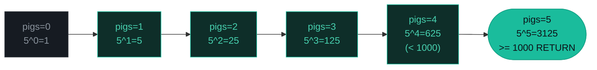
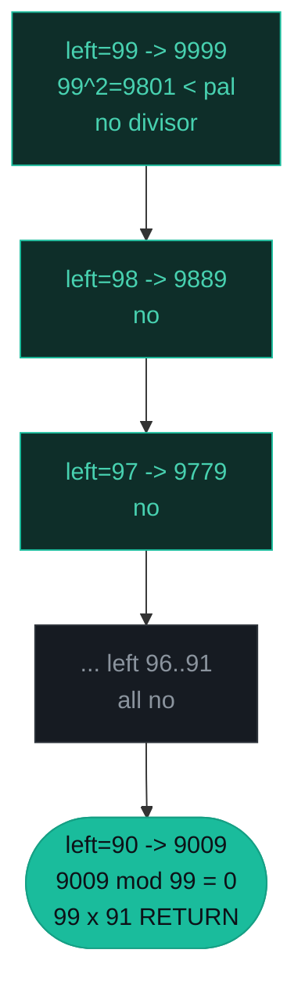

# Math / Constructive — Poor Pigs, Random Point, Largest Palindrome — A Visual, Worked-Example Guide

> **Companion code:** [`math.py`](./math.py). **Every number is printed by
> `python3 math.py`** — nothing is hand-computed.
>
> **Live animation:** [`math.html`](./math.html) — open in a browser, step the pigs, circle, and palindrome mirror yourself.

---

## 0. TL;DR — the one idea

> **The analogy (read this first):** Math problems ask you to find the **hidden formula** instead of simulating step by step. It is like counting bricks in a wall: you do not count one by one, you multiply rows by columns. If you reach for a `while` loop that could run a billion times, **stop** — there is a closed-form shortcut.
>
> Three flavors cover the canonical interview set:
> 1. **Information theory** — each pig is one *digit* in base `tests+1`. With `tests` rounds a pig has `tests+1` states (die in round `0..tests-1`, or survive all). So `pigs` pigs distinguish `(tests+1)^pigs` buckets. The `+1` is the implicit *"survived"* state.
> 2. **Rejection sampling / geometry** — to sample uniformly in a disk, sample uniformly in the bounding **square** `[-r, r]²` and **reject** points outside the disk. Every interior point is equally likely to be proposed, so survivors are uniform. Never sample a radius uniformly — area grows as `r²`, crowding points at the center.
> 3. **Constructive mirroring** — to find the largest palindromic product `a·b`, do **not** scan all `~10²ⁿ` products. **Generate** palindromes largest-first: take the upper half `left`, **mirror** it into a `2n`-digit palindrome, then test for an `n`-digit divisor (stopping at `√palindrome`).

```mermaid
graph LR
    subgraph FLAVORS["three math flavors"]
        A["information theory<br/>(tests+1)^pigs<br/>base counting"] -->|min pigs| P458["P458<br/>Poor Pigs"]
        B["rejection sampling<br/>square -> keep disk<br/>~pi/4 accept"] -->|uniform in disk| P478["P478<br/>Random Circle"]
        C["constructive mirror<br/>left + reverse(left)<br/>factor scan"] -->|largest palindrome| P479["P479<br/>Largest Palindrome"]
    end
    style A fill:#0e2e29,stroke:#1abc9c,color:#48d1b0
    style B fill:#0e2e29,stroke:#1abc9c,color:#48d1b0
    style C fill:#0e2e29,stroke:#1abc9c,color:#48d1b0
    style P458 fill:#1abc9c,stroke:#16a085,color:#0d1117
    style P478 fill:#1abc9c,stroke:#16a085,color:#0d1117
    style P479 fill:#1abc9c,stroke:#16a085,color:#0d1117
    style FLAVORS fill:#0d1117,stroke:#30363d
```



The whole pattern is "find the formula, avoid the brute-force loop":

```python
# 1. P458: each pig = one digit in base (tests+1); smallest pigs >= buckets
tests = minutesToTest // minutesToDie
pigs = 0
while (tests + 1) ** pigs < buckets:
    pigs += 1

# 2. P478: propose a point in the bounding square, reject if outside the disk
while True:
    x, y = uniform(-1, 1), uniform(-1, 1)
    if x * x + y * y <= 1:
        break

# 3. P479: mirror the upper half into a palindrome, test for an n-digit factor
if n == 1: return 9
upper = 10 ** n - 1
for left in range(upper, lower - 1, -1):
    pal = mirror(left)
    right = upper
    while right * right >= pal:
        if pal % right == 0:
            return pal % 1337
        right -= 1
```

---

### Pattern Recognition Signals

| Signal in the problem statement | → Use this pattern |
|---|---|
| "minimum number of **tests / pigs**" / "distinguish one bad item among N" | ✓ information theory, `(tests+1)^pigs ≥ buckets` (P458) |
| "exactly one is poisonous / defective" + a time budget for rounds | ✓ base counting — `tests = total // die` |
| "random point **in / inside** a circle / disk / sphere" | ✓ rejection sampling on the bounding box (P478) |
| "**uniform** random" over a non-rectangular region | ✓ rejection sampling OR `r = R·√U` polar |
| "largest **palindrome** that is the product of two n-digit numbers" | ✓ mirror the prefix, factor scan (P479) |
| "next permutation of a number's digits" / "closest palindrome" | ✓ constructive candidate generation |
| huge bounds (`n ≤ 10¹⁸`) + strict time limit | ✓ closed-form `O(1)` / `O(log n)` formula, never brute force |
| "is it a perfect number / prime count" | ✓ math formula / sieve |
| Counting paths / full configuration enumeration | ✗ use **DFS / backtracking** |
| Subarray sum / range product | ✗ use **prefix sum** |
| Parity / odd-one-out in a list | ✗ use **bit manipulation** (XOR fold) |

---

### The Template Skeleton

```python
# The interview starting point — memorize this. Three flavors, one mindset.

# ---- 1. P458 Poor Pigs — information theory base counting ----
def poor_pigs(buckets, minutes_to_die, minutes_to_test):
    tests = minutes_to_test // minutes_to_die
    pigs = 0
    while (tests + 1) ** pigs < buckets:   # base = tests+1 (the "survived" state)
        pigs += 1
    return pigs
# O(log buckets) time, O(1) space


# ---- 2. P478 Random Point — rejection sampling ----
def rand_point(radius, x_center, y_center):
    while True:
        x = uniform(-1, 1)                 # bounding square [-1,1]^2
        y = uniform(-1, 1)
        if x * x + y * y <= 1:             # inside the unit disk -> keep
            break                          # ~pi/4 ~ 78.5% acceptance
    return (x_center + x * radius, y_center + y * radius)
# O(1) expected per point, O(1) space


# ---- 3. P479 Largest Palindrome — constructive mirroring ----
def mirror(left):                           # 90 -> 9009
    pal, tmp = left, left
    while tmp > 0:
        pal = pal * 10 + tmp % 10
        tmp //= 10
    return pal

def largest_palindrome(n):
    if n == 1: return 9                     # special case: 3*3 = 9
    upper = 10 ** n - 1
    for left in range(upper, 10 ** (n - 1) - 1, -1):
        pal = mirror(left)
        right = upper
        while right * right >= pal:         # stop at sqrt: no divisor below it
            if pal % right == 0:
                return pal % 1337
            right -= 1
# O(10^n) worst case, O(1) space
```

---

## 1. P458 Poor Pigs

> **Problem:** `buckets` buckets, exactly one poisonous. A pig dies within `minutesToDie` of drinking it; you have `minutesToTest` total. Return the **minimum** pigs to identify the poisoned bucket.
> **Key insight:** Each pig has `tests + 1` observable states — die in round `0..tests-1`, or **survive** every round. `pigs` pigs in parallel encode `(tests+1)^pigs` distinct outcomes, so find the smallest `pigs` with that capacity `≥ buckets`. The `+1` in the base is the whole trick.

### Worked example — `(4, 15, 15)` → `2`

> From `math.py` Section A. `tests = 15 // 15 = 1`, so `base = tests + 1 = 2`.

| pigs | (tests+1)^pigs | ≥ buckets? | decision |
|---|---|---|---|
| 0 | 2⁰ = 1 | < 4 | too small, +1 pig |
| 1 | 2¹ = 2 | < 4 | too small, +1 pig |
| 2 | 2² = 4 | ≥ 4 | **RETURN 2** |

`poor_pigs(4, 15, 15) -> 2`

With 2 pigs and base 2 you get a 2-bit address `00,01,10,11` → 4 buckets.

### Worked example — `(4, 15, 30)` → `2`

> From `math.py` Section A. `tests = 30 // 15 = 2`, so `base = tests + 1 = 3`.

| pigs | (tests+1)^pigs | ≥ buckets? | decision |
|---|---|---|---|
| 0 | 3⁰ = 1 | < 4 | too small, +1 pig |
| 1 | 3¹ = 3 | < 4 | too small, +1 pig |
| 2 | 3² = 9 | ≥ 4 | **RETURN 2** |

`poor_pigs(4, 15, 30) -> 2`

Two rounds give each pig 3 states (die round 0, die round 1, survive) → `3² = 9 ≥ 4`.

### Stress case — `(1000, 15, 60)` → `5`

> From `math.py` Section A. `tests = 60 // 15 = 4`, so `base = 5`.

| pigs | 5^pigs | ≥ 1000? | decision |
|---|---|---|---|
| 0 | 1 | < 1000 | +1 pig |
| 1 | 5 | < 1000 | +1 pig |
| 2 | 25 | < 1000 | +1 pig |
| 3 | 125 | < 1000 | +1 pig |
| 4 | 625 | < 1000 | +1 pig |
| 5 | 3125 | ≥ 1000 | **RETURN 5** |

`poor_pigs(1000, 15, 60) -> 5`



**More canonical checks** (from `math.py` Section A): `poor_pigs(1,1,1) = 0` (one bucket needs no pig); `poor_pigs(125,1,4) = 3` (`5³ = 125` exactly); `poor_pigs(25,1,1) = 5` (`2⁴=16 < 25 ≤ 2⁵=32`).

---

## 2. P478 Random Point in a Circle

> **Problem:** Generate a **uniform** random point inside a disk of `radius` centered at `(x_center, y_center)`.
> **Key insight:** Sample a point uniformly in the bounding **square** `[-1, 1]²` and **reject** it if it falls outside the unit disk (`x²+y² > 1`). Every interior point is equally likely to be *proposed*, so the survivors are uniform. The acceptance probability is the area ratio `πr²/(2r)² = π/4 ≈ 0.7854`.

### Why rejection works (and uniform radius fails)

```mermaid
graph TB
    subgraph RIGHT["correct: rejection sampling"]
        R1["propose x,y in square"] --> R2{"x*x + y*y <= 1?"}
        R2 -->|yes keep| R3["scale by r, offset center"]
        R2 -->|no ~21.5%| R1
    end
    subgraph WRONG["wrong: uniform radius"]
        W1["r ~ U(0,R), theta ~ U(0,2pi)"] --> W2["density ~ 1/(2*pi*r)"]
        W2 --> W3["BLOW UP at center"]
    end
    style R1 fill:#0e2e29,stroke:#1abc9c,color:#48d1b0
    style R3 fill:#1abc9c,stroke:#16a085,color:#0d1117
    style W1 fill:#3a1414,stroke:#c0392b,color:#ff7a7a
    style W3 fill:#3a1414,stroke:#c0392b,color:#ff7a7a
    style RIGHT fill:#0d1117,stroke:#27ae60
    style WRONG fill:#0d1117,stroke:#c0392b
```



Area grows with `r²`: a uniform radius over-represents the small-`r` ring (which has less area). The Jacobian of `(r, θ)` is `r`, so density `~ 1/(2πr)` blows up at the origin. Fix if you must use polar: `r = R·√(U(0,1))`, **never** `r = R·U(0,1)`.

### Worked example — first 8 proposals (seed 42, unit disk)

> From `math.py` Section B. `seed=42`, deterministic LCG (reproduced byte-for-byte in `math.html`).

| attempt | x | y | x²+y² | decision |
|---|---|---|---|---|
| 1 | −0.4953 | −0.8237 | 0.9239 | **ACCEPT** |
| 2 | +0.1546 | −0.5549 | 0.3318 | **ACCEPT** |
| 3 | −0.2487 | −0.9487 | 0.9618 | **ACCEPT** |
| 4 | −0.1054 | −0.7631 | 0.5934 | **ACCEPT** |
| 5 | +0.7476 | +0.9893 | 1.5376 | reject |
| 6 | +0.7064 | −0.0006 | 0.4990 | **ACCEPT** |
| 7 | +0.2840 | +0.7229 | 0.6033 | **ACCEPT** |
| 8 | +0.1929 | −0.8185 | 0.7072 | **ACCEPT** |

Only proposal 5 is rejected (`x²+y² = 1.5376 > 1`).

### Empirical acceptance — 20 000 proposals

> From `math.py` Section B.

- accepted = **15735 / 20000 = 0.7867**
- theory = π/4 = **0.7854**
- relative error = **0.17%**

The empirical rate converges to `π/4` — rejection sampling is uniform and unbiased. Each accepted point costs ~`4/π ≈ 1.27` proposals in expectation.

### Scaled disk — radius 2, center (1, 3), seed 7

> From `math.py` Section B. Accepted points scaled by `radius` and offset by the center.

| call | point | offset from center |
|---|---|---|
| #1 | (−0.0449, +4.6540) | (−1.0449, +1.6540) |
| #2 | (+1.4500, +4.7079) | (+0.4500, +1.7079) |
| #3 | (+0.4439, +1.2124) | (−0.5561, −1.7876) |

Every offset has magnitude `≤ 2` (= the radius) — all inside the disk.

---

## 3. P479 Largest Palindrome Product

> **Problem:** Return the largest palindromic integer that is the product of two `n`-digit integers, mod `1337`.
> **Key insight:** Do not scan all `~10²ⁿ` products. **Generate** palindromes largest-first: mirror the upper half `left` (from `10ⁿ−1` downward) into a `2n`-digit palindrome, then test for an `n`-digit divisor, stopping once `right² < palindrome` (no factor below `√palindrome`). `n=1` is special (`9 = 3·3`).

### Worked example — `n=2`: scan from `left=99` downward

> From `math.py` Section C. Mirror `left` → palindrome, then factor-scan `right` from `99` down, stopping at `right² < pal`.

| left | palindrome | factorable? |
|---|---|---|
| 99 | 9999 | no (`99² = 9801 < 9999`, no divisor ≥ √) |
| 98 | 9889 | no |
| 97 | 9779 | no |
| 96 | 9669 | no |
| 95 | 9559 | no |
| 94 | 9449 | no |
| 93 | 9339 | no |
| 92 | 9229 | no |
| 91 | 9119 | no |
| **90** | **9009** | **YES → 99 × 91** ✓ |

`=> largest palindrome = 9009 = 99 × 91`, and `9009 mod 1337 = 987`.



The `right² < pal` guard is what makes this efficient: for `9999`, `99² = 9801 < 9999` immediately, so the inner loop does **zero** modulo tests — no `n`-digit factor can pair with one `≤ 99` to reach `9999`.

### Full table — n=1..8

> From `math.py` Section C.

| n | largest palindrome = factors | mod 1337 |
|---|---|---|
| 1 | 9 = 3 × 3 | 9 |
| 2 | 9009 = 99 × 91 | 987 |
| 3 | 906609 = 993 × 913 | 123 |
| 4 | 99000099 = 9999 × 9901 | 597 |
| 5 | 9966006699 = 99979 × 99681 | 677 |
| 6 | 999000000999 = 999999 × 999001 | 1218 |
| 7 | 99956644665999 = 9998017 × 9997647 | 877 |
| 8 | 9999000000009999 = 99999999 × 99990001 | 475 |

**Canonical LeetCode checks** (from `math.py` Section C): `largest_palindrome(1) = 9`, `largest_palindrome(2) = 987`. Every reported palindrome for `n=2..8` is verified to read the same forwards and backwards.

---

## 4. Extensions (briefly)

- **P556 Next Greater Element III** — next-permutation on the digits of `n`: find the first dip from the right, swap with the next-larger digit, reverse the suffix. Return `-1` if none exists or the result exceeds `2³¹−1`.
- **P564 Find the Closest Palindrome** — generate 5 candidates around the prefix (prefix ±1 mirrored, same prefix mirrored, `10^(len−1)−1` like `999`, `10^len+1` like `1001`), pick the closest (tie → smaller). Generic mirroring breaks for 1-digit numbers and powers of 10.
- **P507 Perfect Number** — Euclid's formula `2^(p−1)·(2^p − 1)` for prime `p` (Mersenne).
- **P204 Count Primes** — Sieve of Eratosthenes, `O(n log log n)`.
- **P504 Base 7 / P168 Excel Sheet Column Title** — repeated division base conversion (the same "digit in a base" idea as P458, but for output).

---

### Complexity

> From `math.py` Section D.

| Problem | Time | Space |
|---|---|---|
| P458 Poor Pigs (base counting) | O(log buckets) | O(1) |
| P478 Random Point (rejection sample) | O(1) expected per point | O(1) |
| P479 Largest Palindrome (mirroring) | O(10ⁿ) worst case | O(1) |
| Closed-form / formula math generally | O(1) or O(log n) | O(1) |
| Digit construction (palindrome / permutation) | O(n) or O(10ⁿ) | O(1) |

*Each random point costs `4/π ≈ 1.27` proposals in expectation (acceptance `π/4`).*

### Killer Gotchas

1. **The `+1` in Poor Pigs.** The base is `(tests+1)`, **not** `tests`. The `+1` encodes *"survived every round"* — a real, observable state. Forgetting it under-counts buckets by a factor of `(tests+1)/tests`.
2. **Uniform radius clusters at the center.** Sampling `r ~ U(0,R)` gives a 2D density `~ 1/(2πr)` that blows up at the origin. Either reject on the bounding square, **or** use polar with `r = R·√(U(0,1))`. **Never** `r = R·U(0,1)`.
3. **`n=1` special case for palindromes.** Mirroring a 1-digit prefix is meaningless; P479 `n=1` returns `9 = 3·3` directly. A general mirror loop would skip or miscompute it.
4. **Stop the factor scan at `√palindrome`.** When testing "does `n`-digit `right` divide `pal`?", stop once `right² < pal`: no divisor smaller than `√pal` can pair with one `≤ √pal`. This prunes the inner loop toward `O(√palindrome)`.
5. **Overflow / mod.** Python handles bignums, but P479 demands the answer mod `1337`. Apply the mod **only at the return** — never inside the factor test (you must test the *real* palindrome for divisibility).
6. **Formula edge cases.** Math formulas break at `n=0`, `n=1`, single digits, and exact powers of 10. Always test those boundaries explicitly.

### Problem Table

> From `math.py` Section D.

| Problem | Essence | Key Trick |
|---|---|---|
| P458 Poor Pigs | Min pigs with `(tests+1)^pigs ≥ buckets` | Information theory: each pig = one digit in base `tests+1`; loop until capacity covers buckets |
| P478 Random Point in Circle | Uniform point inside a disk | Rejection sample in `[-1,1]²`; keep iff `x²+y² ≤ 1`; scale by `r`; acceptance `π/4` |
| P479 Largest Palindrome Product | Largest palindromic product of two `n`-digit numbers | Mirror upper half → palindrome; factor scan stopping at `√pal`; `n=1` → 9 |
| P556 Next Greater Element III | Next permutation of the digits | Find dip from right, swap with next-larger, reverse suffix; reject if `> 2³¹−1` |
| P564 Find the Closest Palindrome | Nearest palindrome (not itself), tie → smaller | 5 candidates: prefix ±1 mirrored, same mirrored, `10^(len−1)−1`, `10^len+1` |
| P507 Perfect Number | Is `n` a perfect number? | Euclid: `2^(p−1)·(2^p − 1)` for Mersenne prime `p` |
| P204 Count Primes | Primes below `n` | Sieve of Eratosthenes, `O(n log log n)` |
