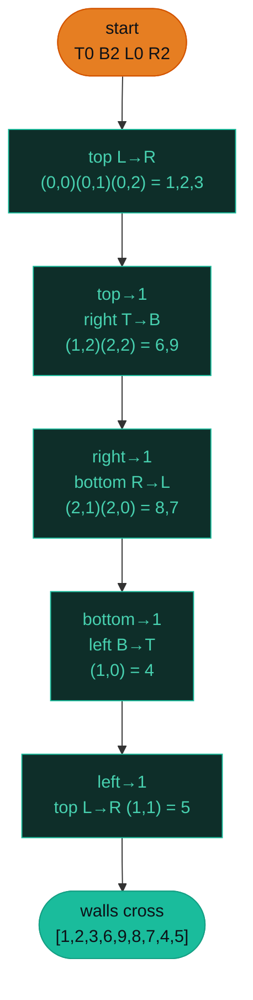
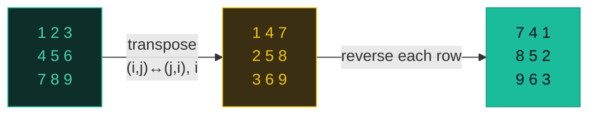
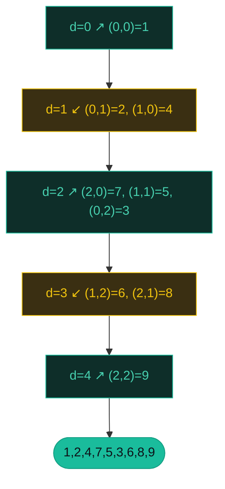

# Matrix Traversal — Spiral, Rotate, Diagonal — A Visual, Worked-Example Guide

> **Companion code:** [`matrix_traversal.py`](https://github.com/quanhua92/tutorials/blob/main/interview/matrix_traversal.py). **Every number is printed by
> `python3 matrix_traversal.py`** — nothing is hand-computed.
>
> **Live animation:** [`matrix_traversal.html`](./matrix_traversal.html) — open in a browser, drive the cursor along the spiral / watch the matrix transpose & flip / zig-zag the diagonals yourself.

---

## 0. TL;DR — the one idea

> **The analogy (read this first):** A matrix is just a grid of numbers — don't drown in nested loops. Each traversal problem hides **one simple geometric rule**:
>
> - **Spiral** → imagine **four walls** (top, bottom, left, right). Walk a wall, then shove it inward. Stop when the walls cross.
> - **Rotate 90°** → **two reflections**. Flip across the main diagonal (transpose), then flip left↔right (reverse each row). Two flips = a quarter turn.
> - **Diagonal** → every cell on a diagonal shares the sum `d = row + col`. Walk the `m+n-1` diagonals in order, **flipping direction each time** (even `d` ↗, odd `d` ↙). The zig-zag *is* the answer.

```mermaid
graph TD
    subgraph SPIRAL["SPIRAL — 4 walls walk + shrink inward"]
        SP0(["top=0 bottom=2<br/>left=0 right=2"]) --> SP1["walk top row<br/>L→R: 1,2,3"]
        SP1 --> SP2["walk right col<br/>T→B: 6,9"]
        SP2 --> SP3["walk bottom row<br/>R→L: 8,7 (guard!)"]
        SP3 --> SP4["walk left col<br/>B→T: 4 (guard!)"]
        SP4 --> SP5(["walls cross → done"])
    end
    style SP0 fill:#e67e22,stroke:#d35400,color:#0d1117
    style SP1 fill:#0e2e29,stroke:#1abc9c,color:#48d1b0
    style SP2 fill:#0e2e29,stroke:#1abc9c,color:#48d1b0
    style SP3 fill:#0e2e29,stroke:#1abc9c,color:#48d1b0
    style SP4 fill:#0e2e29,stroke:#1abc9c,color:#48d1b0
    style SP5 fill:#1abc9c,stroke:#16a085,color:#0d1117
    style SPIRAL fill:#0d1117,stroke:#30363d
```



The whole pattern is **index gymnastics, not search**. There is no BFS, no DFS, no visited set — just four moving ints (spiral), two reflections (rotate), or a parity flip (diagonal). Recognize the rule and the loops write themselves.

---

### Pattern Recognition Signals

| Signal in the problem statement | → Use this pattern |
|---|---|
| "spiral order" / "clockwise order" / "layer by layer" | ✓ spiral — 4 boundary pointers (P054) |
| "rotate 90 degrees" / "rotate image" / **in place** | ✓ rotate — transpose + reverse rows (P048) |
| "diagonal order" / "zig-zag" / "anti-diagonal" | ✓ diagonal — flip direction each `d=row+col` (P498) |
| "fill 1..n² in spiral order" | ✓ spiral walls, but you *write* cells instead of reading (P059) |
| "set matrix zeroes" / "mark rows and columns" | ✗ that's in-place **flagging**, not traversal (P73) |
| "number of islands" / "connected components" | ✗ that's **DFS/BFS**, a different matrix family |
| "distance to nearest 0" / "shortest path in grid" | ✗ that's **multi-source BFS** (P542) |

> These three problems are the **traversal-order** family. The **connectivity/spread** family (islands, rotting oranges, 01-matrix) lives in the [BFS](./BFS.md) and [DFS](./DFS.md) bundles.

---

### The Template Skeleton

```python
# The interview starting points — memorize all three.

# ---- SPIRAL (P054) — 4 walls, walk + shrink ----
def spiral_order(matrix):
    if not matrix or not matrix[0]:
        return []
    res = []
    top, bottom = 0, len(matrix) - 1
    left, right = 0, len(matrix[0]) - 1
    while top <= bottom and left <= right:
        for c in range(left, right + 1):  res.append(matrix[top][c])    # top  L->R
        top += 1
        for r in range(top, bottom + 1):  res.append(matrix[r][right])  # right T->B
        right -= 1
        if top <= bottom:                                             # GUARD
            for c in range(right, left - 1, -1): res.append(matrix[bottom][c])
            bottom -= 1
        if left <= right:                                             # GUARD
            for r in range(bottom, top - 1, -1): res.append(matrix[r][left])
            left += 1
    return res

# ---- ROTATE (P048) — transpose, then reverse every row ----
def rotate(matrix):
    n = len(matrix)
    for i in range(n):
        for j in range(i + 1, n):                 # i<j ONLY or you swap twice
            matrix[i][j], matrix[j][i] = matrix[j][i], matrix[i][j]
    for row in matrix:
        row.reverse()

# ---- DIAGONAL (P498) — flip direction each diagonal ----
def diagonal_traverse(matrix):
    if not matrix or not matrix[0]:
        return []
    m, n = len(matrix), len(matrix[0])
    res = []
    for d in range(m + n - 1):
        if d % 2 == 0:                            # even d -> UP-RIGHT
            r, c = min(d, m - 1), d - min(d, m - 1)
            while r >= 0 and c < n:
                res.append(matrix[r][c]); r -= 1; c += 1
        else:                                      # odd d -> DOWN-LEFT
            c, r = min(d, n - 1), d - min(d, n - 1)
            while c >= 0 and r < m:
                res.append(matrix[r][c]); r += 1; c -= 1
    return res
```

---

## 1. P054 Spiral Matrix

> **Problem:** Given an `m×n` matrix, return all elements in **clockwise spiral order**.
> **Key insight:** Four walls (`top`, `bottom`, `left`, `right`) bound the unvisited ring. Walk a wall, push it inward, repeat. The two `if` guards on the bottom-row and left-col legs are what stop a 1D strip from being read twice.

### Worked example — the 3×3

> From `matrix_traversal.py` Section A.

```
  1  2  3
  4  5  6
  7  8  9
```

One ring unwrap = four legs, then the inner `5` is a lone fifth leg:

| leg# | side | cells visited | walls (T,B,L,R) |
|---|---|---|---|
| 1 | top: left→right | `(0,0), (0,1), (0,2)` | `(0,2,0,2)` |
| 2 | right: top→bottom | `(1,2), (2,2)` | `(1,2,0,2)` |
| 3 | bottom: right→left | `(2,1), (2,0)` | `(1,2,0,1)` |
| 4 | left: bottom→top | `(1,0)` | `(1,1,0,1)` |
| 5 | top: left→right | `(1,1)` | `(1,1,1,1)` |

`spiral_order -> [1, 2, 3, 6, 9, 8, 7, 4, 5]` · final walls `top=2 bottom=1 left=1 right=0` (crossed → stop).

The cursor's path (order = output index):

| step | side | cell | value | order | walls (T,B,L,R) |
|---|---|---|---|---|---|
| 0 | top | `(0,0)` | 1 | 0 | `(0,2,0,2)` |
| 1 | top | `(0,1)` | 2 | 1 | `(0,2,0,2)` |
| 2 | top | `(0,2)` | 3 | 2 | `(0,2,0,2)` |
| 3 | right | `(1,2)` | 6 | 3 | `(1,2,0,2)` |
| 4 | right | `(2,2)` | 9 | 4 | `(1,2,0,2)` |
| 5 | bottom | `(2,1)` | 8 | 5 | `(1,2,0,1)` |
| 6 | bottom | `(2,0)` | 7 | 6 | `(1,2,0,1)` |
| 7 | left | `(1,0)` | 4 | 7 | `(1,1,0,1)` |
| 8 | top | `(1,1)` | 5 | 8 | `(1,1,1,1)` |



**Why the guards matter** — without `if top <= bottom` / `if left <= right`, a `1×5` row emits `[1,2,3,4,5,4,3,2,1]` (the bottom leg walks back over the same row). **Edge cases** (from Section A): `1×3 → [1,2,3]`; `3×1 → [1,2,3]`; `2×2 → [1,2,4,3]`; `1×1 → [1]`; `[] → []`. Non-square `3×4 → [1,2,3,4,8,12,11,10,9,5,6,7]`.

---

## 2. P048 Rotate Image

> **Problem:** Rotate an `n×n` matrix **90° clockwise in place** (no second matrix).
> **Key insight:** Two reflections make a quarter turn. **(1) Transpose** — swap `matrix[i][j] ↔ matrix[j][i]` for `i < j` only. **(2) Reverse** every row. Transpose flips across the main diagonal; reversing a row flips left↔right; combined = +90° CW.

### Worked example — the 3×3

> From `matrix_traversal.py` Section B.

```
  1  2  3
  4  5  6
  7  8  9
```

**Phase 1 — transpose** (only `i < j`, so each pair swaps exactly once — start the inner loop at `j = i+1`):

| swap# | pair | grid after swap |
|---|---|---|
| 1 | `(0,1) ↔ (1,0)` | `[[1,4,3],[2,5,6],[7,8,9]]` |
| 2 | `(0,2) ↔ (2,0)` | `[[1,4,7],[2,5,6],[3,8,9]]` |
| 3 | `(1,2) ↔ (2,1)` | `[[1,4,7],[2,5,8],[3,6,9]]` |

**Phase 2 — reverse each row:**

| row# | row reversed | grid after reverse |
|---|---|---|
| 0 | `[7,4,1]` | `[[7,4,1],[2,5,8],[3,6,9]]` |
| 1 | `[8,5,2]` | `[[7,4,1],[8,5,2],[3,6,9]]` |
| 2 | `[9,6,3]` | `[[7,4,1],[8,5,2],[9,6,3]]` |

**After (rotated 90° CW):**

```
  7  4  1
  8  5  2
  9  6  3
```



**Direction cheat-sheet:** transpose + reverse **rows** = 90° **CW** · reverse rows + transpose = 90° **CCW** · transpose + reverse **columns** = 90° **CCW**. **Edge cases:** `1×1 → [[1]]`; `2×2 → [[3,1],[4,2]]`; `4×4 1..16 → [[13,9,5,1],[14,10,6,2],[15,11,7,3],[16,12,8,4]]`.

---

## 3. P498 Diagonal Traverse

> **Problem:** Return all elements in **diagonal zig-zag order**.
> **Key insight:** Cells on one diagonal share `d = row + col` (constant). There are `m + n - 1` diagonals. Walk them in order and **flip direction each diagonal**: even `d` goes ↗ up-right, odd `d` goes ↙ down-left.

### Worked example — the 3×3

> From `matrix_traversal.py` Section C.

```
  1  2  3
  4  5  6
  7  8  9
```

Diagonals (`d = row + col`):

| d | direction | cells walked | values |
|---|---|---|---|
| 0 | up-right ↗ | `(0,0)` | `1` |
| 1 | down-left ↙ | `(0,1), (1,0)` | `2, 4` |
| 2 | up-right ↗ | `(2,0), (1,1), (0,2)` | `7, 5, 3` |
| 3 | down-left ↙ | `(1,2), (2,1)` | `6, 8` |
| 4 | up-right ↗ | `(2,2)` | `9` |

`diagonal_traverse -> [1, 2, 4, 7, 5, 3, 6, 8, 9]`

Per-cell walk (order = output index):

| step | d | direction | cell | value | order |
|---|---|---|---|---|---|
| 0 | 0 | up-right | `(0,0)` | 1 | 0 |
| 1 | 1 | down-left | `(0,1)` | 2 | 1 |
| 2 | 1 | down-left | `(1,0)` | 4 | 2 |
| 3 | 2 | up-right | `(2,0)` | 7 | 3 |
| 4 | 2 | up-right | `(1,1)` | 5 | 4 |
| 5 | 2 | up-right | `(0,2)` | 3 | 5 |
| 6 | 3 | down-left | `(1,2)` | 6 | 6 |
| 7 | 3 | down-left | `(2,1)` | 8 | 7 |
| 8 | 4 | up-right | `(2,2)` | 9 | 8 |



**Start-cell rule:** even `d` begins at `row = min(d, m-1)` (the bottom-left end of that diagonal); odd `d` begins at `col = min(d, n-1)` (the top-right end). Get these backwards and you walk the diagonal reversed or run out of bounds. **Edge cases:** non-square `3×4 → [1,2,5,9,6,3,4,7,10,11,8,12]`; `2×3 → [1,2,4,5,3,6]`; `1×1 → [1]`; `1×3 → [1,2,3]`; `[] → []`.

---

## 4. Extensions (briefly)

- **P059 Spiral Matrix II** — same four walls, but you *write* `1..n²` into a fresh `n×n` grid instead of reading.
- **P885 Spiral Matrix III** — walk by *step length* (`1,1,2,2,3,3,…`) over a possibly huge grid, skipping out-of-bounds cells.
- **P73 Set Matrix Zeroes** — looks like matrix traversal but is really in-place **flagging** (use the first row/column as markers).
- **P542 01 Matrix** — "distance to nearest 0" is **multi-source BFS** from all `0`-cells, *not* a traversal-order problem.

---

### Complexity

> From `matrix_traversal.py` Section D.

| Operation | Time | Space (extra) |
|---|---|---|
| Spiral Matrix (P054) | O(m·n) | O(1) — output is O(m·n) |
| Rotate Image (P048) | O(n²) | O(1) — in place |
| Diagonal Traverse (P498) | O(m·n) | O(1) — output is O(m·n) |

*m = rows, n = cols; P048 requires a **square** n×n matrix.*

### Killer Gotchas

1. **Spiral double-counting.** After walking the top and right walls you **must** guard the bottom and left legs with `if top <= bottom` and `if left <= right`. Without them a single row/column gets walked twice (`1×5 → [1,2,3,4,5,4,3,2,1]`). Trace a `1×N`.
2. **Transpose bounds.** The inner loop must be `for j in range(i+1, n)`. Starting at `j=0` swaps every pair **twice**, undoing the transpose.
3. **Rotate order matters.** Transpose-then-reverse = 90° **CW**. Reverse-then-transpose = 90° **CCW** (or transpose + reverse *columns*). Decide the direction up front.
4. **Diagonal start cell.** Even `d` starts at `row = min(d, m-1)`; odd `d` starts at `col = min(d, n-1)`. Swapping them walks the diagonal in reverse / out of bounds.
5. **Diagonal parity is a convention.** Here even `d` = up-right matches LeetCode P498 exactly; some texts flip it for the opposite zig-zag — always check against the example.
6. **In place vs copy.** P048 demands in place. The transpose+reverse trick is O(1) extra; a 4-way rotate of each cell-group also works but is harder to recall under pressure.
7. **Empty / 1×N inputs.** Always short-circuit `if not matrix or not matrix[0]: return []` at the top of spiral & diagonal, or the first `len(matrix[0])` raises `IndexError` on `[]`.

### Problem Table

> From `matrix_traversal.py` Section D.

| Problem | Essence | Key Trick |
|---|---|---|
| P054 Spiral Matrix | Read cells in clockwise spiral | 4 walls; guard bottom/left legs |
| P048 Rotate Image | Rotate n×n by 90° in place | Transpose (`i<j`) + reverse each row |
| P498 Diagonal Traverse | Read cells in diagonal zig-zag | `d = row+col`; flip direction each diagonal |
| P059 Spiral Matrix II | Fill `1..n²` in spiral order | Same 4 walls, but write cells instead of read |
| P885 Spiral Matrix III | Spiral over a possibly huge grid | Walk by step-length `1,1,2,2,3,3,…` |
| P73 Set Matrix Zeroes | Zero out marked rows/cols | In-place flagging (first row/col), not traversal |
| P542 01 Matrix | Distance to nearest 0 per cell | Multi-source BFS from all 0-cells |
