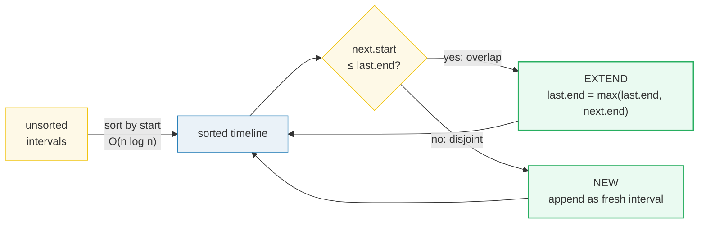

# Merge Intervals — Merge, Insert, Meeting Rooms II — A Visual, Worked-Example Guide

> **Companion code:** [`merge_intervals.py`](./merge_intervals.py). **Every
> number in this guide is printed by `python3 merge_intervals.py`** — change the
> code, re-run, re-paste. Nothing here is hand-computed.
>
> **Live animation:** [`merge_intervals.html`](./merge_intervals.html) — open in
> a browser, watch intervals sort, merge step-by-step, and the sweep-line peak
> climb the timeline.
>
> **Source material:** LeetCode P056 / P057 / P253; CLRS exercises; the
> sweep-line technique traces to Bentley–Ottmann (1979).

---

## 0. TL;DR — the one idea

### Read this first — clean up a messy calendar

You have a calendar full of overlapping meetings. The meetings arrive in **any
order**. To clean them up, you do **one thing first**:

> **SORT the meetings by their start time.**

After sorting, the rest is mechanical. Walk left to right. If the next meeting
starts **before or exactly when** the last one ends, they **OVERLAP** — extend
the last meeting's end. If not, they are **DISJOINT** — start a new entry.

Sorting unlocks a **transitivity** property: if sorted intervals A and B don't
overlap, and B and C don't overlap, then A and C **cannot** overlap either. So
you only ever compare each interval with the **previous** one — never look
further back. A single O(n) scan after an O(n log n) sort gives the answer.



| | value | why |
|---|---|---|
| universal step 1 | **sort by `start`** | enables single-pass greedy scan |
| overlap test (closed) | `next.start <= last.end` | touching = overlap |
| merge rule | `last.end = max(last.end, next.end)` | **`max` mandatory** — handles nesting |
| total cost | **O(n log n)** time, O(n) space | sort dominates |
| exception | P057 Insert is **O(n)** | input already sorted — no sort needed |

---

### Pattern Recognition Signals

| Signal in the problem statement | → Use this variant |
|---|---|
| "intervals", "ranges", `[start, end]` pairs | ✓ merge intervals |
| "merge overlapping", "combine", "union of ranges" | ✓ P056 Merge |
| "insert a new interval", "add and merge" | ✓ P057 Insert |
| "meeting rooms", "minimum resources", "max concurrency" | ✓ P253 sweep-line |
| "calendar", "schedule", "conflict", "free slots" | ✓ interval family |
| "maximum non-overlapping subset" | ✗ different problem — sort by **end** |

### The Template Skeleton (three variants)

```python
# --- Variant 1: Merge Overlapping Intervals (P056) -----------------------
def merge(intervals):
    if not intervals: return []
    intervals.sort(key=lambda x: x[0])          # universal step 1
    merged = [intervals[0][:]]
    for start, end in intervals[1:]:
        last = merged[-1]
        if start <= last[1]:                    # overlap (closed: <=)
            last[1] = max(last[1], end)         # extend (max handles nesting)
        else:
            merged.append([start, end])         # disjoint -> new
    return merged

# --- Variant 2: Insert Interval (P057), already sorted -------------------
def insert(intervals, new):
    res, i, n = [], 0, len(intervals)
    while i < n and intervals[i][1] <  new[0]: res.append(intervals[i]); i+=1  # before
    while i < n and intervals[i][0] <= new[1]:                                 # overlap
        new[0] = min(new[0], intervals[i][0]); new[1] = max(new[1], intervals[i][1]); i+=1
    res.append(new)                                                            # the merged
    while i < n:                               res.append(intervals[i]); i+=1  # after
    return res

# --- Variant 3: Minimum Meeting Rooms (P253), sweep-line -----------------
def min_meeting_rooms(intervals):
    events = []
    for s, e in intervals:
        events.append((s, +1)); events.append((e, -1))
    events.sort(key=lambda x: (x[0], x[1]))     # tie-break: END before START
    rooms = peak = 0
    for _, d in events:
        rooms += d; peak = max(peak, rooms)
    return peak
```

---

## 1. P056 Merge Intervals — sort + extend the last end

> **Problem:** given a collection of intervals, merge all overlapping ones.
> **Key insight:** after sorting by start, each interval need only be compared
> with the last merged one — transitivity of non-overlap.
>
> From `merge_intervals.py` Section B.

Worked on `[[1, 3], [2, 6], [8, 10], [15, 18]]` (already sorted in this example):

```
 i         cur     last before    action      last after
 0      [1, 3]               -      seed          [1, 3]
 1      [2, 6]          [1, 3]    extend          [1, 6]
 2     [8, 10]          [1, 6]       new         [8, 10]
 3    [15, 18]         [8, 10]       new        [15, 18]

Merged result: [[1, 6], [8, 10], [15, 18]]
```

- **i=1** is the overlap: `[2,6]` starts at 2 ≤ last end 3 → **EXTEND**, end
  becomes `max(3, 6) = 6`. Now `[1,6]`.
- **i=2** & **i=3**: disjoint (`8 > 6`, `15 > 10`) → **NEW** entries.

```mermaid
gantt
    title P056 merge trace — [1,3],[2,6],[8,10],[15,18]
    dateFormat X
    axisFormat %s
    section raw
    [1,3]   :0, 1, 3
    [2,6]   :0, 2, 6
    [8,10]  :0, 8, 10
    [15,18] :0, 15, 18
    section merged
    [1,6]   :done, 1, 1, 6
    [8,10]  :done, 2, 8, 10
    [15,18] :done, 3, 15, 18
```



### Gotcha spotlight — nested intervals need `max`, not assign

> From `merge_intervals.py` Section B (nested edge case).

```
Input  : [[1, 10], [2, 3], [4, 5]]   (two intervals nested inside [1,10])
Merged : [[1, 10]]   <- [2,3] and [4,5] are swallowed; the end stays 10
```

`[1,10] + [2,3]` must stay `[1,10]`. A naive `last.end = next.end` would
**truncate** to `[1,3]`. `max(last.end, next.end)` is mandatory — it keeps the
longer end whenever the new interval is fully swallowed.

---

## 2. P057 Insert Interval — three-phase scan (no sort)

> **Problem:** insert `newInterval` into an already-sorted, non-overlapping list,
> merging if necessary.
> **Key insight:** the input is pre-sorted, so the whole thing is **O(n)** —
> three linear phases in one pass, no sort step.
>
> From `merge_intervals.py` Section C.

Worked on `intervals = [[1, 3], [6, 9]]`, `new = [2, 5]`:

```
  phase  before: add (nothing)              | new so far = [2, 5]
  phase overlap: add [1, 5]                 | new so far = [1, 5]
  phase   after: add [6, 9]                 | new so far = [1, 5]

Absorbed into new during phase 2: [[1, 3]]
Result: [[1, 5], [6, 9]]
```

| phase | loop guard | action |
|---|---|---|
| **1. before** | `intervals[i].end < new.start` | copy verbatim |
| **2. overlap** | `intervals[i].start <= new.end` | absorb: `min` start, `max` end |
| **3. after** | the rest | copy verbatim |

**The phase boundary is the crux:** phase 1 uses strict `<` (intervals ending
strictly before `new.start` are untouched); phase 2 uses `<=` (intervals whose
start is `≤ new.end` overlap and get absorbed). The transition from `<` to `<=`
is what makes touching intervals merge correctly.

### Big-overlap boundary case

> From `merge_intervals.py` Section C.

```
Input [[1, 2], [3, 5], [6, 7], [8, 10], [12, 16]]
new   [4, 8]
Absorbed: [[3, 5], [6, 7], [8, 10]]  -> new becomes [3, 10]
Result  : [[1, 2], [3, 10], [12, 16]]
```

Three intervals get swallowed into one `[3, 10]`; the untouched `[1,2]` (before)
and `[12,16]` (after) pass through verbatim.

---

## 3. P253 Meeting Rooms II — sweep-line peak / two-pointer

> **Problem:** find the minimum number of conference rooms required so no two
> meetings overlap in the same room.
> **Key insight:** peak concurrency = answer. Convert each `[s,e]` to two sweep
> events `(s, +1)` and `(e, -1)`; sort by time; the peak of the running count is
> the minimum rooms.
>
> From `merge_intervals.py` Section D.

Worked on `[[0, 30], [5, 10], [15, 20]]`:

```
Sorted events: [(0, +1), (5, +1), (10, -1), (15, +1), (20, -1), (30, -1)]

 time   delta   running   peak
    0      +1         1      1
    5      +1         2      2     <- peak! two meetings concurrent
   10      -1         1      2
   15      +1         2      2     <- concurrent again, but peak already 2
   20      -1         1      2
   30      -1         0      2

Peak running count = 2  ->  need 2 room(s).
```

The 0–30 meeting runs **concurrently with both** shorter meetings → 2 rooms
needed (never 3, because the two short meetings don't overlap each other).

```mermaid
gantt
    title P253 meeting rooms — peak concurrency = 2
    dateFormat X
    axisFormat %s
    section meetings
    M1 [0,30]  :active, 0, 0, 30
    M2 [5,10]  :active, 1, 5, 10
    M3 [15,20] :active, 2, 15, 20
```



### Two-pointer equivalent (no event list)

> From `merge_intervals.py` Section D.

Sort starts and ends separately. For each start, if `start >= ends[ptr]`, a room
freed up (advance `ptr`); else need a new room.

```
  starts = [0, 5, 15]
  ends   = [10, 20, 30]
  start=  0  >= ends[0]=10?  need new room
  start=  5  >= ends[0]=10?  need new room
  start= 15  >= ends[1]=20?  free a room
  two-pointer answer = 2
```

### Gotcha spotlight — the tie-break encodes the boundary convention

> From `merge_intervals.py` Section D.

At the **same timestamp**, sort **END `(-1)` before START `(+1)`** — that way a
room recycles first, so back-to-back meetings `[1,2],[2,3]` share one room. Get
this backwards and you over-count rooms by 1.

```
[[7,10],[2,4]]          -> 1 room (disjoint in time)
[[0,30],[5,10],[15,20]] -> 2 rooms (the 0-30 meeting runs concurrently with both)
```

---

## 4. Complexity — sort dominates, scan is linear

> From `merge_intervals.py` Section E.

All three variants share the same shape: an **O(n log n) sort** followed by an
**O(n) scan**. The sort dominates.

| variant | sort? | time | space | notes |
|---|---|---|---|---|
| merge (P056) | yes | O(n log n) | O(n) | output list |
| insert (P057) | **NO** | **O(n)** | O(n) | input already sorted |
| rooms (P253) | yes | O(n log n) | O(n) | events or 2 sorted arrays |

### The boundary convention table — #1 source of off-by-one bugs

| convention | overlap test | example `[1,2]` & `[2,3]` |
|---|---|---|
| closed `[s,e]` | `next.start <= end` | **OVERLAP** (share point 2) |
| half-open `[s,e)` | `next.start < end` | disjoint (room recycles) |

- **P056 Merge** uses **CLOSED** (`<=`).
- **P253 Meeting Rooms II** treats the boundary as a **FREE** point:
  `start >= ends[ptr]` recycles a room, so back-to-back `[1,2],[2,3]` need only
  **1** room. The sweep-line tie-break (`-1` before `+1`) encodes this directly.

---

## Killer Gotchas

- **Nested intervals → use `max(last.end, end)`, never `last.end = end`.**
  `[1,10] + [2,3]` must stay `[1,10]`; naive assign truncates to `[1,3]`.
- **Sort defensively** even if the input looks sorted — the spec rarely
  guarantees it (P057 Insert is the explicit exception).
- **Tie-break in the sweep line:** at the same timestamp, **END before START**,
  or you over-count rooms by 1 for back-to-back meetings.
- **Scheduling-max (max non-overlapping subset)** sorts by **END**, not start —
  a different problem, easy to confuse with merge. "Minimum intervals to remove"
  is the same scheduling-max in disguise.

---

## Problem Table

| Problem | Difficulty | Essence | Key Trick |
|---|---|---|---|
| **P056** Merge Intervals | Medium | Sort by start; extend `last.end` on overlap | `max(last.end, end)` handles nesting; `<=` catches touching |
| **P057** Insert Interval | Medium | Three-phase linear scan (before / overlap / after) | Phase boundary: strict `<` then inclusive `<=`; **O(n), no sort** |
| **P253** Meeting Rooms II | Medium | Split into sorted starts + ends; count starts without a free room | `start >= ends[ptr]` (≥, not >) recycles room; sweep-line tie-break |
| P435 Non-overlapping Intervals | Medium | Min removals = n − (max non-overlapping subset) | Sort by **END** (earliest-finish-first greedy) — not start |
| P452 Minimum Arrows | Medium | Min points hitting all intervals | Same as scheduling-max: sort by end, greedy place point at end |
| P495 Teemo Attacking | Easy | Sum `min(duration, gap)` for consecutive pairs | Always `+duration` at end for last attack's full window |

---

## Appendix — GOLD (pinned values, verified by `merge_intervals.py` and recomputed live in `merge_intervals.html`)

```
merge  input   = [[1, 3], [2, 6], [8, 10], [15, 18]]
merge  result  = [[1, 6], [8, 10], [15, 18]]
insert input   = [[1, 3], [6, 9]], new = [2, 5]
insert result  = [[1, 5], [6, 9]]
rooms  input   = [[0, 30], [5, 10], [15, 20]]
rooms  events  = [(0, +1), (5, +1), (10, -1), (15, +1), (20, -1), (30, -1)]
rooms  peak    = 2
rooms  timeline= [(0,1), (5,2), (10,1), (15,2), (20,1), (30,0)]
```

Open [`merge_intervals.html`](./merge_intervals.html) — the page rebuilds the
identical merge / insert / sweep-line traces in JS and shows the green
`[check: OK]` badge confirming it matches the `.py` GOLD exactly.
