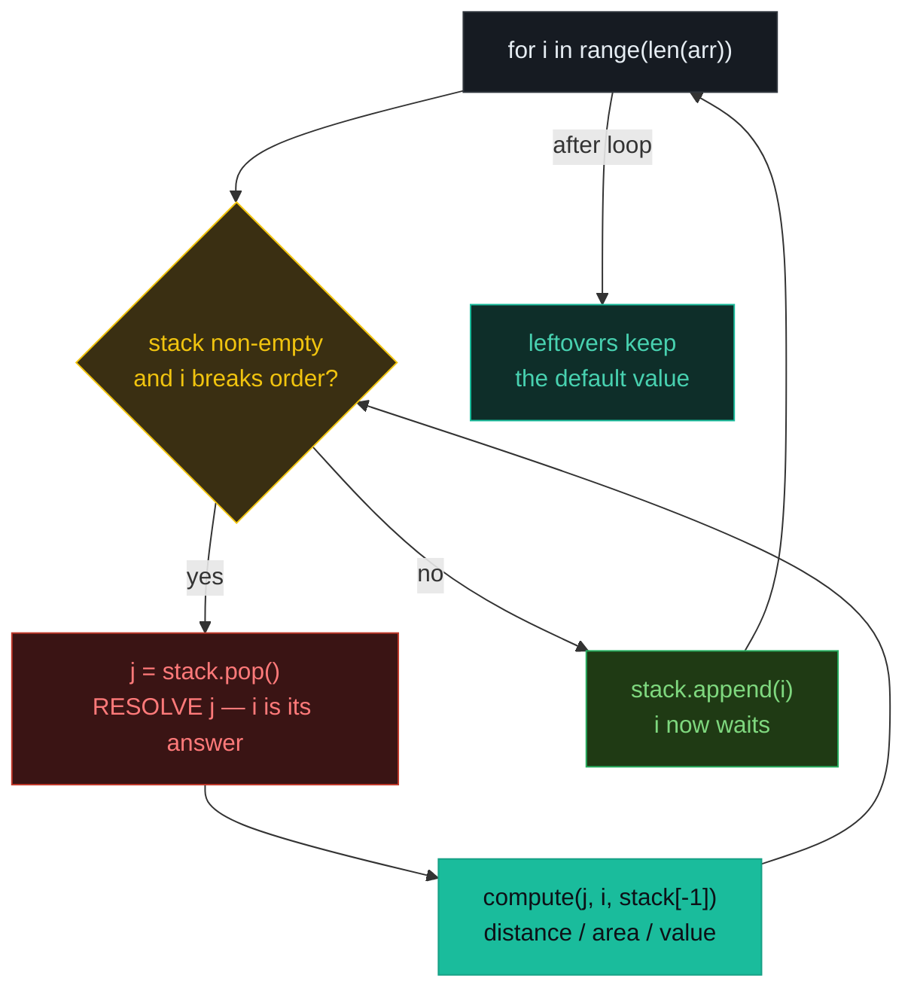
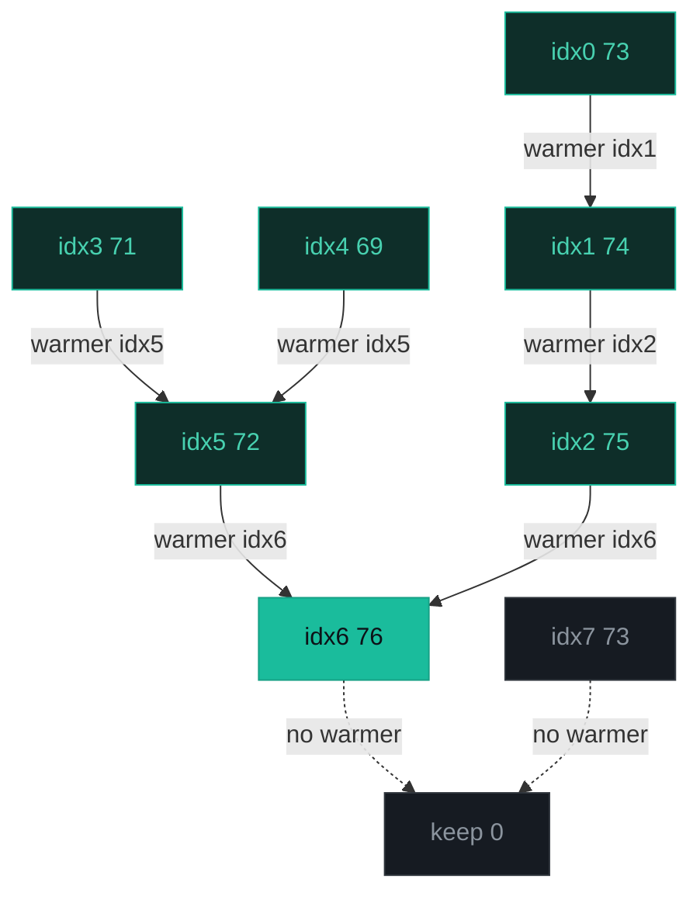
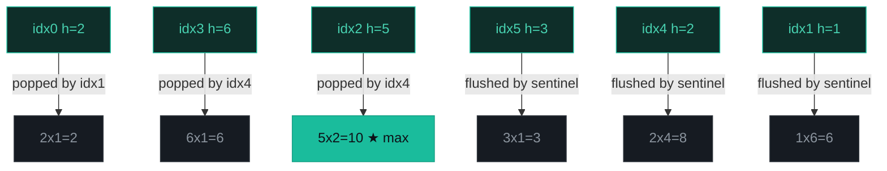
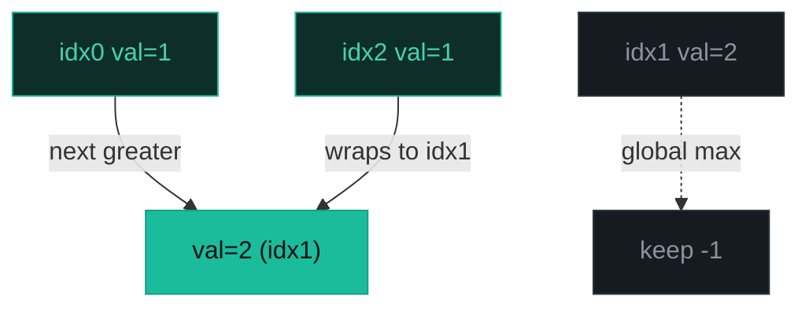

# Monotonic Stack — Daily Temperatures, Largest Rectangle, Next Greater II — A Visual, Worked-Example Guide

> **Companion code:** [`monotonic_stack.py`](./monotonic_stack.py). **Every number is printed by
> `python3 monotonic_stack.py`** — nothing is hand-computed.
>
> **Live animation:** [`monotonic_stack.html`](./monotonic_stack.html) — open in a browser, step the stack push/pop yourself.

---

## 0. TL;DR — the one idea

> **The analogy (read this first):** A monotonic stack is a line of people *waiting* for a taller friend. A newcomer scans the line and, for every shorter person standing there, says "I'm the taller person you were waiting for" — those people leave (their question *resolved*), and the newcomer joins the end of the line. Because each person joins exactly once and leaves at most once, the whole thing costs O(n) even though there's a `while` loop inside.
>
> The whole pattern is a single loop body:
> ```
> for each element i (left to right):
>     while stack non-empty and i BREAKS the monotonic order:
>         j = stack.pop()        # RESOLVE j  — i is its answer
>         compute(j, i, top)     # distance / area / next-greater
>     stack.append(i)            # i now waits for ITS answer
> ```
> Every problem below differs in only **what the answer is** (a gap, an area, a value) and **which order** the stack keeps (ascending → next greater, descending → next smaller).



**Why O(n) and not O(n²)?** Each index is pushed exactly *once* and popped at most *once*, so total stack operations ≤ 2n regardless of the inner `while`. This is the amortized argument interviewers love.

```mermaid
graph LR
    subgraph INV["the two invariants that make it work"]
        A["ASCENDING stack<br/>values rise to the top<br/>pop when incoming > top<br/>-> next GREATER"] --> P739["P739 Daily Temps<br/>P503 Next Greater II"]
        B["store INDICES not values<br/>position is NOT recoverable<br/>from a value alone"] --> P739
        B --> P084["P084 Largest Rectangle"]
        C["SENTINEL height 0<br/>flushes the stack at the end<br/>-> no forgotten post-loop pass"] --> P084
    end
    style A fill:#0e2e29,stroke:#1abc9c,color:#48d1b0
    style B fill:#0e2e29,stroke:#1abc9c,color:#48d1b0
    style C fill:#0e2e29,stroke:#1abc9c,color:#48d1b0
    style P739 fill:#1abc9c,stroke:#16a085,color:#0d1117
    style P084 fill:#1abc9c,stroke:#16a085,color:#0d1117
    style INV fill:#0d1117,stroke:#30363d
```



---

### Pattern Recognition Signals

| Signal in the problem statement | → Use this pattern |
|---|---|
| "next **greater** / **smaller** element" for each position | ✓ ascending/descending monotonic stack |
| "how many days until a **warmer** day" / distance to next better | ✓ store indices, `ans[j] = i - j` on pop (P739) |
| "**largest rectangle** / maximum area" in a histogram | ✓ ascending stack + sentinel 0 (P084) |
| "**circular** next greater" / wrap around the array | ✓ loop `2n`, push only on pass 1 (P503) |
| "for **each** element find the nearest ... to the left/right" | ✓ monotonic stack (one or two passes) |
| brute force is O(n²) nested loops + interviewer says "can you do better?" | ✓ monotonic stack → O(n) |
| "max/min in **every sliding window** of size k" | ✗ use a monotonic **deque** (two-end eviction), not a stack |
| "are these **connected?**" / redundant edge / same set | ✗ use **union-find** |
| "find all pairs arr[i] > arr[j], i < j" | ✗ that is **inversion count** (merge sort / Fenwick tree) |

---

### The Template Skeleton

```python
# The universal monotonic-stack loop — memorize the while + append pair.

def monotonic(arr):
    ans = [default] * len(arr)
    st  = []                       # store INDICES, not values
    for i in range(len(arr)):
        while st and arr[i] violates_order(arr[st[-1]]):
            j = st.pop()           # RESOLVE j -> i is its answer
            ans[j] = ... i, j, st[-1] ...
        st.append(i)
    return ans                      # leftovers keep the default


# ---- 1. NEXT-GREATER DISTANCE (P739) — ascending stack, gap on pop ----
def daily_temperatures(temperatures):
    n = len(temperatures)
    answer = [0] * n
    stack = []                      # indices with strictly decreasing temps
    for i in range(n):
        while stack and temperatures[i] > temperatures[stack[-1]]:
            j = stack.pop()
            answer[j] = i - j       # RESOLVE: the gap IS the answer
        stack.append(i)
    return answer
# O(n) amortized, O(n) space


# ---- 2. LARGEST RECTANGLE (P084) — ascending stack + sentinel 0 ----
def largest_rectangle(heights):
    h = heights + [0]               # SENTINEL flushes the stack at the end
    stack = []
    max_area = 0
    for i in range(len(h)):
        while stack and h[i] < h[stack[-1]]:
            top = stack.pop()
            height = h[top]
            width = i if not stack else i - stack[-1] - 1   # NOT i - top
            max_area = max(max_area, height * width)
        stack.append(i)
    return max_area
# O(n) amortized, O(n) space


# ---- 3. CIRCULAR NEXT-GREATER (P503) — loop 2n, push only on pass 1 ----
def next_greater_circular(nums):
    n = len(nums)
    answer = [-1] * n
    stack = []
    for i in range(2 * n):
        idx = i % n
        while stack and nums[idx] > nums[stack[-1]]:
            answer[stack.pop()] = nums[idx]   # RESOLVE to the VALUE
        if i < n:                             # PUSH only on pass 1
            stack.append(idx)
    return answer
# O(n) amortized, O(n) space
```

---

## 1. P739 Daily Temperatures

> **Problem:** Given daily temperatures, for each day find how many days you must wait for a warmer day (0 if none).
> **Key insight:** An ascending (strictly-decreasing-by-value) stack of **indices** holds days still waiting. The instant day `i` is warmer than the index on top, that top index is *resolved* and the gap `i - j` is its answer.

### Worked example — `[73, 74, 75, 71, 69, 72, 76, 73]` → `[1, 1, 4, 2, 1, 1, 0, 0]`

> From `monotonic_stack.py` Section A. `temperatures = [73, 74, 75, 71, 69, 72, 76, 73]`. The stack trace (`[+]` push, `[*]` resolve/pop):

```
[+] push idx 0 (73)   stack(by val)=[73]
[*] pop idx 0 (73)  ->  warmer day 1 (74), gap 1   ans[0]=1
[+] push idx 1 (74)   stack(by val)=[74]
[*] pop idx 1 (74)  ->  warmer day 2 (75), gap 1   ans[1]=1
[+] push idx 2 (75)   stack(by val)=[75]
[+] push idx 3 (71)   stack(by val)=[75, 71]
[+] push idx 4 (69)   stack(by val)=[75, 71, 69]
[*] pop idx 4 (69)  ->  warmer day 5 (72), gap 1   ans[4]=1
[*] pop idx 3 (71)  ->  warmer day 5 (72), gap 2   ans[3]=2
[+] push idx 5 (72)   stack(by val)=[75, 72]
[*] pop idx 5 (72)  ->  warmer day 6 (76), gap 1   ans[5]=1
[*] pop idx 2 (75)  ->  warmer day 6 (76), gap 4   ans[2]=4
[+] push idx 6 (76)   stack(by val)=[76]
[+] push idx 7 (73)   stack(by val)=[76, 73]
[=] leftovers [6, 7] have no warmer day  ->  keep default 0
```

> Stats: **8 pushes, 6 pops, 2 leftovers.** Total ops `14 ≤ 2×8` → amortized O(n). Indices `6` and `7` (76 and 73) never find a warmer day, so they keep the default `0`.

`daily_temperatures([73, 74, 75, 71, 69, 72, 76, 73]) -> [1, 1, 4, 2, 1, 1, 0, 0]`



**Edge cases** (from `monotonic_stack.py` Section A): `[30,40,50,60] → [1,1,1,0]` (strictly rising, last day never warmer); `[30,60,90] → [1,1,0]`; `[90,60,30] → [0,0,0]` (strictly falling fills the whole stack, nothing is ever resolved).

---

## 2. P084 Largest Rectangle in Histogram

> **Problem:** Given bar heights (each width 1), return the area of the largest rectangle.
> **Key insight:** An ascending stack holds bars still able to extend rightward. When bar `i` is *shorter* than the bar on top, the top bar's rectangle cannot extend past `i`, so we *resolve* it: height is fixed, **width = `i - stack[-1] - 1`** (the left boundary is the bar *below* it still on the stack, *not* `i - top`). A **sentinel** height 0 flushes everything at the end.

### Worked example — `[2, 1, 5, 6, 2, 3]` → `10`

> From `monotonic_stack.py` Section B. Each `[*]` row computes one candidate area; the sentinel `[0]` forces the final flush.

```
[+] push idx 0 (h=2)   stack=[0]
[*] pop idx 0 (h=2)  ->  width=1 (stack empty .. right 1)  area 2x1=2   *** new max ***
[+] push idx 1 (h=1)   stack=[1]
[+] push idx 2 (h=5)   stack=[1, 2]
[+] push idx 3 (h=6)   stack=[1, 2, 3]
[*] pop idx 3 (h=6)  ->  width=1 (left boundary idx 2 .. right 4)  area 6x1=6   *** new max ***
[*] pop idx 2 (h=5)  ->  width=2 (left boundary idx 1 .. right 4)  area 5x2=10   *** new max ***
[+] push idx 4 (h=2)   stack=[1, 4]
[+] push idx 5 (h=3)   stack=[1, 4, 5]
[*] pop idx 5 (h=3)  ->  width=1 (left boundary idx 4 .. right 6)  area 3x1=3
[*] pop idx 4 (h=2)  ->  width=4 (left boundary idx 1 .. right 6)  area 2x4=8
[*] pop idx 1 (h=1)  ->  width=6 (stack empty .. right 6)  area 1x6=6
[0] sentinel h=0 appended  ->  forces a final stack flush
[=] max area = 10   (bar idx 2 h=5 x w=2)
```

> The winner is bar `idx 2` (height 5): width `4 - 1 - 1 = 2` spans indices 2,3 → area `5 × 2 = 10`. The sentinel at index 6 flushes the three leftover bars (idx 5, 4, 1) in one pass.

`largest_rectangle([2, 1, 5, 6, 2, 3]) -> 10`



**Edge cases** (from `monotonic_stack.py` Section B): `[2,4] → 4`; `[2,1,2] → 3` (short bar h=1 spans all three); `[1,2,3,4,5] → 9` — strictly rising, so **zero pops happen during the loop**; the sentinel flushes everything at the end (max = 3×3 = 9). *This is exactly why the sentinel is mandatory.*

---

## 3. P503 Next Greater Element II

> **Problem:** For each element, find the next greater element treating the array as **circular** (−1 if none).
> **Key insight:** Loop `2n` times with `idx = i % n` to simulate one wrap-around. **Push only when `i < n`** (pass 1) so each index enters the stack at most once; the second pass only *pops*, resolving leftovers via the values it re-visits.

### Worked example — `[1, 2, 1]` → `[2, -1, 2]`

> From `monotonic_stack.py` Section C. Pass 1 (indices 0–2) pushes; pass 2 (re-visits 0,1,2) resolves without re-pushing.

```
[+] pass 1, push idx 0 (val 1)   stack=[0]
[*] pass 1, visit idx 1 (val 2)  ->  pop idx 0, next greater = 2   ans[0]=2
[+] pass 1, push idx 1 (val 2)   stack=[1]
[+] pass 1, push idx 2 (val 1)   stack=[1, 2]
[.] pass 2, re-visit idx 0 (val 1)  -- NO push (already stacked once)
[*] pass 2, visit idx 1 (val 2)  ->  pop idx 2, next greater = 2   ans[2]=2
[.] pass 2, re-visit idx 1 (val 2)  -- NO push (already stacked once)
[.] pass 2, re-visit idx 2 (val 1)  -- NO push (already stacked once)
[=] leftovers keep -1  ->  ans = [2, -1, 2]
```

> Index 1 (value 2) is the global maximum — nothing in the circle is greater, so it keeps the default −1. Index 2 (value 1) wraps around and finds value 2 at index 1.

`next_greater_circular([1, 2, 1]) -> [2, -1, 2]`



**Edge cases** (from `monotonic_stack.py` Section C): `[1,2,3,4,3] → [2,3,4,-1,4]` (4 is the global max → −1); `[5,4,3,2,1] → [-1,5,5,5,5]` (descending: pass 1 fills the stack, pass 2 wraps the 5 to the front to resolve everything); `[1] → [-1]`.

---

### Complexity

> From `monotonic_stack.py` Section D.

| Operation | Time | Space |
|---|---|---|
| Daily Temperatures, next greater | O(n) amort. | O(n) |
| Largest Rectangle + sentinel | O(n) amort. | O(n) |
| Next Greater II (circular) | O(n) amort. | O(n) |
| Previous / next smaller | O(n) amort. | O(n) |
| Sliding window max (monotonic deque) | O(n) amort. | O(k) |

*Amortized O(n):* each index is pushed **once** and popped **at most once**, so total stack operations ≤ 2n regardless of the inner `while` loop.

### Killer Gotchas

1. **Store indices, not values.** A value stack cannot compute a distance (`i - j`) or a rectangle width. Values are always recoverable as `arr[idx]`; position is *not*. This is the #1 candidate mistake.
2. **Rectangle width is `i - stack[-1] - 1`** (the bar *below* the popped one still on the stack), **not** `i - top`. The left boundary is defined by the element that *remains* beneath it on the stack.
3. **The sentinel.** For histogram/rectangle problems always append a height 0 so the stack is fully flushed at the end. Without it, a strictly rising input like `[1,2,3,4,5]` never pops in the loop and you miss every area (max = 9, not 5).
4. **Circular = push only on pass 1.** Loop `2n` with `idx = i % n`, but append only when `i < n`. Pushing twice double-counts and breaks the once-per-index invariant that guarantees O(n).
5. **Ascending vs descending.** An *ascending* stack (values rise to the top) pops when incoming > top → next **greater**. A *descending* stack pops when incoming < top → next **smaller**. Reversing the sign silently answers the wrong question.
6. **Strict vs non-strict** (`<` vs `<=`). For distances/next-greater use strict (equal values are independent). For subarray-contribution de-duplication use one pass strict and the other inclusive to avoid double-counting equal elements.

### Problem Table

> From `monotonic_stack.py` Section D.

| Problem | Essence | Key Trick |
|---|---|---|
| P739 Daily Temperatures | Days until warmer | decreasing-by-value stack of INDICES; `ans[j] = i - j` on pop |
| P084 Largest Rectangle | Max rectangle in histogram | ascending stack + sentinel 0; `width = i - st[-1] - 1` |
| P503 Next Greater II | Circular next greater | loop `2n`, `idx = i % n`; push only when `i < n` |
| P496 Next Greater I | Next greater in a subsequence | hashmap the subsequence + monotonic stack |
| P901 Online Stock Span | Consecutive days ≤ today | stack of (price, span); accumulate spans on pop |
| P907 Sum of Subarray Mins | Subarray-minimum contribution | two passes (left `<` and right `≤`); `val × left_gap × right_gap` |
| P042 Trapping Rain Water | Water trapped between bars | monotonic stack OR two pointers; pop & add horizontal layers |
| P456 132 Pattern | subseq `a[i] < a[k] < a[j]` | scan backwards; stack tracks the max `2`, `third` the `3` |
| P853 Car Fleet | Number of fleets reaching target | sort position desc; count times `time > slowest_time` |
