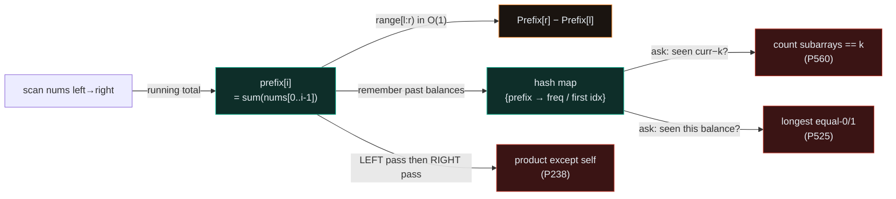
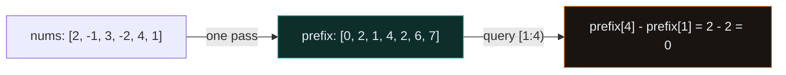
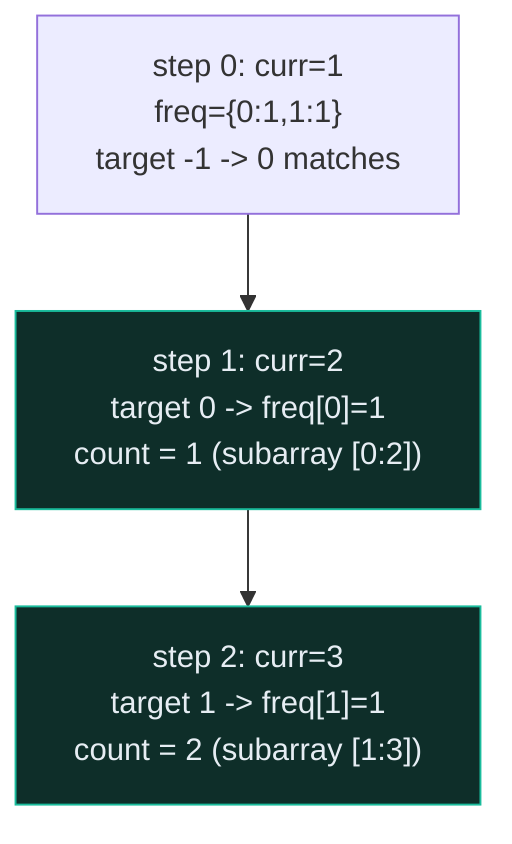
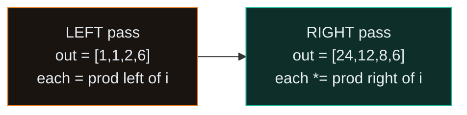
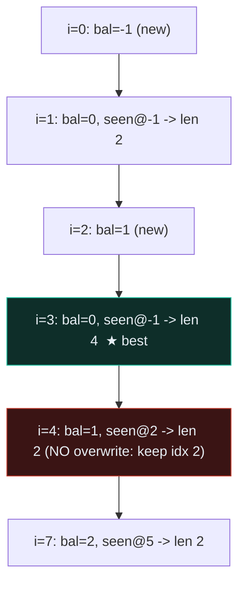

# Prefix Sum — Subarray Sum K, Product Except Self, Contiguous Array — A Visual, Worked-Example Guide

> **Companion code:** [`prefix_sum.py`](./prefix_sum.py). **Every number is printed by
> `python3 prefix_sum.py`** — nothing is hand-computed.
>
> **Live animation:** [`prefix_sum.html`](./prefix_sum.html) — open in a browser, build the cumulative array cell-by-cell, watch the prefix-frequency map grow, and step the left/right product passes yourself. The logic here is *identical* to `prefix_sum.py`.

---

## 0. TL;DR — the one idea

> **The analogy (read this first):** A prefix sum is a **running bank balance**. If the balance in January was \$100 and in March it is \$500, you made \$400 across Feb–Mar **without re-reading every receipt**. Save a running total **once**; then answer any *"how much in `[i..j]`?"* with **one subtraction**: `Sum(i..j) = Prefix[j+1] − Prefix[i]`. Add a hash map that remembers **past balances**, and every *"contiguous subarray"* question collapses from O(n²) to O(n).



The hash map is the part that changes shape per problem:

```mermaid
graph TD
    subgraph V1["Variant 1 — range sum"]
        P1["prefix[0..n]<br/>prefix[0]=0"] -->|"prefix[r]−prefix[l]"| Q1["O(1) range query"]
    end
    subgraph V2["Variant 2 — count subarrays == k  (P560)"]
        P2["running curr_sum"] --> F2["freq: {prefix → count}<br/>init {0:1}"]
        F2 -->|"count += freq[curr−k]"| C2["# of subarrays"]
    end
    subgraph V3["Variant 3 — product except self  (P238)"]
        L3["LEFT pass:<br/>out[i] = prod left of i"] --> R3["RIGHT pass:<br/>out[i] *= prod right of i"]
    end
    subgraph V4["Variant 2' — longest equal-0/1  (P525)"]
        P4["balance = count1−count0<br/>(0 → −1)"] --> F4["first: {balance → earliest idx}<br/>init {0:−1}"]
        F4 -->|"len = i − first[balance]"| C4["longest, never overwrite"]
    end
    style P1 fill:#0e2e29,stroke:#1abc9c,color:#e6edf3
    style F2 fill:#0e2e29,stroke:#1abc9c,color:#e6edf3
    style L3 fill:#1a1410,stroke:#e67e22,color:#e6edf3
    style F4 fill:#0e2e29,stroke:#1abc9c,color:#e6edf3
    style Q1 fill:#3a1414,stroke:#c0392b,color:#e6edf3
    style C2 fill:#3a1414,stroke:#c0392b,color:#e6edf3
    style R3 fill:#3a1414,stroke:#c0392b,color:#e6edf3
    style C4 fill:#3a1414,stroke:#c0392b,color:#e6edf3
```



The recognition trick: **P525 is Variant 2 in disguise** — same prefix-sum + hash machinery, but you store the *earliest index* per balance (to **maximize** length) instead of a *count* (to count subarrays), and you map `0 → −1` so "equal counts" becomes "balance repeats".

---

### Pattern Recognition Signals

| Signal in the problem statement | → Use this pattern |
|---|---|
| "sum of a subarray", "range sum", "cumulative sum" | ✓ **Variant 1** prefix array |
| **"subarray sum equals K"**, "count subarrays with sum" | ✓ **Variant 2** prefix + freq map (P560) |
| **"product of array except self"**, "without division" | ✓ **Variant 3** left/right pass (P238) |
| **"contiguous array with equal # of 0 and 1"** | ✓ **balance + first-seen** (P525) |
| "longest subarray with sum/product == K" | ✓ prefix + first-seen map |
| "number of subarrays" with a contiguous property | ✓ prefix + freq map |
| "range sum query" with point updates | ✗ → Fenwick / Segment Tree |

---

### The Template Skeleton (3 variants)

```python
# The interview starting points — memorize all three shapes.

# --- Variant 1: prefix sum array + O(1) range sum ----------------------
def prefix_sum_array(nums):
    prefix = [0] * (len(nums) + 1)
    for i, v in enumerate(nums):
        prefix[i + 1] = prefix[i] + v      # prefix[i] = sum(nums[0..i-1])
    return prefix
def range_sum(prefix, l, r):               # half-open [l, r)
    return prefix[r] - prefix[l]

# --- Variant 2: prefix sum + hash map (P560 Subarray Sum Equals K) -----
def subarray_sum_equals_k(nums, k):
    freq = {0: 1}                          # BASE CASE: one empty prefix
    curr = count = 0
    for x in nums:
        curr += x
        count += freq.get(curr - k, 0)     # each earlier prefix == curr-k closes a subarray
        freq[curr] = freq.get(curr, 0) + 1 # ACCUMULATE (counting, not overwrite)
    return count

# --- Variant 3: prefix product, left/right pass (P238 Product Except Self) ---
def product_except_self(nums):
    n = len(nums)
    out = [1] * n
    left = 1
    for i in range(n):                     # LEFT: out[i] = prod(nums[0:i])
        out[i] = left                      #  ASSIGN before multiply!
        left *= nums[i]
    right = 1
    for i in range(n - 1, -1, -1):         # RIGHT: out[i] *= prod(nums[i+1:n])
        out[i] *= right
        right *= nums[i]
    return out

# --- Variant 2' (P525 Contiguous Array): same machinery, different map --
def find_max_length_contiguous(nums):
    first = {0: -1}                        # BASE CASE: balance 0 at virtual idx -1
    balance = best = 0
    for i, x in enumerate(nums):
        balance += 1 if x == 1 else -1     # 0 → −1, so equal-count ⇔ balance repeats
        if balance in first:
            best = max(best, i - first[balance])   # NEVER overwrite (want LONGEST)
        else:
            first[balance] = i
    return best
```

---

## 1. Variant 1 — Prefix array + O(1) range queries

> **Problem:** Preprocess an array so the sum of any contiguous range is answered in **O(1)**.
> **Key insight:** Store `prefix[i] = sum(nums[0..i−1])` with `prefix[0] = 0` (length `n+1`). Then `sum(nums[l:r]) = prefix[r] − prefix[l]` — one subtraction. Handles negatives fine; a sliding window does **not**.

### Worked example — `nums = [2, −1, 3, −2, 4, 1]`

> From `prefix_sum.py` Section B.

**Build trace:**

| i | nums[i] | prefix[i+1] = prefix[i] + nums[i] |
|---|---|---|
| – | – | `prefix[0] = 0` |
| 0 | 2 | `prefix[1] = 0 + 2 = 2` |
| 1 | −1 | `prefix[2] = 2 + (−1) = 1` |
| 2 | 3 | `prefix[3] = 1 + 3 = 4` |
| 3 | −2 | `prefix[4] = 4 + (−2) = 2` |
| 4 | 4 | `prefix[5] = 2 + 4 = 6` |
| 5 | 1 | `prefix[6] = 6 + 1 = 7` |

So `prefix = [0, 2, 1, 4, 2, 6, 7]`.

**Range queries (half-open `[l:r)`):**

| query | computation | result |
|---|---|---|
| `[0:6)` | `prefix[6] − prefix[0] = 7 − 0` | **7** (whole array) |
| `[1:4)` | `prefix[4] − prefix[1] = 2 − 2` | **0** (`[−1,3,−2]`) |
| `[2:5)` | `prefix[5] − prefix[2] = 6 − 1` | **5** (`[3,−2,4]`) |
| `[3:3)` | `prefix[3] − prefix[3] = 4 − 4` | **0** (empty range) |
| `[4:6)` | `prefix[6] − prefix[4] = 7 − 2` | **5** (`[4,1]`) |

```
answers     = [7, 0, 5, 0, 5]
expected    = [7, 0, 5, 0, 5]
match: True
```



---

## 2. P560 Subarray Sum Equals K (Medium)

> **Problem:** Given `nums` and `k`, return the **number** of contiguous subarrays whose sum equals `k`.
> **Key insight:** `sum(i..j) = prefix[j] − prefix[i−1] = k` rearranges to `prefix[i−1] = prefix[j] − k`. Scan once; at each `j` add `freq[curr − k]` — every earlier prefix equal to `curr − k` closes a valid subarray ending here. **Base case `freq = {0: 1}`** captures subarrays starting at index 0. O(n) time, O(n) space.

### Worked example — `nums = [1, 1, 1]`, `k = 2`

> From `prefix_sum.py` Section C.

| step | num | curr | target = curr−k | matched | count | freq (after) |
|---|---|---|---|---|---|---|
| −1 | – | 0 | – | 0 | 0 | `{0:1}` |
| 0 | 1 | 1 | −1 | 0 | 0 | `{0:1, 1:1}` |
| 1 | 1 | 2 | 0 | 1 | 1 | `{0:1, 1:1, 2:1}` |
| 2 | 1 | 3 | 1 | 1 | 2 | `{0:1, 1:1, 2:1, 3:1}` |

**Read the two matches:** at step 1, `curr=2` and `freq[2−2]=freq[0]=1` → subarray `[0:2]` = `[1,1]`. At step 2, `curr=3` and `freq[3−2]=freq[1]=1` → subarray `[1:3]` = `[1,1]`. Answer **2**.

```
subarray_sum_equals_k([1, 1, 1], 2) = 2
LeetCode example 1 expected            = 2
match: True
```



**The base case `{0:1}` is essential.** Drop it and you silently miss every subarray that starts at index 0:

> From `prefix_sum.py` Section C.
```
  with freq = {0:1}  -> 2
  with freq = {}  (no base case) -> 1   (WRONG: misses [0:2] which starts at index 0)
```

**Second example:** `nums = [1, 2, 3]`, `k = 3` → **2** (subarrays `[1,2]` and `[3]`); match: True.

---

## 3. P238 Product of Array Except Self (Medium)

> **Problem:** Return `out` where `out[i]` is the product of all elements except `nums[i]`, **without division**, in O(n).
> **Key insight:** `out[i] = (product of everything left of i) × (product of everything right of i)`. A **LEFT pass** stores the left product; a **RIGHT pass** multiplies in the right product. **Crucial: assign `out[i] = running` BEFORE multiplying `nums[i]` into `running`**, or `nums[i]` leaks into its own answer. O(1) extra space (the output array doesn't count).

### Worked example — `nums = [1, 2, 3, 4]`

> From `prefix_sum.py` Section D.

**LEFT pass** (`out[i] = product of nums[0:i]`):

| i | nums[i] | out[i] = left | then left × = nums[i] |
|---|---|---|---|
| 0 | 1 | out[0] = 1 | left → 1 |
| 1 | 2 | out[1] = 1 | left → 2 |
| 2 | 3 | out[2] = 2 | left → 6 |
| 3 | 4 | out[3] = 6 | left → 24 |

`out` after LEFT = `[1, 1, 2, 6]`.

**RIGHT pass** (`out[i] *= product of nums[i+1:n]`):

| i | nums[i] | out[i] × = right | then right × = nums[i] |
|---|---|---|---|
| 3 | 4 | out[3] × = 1 → 6 | right → 4 |
| 2 | 3 | out[2] × = 4 → 8 | right → 12 |
| 1 | 2 | out[1] × = 12 → 12 | right → 24 |
| 0 | 1 | out[0] × = 24 → 24 | right → 24 |

`out` after RIGHT = `[24, 12, 8, 6]`.

```
product_except_self([1, 2, 3, 4]) = [24, 12, 8, 6]
LeetCode example 1 expected       = [24, 12, 8, 6]
match: True
```



**Second example (contains a zero):** `nums = [-1, 1, 0, -3, 3]` → `[0, 0, 9, 0, 0]`; match: True. Only index 2 (the zero) has a non-zero answer = `(-1)(1)(-3)(3) = 9`.

---

## 4. P525 Contiguous Array (Medium)

> **Problem:** Given a binary array, return the **maximum length** of a contiguous subarray with **equal number of 0 and 1**.
> **Key insight:** Treat `0` as `−1`, so `balance = count(1) − count(0)`. A subarray has equal counts **iff the balance is the same at both endpoints**. Store only the **first** index each balance appears (we maximize length, so **never overwrite**). Base case `first = {0: −1}` captures subarrays that begin at index 0. This is **Variant 2 with a different map** (earliest index instead of count).

### Worked example — `nums = [0, 1, 1, 0, 1, 1, 1, 0]`

> From `prefix_sum.py` Section E.

| i | num | balance | seen? | length | best | first (after) |
|---|---|---|---|---|---|---|
| −1 | – | 0 | – | – | 0 | `{0:−1}` |
| 0 | 0 | −1 | no (new) | – | 0 | `{−1:0, 0:−1}` |
| 1 | 1 | 0 | yes @ −1 | 2 | **2** | (no overwrite) |
| 2 | 1 | 1 | no (new) | – | 2 | `…, 1:2` |
| 3 | 0 | 0 | yes @ −1 | 4 | **4** | (no overwrite) |
| 4 | 1 | 1 | yes @ 2 | 2 | 4 | (no overwrite) |
| 5 | 1 | 2 | no (new) | – | 4 | `…, 2:5` |
| 6 | 1 | 3 | no (new) | – | 4 | `…, 3:6` |
| 7 | 0 | 2 | yes @ 5 | 2 | 4 | (no overwrite) |

**Read the winner:** at `i=3` the balance returns to **0**, last seen at the base case index **−1**, so `length = 3 − (−1) = 4` → subarray `[0,1,1,0]` (indices 0..3) has two 0s and two 1s. Answer **4**.

```
find_max_length_contiguous([0, 1, 1, 0, 1, 1, 1, 0]) = 4   (subarray [0,1,1,0]); match: True
```



**The "never overwrite" gotcha:** balance `1` first appears at `i=2` and reappears at `i=4`. Keeping the *earliest* index gives `length = 4 − 2 = 2`; overwriting with `i=4` would give `length = 0` and silently shrink your answer. Second example: `nums = [0, 1]` → **2**; match: True.

---

### Complexity

> From `prefix_sum.py` Section E. All four variants are a **single** O(n) pass (hash ops are O(1) amortized).

| Variant | Build | Query | Space |
|---|---|---|---|
| 1. prefix array + range sum | O(n) | **O(1)** | O(n) |
| 2. prefix + hash (sum == k) | O(n) | – | O(n) |
| 3. prefix product (L/R pass) | O(n) | – | **O(1) extra** |
| 4. balance + first-seen | O(n) | – | O(n) |

### Killer Gotchas

1. **The missing empty prefix.** For *counting*, init `freq = {0: 1}`; for *longest-by-index*, init `first = {0: −1}`. Without it, **every** valid subarray that starts at index 0 is silently dropped (see the P560 base-case demo above).
2. **Overwrite vs accumulate.** For *counting* use `freq[curr] += 1` (every occurrence is a distinct subarray end). For *longest* use `if balance not in first` so you keep the **earliest** index only. Mixing the two is the #1 silent-wrong-answer.
3. **Assign before multiply** (Product Except Self). `out[i] = running;` **then** `running *= nums[i]`. Reverse the order and `nums[i]` divides its own answer (you include the element you must exclude).
4. **Half-open indexing.** `prefix` has length `n+1`; `range[l:r) = prefix[r] − prefix[l]`. The whole-array sum is `prefix[n] − prefix[0]`. Test the full-array and empty-range cases by hand.
5. **Negatives are fine** for prefix sums and freq maps; but a sliding window is **not** (it relies on monotone sums). With negatives reach for prefix-sum + hash, never a two-pointer window.
6. **`0 → −1` is the trick for "equal count of two values":** any pair `(a, b)` works by mapping `a → +1`, `b → −1`; equal-count ⇔ the running balance repeats.

### Problem Table

> From `prefix_sum.py` Section E.

| Problem | Diff | Key Trick |
|---|---|---|
| P560 Subarray Sum Equals K | Medium | prefix freq map; `count += freq[curr−k]`; init `freq={0:1}` |
| P238 Product Except Self | Medium | LEFT pass then RIGHT pass; assign **before** multiply; O(1) extra; no division |
| P525 Contiguous Array | Medium | `0→−1` balance, first-seen map; `first={0:−1}`; never overwrite |
| P303 Range Sum Query | Easy | immutable prefix array; `sum[l:r]=prefix[r]−prefix[l]` |
| P523 Continuous Subarray Sum | Medium | prefix **mod k**, first-seen map; gap ≥ 2; never overwrite |
| P713 Subarray Product < K | Medium | sliding window (**NOT prefix!**); `k ≤ 1 → 0`; `count += r−l+1` |
| P528 Random Pick with Weight | Medium | prefix sums + binary search; `randint(1,total)`; first prefix ≥ t |
