# Randomized / Rejection Sampling — Rand10 from Rand7, Random Flip Matrix — A Visual, Worked-Example Guide

> **Companion code:** [`randomized.py`](./randomized.py). **Every number is printed by
> `python3 randomized.py`** — nothing is hand-computed.
>
> **Live animation:** [`randomized.html`](./randomized.html) — open in a browser, roll the grid and watch the deck shrink yourself.

---

## 0. TL;DR — the one idea

> **The analogy (read this first):** Randomized problems ask you to **convert** one uniform distribution into another, or to **pick items without replacement**. It is like dealing cards: you never *delete* the drawn card (that is slow) — you **swap it with the bottom card and pretend the deck got smaller**. And when you need a different-sided "die" than the one you have, you **roll the grid**.
>
> Two flavors cover the canonical interview set:
> 1. **Rejection sampling** — to build `randX()` from `randY()`, call `randY()` **twice** to tile a uniform `Y×Y` grid (`idx = (row−1)·Y + col` gives `1..Y²`, each cell probability `1/Y²`). Accept the largest region whose size is a **multiple of X** (`40 = 4·10` for `rand10`), and **reject the overhang** (cells `41..49`), re-rolling. Acceptance = `40/49 ≈ 0.816`.
> 2. **Virtual Fisher-Yates** — to sample without replacement from a structure too big to materialize (`m·n ≤ 10⁸`), store **only the swaps** in a dictionary. Reading index `k` returns `mapping.get(k, k)`; after drawing `r`, write `mapping[r] = value-of-last`, then shrink `total`. `O(1)` per draw, `O(k)` space.

```mermaid
graph LR
    subgraph FLAVORS["two randomized flavors"]
        A["rejection sampling<br/>2D grid Y x Y<br/>accept the multiple-of-X region"] -->|uniform 1..X| P470["P470<br/>Rand7 -> Rand10"]
        B["virtual Fisher-Yates<br/>dict stores only swaps<br/>get(k, k) + shrink"] -->|sample without replacement| P519["P519<br/>Random Flip Matrix"]
    end
    style A fill:#0e2e29,stroke:#1abc9c,color:#48d1b0
    style B fill:#0e2e29,stroke:#1abc9c,color:#48d1b0
    style P470 fill:#1abc9c,stroke:#16a085,color:#0d1117
    style P519 fill:#1abc9c,stroke:#16a085,color:#0d1117
    style FLAVORS fill:#0d1117,stroke:#30363d
```



The whole pattern is "stay uniform, don't materialize":

```python
# 1. P470: roll a uniform 1..49 grid, accept up to 40 (a multiple of 10)
def rand10():
    while True:
        row, col = rand7(), rand7()
        idx = (row - 1) * 7 + col        # uniform 1..49
        if idx <= 40:
            return (idx - 1) % 10 + 1    # uniform 1..10
        # else reject 41..49, re-roll

# 2. P519: virtual Fisher-Yates -- dict remembers only the swaps
def flip(self):
    r = randint(0, self.total - 1)
    res = self.mapping.get(r, r)
    last = self.total - 1
    self.mapping[r] = self.mapping.get(last, last)
    if last != r:                       # guard: don't erase the entry you just wrote
        self.mapping.pop(last, None)
    self.total -= 1
    return [res // n, res % n]
```

---

### Pattern Recognition Signals

| Signal in the problem statement | → Use this pattern |
|---|---|
| "Implement `randX()` using `randY()`" / "given a uniform RNG, build another" | ✓ rejection sampling, 2D grid `(row−1)·Y + col`, accept the multiple-of-X region (P470) |
| "uniform random integer in `[1, X]`" built only from a `[1, Y]` generator | ✓ grid formula + rejection of the overhang |
| "random point **in / inside** a circle / non-rectangular region" | ✓ rejection sampling on the bounding box (sibling: P478) |
| "pick a random **zero-cell** / flip a cell" without replacement | ✓ virtual Fisher-Yates, dict of swaps (P519) |
| "at most `k` calls total" over a **massive** `m×n` grid (`m·n` huge) | ✓ never materialize the array — `mapping.get(k, k)` |
| "uniformly random" / "equal probability" over a stream of unknown length | ✓ reservoir sampling, keep item `i` with prob `k/i` |
| "weighted random pick" by a `w[]` array | ✗ use **prefix sums + binary search** (P528), not rejection |
| Shuffle a *whole* array in place | ✗ real **Fisher-Yates** (swap with last), `O(n)` — no dict needed |
| Subarray sum / range product | ✗ use **prefix sum** |

---

### The Template Skeleton

```python
# The interview starting point — memorize this. Two flavors, one mindset.

# ---- 1. P470 Rejection Sampling: rand10 from rand7 ----
def rand10():
    while True:
        row, col = rand7(), rand7()       # two calls tile a 7x7 uniform grid
        idx = (row - 1) * 7 + col         # uniform 1..49
        if idx <= 40:                     # 40 = 4*10  (largest multiple of 10 <= 49)
            return (idx - 1) % 10 + 1     # uniform 1..10
        # reject 41..49 (the overhang), loop to re-roll
# O(1) expected (~49/40 = 1.225 proposals, 2 rand7 each), O(1) space


# ---- 2. P519 Virtual Fisher-Yates: sample without replacement ----
class Solution:
    def __init__(self, m, n):
        self.m, self.n = m, n
        self.total = m * n                # logical "live" deck size
        self.mapping = {}                 # stores ONLY the swaps

    def flip(self):
        r = randint(0, self.total - 1)
        res = self.mapping.get(r, r)      # value actually at position r
        last = self.total - 1
        self.mapping[r] = self.mapping.get(last, last)   # swap drawn <-> last
        if last != r:                     # guard the r==last edge case
            self.mapping.pop(last, None)
        self.total -= 1
        return [res // self.n, res % self.n]   # decode 1D -> (row, col)

    def reset(self):
        self.total = self.m * self.n
        self.mapping = {}
# O(1) per flip, O(k) space (k = flips so far), O(1) reset
```

---

## 1. P470 Implement Rand10() Using Rand7

> **Problem:** Given `rand7()` returning a uniform integer in `[1, 7]`, implement `rand10()` returning a uniform integer in `[1, 10]`, calling **only** `rand7()`.
> **Key insight:** Two `rand7()` calls tile a uniform `7×7 = 49`-cell grid — `idx = (row−1)·7 + col` is uniform in `1..49` (each cell has probability `1/49`). To get uniform `1..10` you must accept a region whose size is a **multiple of 10**: the largest such inside 49 is `40 = 4·10`, where each value `1..10` appears **exactly 4 times**. Reject the 9-cell overhang `41..49` and re-roll. Acceptance = `40/49`.

### The trap — never add two rolls

```mermaid
graph TB
    subgraph RIGHT["correct: the 2D grid"]
        R1["row = rand7()<br/>col = rand7()"] --> R2["idx = (row-1)*7 + col<br/>uniform 1..49"]
        R2 --> R3{"idx <= 40?"}
        R3 -->|yes| R4["return (idx-1)%10 + 1<br/>each value appears exactly 4x"]
        R3 -->|no, overhang| R1
    end
    subgraph WRONG["wrong: triangular sum"]
        W1["s = rand7() + rand7()"] --> W2["s in 2..14<br/>peaks at 8 (7+1..7+7)"]
        W2 --> W3["s%10 is BIASED<br/>toward the middle"]
    end
    style R1 fill:#0e2e29,stroke:#1abc9c,color:#48d1b0
    style R4 fill:#1abc9c,stroke:#16a085,color:#0d1117
    style W1 fill:#3a1414,stroke:#c0392b,color:#ff7a7a
    style W3 fill:#3a1414,stroke:#c0392b,color:#ff7a7a
    style RIGHT fill:#0d1117,stroke:#27ae60
    style WRONG fill:#0d1117,stroke:#c0392b
```



`(rand7() + rand7()) % 10` is a **triangular** sum: it peaks at the middle (`8`) because more `(a,b)` pairs sum to `8` than to `2`. The 2D grid formula `(row−1)·7 + col` is uniform because each `(row, col)` pair has probability exactly `1/49`.

### The full grid — accept `≤ 40`, reject `41..49`

> From `randomized.py` Section A. `idx = (row−1)·7 + col`. Cells marked `*` are the rejected overhang.

| row \ col | 1 | 2 | 3 | 4 | 5 | 6 | 7 |
|---|---|---|---|---|---|---|---|
| **1** | 1 | 2 | 3 | 4 | 5 | 6 | 7 |
| **2** | 8 | 9 | 10 | 11 | 12 | 13 | 14 |
| **3** | 15 | 16 | 17 | 18 | 19 | 20 | 21 |
| **4** | 22 | 23 | 24 | 25 | 26 | 27 | 28 |
| **5** | 29 | 30 | 31 | 32 | 33 | 34 | 35 |
| **6** | 36 | 37 | 38 | 39 | **40** | 41\* | 42\* |
| **7** | 43\* | 44\* | 45\* | 46\* | 47\* | 48\* | 49\* |

### Why 40? — each value `1..10` appears exactly 4 times

> From `randomized.py` Section A. The accept zone `1..40` maps via `(idx−1)%10+1`.

| value | cells in accept zone | bar |
|---|---|---|
| 1 | 4 | `####` |
| 2 | 4 | `####` |
| 3 | 4 | `####` |
| 4 | 4 | `####` |
| 5 | 4 | `####` |
| 6 | 4 | `####` |
| 7 | 4 | `####` |
| 8 | 4 | `####` |
| 9 | 4 | `####` |
| 10 | 4 | `####` |

Total accepted cells = `40 = 4·10`. That is exactly why the cutoff **must** be a multiple of 10 — accept up to `42` and values `1, 2` would appear `5` times while `3..10` appear `4` times (biased).

### Worked example — first 12 grid proposals (seed 42)

> From `randomized.py` Section A. `seed=42`, deterministic LCG (reproduced byte-for-byte in `randomized.html`).

| proposal | rand7 row | rand7 col | idx | decision |
|---|---|---|---|---|
| 1 | 2 | 1 | 8 | **ACCEPT → Rand10 = 8** |
| 2 | 5 | 2 | 30 | **ACCEPT → Rand10 = 10** |
| 3 | 3 | 1 | 15 | **ACCEPT → Rand10 = 5** |
| 4 | 4 | 1 | 22 | **ACCEPT → Rand10 = 2** |
| 5 | 7 | 7 | 49 | reject (overhang), re-roll |
| 6 | 6 | 4 | 39 | **ACCEPT → Rand10 = 9** |
| 7 | 5 | 7 | 35 | **ACCEPT → Rand10 = 5** |
| 8 | 5 | 1 | 29 | **ACCEPT → Rand10 = 9** |
| 9 | 1 | 7 | 7 | **ACCEPT → Rand10 = 7** |
| 10 | 7 | 7 | 49 | reject (overhang), re-roll |
| 11 | 4 | 2 | 23 | **ACCEPT → Rand10 = 3** |
| 12 | 4 | 2 | 23 | **ACCEPT → Rand10 = 3** |

Proposals 5 and 10 land in the overhang (`49`) and are re-rolled — 2 rejections in 12 proposals.

### Empirical acceptance — 100 000 proposals

> From `randomized.py` Section A. `seed=42`.

- accepted = **81659 / 100000 = 0.8166**
- theory = 40/49 = **0.8163**
- relative error = **0.03%**

Value distribution among accepted (should be `1/10` each): all ten values land within `9.70%`–`10.27%` — rejection sampling is unbiased. Each `rand10()` costs `2·(49/40) ≈ 2.45` `rand7()` calls in expectation.

---

## 2. P519 Random Flip Matrix

> **Problem:** You have an `m × n` binary matrix, all zeros. `flip()` chooses a uniform random 0-cell, flips it to 1, and returns `[row, col]`. `reset()` reverts all cells back to 0. Up to 1000 total calls; `m, n` up to `10⁴` (so `m·n` up to `10⁸`).
> **Key insight:** A real Fisher-Yates shuffle swaps the drawn card with the **last** card, then shrinks the deck by one — `O(1)` per draw. But you cannot build a `10⁸` array. The trick: store **only the swaps** in a dictionary. Reading index `k` returns `mapping.get(k, k)`; after drawing `r`, write `mapping[r] = value-of-last`, guard the `r==last` case, and decrement `total`.

### The idea — never materialize the deck

```mermaid
graph LR
    D0["deck 0..5<br/>(logical, never built)"] -->|draw r=1| D1["res = mapping.get(1,1) = 1<br/>swap: mapping[1] = last(5)<br/>total -> 5"]
    D1 -->|draw r=0| D2["res = mapping.get(0,0) = 0<br/>swap: mapping[0] = last(4)<br/>total -> 4"]
    D2 -->|draw r=2| D3["res = mapping.get(2,2) = 2<br/>swap: mapping[2] = last(3)<br/>total -> 3"]
    D3 -->|draw r=0| D4["res = mapping.get(0,0) = 4<br/>(0 was swapped!)<br/>total -> 2"]
    style D0 fill:#0e2e29,stroke:#1abc9c,color:#48d1b0
    style D1 fill:#0e2e29,stroke:#1abc9c,color:#48d1b0
    style D2 fill:#0e2e29,stroke:#1abc9c,color:#48d1b0
    style D3 fill:#0e2e29,stroke:#1abc9c,color:#48d1b0
    style D4 fill:#1abc9c,stroke:#16a085,color:#0d1117
```



`mapping.get(k, k)` is the whole magic: a position you never touched reads as `k`, but a position whose card was *swapped away* reads the last live card's value instead. The dict stays tiny — at most one entry per draw.

### Worked example — `m=2, n=3` (6 cells), 4 flips (seed 42)

> From `randomized.py` Section B. `seed=42`, same LCG as the grid.

| step | total | r | res | last | last_val | swap? | → (row, col) |
|---|---|---|---|---|---|---|---|
| 1 | 6 | 1 | 1 | 5 | 5 | yes | → `[0, 1]` |
| 2 | 5 | 0 | 0 | 4 | 4 | yes | → `[0, 0]` |
| 3 | 4 | 2 | 2 | 3 | 3 | yes | → `[0, 2]` |
| 4 | 3 | 0 | 4 | 2 | 3 | yes | → `[1, 1]` |

Notice step 4: `r = 0`, but `mapping.get(0, 0)` returns `4` — position `0` was **swapped away** in step 2 (mapped to `4`). The mapping dict after each step (only swaps are stored):

| after flip | total | mapping |
|---|---|---|
| 1 | 5 | `{1: 5}` |
| 2 | 4 | `{1: 5, 0: 4}` |
| 3 | 3 | `{1: 5, 0: 4, 2: 3}` |
| 4 | 2 | `{1: 5, 0: 3}` |

Step 4 also shows the **dict cleanup**: drawing `r=0` and writing `mapping[0] = last_val(3)`, the old `mapping[2]` (value `3`) is removed because `last=2`. The dict never exceeds `k` entries.

### The `r == last` erasure bug

When the random index `r` equals `total−1` (the last live cell), the swap `mapping[r] = last_val` would record `mapping[last] = last` (a no-op value). If you then **blindly** `del mapping[last]` you delete the entry you just wrote, so a *future* read of `r` returns `r` again → a **duplicate** draw. The guard `if last != r: del mapping[last]` prevents this.

### Full exhaustion — `m=3, n=3` (9 cells), all 9 flips (seed 42)

> From `randomized.py` Section B.

flip order `(row, col)`: `(0,2) → (0,0) → (1,1) → (0,1) → (1,2) → (2,1) → (2,0) → (1,0) → (2,2)` — `unique cells drawn = 9 / 9` (**all distinct OK**). Exhausting the deck never duplicates, proving the swap is correct.

### `reset()` restores the deck

> From `randomized.py` Section B. `m=2, n=2`: `flip → [0, 0]`, `flip → [0, 1]`, `reset → total=4, mapping={}`. Total back to `m·n`, mapping cleared.

---

## 3. Extensions (briefly)

- **P384 Shuffle an Array** — **real** Fisher-Yates: for `i` from `n−1` down to `1`, swap `arr[i]` with `arr[randint(0, i)]`. `O(n)`, in place, no dict (the array fits in memory).
- **P382 Linked List Random Node** — **reservoir sampling** with `k=1`: keep node `i` (1-indexed) with probability `1/i` via `randint(1, i) == 1`. `O(n)` time, `O(1)` space — no need to know the length up front.
- **P398 Random Pick Index** — reservoir `k=1` over only the indices whose value equals the target.
- **P528 Random Pick with Weight** — **prefix sums + binary search**: build cumulative `w`, draw `randint(1, total)`, `bisect_left` the prefix array. Not rejection sampling.
- **P497 Random Point in Non-overlapping Rectangles** — weighted rectangle pick via prefix areas + `bisect`, then uniform point inside the chosen rectangle.

---

### Complexity

> From `randomized.py` Section C.

| Problem | Time | Space |
|---|---|---|
| P470 Rand10 from Rand7 (rejection) | `O(1)` expected | `O(1)` |
| P519 Random Flip Matrix (virtual FY) | `O(1)` per flip | `O(k)` (k = flips so far) |
| Real Fisher-Yates shuffle | `O(n)` | `O(n)` |
| Reservoir sampling (stream, k items) | `O(n)` | `O(k)` |

*Each `rand10()` costs `2·(49/40) ≈ 2.45` `rand7()` calls in expectation (acceptance `40/49`). `reset()` is `O(1)`.*

### Killer Gotchas

1. **Never add two rolls.** `(rand7() + rand7()) % 10` is a **triangular** sum heavily biased toward the middle (`7+7` neighbors are most likely). Always use the 2D grid formula `(row−1)·Y + col`, which is uniform because each `(row, col)` pair has probability `1/Y²`.
2. **The cutoff must be a multiple of the target.** For Rand7→Rand10 the cutoff is `40 = 4·10`, **not** `42` or `49`. Accepting up to `42` makes values `1, 2` appear `5/42` while `3..10` appear `4/42`. The cutoff is the **largest multiple of the target that is `≤ Y·Y`**.
3. **The `r == last` erasure bug.** In virtual Fisher-Yates, deleting `mapping[last]` unconditionally erases the swap you just wrote when `r` happens to equal `last`, causing a duplicate draw. Always guard with `if last != r: del mapping[last]`.
4. **Decode 1D→2D with columns, not rows.** `row = x // n`, `col = x % n` where `n` = number of **columns** (row-major, stride `n`). Using rows for the modulo scrambles the mapping.
5. **Seed for reproducibility.** Judges re-instantiate your object; a fixed seed makes traces reproducible (and lets the `.html` match the `.py` byte-for-byte). On LeetCode use the system random.
6. **Acceptance vs iterations.** Rejection sampling is **Las Vegas**: it always returns the right answer, only the *runtime* is random. Expected iterations = `1/acceptance = 49/40 ≈ 1.225` here.

### Problem Table

> From `randomized.py` Section C.

| Problem | Essence | Key Trick |
|---|---|---|
| P470 Rand10() Using Rand7 | Build a uniform `1..10` from `rand7()` | `7×7` grid → `1..49`; accept `≤40` (mult of 10); `(idx−1)%10+1`; reject overhang |
| P519 Random Flip Matrix | Sample a zero-cell uniformly without replacement | Virtual Fisher-Yates; dict swap-with-last; `mapping.get(k, k)`; `r==last` guard; `row=x//n, col=x%n` |
| P384 Shuffle an Array | Uniform random permutation | Real Fisher-Yates: `swap(arr[i], arr[randint(0,i)])` from the top down |
| P382 Linked List Random Node | Uniform node from unknown-length list | Reservoir `k=1`: keep node `i` w.p. `1/i` via `randint(1, i) == 1` |
| P398 Random Pick Index | Uniform index of a given value | Reservoir `k=1` over only the matching indices |
| P528 Random Pick with Weight | Pick index `i` with probability `w[i]/Σw` | Prefix sums + `bisect_left` on `randint(1, total)` |
| P497 Random Point in Rectangles | Uniform point over union of rectangles | Weighted rect pick (prefix areas + `bisect`), then uniform point inside |
