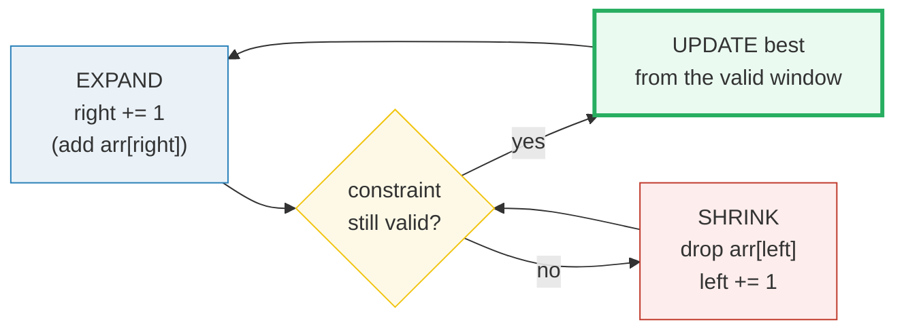
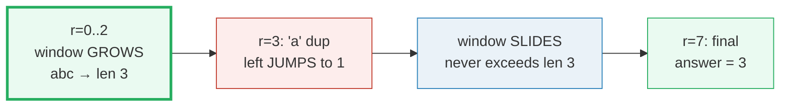
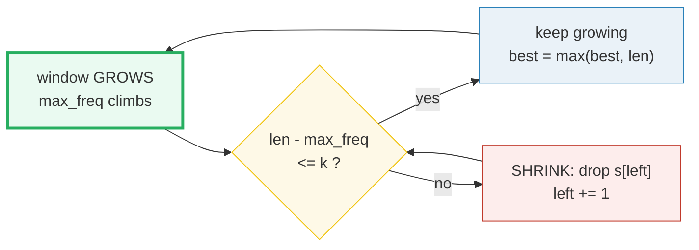

# Sliding Window — Longest Substring, Char Replacement, Anagrams — A Visual, Worked-Example Guide

> **Companion code:** [`sliding_window.py`](./sliding_window.py). **Every number
> below is printed by `python3 sliding_window.py`** — nothing is hand-computed.
> Paste tables verbatim from [`sliding_window_output.txt`](./sliding_window_output.txt).
>
> **Live animation:** [`sliding_window.html`](./sliding_window.html) — open in a
> browser, step the window, watch the frequency map and the validity check
> update live. The JS recomputes the identical answers and is gold-checked
> against this file.

[check: OK] — `sliding_window.html` recomputes all three answers in JS on the
same inputs and matches `sliding_window.py` Section E
(`P003=3`, `P424=5`, `P438=[0,6]`, fixed-window-maxes `[3,3,5,5,6,7]`).

---

## 0. TL;DR — the one idea

> **The analogy (read this first):** Picture a **box** of fixed width sitting on
> a conveyor belt of items. As the belt advances one step, **one new item enters
> the box on the right and one old item leaves on the left**. You never re-scan
> the whole box — you only *add* the entering item and *subtract* the leaving
> item. That incremental update is what turns the brute-force
> `O(n²)` "try every window" into **`O(n)`**.

For variable-size windows the box can also **grow** (right advances freely) and
**shrink** (left catches up when a constraint breaks). The crucial fact: **both
pointers only ever move forward**, so the total work across the whole run is at
most `2n = O(n)`, even though there is a `while` inside the `for`.



The pattern applies **only when all three signals fire together**:

1. The answer is over a **contiguous** run (subarray / substring), not a subsequence.
2. You **optimize** over all possible windows (longest / shortest / count).
3. The constraint is **monotone** — expanding only ever makes the window *more*
   invalid, shrinking only ever *restores* validity.

Drop any of the three and you need a different tool: subsequence → DP;
multi-region validity → binary-search-on-answer; all pairs → two converging
pointers.

---

### Pattern Recognition Signals

| Signal in the problem statement | → Use sliding window |
|---|---|
| "**contiguous** subarray / substring", "**consecutive** elements" | ✓ |
| "longest / shortest / maximum / minimum" over all windows | ✓ |
| "every window of size **k**" (k given explicitly) | ✓ fixed-size |
| "anagram / permutation **within** a string" | ✓ fixed-size + freq match |
| "at most / exactly k distinct / sum / replacements" | ✓ variable shrink |
| constraint gets **worse monotonically** as the window grows | ✓ required |
| "**number of subarrays** with exactly X" (negatives possible) | ✓ → prefix sums |
| non-contiguous subsequence, or "any subset" | ✗ use DP |
| validity has multiple regions (true…false…true) | ✗ binary-search-on-answer |

---

### The Template Skeleton (three variants)

> From `sliding_window.py` Section A. Every problem is one of these three with a
> different `state` and a different `constraint_violated` test.

**Variant 1 — Fixed-size window** (size always exactly `k`; no inner loop):

```python
def template_fixed_window(nums, k):
    from collections import deque
    dq = deque()                          # indices, values monotonically decreasing
    out = []
    for right, val in enumerate(nums):
        while dq and nums[dq[-1]] <= val: # evict smaller; front = window max
            dq.pop()
        dq.append(right)
        while dq[0] <= right - k:         # front fell out the LEFT of window
            dq.popleft()
        if right >= k - 1:                # window full for the first time
            out.append(nums[dq[0]])
    return out
```
The element **leaving** is `arr[right - k]` — **not** `arr[left]` (there is no
`left` to track in a fixed window). A monotonic deque gives the window max in
`O(1)` amortized; a plain running sum suffices when you only need sums.

**Variant 2 — Variable shrink** (find the LONGEST valid window):

```python
def template_variable_shrink(s):
    last = {}                             # window state: char -> last index seen
    left = 0
    best = 0
    for right, ch in enumerate(s):
        if ch in last and last[ch] >= left:   # invariant about to break
            left = last[ch] + 1                  # jump left past the duplicate
        last[ch] = right
        best = max(best, right - left + 1)   # UPDATE *after* the window is valid
    return best
```

**Variant 3 — Exact count via prefix sums** (handles negatives):

```python
def template_exact_count(nums, target):
    seen = {0: 1}                        # prefix_sum -> count of occurrences
    running = 0
    total = 0
    for val in nums:
        running += val
        total += seen.get(running - target, 0)
        seen[running] = seen.get(running, 0) + 1
    return total
```
"Exactly `target`" is **not monotone** when values can be negative, so the
classic shrink fails; instead count prefix sums equal to `(running − target)`.

---

## 1. P003 — Longest Substring Without Repeating Characters (variable shrink)

> **Problem:** length of the longest substring of `s` with all characters distinct.
> **Key insight:** "contiguous" + "longest" + "validity breaks when a duplicate
> enters" → variable shrink. State = dict mapping each char to its last index.

```python
def longest_substring_no_repeat(s):
    last = {}
    left = 0
    best = 0
    for right, ch in enumerate(s):
        if ch in last and last[ch] >= left:
            left = last[ch] + 1           # jump past the duplicate
        last[ch] = right
        best = max(best, right - left + 1)
    return best
```

> **From `sliding_window.py` Section B** — the full trace on `s = "abcabcbb"`.
> `r`=right index, `ch`=entering char; brackets show the live window `[left..right]`.

```
  r   ch  window          len  best   note
 ----------------------------------------------------------------
  0    a  [a]bcabcbb        1     1   
  1    b  [ab]cabcbb        2     2   
  2    c  [abc]abcbb        3     3   
  3    a  a[bca]bcbb        3     3   dup of s[0] in window -> left := 0+1 = 1
  4    b  ab[cab]cbb        3     3   dup of s[1] in window -> left := 1+1 = 2
  5    c  abc[abc]bb        3     3   dup of s[2] in window -> left := 2+1 = 3
  6    b  abcab[cb]b        2     3   dup of s[4] in window -> left := 4+1 = 5
  7    b  abcabcb[b]        1     3   dup of s[6] in window -> left := 6+1 = 7

  -> longest_substring_no_repeat('abcabcbb') = 3
```

The window grows to width 3 (`'abc'`) and then **never grows again** — every
later step just slides that size-3 window along the string. `left` only ever
moves right, so the total work is `≤ 2n = O(n)`.



`[check] P003 answer == 3: OK`

---

## 2. P424 — Longest Repeating Character Replacement (variable + counter)

> **Problem:** longest substring of `s` you can make all-one-letter by changing
> at most `k` characters.
> **Key insight:** the identity
> `window_len − max_freq ≤ k`
> where `max_freq` is the count of the most frequent char **in** the window.
> Shape = variable shrink + a frequency counter.

```python
def character_replacement(s, k):
    freq = {}
    left = 0
    best = 0
    for right, ch in enumerate(s):
        freq[ch] = freq.get(ch, 0) + 1
        while (right - left + 1) - max(freq.values()) > k:   # too many swaps
            freq[s[left]] -= 1
            if freq[s[left]] == 0:
                del freq[s[left]]          # delete zero-count keys (gotcha!)
            left += 1
        best = max(best, right - left + 1)
    return best
```

> **From `sliding_window.py` Section C** — full trace on `s = "AABABBA"`, `k = 2`.
> `maxf` = max frequency in the window; `len − maxf` = swaps needed.

```
  r   ch  window       len  maxf  len-maxf   ok?  note
 ----------------------------------------------------------------------
  0    A  [A]ABABBA      1     1         0    ok  
  1    A  [AA]BABBA      2     2         0    ok  
  2    B  [AAB]ABBA      3     2         1    ok  
  3    A  [AABA]BBA      4     3         1    ok  
  4    B  [AABAB]BA      5     3         2    ok  
  5    B  A[ABABB]A      5     3         2    ok  len-maxf=3 > 2: drop s[0]='A', left:= 1
  6    A  AA[BABBA]      5     3         2    ok  len-maxf=3 > 2: drop s[1]='A', left:= 2

  -> character_replacement('AABABBA', k=2) = 5
```

The window reaches width **5** at `r=4` (`'AABAB'`) and then just slides — each
later invalid step drops one char from the left. The optimal substring is
`'BABBA'` or `'AABAB'`, unified to all-`B` or all-`A` with 2 changes.

**The famous optimization.** `max_freq` never needs to **decrease**. Keep a
running max and never lower it — a stale (too-high) `max_freq` only makes the
validity check **stricter**, which can never *over*-count the answer. Drop the
inner recomputation and the honest shrink, and you get the one-pass
`left += 1` version in `O(n)`.



`[check] P424 answer == 5: OK`

---

## 3. P438 — Find All Anagrams in a String (fixed window + frequency match)

> **Problem:** all start indices in `s` of substrings that are anagrams of `p`.
> **Key insight:** fixed window of size `len(p)`; roll it one step at a time and
> compare the window's frequency map to `freq(p)`. Delete zero-count keys so
> `dict == dict` is meaningful.

```python
def find_anagrams(s, p):
    from collections import Counter
    need = len(p)
    if len(s) < need:
        return []
    target = Counter(p)
    window = Counter(s[:need])
    starts = []
    for left in range(0, len(s) - need + 1):
        right = left + need - 1
        if left > 0:                      # roll the window one step right
            window[s[left - 1]] -= 1
            if window[s[left - 1]] == 0:
                del window[s[left - 1]]   # zero-count keys must go
            window[s[right]] += 1
        if window == target:
            starts.append(left)
    return starts
```

> **From `sliding_window.py` Section D** — full trace on `s = "cbaebabacd"`,
> `p = "abc"` (so `freq(p) = {a:1, b:1, c:1}`).

```
 left  window      freq(window)                match?
 ----------------------------------------------------------
    0  cba         {a:1, b:1, c:1}             YES <- record
    1  bae         {a:1, b:1, e:1}             no
    2  aeb         {a:1, b:1, e:1}             no
    3  eba         {a:1, b:1, e:1}             no
    4  bab         {a:1, b:2}                  no
    5  aba         {a:2, b:1}                  no
    6  bac         {a:1, b:1, c:1}             YES <- record
    7  acd         {a:1, c:1, d:1}             no

  -> find_anagrams('cbaebabacd', 'abc') = [0, 6]
```

Only `left=0` (`'cba'`) and `left=6` (`'bac'`) are rearrangements of `'abc'`.
The fixed window rolls one step per iteration — add `s[right]`, remove
`s[left−1]` — so each comparison is `O(|alphabet|)` work on top of `O(1)`
rolling. Overall `O(|s| · |alphabet|) = O(n)`.

`[check] P438 answer == [0, 6]: OK`

---

## Complexity

| Operation | Time | Space |
|---|---|---|
| Fixed-size window (sum / max via deque) | `O(n)` | `O(k)` |
| Variable shrink (P003, P424) | `O(n)` amortized | `O(min(n, \|alphabet\|))` |
| Exact count via prefix sums | `O(n)` | `O(n)` |
| Fixed-window freq match (P438) | `O(n · \|alphabet\|)` | `O(\|alphabet\|)` |

**Why the inner `while` is still `O(n)`.** The `while constraint_violated` block
sits inside the `for right` loop, which *looks* like `O(n²)`. The resolution is
**amortized analysis**: `left` starts at 0, only ever increases, and can never
exceed `n`, so the inner loop runs at most `n` times **in total** across all
outer iterations — not `n` times per iteration. Formal bound:
`Σ(1 + kᵢ) = n + Σkᵢ ≤ n + n = 2n = O(n)`, where `kᵢ` is how far `left`
advances on iteration `i`. This holds for **any** two-pointer scheme where both
pointers move the same direction and their total movement is bounded by `2n`.

---

### Killer Gotchas

- **Update the answer AFTER the shrink loop, never inside it.** For "longest"
  problems, recording inside the `while` captures intermediate *invalid* states.
  (For "shortest" problems the rule flips: update *while* valid, then shrink.)
- **Fixed-window leaving element is `arr[right − k]`, NOT `arr[left]`.** A fixed
  window has no `left` pointer; confuse the two and you drop the wrong element.
- **Delete zero-count keys in frequency dicts.** `Counter({'a':0, 'b':1})` is
  **not** equal to `Counter({'b':1})`. Actively `del freq[ch]` at 0 so
  `window == target` works (the bug behind many P438 / P567 failures).
- **Stale-pointer jump guard in P003.** When jumping `left` to
  `last[ch] + 1`, only do so if `last[ch] >= left` — otherwise you can jump
  *backwards* to an index before the current window.
- **"Exactly k" needs the atMost trick or prefix sums.** Shrinking past the first
  valid window loses count of *all* valid windows ending later. Use
  `atMost(k) − atMost(k−1)`, or prefix sums when negatives are possible.
- **`max_freq` may be stale but never recomputed-down.** In P424's optimized
  version, keep the running `max_freq` and never lower it on shrink — this is
  *correct* and is exactly what makes the loop one-pass `O(n)`.

---

### Problem Table

> From `DSA_CHEATSHEET.md` §sliding_window and `sliding_window.py` Section E.

| Problem | Shape | Essence / Key Trick |
|---|---|---|
| **P003** Longest Substring No Repeat | variable shrink | `char → last_index`; jump `left = last_index + 1` only if `last_index ≥ left` (stale guard) |
| **P424** Longest Repeating Char Replacement | variable + counter | `freq + max_freq`; valid iff `window_len − max_freq ≤ k`; `max_freq` never decreases |
| **P438** Find All Anagrams | fixed | rolling `Counter` vs `Counter(p)`; **delete zero-count keys** so `==` works |
| P567 Permutation in String | fixed | `list[26]` arrays; roll by `+1`/`−1`; list equality dodges the zero-key issue |
| P209 Min Size Subarray Sum | variable (shortest) | running sum; update answer **inside** the shrink, before shrinking |
| P239 Sliding Window Maximum | fixed | monotonic deque of indices; front = window max; evict from the left by index |
| P76 Minimum Window Substring | variable (shortest) + have/need | `have`/`need` tally avoids scanning the whole freq map each step |
| P992 Subarrays with K Different Integers | exact count | `atMost(k) − atMost(k−1)` — the shrink does not work directly |
| P1004 Max Consecutive Ones III | variable + counter | count of zeros flipped; valid iff `zeros ≤ k` |

---

## Gold values (pinned, reproducible)

```
longest_substring_no_repeat("abcabcbb")   = 3
longest_substring_no_repeat("bbbbb")      = 1
character_replacement("AABABBA", 2)       = 5
find_anagrams("cbaebabacd", "abc")        = [0, 6]
template_fixed_window max-of-each-3       = [3, 3, 5, 5, 6, 7]
[check] all GOLD values reproduce from the implementations:  OK
```

> Next: [`two_pointers.html`](./two_pointers.html) — when both ends move toward
> each other to eliminate regions, vs. sliding window where both move the same
> direction.
