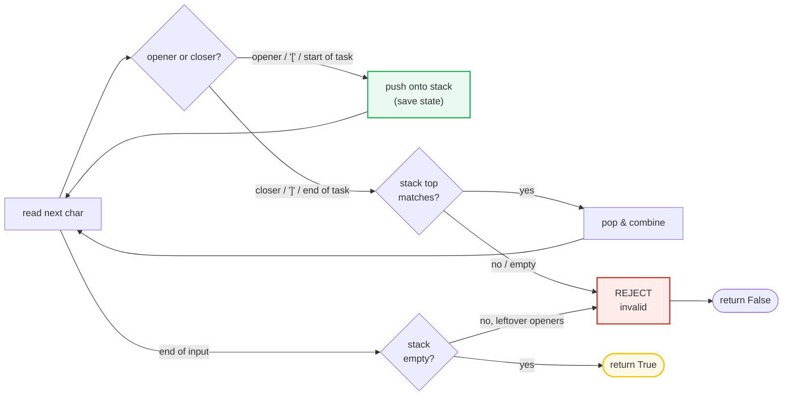
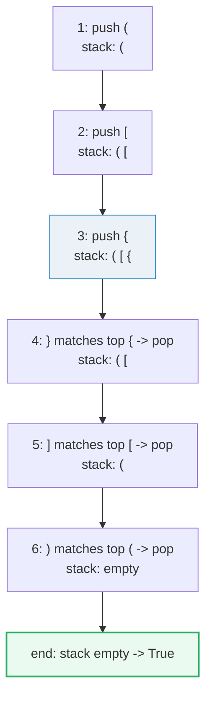
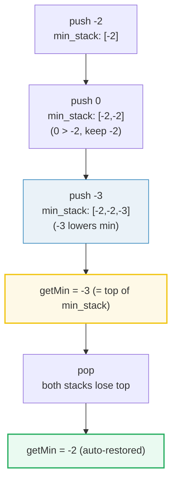
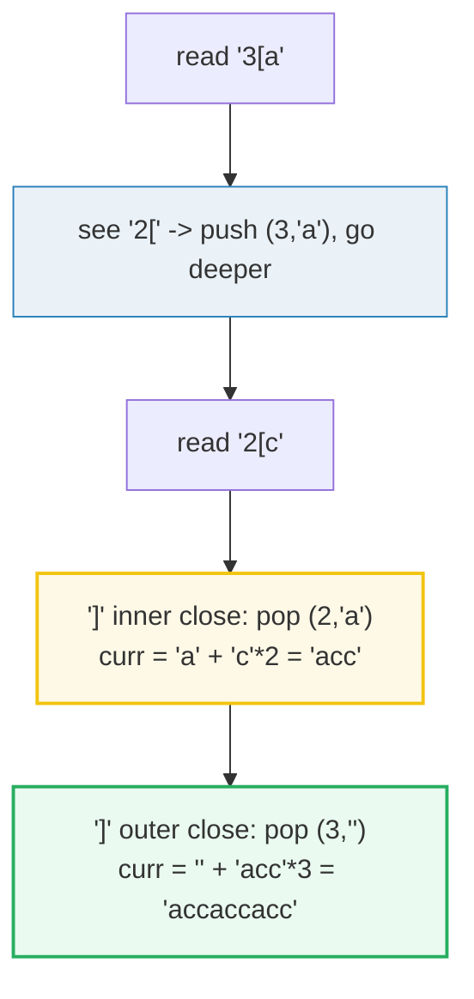

# Stack — Valid Parentheses, Min Stack, Decode String — A Visual, Worked-Example Guide

> **Companion code:** [`stack.py`](./stack.py). **Every number is printed by
> `python3 stack.py`** — nothing is hand-computed.
>
> **Live animation:** [`stack.html`](./stack.html) — open in a browser.

---

## 0. TL;DR — the one idea

> **The analogy (read this first):** A stack is a pile of plates — you can only
> add to the top and only take from the top. That **LIFO** order is exactly what
> nesting demands: the *last* bracket you opened is the *first* one you must
> close; the *last* task you paused is the *first* one you resume. So whenever a
> problem is about "matching the most recent thing" or "save this state, do
> something nested, then come back," a stack is the right structure. A plain list
> with `.append()` / `.pop()` *is* the stack — no special class needed.



The three problems in this bundle are the same "save & restore" idea wearing three hats:

| Variant | What the stack stores | Problem | Why LIFO fits |
|---|---|---|---|
| Bracket matching | opening brackets | P020 Valid Parentheses | last opened = first to close |
| Auxiliary stack | running minimum | P155 Min Stack | parallel mirror enables O(1) min |
| Nested decode | `(count, prefix)` frames | P394 Decode String | innermost `[...]` decodes first |

---

### Pattern Recognition Signals

| Signal in the problem statement | → Use a stack |
|---|---|
| "**valid parentheses**" / "matching brackets / pairs" | ✓ bracket matching |
| "**nested**" structure — decode/parse `k[...]` or expressions | ✓ state-save frames |
| Need O(1) **min/max** retrieval alongside a stack | ✓ auxiliary min-stack |
| "**undo** the last action" / "previous state" / "recent" | ✓ LIFO recall |
| "**next greater/smaller** element" (bounded) | ✓ (monotonic stack — see that bundle) |
| "**evaluate expression**" / basic calculator | ✓ operator/operand stack |
| "**daily temperatures**" waiting for a future condition | ✓ (monotonic stack) |

---

### The Template Skeleton

```python
# Variant 1 — bracket matching (Valid Parentheses)
def is_valid_parentheses(s: str) -> bool:
    mapping = {")": "(", "]": "[", "}": "{"}
    stack = []
    for ch in s:
        if ch in mapping:                       # closer
            if not stack or stack[-1] != mapping[ch]:
                return False                    # mismatched or dangling
            stack.pop()
        else:                                   # opener
            stack.append(ch)
    return len(stack) == 0                      # leftover openers => invalid

# Variant 2 — O(1) min via an auxiliary stack
class MinStack:
    def __init__(self):
        self._stack = []
        self._min_stack = []                    # running min at each depth
    def push(self, val):
        self._stack.append(val)
        m = val if not self._min_stack else min(val, self._min_stack[-1])
        self._min_stack.append(m)
    def pop(self):
        self._stack.pop(); self._min_stack.pop()
    def top(self):     return self._stack[-1]
    def get_min(self): return self._min_stack[-1]

# Variant 3 — nested decode (k[encoded_string])
def decode_string(s: str) -> str:
    stack = []                                  # (repeat_count, saved_prefix)
    curr_num, curr_str = 0, ""
    for ch in s:
        if ch.isdigit():
            curr_num = curr_num * 10 + int(ch)  # multi-digit counts!
        elif ch == "[":
            stack.append((curr_num, curr_str)); curr_num, curr_str = 0, ""  # reset BOTH
        elif ch == "]":
            repeat, prefix = stack.pop()
            curr_str = prefix + curr_str * repeat
        else:
            curr_str += ch
    return curr_str
```

---

## 1. P020 Valid Parentheses

> **Problem:** Given a string of `()[]{}`, return `True` iff every bracket is
> properly closed and nested.
> **Key insight:** LIFO matches nesting. Push openers; on a closer, the stack
> top *must* be its partner. Two failure modes: a closer with the wrong/empty
> top, or leftover openers at the end.

> From `stack.py` Section "P020 Valid Parentheses":

```
input = '([{}])'
step  char  action                      stack
----------------------------------------------------------------
   1     (  push '('                    ['(']
   2     [  push '['                    ['(', '[']
   3     {  push '{'                    ['(', '[', '{']
   4     }  pop '{' (matches '}')       ['(', '[']
   5     ]  pop '[' (matches ']')       ['(']
   6     )  pop '(' (matches ')')       []
end: stack empty? True  -> True

>> is_valid_parentheses('([{}])') = True   [check] OK
```

| step | char | action | stack |
|---|---|---|---|
| 1 | `(` | push `(` | `[(`] |
| 2 | `[` | push `[` | `(`, `[` |
| 3 | `{` | push `{` | `(`, `[`, `{` |
| 4 | `}` | pop `{` (top matches) | `(`, `[` |
| 5 | `]` | pop `[` (top matches) | `(` |
| 6 | `)` | pop `(` (top matches) | `[]` |
| end | — | stack empty? → `True` | — |

The brackets close in **reverse open order** — exactly LIFO. The matching failure case
shows the rejection guard in action:

> From `stack.py` Section "P020 Valid Parentheses" (the `'([)]'` counterexample):

```
input = '([)]'
step  char  action                      stack
----------------------------------------------------------------
   1     (  push '('                    ['(']
   2     [  push '['                    ['(', '[']
   3     )  REJECT (top!=opener)        ['(', '[']  -> False

>> is_valid_parentheses('([)]') = False   [check] OK
```

At step 3, the closer `)` sees top `[`, not `(` — an immediate `return False`. The two
guards (`not stack` for a dangling closer, `stack[-1] != mapping[ch]` for a mismatch) and
the final `len(stack) == 0` (for leftover openers like `"("`) cover every invalid shape.



---

## 2. P155 Min Stack

> **Problem:** Design a stack supporting `push`, `pop`, `top`, and `getMin`, all
> in **O(1)** time.
> **Key insight:** Maintain a **second** stack that always mirrors the main one's
> depth, storing the running minimum *at each level*. Because each new entry is
> `min(val, previous_min)`, the global minimum always sits at the top — no scan
> needed.

> From `stack.py` Section "P155 Min Stack":

```
ops = [('push', -2), ('push', 0), ('push', -3), ('getMin', None), ('pop', None), ('top', None), ('getMin', None)]
step  op          val  stack             min_stack         return
----------------------------------------------------------------------------
   1  push         -2  [-2]              [-2]              -
   2  push          0  [-2, 0]           [-2, -2]          -
   3  push         -3  [-2, 0, -3]       [-2, -2, -3]      -
   4  getMin     None  [-2, 0, -3]       [-2, -2, -3]      -3
   5  pop        None  [-2, 0]           [-2, -2]          -
   6  top        None  [-2, 0]           [-2, -2]          0
   7  getMin     None  [-2, 0]           [-2, -2]          -2

>> returns = [None, None, None, -3, None, 0, -2]   [check] OK
```

| step | op | val | main stack | min stack | return |
|---|---|---|---|---|---|
| 1 | push | -2 | `[-2]` | `[-2]` | — |
| 2 | push | 0 | `[-2, 0]` | `[-2, -2]` | — |
| 3 | push | -3 | `[-2, 0, -3]` | `[-2, -2, -3]` | — |
| 4 | getMin | — | `[-2, 0, -3]` | `[-2, -2, -3]` | **-3** |
| 5 | pop | — | `[-2, 0]` | `[-2, -2]` | — |
| 6 | top | — | `[-2, 0]` | `[-2, -2]` | **0** |
| 7 | getMin | — | `[-2, 0]` | `[-2, -2]` | **-2** |

Notice the min stack is **non-increasing**: `0` pushed on top of `-2` records `-2` again
(the running min didn't change), while `-3` *lowers* it. Popping step 5 removes `-3` from
both stacks, so the min springs back to `-2` automatically — no recomputation.



---

## 3. P394 Decode String

> **Problem:** Expand an encoded string `k[encoded_string]` with arbitrary
> nesting, e.g. `"3[a2[c]]"` → `"accaccacc"`.
> **Key insight:** A `[` means "pause the current job and go deeper." Push
> `(curr_num, curr_str)` as a saved frame and **reset both** accumulators. On
> `]`, pop the frame and prepend its prefix to the repeated inner string. The
> stack makes the innermost brackets decode first — exactly LIFO recursion,
> iteratively.

> From `stack.py` Section "P394 Decode String":

```
input = '3[a2[c]]'
step  char  action                            num  curr_str      stack
------------------------------------------------------------------------------------
   1     3  digit -> num = 3                    3  ''            []
   2     [  push (3, ''); reset                 0  ''            [(3, '')]
   3     a  letter -> append                    0  'a'           [(3, '')]
   4     2  digit -> num = 2                    2  'a'           [(3, '')]
   5     [  push (2, 'a'); reset                0  ''            [(3, ''), (2, 'a')]
   6     c  letter -> append                    0  'c'           [(3, ''), (2, 'a')]
   7     ]  pop (2, 'a'); expand                0  'acc'         [(3, '')]
   8     ]  pop (3, ''); expand                 0  'accaccacc'   []
>> decoded = 'accaccacc'
```

| step | char | action | num | curr_str | stack (top right) |
|---|---|---|---|---|---|
| 1 | `3` | digit → num=3 | 3 | `''` | `[]` |
| 2 | `[` | push (3, ''), reset | 0 | `''` | `[(3,'')]` |
| 3 | `a` | append | 0 | `'a'` | `[(3,'')]` |
| 4 | `2` | digit → num=2 | 2 | `'a'` | `[(3,'')]` |
| 5 | `[` | push (2, 'a'), reset | 0 | `''` | `[(3,''),(2,'a')]` |
| 6 | `c` | append | 0 | `'c'` | `[(3,''),(2,'a')]` |
| 7 | `]` | pop (2,'a'); `'a'+'c'*2`='acc' | 0 | `'acc'` | `[(3,'')]` |
| 8 | `]` | pop (3,''); `''+'acc'*3` | 0 | `'accaccacc'` | `[]` |

The crux is steps 7→8: the **inner** `2[c]` resolves first (`'c'`×2 within prefix `'a'`
= `'acc'`), then the **outer** `3[...]` repeats that whole result 3 times. A flat
left-to-right scan could never handle that; the stack supplies the necessary "go back and
finish the paused job" structure.



---

## Complexity

| Operation | Time | Space |
|---|---|---|
| Valid Parentheses | O(n) — one pass, each char pushed/popped ≤ once | O(n) worst case all openers |
| Min Stack (each op) | O(1) — push/pop/top/getMin all constant | O(n) for the two parallel stacks |
| Decode String | O(n · k) where k is the max repeat factor (output-bound) | O(n) for the frame stack |

**Why Valid Parentheses is O(n):** the `for` loop touches each character once, and every
bracket is pushed at most once and popped at most once. The min stack adds no asymptotic
cost because it does one append/erase per push/pop — same count, just doubled space.

---

## Killer Gotchas

- **Popping an empty stack:** always guard `if not stack` *before* reading
  `stack[-1]` or calling `stack.pop()`. A dangling closer like `")"` on an empty
  stack otherwise raises `IndexError` (or returns a wrong answer).
- **Forgetting the final `len(stack) == 0`:** don't `return True` at the end of
  bracket matching — leftover openers like `"("` leave a non-empty stack that
  must fail. The verdict is `len(stack) == 0`, not "no mismatch seen."
- **Multi-digit counts:** in `Decode String`, `k` can span digits (`12[a]`). Build
  it with `num = num * 10 + int(ch)` — using `int(ch)` alone silently truncates
  `12` to `2`.
- **Reset BOTH accumulators on `[`:** after pushing `(curr_num, curr_str)` you must
  zero `curr_num` **and** clear `curr_str`. Forgetting either bleeds the outer
  state into the inner level.
- **Min stack must pop in lockstep:** every `push` appends to both stacks, every
  `pop` removes from both. Skipping the min-stack pop desynchronizes depths and
  corrupts `getMin`.
- **`close→open` map direction:** the mapping keys are **closers** (`)`,`]`,`}`)
  pointing to openers, so `ch in mapping` distinguishes the two char classes in one
  test. Reversing it (open→close) forces a separate opener check and is a common
  source of bugs.
- **Whitespace / other chars:** `is_valid_parentheses` here assumes the string is
  brackets-only. If the input may contain other characters, decide explicitly
  whether to ignore them or treat them as invalid.

---

## Problem Table

| Problem | Difficulty | Essence | Key Trick |
|---|---|---|---|
| P020 Valid Parentheses | Easy | properly nested brackets | `close→open` map; reject on empty/mismatched top; final `stack==[]` |
| P155 Min Stack | Medium | O(1) minimum retrieval | auxiliary `min_stack` mirrors depth, each entry = running min |
| P394 Decode String | Medium | expand nested `k[...]` | push `(count, prefix)` on `[`; reset BOTH vars; on `]` prepend prefix + repeat |
| P150 Evaluate Reverse Polish | Medium | postfix expression eval | operand stack; pop two on operator, push result |
| P739 Daily Temperatures | Medium | next warmer day distance | decreasing **monotonic** stack of indices (see that bundle) |
| P084 Largest Rectangle | Hard | max bar rectangle | increasing **monotonic** stack + sentinel |
| P071 Simplify Path | Medium | canonical unix path | directory-name stack; `..` pops, `.` ignored |
