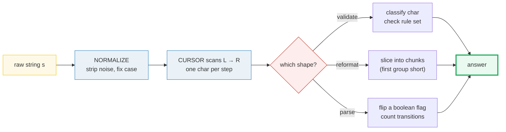
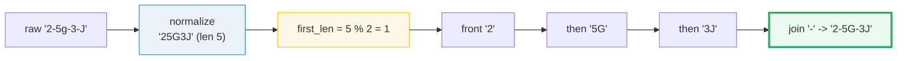
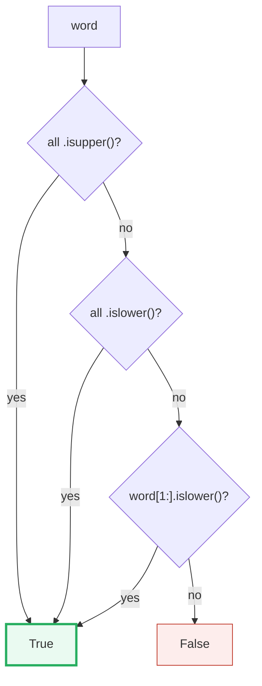
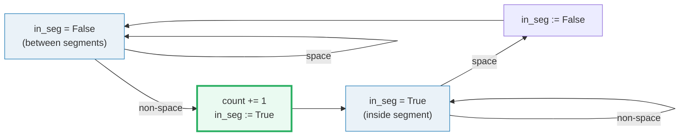

# String Manipulation — License Key, Detect Capital, Segments — A Visual, Worked-Example Guide

> **Companion code:** [`string.py`](./string.py). **Every number below is
> printed by `python3 string.py`** — nothing is hand-computed. Paste tables
> verbatim from [`string_output.txt`](./string_output.txt).
>
> **Live animation:** [`string.html`](./string.html) — open in a browser, step
> the cursor, watch each character get classified / dropped / uppercased and the
> state flag flip. The JS recomputes the identical answers and is gold-checked
> against this file.

[check: OK] — `string.html` recomputes all three problems in JS on the same
inputs and matches `string.py` Section E
(`P482="5F3Z-2E9W"`/`"2-5G-3J"`/`"R"`, `P520=T,F,T,T,T`,
`P434=5,1,0`).

---

## 0. TL;DR — the one idea

> **The analogy (read this first):** A string is just a **list of characters**,
> and almost every "easy" string problem is solved by walking that list left to
> right with **one finger** — the *cursor*. At each character you do exactly one
> of three things: **classify** it (validation), **transform** it (reformatting),
> or **feed it to a one-boolean state machine** (parsing). Clean the data *first*
> (strip noise, fix case) and the actual rule collapses to a single line.



The pattern applies when **all** of these hold:

1. The input is a **string** (or token stream) and you scan it **left to right**.
2. The rule is **local** — each character's fate depends only on itself (or a
   tiny bit of carried state), never on a global re-scan.
3. There is no search over combinations — if you need "longest", "all subsets",
   or "rearrangements", you want sliding window / backtracking / two pointers,
   **not** this pattern.

Drop any of the three and you need a different tool.

---

### Pattern Recognition Signals

| Signal in the problem statement | → Use this pattern |
|---|---|
| "valid", "detect", "check if" + case/char-class rule | ✓ validation |
| "format", "reformat", "rearrange", "license key" | ✓ reformatting |
| "segment", "split", "count words", "number of … in a string" | ✓ parse/count |
| rule depends on each char independently, O(n) single pass | ✓ required |
| input needs noise stripped (dashes, spaces) before the rule | ✓ normalize first |
| "longest substring", "contiguous window under a constraint" | ✗ sliding window |
| "is X a subsequence / rearrangement of Y" | ✗ two pointers / Counter |
| "generate all permutations / subsets of the string" | ✗ backtracking |

---

### The Template Skeleton (three variants)

> From `string.py` Section A. Every problem is one of these three with a
> different `rule` / `chunk size` / `state flag`.

**Variant 1 — Validation** (does the string match a fixed rule set?):

```python
def template_validation(word):
    return word.isupper() or word.islower() or word[1:].islower()
```
The `[1:]` slice is the elegant touch: for a single-char word it is empty, but
`isupper()`/`islower()` already returned `True` for that word, so the empty
slice is never consulted. **Know your built-ins** — a 15-line loop is a smell.

**Variant 2 — Reformat** (normalize, then chunk from the FRONT):

```python
def template_reformat(s, k):
    cleaned = s.replace("-", "").upper()
    first_len = len(cleaned) % k
    groups = [cleaned[:first_len]] if first_len else []
    for i in range(first_len, len(cleaned), k):
        groups.append(cleaned[i:i + k])
    return "-".join(groups)
```
The gotcha that defines the problem: the **first** group is the short one
(`len(cleaned) % k`), **not** the last. Slice it off the front, then walk the
rest in perfect `k`-steps.

**Variant 3 — Parse / Count** (one boolean flag, count transitions):

```python
def template_parse_count(s):
    count, in_seg = 0, False
    for ch in s:
        if ch != " " and not in_seg:
            count += 1
            in_seg = True
        elif ch == " ":
            in_seg = False
    return count
```
Equivalent shortcut: `len(s.split())`. The state machine is shown because it
generalizes to harder tokenizers where `.split()` is not enough.

---

## 1. P482 — License Key Formatting (reformat)

> **Problem:** reformat `s` (alphanumerics + dashes) so every group after the
> first has exactly `k` chars, dashes between groups, all uppercase.
> **Key insight:** "format" + "rearrange layout" → reformat. Normalize
> (`replace("-", "").upper()`) collapses all the noise, then the remainder
> `len(cleaned) % k` is exactly the size of the short **front** group.

```python
def license_key_formatting(s, k):
    cleaned = s.replace("-", "").upper()
    first_len = len(cleaned) % k
    groups = [cleaned[:first_len]] if first_len else []
    for i in range(first_len, len(cleaned), k):
        groups.append(cleaned[i:i + k])
    return "-".join(groups)
```

> **From `string.py` Section B** — the normalize trace on `s = "5F3Z-2e-9-w"`,
> `k = 4`. The cursor drops dashes and uppercases letters; `cleaned` builds up.

```
  i   ch  action     cleaned (so far)  
 ------------------------------------------------
  0    5  keep       '5'               
  1    F  keep       '5F'              
  2    3  keep       '5F3'             
  3    Z  keep       '5F3Z'            
  4    -  drop '-'   '5F3Z'            
  5    2  keep       '5F3Z2'           
  6    e  upper->E   '5F3Z2E'          
  7    -  drop '-'   '5F3Z2E'          
  8    9  keep       '5F3Z2E9'         
  9    -  drop '-'   '5F3Z2E9'         
 10    w  upper->W   '5F3Z2E9W'        

Phase 2 - CHUNK (first_len = len(cleaned) % k = 8 % 4 = 0):
  first group  = cleaned[:0] = ''
  next group   = cleaned[0:4] = '5F3Z'
  next group   = cleaned[4:8] = '2E9W'

  '-'.join(['5F3Z', '2E9W']) = '5F3Z-2E9W'

  -> license_key_formatting('5F3Z-2e-9-w', 4) = '5F3Z-2E9W'
```

`len(cleaned) = 8` divides evenly into `4`, so there is **no** short front group
and we get two equal halves. Contrast with the second canonical input where the
short group appears:

```
  second example: license_key_formatting('2-5g-3-J', 2) = '2-5G-3J'
  cleaned='25G3J' (len 5), first_len = 5%2 = 1 -> front group '2',
  then '5G', '3J' -> '2-5G-3J'. The SHORT group is at the FRONT.
```



`[check] P482 answers match LeetCode: OK`

---

## 2. P520 — Detect Capital (validation)

> **Problem:** return `True` if capital use in `word` is correct: all-uppercase,
> all-lowercase, or title-case (first upper, rest lower).
> **Key insight:** "detect" / "check if" + a case-class rule → validation. Each
> character is classified U/L independently and three whole-string predicates do
> the rest.

```python
def detect_capital(word):
    return word.isupper() or word.islower() or word[1:].islower()
```

> **From `string.py` Section C** — the classification table. `char pattern` is
> the per-character U/L sequence the cursor produces.

```
  word       char pattern     all-up? all-low?  title?  valid?
  ------------------------------------------------------------
  USA        UUU                 True    False   False    True
  FlaG       ULLU               False    False   False   False
  Google     ULLLLL             False    False    True    True
  leetcode   LLLLLLLL           False     True   False    True
  A          U                   True    False   False    True

  -> rule: word.isupper() or word.islower() or word[1:].islower()
```

`'FlaG'` is `U L L U` — neither all-same nor title, so `False`. `'Google'` is
`U L L L L L` = title case → `True`. Single char `'A'` is all-upper → `True`
(the `[1:]` slice is empty and never consulted).



`[check] P520 answers match LeetCode: OK`

---

## 3. P434 — Number of Segments in a String (parse/count)

> **Problem:** count contiguous runs of non-space characters in `s`.
> **Key insight:** "count segments" / "words" → parse with a one-boolean state
> machine. Count the **space → non-space transitions**: each marks the start of a
> new segment.

```python
def count_segments(s):
    count, in_seg = 0, False
    for ch in s:
        if ch != " " and not in_seg:
            count += 1
            in_seg = True
        elif ch == " ":
            in_seg = False
    return count
```

> **From `string.py` Section D** — transition trace on
> `s = "Hello, my name is John"`. Only rows where `in_seg` flips are shown;
> interior chars of a segment produce no state change.

```
  i   ch  in_seg(before) action                     count
 ----------------------------------------------------------
  0    H           False start of segment -> count += 1     1
  6                 True space -> end of segment        1
  7    m           False start of segment -> count += 1     2
  9                 True space -> end of segment        2
 10    n           False start of segment -> count += 1     3
 14                 True space -> end of segment        3
 15    i           False start of segment -> count += 1     4
 17                 True space -> end of segment        4
 18    J           False start of segment -> count += 1     5

  -> count_segments('Hello, my name is John') = 5
  edges: count_segments('Hello')=1, ('')=0, ('     ')=0
```

`count` incremented at `i=0` (`'H'`), `7` (`'m'`), `10` (`'n'`), `15` (`'i'`),
`18` (`'J'`) = five segments. Equivalent one-liner: `len(s.split())` — the state
machine is the **generalizable** version (it survives multi-char delimiters and
quoted tokens where `.split()` does not).



`[check] P434 answers match LeetCode: OK`

---

## Complexity

| Operation | Time | Space |
|---|---|---|
| Validation (whole-string predicates, P520) | `O(n)` | `O(1)` |
| Reformat (normalize + slice, P482) | `O(n)` | `O(n)` for the output |
| Parse/count state machine (P434) | `O(n)` | `O(1)` |

All three are a **single left-to-right pass** over `n = len(s)`. The reformat
variant uses `O(n)` space because it builds a new string (the cleaned buffer +
the joined output); validation and parsing keep only a fixed-size flag/counter.

---

### Killer Gotchas

- **First group is the SHORT one, not the last.** In P482 the remainder
  `len(cleaned) % k` is the size of the **front** group. Compute `first_len`,
  slice it off the front, then walk in `k`-steps. Doing it from the right gives
  the wrong answer whenever the division is uneven.
- **Built-in blindness.** Don't write a 15-line loop to check case when
  `word.isupper()` / `word.islower()` / `word[1:].islower()` exist. The `[1:]`
  trick covers title case *and* single-char words in one expression.
- **Normalize BEFORE the rule, not inside it.** Mixing dash-stripping and
  grouping in one pass breeds off-by-one bugs. `s.replace("-", "").upper()` once,
  up front, and the rest is trivial slicing.
- **State machine counts transitions, not chars.** P434 counts
  space→non-space edges, not non-space chars. Bumping the counter on every
  non-space char over-counts by the segment length.
- **`len(s.split())` is a shortcut, not the lesson.** It silently handles leading
  / trailing / repeated spaces. The `in_segment` flag is what generalizes to
  multi-char delimiters and tokenizers.
- **Empty / all-dash input.** `license_key_formatting("---", k)` yields `""`
  (empty join) — make sure your chunking handles `cleaned == ""` without indexing
  `cleaned[0]`.

---

### Problem Table

> From `DSA_CHEATSHEET.md` §string and `string.py` Section E.

| Problem | Shape | Essence / Key Trick |
|---|---|---|
| **P482** License Key Formatting | reformat | `replace("-","").upper()`; **first** group = `len%k` (front slice), then `k`-chunks joined by `-` |
| **P520** Detect Capital | validation | 1-liner: `isupper or islower or word[1:].islower()` — `[1:]` covers single chars too |
| **P434** Number of Segments | parse/count | `in_segment` flag: count space→non-space transitions; or just `len(s.split())` |
| P521 Longest Uncommon Subseq I | comparison | `a == b` (string equality!) → `-1`; else `max(len(a), len(b))` — NOT `len(a)==len(b)` |
| P125 Valid Palindrome | validation | normalize (lowercase + keep alnum), then two pointers converge |
| P242 Valid Anagram | validation | `Counter(s) == Counter(t)` — character-class equality |
| P58 Length of Last Word | parse/count | `s.split()` then `len(last)` — or reverse-scan skipping trailing spaces |

---

## Gold values (pinned, reproducible)

```
license_key_formatting("5F3Z-2e-9-w", 4) = '5F3Z-2E9W'
license_key_formatting("2-5g-3-J", 2)    = '2-5G-3J'
license_key_formatting("r", 1)           = 'R'
detect_capital("USA")     = True
detect_capital("FlaG")    = False
detect_capital("Google")  = True
detect_capital("leetcode")= True
detect_capital("A")       = True
count_segments("Hello, my name is John") = 5
count_segments("Hello")                 = 1
count_segments("")                      = 0
[check] all GOLD values reproduce from the implementations:  OK
```

> Next: [`sliding_window.html`](./sliding_window.html) — when the answer is the
> *longest contiguous window* under a constraint, vs. this pattern's single-pass
> char classification.
