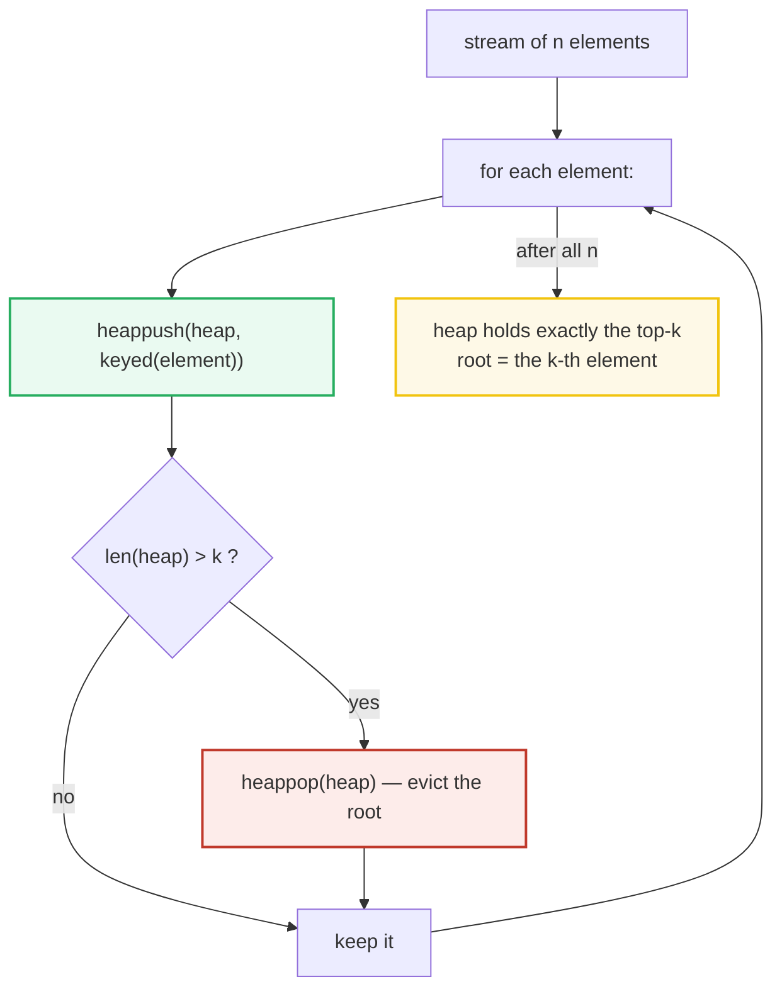
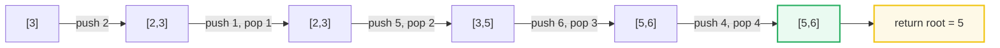
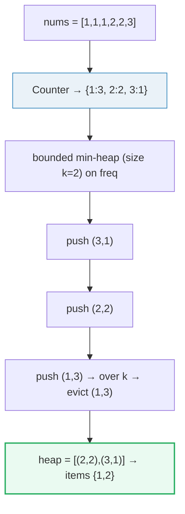
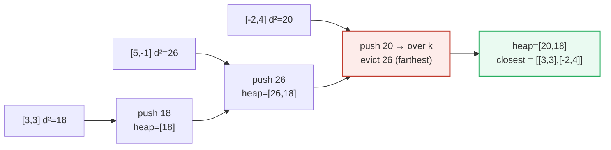

# Top-K Elements — P215, P347, P973 — A Visual, Worked-Example Guide

> **Companion code:** [`top_k_elements.py`](./top_k_elements.py). **Every number is printed by
> `python3 top_k_elements.py`** — nothing is hand-computed.
>
> **Live animation:** [`top_k_elements.html`](./top_k_elements.html) — open in a browser.

---

## 0. TL;DR — the one idea

> **The analogy (read this first):** A heap of size `k` is a **VIP club with a strict capacity
> limit**. To find the **k largest** elements you keep the club full, and the doorman always ejects the
> *weakest* member to make room for a stronger newcomer. To find the weakest member in O(1) you organize
> the club as a **min-heap** (the smallest sits at the root). So — counter-intuitively — **keeping the
> *largest* requires a min-heap**, because the min-heap root is the easiest thing to kick out.
> Flip it around: to keep the **k smallest / closest**, you eject the *strongest* member, so you use a
> **max-heap** (negate the key in Python). Rule of thumb: *the heap always evicts the element that would
> NOT be in your answer.*



The three problems in this bundle are the same "bounded heap" idea wearing three ranking criteria:

| Variant | Goal | Heap type (size k) | What the root is | Problem |
|---|---|---|---|---|
| Kth largest | keep the k **largest** values | **min-heap** on value | smallest of the top-k | P215 Kth Largest |
| Top K frequent | keep the k **most frequent** | **min-heap** on `(freq, item)` | least-frequent kept | P347 Top K Frequent |
| K closest points | keep the k **closest** points | **max-heap** on distance (negated) | farthest kept | P973 K Closest Points |

> **The memory hook:** *the heap you keep is the opposite of the heap you want.* Want the largest → min-heap.
> Want the smallest/closest → max-heap. The root is always the "sacrificial" member.

---

### Pattern Recognition Signals

| Signal in the problem statement | → Use top-k elements |
|---|---|
| "**k-th largest**" / "**k largest**" / "**k smallest**" in an array | ✓ min-heap of size k (or quickselect) |
| "**top k frequent**" / "**k most common**" elements | ✓ Counter → min-heap of size k on freq |
| "**k closest** points" / "**k nearest**" to a target | ✓ max-heap of size k on distance |
| "find … without fully **sorting**" and k is small | ✓ bounded heap, O(n log k) beats O(n log n) |
| "return the **k** …" where only the boundary element matters | ✓ root = `heap[0]` is the answer, O(1) |
| "**median** of a stream" / sliding-window order statistic | → see the *two_heaps* bundle instead |

---

### The Template Skeleton

```python
import heapq
from collections import Counter

# --- Keep the k LARGEST → min-heap of size k (root = k-th largest) ---
def kth_largest(nums, k):
    heap = []
    for x in nums:
        heapq.heappush(heap, x)          # min-heap root = smallest kept
        if len(heap) > k:
            heapq.heappop(heap)          # evict the smallest → keep the big ones
    return heap[0]                       # root is the k-th largest

# --- Keep the k SMALLEST/CLOSEST → max-heap of size k via negation ---
def k_smallest(items, k, key):
    heap = []
    for it in items:
        heapq.heappush(heap, (-key(it), it))   # negate → root = most negative = largest key
        if len(heap) > k:
            heapq.heappop(heap)                # evict the farthest → keep the closest
    return [it for _, it in heap]

# --- Keep the k MOST FREQUENT → Counter, then min-heap on (freq, item) ---
def top_k_frequent(nums, k):
    freq = Counter(nums)
    heap = []
    for item, f in freq.items():
        heapq.heappush(heap, (f, item))
        if len(heap) > k:
            heapq.heappop(heap)          # evict least-frequent kept
    return [item for _, item in heap]
```

---

## 1. P215 Kth Largest Element in an Array — Min-Heap of Size k

> **Problem:** Given an integer array `nums` and integer `k`, return the **k-th largest** element (by
> sorted order, **not** distinct — duplicates count). (LeetCode P215.)
> **Key insight:** Keep a **min-heap capped at k**. Every push beyond k evicts the *smallest* of the
> top-k, so the heap always holds the k largest seen so far. When the stream ends, `heap[0]` is the
> smallest among those k — i.e. the **k-th largest**.

> From `top_k_elements.py` Section "P215 Kth Largest Element":

```
input = [3, 2, 1, 5, 6, 4], k = 2  (want the 2nd-largest element)

goal: keep the 2 largest; the heap root is the 2-th largest element

   i   num  action                      heap (cap k)      evicted
  ----------------------------------------------------------------------
   0     3  push 3                      [3]               -
   1     2  push 2                      [2, 3]            -
   2     1  push 1 -> over k            [2, 3]            pop 1 (smallest)
   3     5  push 5 -> over k            [3, 5]            pop 2 (smallest)
   4     6  push 6 -> over k            [5, 6]            pop 3 (smallest)
   5     4  push 4 -> over k            [5, 6]            pop 4 (smallest)

  heap = [5, 6]   root = heap[0] = 5  (k-th largest)

>> kth_largest([3, 2, 1, 5, 6, 4], 2) = 5   [check] OK
>> kth_largest([3, 2, 3, 1, 2, 4, 5, 5, 6], 4) = 4   [check] OK
```

| i | num | action | heap after | evicted |
|---|---|---|---|---|
| 0 | 3 | push 3 | `[3]` | — |
| 1 | 2 | push 2 | `[2, 3]` | — |
| 2 | 1 | push 1 → over k | `[2, 3]` | `1` (smallest) |
| 3 | 5 | push 5 → over k | `[3, 5]` | `2` (smallest) |
| 4 | 6 | push 6 → over k | `[5, 6]` | `3` (smallest) |
| 5 | 4 | push 4 → over k | `[5, 6]` | `4` (smallest) |

**Reading the trace.** The heap never grows past k=2. Each "over k" step pops the *minimum* of the
top-k — that is exactly the element that cannot be in the top-2. After index 4 the heap holds `[5, 6]`;
index 5's `4` is pushed then immediately popped (4 < root 5, so it is the new minimum and gets evicted).
The root `heap[0] = 5` is the smallest of the two largest → the **2nd largest**. Note `1`, `2`, `3`, `4`
were all too small and got sacrificed; `6` survived as the 1st largest.



---

## 2. P347 Top K Frequent Elements — Counter + Min-Heap of Size k

> **Problem:** Given a non-empty integer array `nums` and integer `k`, return the **k most frequent**
> elements (any order). It is guaranteed the answer is unique. (LeetCode P347.)
> **Key insight:** First reduce `n` elements to a frequency map (`O(n)`). Then apply the *exact same*
> bounded-heap trick, but the "value" you compare on is the **frequency**. A min-heap of size k on
> `(freq, item)` evicts the *least-frequent* kept member, leaving the k most frequent.

> From `top_k_elements.py` Section "P347 Top K Frequent Elements":

```
input = [1, 1, 1, 2, 2, 3], k = 2  (want the 2 most frequent)

frequencies: {1: 3, 2: 2, 3: 1}

  item  freq  action                  heap (freq,item)          evicted
  ------------------------------------------------------------------------
     1     3  push (3,1)              [(3, 1)]                  -
     2     2  push (2,2)              [(2, 2), (3, 1)]          -
     3     1  push -> over k          [(2, 2), (3, 1)]          pop (1,3) least freq

  heap = [(2, 2), (3, 1)]   result items = [1, 2]

>> top_k_frequent([1, 1, 1, 2, 2, 3], 2) = [1, 2]   [check] OK
>> top_k_frequent([1], 1) = [1]   [check] OK
```

| item | freq | action | heap after `(freq,item)` | evicted |
|---|---|---|---|---|
| 1 | 3 | push (3,1) | `[(3,1)]` | — |
| 2 | 2 | push (2,2) | `[(2,2),(3,1)]` | — |
| 3 | 1 | push → over k | `[(2,2),(3,1)]` | `(1,3)` least freq |

**Reading the trace.** The heap stores `(freq, item)` tuples; Python compares tuples lexicographically,
so the **smallest frequency** sits at the root. When item `3` (freq 1) is pushed, the heap grows to 3
and pops the minimum tuple `(1,3)` — the least-frequent member. The surviving `[(2,2),(3,1)]` holds the
two most-frequent items, **1** (freq 3) and **2** (freq 2). The ordering inside the heap does not matter:
P347 accepts any permutation of the result.

> **O(n) follow-up:** when frequencies are bounded by `n`, bucket sort (an array of `n+1` lists indexed
> by frequency, drained from the top) is O(n) and beats the heap's O(n log k). Mention it to the
> interviewer; the heap is the general-purpose template.



---

## 3. P973 K Closest Points to Origin — Max-Heap (Negated Distance)

> **Problem:** Given an array of `points` (each `[x, y]`) and integer `k`, return the **k closest** to
> the origin `(0,0)`. (Distance is Euclidean; answer order does not matter.) (LeetCode P973.)
> **Key insight:** To keep the *closest*, you must evict the *farthest* → use a **max-heap of size k**.
> Python only ships a min-heap, so store **negated squared distance** `(-d², idx)`: the most-negative
> tuple (the farthest point) becomes the min-heap root and is popped first. Use **squared distance**
> `x² + y²` — the sqrt is monotonic, so skipping it preserves order and avoids floating point.

> From `top_k_elements.py` Section "P973 K Closest Points to Origin":

```
input = [[3, 3], [5, -1], [-2, 4]], k = 2  (want the 2 closest to origin)

goal: keep the 2 closest; root = farthest kept (first evicted)

   i     point    d²  action                heap (d²,point)             evicted
  ------------------------------------------------------------------------------
   0  [3,3]        18  push 18               [(18,[3, 3])]               -
   1  [5,-1]        26  push 26               [(26,[5, -1]), (18,[3, 3])]  -
   2  [-2,4]        20  push -> over k        [(20,[-2, 4]), (18,[3, 3])]  pop 26 [5, -1] (farthest)

  heap = [(20,[-2, 4]), (18,[3, 3])]   closest = [[3, 3], [-2, 4]]

>> k_closest_points([[3, 3], [5, -1], [-2, 4]], 2) = [[3, 3], [-2, 4]]   [check] OK
>> k_closest_points([[1, 3], [-2, 2]], 1) = [[-2, 2]]   [check] OK
```

| i | point | d² = x²+y² | action | heap after `(d²,point)` | evicted |
|---|---|---|---|---|---|
| 0 | [3,3] | 9+9 = **18** | push 18 | `[(18,[3,3])]` | — |
| 1 | [5,-1] | 25+1 = **26** | push 26 | `[(26,[5,-1]),(18,[3,3])]` | — |
| 2 | [-2,4] | 4+16 = **20** | push → over k | `[(20,[-2,4]),(18,[3,3])]` | `26 [5,-1]` (farthest) |

**Reading the trace.** Internally the heap stores `(-d², idx)`, so the displayed `(d², point)` tuples
have their **farthest** at the root. After all three pushes, the over-k pop removes `(-26, idx1)` — the
most negative, i.e. the farthest point `[5,-1]` (d²=26). The survivors are `[3,3]` (18) and `[-2,4]`
(20), the two closest to the origin. Notice `[-2,4]` (d²=20) displaced `[5,-1]` (d²=26): the max-heap
root was the farthest, so it was the natural sacrifice.



---

## Complexity

| Operation | Time | Space |
|---|---|---|
| Kth largest — bounded min-heap (P215) | O(n log k) | O(k) |
| Kth largest — full sort then index | O(n log n) | O(1) or O(n) |
| Kth largest — quickselect (avg) | O(n) avg, O(n²) worst | O(1) |
| Top K frequent — Counter + heap (P347) | O(n log k) | O(n) for the map + O(k) heap |
| Top K frequent — bucket sort | O(n) | O(n) |
| K closest — bounded max-heap (P973) | O(n log k) | O(k) |
| `heappush` / `heappop` (size k) | O(log k) | — |
| `heap[0]` peek | O(1) | — |
| `heapify` (build from n) | O(n) | in-place |

**Why O(n log k) beats O(n log n):** each of the n elements is pushed (O(log k)) and at most n are
popped (O(log k)); the heap never exceeds size k, so every operation is on a k-sized structure. When
k ≪ n (the typical interview setting) this is a strict win over sorting all n elements.

---

## Killer Gotchas

- **Heap direction is backwards to your intuition.** To keep the k *largest* you use a **min-heap**
  (root = smallest of the top-k, easiest to evict). Using a max-heap for "k largest" keeps the wrong end
  — you'd be evicting the very elements you want. The memory hook: *the heap is the opposite of the goal.*
- **Max-heap needs negation in Python.** `heapq` is min-heap only. Push `-val` (or `(-priority, item)`)
  and negate back on read. Forgetting this for "k smallest / closest" silently keeps the *farthest*
  instead of the nearest.
- **Don't sort the whole array when k is small.** `sorted(nums)[-k]` is O(n log n); interviewers expect
  the O(n log k) bounded heap (or O(n) quickselect for P215). Mention quickselect as the O(n)-average
  alternative, but note its O(n²) worst case.
- **Tuple tie-breakers for non-comparable items.** `(freq, item)` is fine for ints, but if `item` is a
  `ListNode` or object and two frequencies tie, Python tries to compare the objects → `TypeError`. Always
  insert a monotonic counter: `(priority, counter, item)`.
- **Use squared distance for "closest".** Euclidean distance needs a sqrt; `d² = x² + y²` gives the same
  ordering and stays in integers — no floating-point drift, no sqrt cost.
- **`heapq.nlargest` / `nsmallest` are bounded heaps internally** (O(n log k)) — fine to use, but in an
  interview be ready to write the manual push/evict loop to show you understand the size-k invariant.
- **P347 "any order" is a trap for the unwary:** the heap result is in heap order, not sorted by
  frequency. If a follow-up asks for *sorted* output, drain/extract explicitly; don't assume the heap
  order equals frequency order.
- **Never mutate heap entries in place.** The heap invariant is only maintained by the `heapq` functions.
  To "update" a priority, push a new entry and lazily skip the stale one on pop (used in Dijkstra and
  sliding-window median).

---

## Problem Table

| Problem | Difficulty | Essence | Key Trick |
|---|---|---|---|
| P215 Kth Largest Element | Medium | k-th largest value | min-heap of size k, root = answer; or quickselect O(n) avg |
| P347 Top K Frequent Elements | Medium | k most frequent | Counter → min-heap of size k on `(freq,item)`; bucket sort O(n) |
| P973 K Closest Points to Origin | Medium | k nearest by distance | max-heap (negated d²) of size k evicts farthest |
| P703 Kth Largest in a Stream | Easy | streaming k-th largest | keep a min-heap of size k across `add()` calls |
| P378 Kth Smallest in Sorted Matrix | Medium | k-th smallest overall | min-heap merging k rows; or binary-search on value |
| P23 Merge k Sorted Lists | Hard | k-way merge | min-heap of k heads, counter tie-breaker; O(N log k) |
| P295 Find Median from Stream | Hard | order statistic in a stream | two heaps (see *two_heaps* bundle) |
| P692 Top K Frequent Words | Medium | top-k with tie-break | min-heap on `(-freq, word)`; lexicographic tie-break |
| P973 / P451 Sort Characters by Frequency | Medium | frequency ordering | Counter → bucket or heap |
| P1046 Last Stone Weight | Easy | repeat max-two | max-heap simulation via negation |
