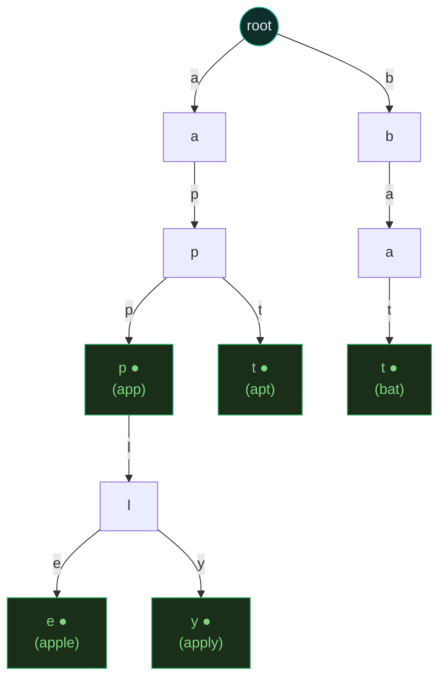
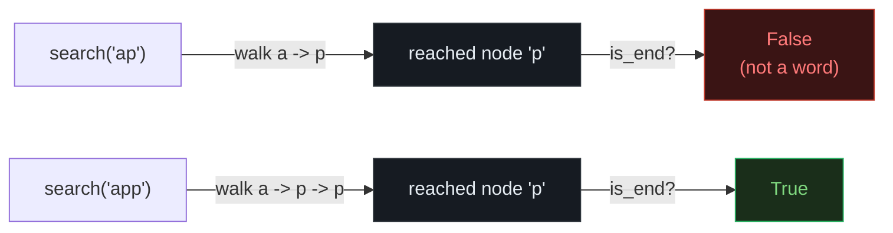
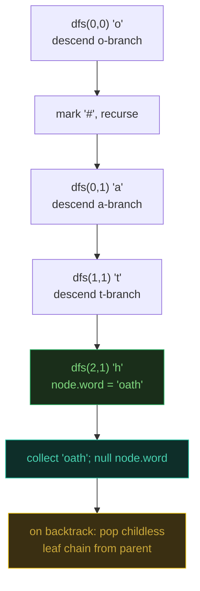

# Trie (Prefix Tree) — Implement Trie, Add/Search Words, Word Search II — A Visual, Worked-Example Guide

> **Companion code:** [`trie.py`](./trie.py). **Every number is printed by
> `python3 trie.py`** — nothing is hand-computed.
>
> **Live animation:** [`trie.html`](./trie.html) — open in a browser, insert words character by character and watch the prefix tree grow, then search with path highlighting and wildcard branching.

---

## 0. TL;DR — the one idea

> **The analogy (read this first):** A dictionary that stores "car", "cat", and "cart" would waste space repeating the shared "ca" three times. A **trie** stores one path `c → a`, then *splits* — into `r` (car), `t` (cat), and `r → t` (cart). It is a tree whose **edges are characters** and whose **nodes are positions inside words**. Walking from the root spells a string; a node flagged `is_end` marks where a real word terminates.



`is_end` (the green ●) is the **entire point of the data structure**: it is what separates `search("app")` from `starts_with("app")`. Without it, both behave identically. Three interview idioms all reuse this one tree — change *what you walk it for*:

```python
trie.search("app")       # 1. PREFIX OPERATIONS (P208): walk + check is_end
wd.search("b..")         # 2. WILDCARD DICTIONARY (P211): at '.', branch into all children
find_words(board, words) # 3. WORD SEARCH ON GRID (P212): one trie + one grid DFS, prune dead branches
```

---

### Pattern Recognition Signals

| Signal in the problem statement | → Use this pattern |
|---|---|
| "autocomplete", "all words starting with X", "prefix" | ✓ trie `starts_with` / subtree enumeration |
| "insert word, search word, startsWith" (the literal API) | ✓ basic trie (P208) |
| **"search with wildcards"**, `'.'` matches any character | ✓ **trie + DFS branching at `.` (P211)** |
| **"find dictionary words on a board/grid"** (Boggle-style) | ✓ **trie + grid backtracking with pruning (P212)** |
| "replace word with its shortest root/prefix" | ✓ trie; stop at first `is_end` on the walk (P648) |
| "maximum XOR of two numbers" | ✓ binary trie over bits; greedily pick the opposite bit (P421) |
| "prefix + suffix" queries | ✓ insert `suffix#word`; query with `suffix#prefix` (P745) |
| "count words with prefix" / "map sum" | ✓ trie + `count`/value field along the path (P677) |

---

### The Template Skeleton

```python
# The interview starting point — three idioms share TrieNode. Memorize this.

class TrieNode:
    def __init__(self):
        self.children = {}          # char -> TrieNode  (or list[26] for a-z)
        self.is_end = False         # marks end of a complete word
        self.word = None            # full word (grid search P212 only)

class Trie:                                    # P208 Implement Trie
    def __init__(self):
        self.root = TrieNode()

    def insert(self, word):
        node = self.root
        for ch in word:
            node = node.children.setdefault(ch, TrieNode())
        node.is_end = True

    def _find(self, prefix):                   # shared traversal helper
        node = self.root
        for ch in prefix:
            if ch not in node.children:
                return None
            node = node.children[ch]
        return node

    def search(self, word):                    # MUST check is_end
        node = self._find(word)
        return node is not None and node.is_end

    def starts_with(self, prefix):             # is_end NOT checked
        return self._find(prefix) is not None

# --- P211 wildcard search: '.' branches into ALL children ---
def wildcard_search(root, pattern):
    def dfs(node, i):
        if i == len(pattern):
            return node.is_end                 # check is_end even with wildcards
        ch = pattern[i]
        if ch == ".":
            return any(dfs(c, i + 1) for c in node.children.values())
        return ch in node.children and dfs(node.children[ch], i + 1)
    return dfs(root, 0)
```

---

## 1. Trie fundamentals — character-by-character tree building (P208)

> **The core mechanism:** `insert` walks from the root creating any missing child nodes, then flags `is_end` on the final node. `search` repeats the walk and **also** checks `is_end`; `starts_with` repeats the walk and does **not**. The shared `_find` helper is the whole API.

### Worked example — 5 words, 19 characters, 10 nodes

> From `trie.py` Section A. Inserting `app, apple, apply, apt, bat` character by character shows prefix compression in action: shared prefixes are *walked*, not re-created.

| Insert | chars | new nodes | shared | why |
|---|---|---|---|---|
| `app` | 3 | 3 | 0 | first word, everything is new |
| `apple` | 5 | 2 | 3 | shares `a→p→p`, only `l`,`e` created |
| `apply` | 5 | 1 | 4 | shares `a→p→p→l`, only `y` created |
| `apt` | 3 | 1 | 2 | shares `a→p`, only `t` created |
| `bat` | 3 | 3 | 0 | new root branch, nothing shared |
| **total** | **19** | **10** | **9** | **47% prefix compression** |

> From `trie.py` Section A: 19 raw characters collapse into **10 trie nodes** (+ root = 11). The 9 saved characters live entirely on shared prefixes.

The resulting tree (verbatim from `render_tree`):

```
root
|-- a
|   L__ p
|       |-- p (*)          <- app
|       |   L__ l
|       |       |-- e (*)  <- apple
|       |       L__ y (*)  <- apply
|       L__ t (*)          <- apt
L__ b
    L__ a
        L__ t (*)          <- bat
```

### search vs starts_with — the `is_end` flag

> From `trie.py` Section A. Same walk, different termination check.

| query | `search` | `starts_with` | reason |
|---|---|---|---|
| `"app"` | **True** | True | `app` was inserted → `is_end` set |
| `"ap"` | **False** | True | walked fine, but node has no `is_end` |
| `"appl"` | **False** | True | prefix of `apple`, not a word itself |
| `"xyz"` | **False** | False | dead branch — walk fails immediately |
| `""` | depends | **True** | empty prefix always reaches the root |



---

## 2. Wildcard dictionary search — `'.'` branches into all children (P211)

> **Problem:** design a `WordDictionary` whose `search` accepts `'.'` as a wildcard matching any single character.
> **Key insight:** at a `'.'`, the trie cannot follow one edge — it must try **every** child. This is a DFS over the trie node space, pruning branches that have no matching child.

### Worked example — `addWord("bad","dad","mad")`, then search

> From `trie.py` Section B. Three words sharing the `?ad` shape.

```
root
|-- b
|   L__ a
|       L__ d (*)
|-- d
|   L__ a
|       L__ d (*)
L__ m
    L__ a
        L__ d (*)
```

| query | result | why |
|---|---|---|
| `search("pad")` | False | exact walk fails — no `p` child at root |
| `search("bad")` | True | exact match |
| `search(".ad")` | True | `.` fans into b/d/m; each walks `a→d` to an `is_end` |
| `search("b..")` | True | `b` then `.`→`a` then `.`→`d`, reaches `is_end` |
| `search("...")` | True | all three branches complete |
| `search("..")` | **False** | two dots, but no 2-letter word has `is_end` |

### Trace of `search(".ad")` — the DFS fans out at depth 0

> From `trie.py` Section B. The `.` at depth 0 tries root children in sorted order; the first success (`b→a→d`) short-circuits the rest.

| depth | via | char | is_end |
|---|---|---|---|
| 0 | (root) | `.` | False |
| 1 | `b` | `a` | False |
| 2 | `a` | `d` | False |
| 3 | `d` | *(end)* | **True** |

> **Gotcha:** even with wildcards, the recursion **must** check `is_end` when `i == len(pattern)`. A pattern that walks a valid prefix but stops short of a word end returns `False` — `search("..")` is `False` because "ba"/"da"/"ma" are prefixes, not words.

---

## 3. Word Search II — one trie + one grid DFS, pruned (P212)

> **Problem:** given an `m × n` board of characters and a list of `words`, return every word that can be spelled by walking to adjacent cells (no reuse).
> **Key insight:** the naive approach runs a separate backtracking DFS per word — `O(W × M×N × 4^L)`. Instead, build **one trie from all words**, then run a **single** grid DFS that follows trie edges. When the walk leaves the trie (no matching child), prune the entire branch immediately.

### Worked example — the LeetCode sample

> From `trie.py` Section C.

```
board:          words = [oath, pea, eat, rain]
o a a n
e t a e
i h k r
i f l v
```

The trie built from the four words:

```
root
|-- e
|   L__ a
|       L__ t (*)
|-- o
|   L__ a
|       L__ t
|           L__ h (*)
|-- p
|   L__ e
|       L__ a (*)
L__ r
    L__ a
        L__ i
            L__ n (*)
```

### The grid path that spells `oath`

> From `trie.py` Section C. The DFS descends the `o` branch, following adjacent cells.

| step | char | cell | direction |
|---|---|---|---|
| 0 | `o` | (0,0) | start |
| 1 | `a` | (0,1) | right |
| 2 | `t` | (1,1) | down |
| 3 | `h` | (2,1) | down → **word collected** |



> `find_words(board, words)` → **`['eat', 'oath']`**. `"pea"` never starts (no `p` on the board); `"rain"` has no connected `r→a→i→n` path.

### The two pruning moves that kill the TLE

> From `trie.py` Section C. The trie starts with **15 nodes** (incl root). After finding `oath` and `eat`, their leaf chains are popped, so re-scanning touches a much smaller tree.

1. **Null the word on collection:** `node.word = None` after appending, so the same word is never found twice.
2. **Pop childless branches:** after backtracking, if a child has no children and no word, `del parent.children[ch]`. This shrinks the trie as words are consumed, accelerating the rest of the scan.

```python
# the pruning core (from trie.py find_words)
def dfs(r, c, parent):                       # NOTE: pass the PARENT, not current
    ch = board[r][c]
    if ch not in parent.children: return     # dead end - leave the trie
    node = parent.children[ch]
    if node.word:                            # found a word
        found.append(node.word)
        node.word = None                     # (1) don't find it again
    board[r][c] = "#"                        # mark visited in-place (O(1) space)
    for nr, nc in neighbors(r, c):
        if board[nr][nc] != "#":
            dfs(nr, nc, node)
    board[r][c] = ch                         # RESTORE on backtrack (gotcha #3)
    if not node.children and node.word is None:
        del parent.children[ch]              # (2) prune the dead branch
```

---

### Complexity

| Operation | Time | Space |
|---|---|---|
| insert / search / starts_with | O(L) | O(N·L) total for the trie |
| wildcard search (k dots) | O(s^k · L) worst case | O(L) stack |
| all words with prefix P | O(L + results) | O(results) |
| word search II (M×N grid) | O(M·N · 4^L) worst case | O(W·L) trie + O(L) stack |
| delete with pruning | O(L) | O(L) stack |

> L = word length, N = number of words, s = alphabet size, W = number of search words.

### Killer Gotchas

- **`is_end` is the whole point.** `search("app")` must check `node.is_end`. If only `"apple"` was inserted, `search("app")` is `False` but `starts_with("app")` is `True`. Forgetting the check collapses the two methods.
- **Empty string.** `search("")` returns `root.is_end`; `starts_with("")` is always `True` (the root is reachable in zero steps).
- **Grid DFS — restore the cell.** Set `board[r][c] = '#'` before recursing, restore `board[r][c] = ch` after. Forgetting the restore silently breaks every subsequent search from a sibling cell.
- **Grid DFS — prune or TLE.** After collecting a word, null `node.word` **and** pop childless nodes from their parent. Without this, the same word is found repeatedly and dead branches are re-walked.
- **Pass the parent node** into the grid DFS (not the current node) so you hold the reference needed to `del parent.children[ch]`.
- **Wildcard `...` can be expensive.** `k` dots means `s^k` branches. The trie prunes branches with no matching child, but an all-dot query over a dense trie still fans out widely.
- **`dict` children vs `array[26]`.** `dict` handles any alphabet and is space-efficient for sparse trees; `array[26]` is ~3–5× faster per step but wastes memory. Use `array[26]` only when the problem guarantees lowercase English and performance matters.

### Problem Table

| Problem | Essence | Key Trick |
|---|---|---|
| P208 Implement Trie | Foundation: insert/search/starts_with | `_find()` helper shared by both; `search` checks `is_end`, `starts_with` checks reachability only |
| P211 Add & Search Words | Trie + wildcard `.` | DFS with index `dfs(node, word, i)`; at `.`, iterate all `node.children.values()`; check `is_end` at end |
| P212 Word Search II | Build trie from words, DFS board along trie edges | Store `word` at leaf (not `is_end`); in-place `'#'` marking; prune: null word + pop empty children |
| P421 Max XOR of Two Numbers | Binary trie over bits | Greedily choose the opposite bit at each level |
| P648 Replace Words | Insert roots; find shortest prefix match | Walk the trie; stop at the first `is_end` and replace |
| P677 Map Sum Pairs | Store value at `is_end`; prefix sum | Subtree DFS or a `count`/`sum` field along the path |
| P745 Prefix & Suffix Search | Dual prefix matching | Insert `suffix#word`; query with `suffix#prefix` |
| P1268 Search Suggestions | Top-3 lexicographic matches per prefix | Sort words; binary-search each prefix; take first 3 |
| P472 Concatenated Words | Split word into ≥2 dictionary pieces | Sort by length; insert word **after** checking it (avoid self-match) |
