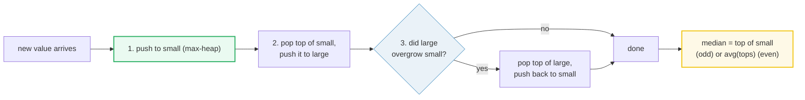
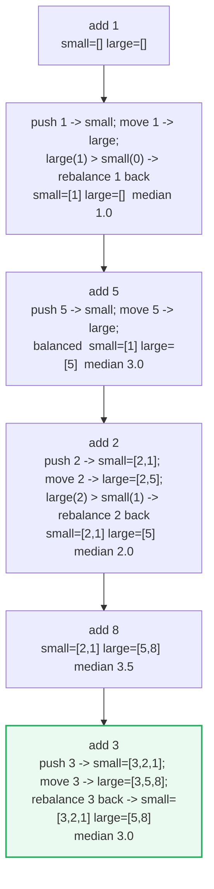
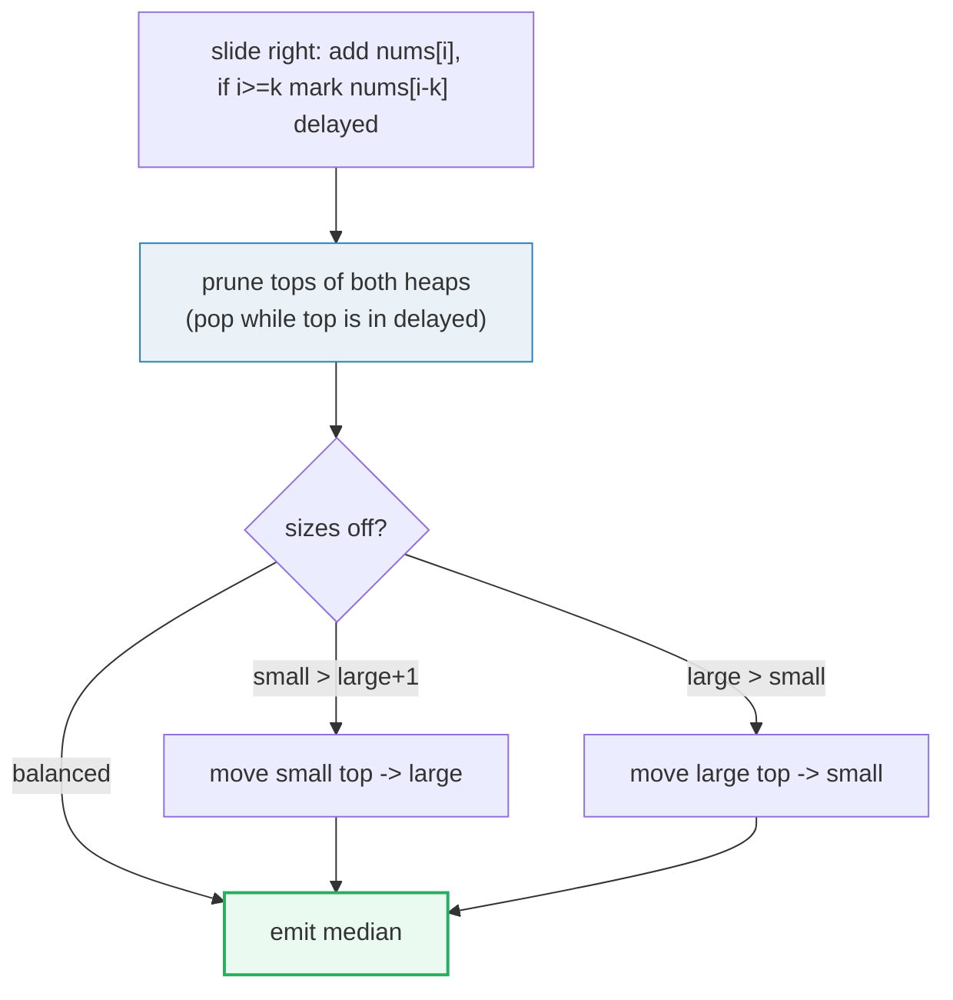
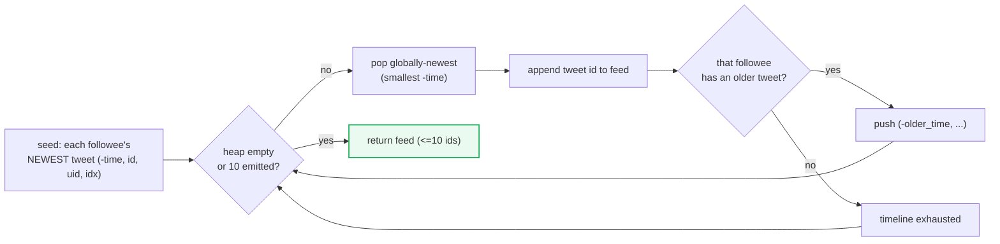

# Two Heaps — P295, P480, P355 — A Visual, Worked-Example Guide

> **Companion code:** [`two_heaps.py`](./two_heaps.py). **Every number is printed by
> `python3 two_heaps.py`** — nothing is hand-computed.
>
> **Live animation:** [`two_heaps.html`](./two_heaps.html) — open in a browser.

---

## 0. TL;DR — the one idea

> **The analogy (read this first):** A pile of numbers has a middle (the median). Split
> the pile into two balanced halves — a **max-heap of the smaller half** (so the *largest*
> of the smalls sits on top) and a **min-heap of the larger half** (so the *smallest* of
> the bigs sits on top). The median is then **always at a heap top** — one peek for odd
> count, an average of two peeks for even. No sort, no scan.

Python's `heapq` is a *min*-heap only, so every "max-heap" here is faked by **negating the
values** on the way in and negating again on the way out. That one trick is the entire
reason both halves of the median, *and* the newest-first tweet ordering in P355, share the
same library call.



The three problems in this bundle are the same split-and-peek idea wearing three hats:

| Variant | What you split | Extra trick | Problem |
|---|---|---|---|
| Running median | an unbounded stream | push→move→rebalance (3-step insert) | P295 Median Finder |
| Sliding median | a moving window of size k | **lazy deletion** — never delete from inside a heap | P480 Sliding Window Median |
| Tweet feed | k followees' timelines | negate timestamp → min-heap behaves as max-heap | P355 Design Twitter |

---

### Pattern Recognition Signals

| Signal in the problem statement | → Use two heaps |
|---|---|
| "**median** of a data stream / running median" | ✓ the canonical signal |
| "**median** of every sliding window of size k" | ✓ + lazy deletion |
| Need the **boundary value** between a lower and an upper half, dynamically | ✓ |
| "stream" / "online" + repeated **O(log n) insert, O(1) query** | ✓ |
| Merge k **sorted lists**, pop the globally-largest each step | ✓ negate key → max-heap |
| "find the **k-th** / middle element under insertions and deletions" | ✓ |

---

### The Template Skeleton

```python
import heapq

# --- P295 Median of a Data Stream: the 3-step insert ----------------------
class MedianFinder:
    def __init__(self):
        self.small = []   # max-heap of the SMALLER half (stores -val)
        self.large = []   # min-heap of the LARGER  half (stores  val)

    def addNum(self, num):
        heapq.heappush(self.small, -num)                 # 1. always enter via small
        largest_in_small = -heapq.heappop(self.small)
        heapq.heappush(self.large, largest_in_small)     # 2. funnel the top up
        if len(self.large) > len(self.small):            # 3. large overgrew: pay back
            heapq.heappush(self.small, -heapq.heappop(self.large))

    def findMedian(self):
        if len(self.small) > len(self.large):            # odd count -> small holds extra
            return float(-self.small[0])
        return (-self.small[0] + self.large[0]) / 2.0    # even -> avg the two tops
```

> **Why no `if num < small[0]`?** The 3-step insert routes *every* new value through
> `small` first, then moves small's top to `large`. This handles all cases (smaller, larger,
> first element, duplicates) with zero comparisons — the canonical "don't be clever" win.

---

## 1. P295 Find Median from Data Stream — Running Median

> **Problem:** Design a class supporting `addNum(int)` and `findMedian() -> float` over an
> unbounded stream, both fast.
> **Key insight:** Two balanced heaps hold the two halves; the median is a heap-top peek.
> The invariant `len(small) ∈ {len(large), len(large)+1}` is what makes `findMedian` O(1).

> From `two_heaps.py` Section "P295 Find Median from Data Stream":

```
stream = [1, 5, 2, 8, 3]

add  moved(small->large)  rebalance?            small       large       median
--------------------------------------------------------------------
  1                  1    yes: 1 large->small   [1]         []            1.0
  5                  5    no                    [1]         [5]           3.0
  2                  2    yes: 2 large->small   [2, 1]      [5]           2.0
  8                  8    no                    [2, 1]      [5, 8]        3.5
  3                  3    yes: 3 large->small   [3, 2, 1]   [5, 8]        3.0

>> running medians = [1.0, 3.0, 2.0, 3.5, 3.0]
>> median_finder([1,5,2,8,3]) = [1.0, 3.0, 2.0, 3.5, 3.0]   [check] OK
>> [1] -> [1,2] -> median 1.5;  +3 -> median 2.0   [check] OK
```

| add | moved small→large | rebalance? | small (max-heap) | large (min-heap) | median |
|---|---|---|---|---|---|
| 1 | 1 | yes: `1 large→small` | `[1]` | `[]` | **1.0** |
| 5 | 5 | no | `[1]` | `[5]` | **3.0** |
| 2 | 2 | yes: `2 large→small` | `[2, 1]` | `[5]` | **2.0** |
| 8 | 8 | no | `[2, 1]` | `[5, 8]` | **3.5** |
| 3 | 3 | yes: `3 large→small` | `[3, 2, 1]` | `[5, 8]` | **3.0** |

**Reading the table:** `small` is shown max-first (peek = largest of the lower half = the
median boundary); `large` is shown min-first (peek = smallest of the upper half). After
adding `3`, the sorted stream is `[1,2,3,5,8]` and the boundary sits on `3` — exactly
`-small[0]`. Rebalance fires exactly when an insert lands on the "even total" side and would
make `large` outgrow `small`; the pay-back move restores `len(small) == len(large)+1`.



---

## 2. P480 Sliding Window Median — Lazy Deletion

> **Problem:** Return the median of each sliding window of size `k` over `nums`.
> **Key insight:** `heapq` has **no O(log n) arbitrary delete**. Hunting an expiring element
> inside a heap would be O(n). Instead, **lazy deletion**: record the leaving value in a
> `delayed` counter and decrement the *logical* size; physically pop the stale entry only
> when it bubbles to the top. Because the median reads only the tops, pruning only the tops
> is sufficient.

> From `two_heaps.py` Section "P480 Sliding Window Median":

```
nums = [1, 3, -1, -3, 5, 3, 6, 7]   k = 3

win  window          added  removed  small        large        median
--------------------------------------------------------------------
 0:2  [1, 3, -1]         -1        -  [1, -1]      [3]            1.0
 1:3  [3, -1, -3]        -3        1  [-1, -3]     [3]           -1.0
 2:4  [-1, -3, 5]         5        3  [-1, -3]     [5]           -1.0
 3:5  [-3, 5, 3]          3       -1  [3, -3]      [5]            3.0
 4:6  [5, 3, 6]           6       -3  [5, 3]       [6]            5.0
 5:7  [3, 6, 7]           7        5  [6, 3]       [7]            6.0

>> medianSlidingWindow([1, 3, -1, -3, 5, 3, 6, 7], 3)
   = [1.0, -1.0, -1.0, 3.0, 5.0, 6.0]
>> expected [1.0, -1.0, -1.0, 3.0, 5.0, 6.0]   [check] OK
>> window([1,2,3,4,2,3,1,4,1], 3) = [2.0, 3.0, 3.0, 3.0, 2.0, 3.0, 1.0]   [check] OK
>> window([1,4,2,3], 4) = [2.5]   [check] OK
```

| win | window | added | removed | small | large | median |
|---|---|---|---|---|---|---|
| 0:2 | `[1, 3, -1]` | -1 | — | `[1, -1]` | `[3]` | **1.0** |
| 1:3 | `[3, -1, -3]` | -3 | 1 | `[-1, -3]` | `[3]` | **-1.0** |
| 2:4 | `[-1, -3, 5]` | 5 | 3 | `[-1, -3]` | `[5]` | **-1.0** |
| 3:5 | `[-3, 5, 3]` | 3 | -1 | `[3, -3]` | `[5]` | **3.0** |
| 4:6 | `[5, 3, 6]` | 6 | -3 | `[5, 3]` | `[6]` | **5.0** |
| 5:7 | `[3, 6, 7]` | 7 | 5 | `[6, 3]` | `[7]` | **6.0** |

**The two operations per slide.** At index `i` the right end adds `nums[i]`; if `i ≥ k` the
left end removes `nums[i−k]`. Removal classifies the value by comparing it with the current
`small` top (`val ≤ -small[0]` ⇒ it lived in `small`) — **without searching the heap** — then
bumps `delayed[val]`. Pruning happens next, on both tops, before rebalance. The
`small`/`large` columns above show the *logical* split of the window (the multiset each half
holds once every lazy deletion has surfaced), which is what the median actually sees.



---

## 3. P355 Design Twitter — Negated-Timestamp Max-Heap Merge

> **Problem:** Build a Twitter with `postTweet`, `follow`/`unfollow`, and `getNewsFeed`
> returning the 10 most-recent tweets of a user and their followees.
> **Key insight:** Each followee's timeline is already newest-last in a list. Seed a min-heap
> with each followee's *newest* tweet, keyed by `-time` so the globally-newest tweet sits on
> top (the same negate-to-max-heap trick as `small`). Pop it, emit it, then push that
> followee's *next*-newest tweet — a **k-way merge** of sorted lists in `O(10 · log F)` for
> `F` followees.

> From `two_heaps.py` Section "P355 Design Twitter":

```
user1 tweets (id, time): id=1 t=2, id=3 t=1, id=5 t=0
user2 tweets (id, time): id=7 t=4, id=10 t=3
user1 follows user2

step  action
--------------------------------------------------------------------
  0  seed heap = user1 newest = (t=2, id=1), user2 newest = (t=4, id=7)
  1  emit id=7 (t=4, user2); push next user2 id=10 (t=3)
  2  emit id=10 (t=3, user2); timeline exhausted
  3  emit id=1 (t=2, user1); push next user1 id=3 (t=1)
  4  emit id=3 (t=1, user1); push next user1 id=5 (t=0)
  5  emit id=5 (t=0, user1); timeline exhausted

>> getNewsFeed(1) = [7, 10, 1, 3, 5]
>> expected [7, 10, 1, 3, 5]   [check] OK
>> LeetCode driver: [5] / [6,5] / [5]   [check] OK
```

| step | heap pop | emits | then push |
|---|---|---|---|
| 0 (seed) | — | — | user1 `(t=2,id=1)`, user2 `(t=4,id=7)` |
| 1 | `(t=4, id=7)` user2 | **7** | user2 next `(t=3, id=10)` |
| 2 | `(t=3, id=10)` user2 | **10** | — (exhausted) |
| 3 | `(t=2, id=1)` user1 | **1** | user1 next `(t=1, id=3)` |
| 4 | `(t=1, id=3)` user1 | **3** | user1 next `(t=0, id=5)` |
| 5 | `(t=0, id=5)` user1 | **5** | — (exhausted) |

**Why negate the timestamp?** A min-heap pops the *smallest* key first; we want the
*largest* timestamp (newest). `-time` flips the order so `heapq` behaves as a max-heap on
time — the exact same negation that turns `small` into a max-heap in MedianFinder. The
heap never holds more than one entry per followee, so the merge is bounded by `F`, not by
total tweets.



---

## Complexity

| Operation | Time | Space |
|---|---|---|
| `MedianFinder.addNum` (P295) | O(log n) | O(n) |
| `MedianFinder.findMedian` (P295) | **O(1)** | O(1) |
| `medianSlidingWindow` overall (P480) | O(n log k) | O(k) |
| Per-slide add + lazy-remove (P480) | O(log k) amortized | O(k) |
| `getNewsFeed` (P355) | O(10 · log F) ≈ O(log F) | O(F) |
| `postTweet` / `follow` / `unfollow` (P355) | O(1) / O(1) / O(1) | O(T + F) |

**Why P480 is O(n log k), not O(nk):** each element is pushed and popped at most once per
heap (the lazy-deleted entries are popped exactly once when they surface), so the total work
over `n` slides is `O(n log k)`. Lazy deletion is what buys the `log k` — eager deletion
from inside a heap would be `O(k)` per slide.

---

## Killer Gotchas

- **Don't be clever on insert:** never write `if num < small[0]: push to small else: push
  to large`. Always push to `small`, pop its top to `large`, then rebalance. The 3-step
  insert handles the first element, duplicates, and the boundary with zero branches.
- **`heapq` is min-only — negate for max:** `small` stores `-val`; every read of the max is
  `-small[0]`. Forgetting the negation on *either* the push or the read silently produces a
  min-heap where you wanted a max-heap.
- **Lazy deletion keys on the VALUE, not `(val, idx)`:** the median is a property of the
  *multiset*, so you never need to know *which* copy of a value expired — only that one
  fewer copy is logically present. Value-keying sidesteps the "is this boundary `3` in small
  or large?" ambiguity that breaks index-keyed classifiers when the boundary value is
  duplicated. (Store `(val, idx)` in the heap only if a *later* problem needs per-element
  identity.)
- **Prune before you peek:** the *only* thing that matters is the heap top. Before every
  median read and every size check, pop while `delayed[top] > 0`. Stale entries buried deep
  inside are harmless — they cost nothing until they surface.
- **Track logical sizes, not `len(heap)`:** `len(self.small)` includes lazily-deleted ghosts.
  Maintain `ssz`/`lsz` counters and decrement them on `remove`; never derive the size from
  the physical heap length.
- **Invariant is `len(small) ∈ {len(large), len(large)+1}`:** small always holds the extra
  element on odd counts. Forgetting the `+1` pay-back makes `findMedian` read the wrong heap
  on odd totals.
- **Negate the timestamp in P355:** `-time` turns `heapq` into a max-heap on recency. A
  plain min-heap would serve the *oldest* tweet first — the feed comes out reversed.
- **`getNewsFeed` includes the user themself:** the followee set is `following[uid] | {uid}`.
  Forgetting to union self drops the user's own tweets from their feed.
- **Integer overflow in other languages (P480):** use `(a + b) / 2.0`, never `(a + b) >> 1`,
  to merge the two tops — values reach ±2³¹. Python ints are unbounded, but write the safe
  form for portability.

---

## Problem Table

| Problem | Difficulty | Essence | Key Trick |
|---|---|---|---|
| P295 Find Median from Data Stream | Hard | running median of a stream | max-heap lower half + min-heap upper half; 3-step insert; invariant `\|small\| ∈ {\|large\|, \|large\|+1}` |
| P480 Sliding Window Median | Hard | median of every size-k window | two heaps + `delayed` Counter (value-keyed); lazy deletion, prune tops only |
| P355 Design Twitter | Medium | 10 newest tweets across followees | k-way merge of timelines via `-time` max-heap; one heap entry per followee |
| P295 (variant) | Hard | median with deletions | same as P480 engine |
| P4 Median of Two Sorted Arrays | Hard | median across two sorted arrays | binary search on the smaller array's partition (not heaps, but same "split into halves" idea) |
| P703 Kth Largest in a Stream | Easy | maintain the k-th largest | min-heap of size k (single heap; two-heaps generalizes it) |
| P1825 Finding MK Average | Hard | sliding-window mean, drop k extremes | three structures (min-heap, max-heap, sorted middle) — two-heaps extended |
