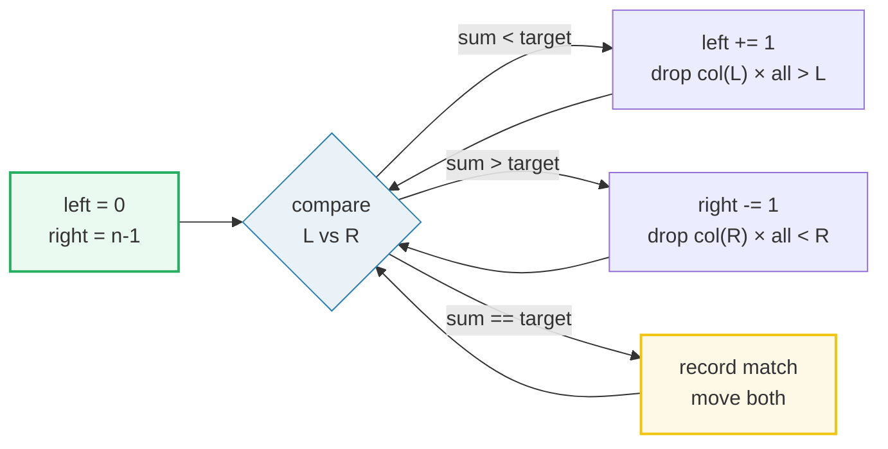
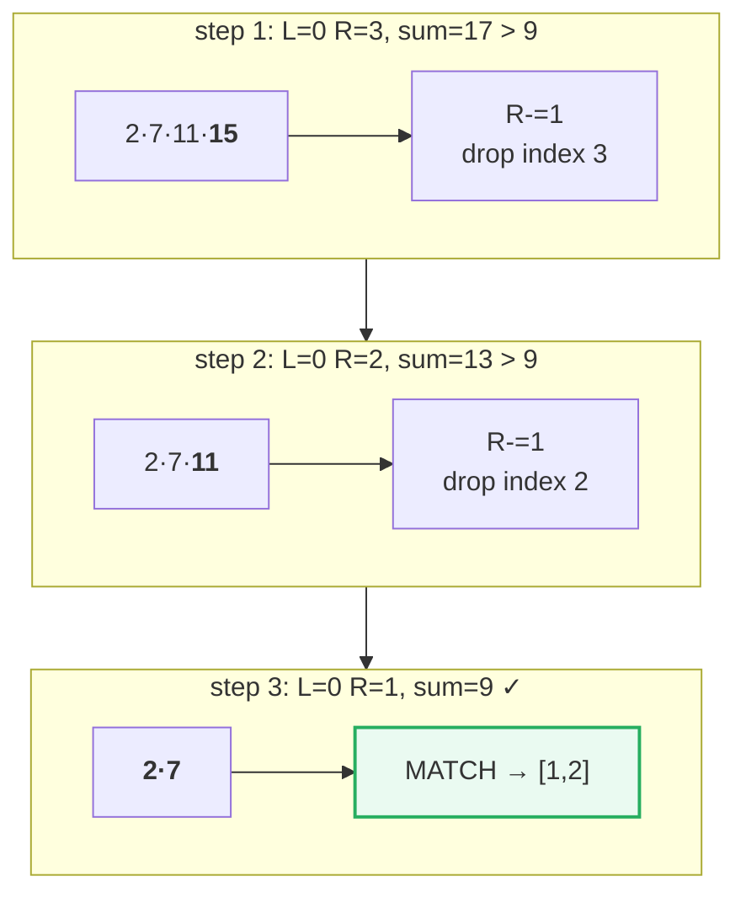
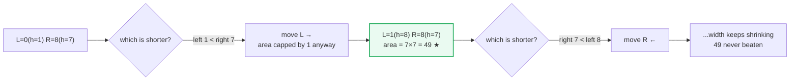
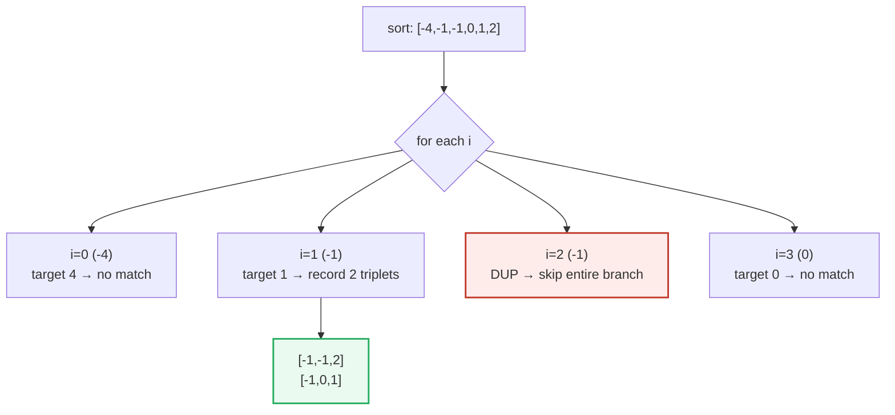

# Two Pointers — Container With Most Water, 3Sum, Two Sum II — A Visual, Worked-Example Guide

> **Companion code:** [`two_pointers.py`](./two_pointers.py). **Every number is printed by
> `python3 two_pointers.py`** — nothing is hand-computed.
>
> **Live animation:** [`two_pointers.html`](./two_pointers.html) — open in a browser.

---

## 0. TL;DR — the one idea

> **The analogy (read this first):** Put one finger at the start of a sorted row of
> numbers and one at the end. Each comparison tells you to throw away *one whole
> side* of the remaining search space — you never need to revisit it. Two fingers
> walk inward, eliminating columns of candidate pairs, until they meet. That is the
> entire pattern: **sorted order + directional elimination = O(n) instead of O(n²).**



The three problems in this bundle are the same idea wearing three hats:

| Variant | Pointer setup | Problem | Why move one side |
|---|---|---|---|
| Converging | L→ ←R, move by sum | P167 Two Sum II | sorted order makes the sum monotonic |
| Greedy area | L→ ←R, move shorter | P011 Container With Most Water | width always shrinks; only taller can help |
| Nested | fix i, then converge on i+1..n | P015 3Sum | outer loop × inner O(n) two-pointer |

---

### Pattern Recognition Signals

| Signal in the problem statement | → Use two pointers |
|---|---|
| Input is **sorted** (or may be sorted cheaply) | ✓ converging variant |
| Find a **pair / triplet** summing to a target | ✓ converging / nested |
| Maximize an **area / width-limited value** (`min(h) × width`) | ✓ greedy-area variant |
| Need **O(1) extra space** (no hash map allowed) | ✓ over hash map |
| "**1-indexed**" or "return indices" on a sorted array | ✓ Two Sum II |
| All **unique** triplets/pairs (dedup required) | ✓ nested + sort dedup |

---

### The Template Skeleton

```python
# Variant 1 — converging pointers (pair sum on a sorted array)
def two_sum_ii(numbers: list[int], target: int) -> list[int]:
    left, right = 0, len(numbers) - 1
    while left < right:
        current = numbers[left] + numbers[right]
        if current == target:
            return [left + 1, right + 1]   # 1-indexed!
        elif current < target:
            left += 1                      # sum too small → need bigger
        else:
            right -= 1                     # sum too big → need smaller
    return []

# Variant 2 — greedy area (move the shorter side)
def max_area(height: list[int]) -> int:
    left, right = 0, len(height) - 1
    best = 0
    while left < right:
        area = min(height[left], height[right]) * (right - left)
        best = max(best, area)
        if height[left] < height[right]:
            left += 1
        else:
            right -= 1
    return best

# Variant 3 — nested (3Sum): fix i, converge on the rest
def three_sum(nums: list[int]) -> list[list[int]]:
    nums = sorted(nums)
    out = []
    for i in range(len(nums) - 2):
        if i > 0 and nums[i] == nums[i - 1]:     # outer dedup
            continue
        left, right = i + 1, len(nums) - 1
        while left < right:
            total = nums[i] + nums[left] + nums[right]
            if total == 0:
                out.append([nums[i], nums[left], nums[right]])
                left += 1; right -= 1
                while left < right and nums[left] == nums[left - 1]:   left += 1
                while left < right and nums[right] == nums[right + 1]: right -= 1
            elif total < 0:
                left += 1
            else:
                right -= 1
    return out
```

---

## 1. P167 Two Sum II — Input Array Is Sorted

> **Problem:** Given a **1-indexed sorted** array, return the two indices whose values
> sum to `target`. Exactly one solution exists.
> **Key insight:** Sorted order makes the pair sum monotonic. If `num[L]+num[R]` is too
> big, no element left of `R` paired with `R` can fix it — so `R` is *eliminated*.

> From `two_pointers.py` Section "P167 Two Sum II":

```
array = [2, 7, 11, 15]   target = 9
step   L   R  num[L]  num[R]    sum  action            eliminated
------------------------------------------------------------------------------
   1   0   3       2      15     17  R -= 1 (too big)  col(3) ⊗ all col(<3)
   2   0   2       2      11     13  R -= 1 (too big)  col(2) ⊗ all col(<2)
   3   0   1       2       7      9  MATCH             → indices [1, 2]

>> two_sum_ii([2, 7, 11, 15], 9) = [1, 2]   [check] OK
>> two_sum_ii([2, 3, 4], 6) = [1, 3]   [check] OK
```

| step | L | R | num[L] | num[R] | sum | action | eliminated |
|---|---|---|---|---|---|---|---|
| 1 | 0 | 3 | 2 | 15 | 17 | R -= 1 (too big) | col 3 × every col < 3 |
| 2 | 0 | 2 | 2 | 11 | 13 | R -= 1 (too big) | col 2 × every col < 2 |
| 3 | 0 | 1 | 2 | 7 | 9 | MATCH | → 1-indexed `[1, 2]` |

Each step crosses off an entire **column** of the n×n pair matrix, never to be
re-examined — that is why the scan is O(n) and not O(n²).



---

## 2. P011 Container With Most Water

> **Problem:** Choose two lines `i, j` to maximize `min(h[i], h[j]) × (j − i)`.
> **Key insight:** Width only ever shrinks as pointers approach. The **shorter** line
> caps the height, so the only move that can possibly improve area is to abandon the
> shorter side. This is a proof-by-case, not a heuristic.

> From `two_pointers.py` Section "P011 Container With Most Water":

```
array = [1, 8, 6, 2, 5, 4, 8, 3, 7]
step   L   R   hL   hH    h   w   area   best  move
----------------------------------------------------------------------
   1   0   8    1    7    1   8      8      8  L += 1 (hL shorter)
   2   1   8    8    7    7   7     49     49  R -= 1 (hR shorter)
   3   1   7    8    3    3   6     18     49  R -= 1 (hR shorter)
   4   1   6    8    8    8   5     40     49  R -= 1 (hR shorter)
   5   1   5    8    4    4   4     16     49  R -= 1 (hR shorter)
   6   1   4    8    5    5   3     15     49  R -= 1 (hR shorter)
   7   1   3    8    2    2   2      4     49  R -= 1 (hR shorter)
   8   1   2    8    6    6   1      6     49  R -= 1 (hR shorter)

>> max_area = 49
[check] max_area == 49 OK
```

| step | L | R | hL | hR | h | w | area | best | move |
|---|---|---|---|---|---|---|---|---|---|
| 1 | 0 | 8 | 1 | 7 | 1 | 8 | 8 | 8 | L += 1 |
| 2 | 1 | 8 | 8 | 7 | 7 | 7 | **49** | **49** | R -= 1 |
| 3 | 1 | 7 | 8 | 3 | 3 | 6 | 18 | 49 | R -= 1 |
| 4 | 1 | 6 | 8 | 8 | 8 | 5 | 40 | 49 | R -= 1 |
| 5 | 1 | 5 | 8 | 4 | 4 | 4 | 16 | 49 | R -= 1 |
| 6 | 1 | 4 | 8 | 5 | 5 | 3 | 15 | 49 | R -= 1 |
| 7 | 1 | 3 | 8 | 2 | 2 | 2 | 4 | 49 | R -= 1 |
| 8 | 1 | 2 | 8 | 6 | 6 | 1 | 6 | 49 | R -= 1 |

The best area (49) is found at step 2 and is never beaten: moving the shorter side
discards every pairing that could not have helped anyway.



---

## 3. P015 3Sum

> **Problem:** Return all **unique** triplets summing to 0.
> **Key insight:** Sort, then for each fixed `i`, run the converging two-pointer
> (Variant 1) on `nums[i+1..n-1]` looking for target `−nums[i]`. The hard part is the
> **three-level deduplication** that keeps triplets unique.

> From `two_pointers.py` Section "P015 3Sum":

```
sorted = [-4, -1, -1, 0, 1, 2]

fix i=0 nums[i]=-4  inner target = 4
    L=1 R=5 sum=-3 < 0  → L += 1
    L=2 R=5 sum=-3 < 0  → L += 1
    L=3 R=5 sum=-2 < 0  → L += 1
    L=4 R=5 sum=-1 < 0  → L += 1

fix i=1 nums[i]=-1  inner target = 1
    L=2 R=5 → triplet [-1, -1, 2]  (record)
    L=3 R=4 → triplet [-1, 0, 1]  (record)
i=2 nums[i]=-1 (dup of i-1, skip)

fix i=3 nums[i]=0  inner target = 0
    L=4 R=5 sum=3 > 0  → R -= 1

>> triplets = [[-1, -1, 2], [-1, 0, 1]]
[check] three_sum == [[-1, -1, 2], [-1, 0, 1]] OK
>> three_sum([0,0,0,0]) = [[0, 0, 0]]   [check] OK
```

| fixed i | nums[i] | inner target | inner scan result |
|---|---|---|---|
| 0 | -4 | 4 | no pair reaches 4 (all sums < 0) |
| 1 | -1 | 1 | `[-1,-1,2]` and `[-1,0,1]` recorded |
| 2 | -1 | — | **skipped** (dup of i=1) |
| 3 | 0 | 0 | no pair sums to 0 |

**Why skip i=2?** `nums[2] == nums[1] == -1`; fixing it again would reproduce the same
two triplets. The `i > 0 and nums[i] == nums[i-1]` guard crosses off the whole branch.



**The three dedup levels** (the part that breaks interviews):

1. **Outer `i`:** `if i > 0 and nums[i] == nums[i-1]: continue` — same first element → same triplets.
2. **Inner left, after a match:** `while left < right and nums[left] == nums[left-1]: left += 1`.
3. **Inner right, after a match:** `while left < right and nums[right] == nums[right+1]: right -= 1`.

All three rely on the array being **sorted** so equal values are adjacent.

---

## Complexity

| Operation | Time | Space |
|---|---|---|
| Two Sum II (converging) | O(n) | O(1) |
| Container With Most Water (greedy) | O(n) | O(1) |
| 3Sum (nested) | O(n²) — outer loop × inner O(n) two-pointer | O(1) extra (ignoring output) |
| Sort (prerequisite, 3Sum) | O(n log n) | O(log n) |

**Amortised argument for the O(n) variants:** each pointer moves at most `n` times
and never resets, so total pointer movements ≤ 2n → O(n). For 3Sum the outer loop adds
an `n` multiplier, giving O(n²) — which is **optimal** in the comparison model.

---

## Killer Gotchas

- **The unsorted trap:** Converging two-pointers for sums **require** a sorted array.
  If the input isn't sorted, sort it first — but remember original indices are lost
  (Two Sum II sidesteps this by being 1-indexed on a given-sorted array).
- **Infinite loops on duplicates:** After recording a valid pair/triplet, you **must**
  move both pointers and then `while`-skip over duplicate values — otherwise the loop
  re-finds the same pair forever.
- **3-level dedup or you emit duplicate triplets:** dedup the outer `i`, dedup inner
  left, dedup inner right. Missing any one level yields repeated triplets in 3Sum.
- **`left < right`, not `left <= right`:** a single element cannot be a pair. Using `<=`
  lets pointers cross and can read a self-pair or go out of bounds.
- **1-indexed results:** Two Sum II wants `[left+1, right+1]`. Forgetting the `+1` is
  the single most common off-by-one on this problem.
- **Container With Most Water — move the SHORTER side:** moving the taller side can
  *never* improve area (width drops, height still capped by the short line). Getting
  the comparison backwards silently returns a wrong, plausible-looking answer.

---

## Problem Table

| Problem | Difficulty | Essence | Key Trick |
|---|---|---|---|
| P167 Two Sum II | Medium | pair sum in sorted array | converging pointers; return **1-indexed** |
| P011 Container With Most Water | Medium | maximise `min(h)×width` | move the **shorter** side inward |
| P015 3Sum | Medium | all unique triplets summing to 0 | sort + fix `i` + converging inner; **3-level dedup** |
| P392 Is Subsequence | Easy | is `s` embeddable in `t` | same-direction pointers; advance on char match |
| P532 K-Diff Pairs | Medium | unique pairs with `\|diff\|=k` | sort + same-dir pointers; dedup after match; guard `L==R` |
| P016 3Sum Closest | Medium | triplet nearest to target | nested pointers tracking closest sum |
