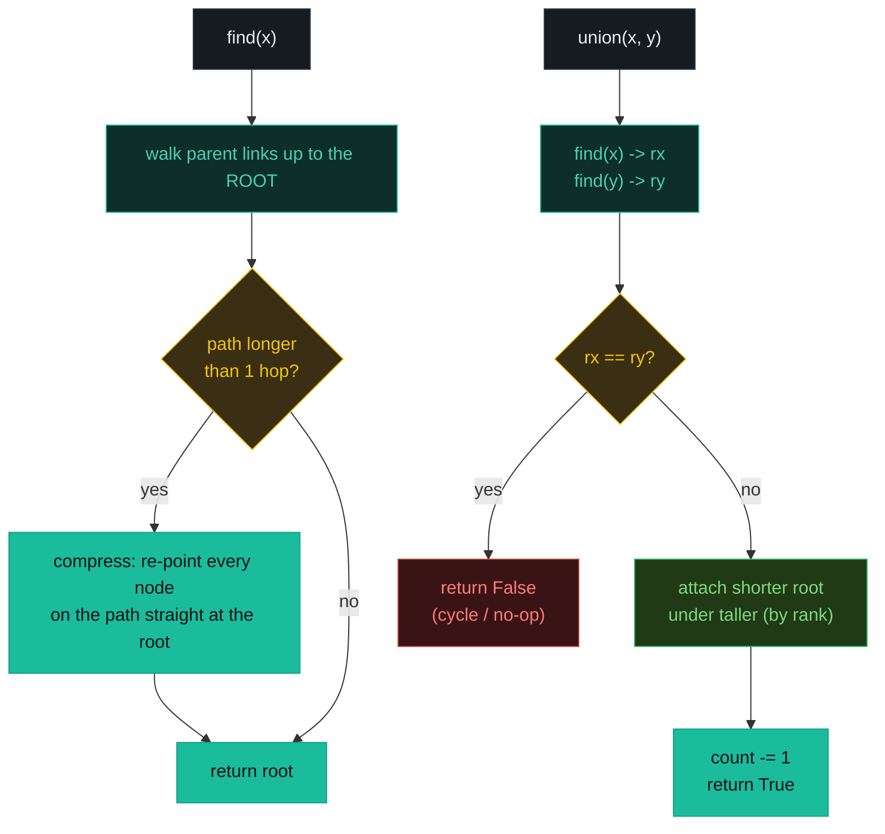
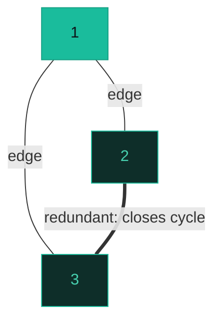
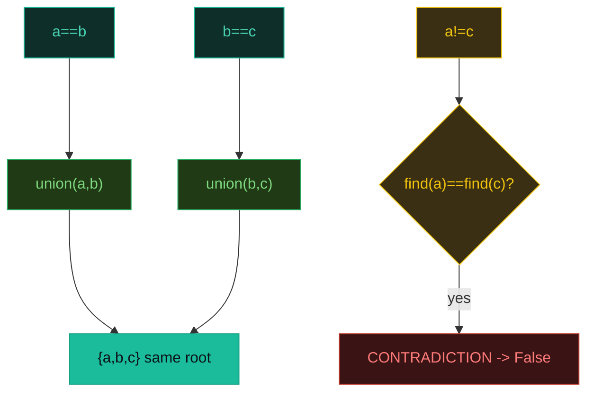

# Union-Find — Connected Components, Redundant Connection, Equality Equations — A Visual, Worked-Example Guide

> **Companion code:** [`union_find.py`](./union_find.py). **Every number is printed by
> `python3 union_find.py`** — nothing is hand-computed.
>
> **Live animation:** [`union_find.html`](./union_find.html) — open in a browser, watch sets merge and paths compress.

---

## 0. TL;DR — the one idea

> **The analogy (read this first):** Picture every element as a person, and every connected group as a club that elects one **boss** (the root). Two questions are all you ever answer: *"who is your boss?"* (`find`) and *"merge my club and yours"* (`union`). The magic is two cheap tricks applied together — **path compression** (on the way up to the boss, re-point everyone you passed straight at the boss, flattening the tree) and **union by rank** (always attach the shorter tree under the taller boss). With both, every operation is amortized O(α(n)) — the inverse Ackermann function, which is ≤ 4 for any input that fits in the universe.
>
> The whole pattern is one class with two methods:
> ```
> find(x):   walk parent links to the root, compressing the path on the way back
> union(x,y): find both roots; if different, make one boss report to the other
>             (by rank); returns False iff they already shared a root (= cycle)
> ```



**Why "effectively O(1)"?** α(n) (inverse Ackermann) grows so slowly that for any practical n — even 10⁸⁰, the atoms in the universe — α(n) ≤ 4. With both optimizations on, a billion union/find operations cost a few billion steps, not a few trillion.

```mermaid
graph LR
    subgraph OPT["the two optimizations — both required for O(α(n))"]
        A["PATH COMPRESSION<br/>in find()<br/>1 line: flatten the path<br/>to the root"] --> FAST["O(α(n)) amortized<br/>per operation"]
        B["UNION BY RANK<br/>in union()<br/>1 check: attach shorter<br/>under taller root"] --> FAST
    end
    style A fill:#0e2e29,stroke:#1abc9c,color:#48d1b0
    style B fill:#0e2e29,stroke:#1abc9c,color:#48d1b0
    style FAST fill:#1abc9c,stroke:#16a085,color:#0d1117
    style OPT fill:#0d1117,stroke:#30363d
```



---

### Pattern Recognition Signals

| Signal in the problem statement | → Use this pattern |
|---|---|
| "are these **connected?**" / "**count connected components**" in an UNDIRECTED graph | ✓ union-find (P323, P547) |
| "**find the redundant edge**" / "**is there a cycle?**" undirected | ✓ `union` returns False = cycle (P684, P261) |
| satisfiability of **`==` and `!=`** equations over variables | ✓ two passes: union all `==`, then test `!=` (P990) |
| "**dynamic grouping**" — edges added incrementally, query connectivity between adds | ✓ DSU beats BFS/DFS in the incremental case |
| "merge accounts / groups that share a **common key**" | ✓ map keys → int IDs, union within each group (P721) |
| Kruskal's MST / "min cost to connect all points" | ✓ sort edges, union until n−1 merges (P1584) |
| "**directed** graph cycle / topological order" | ✗ DSU is symmetric — use DFS with coloring |
| "shortest path / min steps" on a graph | ✗ use **BFS** |
| "next greater/smaller element" | ✗ use **monotonic stack** |

---

### The Template Skeleton

```python
# The union-find class — memorize find() + union(); BOTH optimizations required.

class UnionFind:
    def __init__(self, n):
        self.parent = list(range(n))
        self.rank   = [0] * n
        self.count  = n                     # of disjoint components

    def find(self, x):                      # PATH COMPRESSION
        if self.parent[x] != x:
            self.parent[x] = self.find(self.parent[x])
        return self.parent[x]

    def union(self, x, y):                  # UNION BY RANK
        rx, ry = self.find(x), self.find(y)
        if rx == ry:
            return False                    # same club -> cycle / no-op
        if self.rank[rx] < self.rank[ry]:
            rx, ry = ry, rx                 # taller root becomes the parent
        self.parent[ry] = rx
        if self.rank[rx] == self.rank[ry]:
            self.rank[rx] += 1              # rank grows ONLY on a tie
        self.count -= 1
        return True

    def connected(self, x, y):
        return self.find(x) == self.find(y)


# ---- 1. COMPONENT COUNT (P323) — count = n - (#successful unions) ----
def count_components(n, edges):
    uf = UnionFind(n)
    for u, v in edges:
        uf.union(u, v)
    return uf.count
# O(n + E·α(n)), O(n) space


# ---- 2. CYCLE DETECTION (P684) — first union that returns False ----
def redundant_connection(edges):
    n = len(edges)
    uf = UnionFind(n + 1)                   # 1-indexed nodes 1..n
    for u, v in edges:
        if not uf.union(u, v):              # False == already connected
            return [u, v]
    return []
# O(E·α(n)), O(n) space


# ---- 3. EQUALITY SATISFIABILITY (P990) — pass1 union ==, pass2 check != ----
def equations_possible(equations):
    uf = UnionFind(26)                      # variables a..z
    for eq in equations:                    # PASS 1: all equalities
        if eq[1] == "=":
            uf.union(ord(eq[0])-97, ord(eq[3])-97)
    for eq in equations:                    # PASS 2: all inequalities
        if eq[1] == "!" and uf.connected(ord(eq[0])-97, ord(eq[3])-97):
            return False                    # forced equal, yet must differ
    return True
# O(N·α(26)) ~ O(N), O(1) space
```

---

## 1. P323 Number of Connected Components

> **Problem:** Given `n` nodes labeled 0..n−1 and undirected edges, count the connected components.
> **Key insight:** Initialize with `count = n` (every node its own component). Each *successful* `union` decrements `count` by 1. The surviving `count` is the answer.

### Worked example — `n=5, edges=[[0,1],[2,3],[3,4]]` → `2`

> From `union_find.py` Section A. Each `[+]` merge shrinks the component count by one.

```
[+] union(0,1): find(0)=0, find(1)=1 -- MERGE: parent[1]=0, rank[0]++ -> 1   components 5 -> 4
[+] union(2,3): find(2)=2, find(3)=3 -- MERGE: parent[3]=2, rank[2]++ -> 1   components 4 -> 3
[+] union(3,4): find(3)=2, find(4)=4 -- MERGE: parent[4]=2   components 3 -> 2
[=] done: 2 connected component(s) remain
```

> `union(3,4)` finds node 3's root is `2` (it was merged with 2 in the previous step) — so 4 joins the {2,3,4} club. Two components remain: `{0,1}` and `{2,3,4}`.

`count_components(5, [[0,1],[2,3],[3,4]]) -> 2`

```mermaid
graph TD
    N0["0"] --- N1["1"]
    N2["2"] --- N3["3"]
    N3 --- N4["4"]
    subgraph C1["component 1"]
        N0
        N1
    end
    subgraph C2["component 2"]
        N2
        N3
        N4
    end
    style N0 fill:#1abc9c,stroke:#16a085,color:#0d1117
    style N1 fill:#1abc9c,stroke:#16a085,color:#0d1117
    style N2 fill:#0e2e29,stroke:#1abc9c,color:#48d1b0
    style N3 fill:#0e2e29,stroke:#1abc9c,color:#48d1b0
    style N4 fill:#0e2e29,stroke:#1abc9c,color:#48d1b0
    style C1 fill:#0d1117,stroke:#30363d
    style C2 fill:#0d1117,stroke:#30363d
```



**Edge cases** (from `union_find.py` Section A): `n=4, [[0,1],[2,3]] → 2` (two pairs); `n=5, [[0,1],[1,2],[2,3],[3,4]] → 1` (one chain); `n=3, [] → 3` (no edges: every node its own component).

---

## 2. P684 Redundant Connection

> **Problem:** Given edges of an undirected graph with `n` nodes (1-indexed) and exactly one extra edge, return the edge that closes a cycle.
> **Key insight:** `union(u, v)` returns **False** exactly when `find(u) == find(v)` — adding that edge links two nodes already in one component, i.e. a cycle. The first such edge is the answer. Nodes are **1-indexed**, so the parent array is sized `n+1`.

### Worked example — `edges=[[1,2],[1,3],[2,3]]` → `[2, 3]`

> From `union_find.py` Section B. Stop at the first `[x]` — that edge is the redundant one.

```
[+] union(1,2): find(1)=1, find(2)=2 -- MERGE: parent[2]=1, rank[1]++ -> 1
[+] union(1,3): find(1)=1, find(3)=3 -- MERGE: parent[3]=1
[x] union(2,3): find(2)=1, find(3)=1 -- SAME root! This edge is REDUNDANT (closes a cycle) -> return [2, 3]
[=] redundant edge = [2, 3]
```

> After the first two merges, node 1 is the root of `{1,2,3}`. The third edge `2-3` connects two nodes already sharing root 1 → `union` returns False → cycle detected.

`redundant_connection([[1,2],[1,3],[2,3]]) -> [2, 3]`



**Edge cases** (from `union_find.py` Section B): `[[1,2],[2,3],[3,4],[1,4],[1,5]] → [1,4]` (1-2-3-4 chain first, then 1-4 closes the cycle).

---

## 3. P990 Satisfiability of Equality Equations

> **Problem:** Given a list of `a==b` / `a!=b` equations over variables a–z, can all hold simultaneously?
> **Key insight:** **Two passes are mandatory.** Pass 1 unions every `==` to build the clubs (transitivity: `a==b` and `b==c` puts a,b,c in one group). Pass 2 checks every `!=` — it's violated *iff* the two variables share a root. Interleaving the passes fails (a later `==` can join two groups whose `!=` you already approved).

### Worked example — `["a==b","b==c","a!=c"]` → `False`

> From `union_find.py` Section C. Pass 1 (`[#]`) builds the clubs; pass 2 catches the contradiction `[x]`.

```
[#] PASS 1 -- process every '==' equation (build clubs)
[+] a==b: union('a','b') -> parent[1]=0, rank[0]++
[+] b==c: union('b','c') -> parent[2]=0
[#] PASS 2 -- verify every '!=' equation (no contradictions)
[x] a!=c: 'a' root 0 == 'c' root 0 -- but they must DIFFER -> CONTRADICTION -> return False
[=] result = false
```

> `a==b` and `b==c` force a, b, c into one club (root 0). But `a!=c` demands they differ — impossible, since both have root 0.

`equations_possible(["a==b","b==c","a!=c"]) -> False`



**Edge cases** (from `union_find.py` Section C): `["a==b","b!=a"] → False` (directly contradicts); `["b==a","a==b"] → True` (no `!=` at all); `["c==c","b==d","x!=z"] → True` (x,z never unioned); `["a!=a"] → False` (a can never differ from itself).

---

### Complexity

> From `union_find.py` Section D.

| Implementation | find / union | Space |
|---|---|---|
| Naive (no optimizations) | O(n) | O(n) |
| Union by rank only | O(log n) | O(n) |
| Path compression only | O(α(n)) amort. | O(n) |
| **Both (path comp + union by rank)** | **O(α(n)) amort.** | O(n) |

α(n) = inverse Ackermann; ≤ 4 for any practical n (even 10⁸⁰). So "effectively O(1)" per operation when both optimizations are on.

### Killer Gotchas

1. **Both optimizations.** Path compression is one line in `find`; union by rank is one comparison in `union`. Implement either alone and you get O(log n) or worse instead of O(α(n)). Interviewers expect both.
2. **Rank grows only on a tie.** `self.rank[rx] += 1` happens ONLY when the two roots have EQUAL rank. Incrementing on every union is wrong.
3. **1-indexed nodes (P684).** Nodes labeled 1..n → parent size `n+1`, initialized `list(range(n+1))`. Off-by-one here is a silent bug.
4. **Count is maintained, not derived.** `num_components` starts at n and decrements ONLY on a successful union (`union` returned True).
5. **Two passes for equations (P990).** Union ALL `==` first, THEN check `!=`. Interleaving fails because a later `==` can join two groups whose `!=` you already (wrongly) approved.
6. **Undirected only.** `union(x,y)` is symmetric — it cannot model a directed edge. For directed cycle detection / topo-sort use DFS with coloring instead.
7. **DSU vs BFS/DFS.** Use DSU when edges arrive INCREMENTALLY and you query connectivity between additions. For a static graph with one connectivity question, plain BFS/DFS is simpler.

### Problem Table

> From `union_find.py` Section D.

| Problem | Essence | Key Trick |
|---|---|---|
| P323 Connected Components | Count disjoint groups | `count = n − (#successful unions)` |
| P684 Redundant Connection | First edge closing a cycle | 1-indexed (size n+1); first `union`→False |
| P990 Equality Equations | Satisfiability of `==`/`!=` | pass1 union all `==`, pass2 check `!=` |
| P547 Number of Provinces | Connected cities | count remaining roots after all unions |
| P261 Graph Valid Tree | Is it a tree? | exactly n−1 edges AND fully connected (no cycle) |
| P721 Accounts Merge | Merge accounts sharing emails | map emails → int IDs; union within each account |
| P200 Number of Islands (DSU) | Land-cell connectivity | DSU wins when land cells added online |
| P1202 Smallest String Swaps | Lexicographically smallest | group indices by component, sort each group |
| P1584 Min Cost Connect Points | MST cost | Kruskal: sort edges, union until n−1 merges |
