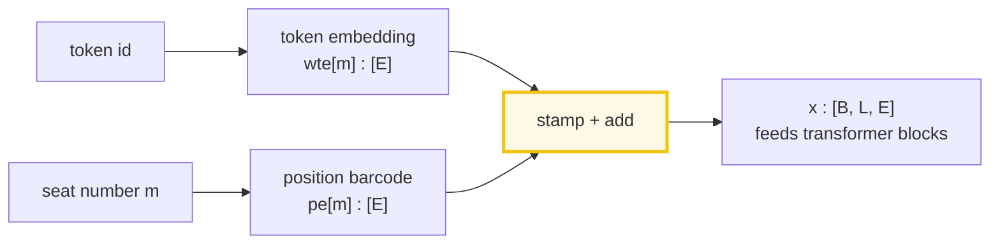
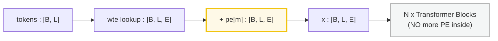
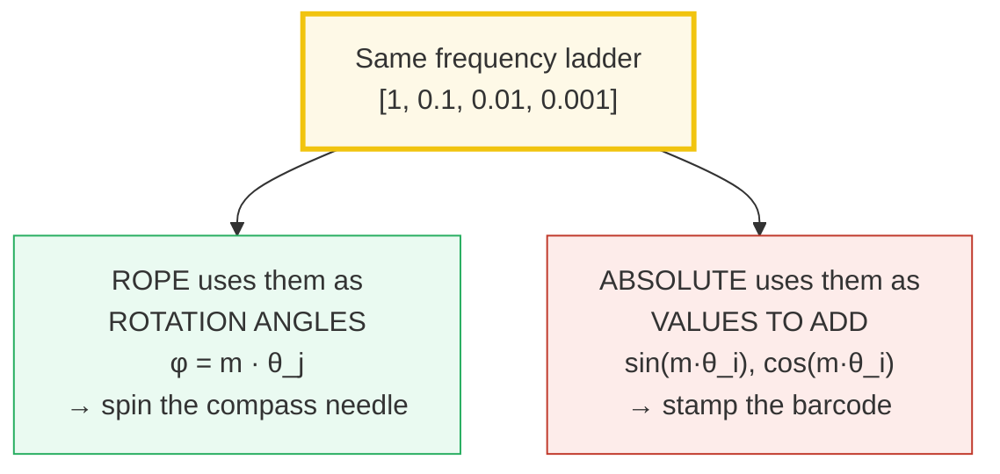
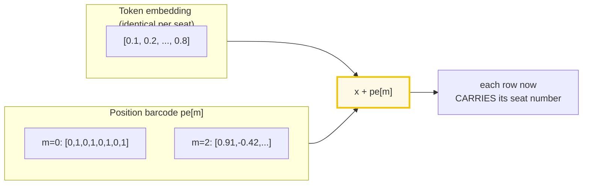
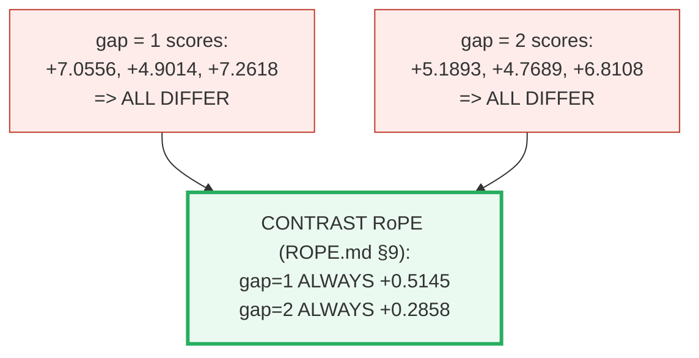
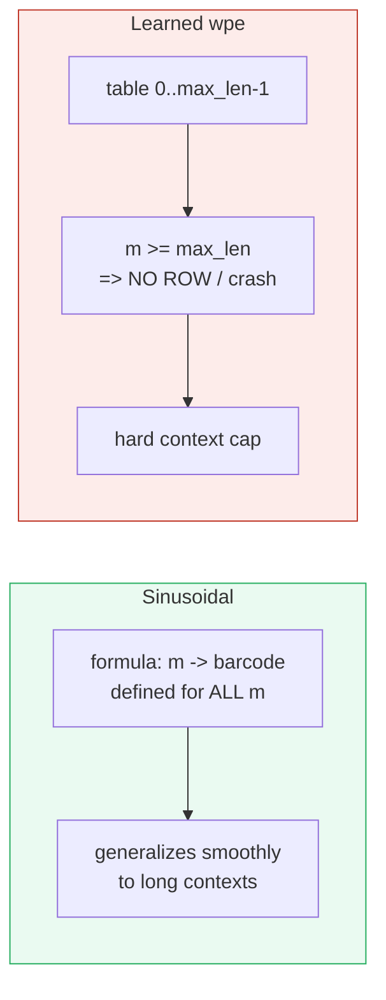
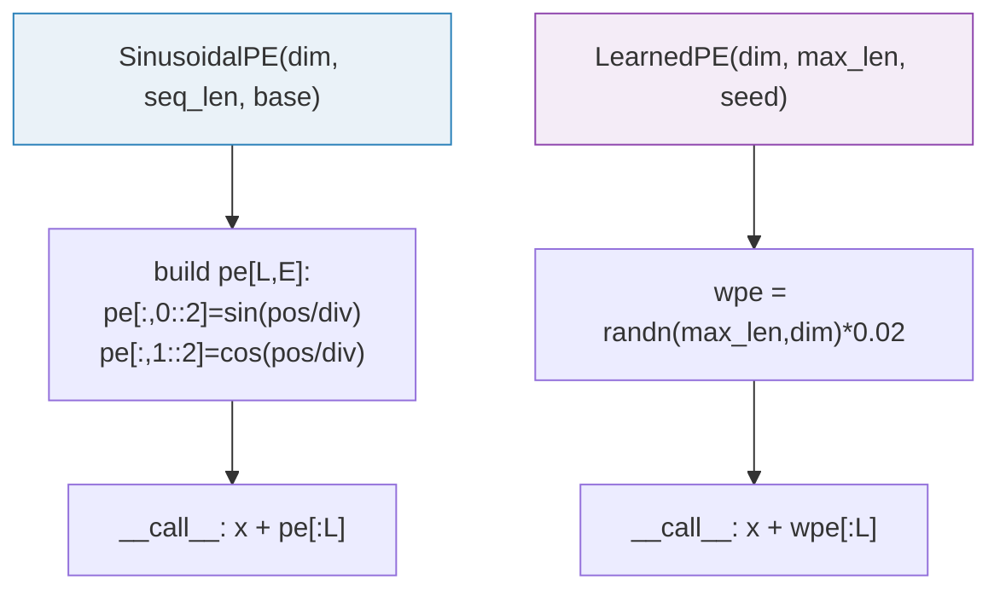

# Absolute Position Embeddings — A Visual, Worked-Example Guide

> **Companion code:** [`absolute_pe.py`](./absolute_pe.py). **Every number in this
> guide is printed by `uv run python absolute_pe.py`** — nothing hand-computed.
>
> **Sibling guide:** [`ROPE.md`](./ROPE.md) — Rotary Position Embeddings (the
> *other* family). Cross-references are marked 🔗 throughout.
>
> **Live animation:** [`absolute_pe.html`](./absolute_pe.html) — open in a browser.

---

## 0. TL;DR — the additive family

> **The barcode analogy (read this first):** Instead of spinning a compass needle
> (RoPE), you **stamp each token with its seat number, written as a fixed barcode**
> of sin/cos values, and **add** that barcode to the token. Two tokens then compare
> their barcodes directly — but the comparison depends on the **exact seat
> numbers**, not just how far apart they are. That is the opposite of RoPE, where
> only the *gap* between seats survives.

The Transformer's attention is a dot product `Q · K` that **ignores token order**
(see [`ROPE.md`](./ROPE.md) §1). The *additive* family fixes this by **adding a
position vector to the input embedding, once, before any transformer block**.



One plain sentence per family: **RoPE spins a needle; absolute PE stamps a
barcode.** The needle's *relative* tilt is all that survives a comparison; the
barcode's *absolute* pattern is felt directly.

Two flavors of `pe[m]`:

| | **Sinusoidal** | **Learned** (`wpe`) |
|---|---|---|
| Mental model | A fixed sin/cos barcode | A memorised seat-number lookup |
| Origin | "Attention Is All You Need" (Vaswani 2017) | GPT-2 / nanoGPT (Radford 2019) |
| How built | Fixed formula `sin`/`cos` | `nn.Embedding`, trained by SGD |
| Storage | None (recompute or cache) | A table of `[max_len, E]` params |
| Example users | original Transformer | GPT-2, nanoGPT |

> 🔗 **The one cross-reference to remember:** absolute PE *adds* a vector **once**
> at the input on `[B, L, E]`. RoPE *rotates* Q/K **in every layer** on
> `[B, L, H, D]`. That single difference is why RoPE gets the relative-position
> property (see [`ROPE.md`](./ROPE.md) §9) and absolute PE does not.

---

### Glossary (plain English — refer back any time)

| Term | Plain meaning |
|---|---|
| **token** | One word or piece of the input. |
| **position (`m`)** | The token's **seat number**, counting from 0. |
| **embedding** | The list of numbers representing a token's meaning. |
| **model dim (`E`)** | How many numbers the WHOLE token vector has. Absolute PE works on `E`; RoPE works on the smaller per-head `D`. Never confuse the two. |
| **barcode** | A fixed sin/cos pattern unique to seat `m` (sinusoidal), OR a learned row of a table (GPT-2 `wpe`). Either way it is **added**. |
| **dot product** | "How similar are two vectors?" — the attention score. Big & positive = alike. |
| **frequency** | How fast one barcode coordinate wiggles as `m` grows. Same ladder `[1, 0.1, 0.01, 0.001]` as RoPE — the deep 🔗 link. |
| **KV cache** | Memory storing already-computed keys/values. The barcode's fixed `max_len` collides with it (see [§7](#7-extrapolation-beyond-training-length)). |

---

## 1. The shape it lives in: `[B, L, E]`

Critical difference from RoPE: absolute PE operates on the **model/embedding
dimension `E`**, applied to the whole token vector — not per-head.



> One plain sentence: the barcode is stamped on **once**, at the very front door,
> and never touched again inside the blocks.

Compare to RoPE, which lives inside each block on `[B, L, H, D]` (see
[`ROPE.md`](./ROPE.md) §6). The two never share an axis: `E` is the full model
dim, `D` is a single head's dim.

---

## 2. The shared frequency ladder (the key 🔗 link)

Both families share the **same inverse-exponential FORMULA structure** for their
frequency ladder. With the toy dims `E = 8` (absolute) and `D = 8` (RoPE),
`base = 10000`:

> From `absolute_pe.py` **Section A**:
>
> | i | 2i/E | div_term = base^(2i/E) | freq = 1/div_term | = RoPE's θ_j? |
> |---|---|---|---|---|
> | 0 | 0.00 | 1.0000 | **1.000000** | YES (same formula; equal here only because E=D=8) |
> | 1 | 0.25 | 10.0000 | **0.100000** | YES (same formula; equal here only because E=D=8) |
> | 2 | 0.50 | 100.0000 | **0.010000** | YES (same formula; equal here only because E=D=8) |
> | 3 | 0.75 | 1000.0000 | **0.001000** | YES (same formula; equal here only because E=D=8) |



> One plain sentence: the *same* four wiggle-speeds power both families *in this
> toy* — RoPE turns them into angles to spin with; absolute PE turns them into
> values to add. **Caveat:** they match numerically only because both toys use
> dim 8 (`E=8` for absolute, `D=8` for RoPE). In real models `E ≠ D` (e.g.
> Qwen3-0.5B: `E=896`, `D=128`), so the actual frequency *values* differ — what
> is shared is the inverse-exponential **formula structure**, not the numbers.

**Same formula structure, different operation.** Sinusoidal PE stores
`sin(m·θ_i)` / `cos(m·θ_i)` and *adds* them; RoPE uses `m·θ_j` as an angle to
*rotate* with. The **inverse-exponential ladder** `θ = base^(−2i/dim)` is the
shared structure — but `dim` is `E` for absolute PE and `D` for RoPE, so the
numerical frequencies coincide only when `E = D` (as in both toys here). This is
the deepest connection between the two guides.

---

## 3. Sinusoidal PE — the table

> **The barcode, in plain words.** Each seat `m` gets a unique 8-number barcode.
> Even-numbered slots hold `sin(m·θ_i)`; odd-numbered slots hold `cos(m·θ_i)`.
> Seat 0's barcode is `[0,1,0,1,0,1,0,1]` (sin of zero = 0, cos of zero = 1).
> As the seat number climbs, the front slots swing wildly while the back slots
> barely budge — same fast/slow idea as RoPE.

Formula (interleaved sin/cos on even/odd dims):

```
PE(pos, 2i)   = sin(pos / base^(2i/E))      # even dims  (the "sin" slots)
PE(pos, 2i+1) = cos(pos / base^(2i/E))      # odd dims   (the "cos" slots)
```

> From `absolute_pe.py` **Section B** — the `[L, E]` table, first 4 rows:
>
> | m | d0 (sin) | d1 (cos) | d2 (sin) | d3 (cos) | d4 (sin) | d5 (cos) | d6 (sin) | d7 (cos) |
> |---|---|---|---|---|---|---|---|---|
> | 0 | 0.0000 | 1.0000 | 0.0000 | 1.0000 | 0.0000 | 1.0000 | 0.0000 | 1.0000 |
> | 1 | 0.8415 | 0.5403 | 0.0998 | 0.9950 | 0.0100 | 0.9999 | 0.0010 | 1.0000 |
> | 2 | 0.9093 | −0.4161 | 0.1987 | 0.9801 | 0.0200 | 0.9998 | 0.0020 | 1.0000 |
> | 3 | 0.1411 | −0.9900 | 0.2955 | 0.9553 | 0.0300 | 0.9996 | 0.0030 | 1.0000 |

**How to read it (clock by clock):**
- Row `m=0` is `[0,1,0,1,0,1,0,1]` — `sin(0)=0`, `cos(0)=1` on every pair. Seat 0
  gets a flat, neutral barcode.
- The **high-frequency** pair (d0/d1) swings wildly as `m` grows: by seat 3, d1 has
  already crashed to `−0.9900`. This pair encodes *local* position.
- The **low-frequency** pair (d6/d7) barely moves (`≈1.0000` throughout) — it
  carries the coarse, *global* position.

> 🔗 Notice `0.9093, −0.4161, 0.5403` showing up? These are the *same* numbers
> as RoPE's cos/sin table in [`ROPE.md`](./ROPE.md) §4 (e.g. `cos(2)=−0.4161`,
> `sin(2)=0.9093`). That's no coincidence — same trig, same frequencies. The only
> difference: RoPE *multiplies* with them, absolute PE *adds* them.

---

## 4. The operation: ADD (not rotate)

This is the headline difference. Using identical token content at every position
(so we can *see* the barcode), add row `m` of the table:

> From `absolute_pe.py` **Section C**:
>
> **Input** (same content at every position): `[0.1, 0.2, 0.3, 0.4, 0.5, 0.6, 0.7, 0.8]`
>
> **After `x = x + PE[m]`:**
>
> | m | d0 | d1 | d2 | d3 | d4 | d5 | d6 | d7 |
> |---|---|---|---|---|---|---|---|---|
> | 0 | 0.1000 | **1.2000** | 0.3000 | **1.4000** | 0.5000 | **1.6000** | 0.7000 | **1.8000** |
> | 1 | 0.9415 | 0.7403 | 0.3998 | 1.3950 | 0.5100 | 1.6000 | 0.7010 | 1.8000 |
> | 2 | 1.0093 | −0.2161 | 0.4987 | 1.3801 | 0.5200 | 1.5998 | 0.7020 | 1.8000 |
> | 3 | 0.2411 | −0.7900 | 0.5955 | 1.3553 | 0.5300 | 1.5996 | 0.7030 | 1.8000 |



**Walking it in plain English:**
- Seat 0 gets `[0,1,0,1,0,1,0,1]` added — so every odd (cos) slot jumps up by 1
  (e.g. d1 goes `0.2 → 1.2`, d7 goes `0.8 → 1.8`). The even (sin) slots are
  untouched because `sin(0)=0`.
- Seat 2's barcode pushes d0 up to `1.0093` (sin(2)=0.909 added to 0.1) and
  drags d1 down to `−0.2161` (cos(2)=−0.416 added to 0.2).
- The last two slots (d6, d7) stay near `0.7` and `1.8` for *every* seat — the
  slowest frequency barely registers over 4 seats.

Now each row's vector *contains* its absolute seat number baked in. Every subsequent
`Q·K` dot product will "feel" `m` and `n` directly.

> 🔗 RoPE never bakes position into the values — it keeps the vector's magnitude
> fixed and only changes its *angle* ([`ROPE.md`](./ROPE.md) §5). That's why RoPE
> is **norm-preserving** (`max|‖out‖−‖in‖| ≈ 3e−8`), while additive PE is not —
> adding the barcode changes how long the vector is.

---

## 5. Learned PE (nanoGPT `wpe`)

No formula at all — just a learnable table. In nanoGPT:

```python
self.wpe = nn.Embedding(block_size, n_embd)   # [max_len, E], trained by SGD
...
x = self.wte[idx] + self.wpe[pos]             # token emb + learned pos emb
```

> From `absolute_pe.py` **Section D** (seeded `randn*0.02` for reproducibility):
>
> | m | d0 | d1 | d2 | d3 | d4 | d5 | d6 | d7 |
> |---|---|---|---|---|---|---|---|---|
> | 0 | −0.0225 | −0.0230 | −0.0050 | −0.0087 | +0.0170 | +0.0138 | −0.0063 | −0.0423 |
> | 1 | +0.0064 | −0.0253 | +0.0070 | +0.0062 | +0.0024 | +0.0248 | +0.0223 | −0.0049 |
> | 2 | −0.0271 | −0.0339 | +0.0113 | +0.0159 | +0.0120 | −0.0311 | −0.0068 | +0.0371 |
> | 3 | +0.0150 | −0.0117 | −0.0035 | +0.0037 | +0.0278 | +0.0317 | +0.0189 | −0.0169 |

These are arbitrary learned numbers — no sin/cos structure. The model figures out
during training what each seat's barcode should be. They're small (`*0.02`) so
they start as a mild perturbation on top of the token embedding.

> One plain sentence: instead of a *formula* for the barcode, GPT-2 just
> *memorises* one row per seat and lets training tune it.

**nanoGPT comparison** (from `learning_guide/00_Foundations.md`): GPT-2 uses
learned `wpe` and **no RoPE at all** — position is handled 100% by this table.

---

## 6. Why absolute ≠ relative — proof with numbers 🔗

> **The proof, as a story.** Same gap, *different* scores — that's the failure.
> Put a query at seat 5 and a key at seat 4 (gap = 1), then put them at seats 2
> and 1 (also gap = 1). With absolute PE the scores are `+4.90` and `+7.06` —
> totally different, even though the gap is identical. Contrast RoPE (🔗
> [`ROPE.md`](./ROPE.md) §9), where the same gap *always* gives the same score
> (`+0.5145`). That is the one thing additive PE structurally cannot do.

The decisive experiment (same fixed raw Q, K as [`ROPE.md`](./ROPE.md) §9, but
we *add* PE instead of *rotating*). Claim: the `Q·K` score depends on **both** `m_q`
and `m_k` separately, **not** only on `m_q − m_k`.

> From `absolute_pe.py` **Section E**:
>
> | m_q | m_k | relative = m_q−m_k | Q·K score |
> |---|---|---|---|
> | 2 | 1 | **1** | **+7.055621** |
> | 5 | 4 | **1** | **+4.901406** |
> | 10 | 9 | **1** | **+7.261821** |
> | 2 | 0 | **2** | **+5.189337** |
> | 5 | 3 | **2** | **+4.768941** |
> | 10 | 8 | **2** | **+6.810799** |

**Reading the proof like a story:**

- First three rows: gap is always **1**, but seats differ. Scores are `+7.0556`,
  `+4.9014`, `+7.2618` — **all different**. The same distance gives three
  unrelated numbers.
- Last three rows: gap is always **2**. Scores `+5.1893`, `+4.7689`, `+6.8108` —
  again **all different**.
- Now flip to RoPE (🔗 [`ROPE.md`](./ROPE.md) §9): gap 1 *always* gave `+0.5145`,
  gap 2 *always* gave `+0.2858`. **Identical regardless of seat.** That is the
  property additive PE lacks.



**Why it fails:** adding the barcode puts an `m`-dependent blob *inside* `Q_m` and
an `n`-dependent blob *inside* `K_n`. The dot product then expands to terms like
`pe[m_q]·pe[m_k]`, `q·pe[m_k]`, `pe[m_q]·k` — these mix `m_q` and `m_k`
**separately**. There's no trig identity that collapses them to a function of
`m_q − m_k` alone. Only the **rotation** trick achieves that cancellation
(see [`ROPE.md`](./ROPE.md) §9): when you *multiply* two arrows you *add their
angles*, and `m_q·θ − m_k·θ = (m_q − m_k)·θ` — the absolute seats cancel. Addition
has no such magic.

---

## 7. Extrapolation beyond training length

What happens at a seat the model never saw?

> From `absolute_pe.py` **Section F**:
>
> - **Sinusoidal:** smooth function of `m` — just keep evaluating it. The formula
>   `sin(m·θ_i)` / `cos(m·θ_i)` is well-defined for any `m`, no matter how large.
> - **Learned `wpe`:** the table has only `max_len` rows. Here `wpe` is
>   `[32, 8]` → `m=200` is an **INDEX ERROR** — out of range. GPT-2/nanoGPT
>   hard-cap context at `block_size`.



> One plain sentence: a *formula* works for any seat number; a *memorised table*
> runs out of rows the moment you exceed its size.

This is **the** reason modern LLMs abandoned absolute PE for RoPE: RoPE + YaRN/NTK
scaling generalizes to longer contexts far more gracefully. Absolute (especially
learned) is fundamentally capped.

> 🔗 That hard `max_len` cap collides with the KV cache during long generation:
> once cached positions reach `block_size`, learned `wpe` runs out of rows before
> the cache does. See [`KV_CACHE.md`](./KV_CACHE.md) for how the decode cursor and
> cache eviction interact with the context window a position scheme must cover.

---

## 8. Side-by-side comparison 🔗

| Property | Absolute (sinusoidal / learned) | Rotary (RoPE) |
|---|---|---|
| Mental model | **stamp** a seat-number barcode | **spin** a compass needle |
| Operation | **add** `x + pe[m]` | **rotate** `(x1+i·x2)·e^(imθ)` |
| Where | input, **once**, `[B,L,E]` | every layer, on Q&K, `[B,L,H,D]` |
| Frequency ladder | same `[1,0.1,0.01,...]` | same `[1,0.1,0.01,...]` |
| Norm preservation | NO | **YES** (≈3e−8 drift) |
| Encodes | absolute seat number | **relative** gap |
| Length generalization | weak (esp. learned) | strong (YaRN/NTK) |
| Users | GPT-2 / nanoGPT | Llama, Qwen, Mistral |
| Q·K score depends on | `m_q` **and** `m_k` (§6) | only `m_q − m_k` |

---

## 9. The reference code (`absolute_pe.py`)

Two tiny classes, both callable as `x_out = pe(x_in)` where shapes are `[B, L, E]`:



Matches nanoGPT's `wpe = nn.Embedding(block_size, n_embd)` and the original
Transformer's sinusoidal formula exactly.

---

## 10. Pitfalls

| # | Mistake | Symptom | Fix |
|---|---|---|---|
| 1 | Confusing `E` (model dim) with RoPE's `D` (head dim) | Wrong shapes | Absolute PE → `E`; RoPE → `D` |
| 2 | Adding PE inside every block | Double-counting, slow | Add ONCE at input |
| 3 | Learned PE beyond `max_len` | Index error / crash | Re-train larger table, or use RoPE |
| 4 | Mixing PE dims (even=sin vs interleaved) | Garbage if wrong | Even/odd = original Transformer interleaved layout |
| 5 | Applying absolute PE to Q/K only | Misses V and residuals | Apply to full token vector at input |

---

## 11. Cheat sheet


- **Shape:** `[B, L, E]`, added **once** at the input.
- **Sinusoidal:** `pe[m,2i]=sin(m·θ_i)`, `pe[m,2i+1]=cos(m·θ_i)`, `θ_i=base^(−i/(E/2))`.
- **Learned:** `pe = nn.Embedding(max_len, E)`, SGD-trained.
- **Frequency ladder:** identical to RoPE's `θ` — same idea, *added* not *rotated*.
- **Limitation:** `Q·K` depends on absolute seats (no relative trick); weak
  length generalization.

> 🔗 This is why the field moved to RoPE. Read [`ROPE.md`](./ROPE.md) to see the
> rotation that makes positions cancel into *relative* distance — the one thing
> additive PE structurally cannot do.

---

## Sources

- **Vaswani, A.; Shazeer, N.; Parmar, N.; Uszkoreit, J.; Jones, L.; Gomez, A. N.;
  Kaiser, Ł.; Polosukhin, I. (2017).**
  *Attention Is All You Need.*
  arXiv:1706.03762 — https://arxiv.org/abs/1706.03762
  The original Transformer; defines the sinusoidal PE formula
  `PE(pos,2i)=sin(pos/base^(2i/E))` used in [§2](#2-the-shared-frequency-ladder-the-key--link)–[§4](#4-the-operation-add-not-rotate)
  and the shared frequency ladder that RoPE reuses ([§2](#2-the-shared-frequency-ladder-the-key--link)).

- **Radford, A.; Wu, J.; Child, R.; Luan, D.; Amodei, D.; Sutskever, I. (2019).**
  *Language Models are Unsupervised Multitask Learners.*
  OpenAI technical report (not on arXiv) —
  https://cdn.openai.com/better-language-models/language_models_are_unsupervised_multitask_learners.pdf
  GPT-2. Introduces the learned `wpe` position embedding table ([§5](#5-learned-pe-nanogpt-wpe))
  that nanoGPT reproduces as `nn.Embedding(block_size, n_embd)`.

- **Karpathy, A. — nanoGPT.** https://github.com/karpathy/nanoGPT
  Reference minimal implementation of the GPT-2 learned-`wpe` path that
  [`absolute_pe.py`](./absolute_pe.py) Section D reproduces.
