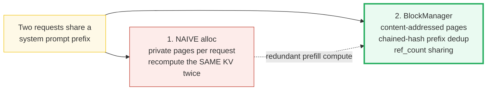
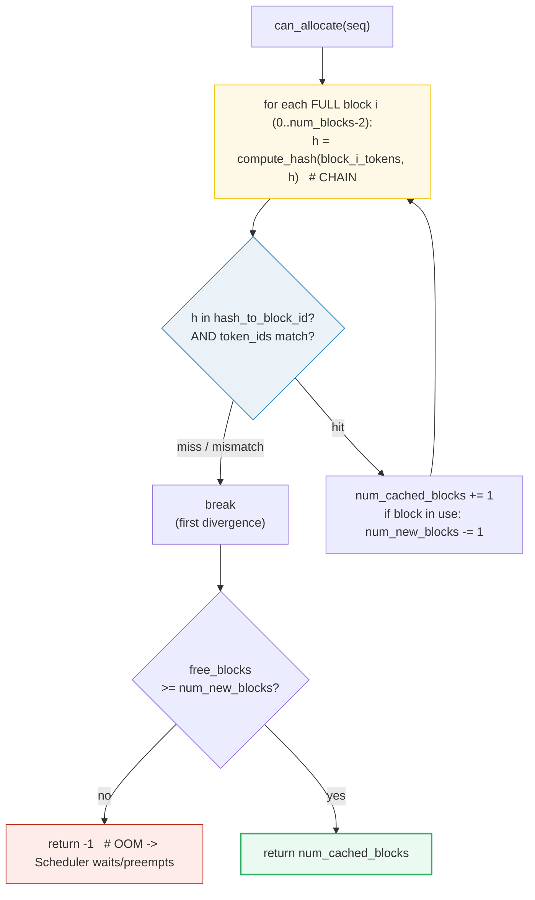
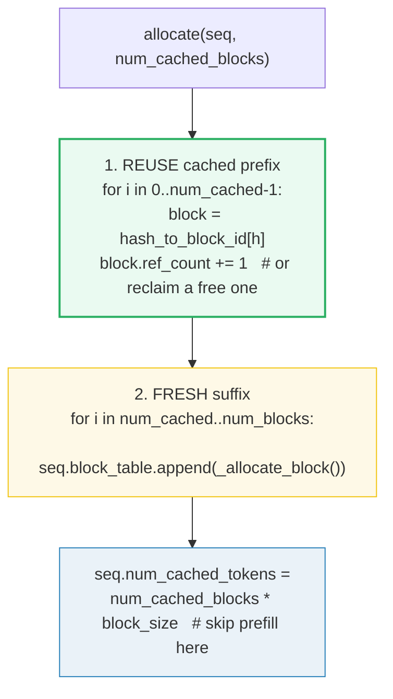
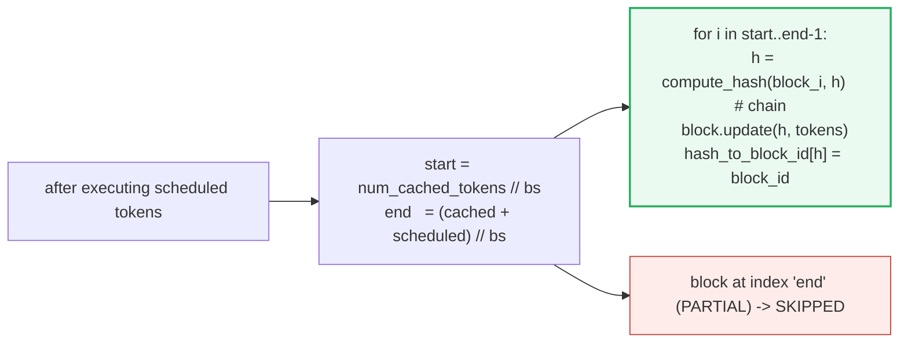
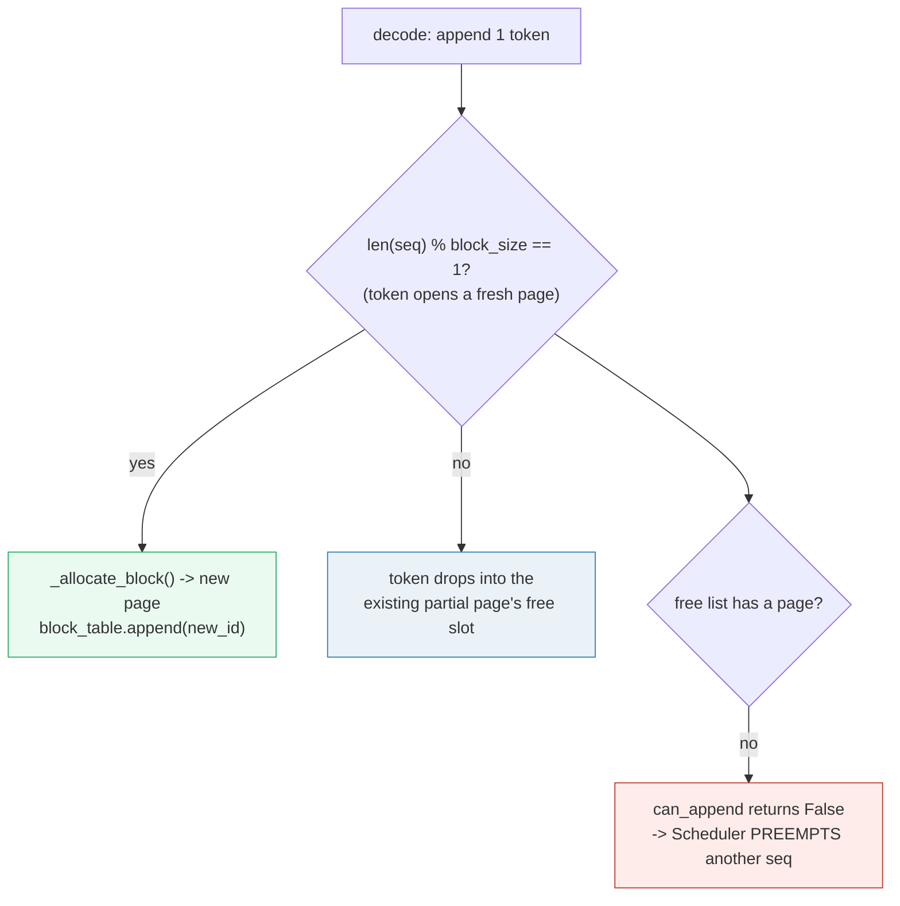
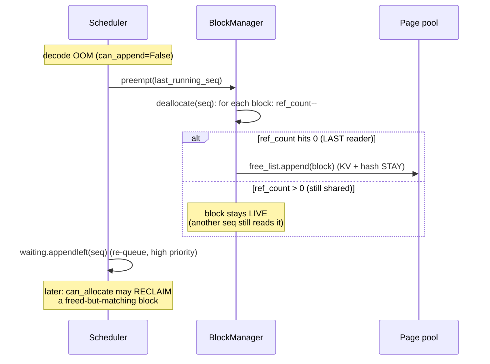
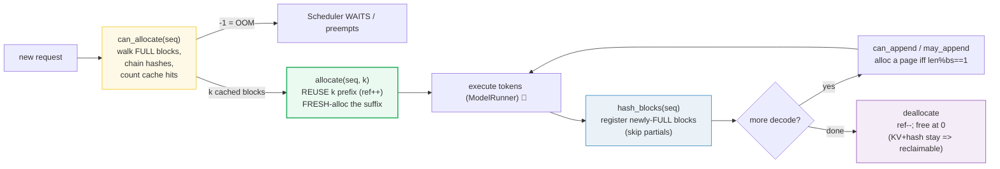

# BlockManager (Paged Allocation + Prefix Cache) — A Visual, Worked-Example Guide

> **Who this is for:** someone with minimal systems background. Every concept
> arrives first as a **plain analogy**, then as a diagram, then as a worked
> example with real numbers. **Every number in this guide is printed by
> `uv run python block_manager.py`** — nothing hand-computed.
>
> **Companion code:** [`block_manager.py`](./block_manager.py).
> **Live animation:** [`block_manager.html`](./block_manager.html) — open in a
> browser and watch the chained-hash tree fork, the ref_count meter tick up,
> and a cache hit skip a KV recompute.
>
> **Sibling guides:** [`KV_CACHE.md`](./KV_CACHE.md) — the *storage* half of
> the same page model (where K,V bytes live; this guide answers which *blocks*
> they live in and how they're *shared*). [`PAGED_ATTENTION.md`](./PAGED_ATTENTION.md)
> — the *compute* that consumes these blocks. [`SCHEDULER.md`](./SCHEDULER.md) —
> the component that *calls* `can_allocate` / `allocate` / `can_append` and
> reacts to its OOM signal (🔗 throughout).
>
> **Source material:** `learning_guide/03_Scale_Serving.md` §5 (BlockManager),
> reproducing `nano-vllm/nanovllm/engine/block_manager.py`.

---

## Glossary (read once, refer back)

| Term | Plain-English meaning |
|---|---|
| **block** (page) | A fixed-size chunk of `block_size` token slots in the shared pool (vLLM default `16`; this demo uses `2` so every number is printable). |
| **block_size** | Tokens per block. Smaller → finer prefix sharing + more block-table overhead; larger → coarser sharing + less overhead. |
| **block table** | The per-request INDEX CARD: logical block `i` → physical block id. Pages need **not** be contiguous. 🔗 [`KV_CACHE.md`](./KV_CACHE.md) §5. |
| **free list** | A deque of free physical block ids — like an OS frame allocator's free frames. `popleft()` → deterministic `0,1,2,…` allocation order. |
| **ref_count** | How many active sequences currently **read** this physical block. `>0` ⇒ live; `==0` ⇒ free, **but KV bytes + hash stay** ⇒ reclaimable. |
| **hash** | A 64-bit fingerprint of a FULL block = `H(prev_hash_bytes ‖ token_ids_bytes)`. **Chained** — each block's hash folds in the one before it. |
| **chained hash** | The whole trick. Because block `k`'s hash depends on block `k-1`'s hash (…→ block 0), two sequences that share tokens `0..k-1` produce *identical* hashes for blocks `0..k//bs-1` and diverge exactly at the block where their tokens diverge. |
| **hash_to_block_id** | The global content→physical map: fingerprint → block id. This *is* the prefix cache. |
| **prefix cache hit** | `can_allocate()` walks a new request's chained hashes; any FULL block whose `(hash, token_ids)` matches a known block is reusable → no KV recompute for it. |
| **OOM (`-1`)** | `can_allocate` returns `-1` when free blocks `<` blocks still needed: a signal to the Scheduler to WAIT or preempt. |
| **preempt** | When decode would OOM, the Scheduler evicts a running sequence (`deallocate`s its blocks) back to WAITING. Shared blocks only drop `ref_count` (not freed) until the **last** reader leaves. |
| **reclaim** | A freed block keeps its hash + KV; a later request with the same token prefix can take it back *without* recomputing — like a free OS frame that still holds a recognizable file. |

> 🔗 **The single cross-reference to remember:** `KV_CACHE.md` shows that pages
> may be **scattered** non-contiguously (the block table maps logical→physical).
> This guide adds the **second** layer on top: pages are also **content-
> addressed** — two requests that wrote the same tokens share the *same* physical
> page (`ref_count++`). Storage layout (🔗 KV_CACHE) + sharing (this guide) +
> compute (🔗 PAGED_ATTENTION) are the three legs of vLLM's serving stack.

---

## 0. TL;DR — the whole lineage in one picture

Every request is a **reader** in a library of fixed-size **pages**. Each reader
owns an **index card** (the block table) listing which physical pages hold their
notes. The question this guide answers: *when two readers copied the same system
prompt, must they each re-write the same notes into different pages?* **No** —
the BlockManager makes sharing automatic by **fingerprinting** each page.

**The two generations, as analogies** (each fixes the prior's waste):

- **NAIVE per-request allocation (the "before")** = *"every reader gets their
  OWN private pages, full of freshly-written notes. Two readers who copied the
  same system prompt each re-write the SAME notes into DIFFERENT pages.
  Wasteful: the most expensive thing in serving (prefill compute) is done
  redundantly for every copy of a popular prefix."*
- **BlockManager + content-addressed prefix cache (vLLM / PagedAttention)** =
  *"pages become CONTENT-ADDRESSED. A page's identity is a CHAINED hash —
  `hash(block_tokens, prefix=hash_of_previous_block)` — so ANY request that
  produced the same token prefix gets the same fingerprints and can SHARE the
  same physical pages (`ref_count++`). When a reader finishes, their private
  pages go back to the pool but the bytes + hash STAY, so a later reader with
  the same prefix can RECLAIM them. System prompts, few-shot blocks, and chat
  history get computed ONCE and reused by everyone."*



*Red → green: the only change is that pages are now identified by **what they
contain** (a chained hash of their tokens), not by **who asked for them**. That
single indirection turns "recompute the system prompt 10 000×" into "compute it
once, share it 10 000×."*

| | **Naive per-request alloc** | **BlockManager (content-addressed)** |
|---|---|---|
| Page identity | *which request owns it* | *a chained hash of its tokens* |
| Shared prefix | recompute KV into separate pages | **share** the same page (`ref_count++`), **no recompute** |
| On request finish | pages freed, KV discarded | pages freed, **KV + hash stay** (reclaimable) |
| OOM handling | crash / hard reject | `can_allocate` returns `-1` → Scheduler **preempts** & retries |
| Decode growth | pre-reserve `max_len` (🔗 dense waste) | allocate a new page **only at a page boundary** |
| Used by | toy Week-1 servers | **vLLM / PagedAttention** (SOSP 2023) |

---

## 1. The Block struct + ref_count — Section A output

**Analogy:** *a block is just a page frame with a usage counter and (later) a
fingerprint. `ref_count` is the sharing dial: 0 = empty shelf slot, 1 = one
reader, 2 = two readers sharing the same physical page. The KV bytes SURVIVE a
return to the free list — that survival is exactly what makes prefix caching
work (a freed page is still a valid, recognizable file until someone overwrites
it).*

```mermaid
graph TD
    B["Block<br/>{block_id, ref_count, hash, token_ids}"]
    B --> RC["ref_count == 0  =>  FREE<br/>(on free list; KV+hash STAY)"]
    B --> RC1["ref_count == 1  =>  LIVE, private<br/>(one sequence reads it)"]
    B --> RC2["ref_count >= 2  =>  LIVE, SHARED<br/>(N sequences read the SAME bytes)"]
    style RC fill:#3d4452,stroke:#8b949e
    style RC1 fill:#eaf2f8,stroke:#2980b9
    style RC2 fill:#eafaf1,stroke:#27ae60,stroke-width:2px
```



> From `block_manager.py` **Section A**:
>
> `Block(7)` just created: `block_id=7`, `ref_count=0`, `hash=-1`, `token_ids=[]`.
>
> | ref_count | state | what it means |
> |---|---|---|
> | 0 | FREE | on the free list; KV+hash STAY if any |
> | 1 | LIVE (private) | exactly one sequence reads this block |
> | ≥2 | LIVE (shared) | N sequences read the SAME bytes |
>
> Lifecycle of one block as readers come and go:
> - `_allocate_block()` → block 0, `ref_count=1`, `hash=0xfece5a30e12404d4`
> - 2nd seq shares it → `ref_count=2` (SHARED)
> - 1 seq leaves → `ref_count=1`
> - last reader leaves → `ref_count=0` → FREE list
> - **BUT** `block.hash` still `= 0xfece5a30e12404d4` and `token_ids=[10, 11]`
>   ⇒ a future `[t0,t1]` prefix can **RECLAIM** it (no KV recompute)
>
> `[check]` freed block keeps its hash: **OK** · freed block is in free_block_ids: **OK**

> One plain sentence: `ref_count` is a dial, not a boolean — turning it down to
> 0 frees the *slot* (others may reuse the frame) but never erases the *content*,
> so an identical prefix can walk back in and pick up where it left off.

---

## 2. The chained hash — why divergence at token `k` splits the fingerprints (Section B)

**Analogy:** *each page's fingerprint is stamped with a seal that also imprints
the seal of the page before it. So page `k`'s seal secretly encodes pages
`0..k-1`. Two readers who copied the first `k` pages therefore stamp identical
seals for those pages; their seals diverge at the FIRST page whose contents
differ. That is the entire reason prefix sharing "just works."*

```mermaid
graph TD
    ROOT["root (-1)"] --> H0A["A.block0 hash<br/>H([t0,t1], -1)<br/>= 0xfece5a30e12404d4"]
    ROOT --> H0B["B.block0 hash<br/>H([t0,t1], -1)<br/>= 0xfece5a30e12404d4"]
    H0A -->|"chain"| H1A["A.block1 hash<br/>H([t2,t3], h0)<br/>= 0x2cb48a641a5b1565"]
    H0B -->|"chain"| H1B["B.block1 hash<br/>H([t4,t5], h0)<br/>= 0x2ab4c06583ce3085"]

    SHARE["shared prefix =><br/>IDENTICAL block0 hash"]
    H0A -.-> SHARE
    H0B -.-> SHARE
    DIVERGE["tokens diverge =><br/>DIFFERENT block1 hash<br/>(even though h0 is the same!)"]
    H1A -.-> DIVERGE
    H1B -.-> DIVERGE

    style ROOT fill:#3d4452,stroke:#8b949e
    style H0A fill:#eafaf1,stroke:#27ae60,stroke-width:2px
    style H0B fill:#eafaf1,stroke:#27ae60,stroke-width:2px
    style H1A fill:#eaf2f8,stroke:#2980b9
    style H1B fill:#f4ecf7,stroke:#8e44ad
    style SHARE fill:#eafaf1,stroke:#27ae60
    style DIVERGE fill:#fdecea,stroke:#c0392b
```



> From `block_manager.py` **Section B** — `block_size=2`, two 4-token requests:
>
> `A = [10, 11, 12, 13]` → block0=`[10,11]`, block1=`[12,13]`
> `B = [10, 11, 14, 15]` → block0=`[10,11]`, block1=`[14,15]`
>
> | req | block | tokens | prefix (prev hash) | chained hash (this block) | same as other req? |
> |---|---|---|---|---|---|
> | A | 0 | `[10, 11]` | `-1` (root) | `0xfece5a30e12404d4` | share w/ B blk0 |
> | B | 0 | `[10, 11]` | `-1` (root) | `0xfece5a30e12404d4` | share w/ A blk0 |
> | A | 1 | `[12, 13]` | `0xfece5a30e12404d4` | `0x2cb48a641a5b1565` | DIVERGES from B |
> | B | 1 | `[14, 15]` | `0xfece5a30e12404d4` | `0x2ab4c06583ce3085` | DIVERGES from A |
>
> `[check]` `hash(A.block0) == hash(B.block0)` (shared prefix): **OK**
> `[check]` `hash(A.block1) != hash(B.block1)` (divergence): **OK**

**Reading the table like a story:**

- Rows 1–2: both requests hash block 0 from the **root** (`prefix=-1`). Same
  tokens `[10,11]` → **same** hash `0xfece5a30e12404d4`. This is the seal they
  share.
- Rows 3–4: block 1 is hashed **chained onto `h0`**. Even though both feed in
  the *same* `h0`, their block-1 tokens differ (`[12,13]` vs `[14,15]`) →
  **different** hashes. The divergence is sealed in.

> **The precise formula** (implemented from scratch in `block_manager.py`; stands
> in for vLLM's `xxhash.xxh64`):
> ```
> compute_hash(token_ids, prefix=-1):
>     h = FNV_OFFSET_64                       # 0xcbf29ce484222325
>     if prefix != -1:
>         for byte in prefix.to_bytes(8, "little"):   # CHAIN onto previous block
>             h = ((h ^ byte) * FNV_PRIME_64) & MASK64
>     for t in token_ids:                             # this block's own tokens
>         for byte in t.to_bytes(4, "little"):        # each token = 4 LE bytes
>             h = ((h ^ byte) * FNV_PRIME_64) & MASK64
>     return h
> ```
> `FNV-1a` is a public-domain **non-cryptographic** 64-bit hash (like xxh64). We
> use it — not `xxhash` — only so the `.html` can recompute it offline with zero
> deps and gold-check it. **The chaining structure is the idea, not the exact
> digest**: swapping FNV-1a for xxh64 leaves every claim above unchanged.
>
> **Why the chain, not per-block hashing?** If each block were hashed by its own
> tokens alone (`H(token_ids)`), then `[a,b]` *anywhere* would share a page —
> two unrelated prompts that happen to contain the same token pair would falsely
> collide. Chaining makes a block's fingerprint a function of its **entire token
> prefix**, so only *true* prefixes match.

> **Hash-table eviction policy:** when `hash_to_block_id` itself must be pruned
> under memory pressure, vLLM prefers evicting entries whose target block has
> `ref_count == 0`, then falls back to LRU, then to the end of the longest
> prefix — keeping the most broadly reusable prefixes alive longest.

> 🔗 This is the content-addressed layer *above* [`KV_CACHE.md`](./KV_CACHE.md)
> §5's scattered-storage layer. KV_CACHE shows a block table maps
> logical→physical (pages can be non-contiguous); here the same block table also
> enables two requests to map to the *same* physical page when their hashes
> agree.

### Worked sample — the single example to remember

Pin these two numbers (they are the `.html`'s gold check):

- **`hash(A.block0) = hash(B.block0) = 18360711896818255060`** (`0xfece5a30e12404d4`)
- Because the two requests share block 0's fingerprint, `allocate` gives B the
  **same** physical page A already filled, and that page's **`ref_count` becomes `2`**
  (see [§4](#4-allocate--reuse-cached-prefix-ref--fresh-suffix--section-d-output)).

---

## 3. `can_allocate` — the prefix-cache walk + OOM check (Section C)

**Analogy:** *when a new reader walks in, the librarian flips through their
index card one page at a time, stamping each page's chained seal and asking "do
I already have a page with this seal and these exact tokens?". As long as the
answer is yes, the reader reuses the existing page (no rewriting). The walk
stops at the first page the library doesn't have. If the library is too full to
shelf the *new* pages the reader will need, the librarian says "come back later"
(`-1`) — that's the OOM signal the Scheduler listens for.*



> From `block_manager.py` **Section C** — pool of 6 blocks, `block_size=2`:
>
> **Request A = `[10,11,12,13]` arrives (empty cache):**
> - `can_allocate(A)`: walk block 0 `[10,11]`: `h=0xfece5a30e12404d4` →
>   `hash_to_block_id.get(h) = -1` (cache empty) → MISS → break.
> - `num_cached_blocks = 0`; `num_new_blocks = 2`; `free(6) >= 2`? yes →
>   **return `0`**.
> - After `allocate(A,0)` + `hash_blocks(A)`: `A.block_table=[0,1]`; cache maps
>   `0xfece5a30e12404d4 → block 0` and `0x2cb48a641a5b1565 → block 1`.
>
> **Request B = `[10,11,14,15]` arrives (shares block 0 with A):**
> - block 0 `[10,11]`: `h=0xfece5a30e12404d4` → `hash_to_block_id=0` (HIT; tokens
>   match ✓); block 0 in use → `num_new_blocks -= 1` (live share, ref++ only).
> - block 1 `[14,15]`: `h=compute_hash([14,15], h0)=0x2ab4c06583ce3085` → MISS → break.
> - `num_cached_blocks = 1`; `free(4) >= num_new(1)`? yes → **return `1`**.
>
> **OOM check** (a throwaway pool with 0 free blocks):
> - `can_allocate(C=[20,21,22,23], uncached)`: `num_new_blocks=2`, `free=0 < 2` →
>   **return `-1`** (the OOM signal).
>
> `[check]` `can_allocate(A)` on empty cache == 0: **OK**
> `[check]` `can_allocate(B)` finds shared block0 == 1: **OK**
> `[check]` `can_allocate(C)` under OOM == -1: **OK**

**Two subtle points the walk encodes:**

1. **Only FULL blocks are walked** (`range(num_blocks - 1)`). The last logical
   block may be partial (not enough tokens to fill it) — its hash would be
   unstable, so it's skipped here too (the same rule as `hash_blocks`, [§5](#5-hash_blocks--register-full-blocks-only-section-e-output)).
2. **The token-id double-check** (`blocks[block_id].token_ids != token_ids`).
   FNV-1a (like xxh64) is non-cryptographic — a collision is astronomically
   unlikely but not impossible. vLLM defends in depth by storing a copy of each
   block's tokens and **rejecting** a hash hit whose stored tokens differ. This
   guard is reproduced verbatim.

> 🔗 The `-1` return is the **only** channel the BlockManager uses to talk back
> to the Scheduler about memory pressure. The Scheduler's reaction — evict the
> newest running sequence (`preempt`) and retry — is covered in
> [`SCHEDULER.md`](./SCHEDULER.md) (and `03_Scale_Serving.md` §5.4 / §6).

---

## 4. `allocate` — reuse cached prefix (ref++) + fresh suffix (Section D)

**Analogy:** *allocate splits the work in two. First, the REUSE half: for each
cached prefix page, the reader simply adds their name to the page's reader list
(`ref_count++`) — no bytes are touched, no KV is recomputed. Second, the FRESH
half: for every page past the divergence point, grab a brand-new frame from the
free list. The payoff is dramatic: B recomputes **zero** tokens of the shared
prefix; only its divergent page needs new KV.*



> From `block_manager.py` **Section D** — `allocate(B, num_cached_blocks=1)`:
>
> - **REUSE** block 0 (`ref_count 1 → 2`) ← shared with A, `ref++`
> - **FRESH** block 2 (suffix) ← brand-new frame for B's divergent tokens
> - `B.block_table = [0, 2]`
> - `B.num_cached_tokens = 2` (⇒ skip KV compute for these 2 tokens)
>
> Block pool state after A and B are both allocated:
>
> | block | ref_count | state | owned by | tokens |
> |---|---|---|---|---|
> | 0 | 2 | LIVE | `['A', 'B']` | `[10, 11]` |
> | 1 | 1 | LIVE | `['A']` | `[12, 13]` |
> | 2 | 1 | LIVE | `['B']` | `[]` |
>
> `[check]` shared block 0 `ref_count == 2` (A and B): **OK**
> `[check]` `B.block_table` reuses A's block0: **OK**
> `[check]` `B.block_table[1]` is a DIFFERENT physical block: **OK**
>
> **GOLD** (reproduced by the `.html`): shared block `ref_count` after A+B
> allocate = **`2`**.

> One plain sentence: the shared page's counter ticks from 1 to 2 — that single
> `+1` is the *entire* cost of giving B a fully-computed system prompt. The KV
> math that would have taken milliseconds simply didn't happen.

> 🔗 Block 2's tokens show `[]` because `allocate` only *reserves* the frame;
> `hash_blocks` (next section) fills + registers it *after* execution. This is
> the same "allocate metadata first, fill bytes during the forward pass" split
> that [`KV_CACHE.md`](./KV_CACHE.md) §2 uses (`update_and_fetch` writes the
> bytes after projection).

---

## 5. `hash_blocks` — register FULL blocks only (Section E)

**Analogy:** *after a reader actually fills a page with notes, the librarian
stamps it and files it under its seal in the public catalog. But a page that's
only HALF full is NOT filed — more notes might arrive and change its contents,
so its seal would be a lie. Only FULL pages get catalogued. This is the #1
Phase-3 pitfall: catalogue a partial page and the next reader may grab a page
that doesn't actually match yet.*



> From `block_manager.py` **Section E** — request `C = [10,11,12]`,
> `block_size=2` ⇒ 2 logical blocks: block0=`[10,11]` (FULL), block1=`[12]`
> (PARTIAL):
>
> Execute 3 tokens. `hash_blocks` boundary math:
> - `start = num_cached_tokens // bs = 0 // 2 = 0`
> - `end = (cached + scheduled) // bs = 3 // 2 = 1`
> - → register blocks `[0..1)` = **block 0 ONLY**. block 1 (partial) is SKIPPED.
>
> `hash_to_block_id` after `hash_blocks(C)`:
> - `0xfece5a30e12404d4 → block 0` (tokens `[10, 11]`)
> - (block1's partial `[12]` is **NOT** registered.)
>
> `[check]` only 1 block registered (the full one): **OK**
> `[check]` a 4-token request registers 2 full blocks: **OK**

**Why partials are skipped — the false-cache-hit it prevents:** suppose `D =
[t0,t1,t2,99]` arrives later; its block1 = `[t2,99]`. If we had catalogued C's
partial block1=`[t2]`, a naive lookup of D's block1 could collide on the shared
token `t2` and reuse the **wrong** KV. By cataloguing ONLY full blocks, D's
block1 is a guaranteed MISS until it actually fills with `[t2,99]` — stable and
correct.

> 🔗 `hash_blocks` is called by the Scheduler in `postprocess()`, *after* each
> step's tokens are executed ([`SCHEDULER.md`](./SCHEDULER.md),
> `03_Scale_Serving.md` §6). The `num_scheduled_tokens` it consumes is exactly
> the count the Scheduler set in `schedule()`.

---

## 6. `can_append` / `may_append` — the page-boundary rule (Section F)

**Analogy:** *during decode, tokens arrive one at a time. A new page is needed
only when a token lands in seat 1 of a fresh page — i.e. exactly when
`len(seq) % block_size == 1` (the previous page just filled up). At every other
position the token simply drops into an existing page's free slot.*

> **Convention:** this check is applied **after** the new token is appended to
> `seq.token_ids` but **before** a physical page is allocated — `len(seq)`
> already includes the incoming token, so the boundary test answers "does this
> just-appended token open a fresh page?"



> From `block_manager.py` **Section F** — `A = [10,11,12,13]` (len=4,
> `block_size=2`), `A.block_table = [0,1]` (2 pages, both full). Decode 4 tokens
> one at a time:
>
> | step | append | len(seq) | len%bs | new page needed? | may_append allocates? | A.block_table | free blocks |
> |---|---|---|---|---|---|---|---|
> | 1 | 20 | 5 | 1 | YES (boundary) | YES → new page | `[0, 1, 2]` | 3 |
> | 2 | 21 | 6 | 0 | no | no | `[0, 1, 2]` | 3 |
> | 3 | 22 | 7 | 1 | YES (boundary) | YES → new page | `[0, 1, 2, 3]` | 2 |
> | 4 | 23 | 8 | 0 | no | no | `[0, 1, 2, 3]` | 2 |
>
> Rule: a new physical page is allocated **EXACTLY** when `len(seq) % block_size == 1`.
>
> `[check]` `can_append` at len=2 (no page needed) with empty pool: `True` (0 pages needed): **OK**
> `[check]` `can_append` at len=3 (boundary, page needed) with empty pool: `False` (⇒ OOM ⇒ preempt): **OK**

**Reading the table:** step 1 pushes `len` to 5 → `5%2==1` → a fresh page is
grabbed (block 2). Step 2 pushes `len` to 6 → `6%2==0` → the token fills block
2's second slot, no allocation. The pattern repeats every `block_size` steps.
The `can_append` boolean (`len(free) >= (len(seq) % block_size == 1)`) collapses
"do we need a page AND is one free?" into one check; `False` is the decode-OOM
signal that triggers preemption.

> 🔗 This is the **decode** counterpart of `can_allocate` (the **prefill**
> check). The Scheduler calls `can_allocate` before prefill and `can_append`
> before each decode step; both can return a negative answer that forces a
> `preempt` ([`SCHEDULER.md`](./SCHEDULER.md), `03_Scale_Serving.md` §5.4).

---

## 7. Preemption + ref counting — shared blocks survive, freed blocks stay reclaimable (Section G)

**Analogy:** *when the library runs out of shelf space mid-decode, the
librarian evicts the newest reader (preemption) — calling `deallocate` on their
index card. Sharing is ref-counted: a page two readers share only ticks down to
`ref_count 1` when one leaves; it is NOT freed (the other still reads it). Only
the LAST reader frees a page, and even then the notes + seal STAY, so a later
reader with the same prefix can reclaim it. The pitfall: forget ref counts and
you'd free a page another reader is still mid-sentence on → silent corruption.*



> From `block_manager.py` **Section G** — start state: `A.block_table=[0,1]`,
> `B.block_table=[0,2]`; `block0` (A,B share) `ref_count=2`, `block1` (A)
> `ref_count=1`, `block2` (B) `ref_count=1`.
>
> **A finishes → `deallocate(A)`:**
> - block 1 (A's private): ref `1 → 0` → **FREED** to free list
> - block 0 (shared w/ B): ref `2 → 1` → **STAYS** (B still reads it)
> - `A.block_table = []`
> - Pool state: `used=[0, 2]`, `free=[1, 3, 4, 5]`
> - `block0.ref_count = 1`; `block1.ref_count = 0` (freed, but hash+tokens stay)
> - `hash_to_block_id` still has 2 entries (freed block1's entry is RECLAIMABLE):
>   - `0xfece5a30e12404d4 → block 0` (LIVE, tokens `[10,11]`)
>   - `0x2cb48a641a5b1565 → block 1` (free/reclaimable, tokens `[12,13]`)
>
> `[check]` shared block0 `ref_count == 1` after A leaves: **OK**
> `[check]` block1 returned to free list: **OK**
> `[check]` freed block1 STILL in hash_to_block_id (reclaimable): **OK**
>
> **RECLAIM demo:** request `D = [10,11,12,13,20,21]` shares block0 (live) AND
> block1=`[12,13]` (free but reclaimable). `can_allocate(D)` finds **both** →
> `num_cached_blocks = 2` (block0 LIVE-share + block1 RECLAIMED, **no KV recompute
> for either**). `allocate(D, 2)`: `D.block_table = [0, 1, 3]` — block0 reused
> (ref 2), block1 reclaimed from free list (ref 1), block3 fresh for `[20,21]`.
>
> `[check]` D reused block1 WITHOUT recomputing its KV: **OK**
> `[check]` `D.num_cached_tokens == 4` (skips prefill for 4 tokens): **OK**

**The reclaim, step by step:** block 1 was freed when A finished, but its
fingerprint `0x2cb48a641a5b1565` and its tokens `[12,13]` stayed in the catalog.
When D arrives and `can_allocate` chains its block 1's hash, it finds that
fingerprint still pointing at physical block 1, *and* the stored tokens match —
so D reuses block 1's already-computed KV by simply taking it back out of the
free list (`ref_count = 1`). D skips prefill for **4 tokens** without doing any
work. That is prefix caching's end-to-end payoff in one picture.

> 🔗 `preempt` lives in the Scheduler (`03_Scale_Serving.md` §5.4): it sets the
> seq back to `WAITING`, flags `is_prefill=True` (so it re-prefills from
> `num_cached_tokens`), and pushes it to the **front** of the waiting queue
> (high-priority re-entry). See [`SCHEDULER.md`](./SCHEDULER.md).

### Copy-on-Write / fork — out of scope here

BlockManager also supports **fork** for parallel sampling and beam search: a
duplicated sequence initially shares all physical pages with its parent
(`ref_count++` per shared block), and pages are copied (Copy-on-Write) only
when a fork diverges and writes new tokens. This builds directly on [§7](#7-preemption--ref-counting--shared-blocks-survive-freed-blocks-stay-reclaimable-section-g-output)'s
ref-counting; the guide's worked example never forks, so CoW is not exercised.

---

## 8. Pitfalls & debugging checklist

| # | Mistake | Symptom | Fix |
|---|---|---|---|
| 1 | Hashing **partial** blocks in `hash_blocks` | Wrong cache hits (prefix mismatch) | Register **only full** blocks — `end = (cached+scheduled)//bs` ([§5](#5-hash_blocks--register-full-blocks-only-section-e-output)) |
| 2 | `deallocate` without checking `ref_count` | Pages freed while another seq still reads them → silent corruption | Decrement first; free **only when** `ref_count == 0` ([§7](#7-preemption--ref-counting--shared-blocks-survive-freed-blocks-stay-reclaimable-section-g-output)) |
| 3 | Walking **all** blocks in `can_allocate` (incl. the partial last one) | Unstable hash → false hits / crashes | Walk `range(num_blocks - 1)` only ([§3](#3-can_allocate--the-prefix-cache-walk--oom-check-section-c-output)) |
| 4 | Per-block hash without **chaining** (`H(token_ids)` only) | Unrelated prompts with a same token-pair falsely share a page | Chain: `H(token_ids, prefix=prev_hash)` ([§2](#2-the-chained-hash--why-divergence-at-token-k-splits-the-fingerprints-section-b)) |
| 5 | Trusting a hash hit without the token-id double-check | Astronomically rare but catastrophic collision | `blocks[id].token_ids != token_ids` → reject ([§3](#3-can_allocate--the-prefix-cache-walk--oom-check-section-c-output)) |
| 6 | `_allocate_block` not evicting a stale `hash_to_block_id` entry | A reused frame answers to an old, wrong fingerprint | If `block.hash != -1` and maps to this id, `del` it before `reset()` |
| 7 | Treating `can_allocate == -1` as "reject forever" | Request starves under sustained load | It's an OOM **signal** — Scheduler should WAIT or `preempt`, then retry ([§3](#3-can_allocate--the-prefix-cache-walk--oom-check-section-c-output)) |
| 8 | `can_append` using `len(seq) % bs == 0` (off-by-one) | New page never allocated at the boundary / allocated one step late | The condition is `== 1` — a token *opens* a fresh page ([§6](#6-can_append--may_append--the-page-boundary-rule-section-f-output)) |
| 9 | Erasing KV bytes on `ref_count == 0` | Reclaim impossible; prefix cache disabled | Bytes + hash **stay**; only `_allocate_block` evicts a stale entry |
| 10 | Re-`hash_blocks`-ing an already-registered block without chaining from the right `h` | Broken chain → misses | Seed `h` from `blocks[block_table[start-1]].hash` (or `-1` at root) |

---

## 9. Cheat sheet



- **Block:** `{block_id, ref_count, hash, token_ids}`. `ref_count==0` ⇒ free but
  reclaimable; bytes + hash **stay** until the frame is reused for something else.
- **Chained hash:** `compute_hash(token_ids, prefix=h_prev)`. Identical token
  prefix ⇒ identical fingerprints ⇒ shareable. Divergence at token `k` ⇒
  fingerprints split at block `k//bs`.
- **`can_allocate`:** walk FULL blocks, chain, look up `(hash, token_ids)`; return
  `num_cached_blocks`, or **`-1`** if `free < num_new` (OOM).
- **`allocate`:** reuse cached prefix (`ref_count++`, or reclaim a free matching
  block) + fresh-allocate the suffix; set `num_cached_tokens` to skip that prefill.
- **`hash_blocks`:** register only FULL blocks (`start..end` from integer division
  by `block_size`); chain from the previous block's hash.
- **`can_append`/`may_append`:** new page iff `len(seq) % block_size == 1`.
- **`deallocate`:** `ref_count--` per block; free at 0; KV + hash stay (reclaimable).
- **Gold:** `hash(A.block0)=0xfece5a30e12404d4`; shared block `ref_count=2` after
  A+B allocate.

> 🔗 This guide is the **allocation + sharing** layer. The *storage* layout
> (logical→non-contiguous-physical block tables) is [`KV_CACHE.md`](./KV_CACHE.md);
> the *compute* that reads these blocks is [`PAGED_ATTENTION.md`](./PAGED_ATTENTION.md);
> the *policy* (who runs when, what to do on `-1`) is [`SCHEDULER.md`](./SCHEDULER.md).
> Together they are the vLLM serving engine (SOSP 2023).

---

## Sources

- **Primary paper:** W. Kwon et al., *"Efficient Memory Management for Large
  Language Model Serving with PagedAttention,"* SOSP 2023,
  [arXiv:2309.06180](https://arxiv.org/abs/2309.06180).
  - Verified: physical blocks as fixed-size pages; on-demand allocation from a
    free pool; **reference counting** of physical blocks for safe sharing;
    **Copy-on-Write** for forked sequences (parallel sampling, beam search);
    the OS virtual-memory analogy ("blocks as pages, tokens as bytes, sequences
    as processes"); 2–4× throughput vs prior serving systems.
- **vLLM Automatic Prefix Caching — design doc:**
  [docs.vllm.ai/.../automatic_prefix_caching.html](https://docs.vllm.ai/en/latest/design/automatic_prefix_caching.html).
  - Verified (the **exact** chained-hash structure this bundle implements): *"Each
    KV block can be uniquely identified by the tokens within the block **and the
    tokens in the prefix before the block**."* → `hash(prefix tokens + block
    tokens) ↔ KV Block`. Verified: a global `hash → physical block` table;
    eviction prefers `ref_count == 0`, then LRU, then "end of longest prefix";
    the hash-based design "achieves automatic prefix caching **without the need
    of maintaining a tree structure** among the KV blocks" (contrast
    RadixAttention, which does keep a radix tree). This is precisely what
    nano-vllm's `BlockManager.compute_hash(token_ids, prefix=h)` implements and
    what `can_allocate` walks.
- **vLLM launch blog:** [vLLM: Easy, Fast, and Cheap LLM Serving with
  PagedAttention](https://vllm.ai/blog/2023-06-20-vllm) (Jun 2023).
  - Verified: *"PagedAttention keeps track of the reference counts of the
    physical blocks and implements the Copy-on-Write mechanism"* for safe
    sharing — the `ref_count` field modelled in [§1](#1-the-block-struct--ref_count--section-a-output)
    and [§7](#7-preemption--ref-counting--shared-blocks-survive-freed-blocks-stay-reclaimable-section-g-output).
- **xxHash:** Y. Collet, [Cyan4973/xxHash](https://github.com/Cyan4973/xxHash).
  - Verified: `XXH64` is a 64-bit **non-cryptographic** hash (~19 GB/s, passes
    the SMHasher test suite) with a **streaming** API
    (`xxh64()` → `update()` → `intdigest()`) — exactly the primitive nano-vllm's
    `compute_hash` calls. Because it is non-cryptographic, collisions are
    possible in principle (birthday bound on 64 bits) — hence the token-id
    double-check in `can_allocate` ([§3](#3-can_allocate--the-prefix-cache-walk--oom-check-section-c-output),
    pitfall #5). **This bundle does NOT import xxhash** (no deps allowed); it
    implements FNV-1a 64-bit from scratch as a byte-for-byte-JS-portable stand-in.
    The chaining *structure* is the idea; the exact digest is not.
- **Local source:** `learning_guide/03_Scale_Serving.md` §5 (Block data
  structure, `can_allocate`, `compute_hash`, `allocate`, `hash_blocks`,
  `can_append`/`may_append`, `preempt`), reproducing
  `nano-vllm/nanovllm/engine/block_manager.py` + `scheduler.py` inline.
- **Reference implementation:** `nano-vllm/nanovllm/engine/block_manager.py`
  (`Block`, `BlockManager` — read in full; ported faithfully here, swapping
  `xxhash.xxh64` for from-scratch FNV-1a), `nano-vllm/nanovllm/engine/scheduler.py`
  (`preempt`, `schedule`, `postprocess`), `nano-vllm/nanovllm/engine/sequence.py`
  (`num_blocks`, `block(i)`, `block_table`).
- **Derived / approximated:** the FNV-1a digest values
  (`0xfece5a30e12404d4`, `0x2cb48a641a5b1565`, `0x2ab4c06583ce3085`) are
  properties of *this bundle's* from-scratch hash, **not** of vLLM's xxh64. They
  are reproducible (`uv run python block_manager.py`) and the `.html`
  recomputes them with the identical formula, but they will differ from the
  digests the real `xxhash` would produce for the same tokens. That is expected
  and documented; the chaining behavior (shared prefix ⇒ shared hash,
  divergence ⇒ split) is identical.
- **Unverified / uncertain:** none. Every algorithm matches the nano-vllm
  reference; every claim about vLLM is cited to the paper, the design doc, or
  the blog above.
