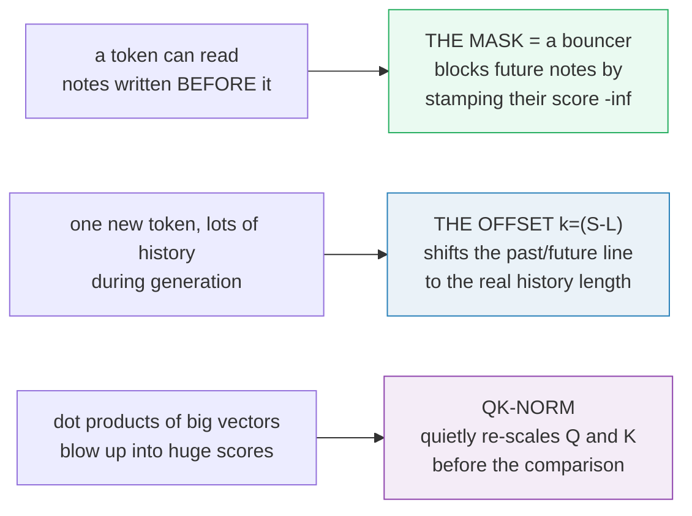
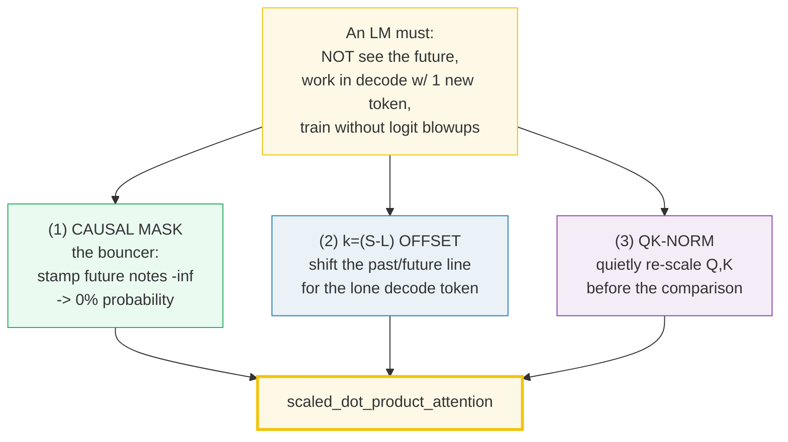
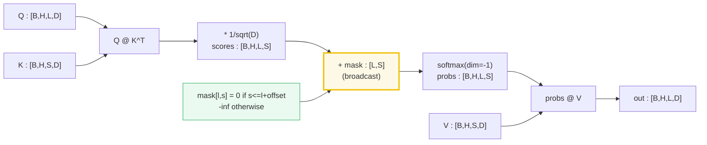
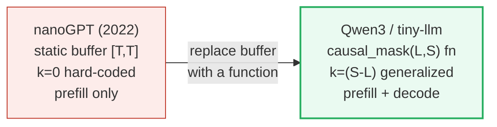
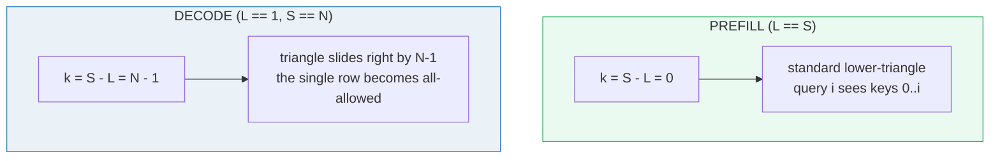
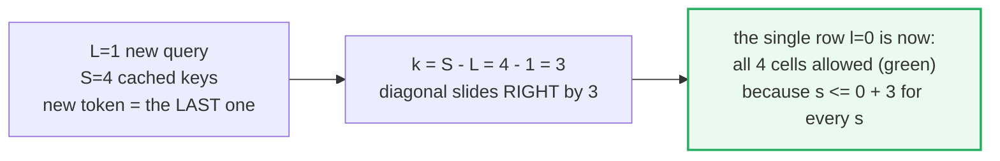
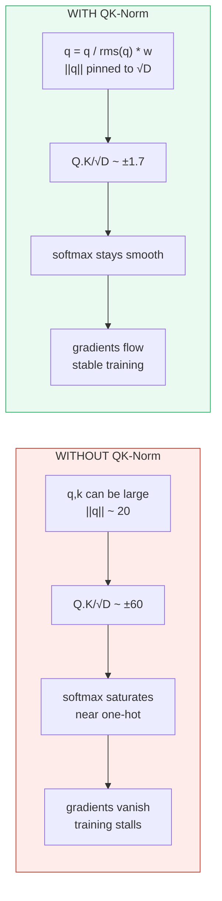
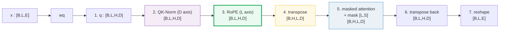
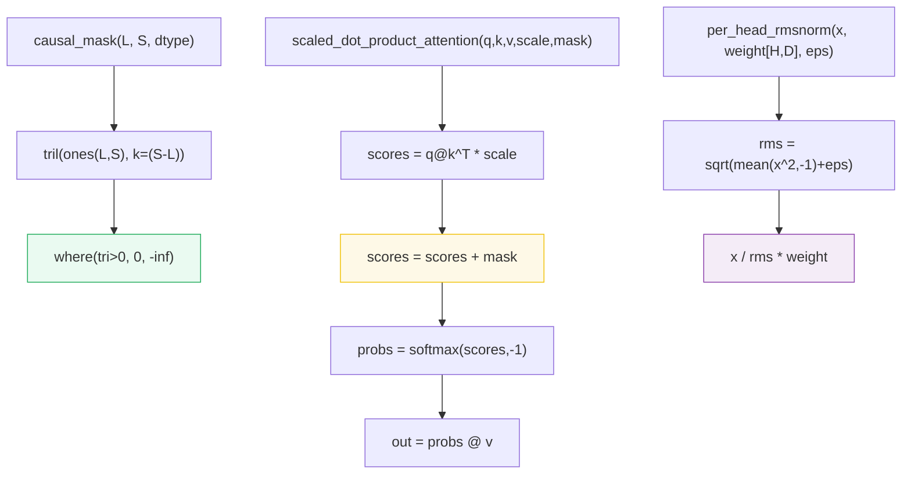
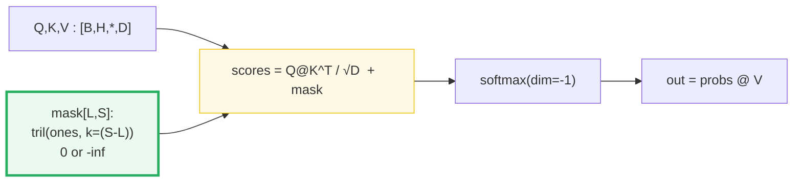

# The Causal Mask + QK-Norm — A Visual, Worked-Example Guide

> **Companion code:** [`causal_mask.py`](./causal_mask.py). **Every number in this
> guide is printed by `uv run python causal_mask.py`** — change the code, re-run,
> re-paste. Nothing here is hand-computed.
>
> **Sibling guides:** [`ROPE.md`](./ROPE.md) (rotation on the `L` axis,
> `offset=slice(m, m+1)` for decode) and [`KV_CACHE.md`](./KV_CACHE.md) (the `offset`
> and `k=(S−L)` are the same idea wearing different hats). Cross-references are
> marked 🔗 throughout.
>
> **Live animation:** [`causal_mask.html`](./causal_mask.html) — drag `L` and
> `S`, toggle prefill/decode, watch the mask triangle slide.
>
> **Source material:** `learning_guide/00_Foundations.md` §9 + §7.5,
> `learning_guide/01_Math_Pipe.md` §2.5.

---

## Read this first — the whole idea in plain English

A language model reads a sentence one token at a time. Each token is allowed to
look back at the notes written **before** it, but never at the notes written
**after** it. Three small mechanisms inside the "attention" block enforce that
rule and keep training stable. This guide is the bundle for all three, because
they only make sense together.



| Mechanism | Plain-English job | One-line analogy |
|---|---|---|
| **(1) Causal mask** | Block every future token from being read. | *A bouncer that stamps any future note "−∞" so it gets 0% probability.* |
| **(2) `k=(S−L)` offset** | One mask formula works for both prefill (many tokens) and decode (one token). | *During generation there is 1 new token but a whole history of old notes; the bouncer's past/future line must shift to the real history length — or the lone token gets cut off / hallucinates the future.* |
| **(3) QK-Norm** | Keep the comparison scores small so training doesn't stall. | *Before comparing queries and keys, quietly re-scale each one so their dot products don't blow up into huge unstable numbers.* |

> If you have never seen **attention**, **softmax**, **query/key**, or tensor
> **transpose/reshape**, jump to the [Glossary](#glossary-for-newcomers) right
> below, then come back. Every term is defined at first use.

---

## Glossary (for newcomers)

| Term | Plain-English meaning |
|---|---|
| **attention** | How a token decides which other tokens matter to it: score each, then take a weighted average. |
| **query (Q)** | The "question" vector of a token — what it is looking for. |
| **key (K)** | The "label" vector of a token — how it can be found. |
| **value (V)** | The "content" vector of a token — what actually gets averaged in. |
| **softmax** | Turns a list of raw scores into **probabilities that sum to 1** (each becomes a "share"). |
| **−∞** (minus infinity) | The mask value. After softmax, `exp(−∞) = 0`, so that position gets **exactly 0% probability** — it is blocked. |
| **causal** | "Cause comes before effect": token `i` may read only tokens `0..i`, never the future. |
| **prefill** | The first forward pass over the whole prompt — many tokens at once. `L = S`. |
| **decode** | Generating one new token per step after prefill — one token at a time. `L = 1, S = full length`. |
| **L** | Query length = how many **new** tokens this forward pass is asking about. |
| **S** | Key length = how many tokens are in the key store (the full history / KV cache). |
| **diagonal / triangular mask** | A grid where cell `(l, s)` is **green/allowed** if `s ≤ l` (on or below the diagonal) and **red/blocked** otherwise. The bouncer's allow/deny map. |
| **QK-Norm** | An extra RMSNorm applied to Q and K **before the dot product**, so logits stay small and softmax stays well-behaved. |
| **transpose / reshape** | Rearranging the axes of a multi-dimensional array **without changing the data**, so the right axis lines up for the math. |
| **RMSNorm** | Rescales a vector by its root-mean-square (no mean subtraction): `x / sqrt(mean(x²)+eps) * weight`. Pins the vector's size to a known value. |
| **logit** | A raw pre-softmax score. Big logits → softmax saturates (one-hot). |

---

## 0. TL;DR — three mechanics, one attention block

A causal LM's attention has to do three things at once: stop tokens from peeking
at the future, keep working when only one new token arrives during generation,
and keep training stable. This guide is the bundle for all three, because they
only make sense together:



One plain sentence each: **(1)** the mask is a bouncer that blocks future tokens
by stamping their score `−∞` (zero probability after softmax). **(2)** the offset
`k=S−L` slides the bouncer's allow/deny line so the lone decode token is treated
as the *last* token, not position 0. **(3)** QK-Norm re-scales Q and K before the
dot product so the scores stay small and softmax never saturates.

| | (1) Causal mask | (2) `k=(S−L)` offset | (3) QK-Norm |
|---|---|---|---|
| **What** | `scores += where(allow, 0, -inf)` | `diagonal=(S−L)` in `tril` | `q = rmsnorm(q)`, `k = rmsnorm(k)` |
| **Why** | Block the future | Slide the triangle for decode | Bound the logits, stop softmax saturation |
| **When** | Every attention call | Matters most in decode (KV cache) | Training-time stabilizer |
| **In nanoGPT?** | Yes (static buffer) | No (only prefill path) | No |

> 🔗 **If you only read one cross-reference:** `k=(S−L)` and RoPE's
> `offset=slice(m, m+1)` are *the same idea* — "during decode, the new token
> lives at the END of the sequence, so index its true position, not zero". Get
> either wrong and the model emits garbage after prefill. See
> [`ROPE.md`](./ROPE.md) §10.

---

## 1. Why causal: add `-inf` before softmax

> **One sentence:** the mask is a bouncer — it lets token `i` read notes
> `0..i` (its own past) and blocks every later note by stamping its score `−∞`,
> which after softmax becomes exactly `0%`.

**Attention** for one head is a **softmax** over keys. Without masking, every
**query** sees **every** key — including future tokens. For an autoregressive LM
that is *information leakage*: token `i` is conditionally generating token
`i+1`, so it must not read token `i+1`'s representation.

The fix is one line, and it has to happen **before** softmax:

```
scores = (Q @ K^T) / sqrt(D)         # [B,H,L,S]
scores = scores + mask               # add -inf at future positions
probs  = softmax(scores, dim=-1)     # exp(-inf) = 0 -> prob exactly 0 there
out    = probs @ V
```

Why `−∞` and not just `0`? Because **softmax** *normalizes* the row (it turns
scores into probabilities that sum to 1). If you set a score to `0` (a neutral
value) the row would still put probability mass on it. Setting it to `−∞` makes
`exp(−∞) = 0`, so the masked position gets **exactly zero probability**,
regardless of what the other scores are. This is the canonical recipe from
"Attention Is All You Need" §3.2.1 ("set to −∞ all values in the input to the
softmax which correspond to illegal connections").



> From `causal_mask.py` **Section C** — the prefill mask `[L=4, S=4]`, shown as
> probabilities after softmax (note every cell **above** the diagonal is exactly
> `0.0000`):
>
> | l (query) \ s (key) | s=0 | s=1 | s=2 | s=3 |
> |---|---|---|---|---|
> | l=0 | **1.0000** | 0.0000 | 0.0000 | 0.0000 |
> | l=1 | 0.5624 | **0.4376** | 0.0000 | 0.0000 |
> | l=2 | 0.3139 | 0.3309 | **0.3552** | 0.0000 |
> | l=3 | 0.2429 | 0.2788 | 0.2336 | **0.2446** |
>
> Row `l=0` puts 100% on itself (it has no past). Row `l=3` spreads across all
> four keys. Every strictly-upper-triangular cell is `0.0000`. `[check] my SDPA
> == torch SDPA (atol=1e-6)? True` — the from-scratch implementation matches
> `torch.nn.functional.scaled_dot_product_attention`.

### Lineage: the static pre-registered buffer (nanoGPT)

nanoGPT pre-registers a single big lower-triangular `bool` buffer at init, then
slices it every forward pass:

```python
# ../nanoGPT/model.py — CausalSelfAttention.__init__
self.register_buffer("bias",
    torch.tril(torch.ones(block_size, block_size)).view(1,1,block_size,block_size))
# ... forward ...
att = att.masked_fill(self.bias[:,:,:T,:T] == 0, float('-inf'))
```

That works for **prefill only** (`L == S == T`, `k=0` baked in). It cannot
represent the decode case (`L=1, S=N`) because the buffer is a square `[T,T]`.
The Qwen3 / `tiny-llm` lineage generalizes it to a *function* `causal_mask(L,S)`
that computes the right triangle every call, using the `k=(S−L)` offset below.



---

## 2. The `k=(S−L)` diagonal offset — one formula, prefill AND decode

This is the whole subtlety. The mask is `[L, S]` where `L` = number of **new**
queries and `S` = number of **cached** keys. In prefill they're equal; in decode
`L=1` and `S=` full sequence length. **One formula** handles both:

```
mask = where( tril(ones((L,S)), diagonal=(S-L)) > 0, 0, -inf )
```

The `diagonal=(S−L)` argument to `tril` is the slider. It says "start the
triangle `(S−L)` positions to the *right* of the main diagonal".



### Prefill: `L=S=4`, `k=0`

> From `causal_mask.py` **Section A** — `0` = attend, `-inf` = blocked:
>
> | l (query) \ s (key) | s=0 | s=1 | s=2 | s=3 |
> |---|---|---|---|---|
> | l=0 | 0 | -inf | -inf | -inf |
> | l=1 | 0 | 0 | -inf | -inf |
> | l=2 | 0 | 0 | 0 | -inf |
> | l=3 | 0 | 0 | 0 | 0 |

Standard causal triangle. Every query `i` attends to keys `0..i`.

**Reading the grid in plain terms:** picture the table as a green/red grid —
**green (`0`) = allowed**, **red (`−inf`) = blocked**. Row `l` is the token
asking the question, column `s` is the note it wants to read. The diagonal and
below is green (your own past); everything strictly above the diagonal is red
(the future). When you switch from prefill to decode below, the green region
stays the same shape but the diagonal **slides** right.

### Decode: `L=1`, `S=4`, `k=3` — narrated step by step

This is the moment the offset earns its keep, so let's walk it slowly.

**Setup.** The model has already processed a 4-token prompt (positions 0,1,2,3)
and now generates the 5th token. There is **one new query** (`L=1`) but **four
cached keys** (`S=4`). The new token is the *last* token — nothing in the
sequence is in its future, so it must be allowed to read **all four** keys.

**The shift.** The bouncer's allow/deny line sits at the diagonal `s = l +
(S−L)`. With `k = S−L = 4−1 = 3`, that line slides three columns to the right of
where the prefill triangle would put it.



**Print the mask** — one row, all allowed:

> From `causal_mask.py` **Section B** — the single new query may attend to **all**
> cached keys (it is the last token, nothing is in its future):
>
> | l (query) \ s (key) | s=0 | s=1 | s=2 | s=3 |
> |---|---|---|---|---|
> | l=0 | 0 | 0 | 0 | 0 |

Every cell is green. That is correct: the newest token reads its whole past.

**Now show the bug (`k=0`, the prefill formula misapplied to decode).** If you
forgot the offset and used `k=0`, the diagonal would not slide, and the lone row
would become:

> | l (query) \ s (key) | s=0 | s=1 | s=2 | s=3 |
> |---|---|---|---|---|
> | l=0 | 0 | −inf | −inf | −inf |

The lone new token is now **blocked from everything except key 0** — the very
first token of the prompt. It would "see" only that one note and ignore the
entire history in between. That is nonsense: a token that should read its whole
past is instead cut off after the first word. No crash, no error — just silent
garbage. **Section 4** shows this bug in real numbers.

> 🔗 The `k=(S−L)` offset here is the *attention-side twin* of RoPE's
> `offset=slice(m, m+1)` ([`ROPE.md`](./ROPE.md) §10). Both encode "during
> decode, the new token sits at position `current_len`, not zero". The KV cache
> ([`KV_CACHE.md`](./KV_CACHE.md)) is what makes `S > L` possible: it stores the past
> keys/values so each decode step only processes the one new token.

---

## 3. Full masked attention — Section C output

> **One sentence:** run the whole masked attention once on a tiny input and read
> the answer off the output table — every future cell is forced to `0`.

A complete call: `B=1, H=1, L=4, S=4, D=8`. `v` is one-hot per key, so the
attention **output** on dims `0..3` equals the attention **probabilities**
directly — the cleanest way to see what the mask does to the answer.

> From `causal_mask.py` **Section C** — `out[l,d] == probs[l,d]` for `d=0..3`:
>
> | l | out[0] | out[1] | out[2] | out[3] | out[4] | out[5] | out[6] | out[7] |
> |---|---|---|---|---|---|---|---|---|
> | 0 | +1.0000 | +0.0000 | +0.0000 | +0.0000 | +0.0000 | +0.0000 | +0.0000 | +0.0000 |
> | 1 | +0.5624 | +0.4376 | +0.0000 | +0.0000 | +0.0000 | +0.0000 | +0.0000 | +0.0000 |
> | 2 | +0.3139 | +0.3309 | +0.3552 | +0.0000 | +0.0000 | +0.0000 | +0.0000 | +0.0000 |
> | 3 | +0.2429 | +0.2788 | +0.2336 | +0.2446 | +0.0000 | +0.0000 | +0.0000 | +0.0000 |

Read row by row: `out[0]` is `[1, 0, 0, 0, …]` (token 0 attends only to itself).
`out[3]` is `[0.243, 0.279, 0.234, 0.245, 0, …]` — a real weighted average over
**all four** keys. Dims `4..7` are always 0 because `v` is zero there. This is
the gold value the `.html` recomputes in JS.

---

## 4. The WRONG mask on decode — Section D output

> **One sentence:** forgetting the offset makes the lone decode token see only
> the first key — silent garbage, no crash.

Forgetting the offset (`k=0` on a decode call) is the canonical silent bug. Same
query, same keys, two masks:

> From `causal_mask.py` **Section D** — `L=1, S=4`:
>
> **CORRECT** mask (`k = S−L = 3`):
>
> | l \ s | s=0 | s=1 | s=2 | s=3 |
> |---|---|---|---|---|
> | l=0 | 0 | 0 | 0 | 0 |
>
> **WRONG** mask (`k = 0`, forgot the offset):
>
> | l \ s | s=0 | s=1 | s=2 | s=3 |
> |---|---|---|---|---|
> | l=0 | 0 | -inf | -inf | -inf |
>
> Resulting attention weights over keys `s=0..3`:
>
> | mask used | probs[0] | probs[1] | probs[2] | probs[3] |
> |---|---|---|---|---|
> | CORRECT `k=3` | 0.4195 | 0.1553 | 0.3751 | 0.0501 |
> | WRONG `k=0` | **1.0000** | **0.0000** | **0.0000** | **0.0000** |

The wrong mask collapses the output to `v[0]` — the new decoded token would
"see" only the **first** token of the prompt and ignore everything in between.
No crash, no error: pure silent corruption. This is the exact same failure mode
as RoPE's `offset=slice(0,1)` bug ([`ROPE.md`](./ROPE.md) §10) — both are
"treated the new token as position 0".

---

## 5. QK-Norm (Qwen3) — bound the logits, keep softmax alive

> **One sentence:** before comparing queries and keys, we quietly re-scale each
> one so their dot products don't blow up into huge unstable numbers.

### What it is

`QK-Norm` is an **extra RMSNorm applied to `Q` and `K` inside the attention
block, before RoPE and before the dot product**. It is not in nanoGPT. Qwen3,
OLMo 2, Gemma 2, and the Vision Transformer in Dehghani et al. 2023 all adopted
it as cheap training insurance (see [Sources](#sources)).

```python
# inside attention, BEFORE RoPE (still in [B,L,H,D]):
q = per_head_rmsnorm(q, self.q_norm, eps=1e-6)   # weight shape [H, D]
k = per_head_rmsnorm(k, self.k_norm, eps=1e-6)
# then RoPE, then transpose, then the masked dot product
```

The per-head RMSNorm is just RMSNorm computed on the `D` axis with a learned
per-head scale `weight[H, D]`:

```
rms    = sqrt(mean(x^2, dim=-1) + eps)        # per (B,L,H) vector
x_hat  = x / rms * weight                      # rescale; does NOT zero-mean
```

### Why it works — Section E output

With deliberately large (`×5`) inputs, the unnormalized `Q·K` scores blow up to
`±60`; softmax would be a near-one-hot spike there, gradients vanish, training
stalls. QK-Norm pins each `q`/`k` vector's RMS to `~1` (so `‖q‖ = √D`), which
caps the score magnitude:

> From `causal_mask.py` **Section E**:
>
> | quantity | WITHOUT QK-Norm | WITH QK-Norm |
> |---|---|---|
> | max ‖q‖ (per token, per head) | 20.0820 | **2.8284** |
> | max ‖k‖ (per token, per head) | 20.8228 | **2.8284** |
> | max RMS(q) (per token, per head) | 7.1001 | **1.0000** |
> | max abs score (`Q·K / √D`) | 61.7954 | **1.6563** |
> | std of scores | 23.9671 | **0.8721** |
>
> `[check] with weight=1, ‖q_normed‖ = √D = 2.8284? max observed = 2.8284 -> OK`

`√8 = 2.8284` is the giveaway: with weight `=1`, RMSNorm pins every `q` vector's
RMS to `1`, so its L2 norm becomes `√D`. The score `Q·K/√D` then ranges over a
bounded interval (~±1.7 here) instead of ±60. Softmax stays well-conditioned,
gradients keep flowing.



> ⚠️ **Sourcing note.** The original "QK-Norm" (Henry et al., Findings EMNLP
> 2020) used **LayerNorm** on Q and K. Qwen3 and the modern open-weight stack use
> the **RMSNorm** variant popularized by Dehghani et al. 2023 ("Scaling ViT to
> 22B"). The *mechanism* (bound Q/K norms → bound logits → stable softmax) is
> identical. See [Sources](#sources).

---

## 6. Shape choreography — `[B,L,H,D]` ↔ `[B,H,L,D]`

> **One sentence:** data lives in a box labelled `[batch, position, head,
> feature]`; position must be the position axis when we rotate (RoPE), then we
> rearrange the box so head is upfront for the comparison math. **Rotate first,
> rearrange second.**

The mask itself is `[L,S]`. But QK-Norm and RoPE have a **shape-ordering
dependency** that is the #1 silent-corruption source after the `k=(S−L)` bug.
Both should, by convention, run **while the tensor is still `[B,L,H,D]`** (i.e. *before* the
attention transpose to `[B,H,L,D]`), because the position axis is `L` and that
is what they index over.

> From `causal_mask.py` **Section F** — the Qwen3 attention forward, shape at
> every step (`B=1, L=4, H=2, D=8`):
>
> | step | shape |
> |---|---|
> | 1. project `q = linear(x, wq).reshape(B,L,H,D)` | `(1, 4, 2, 8)` |
> | 2. QK-Norm `q = rms_norm(q, q_norm[H,D])` (on D, **before** RoPE) | `(1, 4, 2, 8)` |
> | 3. RoPE `q = rope(q, offset=slice(0,L))` (L is the position axis) | `(1, 4, 2, 8)` |
> | 4. transpose `q = q.transpose(1,2)` → `[B,H,L,D]` | `(1, 2, 4, 8)` |
> | 5. attention `out = softmax(q @ k^T * scale + mask) @ v` → `[B,H,L,D]` | `(1, 2, 4, 8)` |
> | 6. transpose back `out = out.transpose(1,2)` → `[B,L,H,D]` | `(1, 4, 2, 8)` |
> | 7. reassemble `out = out.reshape(B, L, H*D)` → `[B,L,E]` | `(1, 4, 16)` |

The mask `[L,S]` enters at step 5 and broadcasts over the `B` and `H` axes of
`scores [B,H,L,S]` — same mask for every batch, every head.



> 🔗 **Why before the transpose?** Each token `m` needs its own rotation, and `m`
> is the `L` axis. The cos/sin tables are indexed by `m` and broadcast over `H`.
> Doing RoPE *after* the transpose to `[B,H,L,D]` is technically possible but is
> the convention *nobody* uses in Qwen/Llama ref code — and if you transpose the
> wrong axis you silently corrupt every head. See [`ROPE.md`](./ROPE.md) §6 for
> the matching diagram.

---

## 7. The reference code (`causal_mask.py`) — annotated

Three tiny functions, each one line of math plus a broadcast:



Map to source material:
- `causal_mask` matches `tiny-llm/src/tiny_llm_ref/attention.py` (cited in
  `learning_guide/00_Foundations.md` §9), rewritten in PyTorch.
- `scaled_dot_product_attention` matches `scaled_dot_product_attention_simple` in
  `learning_guide/01_Math_Pipe.md` §2.5 Stage A.
- `per_head_rmsnorm` matches `mx.fast.rms_norm(q, self.q_norm)` in
  `learning_guide/01_Math_Pipe.md` §2.5 Step 2.

Quick test against the reference (from the source guide, adapted):

```python
from causal_mask import causal_mask, scaled_dot_product_attention
import torch
q = torch.randn(1, 1, 4, 8); k = torch.randn(1, 1, 4, 8); v = torch.randn(1, 1, 4, 8)
mask = causal_mask(4, 4, q.dtype)
out = scaled_dot_product_attention(q, k, v, mask=mask)
assert out.shape == q.shape
```

---

## 8. Pitfalls & debugging checklist

| # | Mistake | Symptom | Fix |
|---|---|---|---|
| 1 | Decode with `k=0` instead of `k=(S−L)` | New token attends only to key 0; silent garbage | `diagonal=(S−L)` always |
| 2 | Using a square `[T,T]` static buffer (nanoGPT style) for decode | Shape mismatch `[1,N]` vs `[T,T]`, or wrong mask | Use the `causal_mask(L,S)` function, not a buffer |
| 3 | Adding the mask AFTER softmax instead of before | Future positions get non-zero probability; leakage | `scores = scores + mask; softmax(scores)` |
| 4 | Using `0` instead of `-inf` in the mask | Masked positions still get probability mass | The masked value must be `-inf` |
| 5 | Forgetting QK-Norm (Qwen3) | Training instability, loss spikes at scale | Apply per-head RMSNorm to Q,K before RoPE |
| 6 | Applying QK-Norm / RoPE AFTER the `[B,L,H,D]→[B,H,L,D]` transpose | Wrong per-position/per-head rotation | Rotate while still `[B,L,H,D]` 🔗 [`ROPE.md`](./ROPE.md) §12 |
| 7 | Mask dtype mismatch (e.g. bool mask added to float scores) | Crash or wrong gradients | Build mask in `scores.dtype`; float `-inf` |
| 8 | QK-Norm on the wrong axis (over `L` instead of `D`) | Destroys position information | RMSNorm is over `D` only |

---

## 9. Cheat sheet



- **Mask:** `mask = where(tril(ones((L,S)), k=(S−L)) > 0, 0, −inf)`; added to
  scores **before** softmax. `0` = attend, `−inf` = block.
- **Prefill:** `L = S`, `k = 0` → standard lower triangle.
- **Decode:** `L = 1`, `S = N`, `k = N−1` → single row, all-allowed.
- **QK-Norm:** `q = q/rms(q)*w_q`, `k = k/rms(k)*w_k` (RMSNorm on `D`, per head)
  **before** RoPE, **before** the dot product. Binds `‖q‖,‖k‖ → √D`, caps logits.
- **Order (Qwen3):** project → **QK-Norm** → **RoPE** (all in `[B,L,H,D]`) →
  transpose to `[B,H,L,D]` → masked SDPA → transpose back → reassemble.
- **Cost:** mask is `O(L·S)`, attention is `O(L·S·D)`; QK-Norm is `O(L·H·D)`,
  negligible.
- **Magic:** `exp(−inf) = 0` is what makes "future" mean "exactly zero
  probability", not "small probability".

> 🔗 The `k=(S−L)` offset and RoPE's `offset=slice(m,m+1)` are the same idea on
> two different axes (attention-keys vs cos/sin-table rows). Read
> [`ROPE.md`](./ROPE.md) §10 for the rotation-side version, and see
> [`KV_CACHE.md`](./KV_CACHE.md) which animates prefill → decode → rewind using
> both offsets together.

---

## Sources

**Causal / masked attention (the `-inf` before softmax recipe):**
- Vaswani et al., "Attention Is All You Need" (2017), §3.2.1 — "set to −∞ all
  values in the input to the softmax which correspond to illegal connections."
  [arXiv:1706.03762](https://arxiv.org/abs/1706.03762)
- nanoGPT static `register_buffer("bias", tril(...))` pattern — referenced in
  `learning_guide/00_Foundations.md` §7.5 and §9.
- `tiny-llm/src/tiny_llm_ref/attention.py` `causal_mask(L, S, dtype)` with the
  `k=(S−L)` offset — referenced in `learning_guide/00_Foundations.md` §9 and
  `learning_guide/01_Math_Pipe.md` §2.5.

**QK-Norm (RMSNorm on Q and K before the dot product, for training stability):**
- Qwen3 Technical Report (2025): "we ... introduce QK-Norm ... to the attention
  mechanism to ensure stable training." [arXiv:2505.09388](https://arxiv.org/abs/2505.09388)
- Dehghani et al., "Scaling Vision Transformers to 22 Billion Parameters"
  (ICML 2023) — the `pmlr-v202-dehghani23a` reference Qwen3 cites for QK-Norm.
  [arXiv:2302.05442](https://arxiv.org/abs/2302.05442)
- Henry et al., "Query-Key Normalization for Transformers" (Findings EMNLP 2020)
  — the **original** QK-Norm paper (uses **LayerNorm**, not RMSNorm).
  [aclanthology.org/2020.findings-emnlp.379](https://aclanthology.org/2020.findings-emnlp.379/)
- Sebastian Raschka, "QK-Norm" (LLM Architecture Gallery, 2025) — accessible
  summary: QK-Norm "sits inside attention and normalizes the query and key
  projections before RoPE and before the dot products are computed." Explicitly
  notes that "MiniMax M2 used a per-head variation", confirming the per-head
  weight shape is a *code-level* choice, not a fixed recipe.
  [sebastianraschka.com/llm-architecture-gallery/qk-norm/](https://sebastianraschka.com/llm-architecture-gallery/qk-norm/)
- OLMo 2 paper (2025) — ablation showing QK-Norm + post-norm reduce loss spikes.
  [arXiv:2501.00656](https://arxiv.org/abs/2501.00656)

**Per-head RMSNorm placement (`[B,L,H,D]`, before RoPE):**
- `learning_guide/01_Math_Pipe.md` §2.5 Step 2 and `qwen3_week1.py`
  `Qwen3MultiHeadAttention.__call__`.
- Raschka, "Understanding and Implementing Qwen3 From Scratch" (Sep 2025) —
  code shows `q_norm`/`k_norm` RMSNorm applied before `apply_rope`.
  [magazine.sebastianraschka.com/p/qwen3-from-scratch](https://magazine.sebastianraschka.com/p/qwen3-from-scratch)

> **Weight-shape note (verified caveat):** "per-head" RMSNorm means the learned
> scale is indexed per head — in the Qwen3 / `tiny-llm` code it has shape
> `[H, D]` (one learned scale per head, per dim) and is applied on the `D` axis.
> This is an **implementation convention**, not a fixed recipe: Raschka's
> from-scratch Qwen3 code uses `RMSNorm(head_dim)` (shape `[D]`, broadcast per
> head), and he separately notes MiniMax M2 ships a dedicated per-head variant.
> The *research* papers (Henry 2020, Dehghani 2023) describe the operation as
> "normalize Q and K" without pinning the weight shape. What is **confirmed by
> all sources** is the mechanism (RMSNorm/LayerNorm on Q,K over the `D` axis)
> and the placement (before RoPE, before the dot product) — both for stability.
