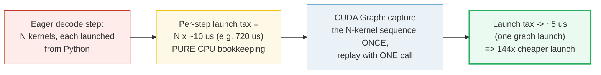
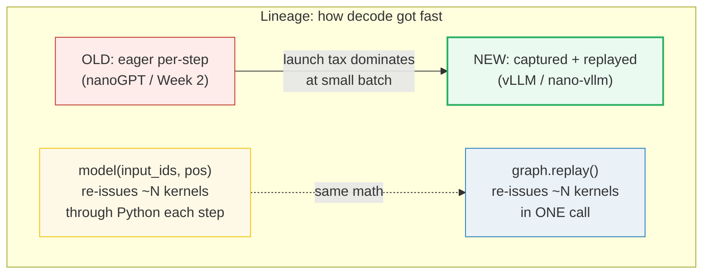
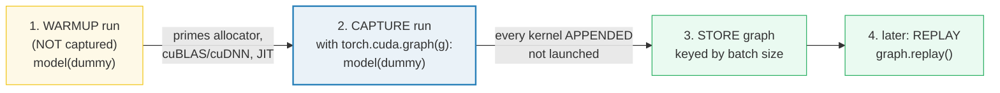
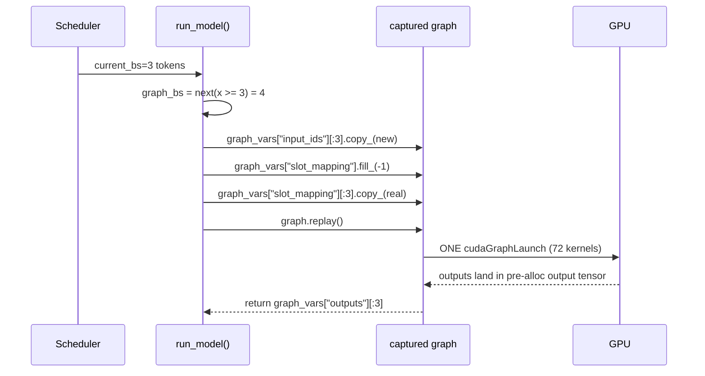
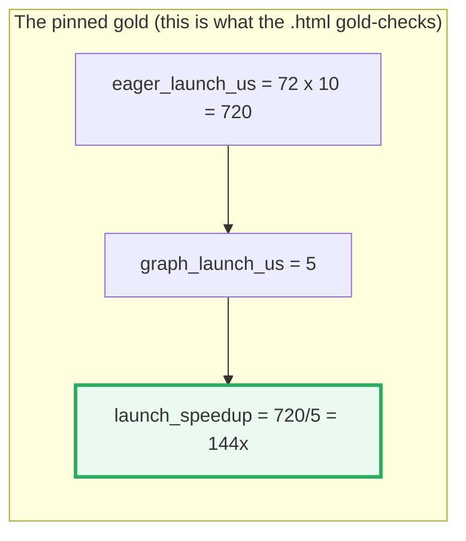
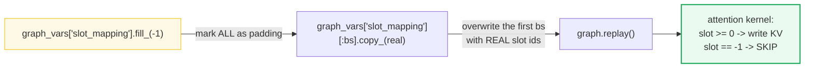
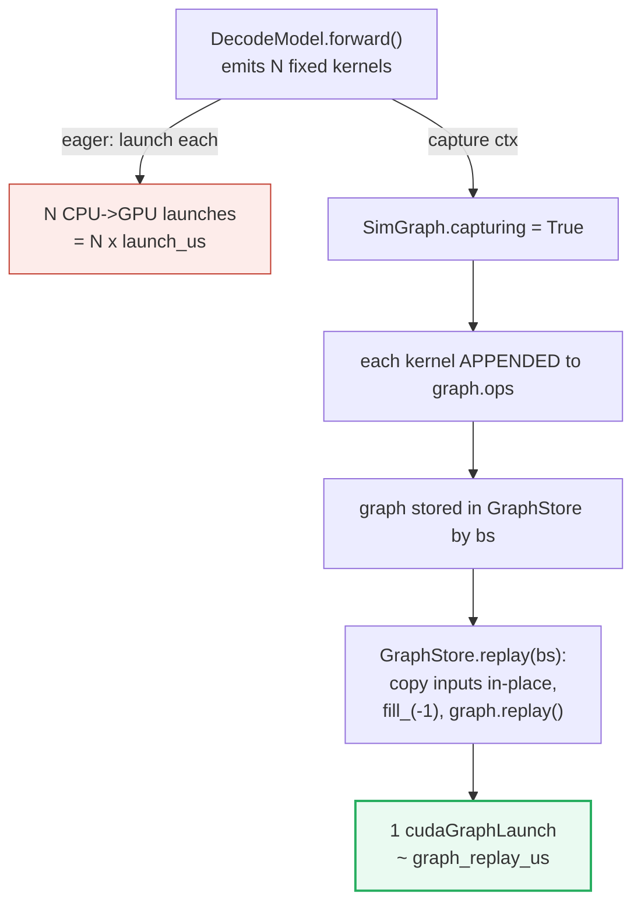
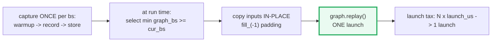

# CUDA Graphs for LLM Decode — A Visual, Worked-Example Guide

> **Companion code:** [`cuda_graphs.py`](./cuda_graphs.py). **Every number in this
> guide is printed by `uv run python cuda_graphs.py`** — change the code, re-run,
> re-paste. Nothing here is hand-computed.
>
> **Live animation:** [`cuda_graphs.html`](./cuda_graphs.html) — open in a browser,
> drag sliders, watch launch overhead collapse.
>
> **Sibling guides:** [`SCHEDULER.md`](./SCHEDULER.md) — the decode loop these
> graphs accelerate; it assembles the fixed-shape batch on the CPU, the graph
> replays it in one GPU call (🔗 §1). [`PAGED_ATTENTION.md`](./PAGED_ATTENTION.md)
> — defines the `slot_mapping` ids (`slot = block_id × block_size + offset`) this
> guide pads with `-1` (🔗 §8). [`KV_CACHE.md`](./KV_CACHE.md) — the `block_table`
> that produces those slot ids across decode steps.
>
> **Source material:** `learning_guide/03_Scale_Serving.md` §7.2–§7.3 and the
> real reference `../nano-vllm/nanovllm/engine/model_runner.py` (`capture_cudagraph()`
> and `run_model()`).

---

> ## ⚠ PLATFORM NOTE — this `.py` is a faithful SIMULATION
>
> The machine these files were built on is **Apple Silicon with NO CUDA device**,
> so `torch.cuda.CUDAGraph` cannot run for real. The `.py` therefore
> **FAITHFULLY SIMULATES the capture/replay MECHANISM** in pure Python: a
> captured graph is a frozen ordered list of "ops" recorded once and replayed
> verbatim, exactly mirroring `torch.cuda.CUDAGraph`'s record/replay contract.
>
> **The latency figures are the REAL published ones** (~5–14 µs per kernel
> launch on PCIe gen3 GPUs, ~few-µs single graph launch, ~50–100 kernels per
> decode step) — see [§ Sources](#sources). The CONCEPT and the MATH are the
> point of the repo philosophy (tiny-but-complete, every number printable).
> Anything simulated is labelled **`[SIM]`**. This is a *teaching* reference,
> not a benchmark.

---

## 0. TL;DR — the whole idea in one picture

> **The barista analogy (read this first):** In eager mode the CPU is a barista
> who must be told every step for every coffee: *"grind beans… pour water…
> steam milk…"*. For 50+ kernels per decode step that is ~720 µs of pure
> **talking** that produces zero coffee. A **CUDA Graph** records the whole
> recipe **once** ("make a latte") and replays it with a **single** call. Same
> coffee, no repeated talking.

LLM **decode** is brutally repetitive: each step runs the **same** kernel
sequence at the **same** shapes, only the data changes. But in **eager** PyTorch
every kernel is launched from the Python interpreter one at a time, and every
**launch** costs CPU→GPU driver overhead (~5–14 µs). With ~50–100 kernels per
step, that overhead is a large fixed tax — **720 µs of bookkeeping that does
zero FLOPs**. CUDA Graphs **capture** the kernel sequence once into a frozen
graph, then **replay** it with a single GPU call, deleting the per-kernel tax.



| | Eager (old) | Graphed (new) |
|---|---|---|
| **Who launches kernels?** | Python interpreter, one at a time | One `graph.replay()` call |
| **Launches per decode step** | `N_kernels` (~50–100) | **1** |
| **Launch overhead** | `N × ~10 µs` (≈ 720 µs) | **~5 µs** (one graph launch) |
| **Shapes** | any (flexible) | fixed at capture time |
| **Used for** | prefill (variable length), huge batch | **decode** (1 token/seq, fixed shape) |
| **Inputs** | fresh tensors each call | pre-allocated tensors, updated **in-place** |

> One plain sentence: **eager re-launches every kernel every step; a graph
> records them once and replays them as one unit — the launch tax collapses
> from `N × launch_us` to a single graph launch.**

### Glossary (plain English — refer back any time)

| Term | Plain meaning |
|---|---|
| **kernel** | A GPU function (matmul, RMSNorm, attention, …) launched from the CPU. |
| **launch** | The CPU→GPU call that asks the GPU to run a kernel. Costs ~5–14 µs of driver overhead each time, producing zero FLOPs. |
| **eager mode** | PyTorch runs each op the moment it is encountered → `N` launches per step. |
| **graph** | A frozen DAG of GPU ops captured once, replayable as a single unit. |
| **capture** | Recording the op sequence (under `torch.cuda.graph(g)`) — done ONCE per batch size. |
| **replay** | Re-running the captured sequence with one `cudaGraphLaunch` call. |
| **warmup** | A throwaway run *before* capture that primes allocators / cuBLAS / JIT. **Not** captured. |
| **decode** | Generation phase: 1 new token per sequence per step. Fixed shape → **graphable**. |
| **prefill** | First pass over the prompt. Variable length → **not** graphable. |
| **graph_bs** | The set of batch sizes a graph is pre-captured for (`[1,2,4,8,16,…]`). |
| **graph_vars** | The dict of **pre-allocated** input/output tensors the graph reuses. |
| **slot_mapping** | Per-token KV-cache write address (`block_id × block_size + offset`). 🔗 [PAGED_ATTENTION.md](./PAGED_ATTENTION.md) |

---

## 1. Lineage: old (eager) → new (graphed), with the WHY

The ZeroServe serving stack (Phase 3) layers optimizations on top of each other.
CUDA Graphs sit at the **execution** layer — they accelerate *how* the scheduler's
chosen batch runs, not *which* tokens run.



**The WHY in one line:** at small/medium batch, **launch overhead is a fixed,
repeated tax** that a graph removes in a single call. As batch grows the
**compute** (which is identical eager vs graph) dominates and the tax becomes
negligible — so graphs help most where decode latency matters most: small,
latency-sensitive batches.

This is the same "record once, replay many" idea as `torch.cuda.CUDAGraph`, and
is exactly what nano-vllm's `ModelRunner.capture_cudagraph()` /
`run_model()` do (see [`../nano-vllm/nanovllm/engine/model_runner.py`](../nano-vllm/nanovllm/engine/model_runner.py)).

> 🔗 **Where this fits:** the **scheduler** (🔗 [`SCHEDULER.md`](./SCHEDULER.md))
> decides *which* sequences form the next decode batch, on the CPU. CUDA Graphs
> only accelerate the *model forward* inside that one fixed-shape step. The two
> are orthogonal: continuous batching chooses the batch; graphs run it fast.

---

## 2. Section A — the eager launch-overhead problem (real µs arithmetic)

> **The tax, in numbers.** A small LLM (24 layers, 3 kernels/layer = **72
> kernels per decode step**) re-issues all 72 kernels through the Python
> interpreter every step. At the published ~10 µs/launch, that is **720 µs of
> pure CPU bookkeeping per step** — over half the step for a tiny model.

The tiny model used throughout (`num_layers=24, kernels_per_layer=3`):

> From `cuda_graphs.py` **Section A**:
>
> ```
> Model: num_layers=24, kernels_per_layer=3, N_kernels=72
> Published figures: launch=10 us/kernel (PCIe gen3, NVIDIA forums),
>                     compute~8 us/kernel (decode bw-bound).
> ```
>
> | per eager decode step | value (us) |
> |---|---|
> | N_kernels | 72 |
> | × launch latency per kernel | 10.0 |
> | **= EAGER LAUNCH OVERHEAD** | **720** |
> | &nbsp;&nbsp;&nbsp;(pure CPU bookkeeping, 0 FLOPs) | |
> | + actual compute (unchanged) | 576 |
> | = EAGER STEP TOTAL | 1296 |
>
> ```
> => 55.6% of an eager decode step is wasted on launch overhead
>    (720 us out of 1296 us). That is the tax CUDA Graphs delete.
> ```

**The anchor formula** (verified against the NVIDIA forums + vLLM docs, see
[§ Sources](#sources)):

```
eager_launch_us = N_kernels × launch_us_per_kernel     # e.g. 72 × 10 = 720
```

**Why ~10 µs?** On PCIe gen3 GPUs, null-kernel launches have been ~5 µs for a
decade (NVIDIA forum, njuffa), with the largest ~14 µs and a minimum ~770 ns.
For real (non-null) kernels with argument packing + scheduling, ~10 µs is the
sensible mid-range figure. vLLM and the Orca/serving literature cite "5–20 µs
per kernel launch."

> **Read the table like a story:** 720 µs is a fixed cost the GPU pays every
> single decode step, regardless of what the tokens actually are. It is the
> thing the rest of this guide deletes.

---

## 3. Section B — capture: warmup → record → store  `[SIM]`

> **Recording the recipe.** Capture runs the model forward **once** under a
> special context manager. Every kernel the model emits gets **appended to the
> graph** instead of launched. The graph is then a frozen, ordered list of GPU
> ops + the **addresses** of the pre-allocated tensors it reads/writes.

Two mandatory phases — **skip either and capture is broken**:



The `[SIM]` capture in `cuda_graphs.py` mirrors this exactly:

> From `cuda_graphs.py` **Section B**:
>
> ```
> [SIM] Capturing a graph for bs=1:
>   ops before warmup : 0
>   ops after warmup  : 0   (warmup is NOT captured)
>   ops after capture : 72   (== N_kernels = 72)
>
> [check] captured ops == N_kernels:  OK
>
> First 6 captured ops:
>   [ 0] L00 attn_qkv
>   [ 1] L00 attn_score
>   [ 2] L00 mlp_ffn
>   [ 3] L01 attn_qkv
>   [ 4] L01 attn_score
>   [ 5] L01 mlp_ffn
>   ... (66 more)
> ```

**The warmup is the #1 footgun** (see [§ pitfalls](#7-pitfalls--debugging-checklist)):
skip it and the graph captures uninitialized lazy state (cuDNN algorithm
selection, cuBLAS handles, allocator pools) → either a hard capture error or
silent garbage on replay. This is exactly why nano-vllm runs `warmup_model()`
*before* `capture_cudagraph()` in `ModelRunner.__init__`.

> One plain sentence: warmup primes the GPU's lazy machinery; capture then
> freezes the kernel sequence into a single replayable unit.

---

## 4. Section C — one graph per batch size + selection at replay

> **Why not one graph for everything?** A captured graph **bakes in** the tensor
> shapes and strides. A graph captured for `bs=8` will **not** run a `bs=3`
> batch (illegal memory access). So we pre-capture a **small set** of batch
> sizes and, at run time, pick the **smallest captured graph ≥ current batch**.

This is vLLM's "capture sizes / shape buckets" idea (T-shirt sizing: S, M, L, XL)
and nano-vllm's exact `graph_bs` list:

> From `cuda_graphs.py` **Section C**:
>
> Source mirrored: `../nano-vllm/nanovllm/engine/model_runner.py`
> `capture_cudagraph()`
> ```python
> self.graph_bs = [1, 2, 4, 8] + list(range(16, max_bs + 1, 16))
> ```
>
> **Pre-captured graphs** (`max_bs=32`):
>
> | captured bs | captured ops (= N_kernels) |
> |---|---|
> | 1 | 72 |
> | 2 | 72 |
> | 4 | 72 |
> | 8 | 72 |
> | 16 | 72 |
> | 32 | 72 |
>
> **Selection at run time** (current batch → which graph replays):
>
> | current bs | selected graph_bs | wasted slots |
> |---|---|---|
> | 1 | 1 | 0 |
> | 2 | 2 | 0 |
> | 3 | 4 | 1 |
> | 5 | 8 | 3 |
> | 8 | 8 | 0 |
> | 10 | 16 | 6 |
> | 17 | 32 | 15 |
> | 24 | 32 | 8 |

**The selection line** (`next(x for x in graph_bs if x >= current_bs)`) is a
one-liner in real `run_model()`:

```python
# nano-vllm: nanovllm/engine/model_runner.py run_model()
graph = self.graphs[next(x for x in self.graph_bs if x >= bs)]
```

**Wasted slots** (`graph_bs − current_bs`) are exactly why [§8](#8-section-g--the-slot_mappingfill_-1-padding-trick)'s
`-1` padding trick exists: the graph always runs `graph_bs` slots; the unused
ones must be marked so the attention kernel ignores them.

> One plain sentence: capture a handful of standard batch sizes; at run time
> round the current batch **up** to the nearest captured size and accept a few
> wasted slots.

---

## 5. Section D — replay: in-place copy + `graph.replay()`  `[SIM]`

> **The frozen-address rule.** Replay reads/writes the **same tensor addresses**
> the graph captured. You may **overwrite their contents in-place**, but you
> must **never replace the tensor object**. To run a new batch: copy the new
> data into the pre-allocated inputs, then call `graph.replay()`.



The `[SIM]` replay in `cuda_graphs.py` (mirrors `run_model()` line-for-line):

> From `cuda_graphs.py` **Section D**:
>
> ```
> Replay for current_bs=3 -> selected graph_bs=4
>   graph.input_ids   (captured tensor, shape [4]):
>     data : [0, 1, 2, 0]
>   graph.positions   (shape [4]):
>     data : [0, 1, 2, 0]
>   graph.slot_mapping (shape [4]):
>     data : [0, 1, 2, -1]   (-1 marks the 1 padding slots)
>   graph.replay() -> re-issued 72 kernels in ONE call
>
> [check] padding slots (>= current_bs) are all -1:  OK
> [check] replay_count == 1 after one replay:  OK
> ```

Notice `graph.replay()` returns **72 kernels re-issued in ONE call** — vs eager's
72 separate CPU→GPU launches. That single-call property is the entire win
quantified in [§6](#6-section-f--eager-vs-captured-timeline--speedup-math-gold).

> One plain sentence: copy the new batch's data *into* the graph's frozen input
> tensors (in-place), then one `replay()` — the addresses never change.

---

## 6. Section F — eager vs captured timeline + speedup math (GOLD)

> **Two speedups, do not conflate them.** The **launch-overhead speedup** is the
> pinned gold (720 µs → 5 µs = **144×**). The **total step speedup** is smaller
> because the *compute* is identical in both — and it **shrinks as batch grows**,
> since launch overhead is fixed but compute scales with batch.

> From `cuda_graphs.py` **Section F**:
>
> ```
> N_kernels=72, launch=10 us/kernel, graph_replay=5 us, compute=8 us/kernel
> ```
>
> **Per-step timeline (us), batch=1 decode:**
>
> | phase | EAGER | GRAPHED |
> |---|---|---|
> | launch overhead | 720 | **5** |
> | actual compute (same) | 576 | 576 |
> | **STEP TOTAL** | **1296** | **581** |
>
> **Two different speedups:**
>
> | metric | value | |
> |---|---|---|
> | LAUNCH-overhead speedup | **144.0×** | (720/5) |
> | TOTAL step speedup (compute unchanged) | 2.231× | (1296/581) |
>
> ```
> The launch component is 144x cheaper; the whole step
> is only 2.23x faster here because compute (the same in
> both) is non-trivial. For production models where per-token WEIGHT
> READING dominates (ms-scale, not us-scale), the total speedup shrinks
> into the ~10-20% decode-latency drop vLLM reports -- the launch tax is
> a fixed us cost that matters most at small batch (see table below).
> ```

### The batch-scaling insight (why graphs help most at small batch)

Launch overhead is **fixed** per step (same `N_kernels` no matter the batch).
Compute grows **~linearly** with batch (more tokens to process). So the launch
tax's *fraction* of the step shrinks as batch grows:

> From `cuda_graphs.py` **Section F** (batch-scaling table):
>
> | batch | compute grows? | launch (fixed) | launch frac (eager) | total speedup |
> |---|---|---|---|---|
> | 1 | baseline | 720 | 55.6 | **2.231** |
> | 2 | yes | 720 | 38.5 | 1.618 |
> | 4 | yes | 720 | 23.8 | 1.310 |
> | 8 | yes | 720 | 13.5 | 1.155 |
> | 16 | yes | 720 | 7.2 | 1.078 |
> | 32 | yes | 720 | 3.8 | 1.039 |
> | 64 | yes | 720 | 1.9 | 1.019 |

**Read it like a story:** at batch=1 the launch tax is **55.6%** of the step;
by batch=64 it is **under 2%**. This is *exactly* why serving engines graph the
**small-batch decode path** but fall back to eager once batch > the capture cap
(e.g. nano-vllm: `if is_prefill or enforce_eager or input_ids.size(0) > 512:
return eager`). Real production models run ms-scale compute, so even at batch=1
the *total* speedup lands in the ~10–20% range vLLM publishes — but that 10–20%
is a pure win on the critical interactive-latency path.



> One plain sentence: the **launch** tax drops 144×; the **whole step** drops
> less because compute is unchanged, and **less again** as batch grows.

---

## 7. Section E — limitations (why graphs are decode-only, fixed-shape)

CUDA Graphs are powerful but **strict**. Break a rule and you get either a hard
error or silent corruption.

> From `cuda_graphs.py` **Section E**:
>
> | # | rule | why |
> |---|---|---|
> | 1 | **DECODE only, not prefill** | prefill length varies per request → shape not fixed → cannot capture |
> | 2 | **fixed input shapes** | the graph bakes in tensor shapes/strides; changing them = illegal memory access |
> | 3 | **no allocation inside the graph** | `cudaMalloc` is a host call; the graph is pure device work |
> | 4 | **inputs must be the SAME tensor objects** | replay reads captured addresses; you overwrite data in-place, never swap tensors |
> | 5 | **warmup before capture is mandatory** | skip it and the graph captures un-initialized lazy/cuDNN state |
> | 6 | **bs cap (e.g. >512 falls back to eager)** | huge batches are compute-bound anyway; capture cost not worth it |

**The single most important contrast:** prefill is **variable-length** (each
request's prompt is a different size), so it **cannot** be captured. Decode is
**exactly 1 token per sequence per step**, so its shape depends only on the
batch size — which is why we capture one graph *per batch size* ([§4](#4-section-c--one-graph-per-batch-size--selection-at-replay)).

This is why nano-vllm's `run_model()` has this guard at the top:

```python
if is_prefill or self.enforce_eager or input_ids.size(0) > 512:
    return self.model.compute_logits(self.model(input_ids, positions))  # EAGER
```

---

## 8. Section G — the `slot_mapping.fill_(-1)` padding trick

> **Padding sentinel.** When `current_bs < graph_bs`, the graph still runs
> `graph_bs` slots. The unused slots' KV-write addresses must be marked so the
> paged-attention kernel **skips** them. The convention is the sentinel **`-1`**:
> "no token here — do not write."



> From `cuda_graphs.py` **Section G** — captured `graph_bs=8`, replaying `current_bs=3`:
>
> ```
> real_slots (from block_table)        : [4, 17, 9]
> graph slot_mapping after fill+copy   : [4, 17, 9, -1, -1, -1, -1, -1]
> ```
>
> | slot idx | slot_mapping | token? | kernel action |
> |---|---|---|---|
> | 0 | 4 | token 0 | write KV to physical slot 4 |
> | 1 | 17 | token 1 | write KV to physical slot 17 |
> | 2 | 9 | token 2 | write KV to physical slot 9 |
> | 3 | **-1** | (padding) | **SKIP (slot == -1)** |
> | 4 | **-1** | (padding) | **SKIP (slot == -1)** |
> | 5 | **-1** | (padding) | **SKIP (slot == -1)** |
> | 6 | **-1** | (padding) | **SKIP (slot == -1)** |
> | 7 | **-1** | (padding) | **SKIP (slot == -1)** |
>
> ```
> [check] padding region all -1 AND real region == [4,17,9]:  OK
> ```

**Without this trick**, the padding slots would write garbage KV into *random*
physical memory → **silent corruption of OTHER sequences' caches**. The same
`-1` sentinel pads `context_lens` and `block_tables`.

> 🔗 **`slot_mapping` connects directly to the KV-cache / paged-attention bundles:**
> - **[`PAGED_ATTENTION.md`](./PAGED_ATTENTION.md)** — defines the slot id:
>   `slot = block_id × block_size + position_within_block`. This guide just
>   shows the padding trick; that guide shows where the slot ids come from.
> - **[`KV_CACHE.md`](./KV_CACHE.md)** — the `block_table` that produces these
>   slot ids is the same one the KV cache maintains across decode steps.

---

## 9. The reference code (`cuda_graphs.py`) — annotated

The `[SIM]` classes map 1:1 onto real `torch.cuda.CUDAGraph` usage:



**Map to the real reference** (`../nano-vllm/nanovllm/engine/model_runner.py`):

| `cuda_graphs.py` (`[SIM]`) | real `model_runner.py` |
|---|---|
| `SimGraph(bs)` | `torch.cuda.CUDAGraph()` |
| `GraphStore._capture_all()` warmup+capture loop | `capture_cudagraph()` |
| `graph_bs = [1,2,4,8] + range(16, max_bs+1, 16)` | identical line |
| `GraphStore.select_graph_bs()` | `next(x for x in self.graph_bs if x >= bs)` |
| `GraphStore.replay()` in-place copies | `run_model()` graph_vars copies |
| `graph.slot_mapping.fill_(-1)` | `graph_vars["slot_mapping"].fill_(-1)` |
| `SimGraph.replay()` | `graph.replay()` |

---

## 10. Pitfalls & debugging checklist

| # | Mistake | Symptom | Fix |
|---|---|---|---|
| 1 | **Skipping warmup** before capture | capture error, or silent garbage (cuDNN/cuBLAS handles uninitialized) | always run `model(dummy)` before `torch.cuda.graph()` |
| 2 | **Replacing** the graph's input tensor object | illegal memory access / stale data | overwrite **in-place** (`copy_`), never reassign |
| 3 | **Allocating inside** the graph (e.g. `torch.zeros`) | capture error | pre-allocate everything before capture |
| 4 | Trying to graph **prefill** | shape varies per request → can't capture | prefill stays **eager**; only decode is graphed |
| 5 | Capturing for the **wrong batch size** | shape mismatch on replay | pre-capture `graph_bs = [1,2,4,8,...]` and select `min ≥ bs` |
| 6 | **Forgetting `fill_(-1)`** padding | padding slots write garbage → corrupt other seqs' KV | fill slot_mapping/context_lens/block_tables with `-1` |
| 7 | Expecting a **huge total speedup** at large batch | disappointed (~1.0×) | graphs help most at **small batch**; compute dominates large batch |
| 8 | Dynamic shapes / data-dependent control flow inside graph | capture error or wrong output | keep the graph body shape-static; guard dynamic parts |

---

## 11. Cheat sheet



- **Anchor:** `eager_launch_us = N_kernels × launch_us` (e.g. `72 × 10 = 720`).
- **Gold:** graph replay ≈ single launch → **`720 / 5 = 144×`** launch speedup.
- **Total step speedup** is smaller (compute unchanged); **shrinks with batch**.
- **Capture once per batch size**; `graph_bs = [1,2,4,8] + range(16, max+1, 16)`.
- **Decode-only, fixed shapes, no in-graph alloc, in-place input updates.**
- **Padding sentinel:** `slot_mapping.fill_(-1)` marks unused slots.
- **In nano-vllm:** `capture_cudagraph()` / `run_model()` in `model_runner.py`.

> 🔗 **Cross-references:**
> - [`SCHEDULER.md`](./SCHEDULER.md) — the decode loop these graphs accelerate;
>   the scheduler picks the batch on the CPU, the graph runs it on the GPU.
> - [`PAGED_ATTENTION.md`](./PAGED_ATTENTION.md) — defines the `slot_mapping` ids
>   this guide pads with `-1` (`slot = block_id × block_size + offset`).
> - [`KV_CACHE.md`](./KV_CACHE.md) — the `block_table` producing those slot ids.

---

## Sources

- **NVIDIA.** *CUDA Graphs* — CUDA Programming Guide, §4.2.
  https://docs.nvidia.com/cuda/cuda-c-programming-guide/index.html (topic
  "CUDA Graphs"). Defines a CUDA Graph as a directed acyclic graph (DAG) of GPU
  operations and dependencies that can be **launched as a unit** with a single
  `cudaGraphLaunch` (the basis of [§3](#3-section-b--capture-warmup--record--store--sim)
  and [§5](#5-section-d--replay-in-place-copy--graphreplay--sim)). The companion
  NVIDIA developer blog *Constructing CUDA Graphs with Dynamic Parameters*
  (https://developer.nvidia.com/blog/constructing-cuda-graphs-with-dynamic-parameters/)
  documents the capture→instantiate→replay flow and the fixed-shape constraint
  used in [§7](#7-section-e--limitations-why-graphs-are-decode-only-fixed-shape).

- **NVIDIA Developer Forums — njuffa (2018/2021).** *Kernel launch latency.*
  https://forums.developer.nvidia.com/t/kernel-launch-latency/62455 and
  https://forums.developer.nvidia.com/t/cuda-graphs-impact/189554
  Confirms the **~5 µs** null-kernel launch figure ("standard for the past
  decade" on PCIe gen3), with the largest ~14 µs and a minimum ~770 ns — the
  empirical basis for the `launch_us_per_kernel = 10` figure in
  [§2](#2-section-a--the-eager-launch-overhead-problem-real-us-arithmetic).

- **PyTorch.** *torch.cuda.CUDAGraph* — API docs.
  https://docs.pytorch.org/docs/stable/cuda.html#torch.cuda.CUDAGraph
  Documents `torch.cuda.CUDAGraph()`, the `with torch.cuda.graph(g, pool):`
  capture context manager, and `.replay()` — the exact API the `[SIM]` classes
  in `cuda_graphs.py` mirror ([§9](#9-the-reference-code-cuda_graphspy--annotated)).

- **vLLM Project.** *CUDA Graphs* — vLLM design docs.
  https://docs.vllm.ai/en/latest/design/cuda_graphs/
  Documents the **capture sizes / shape buckets** idea (T-shirt sizing),
  `FULL` vs `PIECEWISE` runtime modes, warmup requirements, and the
  decode-only constraint — all reflected in
  [§4](#4-section-c--one-graph-per-batch-size--selection-at-replay) and
  [§7](#7-section-e--limitations-why-graphs-are-decode-only-fixed-shape).

- **Kwon, W.; Li, Z.; Zhuang, S.; Sheng, Y.; Zheng, L.; Yu, C. H.; Gonzalez,
  J.; Zhang, H.; Stoica, I. (2023).** *Efficient Memory Management for Large
  Language Model Serving with PagedAttention (vLLM).* arXiv:2309.06180 —
  https://arxiv.org/abs/2309.06180
  The vLLM / PagedAttention paper; references CUDA-graph integration for the
  decode path as part of the serving engine that the `slot_mapping`
  ([§8](#8-section-g--the-slot_mappingfill_-1-padding-trick)) and continuous
  batching ([🔗 SCHEDULER.md](./SCHEDULER.md)) belong to.

- **Thomas, E. (2025).** *Efficiently Serving LLMs (Part 4): How CUDA Graphs
  make vLLM think faster.* LinkedIn.
  https://www.linkedin.com/pulse/efficiently-serving-llms-part-4-how-cuda-graphs-make-vllm-thomas-4ofuc
  Independent benchmark: on Qwen2.5-0.5B, CUDA Graphs (FULL) gave **+12.5%
  throughput** and **−12.3% inter-token latency** (7.39 ms → 6.48 ms; FULL +
  PIECEWISE + async → 6.30 ms, −17.3%). Confirms that the total-step speedup
  is modest because compute dominates — the basis for the batch-scaling table
  in [§6](#6-section-f--eager-vs-captured-timeline--speedup-math-gold).

- **Local reference implementation.** `../nano-vllm/nanovllm/engine/model_runner.py`
  (`capture_cudagraph()`, `run_model()`, `prepare_decode()`) — the real
  PyTorch + CUDA-graph code this bundle's `[SIM]` classes mirror line-for-line.
