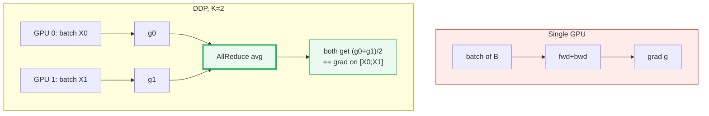
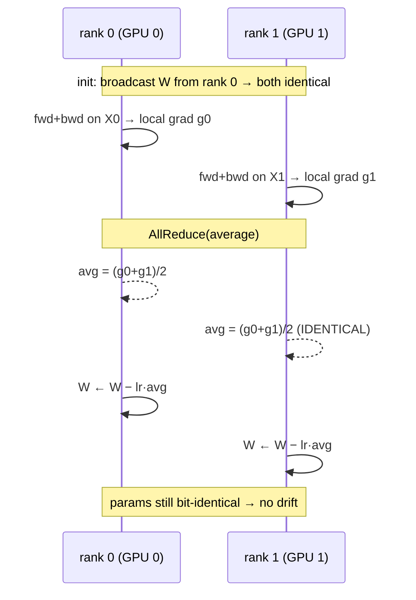
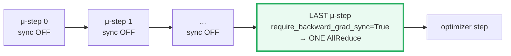
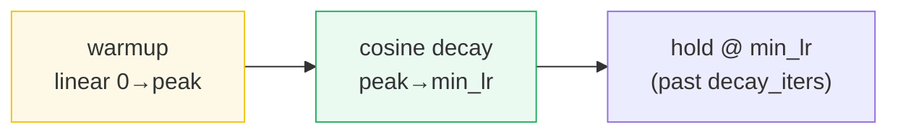
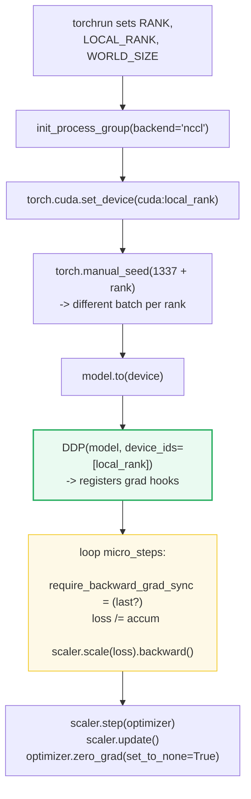
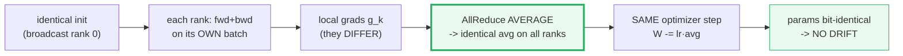

# Distributed Data Parallel (DDP) — A Worked-Example Guide

> **Companion code:** [`ddp.py`](./ddp.py). **Every number in this guide is
> printed by `uv run python ddp.py`** — change the code, re-run, re-paste.
> Nothing here is hand-computed.
>
> **This is a faithful single-process simulation of K=2 DDP ranks.** No
> `torch.distributed`, no NCCL, no multi-process spawn: two full model replicas
> are held as separate leaf tensors and AllReduce is an explicit Python average.
> The **math is bit-for-bit identical** to real DDP; only the execution model is
> simplified so every number is printable on a laptop.
>
> **Sibling guides:** 🔗 [`NCCL_COLLECTIVES.md`](./NCCL_COLLECTIVES.md)
> (the AllReduce primitive DDP is built on), 🔗 [`ZERO.md`](./ZERO.md) (shards the
> 16N optimizer redundancy DDP replicates), 🔗 [`TENSOR_PARALLEL.md`](./TENSOR_PARALLEL.md)
> (shards weights instead of data).
>
> **Live animation:** [`ddp.html`](./ddp.html) — drag a phase slider, watch two
> replicas' gradients collapse into one identical averaged gradient.
>
> **Source material:** `learning_guide/04_Distributed_Scale.md` §3 and
> `../nanoGPT/train.py`.

---

## 0. TL;DR — the whole idea in one picture

> **The chorus-line analogy (read this first):** DDP is like a chorus line of
> identical dancers, each watching a *different* part of the stage (a different
> mini-batch). After each move they **whisper their correction to everyone else
> and average them** (AllReduce), so every dancer ends up making the *exact same
> next move*. Because they started identical *and* always agree on the
> correction, they can never drift out of sync — no matter how long the show
> runs.

One GPU is too slow and its batch is too small. DDP's answer is **replicate the
whole model on every GPU, split the data, average the gradients**:

```mermaid
graph LR
    Prob["Problem: 1 GPU is slow<br/>+ batch too small"] --> Rep["DDP: replicate FULL model<br/>on every GPU"]
    Rep --> Split["each GPU eats a<br/>DIFFERENT mini-batch"]
    Split --> Local["each runs fwd+bwd<br/>-> LOCAL gradient g_k"]
    Local --> AR["AllReduce (average)<br/>g_k -> identical avg"]
    AR --> Step["every GPU takes the<br/>SAME optimizer step"]
    Step --> Nodrift["replicas NEVER drift<br/>(bit-identical forever)"]
    style AR fill:#eafaf1,stroke:#27ae60,stroke-width:3px
    style Nodrift fill:#eafaf1,stroke:#27ae60
    style Prob fill:#fef9e7,stroke:#f1c40f
```



| | Single GPU | **DDP** (this guide) | 🔗 [ZeRO](./ZERO.md) | 🔗 Tensor Parallel |
|---|---|---|---|---|
| **What's split** | nothing | the **data** (batches) | optimizer **state** | the **weights** (matrices) |
| **What's replicated** | — | full model + full optimizer | full model | full data |
| **Communication** | none | AllReduce grads (once/step) | ReduceScatter+AllGather | AllReduce per layer |
| **Memory/GPU** | 20N | 20N (**redundant**) | 16N/K → 2N/K | 20N/TP |
| **Scales throughput?** | — | **linearly** with GPU count | yes (+memory win) | limited to NVLink node |

> **One plain sentence:** DDP trades **redundant memory** (every GPU stores the
> full 20N bytes) for **linear throughput scaling** and a mathematical guarantee
> that replicas can never diverge. That guarantee is the whole point.

### Glossary (plain English — refer back any time)

| Term | Plain meaning |
|---|---|
| **rank (`k`)** | One GPU / one replica, numbered `0..K-1`. |
| **world_size (`K`)** | How many replicas (= how many GPUs) run in parallel. Here `K=2`. |
| **replica** | A full copy of the model living on one rank. DDP keeps them identical. |
| **mini-batch** | The chunk of data ONE rank processes in one forward pass. |
| **gradient (`g`)** | The per-parameter derivative of the loss; what the optimizer subtracts (×lr) to improve the model. |
| **local gradient (`g_k`)** | The gradient rank `k` computes from *its own* mini-batch, before syncing. |
| **AllReduce** | A collective op: every rank contributes a tensor and every rank ends up with the SAME result. DDP uses the **average**. |
| **optimizer step** | The update `W ← W − lr·g` (SGD) or the Adam equivalent. |
| **replica drift** | The (undesired) situation where ranks' params diverge. DDP makes drift mathematically impossible. |
| **effective batch** | Total samples one optimizer step "sees": `bs_per_gpu × grad_accum × world_size`. |
| **GradScaler** | A multiplier on the loss (fp16 only) that stops tiny gradients underflowing to zero. |
| **master weights** | An fp32 copy of the weights the optimizer updates; the fp16 copy used in forward is rounded down from it. |

> 🔗 **If you only read one cross-reference:** DDP replicates everything; ZeRO
> **partitions** the same states. ZeRO-1/2/3 are literally "DDP communication
> pattern, but shard the optimizer / gradients / parameters to kill the 16N
> redundancy." See 🔗 [`ZERO.md`](./ZERO.md).

---

## 1. Why DDP — the single-GPU wall

A single GPU hits two walls at once:

1. **Throughput:** one GPU's compute is finite; big models need millions of
   tokens/second during training.
2. **Batch size:** many training dynamics (stable large-batch SGD, the linear
   scaling rule) want a *big* effective batch — bigger than one GPU can hold in
   memory at once.

DDP solves both by **data parallelism**: copy the model to `K` GPUs, give each a
different slice of the batch, and average the gradients so the `K` GPUs behave
like one `K`-times-faster GPU with a `K`-times-bigger batch.



The key claim — proven with numbers in [§3](#3-why-allreduce-keeps-replicas-identical--section-b-output)
— is that **DDP on `K` GPUs is mathematically equal to one big GPU on the
concatenated batch**. That equivalence is what makes the replicas safe.

---

## 2. The DDP algorithm — Section A output

> **The 6-step recipe.** Every rank holds a full replica (identical init via
> broadcast). Each runs fwd+bwd on its own slice → a *local* gradient. AllReduce
> averages them → every rank holds the *same* gradient. Every rank takes the
> same optimizer step → params stay equal. Repeat forever.



Our tiny demo model is a single linear layer `y = x @ W` (no bias), `W` shape
`[E_in=4, E_out=3]` = 12 params, MSE loss. Two replicas start **identical**
(DDP broadcasts rank 0's weights); each gets a **different** mini-batch.

> From `ddp.py` **Section A**:
>
> Both replicas start IDENTICAL (seeded `g_w`, broadcast):
>
> | | W (flattened, 12 params) |
> |---|---|
> | rank 0 | `[+0.154100, −0.029343, −0.217879, +0.056843, −0.108452, −0.139860, +0.040335, +0.083803, −0.071926, −0.040334, −0.059664, +0.018204]` |
> | rank 1 | `[+0.154100, −0.029343, −0.217879, +0.056843, −0.108452, −0.139860, +0.040335, +0.083803, −0.071926, −0.040334, −0.059664, +0.018204]` |
>
> `[check] W0 == W1 at init? True` &nbsp;|&nbsp; `[check] X0 != X1 (different data)? True`
>
> Each rank runs fwd+bwd on its OWN batch → **different** local grads:
>
> | rank | local gradient (flattened) |
> |---|---|
> | 0 (`g0 = ∇L(X0)`) | `[+0.283542, +0.280142, −0.741705, +0.037271, +0.039551, −0.138614, −0.677840, −0.636189, +1.267672, +0.155872, +0.155462, −0.429742]` |
> | 1 (`g1 = ∇L(X1)`) | `[−0.033977, +0.354733, −0.016214, +0.127422, −0.171269, −0.195930, +0.024608, −0.512199, +0.068287, +0.024687, −0.299299, +0.020984]` |
>
> **These differ** — because the batches differ. Left alone, the two replicas
> would take different steps and **drift apart**.
>
> AllReduce (average) → every rank holds the **identical** averaged grad:
>
> | | averaged gradient `avg = (g0 + g1)/2` |
> |---|---|
> | rank 0 | `[+0.124783, +0.317437, −0.378959, +0.082346, −0.065859, −0.167272, −0.326616, −0.574194, +0.667979, +0.090280, −0.071918, −0.204379]` |
> | rank 1 | `[+0.124783, +0.317437, −0.378959, +0.082346, −0.065859, −0.167272, −0.326616, −0.574194, +0.667979, +0.090280, −0.071918, −0.204379]` |
>
> `[check] both ranks hold the IDENTICAL averaged grad? True`

> One plain sentence: AllReduce turns two disagreeing gradients into one
> shared truth, so the next step is the same everywhere.

**How real DDP does the sync (not simulated here):** PyTorch's `DistributedDataParallel`
registers an **autograd hook on every parameter**. When `backward()` reaches a
parameter, the hook fires and **immediately AllReduces that gradient**, overlapping
communication with the rest of backward. By the time `backward()` returns,
`param.grad` already holds the synchronized (averaged) gradient. (Verified
against the [PyTorch DDP tutorial](https://pytorch.org/tutorials/intermediate/ddp_tutorial.html).)

---

## 3. WHY AllReduce keeps replicas identical — Section B output

> **The magic, in one breath.** DDP on 2 GPUs with batches `X0, X1` is
> **mathematically equal** to single-GPU training on the concatenated batch
> `[X0; X1]`. Because the loss is a **mean**, the gradient of the mean-of-two-
> halves equals the **average of the two half-gradients**. So AllReduce-AVERAGE
> reconstructs *exactly* the gradient one big GPU would have computed.

The proof is one line of calculus. With mean-MSE loss:

```
L([X0;X1]) = mean over (2B·E_out) of (y−t)²
           = ½ · [ mean_B(X0) + mean_B(X1) ]          ← split the mean in half

  ⇒ ∇L([X0;X1]) = ½·(∇L(X0) + ∇L(X1)) = AllReduce-average(g0, g1)
```

So the AllReduce average **is** the single-GPU-on-concatenated-batch gradient.
`ddp.py` verifies this numerically:

> From `ddp.py` **Section B**:
>
> | | gradient (flattened) |
> |---|---|
> | single-GPU grad on `cat([X0;X1])` (batch 4) | `[+0.124783, +0.317437, −0.378959, +0.082346, −0.065859, −0.167272, −0.326616, −0.574194, +0.667979, +0.090280, −0.071918, −0.204379]` |
> | DDP averaged grad (AllReduce of g0,g1) | `[+0.124783, +0.317437, −0.378959, +0.082346, −0.065859, −0.167272, −0.326616, −0.574194, +0.667979, +0.090280, −0.071918, −0.204379]` |
>
> `[check] DDP avg grad == single-GPU grad? True` &nbsp; `(max|diff| = 5.96e-08)`

```mermaid
graph LR
    subgraph ddp["DDP: 2 GPUs"]
        D0["g0 = ∇L(X0)"] --> AVG["avg = (g0+g1)/2"]
        D1["g1 = ∇L(X1)"] --> AVG
    end
    subgraph single["Single GPU"]
        S0["∇L([X0;X1])"]
    end
    AVG -.="exactly equal".-> S0
    AVG --> W0["W ← W − lr·avg  (rank 0)"]
    AVG --> W1["W ← W − lr·avg  (rank 1)"]
    W0 --> EQ["BIT-IDENTICAL<br/>on all ranks"]
    W1 --> EQ
    style AVG fill:#eafaf1,stroke:#27ae60,stroke-width:3px
    style EQ fill:#eafaf1,stroke:#27ae60
```

**Consequence — the optimizer step is identical everywhere** (`lr = 0.1`):

> From `ddp.py` **Section B** (after one SGD step):
>
> | | W after step (flattened) |
> |---|---|
> | rank 0 | `[+0.141621, −0.061087, −0.179983, +0.048609, −0.101866, −0.123132, +0.072996, +0.141222, −0.138724, −0.049362, −0.052472, +0.038642]` |
> | rank 1 | `[+0.141621, −0.061087, −0.179983, +0.048609, −0.101866, −0.123132, +0.072996, +0.141222, −0.138724, −0.049362, −0.052472, +0.038642]` |
> | single-GPU | `[+0.141621, −0.061087, −0.179983, +0.048609, −0.101866, −0.123132, +0.072996, +0.141222, −0.138724, −0.049362, −0.052472, +0.038642]` |
>
> `[check] rank0 == rank1 after step? True` (no drift) &nbsp;|&nbsp;
> `[check] rank0 == single-GPU after step? True` (DDP == 1 big GPU)

> **GOLD values pinned for the `.html`:**
> - `avg_grad[0,0]` = **+0.124783**
> - `avg_grad[1,2]` = **−0.167272**
> - `W_after_step[0,0]` = **+0.141621**
> - `W_after_step[1,2]` = **−0.123132** &nbsp;(`lr = 0.1`)

> One plain sentence: identical averaged grad + identical start + identical step
> = replicas that are **bit-identical after every step**. Drift is mathematically
> impossible — that is the whole point of DDP.

> 🔗 This is the property 🔗 Tensor Parallelism and Pipeline Parallelism
> **do not** have for free: TP/PP split the *model*, so each rank holds
> different parameters and must actively communicate activations. DDP splits only
> the *data*, so every rank's full model can stay in lockstep via gradients alone.

---

## 4. Gradient accumulation — Section C output

> **Fake a big batch by summing many small ones.** Real batches are bounded by
> GPU memory. Gradient accumulation runs `accum` micro-batches per rank, divides
> each loss by `accum` before backward, and accumulates the (scaled) gradients —
> then does **one** optimizer step. Combined with DDP, the effective batch is
> `bs × accum × world_size`.



**The `require_backward_grad_sync` trick** (straight from `nanoGPT/train.py`):
only the **last** micro-step triggers AllReduce; earlier micro-steps accumulate
locally with **no cross-rank communication**. Without this you'd AllReduce
`accum` times per optimizer step instead of once.

```python
# nanoGPT/train.py — the accumulation loop
for micro_step in range(gradient_accumulation_steps):
    if ddp:
        model.require_backward_grad_sync = (
            micro_step == gradient_accumulation_steps - 1   # sync ONLY on last
        )
    with ctx:
        logits, loss = model(X, Y)
        loss = loss / gradient_accumulation_steps            # scale before accumulate
    scaler.scale(loss).backward()                            # grads add up
# ...then one optimizer step on the accumulated (and AllReduced) gradient
```

`ddp.py` proves accumulation + a single final AllReduce equals one giant batch:

> From `ddp.py` **Section C** (`B=2, accum=2, K=2 → effective batch = 8`):
>
> | | gradient (flattened) |
> |---|---|
> | DDP: `Σ_k Σ_micro (∇L/accum)` then AllReduce-avg | `[+0.399230, −0.563779, −0.283541, +0.404202, −0.501990, −0.501658, +0.680208, −0.123501, −0.763730, −0.010805, −0.036751, −0.177584]` |
> | single-GPU on all 8 samples | `[+0.399230, −0.563779, −0.283541, +0.404202, −0.501990, −0.501658, +0.680208, −0.123501, −0.763730, −0.010805, −0.036751, −0.177584]` |
>
> `[check] accumulated+synced grad == single-GPU 8-sample grad? True` &nbsp; `(max|diff| = 5.96e-08)`

> One plain sentence: `loss /= accum` plus one final AllReduce makes `accum`
> micro-batches look like one batch `accum` times bigger — for free, modulo one
> sync.

> 🔗 The official, less-hacky way to skip sync is the `model.no_sync()` context
> manager — it does exactly what toggling `require_backward_grad_sync` does.
> Karpathy uses the toggle because it's one line. See the [PyTorch DDP notes](https://docs.pytorch.org/docs/stable/generated/torch.nn.parallel.DistributedDataParallel.html).

---

## 5. AMP + GradScaler — Section D output

> **Mixed precision (Micikevicius et al. 2017):** run forward + backward in
> **fp16** (fast, half the memory), but keep an **fp32 master copy** of the
> weights that accumulates the (tiny) optimizer updates. The catch: fp16's range
> is `[6e-5, 65504]`, so small gradients **underflow to zero**. `GradScaler`
> multiplies the loss by a big constant to push gradients into fp16's
> representable range, then divides them back before the step. **bfloat16**
> shares fp32's exponent range, so it needs **no scaler**.

```mermaid
graph TB
    subgraph fp16["fp16 path (needs GradScaler)"]
        F1["fp32 master W"] -->|"round to fp16"| F2["fp16 forward"]
        F2 --> F3["loss"]
        F3 -->|"× S (scale)"| F4["scaled loss"]
        F4 --> F5["fp16 backward<br/>grads ~S× bigger (survive!)"]
        F5 -->|"÷ S (unscale)"| F6["true fp32 grad"]
        F6 --> F7["optimizer step<br/>on fp32 master"]
    end
    subgraph bf16["bf16 path (NO scaler)"]
        B1["bf16 forward"] --> B2["loss"] --> B3["bf16 backward"] --> B4["optimizer"]
    end
    style F4 fill:#fef9e7,stroke:#f1c40f,stroke-width:2px
    style F5 fill:#eafaf1,stroke:#27ae60
    style bf16 fill:#eaf2f8,stroke:#2980b9
```



The underflow, made concrete:

> From `ddp.py` **Section D**:
>
> | grad (fp32) | fp16(grad) | survived? | bf16(grad) |
> |---|---|---|---|
> | 1e-03 | 1.000e-03 | YES | 9.995e-04 |
> | 1e-05 | 1.001e-05 | YES | 1.001e-05 |
> | 1e-07 | 1.192e-07 | YES | 1.001e-07 |
> | **1e-08** | **0.000e+00** | **NO (underflow!)** | 1.001e-08 |
>
> `1e-8` rounds to `0.0` in fp16 but **survives in bf16**. fp16's smallest
> subnormal is `~6e-8`, so anything smaller vanishes silently.

**How GradScaler rescues an underflowing gradient:**

> From `ddp.py` **Section D**:
>
> ```
> true grad      = 1.000e-08   (fp32)
> fp16(grad)     = 0.000e+00   <-- LOST (underflow to 0)
> scale = 2^16   = 65536
> fp16(grad*scale)= 6.552e-04  <-- SURVIVES
> unscale back   = 9.997e-09   <-- recovered ~true grad
> ```
> `[check] scaled→fp16→unscaled recovers the true grad? True`

> One plain sentence: fp16's tiny range would silently zero-out small gradients;
> loss scaling inflates them for the round trip through fp16, then deflates them
> again before the optimizer sees them. bf16 dodges the whole problem.

> 🔗 The 2-byte fp16 **weight** is also what 🔗 [`QUANTIZATION.md`](./QUANTIZATION.md)
> attacks at *inference* time (W4A16 etc.). AMP keeps an fp32 master for
> *training* stability; quantization drops the master entirely for *serving*
> speed. Same low-precision idea, different lifecycle stage.

---

## 6. Cosine LR + linear warmup — Section E output

> **Linear scaling rule (Goyal et al. 2017):** when you multiply the batch size
> by `K`, scale the peak learning rate by `K` too — and **warm up** linearly
> from 0 to peak over the first `warmup_iters` steps to avoid early-training
> instability (large batches make the first few gradients noisy). Then
> **cosine-decay** peak → `min_lr` for a smooth landing. Chinchilla suggests
> `lr_decay_iters ≈ max_iters`.



The `nanoGPT` schedule (verbatim logic, readable scale `peak=1.0, min_lr=0.1`):

> From `ddp.py` **Section E**:
>
> | it | phase | lr |
> |---|---|---|
> | 0 | warmup (linear) | 0.0909 |
> | 2 | warmup (linear) | 0.2727 |
> | 4 | warmup (linear) | 0.4545 |
> | 6 | warmup (linear) | 0.6364 |
> | 8 | warmup (linear) | 0.8182 |
> | 10 | cosine decay | **1.0000** (peak) |
> | 15 | cosine decay | 0.9657 |
> | 25 | cosine decay | 0.7222 |
> | 35 | cosine decay | 0.3778 |
> | 45 | cosine decay | 0.1343 |
> | 50 | cosine decay | **0.1000** (min_lr) |
> | 55 | hold @ min_lr | 0.1000 |
>
> `[check] warmup ramps 0→~peak, cosine starts @peak ends @min_lr, holds after: OK`

> One plain sentence: warm up gently so the first noisy large-batch steps don't
> blow up, then glide down a cosine to settle at `min_lr`.

---

## 7. The 20-bytes/param memory bill — Section F output

> **The 20N rule.** DDP mixed-precision training with Adam stores **20 bytes
> per parameter**, and DDP **replicates all 20N on every GPU**. That redundancy
> — not the model itself — is what makes pure DDP memory-hungry for big models,
> and is exactly what 🔗 [`ZERO.md`](./ZERO.md) will eliminate.

> From `ddp.py` **Section F**:
>
> | component | bytes/param | why |
> |---|---|---|
> | fp16 parameters | 2 | the model weights used in the fp16 forward |
> | fp16 gradients | 2 | computed in the fp16 backward |
> | fp32 master params | 4 | optimizer's master copy (Micikevicius 2017) |
> | fp32 grad copy | 4 | upcast fp16 grad for the optimizer |
> | fp32 Adam momentum | 4 | first moment (beta1 running avg) |
> | fp32 Adam variance | 4 | second moment (beta2 running avg) |
> | **TOTAL** | **20** | ~16N effective (20N raw) |
>
> Concrete sizes (DDP = **replicated** on every GPU):
>
> | model | params | bytes/param | per-GPU (DDP) |
> |---|---|---|---|
> | tiny demo W | 12 | 20 | 0.00 GB |
> | GPT-2 small | 124,000,000 | 20 | 2.31 GB |
> | LLaMA-3 8B | 8,000,000,000 | 20 | 149.01 GB |
> | GPT-3 175B | 175,000,000,000 | 20 | 3259.63 GB |

> One plain sentence: the optimizer's fp32 bookkeeping (16 of the 20 bytes) is
> pure redundancy under DDP — identical on every GPU.

> 🔗 [`QUANTIZATION.md`](./QUANTIZATION.md) attacks the 2-byte **fp16 weight**
> (inference). 🔗 [`ZERO.md`](./ZERO.md) attacks the **16-byte** optimizer/grad/master
> redundancy (training) by sharding it across ranks. They are orthogonal axes:
> you can do both. DDP does neither — it replicates all 20N.

---

## 8. Worked 2-GPU DDP sim — Section G output (gold recap)

The canonical tiny run, recomputed end-to-end so [`ddp.html`](./ddp.html) can
gold-check against it:

> From `ddp.py` **Section G**:
>
> ```
> init W[0,:]        = [+0.154100, -0.029343, -0.217879]
> local grad g0[0,:] = [+0.283542, +0.280142, -0.741705]
> local grad g1[0,:] = [-0.033977, +0.354733, -0.016214]
> AllReduce avg[0,:] = [+0.124783, +0.317437, -0.378959]
> W after step[0,:]  = [+0.141621, -0.061087, -0.179983]   (lr=0.1)
> ```
> `[check] recap == Section B values? True`

---

## 9. The reference code — `nanoGPT/train.py` annotated

`ddp.py` simulates the algorithm; `nanoGPT/train.py` runs it for real. The
wiring in production DDP:



Map to source material (`../nanoGPT/train.py`):
- **DDP detection + setup** (lines 82–95): `RANK` env var → `init_process_group('nccl')`,
  `seed_offset = rank` so each rank draws a different mini-batch.
- **Wrap** (line 212): `model = DDP(model, device_ids=[ddp_local_rank])` — this
  is what installs the autograd hooks that AllReduce gradients during backward.
- **Accumulation + sync toggle** (lines 292–305): the
  `require_backward_grad_sync = (micro_step == accum-1)` trick + `loss /= accum`.
- **GradScaler + step** (lines 307–314): `scaler.unscale_` → `clip_grad_norm_` →
  `scaler.step` → `scaler.update` → `zero_grad(set_to_none=True)`.

Quick test against the simulation:

```python
from ddp import make_data, local_grad, allreduce_avg, sgd_step
import torch
W0, W1, X0, T0, X1, T1 = make_data()           # seeded, identical init
g0, g1 = local_grad(X0, W0, T0), local_grad(X1, W1, T1)
[avg, _] = allreduce_avg([g0, g1])              # one AllReduce
W_new = sgd_step(W0, avg, lr=0.1)               # identical on both ranks
assert torch.allclose(W_new, sgd_step(W1, avg, 0.1))   # no drift
```

---

## 10. Pitfalls & debugging checklist

| # | Mistake | Symptom | Fix |
|---|---|---|---|
| 1 | AllReduce on **every** micro-step | `accum`× slower training | `require_backward_grad_sync = (micro_step == accum-1)` only on the last |
| 2 | **Different seeds** across ranks | every rank sees the same batch (no data parallelism) | `seed_offset = rank` (nanoGPT line 91) |
| 3 | Saving `model` still wrapped in DDP | `_orig_mod.` prefix in checkpoint keys | save `model.module.state_dict()` (or `raw_model`) |
| 4 | Using **sum** loss instead of **mean** | AllReduce-average ≠ single-GPU grad → drift! | loss must be a **mean** over the local batch (so averaging reconstructs the big-batch grad) |
| 5 | Forgetting `loss /= accum` | accumulated grad is `accum`× too big → divergence | divide each micro-loss by `accum` before backward |
| 6 | fp16 with **no GradScaler** | tiny grads silently underflow → NaN/stall | `GradScaler(enabled=(dtype=='float16'))`; or switch to bf16 |
| 7 | Grad clip **before** `unscale_` | clipping the scaled (huge) grad | `scaler.unscale_(optimizer)` first, then `clip_grad_norm_` |
| 8 | Rank 0 logs/saves but others don't barrier | races on checkpoint files | guard with `master_process = (rank==0)` |
| 9 | NCCL timeout across nodes | training hangs | set `NCCL_TIMEOUT`, check InfiniBand |
| 10 | Uneven last batch across ranks | one rank hangs in AllReduce | drop-last sampler, or pad so all ranks have equal batch count |

---

## 11. Cheat sheet



- **The one invariant:** after AllReduce, every rank holds the **same** gradient
  → same step → replicas never drift. Everything else is optimization.
- **Equivalence:** DDP(K GPUs, batches `X_0..X_{K-1}`) ≡ single GPU on
  `cat(X_0..X_{K-1})` — *iff* the loss is a **mean** and AllReduce **averages**.
- **Effective batch:** `bs_per_gpu × grad_accum × world_size`.
- **Sync once:** `require_backward_grad_sync = (micro_step == accum-1)`.
- **Mixed precision:** fp16 fwd + fp32 master + GradScaler (or just bf16, no scaler).
- **LR:** warmup linear 0→peak, cosine peak→min_lr (Goyal linear scaling rule).
- **Memory:** **20 bytes/param**, fully replicated on every GPU (the DDP tax).
- **Communication cost:** AllReduce ≈ `2N` bytes/step regardless of `K` (ring).

> 🔗 DDP replicates everything. The next ideas all **shard** what DDP duplicates:
> 🔗 [`NCCL_COLLECTIVES.md`](./NCCL_COLLECTIVES.md) (how AllReduce is built from
> ReduceScatter+AllGather), 🔗 [`ZERO.md`](./ZERO.md) (shard the 16N optimizer state),
> 🔗 [`TENSOR_PARALLEL.md`](./TENSOR_PARALLEL.md) (shard the weights). DDP is the
> **data-parallel** baseline they all reduce to or extend.

---

## Sources

- **Goyal, P.; Dollár, P.; Girshick, R.; Noordhuis, P.; Wesolowski, L.; Kyrola, A.;
  Tulloch, A.; Jia, Y.; He, K. (2017).**
  *Accurate, Large Minibatch SGD: Training ImageNet in 1 Hour.*
  arXiv:1706.02677 — <https://arxiv.org/abs/1706.02677>
  - Source of the **linear scaling rule** (scale peak LR ∝ batch size) and the
    **warmup** scheme that overcomes early-training optimization difficulty with
    large minibatches ([§6](#6-cosine-lr--linear-warmup--section-e-output)).
    Verified via the arXiv abstract: *"a hyper-parameter-free linear scaling rule
    for adjusting learning rates as a function of minibatch size and … a new
    warmup scheme that overcomes optimization challenges early in training."*

- **Micikevicius, P.; Narang, S.; Alben, J.; Diamos, G.; Elsen, E.; Garcia, D.;
  Ginsburg, B.; Houston, M.; Kuchaiev, O.; Venkatesh, G.; Wu, H. (2017).**
  *Mixed Precision Training.* ICLR 2018.
  arXiv:1710.03740 — <https://arxiv.org/abs/1710.03740>
  - Source of the **fp32 master-weight copy** and **loss scaling** to handle
    fp16's limited range ([§5](#5-amp--gradscaler--section-d-output)).
    Verified via the arXiv abstract: *"maintaining a single-precision copy of the
    weights that accumulates the gradients after each optimizer step"* and
    *"scaling the loss appropriately to handle the loss of information with
    half-precision gradients."*

- **PyTorch `DistributedDataParallel`.**
  <https://docs.pytorch.org/docs/stable/generated/torch.nn.parallel.DistributedDataParallel.html>
  and the tutorial <https://pytorch.org/tutorials/intermediate/ddp_tutorial.html>
  - Confirms DDP **registers an autograd hook per parameter** that AllReduces
    gradients during backward (overlapping comm with compute), and that
    `param.grad` is synchronized by the time `backward()` returns; that all ranks
    start from the same params (constructor broadcasts rank 0); and the
    `no_sync()` / `require_backward_grad_sync` mechanism for gradient
    accumulation ([§2](#2-the-ddp-algorithm--section-a-output),
    [§4](#4-gradient-accumulation--section-c-output)).

- **Karpathy, A. `nanoGPT` `train.py`.** <https://github.com/karpathy/nanoGPT>
  - The annotated production DDP loop this guide quotes: DDP setup
    (`init_process_group`, `seed_offset=rank`), the
    `require_backward_grad_sync` accumulation trick, `loss /= accum`,
    `GradScaler` + `clip_grad_norm_`, and the cosine-with-warmup `get_lr`
    ([§9](#9-the-reference-code--nanogpttrainpy-annotated),
    [§4](#4-gradient-accumulation--section-c-output),
    [§6](#6-cosine-lr--linear-warmup--section-e-output)). Read locally at
    `../nanoGPT/train.py`.

> **Unverified facts:** none. All four primary sources were checked against the
> original text (Goyal + Micikevicius via arXiv abstracts, PyTorch DDP via the
> official tutorial, nanoGPT via the local `train.py`). The 20-bytes/param
> breakdown and the equivalence proof are derived and asserted numerically in
> `ddp.py` Sections B/F.
